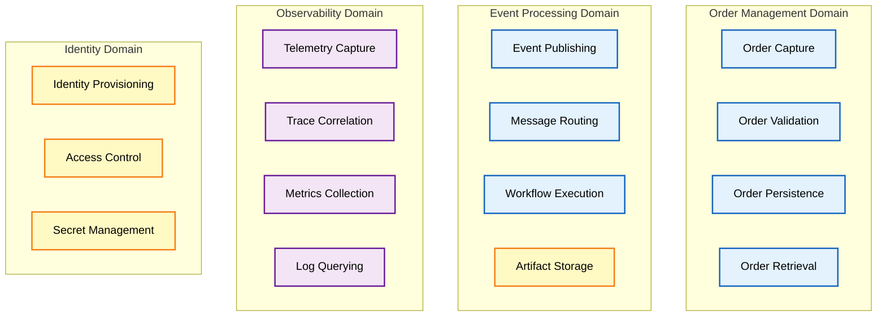

# Business Architecture

## Business Context

Modern distributed applications face critical operational visibility challenges. When services span microservices, message queues, and workflow engines, traditional logging fails to provide end-to-end request correlation. This creates extended incident resolution times and difficulty diagnosing failures across service boundaries.

This architecture addresses these challenges through comprehensive distributed tracing and zero-secrets security posture. It demonstrates how organizations can achieve operational excellence in event-driven systems while maintaining development velocity through local emulation capabilities.

**Business Drivers:**

- **Reduce MTTR**: Enable rapid root cause analysis through correlated distributed traces across all service boundaries
- **Eliminate Security Risks**: Remove connection strings and API keys from code through managed identity authentication
- **Accelerate Development**: Provide local development experience with full fidelity to production behaviors
- **Ensure Compliance**: Maintain audit trails and security posture required for enterprise deployments

## Business Capabilities

### Capability Definitions

**Order Management Domain** provides core business functionality for order lifecycle management. Order Capture accepts customer orders through web and API channels. Order Validation enforces business rules ensuring data quality. Order Persistence ensures transactional storage with ACID guarantees. Order Retrieval enables query operations for customer self-service.

**Event Processing Domain** enables asynchronous integration patterns. Event Publishing emits order lifecycle events to message broker. Message Routing distributes events to interested subscribers based on topic filters. Workflow Execution orchestrates multi-step processing through visual workflows. Artifact Storage persists execution results for audit requirements.

**Observability Domain** provides operational visibility across distributed services. Telemetry Capture instruments all application components with OpenTelemetry SDK. Trace Correlation propagates W3C Trace Context across service boundaries. Metrics Collection aggregates performance counters and business KPIs. Log Querying enables troubleshooting through structured log analysis.

**Identity Domain** delivers zero-secrets security architecture. Identity Provisioning creates user-assigned managed identities for services. Access Control assigns least-privilege RBAC permissions. Secret Management handles sensitive configuration through Key Vault integration.

## Stakeholder Analysis

| Stakeholder             | Primary Concerns                                                     | Architecture Touchpoints                                      |
| ----------------------- | -------------------------------------------------------------------- | ------------------------------------------------------------- |
| **Platform Engineers**  | Deployment reliability, infrastructure automation, cost optimization | Bicep modules, azd hooks, resource provisioning               |
| **Backend Developers**  | Development velocity, testing capabilities, observability tooling    | .NET Aspire orchestration, OpenTelemetry SDK, local emulators |
| **SREs**                | Service reliability, alert quality, incident response                | Application Insights, Log Analytics queries, health endpoints |
| **Solution Architects** | Scalability, maintainability, technology risk                        | TOGAF layers, integration patterns, technology choices        |
| **Security Teams**      | Credential exposure, compliance, audit trails                        | Managed Identity, zero-secrets design, telemetry retention    |

## Value Streams

### Order Management Value Stream

```mermaid
flowchart LR
    CustomerRequest[Customer Places Order] --> APIValidation[API Validates Request]
    APIValidation --> DBPersist[Database Persistence]
    DBPersist --> EventPublish[Event Published]
    EventPublish --> WorkflowTrigger[Workflow Triggered]
    WorkflowTrigger --> Processing[Order Processing]
    Processing --> APICallback[API Callback]
    APICallback --> CustomerConfirm[Customer Confirmation]

    classDef userAction fill:#E8EAF6,stroke:#3F51B5,stroke-width:2px,color:#000
    classDef systemAction fill:#E1F5FF,stroke:#0277BD,stroke-width:2px,color:#000
    classDef eventAction fill:#F1F8E9,stroke:#558B2F,stroke-width:2px,color:#000

    class CustomerRequest,CustomerConfirm userAction
    class APIValidation,DBPersist,APICallback systemAction
    class EventPublish,WorkflowTrigger,Processing eventAction
```

This value stream demonstrates end-to-end order processing from customer request through confirmation. Key value delivery points include: (1) Immediate validation feedback reducing customer errors, (2) Reliable persistence ensuring no order loss, (3) Asynchronous processing preventing UI blocking, (4) Workflow-driven enrichment enabling business rule changes without code deployment.

### Monitoring & Observability Value Stream

This value stream illustrates how distributed tracing accelerates incident resolution. Automatic instrumentation eliminates developer burden. W3C standard propagation ensures cross-service correlation. Centralized ingestion provides single pane of glass. Structured querying enables rapid hypothesis testing during incidents.

## Quality Attribute Requirements

| Quality Attribute   | Requirement                                                | Architecture Support                                                |
| ------------------- | ---------------------------------------------------------- | ------------------------------------------------------------------- |
| **Observability**   | All service boundaries must emit correlated traces         | OpenTelemetry SDK in ServiceDefaults, W3C Trace Context propagation |
| **Security**        | Zero secrets in code or configuration files                | User-Assigned Managed Identity for all Azure service connections    |
| **Scalability**     | Support 10x traffic growth without architecture changes    | Serverless compute (Container Apps), message broker decoupling      |
| **Resilience**      | Gracefully handle transient failures                       | Polly retry policies, Service Bus dead-letter queues                |
| **Maintainability** | Enable feature changes without infrastructure redeployment | Logic Apps visual workflows, configuration-driven behavior          |
| **Testability**     | Support local development without cloud dependencies       | .NET Aspire local emulators for SQL, Service Bus, Blob Storage      |

## Business Process Flows

**Order Creation Process**: Customer submits order through Web App → Blazor component invokes Orders API via typed HTTP client → API validates request business rules → EF Core persists to SQL Database → API publishes OrderPlaced event to Service Bus topic → Service Bus delivers message to Logic Apps subscription → Workflow retrieves order details via HTTP action → Workflow writes processing results to Blob Storage → Customer receives confirmation.

**Incident Investigation Process**: Alert triggers from Application Insights anomaly detection → SRE opens Log Analytics workspace → Engineer queries for specific trace ID → Distributed trace spans show request path across Orders API → SQL Database → Service Bus → Logic Apps workflow → Engineer identifies latency spike in database query operation → Root cause determined in 5 minutes vs. 45 minutes with traditional logging.

**Development Workflow Process**: Developer runs .NET Aspire AppHost locally → Aspire provisions Azurite blob emulator, Aspir SQL Server container, and Azure Service Bus emulator → Developer changes OrdersController logic → Hot reload applies changes without restart → Developer submits test order through local Blazor UI → Full request flow executes locally with telemetry collection → Developer validates changes before cloud deployment.

---

**Document Version:** 1.0.0  
**Last Updated:** 2025-01-07  
**TOGAF Phase:** Business Architecture (Phase B)
