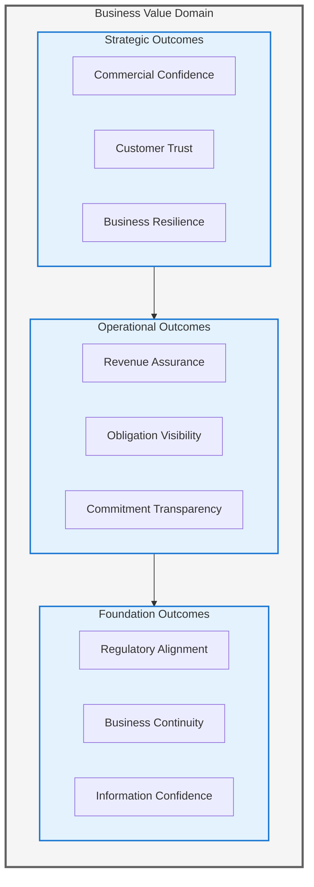
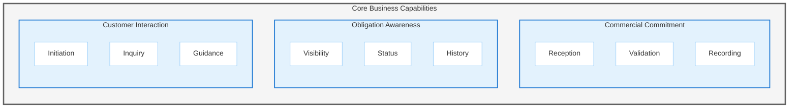
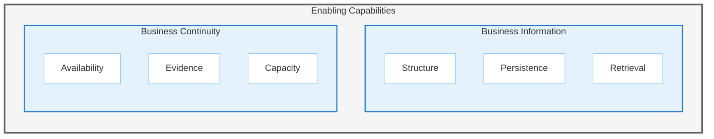
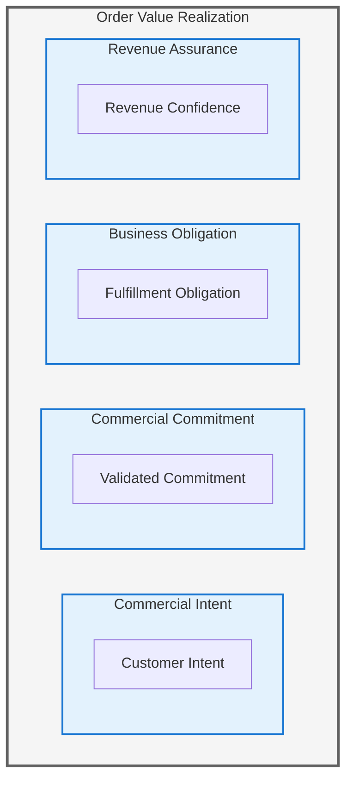
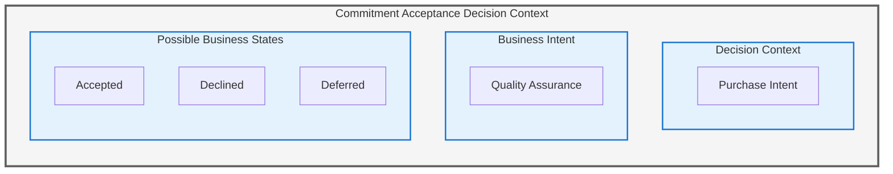
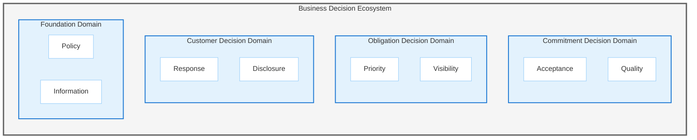
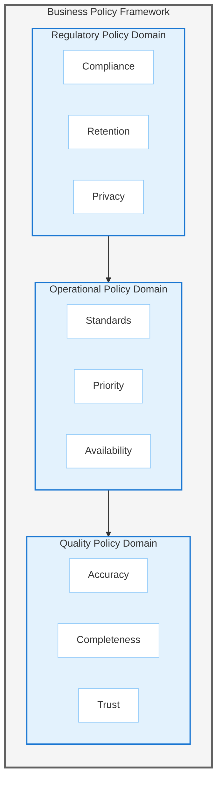
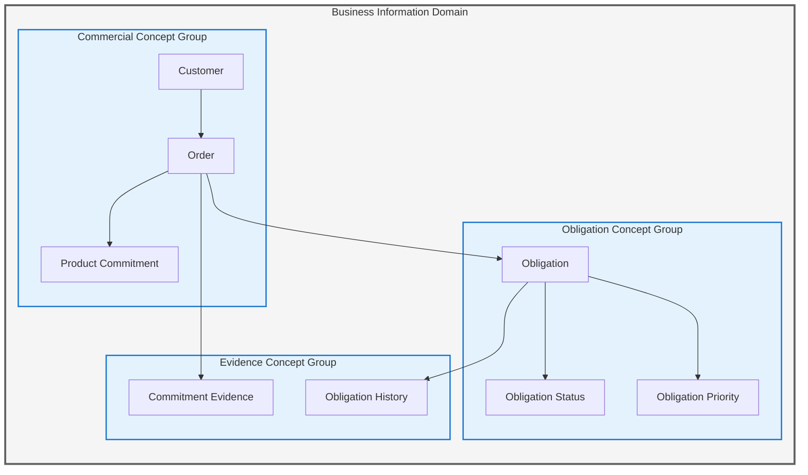

# Business Architecture

**Document Version:** 1.0  
**Last Updated:** January 8, 2026  
**Architecture Framework:** TOGAF 10  
**Architecture Phase:** Business Architecture (Phase B)  
**Status:** Approved for Review

---

## Executive Summary

This Business Architecture defines the commercial order fulfillment domain for an electronic commerce organization. The architecture establishes fundamental business capabilities, value states, and decision contexts that enable order-to-revenue realization.

The business serves customers through digital channels, establishing commercial commitments through order placement and fulfilling these commitments through structured coordination. The architecture remains technology-neutral, focusing on business intent, value creation, and organizational capability.

**Primary Business Outcomes:**

- Commercial commitment establishment
- Revenue realization confidence
- Customer value assurance
- Obligation fulfillment predictability

---

## Business Context and Problem Statement

### Business Context

The organization operates in the electronic commerce domain, creating value through digital commercial transactions. Customers initiate purchase commitments through digital channels, establishing obligations that require coordination across multiple business functions.

The business must maintain confidence in its ability to fulfill commitments, ensure revenue realization, and preserve customer trust through predictable obligation management.

### Problem Statement

The organization requires business capabilities that support:

1. **Commercial Commitment Establishment** — The ability to accept and validate customer purchase intent
2. **Obligation Management** — The capacity to maintain awareness of fulfillment commitments
3. **Revenue Realization Assurance** — Confidence that commercial transactions result in recognized revenue
4. **Value Delivery Confidence** — Trust that customer commitments receive appropriate attention

### Business Scope

**In Scope:**

- Order lifecycle business capabilities
- Commercial commitment management
- Customer interaction touchpoints
- Revenue realization foundations
- Business information concepts

**Out of Scope:**

- Physical product fulfillment operations
- Financial transaction settlement
- Inventory management
- Supplier relationships
- Customer identity management beyond basic information

---

## Stakeholders and Personas

### Primary Stakeholders

#### Executive Leadership

- **Concern:** Revenue predictability, business growth, strategic risk
- **Value Expectation:** Confidence in commercial commitment fulfillment
- **Decision Authority:** Strategic investment, capability prioritization

#### Business Operations

- **Concern:** Obligation visibility, fulfillment confidence, business continuity
- **Value Expectation:** Operational predictability
- **Decision Authority:** Process capability evolution

#### Customer Experience

- **Concern:** Customer trust, commitment transparency, value perception
- **Value Expectation:** Customer satisfaction confidence
- **Decision Authority:** Channel strategy, experience standards

#### Compliance and Risk

- **Concern:** Business obligation compliance, regulatory adherence
- **Value Expectation:** Audit confidence, regulatory alignment
- **Decision Authority:** Business rule boundaries

### Business Personas

#### Customer (External)

**Role:** Commercial commitment initiator  
**Responsibilities:**

- Purchase intent expression
- Commitment validation
- Obligation inquiry
- Value realization

**Needs:**

- Commitment transparency
- Obligation visibility
- Trust in fulfillment

#### Business Operator (Internal)

**Role:** Obligation steward  
**Responsibilities:**

- Commitment awareness
- Business decision support
- Exception recognition

**Needs:**

- Obligation visibility
- Decision context
- Business continuity

#### Business Analyst (Internal)

**Role:** Business insight consumer  
**Responsibilities:**

- Business pattern recognition
- Capability effectiveness understanding
- Strategic insight contribution

**Needs:**

- Business information access
- Pattern visibility
- Historical context

---

## Business Goals and Outcomes

### Strategic Goals

#### Goal 1: Commercial Confidence

Establish trust in the organization's ability to manage commercial commitments from inception through realization.

**Success Indicators:**

- Commitment visibility exists
- Obligation awareness is present
- Revenue recognition confidence is maintained

#### Goal 2: Customer Trust

Maintain customer confidence in commitment fulfillment through transparent obligation management.

**Success Indicators:**

- Commitment transparency is available
- Customer inquiry capability exists
- Value delivery predictability is present

#### Goal 3: Business Resilience

Ensure business capabilities remain available regardless of business volume or external conditions.

**Success Indicators:**

- Capability availability confidence
- Business continuity assurance
- Obligation preservation trust

#### Goal 4: Regulatory Alignment

Maintain confidence in business compliance with regulatory and policy obligations.

**Success Indicators:**

- Policy adherence evidence exists
- Regulatory boundary awareness is present
- Audit readiness confidence is maintained

### Business Outcomes

---

## Business Capability Map

### Definition and Validation

Each capability represents a fundamental business ability that:

- Survives organizational change
- Remains independent of technology
- Answers "What does the business do to create value?"
- Exists as a stable noun phrase

### Level 1 Capabilities

#### 1. Commercial Commitment

**Definition:** The business ability to establish, validate, and record customer purchase intent.

**Business Value:** Enables revenue opportunity recognition and customer relationship formation.

**Validation:** Without this capability, the business cannot establish commercial relationships or recognize potential revenue.

#### 2. Obligation Awareness

**Definition:** The business ability to maintain knowledge of commitments requiring fulfillment.

**Business Value:** Ensures commitment visibility and fulfillment confidence.

**Validation:** Without this capability, the business cannot track what it has committed to deliver.

#### 3. Customer Interaction

**Definition:** The business ability to enable customer communication and self-service inquiry.

**Business Value:** Provides customer trust and reduces inquiry burden.

**Validation:** Without this capability, customers cannot initiate commitments or verify obligation status.

#### 4. Business Information

**Definition:** The business ability to structure, persist, and retrieve business facts.

**Business Value:** Enables business decision making and obligation evidence.

**Validation:** Without this capability, the business cannot remember commitments or support decisions.

#### 5. Business Continuity

**Definition:** The business ability to maintain capability availability under varying conditions.

**Business Value:** Provides business resilience and operational confidence.

**Validation:** Without this capability, business operations become unpredictable and unreliable.

### Level 2 Capability Decomposition

#### Core Business Capabilities

#### Enabling Capabilities

### Capability Detail

#### Commercial Commitment

**Commitment Reception**

- **Definition:** Acceptance of customer purchase intent through available channels
- **Business Value:** Enables commercial opportunity recognition
- **Dependencies:** Customer Interaction, Business Information

**Commitment Validation**

- **Definition:** Verification that purchase intent meets business acceptance criteria
- **Business Value:** Ensures commitment quality and reduces business risk
- **Dependencies:** Business Information, Business Continuity

**Commitment Recording**

- **Definition:** Formal registration of validated commercial commitment
- **Business Value:** Establishes obligation evidence and revenue opportunity
- **Dependencies:** Business Information, Obligation Awareness

#### Obligation Awareness

**Obligation Visibility**

- **Definition:** Knowledge of what commitments exist and require attention
- **Business Value:** Enables fulfillment confidence and business planning
- **Dependencies:** Business Information, Business Continuity

**Obligation Status**

- **Definition:** Understanding of commitment fulfillment state
- **Business Value:** Supports customer inquiry and business decisions
- **Dependencies:** Business Information, Customer Interaction

**Obligation History**

- **Definition:** Preservation of commitment lifecycle evidence
- **Business Value:** Enables compliance confidence and pattern recognition
- **Dependencies:** Business Information, Business Continuity

#### Customer Interaction

**Commitment Initiation**

- **Definition:** Customer ability to express purchase intent
- **Business Value:** Enables revenue opportunity creation
- **Dependencies:** Commercial Commitment, Business Continuity

**Obligation Inquiry**

- **Definition:** Customer ability to understand commitment status
- **Business Value:** Maintains customer trust and reduces support burden
- **Dependencies:** Obligation Awareness, Business Information

**Customer Guidance**

- **Definition:** Business ability to inform customer decision making
- **Business Value:** Improves commitment quality and customer satisfaction
- **Dependencies:** Business Information, Business Continuity

#### Business Information

**Information Structure**

- **Definition:** Definition of business fact organization and relationships
- **Business Value:** Enables consistent business understanding
- **Dependencies:** Business domain knowledge

**Information Persistence**

- **Definition:** Long-term preservation of business facts
- **Business Value:** Maintains business memory and evidence
- **Dependencies:** Business Continuity

**Information Retrieval**

- **Definition:** Access to business facts when needed for decisions
- **Business Value:** Enables all dependent capabilities
- **Dependencies:** Information Structure, Information Persistence

#### Business Continuity

**Capability Availability**

- **Definition:** Business ability to perform capabilities when needed
- **Business Value:** Ensures business predictability and customer trust
- **Dependencies:** Foundational business infrastructure

**Business Evidence**

- **Definition:** Preservation of capability execution artifacts
- **Business Value:** Supports compliance and business learning
- **Dependencies:** Business Information

**Capacity Assurance**

- **Definition:** Confidence that capabilities scale with business demand
- **Business Value:** Supports business growth and resilience
- **Dependencies:** Capability Availability

---

## Business Value Streams

### Definition

Value Streams represent states of value realization, expressed as noun phrases. They do NOT represent workflows, processes, or execution stages.

### Order Value Stream

The Order Value Stream represents the progression of value states from commercial intent through revenue realization.

#### Value State Definitions

**Commercial Intent Existence**

- **State Definition:** A customer has formed purchase intent
- **Business Significance:** Revenue opportunity awareness
- **Prerequisites:** None — initial state
- **Value Evidence:** Customer interaction artifacts

**Validated Commitment Evidence**

- **State Definition:** Purchase intent has met business acceptance criteria
- **Business Significance:** Commercial relationship establishment
- **Prerequisites:** Commercial Intent Existence
- **Value Evidence:** Commitment validation artifacts

**Fulfillment Obligation Awareness**

- **State Definition:** Business recognizes delivery commitment
- **Business Significance:** Obligation tracking and fulfillment planning
- **Prerequisites:** Validated Commitment Evidence
- **Value Evidence:** Obligation registration artifacts

**Revenue Recognition Confidence**

- **State Definition:** Business has assurance of revenue realization
- **Business Significance:** Financial commitment and reporting confidence
- **Prerequisites:** Fulfillment Obligation Awareness
- **Value Evidence:** Revenue assurance artifacts

---

## Business Decision Models

### Definition

Business Decision Models represent decision contexts and possible outcomes. They are NON-SEQUENTIAL and do NOT represent workflows or execution.

### Commitment Acceptance Decision

**Decision Context:** Determining whether customer purchase intent meets business acceptance criteria.

**Business Intent:** Ensure commitment quality and reduce business risk.

**Decision Participants:** Commercial Commitment capability, Business Information capability

**Decision Inputs:**

- Customer purchase intent
- Business acceptance policy
- Current business constraints

**Possible Outcomes:**

| Outcome                 | Business State                                  | Business Consequence              |
| ----------------------- | ----------------------------------------------- | --------------------------------- |
| **Commitment Accepted** | Purchase intent becomes validated commitment    | Business obligation establishment |
| **Commitment Declined** | Purchase intent remains unvalidated             | No business obligation creation   |
| **Commitment Deferred** | Purchase intent requires additional information | Decision postponement             |

**Business Rules Applied:**

- Commitment Validation Policy
- Business Capacity Boundary
- Customer Relationship Status

### Obligation Priority Decision

**Decision Context:** Determining relative importance of fulfillment obligations.

**Business Intent:** Optimize value delivery and resource allocation.

**Decision Participants:** Obligation Awareness capability, Business Information capability

**Decision Inputs:**

- Existing obligations
- Business priority policy
- Customer relationship value
- Commitment age

**Possible Outcomes:**

| Outcome               | Business State                           | Business Consequence             |
| --------------------- | ---------------------------------------- | -------------------------------- |
| **Priority Elevated** | Obligation receives heightened attention | Preferential capacity allocation |
| **Priority Standard** | Obligation receives normal attention     | Standard capacity allocation     |
| **Priority Deferred** | Obligation receives reduced attention    | Delayed capacity allocation      |

**Business Rules Applied:**

- Obligation Priority Policy
- Customer Value Classification
- Commitment Age Boundary

### Customer Inquiry Response Decision

**Decision Context:** Determining appropriate response to customer obligation inquiry.

**Business Intent:** Maintain customer trust while protecting business resources.

**Decision Participants:** Customer Interaction capability, Obligation Awareness capability

**Decision Inputs:**

- Customer inquiry intent
- Obligation existence
- Obligation visibility permission
- Customer relationship status

**Possible Outcomes:**

| Outcome                   | Business State                           | Business Consequence  |
| ------------------------- | ---------------------------------------- | --------------------- |
| **Information Disclosed** | Customer receives obligation status      | Trust maintenance     |
| **Information Withheld**  | Customer receives limited information    | Privacy protection    |
| **Inquiry Redirected**    | Customer directed to alternative channel | Resource optimization |

**Business Rules Applied:**

- Information Disclosure Policy
- Customer Privacy Boundary
- Inquiry Channel Policy

---

## Business Rules and Policies

### Business Rule Categories

#### Commitment Rules

**CR-001: Commitment Completeness Obligation**  
**Rule:** Customer purchase intent must include all mandatory commitment elements.  
**Business Rationale:** Ensures commitment validity and fulfillment feasibility.  
**Enforcement:** Commitment Reception, Commitment Validation

**CR-002: Commitment Uniqueness Boundary**  
**Rule:** Duplicate commitments are not permitted within defined temporal boundaries.  
**Business Rationale:** Prevents business confusion and customer dissatisfaction.  
**Enforcement:** Commitment Validation

**CR-003: Commitment Evidence Obligation**  
**Rule:** All validated commitments must have auditable evidence.  
**Business Rationale:** Supports compliance and dispute resolution confidence.  
**Enforcement:** Commitment Recording, Business Evidence

#### Obligation Rules

**OR-001: Obligation Visibility Boundary**  
**Rule:** Obligation information disclosure respects customer privacy policy.  
**Business Rationale:** Maintains customer trust and regulatory compliance.  
**Enforcement:** Obligation Inquiry, Information Disclosure

**OR-002: Obligation Retention Obligation**  
**Rule:** Obligation evidence must persist for regulatory retention periods.  
**Business Rationale:** Ensures compliance confidence and audit readiness.  
**Enforcement:** Information Persistence, Business Evidence

**OR-003: Obligation Priority Consistency**  
**Rule:** Priority assignment follows defined business priority policy.  
**Business Rationale:** Ensures fair treatment and predictable behavior.  
**Enforcement:** Obligation Priority Decision

#### Customer Interaction Rules

**CIR-001: Customer Identity Verification Boundary**  
**Rule:** Sensitive obligation information requires customer identity confidence.  
**Business Rationale:** Protects customer privacy and business reputation.  
**Enforcement:** Customer Inquiry Response, Information Disclosure

**CIR-002: Customer Communication Transparency Obligation**  
**Rule:** Customer-facing information must be truthful and complete.  
**Business Rationale:** Maintains customer trust and regulatory compliance.  
**Enforcement:** Customer Guidance, Obligation Inquiry

**CIR-003: Customer Channel Availability Assurance**  
**Rule:** Customer interaction capabilities must maintain defined availability.  
**Business Rationale:** Ensures customer trust and business accessibility.  
**Enforcement:** Capability Availability, Business Continuity

#### Business Information Rules

**BIR-001: Information Accuracy Obligation**  
**Rule:** Business information must reflect business reality.  
**Business Rationale:** Enables correct business decisions and maintains trust.  
**Enforcement:** Information Structure, Information Persistence

**BIR-002: Information Consistency Boundary**  
**Rule:** Related business information must remain logically consistent.  
**Business Rationale:** Prevents business confusion and erroneous decisions.  
**Enforcement:** Information Structure, Information Retrieval

**BIR-003: Information Auditability Obligation**  
**Rule:** Information changes must have auditable evidence.  
**Business Rationale:** Supports compliance confidence and business learning.  
**Enforcement:** Business Evidence, Information Persistence

### Policy Framework

---

## Business Information Concepts

### Ubiquitous Language

The following business concepts form the shared vocabulary of the order management domain.

#### Order

**Business Definition:** A validated commercial commitment between customer and business representing purchase intent and fulfillment obligation.

**Business Significance:** Orders are the fundamental unit of commercial value and business obligation.

**Concept Relationships:**

- Originated by: Customer
- Contains: Product Commitment (one or many)
- Has: Obligation Status
- Governed by: Commitment Rules, Obligation Rules

**Information Characteristics:**

- Unique identification within business domain
- Temporal existence (commitment date, obligation period)
- Value representation (commercial value, revenue implication)
- State awareness (commitment validation, obligation status)

#### Customer

**Business Definition:** An external party capable of initiating commercial commitments with the business.

**Business Significance:** Customers are the source of commercial intent and revenue opportunity.

**Concept Relationships:**

- Initiates: Order (zero or many)
- Has: Customer Relationship Status
- Governed by: Customer Interaction Rules, Privacy Boundary

**Information Characteristics:**

- Unique identification within business domain
- Contact enablement (communication capability)
- Relationship history (commitment patterns)
- Trust classification (customer standing)

#### Product Commitment

**Business Definition:** A specific item or service within an Order representing a discrete fulfillment obligation.

**Business Significance:** Product Commitments are the granular units of business obligation.

**Concept Relationships:**

- Part of: Order (exactly one)
- References: Product (catalog item)
- Has: Quantity, Price Agreement
- Governed by: Commitment Rules

**Information Characteristics:**

- Product identification
- Quantity commitment
- Price agreement
- Fulfillment expectation

#### Obligation

**Business Definition:** A business responsibility to deliver value corresponding to a commercial commitment.

**Business Significance:** Obligations represent business accountability and fulfillment tracking.

**Concept Relationships:**

- Corresponds to: Order (one-to-one)
- Has: Status, Priority, Evidence
- Governed by: Obligation Rules, Priority Policy

**Information Characteristics:**

- Obligation identification
- Status representation
- Priority classification
- Evidence references

#### Commitment Evidence

**Business Definition:** Artifacts that provide auditable proof of commercial commitment existence and lifecycle events.

**Business Significance:** Evidence supports compliance, dispute resolution, and business learning.

**Concept Relationships:**

- Documents: Order, Obligation
- Governed by: Evidence Obligation, Retention Policy
- Required for: Compliance Confidence, Audit Readiness

**Information Characteristics:**

- Evidence identification
- Temporal markers (creation timestamp)
- Immutability assurance
- Retention period

### Information Concept Model

---

## Scope, Assumptions, and Constraints

### Business Scope

#### Included Business Domains

- Order commitment lifecycle
- Customer commercial interaction
- Obligation awareness and inquiry
- Business information foundations
- Business evidence and compliance

#### Excluded Business Domains

- Physical product fulfillment execution
- Financial settlement and payment processing
- Product catalog management
- Inventory and supply chain
- Customer identity and access management
- Marketing and customer acquisition

### Assumptions

**A-001: Customer Access**  
Customers have access to digital interaction channels capable of expressing commercial intent.

**A-002: Product Catalog Existence**  
A product catalog exists and is maintained outside this business domain.

**A-003: Payment Settlement**  
Financial transaction settlement occurs outside this business domain but coordinates with commitment establishment.

**A-004: Fulfillment Capability**  
Physical fulfillment capabilities exist outside this business domain and consume obligation information.

**A-005: Business Information Infrastructure**  
Foundational capabilities for information persistence and retrieval exist.

**A-006: Business Continuity Foundation**  
Infrastructure exists to support business capability availability.

**A-007: Regulatory Environment**  
The business operates within an established regulatory framework requiring commitment evidence retention.

**A-008: Customer Relationship**  
Basic customer identification and relationship status is available from external capabilities.

### Constraints

**C-001: Regulatory Compliance Boundary**  
All business capabilities must maintain compliance with applicable regulatory requirements.

**C-002: Privacy Protection Boundary**  
Customer information disclosure must respect privacy policy and regulatory boundaries.

**C-003: Business Resource Boundary**  
Capabilities must operate within available business resource constraints.

**C-004: Business Policy Adherence**  
All business decisions must align with established business policy.

**C-005: Information Accuracy Obligation**  
Business information must maintain accuracy sufficient for business decisions.

**C-006: Evidence Retention Obligation**  
Commitment and obligation evidence must persist for defined retention periods.

**C-007: Customer Trust Imperative**  
Business capabilities must maintain and enhance customer trust.

**C-008: Business Continuity Expectation**  
Capabilities must remain available within defined business continuity boundaries.

---

## Non-Functional Business Requirements

### Business Quality Attributes

#### Predictability

The business requires confidence that capabilities will behave consistently under similar business conditions.

**Business Value:** Enables business planning and customer trust maintenance.

**Applies To:** All business capabilities

#### Transparency

The business requires visibility into capability behavior and business state.

**Business Value:** Supports business decisions and customer confidence.

**Applies To:** Commercial Commitment, Obligation Awareness, Customer Interaction

#### Resilience

The business requires capabilities to maintain availability under varying business conditions.

**Business Value:** Ensures business continuity and customer accessibility.

**Applies To:** All customer-facing and obligation-critical capabilities

#### Compliance

The business requires confidence in regulatory and policy adherence.

**Business Value:** Maintains business license to operate and customer trust.

**Applies To:** Business Evidence, Information Persistence, Customer Interaction

#### Scalability

The business requires confidence that capabilities remain effective as business needs evolve.

**Business Value:** Supports business growth confidence and operational predictability.

**Applies To:** Commercial Commitment, Obligation Awareness, Business Information

### Business Quality Requirements

**BQR-001: Capability Availability Confidence**  
Business capabilities must maintain availability sufficient for business needs under normal business conditions.

**BQR-002: Information Currency Assurance**  
Business information must reflect business reality with sufficient currency for business decisions.

**BQR-003: Customer Response Predictability**  
Customer interactions must receive responses with predictability that maintains customer trust.

**BQR-004: Evidence Completeness Assurance**  
Business evidence must be complete enough to support compliance confidence and dispute resolution.

**BQR-005: Business Capacity Awareness**  
The business must have visibility into capability readiness relative to business obligations.

**BQR-006: Privacy Protection Confidence**  
Customer information handling must provide confidence in privacy boundary respect.

**BQR-007: Business Continuity Assurance**  
Critical business capabilities must have continuity provisions that maintain business viability.

**BQR-008: Decision Consistency Confidence**  
Similar business situations must produce consistent decisions within defined policy boundaries.

---

## Traceability Matrix

### Capabilities to Goals Mapping

| Business Capability   | Strategic Goals                            | Business Outcomes                              |
| --------------------- | ------------------------------------------ | ---------------------------------------------- |
| Commercial Commitment | Commercial Confidence, Customer Trust      | Revenue Assurance, Commitment Transparency     |
| Obligation Awareness  | Commercial Confidence, Business Resilience | Obligation Visibility, Business Continuity     |
| Customer Interaction  | Customer Trust, Business Resilience        | Commitment Transparency, Customer Satisfaction |
| Business Information  | All Goals                                  | Information Confidence, Regulatory Alignment   |
| Business Continuity   | Business Resilience, Regulatory Alignment  | Business Continuity, Capability Availability   |

### Value Streams to Capabilities Mapping

| Value Stream State               | Required Capabilities                       | Business Rules         |
| -------------------------------- | ------------------------------------------- | ---------------------- |
| Commercial Intent Existence      | Customer Interaction, Business Information  | CIR-001, CIR-002       |
| Validated Commitment Evidence    | Commercial Commitment, Business Information | CR-001, CR-002, CR-003 |
| Fulfillment Obligation Awareness | Obligation Awareness, Business Information  | OR-001, OR-002, OR-003 |
| Revenue Recognition Confidence   | Obligation Awareness, Business Evidence     | OR-002, BIR-003        |

### Decision Models to Capabilities Mapping

| Decision Model            | Required Capabilities                       | Business Rules Applied |
| ------------------------- | ------------------------------------------- | ---------------------- |
| Commitment Acceptance     | Commercial Commitment, Business Information | CR-001, CR-002         |
| Obligation Priority       | Obligation Awareness, Business Information  | OR-003                 |
| Customer Inquiry Response | Customer Interaction, Obligation Awareness  | CIR-001, OR-001        |

### Business Rules to Policies Mapping

| Business Rule Category     | Policy Domain                         | Stakeholder Concern                       |
| -------------------------- | ------------------------------------- | ----------------------------------------- |
| Commitment Rules           | Operational Policy, Quality Policy    | Executive Leadership, Business Operations |
| Obligation Rules           | Operational Policy, Regulatory Policy | Business Operations, Compliance and Risk  |
| Customer Interaction Rules | Quality Policy, Regulatory Policy     | Customer Experience, Compliance and Risk  |
| Business Information Rules | Quality Policy, Regulatory Policy     | All Stakeholders                          |

---

## Risks and Open Questions

### Business Risks

**BR-001: Customer Trust Erosion**  
**Risk:** Inadequate commitment transparency or fulfillment visibility degrades customer trust.  
**Impact:** Revenue reduction, customer relationship damage  
**Mitigation:** Strong Customer Interaction and Obligation Awareness capabilities

**BR-002: Regulatory Non-Compliance**  
**Risk:** Insufficient evidence retention or policy adherence creates compliance exposure.  
**Impact:** Regulatory penalty, business license risk  
**Mitigation:** Robust Business Evidence and Information Persistence capabilities

**BR-003: Business Continuity Failure**  
**Risk:** Capability unavailability prevents commercial commitment or obligation awareness.  
**Impact:** Revenue loss, customer dissatisfaction, business reputation damage  
**Mitigation:** Strong Business Continuity capability with appropriate provisions

**BR-004: Commitment Quality Degradation**  
**Risk:** Inadequate commitment validation creates fulfillment burden or customer dissatisfaction.  
**Impact:** Operational cost increase, customer trust erosion  
**Mitigation:** Rigorous Commitment Validation capability and business rules enforcement

**BR-005: Information Integrity Loss**  
**Risk:** Inaccurate business information leads to incorrect business decisions.  
**Impact:** Business confidence loss, potential compliance exposure  
**Mitigation:** Strong Business Information capability with accuracy and consistency enforcement

### Open Questions

**OQ-001: Customer Identity Authority**  
**Question:** What external capability provides customer identity and relationship status?  
**Impact:** Affects Customer Interaction and Customer Inquiry Response decision  
**Resolution Needed:** Architecture Phase C (Information Systems Architecture)

**OQ-002: Product Catalog Integration**  
**Question:** How does product information integrate with commitment establishment?  
**Impact:** Affects Commitment Validation and Product Commitment information concept  
**Resolution Needed:** Architecture Phase C (Information Systems Architecture)

**OQ-003: Financial Settlement Coordination**  
**Question:** What coordination exists between commitment establishment and payment settlement?  
**Impact:** Affects Revenue Recognition Confidence value state  
**Resolution Needed:** Enterprise Architecture Scope Definition

**OQ-004: Fulfillment Coordination Boundary**  
**Question:** Where is the boundary between obligation awareness and physical fulfillment execution?  
**Impact:** Affects Obligation Awareness capability scope  
**Resolution Needed:** Enterprise Architecture Scope Definition

**OQ-005: Business Volume Predictability**  
**Question:** What business volume patterns should capability design accommodate?  
**Impact:** Affects Capacity Assurance and Business Continuity requirements  
**Resolution Needed:** Architecture Phase E (Opportunities and Solutions)

**OQ-006: Evidence Retention Period**  
**Question:** What specific retention periods apply to different evidence types?  
**Impact:** Affects Business Evidence capability and Information Persistence  
**Resolution Needed:** Compliance and Risk stakeholder clarification

**OQ-007: Customer Communication Channels**  
**Question:** What communication channels must Customer Interaction support?  
**Impact:** Affects Customer Interaction capability decomposition  
**Resolution Needed:** Architecture Phase C (Information Systems Architecture)

**OQ-008: Priority Policy Specificity**  
**Question:** What specific criteria determine obligation priority classification?  
**Impact:** Affects Obligation Priority decision model  
**Resolution Needed:** Business Operations stakeholder clarification

---

## Appendix: Diagram Legend and Notation

### Mermaid Diagram Conventions

All diagrams in this Business Architecture follow strict architectural conventions:

#### Purpose

- Diagrams represent **business structure**, NOT execution or workflows
- Diagrams are **non-executable** and cannot be followed step-by-step
- Arrows represent **relationships**, NOT sequence or flow

#### Diagram Types Used

**Business Outcome Diagrams**

- Purpose: Show strategic, operational, and foundation outcome relationships
- Notation: Boxes represent business states or conditions
- Reading: Relationships show conceptual dependencies, not progression

**Business Capability Map Diagrams**

- Purpose: Show business capability organization and decomposition
- Notation: Boxes represent stable business abilities
- Reading: Nesting shows capability decomposition, not dependency

**Value Stream Diagrams**

- Purpose: Show business value state progression
- Notation: Boxes represent value existence states (nouns only)
- Reading: Arrows show value state relationships, not process flow

**Decision Model Diagrams**

- Purpose: Show business decision context and possible outcomes
- Notation: Boxes represent decision contexts and resulting business states
- Reading: Relationships show decision scope, not sequence

**Policy Framework Diagrams**

- Purpose: Show business policy organization and domain relationships
- Notation: Boxes represent policy domains and specific policies
- Reading: Relationships show policy hierarchy, not application order

**Information Concept Diagrams**

- Purpose: Show business information organization and relationships
- Notation: Boxes represent business concepts (ubiquitous language)
- Reading: Arrows show concept relationships, not data flow

### Global Color Coding System

**CRITICAL: All diagrams use a standardized, globally-consistent color palette.**

Each grouping level uses the SAME colors across ALL diagrams to enforce visual hierarchy and architectural consistency.

**Level 1 — Overall Business Boundary**

- Background: `#f5f5f5` (very light gray)
- Border: `#616161` (dark gray)
- Stroke Width: 3px
- Purpose: Establish architectural scope
- **Used in:** ALL diagrams (exactly one Level 1 per diagram)

**Level 2 — Business Domain / Value Area**

- Background: `#e3f2fd` (light blue)
- Border: `#1976d2` (blue)
- Stroke Width: 2px
- Purpose: Separate major business concerns
- **Used in:** ALL diagrams (represents domains, value areas, major responsibility boundaries)

**Level 3 — Capability / Value / Decision Group**

- Background: `#ffffff` (white)
- Border: `#90caf9` (light blue)
- Stroke Width: 1px
- Purpose: Show architectural structure detail
- **Used in:** Capability Map, Decision Ecosystem, Policy Framework

**Color Hierarchy Invariants:**

1. Visual "weight" decreases with depth (Level 1 is darkest, Level 3 is lightest)
2. All colors remain in the blue-gray family for professional consistency
3. Each level is immediately distinguishable from adjacent levels
4. High contrast maintained for GitHub rendering

### Diagram Density and Readability Enforcement

**CRITICAL: Readability is a non-negotiable architectural requirement.**

All diagrams MUST pass these hard invariants:

**Density Limits (MANDATORY)**

- Maximum nodes per diagram: **12**
- Preferred nodes per diagram: **6–10**
- Maximum subgraphs per diagram: **5**
- Maximum grouping depth: **3 levels** (Level 4 DISALLOWED)
- Violation → diagram is INVALID, must be split or simplified

**Readability Invariants (MANDATORY)**

A diagram MUST:

- Be readable at GitHub default zoom (100%) without strain
- Be understandable by business stakeholder in **5–10 seconds**
- Fit within single laptop screen without scrolling
- Require NO verbal explanation to grasp intent

**Label Enforcement (STRICT)**

- Maximum label length: **5 words**
- Preferred label length: **2–4 words**
- Labels MUST use common business language only
- Labels MUST NOT include: compound concepts, explanations, parenthetical clarifications

**Cognitive Load Gate (MANDATORY)**

If diagram contains:

- Too many nodes to scan comfortably
- Too many groups to hold in short-term memory
- Visual competition between elements

→ Reduce detail, split diagram, or elevate abstraction  
→ **Clarity ALWAYS overrides completeness**

**Final Readability Gate**

Before outputting ANY diagram, internally answer:

_"Would this diagram still be clear if viewed briefly in a document review meeting?"_

If NO → simplify or regenerate. Do NOT output diagrams that fail this test.

### v2.1 Non-Sequential Semantics Enforcement

**CRITICAL: Value Stream and Decision Model diagrams MUST NOT imply sequence or flow.**

**Non-Sequential Visual Rules (MANDATORY)**

Business Value Stream and Business Decision Model diagrams MUST:

- Represent concepts as **peer structures** without directional relationships
- Use **grouping only** to show conceptual organization
- NEVER use arrows between groups (even with noun labels)
- Avoid visual patterns suggesting progression, dependency, or execution order

**Prohibited Patterns:**

- ❌ `A --> B` (directional flow)
- ❌ `A -.-> B` (dotted progression)
- ❌ Left-to-right layouts suggesting sequence
- ❌ Cascading structures implying order

**Allowed Patterns:**

- ✅ Grouped peer concepts without connectors
- ✅ Parallel vertical/horizontal layouts
- ✅ Conceptual containment (subgraphs only)

**Rationale:** Value Streams represent states of value existence, NOT workflows. Decision Models represent decision contexts, NOT decision processes.

**Enforcement:** Any diagram violating non-sequential semantics is INVALID and must be regenerated at higher abstraction.

### Notation Rules

**Boxes**

- Represent business concepts, capabilities, states, or decision contexts
- Labels are noun phrases (no verbs)
- Size and shape have no significance

**Arrows**

- Represent relationships, dependencies, or conceptual progression
- Do NOT represent sequence, flow, or execution
- Direction shows dependency or relationship nature

**Grouping (Subgraphs)**

- Represent conceptual boundaries or domains
- Do NOT represent execution layers or stages
- Maximum 4 levels of nesting

### Reading Guidelines

1. **Do NOT read diagrams as workflows** — they represent structure, not execution
2. **Arrows show relationships** — not "what happens next"
3. **Grouping shows organization** — not sequence or priority
4. **Colors indicate abstraction level** — not status or type
5. **Labels are precise business language** — from ubiquitous language

### Diagram Validation Principles

All diagrams pass the **Binary Executability Test**:

- Question: "Could a person follow this diagram step-by-step to do work?"
- If YES → the diagram is INVALID as business architecture
- If NO → the diagram correctly represents business structure

All diagrams respect **GitHub Mermaid Compatibility**:

- All colors use hex format with `#` prefix
- Conservative syntax appropriate for GitHub rendering
- Maximum 4 levels of subgraph nesting
- Labels contain only letters, spaces, and minimal punctuation

---

## Document Approval

**Business Architecture Owner:** [Name / Role]  
**Review Date:** [Date]  
**Approval Status:** Pending Review

**Reviewers:**

- Executive Leadership: **\*\***\_\_\_**\*\***
- Business Operations: **\*\***\_\_\_**\*\***
- Customer Experience: **\*\***\_\_\_**\*\***
- Compliance and Risk: **\*\***\_\_\_**\*\***
- Enterprise Architecture: **\*\***\_\_\_**\*\***

**Next Steps:**

- Architecture Phase C: Information Systems Architecture
- Architecture Phase D: Technology Architecture
- Architecture Phase E: Opportunities and Solutions

---

**Document Control**

- **Template Version:** TOGAF BDAT Business Architecture v2.0
- **Architecture Framework:** TOGAF 10
- **Generated By:** GitHub Copilot (Claude Sonnet 4.5)
- **Generated Date:** January 8, 2026

---

_This document represents PURE Business Architecture conforming to TOGAF Architecture Development Method (ADM) Phase B. All content is technology-agnostic, execution-independent, and focused on business capabilities, value, and intent._
