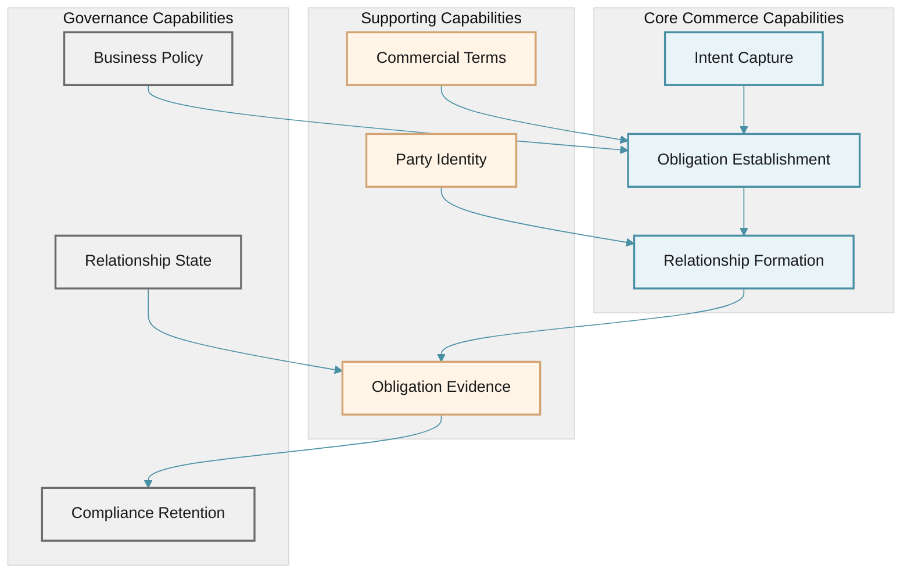
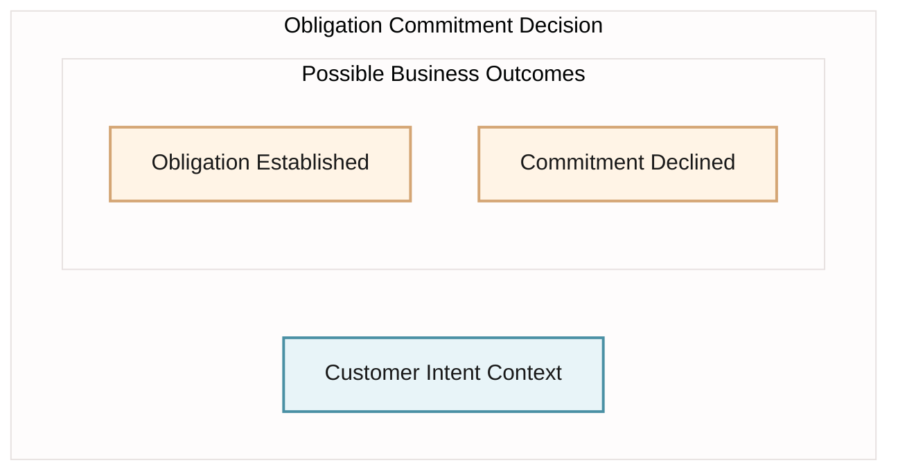
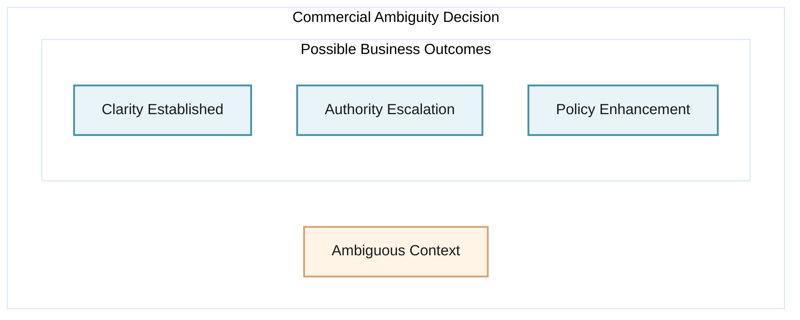
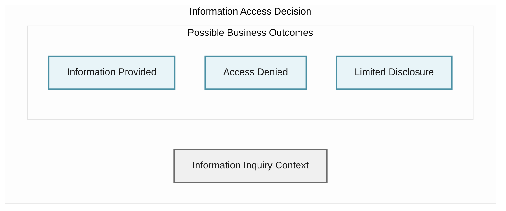
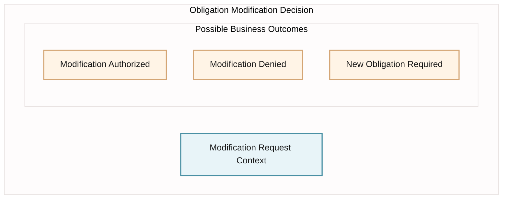
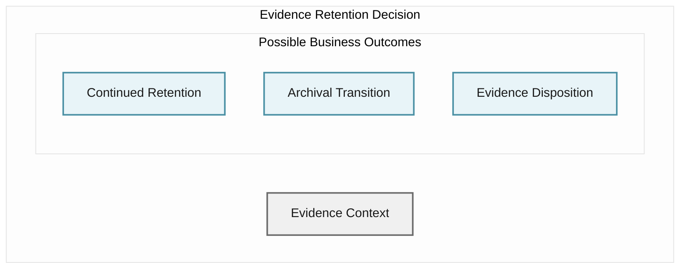

# Business Architecture

## Executive Summary

This Business Architecture defines the fundamental capabilities, value streams, and business structures enabling commerce through order management. The architecture establishes a foundation for strategic planning, capability investment, and business transformation independent of implementation choices.

The business exists to enable customer-initiated commercial transactions through order capture, fulfillment coordination, and outcome transparency. This architecture articulates the enduring business capabilities required to deliver value, the mechanisms by which value flows from customer intent to business obligation, and the business rules governing commercial interactions.

**Strategic Business Outcomes:**

- Revenue Certainty through obligation capture
- Customer Confidence through transaction transparency
- Operational Predictability through structured commerce
- Regulatory Compliance through evidence retention

**Architectural Scope:**
This architecture addresses the complete order management business domain from customer intent expression through obligation evidence availability.

---

## Business Context and Problem Statement

### Business Context

The organization operates in a commercial environment requiring structured mechanisms for customers to express purchasing intent and for the business to establish, record, and evidence commercial obligations. The business must provide transparency into commercial relationships while maintaining evidence sufficient for regulatory and business purposes.

### Problem Statement

**Business Challenge:**
The organization requires enduring capabilities to capture customer commercial intent, establish verifiable business obligations, and provide transparency into commercial relationship states. These capabilities must exist independently of operational structure, technology choices, or process implementations.

**Business Opportunity:**
Establish a capability foundation supporting multiple commerce models, customer channels, and regulatory environments while maintaining business continuity through organizational and operational change.

**Business Imperatives:**

- Capture all customer commercial intent without loss
- Establish verifiable business obligations
- Provide transparency into commercial relationships
- Maintain evidence for regulatory and business purposes
- Support business continuity through change

---

## Stakeholders and Personas

### Primary Stakeholders

**Business Executive Stakeholders:**

- Chief Revenue Officer — Revenue certainty and predictability
- Chief Operating Officer — Operational consistency and efficiency
- Chief Compliance Officer — Regulatory adherence and evidence sufficiency
- Chief Customer Officer — Customer confidence and satisfaction

**Business Operational Stakeholders:**

- Order Management Leadership — Capability maturity and performance
- Customer Service Leadership — Customer inquiry resolution
- Finance Leadership — Revenue recognition and reconciliation
- Legal Leadership — Contractual obligation evidence

### Business Personas

**Customer Persona:**

- **Intent**: Express purchasing intent through convenient channels
- **Need**: Confidence in obligation establishment and fulfillment commitment
- **Expectation**: Transparency into commercial relationship state

**Business Operations Persona:**

- **Intent**: Execute business obligations with certainty
- **Need**: Clear visibility into obligation state and exception context
- **Expectation**: Capability to resolve ambiguous commercial situations

**Business Analyst Persona:**

- **Intent**: Understand commercial performance and patterns
- **Need**: Access to commercial relationship evidence and outcomes
- **Expectation**: Consistent information structure across commercial interactions

**Compliance Officer Persona:**

- **Intent**: Demonstrate regulatory adherence
- **Need**: Evidence of commercial relationship management
- **Expectation**: Complete audit trail of business decisions

---

## Business Goals, Outcomes, and KPIs

### Strategic Business Goals

**G1: Revenue Assurance**
Establish and maintain verifiable commercial obligations representing revenue commitments.

**G2: Customer Confidence**
Provide customers with certainty regarding commercial relationship state and fulfillment commitment.

**G3: Operational Predictability**
Enable consistent business execution across commercial interactions regardless of complexity.

**G4: Regulatory Adherence**
Maintain evidence structures sufficient for regulatory examination and business verification.

**G5: Business Resilience**
Sustain commercial capabilities through organizational, operational, and technological change.

### Business Outcomes

**Revenue Certainty:**

- All commercial intent captured and converted to verifiable obligations
- Revenue commitments evidenced and traceable
- Financial position accurately reflected

**Customer Confidence:**

- Customers understand commercial relationship state
- Commercial commitments clearly communicated
- Exception contexts transparently conveyed

**Obligation Commitment:**

- Business obligations clearly established
- Fulfillment commitments clearly stated
- Exception boundaries clearly defined

**Evidence Availability:**

- Commercial decisions evidenced
- Relationship state history available
- Regulatory examination supported

### Business KPIs

**Revenue Assurance Measures:**

- Percentage of commercial intent establishing obligations
- Confidence interval for revenue commitment accuracy
- Business obligation verification completeness

**Customer Confidence Measures:**

- Customer certainty in commercial relationship understanding
- Clarity of business commitment communication
- Customer satisfaction with commercial transparency

**Operational Predictability Measures:**

- Consistency of obligation establishment approach
- Predictability of commercial outcome patterns
- Business rule adherence consistency

**Regulatory Compliance Measures:**

- Evidence completeness for regulatory requirements
- Audit trail continuity and integrity
- Compliance posture confidence

---

## Business Capability Map

Business capabilities represent the fundamental abilities required to execute the business mission. These capabilities are technology-agnostic and remain stable as processes, organizations, and implementations evolve.

### Core Commerce Capabilities

**Intent Capture**
The fundamental business ability to receive and understand customer commercial intent across all interaction channels. This capability encompasses understanding what the customer wishes to purchase, the commercial terms they propose, and their identity context.

**Obligation Establishment**
The business ability to convert validated commercial intent into formal business obligations. This includes determining whether the business will commit to the commercial terms, establishing the nature of the obligation, and recording the commitment.

**Relationship Formation**
The ability to establish a persistent commercial relationship between customer and business based on accepted obligations. This capability encompasses creating verifiable records of the commercial agreement and defining the business commitment.

### Supporting Capabilities

**Commercial Terms**
The ability to maintain and apply business rules governing commercial relationships. This includes pricing structures, product availability, delivery commitments, and acceptable commercial arrangements.

**Party Identity**
The ability to establish and maintain the identity context of parties involved in commercial relationships. This encompasses customer identity, business entity identity, and relationship identity.

**Obligation Evidence**
The ability to create, maintain, and provide access to evidence of commercial obligations and their states. This capability supports both operational execution and regulatory examination.

### Governance Capabilities

**Compliance Retention**
The ability to preserve evidence of commercial relationships in accordance with regulatory and business requirements. This encompasses determining retention requirements, maintaining evidence integrity, and supporting examination.

**Business Policy**
The ability to define, maintain, and enforce business rules governing commercial interactions. This includes establishing acceptable commercial terms, exception boundaries, and decision authorities.

**Relationship State**
The ability to maintain current state of commercial relationships throughout their lifecycle. This capability provides transparency into commitment status, fulfillment state, and exception conditions.

---

## Business Value Streams

Value streams represent the progression of value creation from customer intent through business value realization. These streams are expressed as value states achieved, not as activities performed.

### Primary Value Stream: Commercial Obligation

**Value States:**

1. **Customer Intent** — Customer commercial desire expressed and understood
2. **Business Obligation** — Formal business commitment established and recorded
3. **Fulfillment Commitment** — Business delivery obligation defined and communicated
4. **Obligation Evidence** — Commercial relationship documented and available
5. **Customer Confidence** — Customer certainty in business commitment achieved

**Value Realization:**
Each state represents tangible value to business or customer stakeholders. The progression is unidirectional and represents increasing business and customer confidence in the commercial relationship.

### Supporting Value Stream: Exception Resolution

**Value States:**

1. **Commercial Ambiguity** — Unclear commercial situation identified
2. **Business Context** — Relevant business information assembled
3. **Business Determination** — Authority decision rendered
4. **Exception Resolution** — Commercial relationship clarity restored
5. **Business Learning** — Future ambiguity prevention capability

---

## Business Decision Models (NON-SEQUENTIAL ONLY)

Business Decision Models represent independent decision contexts required in order management. These models describe business intent, decision criteria, and possible outcomes without implying execution sequence or workflow.

**Critical Distinction:**
Decision models are **conceptual frameworks**, not procedural workflows. Each decision exists as an independent business judgment context. No ordering, sequencing, or progression is implied between decisions.

### Decision Model 1: Obligation Commitment Decision

**Business Intent:**
Determine whether business will establish binding commercial obligation based on customer expressed intent.

**Decision Context:**
Business faces customer commercial intent and must determine commitment acceptability.

**Business Criteria:**
- Intent completeness for obligation formation
- Commercial terms alignment with business policy
- Fulfillment capability confidence

**Possible Business Outcomes:**

**Outcome States:**
- **Obligation Established** — Business commits to fulfillment, evidence created, customer informed
- **Commitment Declined** — Business declines obligation, rationale documented, customer informed

---

### Decision Model 2: Commercial Ambiguity Decision

**Business Intent:**
Determine appropriate business position when commercial relationship context is unclear or contradictory.

**Decision Context:**
Business faces commercial situation where intent, policy, or obligation state lacks clarity sufficient for confident business action.

**Business Criteria:**
- Commercial relationship significance
- Ambiguity impact on business or customer
- Policy guidance availability
- Authority level appropriate to complexity

**Possible Business Outcomes:**

**Outcome States:**
- **Clarity Established** — Authority renders determination, commercial relationship proceeds, rationale documented
- **Authority Escalation** — Higher authority required, context preserved, escalation justified
- **Policy Enhancement** — Pattern recognized requiring policy evolution, business learning captured

---

### Decision Model 3: Information Access Decision

**Business Intent:**
Determine whether inquiring party possesses authorization for commercial relationship information.

**Decision Context:**
Business receives inquiry regarding commercial relationship state or obligation information.

**Business Criteria:**
- Inquirer identity and relationship to commercial relationship
- Information sensitivity and regulatory requirements
- Business policy on information disclosure
- Customer privacy expectations

**Possible Business Outcomes:**

**Outcome States:**
- **Information Provided** — Inquirer authorized, complete relationship information disclosed
- **Access Denied** — Inquirer lacks authorization, denial documented, rationale preserved
- **Limited Disclosure** — Partial authorization exists, appropriate subset disclosed, boundaries documented

---

### Decision Model 4: Obligation Modification Decision

**Business Intent:**
Determine whether established commercial obligation can be altered and under what terms.

**Decision Context:**
Request exists to modify terms, scope, or state of established business obligation.

**Business Criteria:**
- Obligation permanence policy
- Mutual agreement requirement
- Regulatory modification constraints
- Customer confidence impact

**Possible Business Outcomes:**

**Outcome States:**
- **Modification Authorized** — Change acceptable, modified obligation documented, parties informed
- **Modification Denied** — Change violates policy or regulation, original obligation preserved, rationale communicated
- **New Obligation Required** — Modification scope requires obligation termination and new commitment, transition path defined

---

### Decision Model 5: Evidence Retention Decision

**Business Intent:**
Determine retention duration and disposition for commercial obligation evidence.

**Decision Context:**
Obligation evidence exists and business must determine retention requirements and eventual disposition.

**Business Criteria:**
- Regulatory retention mandates
- Business policy requirements
- Ongoing commercial relationship state
- Audit and examination needs

**Possible Business Outcomes:**

**Outcome States:**
- **Continued Retention** — Active retention requirements persist, evidence maintained in operational form
- **Archival Transition** — Active retention period concluded, evidence transitioned to long-term archive
- **Evidence Disposition** — All retention requirements satisfied, evidence securely disposed, disposition documented

---

### Decision Independence Statement

**Critical Architectural Principle:**

All business decisions described above are **independent decision contexts**. They do NOT form sequences, workflows, or ordered progressions. Each decision may occur:
- Zero times
- One time
- Multiple times
- In any order
- Concurrently with other decisions

The business architecture makes no assertion about decision ordering, frequency, or relationships beyond conceptual domain alignment.

**Forbidden Interpretations:**
- These decisions do NOT form a process
- These decisions do NOT imply execution steps
- These decisions do NOT suggest workflow automation
- These decisions do NOT represent operational procedures

**Correct Interpretation:**
These decisions represent the fundamental business judgment contexts required to support order management business capabilities, expressed at strategic abstraction level suitable for capability investment, policy definition, and business transformation planning.

---

## Business Rules and Policies

Business rules define the constraints and governance mechanisms for commercial interactions. These rules are enforceable statements of business policy.

### Commercial Acceptance Rules

**BR-001: Intent Completeness**
Business commits to obligation only when customer intent includes all elements required for obligation formation: desired items, commercial terms, customer identity, and delivery expectations.

**BR-002: Commercial Terms Alignment**
Business commits to obligation only when customer proposed terms align with established business commercial policy for the requested items and relationship context.

**BR-003: Capacity Commitment**
Business commits to obligation only when business possesses reasonable confidence in fulfillment capability within customer expectations.

### Obligation Formation Rules

**BR-004: Obligation Permanence**
Once business commits to obligation, the commitment remains binding unless both parties agree to modification or regulatory requirements mandate termination.

**BR-005: Evidence Creation**
Business creates permanent evidence of all obligations at commitment time, including commercial terms, party identities, and fulfillment commitments.

**BR-006: Communication Requirement**
Business communicates obligation commitment, fulfillment expectations, and obligation evidence availability to customer immediately upon commitment.

### Exception Governance Rules

**BR-007: Authority Requirement**
Business resolves exceptions through designated business authority appropriate to exception complexity and business impact.

**BR-008: Context Documentation**
Business documents all information relevant to exception determination, including business context, authority decision, and resolution rationale.

**BR-009: Learning Capture**
Business analyzes exceptions to identify opportunities for policy enhancement, capability improvement, and future exception prevention.

### Information Access Rules

**BR-010: Authorized Access**
Business provides commercial relationship information only to authorized parties: customers involved in relationship, business personnel with operational need, and regulatory authorities with examination rights.

**BR-011: State Transparency**
Business provides current obligation state and fulfillment status to authorized parties upon inquiry without delay.

**BR-012: Evidence Availability**
Business maintains obligation evidence in accessible form throughout retention requirement period.

### Compliance Rules

**BR-013: Retention Duration**
Business retains obligation evidence for duration specified by applicable regulatory requirements and business policy, whichever is longer.

**BR-014: Evidence Integrity**
Business maintains obligation evidence in tamper-evident form supporting verification of evidence authenticity and completeness.

**BR-015: Examination Support**
Business provides obligation evidence to regulatory authorities in form and timeframe specified by regulatory examination requirements.

---

## Business Information Concepts (Ubiquitous Language)

Business information concepts establish shared understanding of commercial relationship information across stakeholders. This constitutes the ubiquitous language for the order management business domain.

### Core Business Entities

**Order**
A formal record of customer commercial intent including desired items, proposed commercial terms, customer identity, and delivery expectations. An order represents potential business obligation prior to business commitment.

**Obligation**
A binding business commitment to fulfill customer commercial intent under agreed terms. An obligation represents established commercial relationship between customer and business.

**Commercial Terms**
The conditions under which business and customer agree to engage in commerce. Terms include pricing, delivery expectations, payment arrangements, and relationship conditions.

**Fulfillment Commitment**
The specific business commitment regarding how and when obligation will be satisfied. The commitment defines business delivery obligation and customer expectations.

### Identity Concepts

**Customer**
A party capable of expressing commercial intent and entering into commercial relationships with the business. Customer identity establishes authorization for obligation formation.

**Business Entity**
The specific business organization or unit establishing obligations and assuming fulfillment commitments. Entity identity defines obligation authority and accountability.

**Relationship**
The persistent commercial association between customer and business entity, potentially encompassing multiple obligations over time.

### State Concepts

**Intent Expression**
The initial state where customer has communicated commercial desire but business has not yet determined commitment.

**Obligation Establishment**
The state where business has committed to fulfillment and formal commercial relationship exists.

**Exception Condition**
A state where ambiguity exists in commercial relationship requiring business authority determination.

**Evidence Availability**
The state where obligation information is documented and accessible to authorized parties.

### Exception Concepts

**Commercial Ambiguity**
A situation where customer intent, business policy, or obligation state is unclear and requires business determination.

**Business Determination**
The authoritative business decision resolving commercial ambiguity and establishing clarity for continued commercial relationship.

**Resolution Context**
The information supporting business determination including business policy, commercial history, and authority rationale.

---

## Scope, Assumptions, and Constraints

### Architectural Scope

**In Scope:**

- Business capabilities supporting order management lifecycle
- Value streams from customer intent to business obligation evidence
- Business rules governing commercial relationships
- Business information structures for commercial interactions
- Business decision models for obligation formation and exception resolution

**Out of Scope:**

- Implementation architecture and technology choices
- Organizational structures and reporting relationships
- Operational procedures and work instructions
- Technical integration patterns and mechanisms
- Infrastructure and platform decisions

### Business Assumptions

**A-001: Customer Intent Accessibility**
Business assumes customers can express commercial intent through provided interaction channels.

**A-002: Commercial Terms Clarity**
Business assumes commercial terms and policies are clearly defined and accessible to decision-makers.

**A-003: Authority Availability**
Business assumes appropriate decision authority is available when business determinations are required.

**A-004: Evidence Integrity**
Business assumes mechanisms exist to maintain obligation evidence integrity throughout retention period.

**A-005: Regulatory Stability**
Business assumes regulatory requirements remain stable enough to support long-term capability investment.

### Business Constraints

**C-001: Regulatory Compliance**
Business must maintain obligation evidence meeting regulatory examination requirements for applicable jurisdictions.

**C-002: Obligation Permanence**
Business cannot unilaterally modify or terminate established obligations except where regulatory requirements mandate.

**C-003: Evidence Availability**
Business must provide obligation evidence to authorized parties within timeframes established by regulation and business policy.

**C-004: Customer Transparency**
Business must provide commercial relationship state information to customers with clarity sufficient for customer confidence.

**C-005: Audit Continuity**
Business must maintain unbroken evidence chain from customer intent through obligation fulfillment and outcome.

---

## Non-Functional Business Requirements

Non-functional business requirements establish expectations for business capability characteristics beyond functional capability scope.

### Business Responsiveness

**NFR-001: Intent Response**
Business determines intent acceptability and communicates commitment decision within timeframe supporting customer confidence and commercial expectations.

**NFR-002: Inquiry Response**
Business provides commercial relationship state information within timeframe supporting customer certainty and operational decision-making.

**NFR-003: Exception Resolution**
Business resolves commercial ambiguities within timeframe preventing customer confidence degradation and business uncertainty.

### Business Continuity

**NFR-004: Capability Availability**
Business maintains order management capabilities with consistency supporting continuous commercial operations and customer access.

**NFR-005: Obligation Persistence**
Business maintains obligation evidence and relationship state with integrity supporting business continuity through any operational or organizational change.

**NFR-006: Recovery Certainty**
Business recovers commercial relationship capability following disruption with evidence integrity and relationship state continuity preserved.

### Information Quality

**NFR-007: Evidence Completeness**
Business maintains obligation evidence with completeness sufficient for regulatory examination and business verification.

**NFR-008: State Accuracy**
Business provides commercial relationship state information with accuracy supporting confident business decisions and customer understanding.

**NFR-009: Information Consistency**
Business presents obligation information consistently across all inquiry channels and stakeholder interactions.

### Regulatory Compliance

**NFR-010: Retention Compliance**
Business retains obligation evidence for duration and in form meeting all applicable regulatory requirements.

**NFR-011: Examination Readiness**
Business maintains obligation evidence in condition supporting regulatory examination without preparation delay.

**NFR-012: Privacy Conformance**
Business manages customer identity and commercial relationship information in accordance with applicable privacy regulations.

### Business Scalability

**NFR-013: Volume Independence**
Business capabilities function consistently regardless of commercial interaction volume or obligation population.

**NFR-014: Complexity Tolerance**
Business capabilities accommodate commercial relationship complexity without capability degradation.

**NFR-015: Geographic Scope**
Business capabilities support commercial relationships across jurisdictions without capability or compliance gaps.

---

## Traceability Matrix

This matrix establishes traceability between business goals, capabilities, value streams, and decision models, demonstrating alignment and completeness.

### Goals to Capabilities Mapping

| Business Goal                  | Primary Capabilities                          | Supporting Capabilities              |
| ------------------------------ | --------------------------------------------- | ------------------------------------ |
| G1: Revenue Assurance          | Obligation Establishment, Obligation Evidence | Commercial Terms, Party Identity     |
| G2: Customer Confidence        | Relationship State, Relationship Formation    | Intent Capture, Obligation Evidence  |
| G3: Operational Predictability | Business Policy, Obligation Establishment     | Commercial Terms, Relationship State |
| G4: Regulatory Adherence       | Compliance Retention, Obligation Evidence     | Business Policy, Relationship State  |
| G5: Business Resilience        | All Core Capabilities                         | All Supporting Capabilities          |

### Capabilities to Value Streams Mapping

| Business Capability      | Primary Value Stream  | Supporting Value Stream |
| ------------------------ | --------------------- | ----------------------- |
| Intent Capture           | Commercial Obligation | —                       |
| Obligation Establishment | Commercial Obligation | Exception Resolution    |
| Relationship Formation   | Commercial Obligation | —                       |
| Commercial Terms         | Commercial Obligation | Exception Resolution    |
| Party Identity           | Commercial Obligation | —                       |
| Obligation Evidence      | Commercial Obligation | Exception Resolution    |
| Compliance Retention     | Commercial Obligation | —                       |
| Business Policy          | Commercial Obligation | Exception Resolution    |
| Relationship State       | Commercial Obligation | Exception Resolution    |

### Capabilities to Decision Models Mapping

| Business Capability      | Primary Decision Models                              | Supporting Decision Models                      |
| ------------------------ | ---------------------------------------------------- | ----------------------------------------------- |
| Intent Capture           | Obligation Commitment                                | Information Access                              |
| Obligation Establishment | Obligation Commitment                                | Commercial Ambiguity, Obligation Modification   |
| Relationship Formation   | Obligation Commitment                                | Obligation Modification                         |
| Commercial Terms         | Obligation Commitment                                | Commercial Ambiguity                            |
| Party Identity           | Obligation Commitment, Information Access            | —                                               |
| Obligation Evidence      | Obligation Commitment, Evidence Retention            | Information Access                              |
| Business Policy          | Obligation Commitment, Commercial Ambiguity          | All Decision Models                             |
| Relationship State       | Information Access                                   | Obligation Modification, Commercial Ambiguity   |
| Compliance Retention     | Evidence Retention                                   | Information Access                              |

### Goals to Value Streams Mapping

| Business Goal                  | Value Stream                                | Value State Alignment                                            |
| ------------------------------ | ------------------------------------------- | ---------------------------------------------------------------- |
| G1: Revenue Assurance          | Commercial Obligation                       | Business Obligation, Fulfillment Commitment, Obligation Evidence |
| G2: Customer Confidence        | Commercial Obligation                       | Customer Intent, Fulfillment Commitment, Customer Confidence     |
| G3: Operational Predictability | Commercial Obligation, Exception Resolution | All States                                                       |
| G4: Regulatory Adherence       | Commercial Obligation                       | Obligation Evidence, Customer Confidence                         |
| G5: Business Resilience        | Exception Resolution                        | Business Context, Business Determination, Business Learning      |

---

## Risks and Open Questions

### Business Architecture Risks

**R-001: Capability Investment Priority**
**Risk:** Unclear prioritization of capability investments may result in suboptimal resource allocation and delayed value realization.  
**Mitigation:** Establish capability maturity assessment framework and value-based prioritization model.

**R-002: Regulatory Requirement Evolution**
**Risk:** Changing regulatory requirements may necessitate capability or information structure evolution.  
**Mitigation:** Design capabilities with regulatory variation tolerance and establish regulatory monitoring capability.

**R-003: Business Policy Consistency**
**Risk:** Inconsistent application of business rules across channels or contexts may undermine customer confidence.  
**Mitigation:** Establish central business policy authority and policy application verification capability.

**R-004: Exception Pattern Recognition**
**Risk:** Failure to identify recurring exception patterns may result in continued business disruption.  
**Mitigation:** Establish exception analysis capability and policy enhancement feedback mechanism.

**R-005: Stakeholder Understanding Alignment**
**Risk:** Divergent stakeholder interpretation of business capabilities and requirements may impede architecture realization.  
**Mitigation:** Establish architecture governance forum and stakeholder engagement model.

### Open Business Questions

**Q-001: Multi-Channel Intent Expression**
How should business capabilities accommodate customer intent expression through emerging interaction channels while maintaining consistent capability and policy application?

**Q-002: Obligation Modification Authority**
Under what business circumstances can established obligations be modified, and what authority level is required for such modifications?

**Q-003: Evidence Access Governance**
What business governance mechanisms ensure appropriate evidence access while preventing unauthorized disclosure of commercial relationship information?

**Q-004: Cross-Jurisdiction Capability**
How should business capabilities adapt to support commercial relationships spanning multiple regulatory jurisdictions with varying requirements?

**Q-005: Relationship Lifecycle**
What constitutes conclusion of commercial relationship for purposes of capability scope and evidence retention requirement?

**Q-006: Exception Authority Escalation**
What business rules govern escalation of exception determination to higher authority levels, and how is appropriate authority level determined?

**Q-007: Customer Identity Evolution**
How should business capabilities accommodate customer identity changes while maintaining commercial relationship continuity and evidence integrity?

**Q-008: Policy Evolution Impact**
What business mechanisms govern evolution of commercial policy while maintaining integrity of existing obligations established under prior policy?

---

## Appendix: Diagram Legend and Notation

### Mermaid Diagram Conventions

All diagrams in this document follow consistent notation supporting clear interpretation by business stakeholders.

**Diagram Types:**

- **Business Context Diagrams** — Show business boundary and external actors
- **Capability Maps** — Show business capabilities and relationships
- **Value Stream Diagrams** — Show progression of value states
- **Process Flow Diagrams** — Show business decision sequences

**Visual Elements:**

- **Rectangles** — Business capabilities, states, or decision outcomes
- **Diamonds** — Business decision points
- **Rounded Rectangles** — Process start and end states
- **Arrows** — Logical progression or dependency

**Color Coding:**

- **Blue tones** — Core business capabilities and processes
- **Gold tones** — Supporting capabilities and exception processes
- **Gray tones** — Governance capabilities and information access
- **Green tones** — Value stream states

**Grouping:**

- **Subgraphs** — Logical grouping of related capabilities or states
- **Labels** — Describe capability or state context

### Interpretation Guidance

**Business Capability Diagrams:**
Capabilities represent enduring business abilities, not organizational units or systems. Arrows show logical dependencies or information flow, not operational sequence.

**Value Stream Diagrams:**
States represent value achieved, not work performed. Progression is unidirectional representing increasing stakeholder value.

**Process Diagrams:**
Represent business decision logic, not operational procedures. Decision points reflect business judgment, not system behavior.

---

**Document Version:** 1.0  
**Date:** January 8, 2026  
**Classification:** Business Architecture — TOGAF BDAT  
**Review Status:** Initial Draft for Architecture Review Board  
**Next Review:** Q2 2026 or upon significant business strategy change
