# Business Architecture

## Executive Summary

This document defines the Business Architecture for an e-commerce order management solution. The architecture supports the organization's strategic objective to efficiently process customer orders while maintaining operational transparency, regulatory compliance, and exceptional customer experience.

The business operates in the retail commerce domain, focusing on managing the complete order lifecycle from initial customer placement through fulfillment confirmation. The architecture identifies six core business capabilities, three primary value streams, and establishes clear business rules governing order acceptance, processing, and exception resolution.

This document serves as the foundation for capability-based planning, strategic investment decisions, and alignment between business strategy and operational execution. It is intentionally technology-agnostic to ensure stability across implementation changes and to support long-term strategic planning.

**Audience**: Business executives, portfolio managers, capability owners, enterprise architects, and strategic planning teams.

**Validity**: This business architecture remains stable regardless of technology choices, platform decisions, or implementation approaches.

---

## Business Context and Problem Statement

### Business Context

The organization operates an electronic commerce business model where customers place orders for products through digital channels. The business must reliably accept orders, manage their lifecycle, handle exceptions that arise during processing, and maintain complete audit records for regulatory compliance.

The business operates in a competitive market where customer expectations include:

- Immediate order acknowledgment
- Transparent order status visibility
- Timely exception notification and resolution
- Consistent experience across all interaction channels

### Problem Statement

The business requires a comprehensive order management capability that addresses the following challenges:

1. **Order Acceptance**: Reliably accept customer orders regardless of volume fluctuations or business hour variations
2. **Order Lifecycle Management**: Track orders through their complete lifecycle from acceptance to confirmation
3. **Exception Management**: Identify, escalate, and resolve order exceptions with minimal business disruption
4. **Operational Transparency**: Provide real-time visibility into order processing status for both customers and internal stakeholders
5. **Compliance and Auditability**: Maintain comprehensive records of all order activities for regulatory compliance and business intelligence
6. **Customer Communication**: Keep customers informed throughout the order lifecycle

### Business Imperatives

- **Customer Trust**: Maintain customer confidence through reliable order processing and transparent communication
- **Operational Excellence**: Minimize manual intervention while ensuring business continuity
- **Regulatory Compliance**: Satisfy audit requirements for order records and business transactions
- **Business Agility**: Adapt quickly to changing business rules, product offerings, and market conditions
- **Cost Efficiency**: Optimize operational costs while maintaining service quality

---

## Stakeholders and Personas

### Primary Stakeholders

| Stakeholder Group          | Business Interest                                   | Decision Authority                         |
| -------------------------- | --------------------------------------------------- | ------------------------------------------ |
| **Customers**              | Successful order placement and fulfillment          | Order placement, cancellation requests     |
| **Order Fulfillment Team** | Efficient order processing and exception resolution | Exception resolution, fulfillment approval |
| **Business Operations**    | Overall business health and performance monitoring  | Process optimization, resource allocation  |
| **Compliance Officers**    | Regulatory adherence and audit trail integrity      | Compliance certification, audit approval   |
| **Product Management**     | Product catalog accuracy and order insights         | Product rules, pricing policies            |
| **Customer Service**       | Customer satisfaction and issue resolution          | Customer communication, dispute resolution |
| **Executive Leadership**   | Business outcomes and strategic alignment           | Strategic direction, investment decisions  |

### Key Personas

#### Persona 1: Customer (Sarah - Individual Buyer)

**Role**: Individual consumer placing orders for personal use

**Goals**:

- Place orders quickly and easily
- Receive immediate order confirmation
- Track order status transparently
- Get notified of any exceptions or changes
- Resolve issues with minimal effort

**Frustrations**:

- Uncertainty about order status
- Delayed exception notifications
- Unclear resolution processes
- Inconsistent information across channels

**Success Criteria**: Order is confirmed within expected timeframe, status is always visible, exceptions are resolved quickly

---

#### Persona 2: Order Processor (James - Fulfillment Coordinator)

**Role**: Business team member responsible for overseeing order fulfillment

**Goals**:

- Identify orders requiring attention
- Resolve exceptions efficiently
- Maintain service level commitments
- Minimize manual intervention
- Ensure audit compliance

**Frustrations**:

- Missing contextual information for exception resolution
- Manual data reconciliation
- Unclear escalation paths
- Lack of processing pattern insights

**Success Criteria**: Exceptions are identified immediately, resolution decisions are supported by complete information, audit trail is automatic

---

#### Persona 3: Business Analyst (Maya - Operations Manager)

**Role**: Business operations team member analyzing performance and efficiency

**Goals**:

- Monitor order processing performance
- Identify capability improvement opportunities
- Ensure compliance with business policies
- Report on business outcomes
- Support strategic planning

**Frustrations**:

- Incomplete business activity records
- Difficulty correlating business events
- Lack of capability-level metrics
- Manual report generation

**Success Criteria**: Complete visibility into business activities, automated reporting, clear capability performance metrics

---

#### Persona 4: Compliance Officer (Robert - Regulatory Compliance Lead)

**Role**: Individual ensuring regulatory compliance and audit readiness

**Goals**:

- Verify complete audit trails exist
- Ensure regulatory requirements are met
- Prepare for external audits
- Validate business rule adherence
- Maintain evidence retention

**Frustrations**:

- Incomplete or scattered audit evidence
- Difficulty reconstructing business activities
- Unclear data retention policies
- Manual compliance verification

**Success Criteria**: Complete audit trail for all business activities, evidence retention meets regulatory requirements, audit preparation is streamlined

---

## Business Goals, Outcomes, and KPIs

### Strategic Business Goals

| Goal ID   | Business Goal                     | Strategic Outcome                                                                                            |
| --------- | --------------------------------- | ------------------------------------------------------------------------------------------------------------ |
| **BG-01** | **Excellent Customer Experience** | Customers receive immediate order confirmation and transparent status updates throughout the order lifecycle |
| **BG-02** | **Operational Excellence**        | Order processing operates efficiently with minimal manual intervention while maintaining service quality     |
| **BG-03** | **Business Continuity**           | Order acceptance and processing continue reliably during varying demand conditions                           |
| **BG-04** | **Regulatory Compliance**         | Complete audit trails exist for all business activities to satisfy regulatory requirements                   |
| **BG-05** | **Operational Transparency**      | Business stakeholders have real-time visibility into order processing performance and exceptions             |
| **BG-06** | **Business Agility**              | Business rules and processes adapt quickly to changing market conditions and strategic direction             |

### Business Outcomes

| Outcome ID | Business Outcome                         | Success Criteria                                                              |
| ---------- | ---------------------------------------- | ----------------------------------------------------------------------------- |
| **BO-01**  | Orders are accepted reliably             | 100% of valid customer orders are acknowledged                                |
| **BO-02**  | Customers are informed proactively       | Customers receive status updates at key lifecycle milestones                  |
| **BO-03**  | Exceptions are resolved promptly         | Business exceptions are identified and escalated within acceptable timeframes |
| **BO-04**  | Audit evidence is complete               | All business activities have complete audit records                           |
| **BO-05**  | Business insights are available          | Stakeholders access current business performance information                  |
| **BO-06**  | Business rules are enforced consistently | All orders comply with current business policies                              |

### Key Performance Indicators (KPIs)

| KPI ID     | Business KPI                     | Measurement                                                   | Target                        |
| ---------- | -------------------------------- | ------------------------------------------------------------- | ----------------------------- |
| **KPI-01** | Order Acceptance Rate            | Percentage of customer orders successfully accepted           | ≥ 99.5%                       |
| **KPI-02** | Customer Notification Timeliness | Time from business event to customer notification             | ≤ Expected business timeframe |
| **KPI-03** | Exception Resolution Time        | Duration from exception identification to resolution          | ≤ Service level commitment    |
| **KPI-04** | Audit Trail Completeness         | Percentage of business activities with complete audit records | 100%                          |
| **KPI-05** | Business Rule Compliance         | Percentage of orders conforming to business policies          | 100%                          |
| **KPI-06** | Operational Transparency         | Percentage of business activities visible to stakeholders     | 100%                          |
| **KPI-07** | Customer Satisfaction            | Customer satisfaction score for order experience              | ≥ Target threshold            |

---

## Business Capability Map

### Level 1: Core Business Capabilities

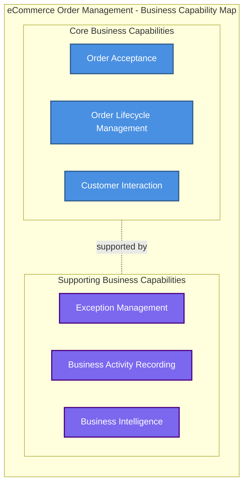

### Capability Definitions

#### Core Business Capabilities

| Capability                     | Definition                                                                                                         | Business Value                                                         | Stakeholders                                      |
| ------------------------------ | ------------------------------------------------------------------------------------------------------------------ | ---------------------------------------------------------------------- | ------------------------------------------------- |
| **Order Acceptance**           | The business capability to receive and acknowledge customer orders through any interaction channel                 | Enables revenue generation, establishes customer relationship          | Customers, Order Fulfillment, Customer Service    |
| **Order Lifecycle Management** | The business capability to track orders through their complete journey from acceptance to fulfillment confirmation | Ensures fulfillment obligations are met, maintains operational control | Order Fulfillment, Business Operations, Customers |
| **Customer Interaction**       | The business capability to communicate with customers regarding their orders and provide status visibility         | Builds customer trust, reduces support burden, enables self-service    | Customers, Customer Service                       |

#### Supporting Business Capabilities

| Capability                      | Definition                                                                                                                    | Business Value                                                                                   | Stakeholders                                                   |
| ------------------------------- | ----------------------------------------------------------------------------------------------------------------------------- | ------------------------------------------------------------------------------------------------ | -------------------------------------------------------------- |
| **Exception Management**        | The business capability to identify, classify, escalate, and resolve business exceptions that prevent normal order processing | Minimizes business disruption, protects revenue, maintains customer satisfaction                 | Order Fulfillment, Business Operations, Customer Service       |
| **Business Activity Recording** | The business capability to capture complete records of all business activities for compliance, audit, and analysis purposes   | Satisfies regulatory requirements, enables business intelligence, supports dispute resolution    | Compliance Officers, Business Operations, Executive Leadership |
| **Business Intelligence**       | The business capability to analyze business activities and provide insights for decision-making and strategic planning        | Informs strategic decisions, identifies improvement opportunities, measures business performance | Business Operations, Executive Leadership, Product Management  |

---

### Level 2: Capability Decomposition

```mermaid
flowchart TB
    subgraph CapabilityDecomposition["Business Capability Decomposition"]
        direction TB

        OA[Order Acceptance]
        OA --> OA1[Order Validation]
        OA --> OA2[Order Acknowledgment]

        OLM[Order Lifecycle Management]
        OLM --> OLM1[Status Tracking]
        OLM --> OLM2[Confirmation]
        OLM --> OLM3[Cancellation]

        CI[Customer Interaction]
        CI --> CI1[Status Inquiry]
        CI --> CI2[Customer Notification]

        EM[Exception Management]
        EM --> EM1[Exception Identification]
        EM --> EM2[Exception Resolution]
        EM --> EM3[Exception Escalation]

        BAR[Business Activity Recording]
        BAR --> BAR1[Transaction Recording]
        BAR --> BAR2[Audit Trail Management]
        BAR --> BAR3[Evidence Retention]

        BI[Business Intelligence]
        BI --> BI1[Performance Analysis]
        BI --> BI2[Trend Identification]
        BI --> BI3[Insight Reporting]
    end

    classDef L1 fill:#4A90E2,stroke:#2E5C8A,stroke-width:3px,color:#fff
    classDef L2 fill:#87CEEB,stroke:#4682B4,stroke-width:2px,color:#000

    class OA,OLM,CI,EM,BAR,BI L1
    class OA1,OA2,OLM1,OLM2,OLM3,CI1,CI2,EM1,EM2,EM3,BAR1,BAR2,BAR3,BI1,BI2,BI3 L2
```

---

## Business Value Streams

Value streams represent how the business creates and delivers value to customers and stakeholders. Each value stream traces the progression of value realization from customer intent through business outcome.

### Value Stream 1: Order Fulfillment

**Purpose**: Deliver value to customers by accepting and fulfilling their orders

**Trigger**: Customer initiates order placement

**Value Delivered**: Customer receives order confirmation and product fulfillment

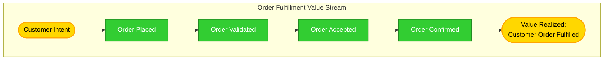

**Value Stages**:

| Stage               | Value Description                                      | Business Activities                                     | Value Metric                     |
| ------------------- | ------------------------------------------------------ | ------------------------------------------------------- | -------------------------------- |
| **Order Placed**    | Customer has expressed purchase intent                 | Customer submits order details                          | Order placement completed        |
| **Order Validated** | Business has confirmed order meets acceptance criteria | Business rules applied, order eligibility confirmed     | Order passes business validation |
| **Order Accepted**  | Business has committed to fulfilling the order         | Order acknowledged to customer, fulfillment initiated   | Customer receives acknowledgment |
| **Order Confirmed** | Order fulfillment is complete                          | Customer notified of fulfillment, transaction finalized | Customer order satisfied         |

---

### Value Stream 2: Exception Resolution

**Purpose**: Restore normal business operations when exceptions prevent standard order processing

**Trigger**: Business exception identified during order processing

**Value Delivered**: Exception resolved, business operations restored

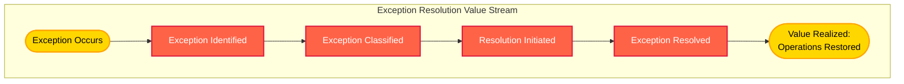

**Value Stages**:

| Stage                    | Value Description                                | Business Activities                                   | Value Metric                     |
| ------------------------ | ------------------------------------------------ | ----------------------------------------------------- | -------------------------------- |
| **Exception Identified** | Business is aware exception exists               | Exception detected, impact assessed                   | Exception visibility established |
| **Exception Classified** | Business understands exception severity and type | Exception categorized, priority assigned              | Appropriate response determined  |
| **Resolution Initiated** | Business is actively addressing exception        | Resolution activities underway, stakeholders informed | Recovery in progress             |
| **Exception Resolved**   | Normal business operations restored              | Root cause addressed, order processing resumed        | Business continuity restored     |

---

### Value Stream 3: Operational Insight

**Purpose**: Enable informed business decisions through comprehensive activity visibility and analysis

**Trigger**: Stakeholder requires business performance information or compliance evidence

**Value Delivered**: Stakeholder has actionable insights or compliance evidence

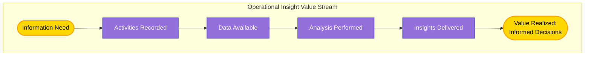

**Value Stages**:

| Stage                   | Value Description                                             | Business Activities                                       | Value Metric                   |
| ----------------------- | ------------------------------------------------------------- | --------------------------------------------------------- | ------------------------------ |
| **Activities Recorded** | Business activities are captured completely                   | All business transactions documented                      | Audit trail exists             |
| **Data Available**      | Business information is accessible to authorized stakeholders | Stakeholders can access relevant information              | Information retrieval possible |
| **Analysis Performed**  | Business data is transformed into meaningful insights         | Patterns identified, trends analyzed, compliance verified | Understanding achieved         |
| **Insights Delivered**  | Stakeholders have actionable information for decisions        | Reports generated, recommendations provided               | Decision-making enabled        |

---

## Business Processes (Logical Only)

Business processes describe the logical sequence of business activities and decisions required to realize business value. These processes are intentionally technology-agnostic and focus on business intent rather than operational mechanics.

### Process 1: Accept Customer Order

**Purpose**: Validate and acknowledge customer orders

**Trigger**: Customer submits order

**Outcome**: Order accepted or rejected with customer notification

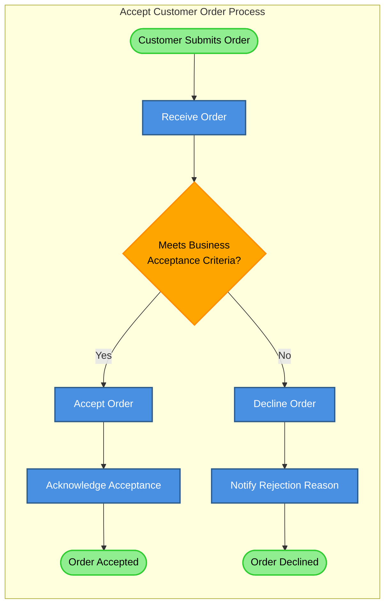

**Process Steps**:

| Step | Activity                      | Business Decision                                                                                   | Output                                    |
| ---- | ----------------------------- | --------------------------------------------------------------------------------------------------- | ----------------------------------------- |
| 1    | **Receive Order**             | None                                                                                                | Order details captured                    |
| 2    | **Evaluate Against Criteria** | Does order meet acceptance criteria (product availability, customer eligibility, pricing validity)? | Accept/Decline decision                   |
| 3a   | **Accept Order**              | None                                                                                                | Order entered into fulfillment lifecycle  |
| 3b   | **Decline Order**             | None                                                                                                | Order rejected                            |
| 4a   | **Acknowledge Acceptance**    | None                                                                                                | Customer informed of acceptance           |
| 4b   | **Notify Rejection Reason**   | None                                                                                                | Customer informed of rejection and reason |

---

### Process 2: Manage Order Lifecycle

**Purpose**: Track orders through their complete journey to fulfillment

**Trigger**: Order accepted

**Outcome**: Order confirmed as fulfilled or cancelled

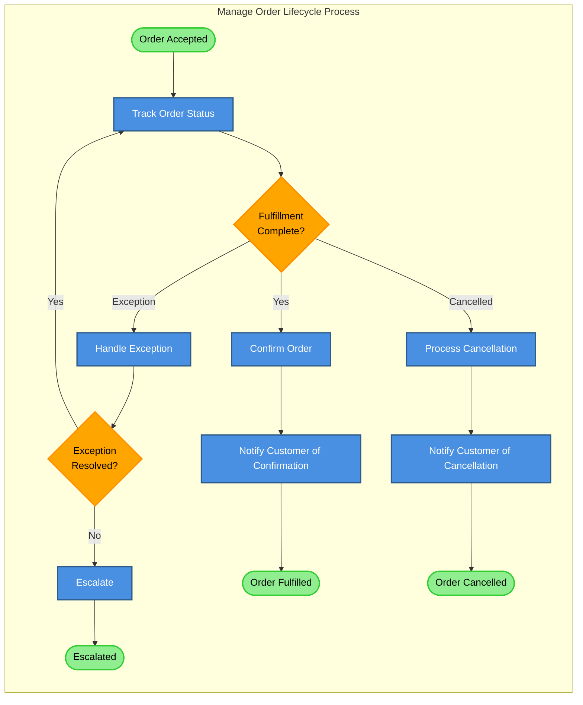

**Process Steps**:

| Step | Activity                 | Business Decision                                                              | Output                                         |
| ---- | ------------------------ | ------------------------------------------------------------------------------ | ---------------------------------------------- |
| 1    | **Track Order Status**   | None                                                                           | Current order state known                      |
| 2    | **Evaluate Status**      | Is fulfillment complete, has exception occurred, or is cancellation requested? | Routing decision                               |
| 3a   | **Confirm Order**        | None                                                                           | Order marked as fulfilled                      |
| 3b   | **Handle Exception**     | None                                                                           | Exception resolution initiated                 |
| 3c   | **Process Cancellation** | None                                                                           | Order cancelled                                |
| 4a   | **Notify Confirmation**  | None                                                                           | Customer informed of fulfillment               |
| 4b   | **Evaluate Exception**   | Can exception be resolved?                                                     | Resolution decision                            |
| 4c   | **Notify Cancellation**  | None                                                                           | Customer informed of cancellation              |
| 5    | **Escalate**             | None                                                                           | Exception escalated to appropriate stakeholder |

---

### Process 3: Resolve Business Exception

**Purpose**: Restore normal operations when exceptions prevent standard processing

**Trigger**: Exception identified

**Outcome**: Exception resolved or escalated

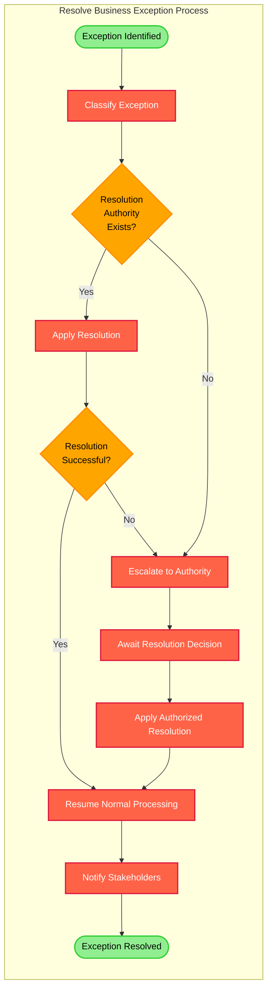

**Process Steps**:

| Step | Activity                        | Business Decision                          | Output                                    |
| ---- | ------------------------------- | ------------------------------------------ | ----------------------------------------- |
| 1    | **Classify Exception**          | None                                       | Exception type and severity determined    |
| 2    | **Evaluate Authority**          | Does immediate resolution authority exist? | Authorization decision                    |
| 3a   | **Apply Resolution**            | None                                       | Resolution action taken                   |
| 3b   | **Escalate to Authority**       | None                                       | Exception referred to authorized resolver |
| 4    | **Evaluate Success**            | Did resolution succeed?                    | Success decision                          |
| 5    | **Await Decision**              | None                                       | Authorized resolution received            |
| 6    | **Apply Authorized Resolution** | None                                       | Resolution action taken                   |
| 7    | **Resume Normal Processing**    | None                                       | Business operations restored              |
| 8    | **Notify Stakeholders**         | None                                       | Relevant parties informed of resolution   |

---

### Process 4: Provide Operational Visibility

**Purpose**: Enable stakeholders to access business performance information and compliance evidence

**Trigger**: Stakeholder requests information or compliance review required

**Outcome**: Stakeholder has required information

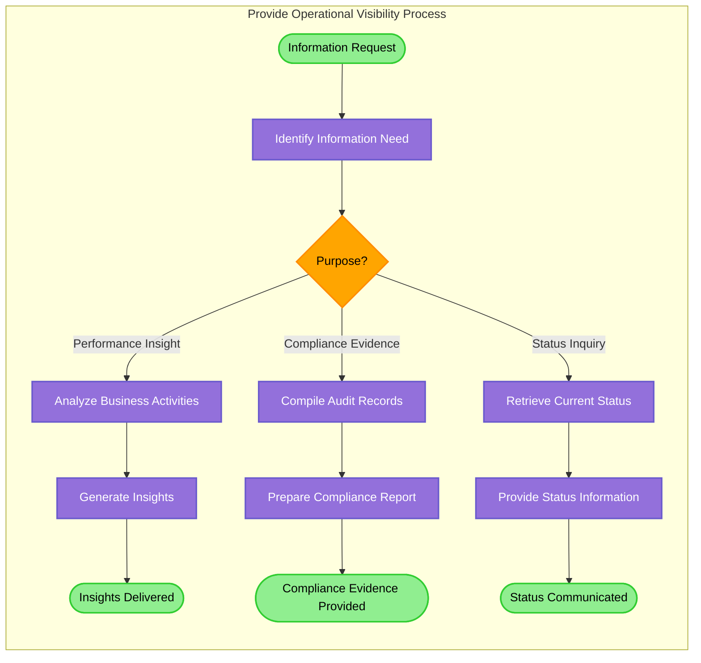

**Process Steps**:

| Step | Activity                        | Business Decision                                                        | Output                          |
| ---- | ------------------------------- | ------------------------------------------------------------------------ | ------------------------------- |
| 1    | **Identify Information Need**   | None                                                                     | Request understood              |
| 2    | **Determine Purpose**           | Is this for performance insight, compliance evidence, or status inquiry? | Purpose classification          |
| 3a   | **Analyze Business Activities** | None                                                                     | Activity patterns identified    |
| 3b   | **Compile Audit Records**       | None                                                                     | Compliance evidence gathered    |
| 3c   | **Retrieve Current Status**     | None                                                                     | Current state determined        |
| 4a   | **Generate Insights**           | None                                                                     | Actionable information prepared |
| 4b   | **Prepare Compliance Report**   | None                                                                     | Audit evidence formatted        |
| 4c   | **Provide Status Information**  | None                                                                     | Status details compiled         |
| 5    | **Deliver to Stakeholder**      | None                                                                     | Stakeholder informed            |

---

## Business Rules and Policies

Business rules define the specific policies and constraints that govern business capabilities and processes. These rules are declarative statements that constrain or guide business behavior.

### Order Acceptance Rules

| Rule ID    | Business Rule                                                | Category      | Authority           |
| ---------- | ------------------------------------------------------------ | ------------- | ------------------- |
| **BR-001** | Orders must include valid customer identification            | Structural    | Business Operations |
| **BR-002** | Orders must specify at least one orderable product           | Structural    | Product Management  |
| **BR-003** | Product quantities must be positive integers                 | Structural    | Business Operations |
| **BR-004** | Orders are accepted only for products marked as available    | Constraint    | Product Management  |
| **BR-005** | Customer must meet eligibility criteria for order acceptance | Constraint    | Business Operations |
| **BR-006** | Order total must meet minimum order value threshold          | Constraint    | Business Operations |
| **BR-007** | Orders exceeding maximum value threshold require approval    | Authorization | Business Operations |

### Order Lifecycle Rules

| Rule ID    | Business Rule                                                                | Category       | Authority           |
| ---------- | ---------------------------------------------------------------------------- | -------------- | ------------------- |
| **BR-101** | Accepted orders cannot be modified; only cancelled and resubmitted           | Constraint     | Business Operations |
| **BR-102** | Orders may be cancelled at customer request prior to fulfillment             | Authorization  | Customer Service    |
| **BR-103** | Cancelled orders must notify customer with cancellation confirmation         | Action Enabler | Customer Service    |
| **BR-104** | Fulfilled orders must receive customer confirmation notification             | Action Enabler | Business Operations |
| **BR-105** | Orders not progressing within expected timeframes require exception handling | Constraint     | Business Operations |

### Exception Management Rules

| Rule ID    | Business Rule                                                             | Category       | Authority           |
| ---------- | ------------------------------------------------------------------------- | -------------- | ------------------- |
| **BR-201** | All business exceptions must be classified by type and severity           | Structural     | Business Operations |
| **BR-202** | Critical exceptions must escalate immediately to authorized resolver      | Action Enabler | Business Operations |
| **BR-203** | Exception resolution attempts must not exceed maximum resolution attempts | Constraint     | Business Operations |
| **BR-204** | Unresolvable exceptions must escalate to business stakeholder             | Action Enabler | Business Operations |
| **BR-205** | Exception resolution must notify all affected stakeholders                | Action Enabler | Customer Service    |

### Business Activity Recording Rules

| Rule ID    | Business Rule                                                                 | Category   | Authority           |
| ---------- | ----------------------------------------------------------------------------- | ---------- | ------------------- |
| **BR-301** | All business activities must be recorded with complete contextual information | Structural | Compliance Officers |
| **BR-302** | Business records must include activity timestamp, actor, and outcome          | Structural | Compliance Officers |
| **BR-303** | Business records must be immutable once recorded                              | Constraint | Compliance Officers |
| **BR-304** | Business records must be retained for regulatory retention period             | Constraint | Compliance Officers |
| **BR-305** | Audit trail must enable reconstruction of complete business activity sequence | Structural | Compliance Officers |

### Customer Communication Rules

| Rule ID    | Business Rule                                                             | Category       | Authority        |
| ---------- | ------------------------------------------------------------------------- | -------------- | ---------------- |
| **BR-401** | Customers must receive acknowledgment upon order acceptance               | Action Enabler | Customer Service |
| **BR-402** | Customers must receive notification upon order fulfillment                | Action Enabler | Customer Service |
| **BR-403** | Customers must receive notification upon order cancellation               | Action Enabler | Customer Service |
| **BR-404** | Customers must receive notification when exceptions affect their orders   | Action Enabler | Customer Service |
| **BR-405** | All customer communications must use customer's preferred contact channel | Constraint     | Customer Service |

---

## Business Information Concepts (Ubiquitous Language)

This section defines the core business concepts and their relationships within the order management domain. This ubiquitous language ensures consistent understanding across all business stakeholders.

### Core Business Entities

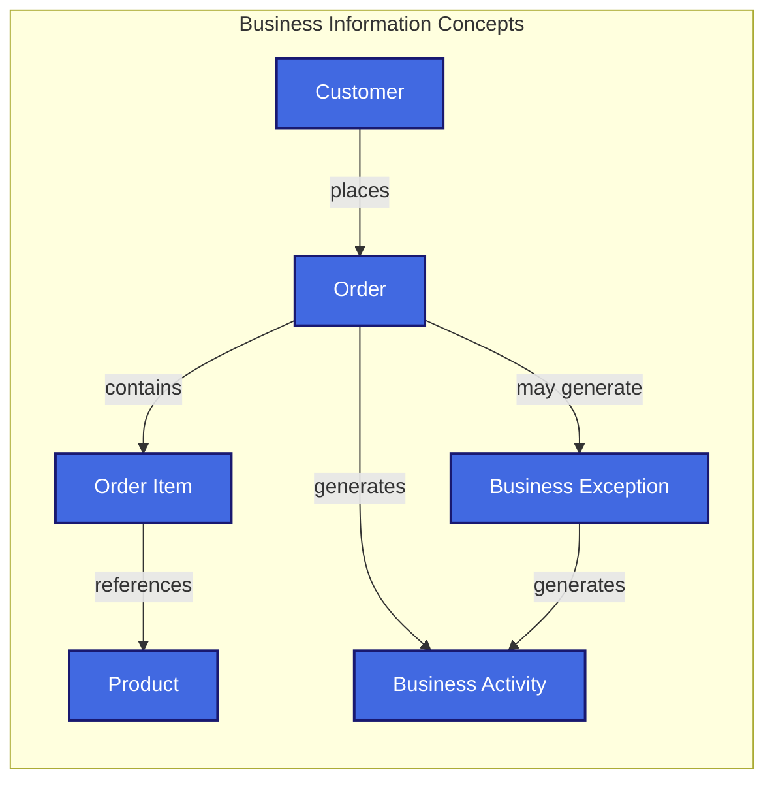

### Business Concept Definitions

| Concept                | Definition                                                                                | Key Attributes                                                                   | Business Rules                                                                                   |
| ---------------------- | ----------------------------------------------------------------------------------------- | -------------------------------------------------------------------------------- | ------------------------------------------------------------------------------------------------ |
| **Customer**           | An individual or organization authorized to place orders with the business                | Customer Identifier, Contact Information, Eligibility Status                     | Must meet eligibility criteria; Must maintain valid identification                               |
| **Order**              | A formal request from a customer to purchase products, representing a business commitment | Order Identifier, Order Date, Customer Reference, Order Status, Order Total      | Must include valid customer; Must contain at least one order item; Must pass acceptance criteria |
| **Product**            | An item available for purchase by customers                                               | Product Identifier, Product Name, Availability Status, Price                     | Must be marked available for ordering; Must have valid pricing                                   |
| **Order Item**         | A specific product and quantity within an order                                           | Product Reference, Quantity, Item Price                                          | Must reference valid product; Quantity must be positive integer                                  |
| **Order Status**       | The current state of an order within its lifecycle                                        | Status Code, Status Description, Status Timestamp                                | Status progression must follow defined lifecycle; Status changes generate business activities    |
| **Business Exception** | An unexpected condition preventing normal order processing                                | Exception Identifier, Exception Type, Severity, Affected Order, Exception Status | Must be classified; Must have resolution or escalation; Must be recorded completely              |
| **Business Activity**  | A record of a business event or transaction for audit and analysis purposes               | Activity Identifier, Activity Type, Timestamp, Actor, Context, Outcome           | Must be immutable; Must include complete context; Must support audit trail reconstruction        |

### Order Status Lifecycle

Orders progress through defined states representing business milestones:

| Status        | Definition                                               | Transitions To                 | Business Meaning                       |
| ------------- | -------------------------------------------------------- | ------------------------------ | -------------------------------------- |
| **Submitted** | Customer has submitted order for business acceptance     | Accepted, Rejected             | Order received, pending validation     |
| **Accepted**  | Business has accepted order and committed to fulfillment | Confirmed, Cancelled, Excepted | Order validated, fulfillment initiated |
| **Confirmed** | Order fulfillment is complete                            | _terminal state_               | Customer order satisfied               |
| **Cancelled** | Order has been cancelled prior to fulfillment            | _terminal state_               | Order will not be fulfilled            |
| **Excepted**  | Exception has prevented normal order processing          | Accepted, Escalated            | Issue requires resolution              |
| **Escalated** | Exception requires stakeholder intervention              | Accepted, Cancelled            | Manual resolution required             |
| **Rejected**  | Order failed business acceptance criteria                | _terminal state_               | Order cannot be accepted               |

### Exception Classification

Business exceptions are classified to enable appropriate resolution:

| Exception Type              | Definition                                    | Severity | Resolution Authority   |
| --------------------------- | --------------------------------------------- | -------- | ---------------------- |
| **Validation Exception**    | Order data does not meet business rules       | Low      | Automatically declined |
| **Business Rule Exception** | Order violates current business policy        | Medium   | Order Fulfillment Team |
| **Availability Exception**  | Product availability changed after acceptance | Medium   | Order Fulfillment Team |
| **Processing Exception**    | Unexpected condition during order handling    | High     | Business Operations    |
| **External Exception**      | Dependency outside business control failed    | High     | Business Operations    |

---

## Business Context Diagram

The business context diagram illustrates the boundary of the order management business domain and the external actors that interact with it.

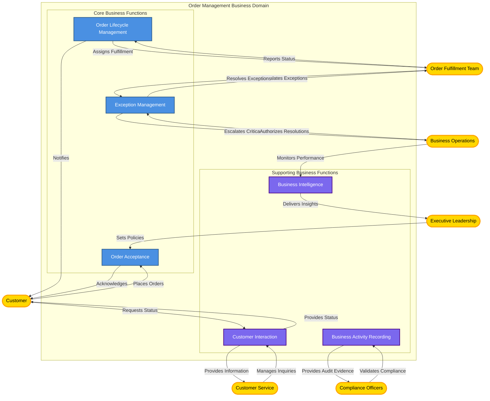

---

## Scope, Assumptions, and Constraints

### Business Scope

**In Scope**:

- Order acceptance from customers
- Order lifecycle tracking through fulfillment
- Business exception identification and resolution
- Customer communication throughout order lifecycle
- Business activity recording for audit and analysis
- Business performance visibility for stakeholders

**Out of Scope**:

- Product catalog management and pricing
- Inventory management and allocation
- Physical fulfillment and logistics
- Customer relationship management beyond order context
- Payment processing and financial transactions
- Returns and refunds management
- Product recommendations and marketing

### Business Assumptions

| Assumption ID | Assumption                                                                          | Impact                                                               | Validation Required                           |
| ------------- | ----------------------------------------------------------------------------------- | -------------------------------------------------------------------- | --------------------------------------------- |
| **BA-001**    | Customers access order placement through digital channels                           | Architecture must support digital interaction patterns               | No - market reality                           |
| **BA-002**    | Order fulfillment is performed by a separate business function                      | Architecture focuses on order management, not fulfillment execution  | No - organizational structure                 |
| **BA-003**    | Product availability is managed externally                                          | Architecture receives availability information, does not manage it   | No - capability boundary                      |
| **BA-004**    | Business rules evolve but capability structure remains stable                       | Architecture must accommodate rule changes without structural impact | Yes - validate architectural flexibility      |
| **BA-005**    | Regulatory compliance requirements are mandatory                                    | Architecture must support complete audit trails                      | No - legal requirement                        |
| **BA-006**    | Customers expect near-real-time status visibility                                   | Architecture must provide timely information access                  | Yes - validate customer expectations          |
| **BA-007**    | Business exceptions occur with sufficient frequency to warrant dedicated capability | Architecture includes explicit exception management                  | Yes - validate exception frequency and impact |

### Business Constraints

| Constraint ID | Constraint                                                                  | Category       | Impact                                                             |
| ------------- | --------------------------------------------------------------------------- | -------------- | ------------------------------------------------------------------ |
| **BC-001**    | All business activities must be auditable per regulatory requirements       | Regulatory     | Mandatory comprehensive business activity recording                |
| **BC-002**    | Customer data must be protected per privacy regulations                     | Regulatory     | Customer information access control and retention policies         |
| **BC-003**    | Business operates continuously with minimal planned downtime                | Operational    | Architecture must support continuous business availability         |
| **BC-004**    | Order volume varies significantly across business periods                   | Operational    | Architecture must accommodate volume fluctuations                  |
| **BC-005**    | Business rules and policies change periodically                             | Business       | Architecture must support rule updates without business disruption |
| **BC-006**    | Multiple business stakeholders require visibility into business activities  | Organizational | Architecture must support varied information access needs          |
| **BC-007**    | Business must maintain operational control over order management capability | Strategic      | Core business functions must remain within business control        |

---

## Non-Functional Business Requirements

Non-functional business requirements define the quality attributes that the business requires from its capabilities, expressed in business terms.

### Business Continuity Requirements

| Requirement ID | Requirement                                                      | Business Rationale                              | Success Criteria                                         |
| -------------- | ---------------------------------------------------------------- | ----------------------------------------------- | -------------------------------------------------------- |
| **NFR-001**    | Order acceptance must operate continuously during business hours | Revenue protection, customer satisfaction       | Orders accepted without interruption                     |
| **NFR-002**    | Business operations resume promptly following disruptions        | Minimize revenue loss, maintain customer trust  | Operations restored within acceptable business timeframe |
| **NFR-003**    | Order data remains available for business operations             | Fulfillment continuity, compliance              | Order information accessible when needed                 |
| **NFR-004**    | Business can accommodate volume fluctuations                     | Handle peak demand periods, seasonal variations | Business operations continue during volume spikes        |

### Business Performance Requirements

| Requirement ID | Requirement                                                  | Business Rationale                              | Success Criteria                                        |
| -------------- | ------------------------------------------------------------ | ----------------------------------------------- | ------------------------------------------------------- |
| **NFR-101**    | Orders are acknowledged within customer-acceptable timeframe | Customer satisfaction, competitive positioning  | Customers receive acknowledgment promptly               |
| **NFR-102**    | Order status information reflects current business state     | Customer trust, operational decision-making     | Status information is current when accessed             |
| **NFR-103**    | Exceptions are identified and escalated promptly             | Minimize business disruption, protect revenue   | Exceptions visible within acceptable business timeframe |
| **NFR-104**    | Business stakeholders access information without delay       | Enable timely decisions, operational efficiency | Information available when requested                    |

### Business Compliance Requirements

| Requirement ID | Requirement                                                   | Business Rationale                        | Success Criteria                                 |
| -------------- | ------------------------------------------------------------- | ----------------------------------------- | ------------------------------------------------ |
| **NFR-201**    | Complete audit trail exists for all business activities       | Regulatory compliance, dispute resolution | All activities have complete audit records       |
| **NFR-202**    | Business records are retained per regulatory requirements     | Legal compliance, business protection     | Records available for entire retention period    |
| **NFR-203**    | Business records support reconstruction of activity sequences | Audit preparation, root cause analysis    | Activity sequences can be reconstructed          |
| **NFR-204**    | Customer data privacy is protected per regulations            | Legal compliance, customer trust          | Customer data access is controlled appropriately |

### Business Transparency Requirements

| Requirement ID | Requirement                                                             | Business Rationale                              | Success Criteria                             |
| -------------- | ----------------------------------------------------------------------- | ----------------------------------------------- | -------------------------------------------- |
| **NFR-301**    | Customers can access their order status at any time                     | Customer satisfaction, reduce support burden    | Status available via self-service            |
| **NFR-302**    | Business stakeholders have visibility into relevant business activities | Informed decision-making, operational oversight | Stakeholders access needed information       |
| **NFR-303**    | Exception status is visible to authorized stakeholders                  | Enable coordination, support resolution         | Exception information available to resolvers |
| **NFR-304**    | Business performance metrics are available to management                | Strategic planning, capability improvement      | Performance information accessible           |

### Business Adaptability Requirements

| Requirement ID | Requirement                                               | Business Rationale                              | Success Criteria                                              |
| -------------- | --------------------------------------------------------- | ----------------------------------------------- | ------------------------------------------------------------- |
| **NFR-401**    | Business rules can be updated without business disruption | Market responsiveness, competitive agility      | Rule changes deployed without downtime                        |
| **NFR-402**    | Business can adopt new interaction channels               | Market expansion, customer preference evolution | New channels integrated without affecting existing operations |
| **NFR-403**    | Business processes can be refined based on insights       | Continuous improvement, efficiency gains        | Process changes implemented based on analysis                 |

---

## Traceability Matrix (Goals ↔ Capabilities ↔ Value Streams ↔ Processes)

This matrix demonstrates how business goals are realized through capabilities, value streams, and processes, ensuring strategic alignment throughout the architecture.

### Goals to Capabilities

| Business Goal                            | Supported By Capability                            | How Capability Enables Goal                                                                     |
| ---------------------------------------- | -------------------------------------------------- | ----------------------------------------------------------------------------------------------- |
| **BG-01: Excellent Customer Experience** | Order Acceptance, Customer Interaction             | Reliable order acceptance and transparent status visibility create positive customer experience |
| **BG-02: Operational Excellence**        | Order Lifecycle Management, Exception Management   | Efficient lifecycle tracking and proactive exception handling minimize manual intervention      |
| **BG-03: Business Continuity**           | Order Acceptance, Order Lifecycle Management       | Continuous order processing capability ensures business continuity                              |
| **BG-04: Regulatory Compliance**         | Business Activity Recording                        | Comprehensive activity recording satisfies audit requirements                                   |
| **BG-05: Operational Transparency**      | Business Intelligence, Business Activity Recording | Complete activity capture and analysis provide stakeholder visibility                           |
| **BG-06: Business Agility**              | _All Capabilities_                                 | Technology-agnostic capability model enables rapid adaptation                                   |

### Capabilities to Value Streams

| Business Capability             | Contributes to Value Stream            | Value Contribution                                                    |
| ------------------------------- | -------------------------------------- | --------------------------------------------------------------------- |
| **Order Acceptance**            | Order Fulfillment                      | Enables value stream initiation through order acceptance              |
| **Order Lifecycle Management**  | Order Fulfillment                      | Drives value stream progression through lifecycle tracking            |
| **Customer Interaction**        | Order Fulfillment, Operational Insight | Communicates value delivery to customers, provides status information |
| **Exception Management**        | Exception Resolution                   | Enables value stream through exception identification and resolution  |
| **Business Activity Recording** | Operational Insight                    | Captures data enabling insight value stream                           |
| **Business Intelligence**       | Operational Insight                    | Delivers insights completing value stream                             |

### Value Streams to Processes

| Value Stream             | Realized By Process                                | Process Contribution                                                               |
| ------------------------ | -------------------------------------------------- | ---------------------------------------------------------------------------------- |
| **Order Fulfillment**    | Accept Customer Order, Manage Order Lifecycle      | Processes execute value stream from order placement through confirmation           |
| **Exception Resolution** | Resolve Business Exception, Manage Order Lifecycle | Processes handle exception identification, resolution, and operational restoration |
| **Operational Insight**  | Provide Operational Visibility                     | Process delivers information and insights to stakeholders                          |

### Comprehensive Alignment Matrix

| Goal      | Capability                  | Value Stream         | Process                        | Outcome                          | KPI                 |
| --------- | --------------------------- | -------------------- | ------------------------------ | -------------------------------- | ------------------- |
| **BG-01** | Order Acceptance            | Order Fulfillment    | Accept Customer Order          | Orders acknowledged promptly     | KPI-01, KPI-02      |
| **BG-01** | Customer Interaction        | Order Fulfillment    | Manage Order Lifecycle         | Customers receive status updates | KPI-02, KPI-07      |
| **BG-02** | Order Lifecycle Management  | Order Fulfillment    | Manage Order Lifecycle         | Orders progress efficiently      | KPI-01, KPI-06      |
| **BG-02** | Exception Management        | Exception Resolution | Resolve Business Exception     | Exceptions resolved quickly      | KPI-03              |
| **BG-03** | Order Acceptance            | Order Fulfillment    | Accept Customer Order          | Orders accepted continuously     | KPI-01              |
| **BG-04** | Business Activity Recording | Operational Insight  | Provide Operational Visibility | Audit evidence complete          | KPI-04              |
| **BG-05** | Business Intelligence       | Operational Insight  | Provide Operational Visibility | Stakeholders informed            | KPI-06              |
| **BG-06** | _All Capabilities_          | _All Streams_        | _All Processes_                | Business adapts quickly          | _Strategic measure_ |

---

## Risks and Open Questions

### Business Architecture Risks

| Risk ID    | Risk Description                                                          | Impact | Likelihood | Mitigation Strategy                                                 |
| ---------- | ------------------------------------------------------------------------- | ------ | ---------- | ------------------------------------------------------------------- |
| **AR-001** | Business capabilities may not align with stakeholder expectations         | High   | Medium     | Validate capability definitions with all stakeholder groups         |
| **AR-002** | Business rules may conflict or create unintended consequences             | Medium | Medium     | Establish business rule governance and conflict resolution process  |
| **AR-003** | Value streams may not capture all critical business paths                 | Medium | Low        | Review value streams with business operations team                  |
| **AR-004** | Scope boundaries may exclude required business functions                  | High   | Low        | Validate scope with enterprise architecture and business leadership |
| **AR-005** | Non-functional requirements may not reflect actual business needs         | Medium | Medium     | Validate requirements with operational stakeholders                 |
| **AR-006** | Business processes may not match actual operational practices             | Medium | Medium     | Conduct process validation workshops with business teams            |
| **AR-007** | Ubiquitous language may not be universally understood across stakeholders | Low    | High       | Establish glossary review and validation process                    |

### Open Business Questions

| Question ID | Question                                                                                     | Stakeholder                               | Priority | Resolution Needed By              |
| ----------- | -------------------------------------------------------------------------------------------- | ----------------------------------------- | -------- | --------------------------------- |
| **AQ-001**  | What is the maximum acceptable timeframe for order acknowledgment from customer perspective? | Customers, Customer Service               | High     | Architecture design phase         |
| **AQ-002**  | What is the business rule for orders requiring approval above maximum threshold?             | Business Operations, Executive Leadership | High     | Business rule definition          |
| **AQ-003**  | What exception types occur most frequently and what is their business impact?                | Business Operations, Order Fulfillment    | High     | Capability prioritization         |
| **AQ-004**  | What are the specific regulatory retention requirements for business records?                | Compliance Officers                       | High     | Compliance requirement definition |
| **AQ-005**  | How do customers prefer to receive order status notifications?                               | Customers, Customer Service               | Medium   | Customer interaction design       |
| **AQ-006**  | What business performance metrics are most critical for management decision-making?          | Executive Leadership, Business Operations | Medium   | Business intelligence design      |
| **AQ-007**  | What is the minimum order value threshold and what business rules apply below it?            | Business Operations, Product Management   | Medium   | Business rule definition          |
| **AQ-008**  | What escalation authority exists for different exception types?                              | Business Operations, Order Fulfillment    | Medium   | Exception management design       |

### Assumptions Requiring Validation

| Assumption                                                  | Validation Method                     | Stakeholder                             | Timeline                           |
| ----------------------------------------------------------- | ------------------------------------- | --------------------------------------- | ---------------------------------- |
| Customer expectations for near-real-time status visibility  | Customer survey, competitive analysis | Customer Service, Customers             | Prior to architecture design       |
| Business exception frequency warrants dedicated capability  | Operational data analysis             | Business Operations                     | Prior to capability prioritization |
| Business rules change frequency and impact                  | Business operations interview         | Business Operations, Product Management | Prior to architecture design       |
| Current business rule definitions are complete and accurate | Business rule review workshop         | Business Operations, Compliance         | During business rule documentation |
| Stakeholder information needs are accurately captured       | Stakeholder interviews                | All stakeholder groups                  | During requirements validation     |

---

## Appendix: Diagram Legend and Notation

### Mermaid Diagram Conventions

All diagrams in this document follow consistent notation to ensure clarity and comprehension:

#### Business Context Diagrams

| Element           | Notation          | Meaning                                   |
| ----------------- | ----------------- | ----------------------------------------- |
| Actor             | `([Actor Name])`  | External entity interacting with business |
| Business Function | `[Function Name]` | Core business capability or function      |
| Boundary          | `subgraph`        | Logical business domain boundary          |
| Interaction       | `-->`             | Business interaction or information flow  |

**Color Scheme**:

- External Actors: Gold/Orange (#FFD700, #FFA500)
- Business Functions: Blue (#4A90E2)
- Supporting Functions: Purple (#7B68EE)
- Boundaries: Gray (#F0F0F0)

#### Business Capability Maps

| Element            | Notation                     | Meaning                          |
| ------------------ | ---------------------------- | -------------------------------- |
| Level 1 Capability | `[Capability]` (larger)      | Core business capability         |
| Level 2 Capability | `[Sub-Capability]` (smaller) | Capability decomposition         |
| Relationship       | `-->` or `-.-`               | Capability dependency or support |

**Color Scheme**:

- Core Capabilities: Blue (#4A90E2)
- Supporting Capabilities: Purple (#7B68EE)
- Sub-Capabilities: Light Blue (#87CEEB)

#### Value Stream Diagrams

| Element     | Notation       | Meaning                                |
| ----------- | -------------- | -------------------------------------- |
| Value Stage | `[Stage Name]` | Point where business value is realized |
| Flow        | `-->`          | Progression of value realization       |
| Start/End   | `([Label])`    | Value stream trigger or outcome        |

**Color Scheme**:

- Order Fulfillment: Green (#32CD32)
- Exception Resolution: Red (#FF6347)
- Operational Insight: Purple (#9370DB)
- Endpoints: Gold (#FFD700)

#### Business Process Diagrams

| Element   | Notation          | Meaning                     |
| --------- | ----------------- | --------------------------- |
| Activity  | `[Activity Name]` | Business activity or action |
| Decision  | `{Question?}`     | Business decision point     |
| Start/End | `([Event])`       | Process trigger or outcome  |
| Flow      | `-->`             | Process sequence            |

**Color Scheme**:

- Activities: Blue (#4A90E2)
- Exception Activities: Red (#FF6347)
- Insight Activities: Purple (#9370DB)
- Decisions: Orange (#FFA500)
- Endpoints: Light Green (#90EE90)

### Reading Guidance

**For Business Executives**: Focus on sections 2-6 (Business Context through Business Value Streams) to understand strategic alignment and business outcomes.

**For Portfolio Managers**: Focus on sections 6-7 (Business Capability Map, Value Streams) to inform investment decisions and capability roadmaps.

**For Business Analysts**: Focus on sections 8-10 (Business Processes, Rules, Information Concepts) to understand detailed business logic and requirements.

**For Enterprise Architects**: Review entire document for alignment with enterprise architecture standards and as input to Application and Technology Architecture layers.

**For Compliance Officers**: Focus on sections 9 (Business Rules), 11 (Constraints), 12 (Non-Functional Requirements) for regulatory and compliance considerations.

---

## Document Control

| Attribute              | Value                                                                                    |
| ---------------------- | ---------------------------------------------------------------------------------------- |
| **Document Title**     | Business Architecture - Order Management Solution                                        |
| **Document Version**   | 1.0                                                                                      |
| **Status**             | Draft for Review                                                                         |
| **Author**             | Enterprise Architecture Team                                                             |
| **Date**               | January 8, 2026                                                                          |
| **Approval Authority** | Chief Enterprise Architect                                                               |
| **Review Cycle**       | Annually or upon significant business change                                             |
| **Classification**     | Internal Use                                                                             |
| **Related Documents**  | Application Architecture (02), Technology Architecture (03), Implementation Roadmap (04) |

### Version History

| Version | Date       | Author  | Changes                                 |
| ------- | ---------- | ------- | --------------------------------------- |
| 0.1     | 2026-01-08 | EA Team | Initial draft creation                  |
| 1.0     | 2026-01-08 | EA Team | Complete business architecture document |

### Review and Approval

| Role                       | Name      | Signature | Date |
| -------------------------- | --------- | --------- | ---- |
| Chief Enterprise Architect | _Pending_ |           |      |
| Business Operations Lead   | _Pending_ |           |      |
| Compliance Officer         | _Pending_ |           |      |
| Executive Sponsor          | _Pending_ |           |      |

---

**END OF DOCUMENT**
