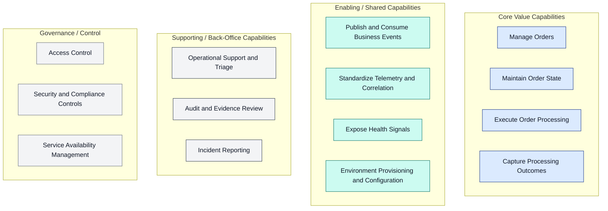
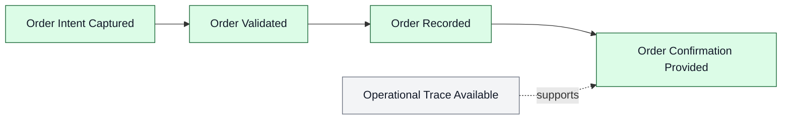
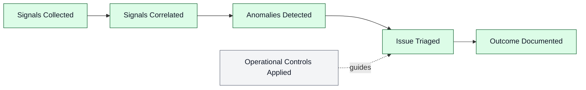
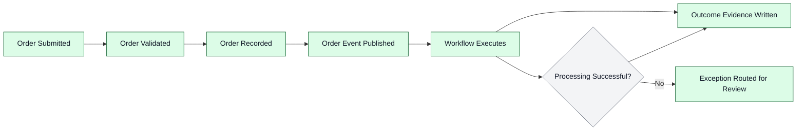

# Business Architecture

## 1. Business Context

- **Problem statement**: Workflow-driven business processes often fail in ways that are hard to see and hard to diagnose (e.g., intermittent integration errors, partial processing, inconsistent outcomes). This creates operational risk, slow incident response, and limited auditability for business-critical event handling.
- **Solution value proposition**: Provide an observable and auditable order-processing workflow where business events can be traced end-to-end from user intent through transaction processing and workflow execution, with outcomes recorded for operational review and compliance evidence.
- **Target users and personas**:
  - **Order Operations**: needs visibility into processing outcomes and exceptions.
  - **Support / Incident Response**: needs fast triage, correlation, and evidence of what happened.
  - **Engineering Teams**: needs clear boundaries and repeatable patterns for instrumented services and workflow integrations.
  - **Architecture Review / Governance**: needs traceability, control points, and consistent health reporting.

## 2. Business Capabilities

| Capability | Description | Business Outcome |
| --- | --- | --- |
| Manage Orders | Create, view, and delete orders as a business interaction | Orders are captured reliably and consistently |
| Maintain Order State | Persist order data as the authoritative record | Accurate order history supports customer and ops needs |
| Execute Order Processing | Run automated processing driven by business events | Lower manual effort; consistent processing behavior |
| Capture Processing Outcomes | Record success/failure evidence for each processed event | Faster audits and clearer exception handling |
| Publish and Consume Business Events | Decouple order placement from downstream processing | Reduced coupling; higher change tolerance |
| Standardize Telemetry and Correlation | Ensure traceability across service boundaries | Reduced mean time to detect/resolve issues |
| Expose Health Signals | Provide consistent liveness/readiness indicators | Safer operations and predictable recovery behavior |
| Environment Provisioning and Configuration | Repeatable environments and configuration guardrails | Lower deployment risk and fewer drift issues |

## 3. Stakeholder Analysis

| Stakeholder | Concerns | How Architecture Addresses |
| --- | --- | --- |
| Business Owner | Process reliability and predictable outcomes | Evidence capture and clear processing boundaries |
| Order Operations | Visibility into failures and throughput | Outcome segregation and operational telemetry |
| Support / Incident Response | Fast diagnosis; clear “what happened” | End-to-end correlation via standardized telemetry |
| Solution Architects | Reference patterns and clear separations | Layered services with event-driven integration |
| Platform Engineers | Operational consistency and repeatable environments | Declarative provisioning and shared service defaults |
| Security / Compliance | Access control, auditability, traceability | Identity-based access, outcome evidence, consistent logging |

## 4. Value Streams

### 4.1 Order Management Value Stream

### 4.2 Monitoring and Observability Value Stream

## 5. Quality Attribute Requirements

| Attribute | Requirement | Priority |
| --- | --- | --- |
| Availability | User-facing order placement and workflow execution must recover predictably from transient failures | High |
| Observability | Operations must correlate an order event to its processing outcome across services | High |
| Scalability | The solution must support bursty order placement and variable workflow throughput | Medium |
| Security | Access must be identity-based with least-privilege controls | High |
| Auditability | Each processed event must produce durable evidence of success/failure | High |

## 6. Business Process Flows

