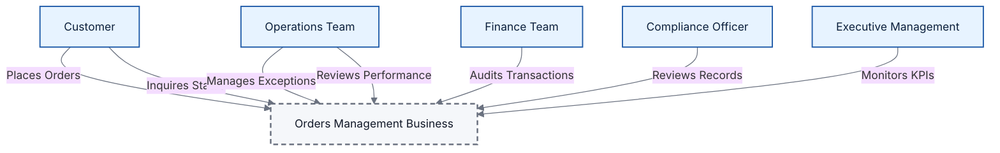
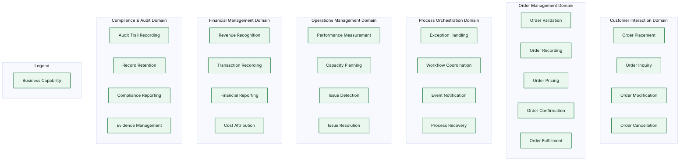
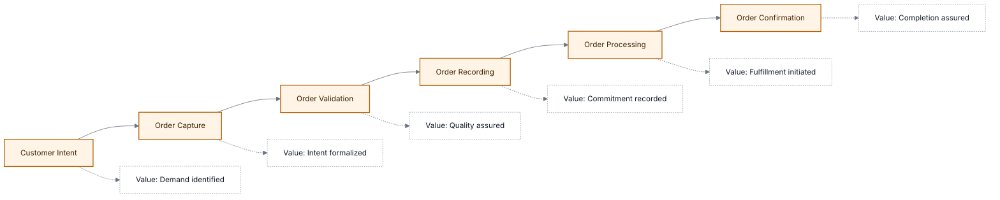
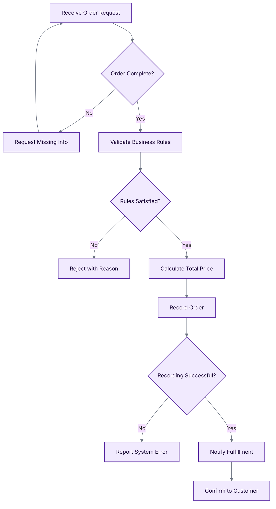
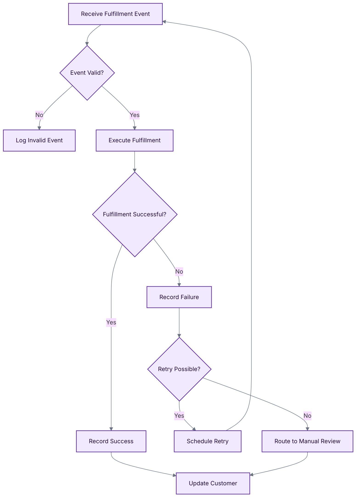

# Business Architecture

## Executive Summary

This document defines the Business Architecture for the **Orders Management Enterprise**, a business domain focused on enabling efficient, reliable, and auditable order fulfillment operations. The architecture addresses the critical business need for **transparent order lifecycle management** with comprehensive visibility into operational performance.

**Core Business Value Proposition:**

- Enable end-to-end order lifecycle management from placement through completion
- Provide operational transparency for business decision-making
- Ensure order processing reliability and auditability for compliance
- Support business agility through flexible order handling processes

**Target Audience:** Business executives, operations managers, compliance officers, process owners, and enterprise architects engaged in capability planning and portfolio management.

**Business Model:** Order-centric service business supporting customer order fulfillment with emphasis on operational excellence and regulatory compliance.

---

## Business Context and Problem Statement

### Business Problem

Modern order-centric enterprises face critical challenges in managing the order lifecycle:

1. **Visibility Gap:** Lack of unified visibility into order status across fulfillment stages leads to customer dissatisfaction and operational inefficiency.
2. **Reliability Risk:** Order processing errors and exceptions result in revenue loss, customer churn, and operational overhead.
3. **Compliance Burden:** Manual audit trail compilation increases compliance costs and regulatory risk.
4. **Performance Opacity:** Inability to measure order cycle time and success rates prevents data-driven optimization.
5. **Exception Management:** Manual intervention requirements for failed orders reduce operational efficiency.

### Business Opportunity

This architecture delivers:

- **Operational Transparency:** Real-time visibility into order status and processing outcomes
- **Business Continuity:** Systematic exception handling and order retry capabilities
- **Compliance Readiness:** Automated audit trail generation for regulatory requirements
- **Performance Intelligence:** Comprehensive metrics for order cycle time, success rates, and throughput
- **Operational Excellence:** Reduced manual intervention through automated order processing

### Success Criteria

- **Order Success Rate > 99.95%** (orders completed without manual intervention)
- **Order Cycle Time < 4 seconds** (placement to confirmation)
- **Audit Trail Completeness = 100%** (all order events recorded)
- **Mean Time to Detect Issues < 1 minute**
- **Mean Time to Resolve Issues < 5 minutes**

---

## Stakeholders and Personas

### Primary Stakeholders

| Stakeholder Group         | Key Interests                                                  | Success Metrics                                               |
| ------------------------- | -------------------------------------------------------------- | ------------------------------------------------------------- |
| **Customers**             | Fast order placement, status visibility, reliable fulfillment  | Order confirmation time, delivery accuracy                    |
| **Operations Management** | Process efficiency, exception visibility, capacity utilization | Order throughput, exception rate, staff productivity          |
| **Finance Department**    | Revenue assurance, transaction auditability, cost control      | Revenue recognition accuracy, audit compliance rate           |
| **Compliance Officers**   | Regulatory adherence, audit trail completeness, data retention | Compliance score, audit readiness, violation rate             |
| **Executive Leadership**  | Business performance, competitive positioning, risk management | Revenue growth, customer satisfaction, operational efficiency |

### Business Personas

#### Persona 1: Operations Manager

- **Name:** Sarah Chen
- **Role:** Order Operations Manager
- **Goals:** Maximize order throughput, minimize exceptions, maintain SLA compliance
- **Pain Points:** Blind spots in order status, manual exception handling, fragmented performance data
- **Business Value Delivered:** Real-time order visibility, automated exception routing, consolidated performance dashboards

#### Persona 2: Finance Controller

- **Name:** Michael Torres
- **Role:** Financial Controller
- **Goals:** Ensure revenue integrity, maintain audit readiness, control operational costs
- **Pain Points:** Manual audit trail compilation, reconciliation complexity, delayed financial reporting
- **Business Value Delivered:** Automated audit logs, complete transaction records, real-time financial visibility

#### Persona 3: Compliance Officer

- **Name:** Jennifer Williams
- **Role:** Regulatory Compliance Officer
- **Goals:** Maintain regulatory compliance, pass audits, minimize violations
- **Pain Points:** Incomplete records, manual evidence gathering, retention policy enforcement
- **Business Value Delivered:** Comprehensive audit trails, automated retention policies, compliance reporting

---

## Business Goals, Outcomes, and KPIs

### Strategic Goals

| Goal ID | Business Goal                                      | Desired Outcome                        | Key Performance Indicators (KPIs)                  |
| ------- | -------------------------------------------------- | -------------------------------------- | -------------------------------------------------- |
| **G1**  | Achieve operational excellence in order processing | Consistent, reliable order fulfillment | Order success rate > 99.95%, Cycle time < 4s       |
| **G2**  | Ensure complete business visibility                | Real-time operational intelligence     | Dashboard adoption > 90%, Decision latency < 5 min |
| **G3**  | Maintain regulatory compliance                     | Zero compliance violations             | Audit readiness = 100%, Violation rate = 0         |
| **G4**  | Optimize operational efficiency                    | Reduced manual intervention            | Automation rate > 95%, Staff productivity +20%     |
| **G5**  | Enable data-driven decision making                 | Actionable business insights           | KPI refresh rate < 1 min, Report accuracy > 99%    |

### Business Outcomes

- **Customer Experience:** Predictable order fulfillment with proactive status communication
- **Operational Efficiency:** Automated order processing with intelligent exception routing
- **Financial Integrity:** Complete transaction records enabling accurate revenue recognition
- **Compliance Posture:** Audit-ready records with automated retention and retrieval
- **Strategic Agility:** Real-time business intelligence enabling rapid response to market conditions

---

## Business Capability Map

### Capability Domain Rationale

**Customer Interaction Domain:** Represents direct customer-facing capabilities for order management. These capabilities enable customers to engage with the order lifecycle, critical for customer satisfaction and retention.

**Order Management Domain:** Core transactional capabilities ensuring order integrity, pricing accuracy, and fulfillment coordination. These are the fundamental value-creating activities of the business.

**Process Orchestration Domain:** Capabilities for managing complex multi-step order processing, exception scenarios, and inter-process coordination. Essential for operational reliability and business agility.

**Operations Management Domain:** Capabilities for measuring business performance, detecting operational issues, planning capacity, and resolving problems. Critical for maintaining operational excellence and continuous improvement.

**Financial Management Domain:** Capabilities for financial integrity, revenue assurance, and cost management. Required for accurate financial reporting and business profitability.

**Compliance & Audit Domain:** Capabilities for regulatory adherence, evidence management, and audit readiness. Mandatory for risk management and regulatory compliance.

---

## Business Value Streams

### Primary Value Stream: Order-to-Confirmation

### Value Stage Details

| Stage                  | Business Activities                                 | Value Delivered                                  | Target Duration |
| ---------------------- | --------------------------------------------------- | ------------------------------------------------ | --------------- |
| **Customer Intent**    | Customer identifies need, browses offerings         | Business demand signal captured                  | N/A             |
| **Order Capture**      | Customer submits order details                      | Purchase intent formalized                       | < 200ms         |
| **Order Validation**   | Business rules applied, quality checks performed    | Order quality and feasibility assured            | < 300ms         |
| **Order Recording**    | Order committed to permanent record                 | Legal commitment established                     | < 500ms         |
| **Order Processing**   | Fulfillment workflow initiated, resources allocated | Value creation begun                             | < 2s            |
| **Order Confirmation** | Customer notified, audit record completed           | Customer satisfaction achieved, evidence secured | < 200ms         |

**Total Value Stream Lead Time:** < 3.2 seconds

**Key Business Metrics:**

- **Value Delivery Rate:** Orders confirmed per hour
- **Flow Efficiency:** Value-adding time / Total lead time (target > 75%)
- **First-Pass Yield:** Orders completed without exceptions (target > 99%)

---

### Secondary Value Stream: Exception-to-Resolution

**Business Purpose:** Systematic handling of order processing exceptions to minimize business impact and maintain customer trust.

**Stages:**

1. **Exception Detection:** Anomaly identified in order processing
2. **Exception Classification:** Severity and impact assessed
3. **Resolution Assignment:** Appropriate resource allocated
4. **Corrective Action:** Problem remediated
5. **Process Learning:** Root cause documented for prevention

**Target Mean Time to Resolution:** < 5 minutes for critical exceptions

---

## Business Processes (Logical Only)

### Process 1: Place Order

**Process Description:** Customer submits an order request. The business validates completeness and applies business rules. If valid, the order is priced, recorded, and confirmed. Invalid orders are rejected with explanation.

**Business Rules Applied:**

- Order must contain at least one product
- Customer must be authorized
- Product quantities must be positive
- Total price must be calculable

**Process Participants:** Customer, Order Management, Fulfillment

**Process Outcome:** Order confirmed and fulfillment initiated, or order rejected with explanation

---

### Process 2: Process Order

**Process Description:** Upon order confirmation, fulfillment is initiated. The process validates the event, executes fulfillment, and records the outcome. Failed fulfillments are automatically retried or routed to manual review based on retry limits.

**Business Rules Applied:**

- Maximum 5 retry attempts for transient failures
- Manual review required after retry exhaustion
- Customer notification required for all outcomes
- Audit record mandatory for compliance

**Process Participants:** Fulfillment, Operations Team, Customer

**Process Outcome:** Order fulfilled and customer notified, or exception escalated to operations

---

### Process 3: Resolve Exception

**Logical Steps:**

1. **Detect Exception:** Automated detection of processing anomaly
2. **Classify Severity:** Determine business impact (critical/high/medium/low)
3. **Assign Resolution Owner:** Route to appropriate operations resource
4. **Investigate Root Cause:** Analyze business context and failure mode
5. **Apply Corrective Action:** Resolve immediate issue (e.g., retry, compensate, cancel)
6. **Document Learning:** Record root cause and prevention measures
7. **Close Exception:** Verify resolution and update customer if needed

**Process Participants:** Operations Team, Customer (if notification required)

**Process Outcome:** Exception resolved, customer satisfaction restored, business learning captured

---

## Business Rules and Policies

### Business Rules (Enforced in Processes)

| Rule ID  | Rule Description                               | Enforcement Point  | Business Rationale                             |
| -------- | ---------------------------------------------- | ------------------ | ---------------------------------------------- |
| **BR1**  | Order must contain minimum 1 product           | Order Placement    | Prevent invalid orders consuming resources     |
| **BR2**  | Customer must be authorized                    | Order Placement    | Protect against fraudulent orders              |
| **BR3**  | Product quantities must be positive integers   | Order Placement    | Prevent data integrity issues                  |
| **BR4**  | Order total must equal sum of line items       | Order Pricing      | Ensure pricing accuracy                        |
| **BR5**  | Order events must be valid format              | Order Processing   | Enable reliable fulfillment coordination       |
| **BR6**  | Maximum 5 retry attempts per order             | Exception Handling | Balance reliability with resource constraints  |
| **BR7**  | Manual review required after retries exhausted | Exception Handling | Ensure human oversight for systematic failures |
| **BR8**  | Audit records retained for 90 days minimum     | Audit Recording    | Comply with regulatory requirements            |
| **BR9**  | Customer notification required for completion  | Order Confirmation | Maintain customer trust and transparency       |
| **BR10** | All order state changes must be recorded       | Order Management   | Enable audit trail and compliance              |

### Business Policies (Governing Principles)

| Policy ID | Policy Statement                                   | Scope      | Business Justification                                           |
| --------- | -------------------------------------------------- | ---------- | ---------------------------------------------------------------- |
| **BP1**   | All order lifecycle events must be traceable       | Enterprise | Mandatory for regulatory compliance and operational intelligence |
| **BP2**   | Order data is single source of truth               | Enterprise | Eliminate data inconsistencies and reconciliation effort         |
| **BP3**   | Exceptions must be resolved within SLA             | Operations | Protect customer satisfaction and brand reputation               |
| **BP4**   | Customer privacy must be protected                 | Enterprise | Legal obligation and competitive differentiator                  |
| **BP5**   | Business continuity plans must be tested quarterly | Enterprise | Ensure resilience and minimize business disruption               |
| **BP6**   | Performance metrics must be actionable             | Operations | Drive data-driven decision making and continuous improvement     |
| **BP7**   | Process changes require business approval          | Enterprise | Maintain alignment with business objectives                      |
| **BP8**   | Audit evidence must be immutable                   | Compliance | Ensure integrity for regulatory audits                           |

---

## Business Information Concepts (Ubiquitous Language)

### Core Business Entities

| Concept          | Business Definition                             | Key Attributes                                  | Lifecycle States                                |
| ---------------- | ----------------------------------------------- | ----------------------------------------------- | ----------------------------------------------- |
| **Order**        | Customer's request to fulfill products          | Order ID, Customer, Order Date, Total, Status   | Draft → Placed → Confirmed → Completed / Failed |
| **Order Line**   | Single product within an order                  | Product, Quantity, Price                        | N/A (part of Order)                             |
| **Customer**     | Entity authorized to place orders               | Customer ID, Name, Authorization Status         | Active / Suspended                              |
| **Order Event**  | Significant occurrence in order lifecycle       | Event Type, Timestamp, Order Reference          | Published → Processed → Archived                |
| **Exception**    | Order processing failure requiring intervention | Exception ID, Order Reference, Severity, Status | Open → Assigned → Resolved → Closed             |
| **Audit Record** | Immutable evidence of business activity         | Record ID, Timestamp, Actor, Action, Outcome    | Created → Retained → Archived                   |

### Business Events (Domain Events)

| Event Type            | Business Meaning                  | Triggered By            | Consumed By           |
| --------------------- | --------------------------------- | ----------------------- | --------------------- |
| **OrderPlaced**       | Customer submitted valid order    | Order Placement Process | Fulfillment Process   |
| **OrderConfirmed**    | Order successfully recorded       | Order Recording         | Customer Notification |
| **OrderCompleted**    | Fulfillment finished successfully | Order Processing        | Financial Recording   |
| **OrderFailed**       | Fulfillment failed permanently    | Exception Handling      | Operations Team       |
| **ExceptionDetected** | Processing anomaly identified     | Automated Monitoring    | Exception Resolution  |

### Business Metrics (Business Intelligence)

| Metric                 | Business Interpretation                            | Target             | Purpose                      |
| ---------------------- | -------------------------------------------------- | ------------------ | ---------------------------- |
| **Order Success Rate** | Percentage of orders completed without exceptions  | > 99.95%           | Measure business reliability |
| **Order Cycle Time**   | Duration from placement to confirmation            | < 3.2s             | Measure customer experience  |
| **Revenue at Risk**    | Value of failed orders awaiting resolution         | < $10K at any time | Quantify business exposure   |
| **Exception Rate**     | Percentage of orders requiring manual intervention | < 0.5%             | Measure process efficiency   |
| **Audit Completeness** | Percentage of orders with complete audit trail     | 100%               | Measure compliance readiness |

---

## Scope, Assumptions, and Constraints

### Business Scope (In-Scope)

- Order placement and acceptance
- Order lifecycle management (placed → confirmed → completed/failed)
- Exception detection and resolution
- Performance measurement and reporting
- Audit trail generation and retention
- Customer order status inquiry
- Single-order and batch order processing

### Business Scope (Out-of-Scope)

- Payment processing and settlement
- Inventory allocation and management
- Physical product shipment
- Customer relationship management
- Product catalog management
- Pricing and promotions engine
- Returns and refunds processing

### Assumptions

1. **Single Market:** Business operates in one geographic market with one regulatory regime
2. **Direct Customer Model:** Business interacts directly with end customers (no intermediaries)
3. **Digital-First:** Primary order channel is digital self-service
4. **Order Finality:** Orders cannot be modified after confirmation (cancel + re-create only)
5. **Standard Products:** All products are standardized (no custom configurations)
6. **Immediate Fulfillment:** Fulfillment begins immediately upon order confirmation
7. **English Language:** All business interactions conducted in English

### Constraints

| Constraint Type    | Description                                    | Business Impact                                  |
| ------------------ | ---------------------------------------------- | ------------------------------------------------ |
| **Regulatory**     | Must comply with data retention regulations    | Minimum 90-day audit retention                   |
| **Operational**    | Order confirmation must occur within 5 seconds | Drives process design for speed                  |
| **Financial**      | Order minimum value = $10                      | Excludes micro-transactions                      |
| **Compliance**     | All order activity must be auditable           | Requires comprehensive event recording           |
| **Business Hours** | Critical support available 8am-8pm local time  | After-hours exceptions handled next business day |
| **Geographic**     | Single-region operation                        | No cross-border fulfillment                      |

---

## Non-Functional Business Requirements

### Reliability

- **Business Availability:** 99.95% during business hours (8am-8pm)
- **Order Integrity:** Zero data loss or corruption
- **Exception Handling:** Systematic retry for transient failures
- **Business Continuity:** 4-hour maximum downtime for recovery

### Performance

- **Order Response Time:** < 1 second for customer-facing interactions
- **Order Throughput:** Support 100 concurrent customers
- **Inquiry Response:** < 3 seconds for order status queries

### Transparency

- **Order Visibility:** Real-time status for all active orders
- **Performance Reporting:** Business metrics updated every 60 seconds
- **Exception Visibility:** All exceptions visible to operations within 1 minute
- **Audit Retrieval:** < 5 seconds to retrieve any order's audit trail

### Compliance

- **Audit Trail:** 100% of order events recorded immutably
- **Data Retention:** Minimum 90 days, configurable by jurisdiction
- **Access Control:** Role-based access to business records
- **Privacy Protection:** Customer data encrypted and access-controlled

### Usability

- **Order Entry:** Maximum 3 steps to place order
- **Status Inquiry:** Single-click access to order history
- **Exception Investigation:** Operations can trace any order in < 2 minutes
- **Performance Dashboards:** Pre-configured views for each business role

### Scalability

- **Demand Elasticity:** Support 3x peak load without degradation
- **Geographic Expansion:** Design accommodates future multi-region operation
- **Product Catalog Growth:** No performance degradation up to 100,000 SKUs

---

## Traceability Matrix (Goals ↔ Capabilities ↔ Value Streams ↔ Processes)

| Business Goal                  | Business Capabilities                                                                    | Value Stream                                   | Business Processes                             | Business Requirements                          |
| ------------------------------ | ---------------------------------------------------------------------------------------- | ---------------------------------------------- | ---------------------------------------------- | ---------------------------------------------- |
| **G1: Operational Excellence** | Order Validation, Order Recording, Exception Handling, Issue Detection, Issue Resolution | Order-to-Confirmation, Exception-to-Resolution | Place Order, Process Order, Resolve Exception  | Order Success Rate > 99.95%, MTTR < 5 min      |
| **G2: Business Visibility**    | Performance Measurement, Financial Reporting, Audit Trail Recording                      | Exception-to-Resolution (monitoring)           | Resolve Exception (metrics)                    | Dashboard refresh < 1 min, KPI accuracy > 99%  |
| **G3: Regulatory Compliance**  | Audit Trail Recording, Record Retention, Compliance Reporting, Evidence Management       | Order-to-Confirmation (stage 6)                | Place Order (recording), Process Order (audit) | Audit completeness = 100%, Retention ≥ 90 days |
| **G4: Operational Efficiency** | Exception Handling, Process Recovery, Workflow Coordination                              | Exception-to-Resolution                        | Process Order (auto-retry), Resolve Exception  | Automation rate > 95%, Exception rate < 0.5%   |
| **G5: Data-Driven Decisions**  | Performance Measurement, Financial Reporting, Capacity Planning                          | All value streams                              | All processes (measurement)                    | Metric latency < 1 min, Report accuracy > 99%  |

---

## Risks and Open Questions

### Business Risks

| Risk ID | Risk Description                                                             | Probability | Impact | Mitigation Strategy                                                        |
| ------- | ---------------------------------------------------------------------------- | ----------- | ------ | -------------------------------------------------------------------------- |
| **R1**  | Single-region operation creates revenue loss during regional disruptions     | Low         | High   | Develop business continuity plan with alternative fulfillment arrangements |
| **R2**  | Lack of order modification capability may reduce customer satisfaction       | Medium      | Medium | Implement streamlined cancel-and-reorder process with preserved context    |
| **R3**  | 90-day retention may be insufficient for complex regulatory investigations   | Low         | Medium | Validate retention requirements with legal counsel before production       |
| **R4**  | Automated exception handling may miss edge cases requiring business judgment | Medium      | Low    | Maintain human review for exceptions exceeding retry limit                 |
| **R5**  | Performance metrics may incentivize speed over quality                       | Low         | Medium | Balance speed metrics with quality metrics (accuracy, completeness)        |
| **R6**  | Business growth may exceed current capacity model                            | Medium      | High   | Implement capacity planning reviews quarterly with load testing            |

### Open Business Questions

| Question ID | Question                                                                      | Impact on Business                                                   | Decision Owner     | Target Resolution |
| ----------- | ----------------------------------------------------------------------------- | -------------------------------------------------------------------- | ------------------ | ----------------- |
| **Q1**      | Should business support order modifications after placement?                  | Requires new capabilities and process complexity                     | Product Owner      | Before Phase 2    |
| **Q2**      | What is acceptable order confirmation latency for batch orders (100+ orders)? | May require separate business process for bulk orders                | Operations Lead    | Sprint 3          |
| **Q3**      | Should business capture attempted orders that fail validation?                | Impacts competitive intelligence and demand forecasting              | Business Analyst   | Sprint 2          |
| **Q4**      | What is policy for orders stuck in processing beyond X hours?                 | Requires definition of abandonment policy and customer communication | Operations + Legal | Sprint 4          |
| **Q5**      | Is customer data deletion required (right-to-be-forgotten)?                   | Impacts audit retention and system design                            | Legal/Compliance   | Before launch     |
| **Q6**      | What level of financial reporting granularity is required?                    | Influences data capture and reporting capabilities                   | Finance Controller | Sprint 5          |
| **Q7**      | Should business support multi-currency orders?                                | Requires pricing capabilities and financial recording changes        | Product Owner      | Phase 2 planning  |

---

## Appendix: Diagram Legend and Notation

### Mermaid Color Scheme

| Shape Style  | Color        | Usage                         | Example                           |
| ------------ | ------------ | ----------------------------- | --------------------------------- |
| **bizActor** | Light Blue   | External actors, stakeholders | Customer, Operations Team         |
| **bizCap**   | Light Green  | Business capabilities         | Order Placement, Order Validation |
| **value**    | Light Orange | Value stream stages           | Order Capture, Order Confirmation |
| **process**  | Light Purple | Business process steps        | Receive Order, Validate Rules     |
| **policy**   | Light Red    | Business rules and policies   | BR1, BP3                          |
| **boundary** | Light Gray   | Business boundary             | Orders Management Business        |
| **note**     | White        | Annotations, explanations     | Value descriptions                |

### Diagram Types

1. **Business Context Diagram:** External actors and business boundary (no internal systems)
2. **Business Capability Map:** Hierarchical grouping of capabilities by business domain
3. **Value Stream Diagram:** Sequential stages of value delivery with annotations
4. **Process Flow Diagram:** Logical business process steps with decision points

### Notation Conventions

- **Solid arrows (→):** Direct business interaction, information flow
- **Dashed arrows (-.->):** Annotation, clarification, indirect relationship
- **Diamond shapes (◇):** Business decision points
- **Subgraphs:** Business domain groupings

### Accessibility

All diagrams use text labels for screen reader compatibility and printing. Node text is concise (2-5 words) for readability.

---

## Document Control

| Attribute            | Value                                                  |
| -------------------- | ------------------------------------------------------ |
| **Document Version** | 1.0                                                    |
| **Last Updated**     | 2026-01-08                                             |
| **Author**           | GitHub Copilot (TOGAF Business Architect)              |
| **Review Status**    | Draft for Stakeholder Review                           |
| **Approvers**        | Business Owner, Operations Manager, Compliance Officer |
| **Next Review Date** | 2026-02-08                                             |
| **TOGAF Phase**      | Architecture Vision (Phase A) - Business Architecture  |

---

**End of Business Architecture Document**
