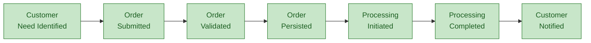
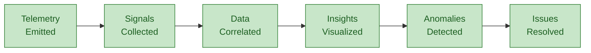
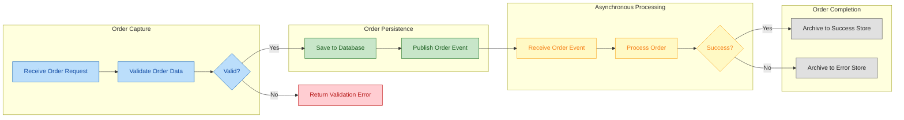

# Business Architecture

## 1. Business Context

### Problem Statement

Organizations operating distributed systems face significant challenges in understanding system behavior across service boundaries. When orders fail or experience delays, operations teams struggle to correlate events across microservices, messaging infrastructure, and workflow automation—resulting in extended resolution times and degraded customer experience.

### Solution Value Proposition

This solution delivers measurable business value through:

- **Reduced incident resolution time** — Correlated traces enable root cause identification in minutes rather than hours
- **Operational transparency** — Real-time visibility into order processing status across all system components
- **Compliance readiness** — Complete audit trail of order lifecycle events with tamper-evident storage
- **Development velocity** — Local development parity eliminates environment-specific defects

### Target Users and Personas

| Persona                             | Role          | Primary Needs                                                                    |
| ----------------------------------- | ------------- | -------------------------------------------------------------------------------- |
| **Store Operations Manager**        | Business user | View order status, identify processing delays, report on fulfillment metrics     |
| **Customer Service Representative** | Business user | Look up specific orders, understand order state, communicate status to customers |
| **Platform Engineer**               | Technical     | Deploy infrastructure, configure monitoring, maintain system health              |
| **Application Developer**           | Technical     | Implement features, debug issues, understand service interactions                |
| **Site Reliability Engineer**       | Technical     | Monitor system health, respond to incidents, optimize performance                |

---

## 2. Business Capabilities

```mermaid
flowchart TB
    subgraph CoreBusiness["Core Business Capabilities"]
        direction TB
        OC[Order Capture]
        OP[Order Processing]
        OF[Order Fulfillment Tracking]
    end

    subgraph Enabling["Enabling Capabilities"]
        direction TB
        IM[Identity Management]
        SM[Secrets Management]
        CM[Configuration Management]
    end

    subgraph Supporting["Supporting Capabilities"]
        direction TB
        OBS[Operational Observability]
        EM[Event Management]
        DM[Data Management]
    end

    classDef core fill:#BBDEFB,stroke:#1565C0,color:#0D47A1
    classDef enabling fill:#B2DFDB,stroke:#00695C,color:#004D40
    classDef supporting fill:#E0E0E0,stroke:#616161,color:#212121

    class OC,OP,OF core
    class IM,SM,CM enabling
    class OBS,EM,DM supporting
```

### Capability Descriptions

| Capability                     | Description                                                      | Business Outcome                                    |
| ------------------------------ | ---------------------------------------------------------------- | --------------------------------------------------- |
| **Order Capture**              | Accept and validate customer orders through web interface        | Orders recorded accurately with validation feedback |
| **Order Processing**           | Transform captured orders through business rules and persistence | Orders persisted with transactional integrity       |
| **Order Fulfillment Tracking** | Monitor and archive order processing outcomes                    | Visibility into order completion status             |
| **Operational Observability**  | Collect and correlate telemetry across services                  | Proactive issue detection and rapid resolution      |
| **Event Management**           | Distribute order events to interested subscribers                | Decoupled, reliable inter-service communication     |
| **Data Management**            | Persist and retrieve order and telemetry data                    | Consistent data access with audit capability        |
| **Identity Management**        | Authenticate services and authorize access                       | Secure service-to-service communication             |
| **Secrets Management**         | Protect and distribute sensitive configuration                   | Zero-credential application deployment              |
| **Configuration Management**   | Manage environment-specific settings                             | Consistent behavior across environments             |

---

## 3. Stakeholder Analysis

| Stakeholder               | Concerns                                                            | How Architecture Addresses                                                     |
| ------------------------- | ------------------------------------------------------------------- | ------------------------------------------------------------------------------ |
| **Business Operations**   | Order visibility, processing delays, fulfillment reporting          | Real-time dashboards, end-to-end tracing, archival storage for reporting       |
| **Development Teams**     | Feature velocity, debugging complexity, environment parity          | Local emulators, distributed tracing, structured logging with correlation IDs  |
| **Platform Engineering**  | Infrastructure consistency, deployment reliability, cost management | Modular Bicep templates, azd automation, consumption-based scaling             |
| **Security & Compliance** | Credential exposure, access audit, data protection                  | Managed identity authentication, Log Analytics audit trails, encrypted storage |
| **Site Reliability**      | System availability, incident response, capacity planning           | Health checks, Application Insights alerts, auto-scaling configuration         |

---

## 4. Value Streams

### Order Management Value Stream

### Monitoring and Observability Value Stream

---

## 5. Quality Attribute Requirements

| Attribute           | Requirement                                                                                     | Priority |
| ------------------- | ----------------------------------------------------------------------------------------------- | -------- |
| **Availability**    | System operational 99.9% during business hours; graceful degradation for non-critical paths     | High     |
| **Observability**   | All requests traceable end-to-end within 5 seconds of occurrence; traces retained 30 days       | High     |
| **Scalability**     | Handle 10x baseline order volume without manual intervention; scale to zero during idle         | High     |
| **Security**        | Zero credentials in application code; all service authentication via managed identity           | High     |
| **Reliability**     | No order loss during component failures; at-least-once message delivery guarantee               | High     |
| **Maintainability** | Local development without Azure subscription; modular infrastructure templates                  | Medium   |
| **Performance**     | Order submission response under 2 seconds p95; batch operations under 30 seconds for 100 orders | Medium   |

---

## 6. Business Process Flows

### Order Lifecycle Process

---

## Cross-Architecture References

- [Data Architecture](02-data-architecture.md) — Data domains supporting these capabilities
- [Application Architecture](03-application-architecture.md) — Services implementing these processes
- [Technology Architecture](04-technology-architecture.md) — Platform enabling these value streams
