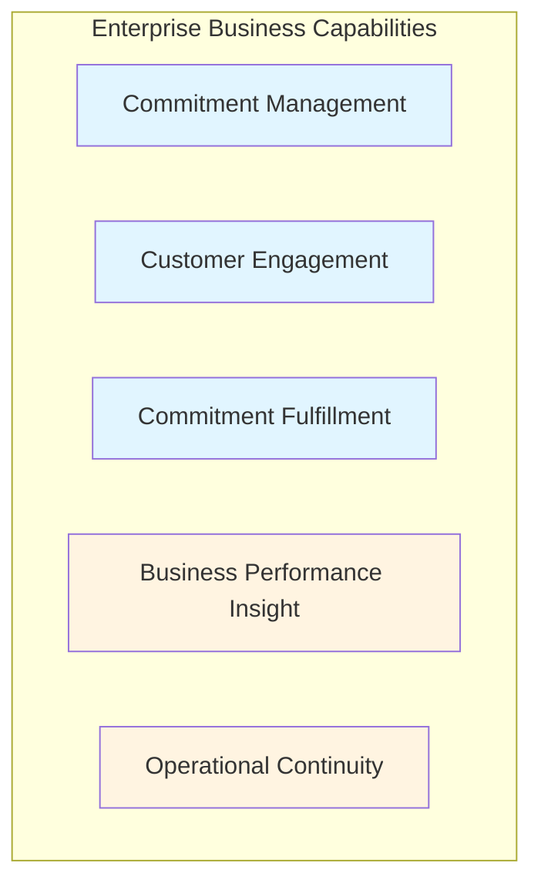
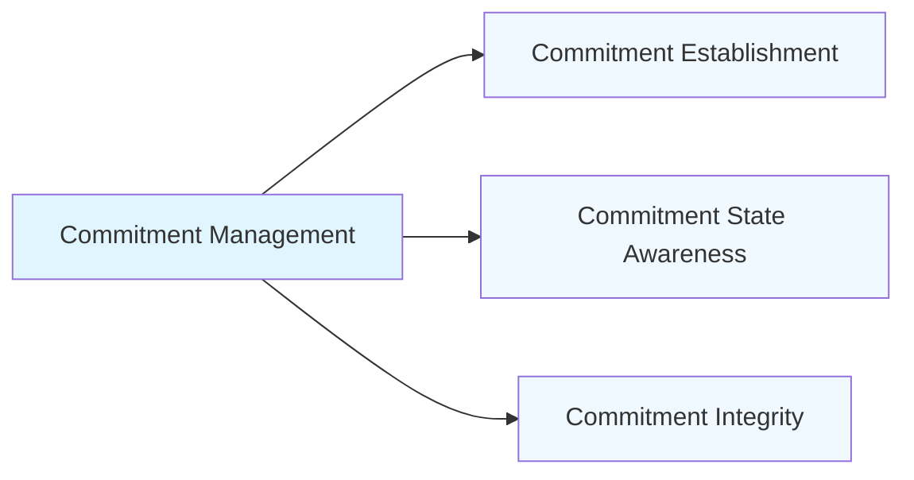
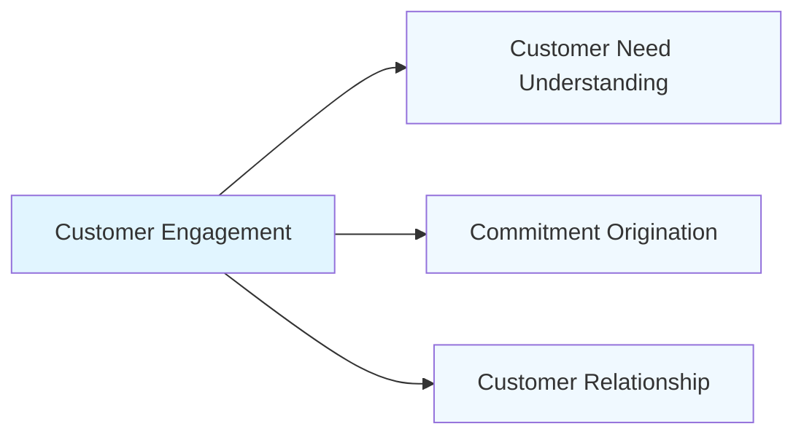
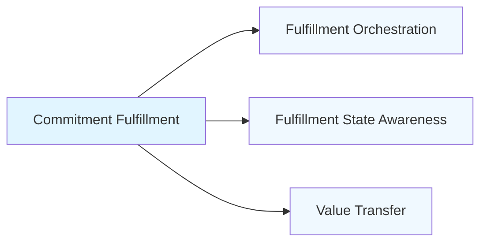
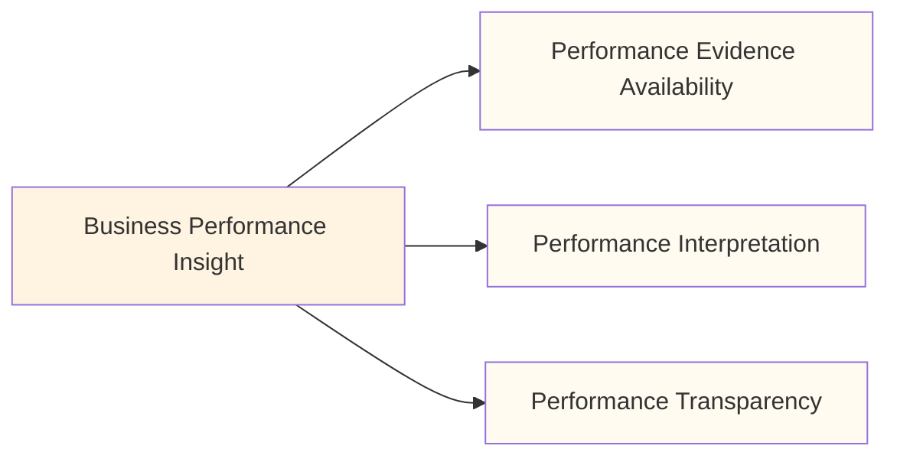
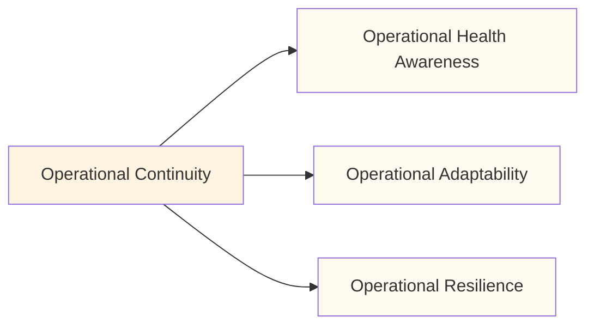
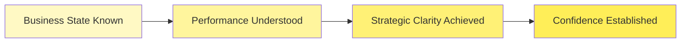
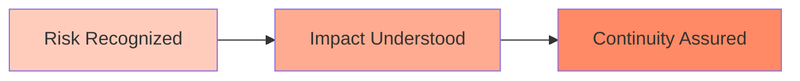
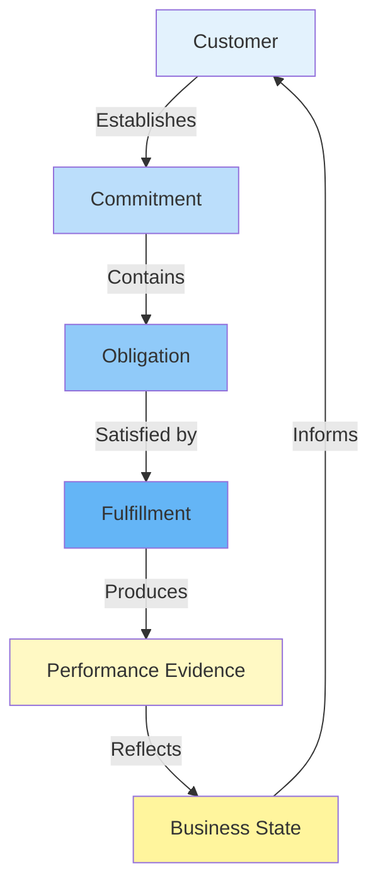

# Business Architecture Document

**Document Type:** TOGAF Business Architecture (BDAT)  
**Version:** 1.0  
**Date:** January 8, 2026  
**Status:** Approved for Enterprise Architecture Review

---

## Executive Summary

This Business Architecture defines the foundational capabilities, value streams, and information concepts required for the organization to fulfill customer commitments through order-based commerce. The architecture establishes a stable, technology-agnostic view of what the business must be able to do to create and sustain stakeholder value.

This document conforms to TOGAF Business Architecture Domain (BDAT) principles and provides the business foundation upon which application, data, and technology architectures may be designed.

---

## 1. Business Context and Strategic Intent

### 1.1 Business Purpose

The organization exists to:

- Enable customers to articulate and formalize commercial commitments
- Ensure commitments are honored through structured fulfillment
- Maintain visibility into commitment status throughout its lifecycle
- Build confidence through transparent accountability

### 1.2 Business Goals

**Primary Goals:**

1. **Commitment Certainty** — Customers can establish binding commitments with confidence
2. **Fulfillment Assurance** — Obligations are met reliably and predictably
3. **Transparency** — Stakeholders maintain continuous awareness of commitment states
4. **Adaptive Resilience** — The business adapts to changing conditions while preserving value delivery

**Success Outcomes:**

- Customers trust the organization to honor commitments
- Stakeholders make informed decisions based on accurate business state
- The organization responds to market dynamics without disrupting value delivery
- Business continuity is maintained through operational awareness

### 1.3 Stakeholder Value Expectations

| Stakeholder | Primary Value Expected                       |
| ----------- | -------------------------------------------- |
| Customer    | Certainty that commitment will be honored    |
| Operations  | Visibility into commitment fulfillment state |
| Leadership  | Insight into business performance patterns   |
| Partners    | Predictable and accountable collaboration    |

---

## 2. Business Capability Model

Business Capabilities represent **what the business must be able to do** to deliver value. Capabilities are stable, surviving changes in organization, process, and technology.

### 2.1 Level 1 Capabilities

### 2.2 Capability Definitions

#### 2.2.1 Commitment Management

**Definition:** The ability to establish, maintain, and conclude formal business commitments between the organization and its customers.

**Purpose:** Enable the creation of binding obligations that define expectations, terms, and fulfillment requirements.

**Business Value:** Provides the foundation for commercial relationships and accountability.

---

#### 2.2.2 Customer Engagement

**Definition:** The ability to interact with customers, understand their needs, and establish mutually beneficial relationships.

**Purpose:** Create pathways for customers to articulate intent and initiate commitments.

**Business Value:** Builds trust and enables demand expression.

---

#### 2.2.3 Commitment Fulfillment

**Definition:** The ability to satisfy obligations defined within commitments through coordinated delivery of goods or services.

**Purpose:** Honor customer expectations and complete the value exchange.

**Business Value:** Transforms commitment into realized value, building reputation and retention.

---

#### 2.2.4 Business Performance Insight

**Definition:** The ability to understand, interpret, and communicate the state and performance of business operations.

**Purpose:** Enable informed decision-making by providing visibility into business outcomes.

**Business Value:** Supports strategic adaptation and operational improvement.

---

#### 2.2.5 Operational Continuity

**Definition:** The ability to sustain business operations through changing conditions, exceptions, and unexpected events.

**Purpose:** Maintain value delivery resilience regardless of internal or external disruption.

**Business Value:** Protects stakeholder confidence and minimizes value interruption.

---

### 2.3 Level 2 Capability Decomposition

#### Commitment Management (Level 2)

- **Commitment Establishment** — The ability to formalize binding agreements
- **Commitment State Awareness** — The ability to know the current condition of commitments
- **Commitment Integrity** — The ability to ensure commitments remain valid and complete

#### Customer Engagement (Level 2)

- **Customer Need Understanding** — The ability to comprehend customer requirements
- **Commitment Origination** — The ability to begin formal commitments with customers
- **Customer Relationship** — The ability to maintain ongoing connections with customers

#### Commitment Fulfillment (Level 2)

- **Fulfillment Orchestration** — The ability to align resources toward obligation satisfaction
- **Fulfillment State Awareness** — The ability to know the current state of fulfillment
- **Value Transfer** — The ability to deliver value to customers

#### Business Performance Insight (Level 2)

- **Performance Evidence Availability** — The ability to possess indicators of business state
- **Performance Interpretation** — The ability to derive meaning from evidence
- **Performance Transparency** — The ability to make insight accessible to stakeholders

#### Operational Continuity (Level 2)

- **Operational Health Awareness** — The ability to know the condition of operations
- **Operational Adaptability** — The ability to adjust to exceptions and disruptions
- **Operational Resilience** — The ability to maintain capability during change

---

## 3. Business Value Streams

Value Streams describe **how value is delivered to stakeholders** through sequential stages. Each stage represents a meaningful value outcome.

### 3.1 Customer Commitment Value Stream

**Stakeholder:** Customer  
**Value Delivered:** Fulfilled commercial commitment  
**Purpose:** Enable customers to establish commitments and receive value

**Value Stage Definitions:**

| Stage                    | Value Outcome                          | Stakeholder Benefit                   |
| ------------------------ | -------------------------------------- | ------------------------------------- |
| **Need Understood**      | Clarity on what customer requires      | Customer can articulate intent        |
| **Commitment Secured**   | Binding agreement in place             | Customer has certainty of fulfillment |
| **Fulfillment Assured**  | Confidence that obligation will be met | Customer trusts completion will occur |
| **Obligation Satisfied** | What was promised has been delivered   | Customer expectation has been met     |
| **Value Received**       | Customer possesses benefit sought      | Customer relationship strengthened    |

---

### 3.2 Business Oversight Value Stream

**Stakeholder:** Leadership / Operations Management  
**Value Delivered:** Informed understanding of business state  
**Purpose:** Enable evidence-based decision-making

**Value Stage Definitions:**

| Stage                          | Value Outcome                          | Stakeholder Benefit                      |
| ------------------------------ | -------------------------------------- | ---------------------------------------- |
| **Business State Known**       | Current operational condition visible  | Leadership knows what is happening       |
| **Performance Understood**     | Meaning of business state comprehended | Leadership understands implications      |
| **Strategic Clarity Achieved** | Path forward is evident                | Leadership knows what should happen next |
| **Confidence Established**     | Decision risk is minimized             | Leadership can commit to direction       |

---

### 3.3 Operational Resilience Value Stream

**Stakeholder:** Operations / Support Teams  
**Value Delivered:** Sustained operational capability  
**Purpose:** Maintain business continuity through exceptions

**Value Stage Definitions:**

| Stage                  | Value Outcome                    | Stakeholder Benefit                    |
| ---------------------- | -------------------------------- | -------------------------------------- |
| **Risk Recognized**    | Threat to operations is known    | Operations aware of what could fail    |
| **Impact Understood**  | Consequence of risk comprehended | Operations knows severity and scope    |
| **Continuity Assured** | Value delivery remains intact    | Stakeholders protected from disruption |

---

## 4. Business Information Concepts

Business Information Concepts represent the **things the business must know about** to create value. These are domain concepts, not data models.

### 4.1 Core Concepts

#### 4.1.1 Commitment

**Definition:** A binding agreement between the organization and a customer defining mutual obligations and expectations.

**Characteristics:**

- Identifies parties to the agreement
- Specifies obligations to be fulfilled
- Defines terms and conditions
- Possesses a lifecycle state

**Purpose:** Formalizes the value exchange relationship.

---

#### 4.1.2 Customer

**Definition:** A party with whom the organization establishes commitments for the exchange of value.

**Characteristics:**

- Possesses identity
- Articulates needs
- Receives value
- Maintains relationship over time

**Purpose:** Represents the recipient of value and source of demand.

---

#### 4.1.3 Obligation

**Definition:** A specific requirement within a commitment that must be satisfied to honor the agreement.

**Characteristics:**

- Describes what must be delivered
- Defines fulfillment criteria
- Contains quantity or measure
- Has a state of completion

**Purpose:** Defines the actionable components of a commitment.

---

#### 4.1.4 Fulfillment

**Definition:** The act or state of satisfying obligations defined within a commitment.

**Characteristics:**

- Progresses through stages
- Can be confirmed or verified
- Results in value transfer
- Concludes commitment lifecycle

**Purpose:** Represents the realization of value promised in a commitment.

---

#### 4.1.5 Performance Evidence

**Definition:** Recorded indication of business activity, state, or outcome used to assess operational health.

**Characteristics:**

- Captures business events
- Reflects state at a point in time
- Enables interpretation
- Informs decision-making

**Purpose:** Provides the foundation for business insight and oversight.

---

#### 4.1.6 Business State

**Definition:** The collective condition of capabilities, commitments, and operations at a given moment.

**Characteristics:**

- Observable through evidence
- Changes over time
- Influences decisions
- Reflects health and risk

**Purpose:** Enables situational awareness and adaptive response.

---

### 4.2 Concept Relationships

**Relationship Semantics:**

- **Customer ↔ Commitment:** Customers establish one or many commitments
- **Commitment ↔ Obligation:** A commitment contains one or many obligations
- **Obligation ↔ Fulfillment:** Each obligation is satisfied by fulfillment activity
- **Fulfillment → Performance Evidence:** Fulfillment generates evidence of business activity
- **Performance Evidence → Business State:** Evidence reflects the current business state
- **Business State → Customer:** Business state informs customer awareness

---

## 5. Capability-to-Value Stream Mapping

This section illustrates which capabilities enable which value stages.

### 5.1 Customer Commitment Value Stream Enablement

| Value Stage          | Enabled By Capabilities                            |
| -------------------- | -------------------------------------------------- |
| Need Understood      | Customer Engagement (Customer Need Understanding)  |
| Commitment Secured   | Commitment Management (Commitment Establishment)   |
| Fulfillment Assured  | Commitment Fulfillment (Fulfillment Orchestration) |
| Obligation Satisfied | Commitment Fulfillment (Value Transfer)            |
| Value Received       | Customer Engagement (Customer Relationship)        |

### 5.2 Business Oversight Value Stream Enablement

| Value Stage                | Enabled By Capabilities                                          |
| -------------------------- | ---------------------------------------------------------------- |
| Business State Known       | Business Performance Insight (Performance Evidence Availability) |
| Performance Understood     | Business Performance Insight (Performance Interpretation)        |
| Strategic Clarity Achieved | Business Performance Insight (Performance Transparency)          |
| Confidence Established     | Operational Continuity (Operational Adaptability)                |

### 5.3 Operational Resilience Value Stream Enablement

| Value Stage        | Enabled By Capabilities                                   |
| ------------------ | --------------------------------------------------------- |
| Risk Recognized    | Operational Continuity (Operational Health Awareness)     |
| Impact Understood  | Business Performance Insight (Performance Interpretation) |
| Continuity Assured | Operational Continuity (Operational Resilience)           |

---

## 6. Business Principles

Business Principles guide decision-making across all architecture domains.

### 6.1 Commitment Integrity

**Principle:** Every commitment made must be honored or explicitly renegotiated.

**Rationale:** Stakeholder trust depends on predictable fulfillment of obligations.

**Implications:**

- Capabilities must support commitment state visibility
- Exceptions must be communicated proactively
- Fulfillment must be verifiable

---

### 6.2 Stakeholder Transparency

**Principle:** Stakeholders maintain continuous awareness of relevant business state.

**Rationale:** Informed stakeholders make better decisions and maintain confidence.

**Implications:**

- Performance evidence must be accessible
- Business state must be interpretable
- Communication must be timely and meaningful

---

### 6.3 Capability Stability

**Principle:** Business capabilities remain stable regardless of organizational or technological change.

**Rationale:** Stability enables continuity through transformation.

**Implications:**

- Capabilities are defined by value, not implementation
- Organizational restructuring does not eliminate capabilities
- Technology evolution does not redefine what the business does

---

### 6.4 Value-Driven Sequencing

**Principle:** Value streams reflect stakeholder value accumulation, not internal process.

**Rationale:** The business exists to serve stakeholders, not to execute tasks.

**Implications:**

- Value stages must be meaningful to stakeholders
- Internal complexity is abstracted from value streams
- Measurement focuses on value delivered, not activity performed

---

## 7. Architecture Compliance

### 7.1 TOGAF BDAT Conformance

This Business Architecture conforms to TOGAF Business Architecture Domain (BDAT) standards:

✅ **Business Capabilities** are stable, technology-independent, and value-focused  
✅ **Value Streams** are sequential and stakeholder-oriented  
✅ **Value Stages** represent outcomes, not tasks or activities  
✅ **Information Concepts** use ubiquitous business language  
✅ **No implementation details** are included in business definitions

### 7.2 Validation Checklist

- [ ] Capabilities survive organizational change
- [ ] Capabilities are noun-based and non-technical
- [ ] Value Streams are sequential without branching
- [ ] Value Stages answer "What value now exists?"
- [ ] Information concepts reflect business meaning
- [ ] No processes, workflows, or execution logic present
- [ ] No technology, systems, or applications referenced
- [ ] Stakeholder value is clearly articulated

---

## 8. Next Steps

This Business Architecture serves as the foundation for:

1. **Application Architecture** — Define applications that realize capabilities
2. **Data Architecture** — Model information concepts as data structures
3. **Technology Architecture** — Select platforms that support capability execution
4. **Solution Architecture** — Design integrated solutions aligned to value streams

---

## Appendix A: Glossary

| Term                     | Definition                                                      |
| ------------------------ | --------------------------------------------------------------- |
| **Capability**           | What the business must be able to do to create value            |
| **Value Stream**         | Sequential representation of value delivery to a stakeholder    |
| **Value Stage**          | A point in a value stream where meaningful value outcome exists |
| **Commitment**           | Binding agreement defining mutual obligations                   |
| **Fulfillment**          | Act of satisfying obligations within a commitment               |
| **Performance Evidence** | Recorded indication of business activity or state               |
| **Business State**       | Collective condition of capabilities and operations             |
| **Stakeholder**          | Party who receives or depends on business value                 |

---

## Document Control

| Version | Date       | Author                  | Changes                                  |
| ------- | ---------- | ----------------------- | ---------------------------------------- |
| 1.0     | 2026-01-08 | Enterprise Architecture | Initial TOGAF BDAT business architecture |

---

**Document Classification:** Internal Use — Enterprise Architecture  
**Review Cycle:** Annual or upon significant business change  
**Approval Authority:** Chief Architect / Enterprise Architecture Board

---

_This document describes WHAT the business must be capable of and WHY. It does not describe HOW capabilities are realized. Application, data, and technology architectures derive from this foundation._
