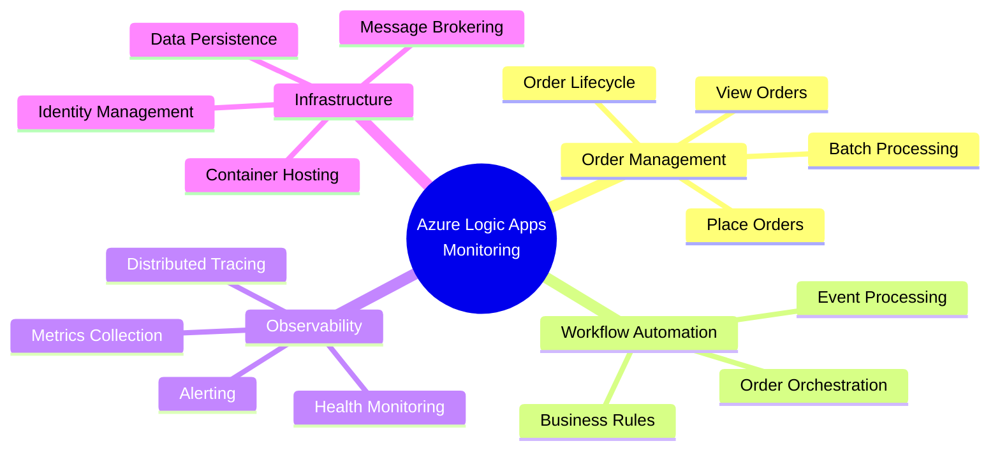
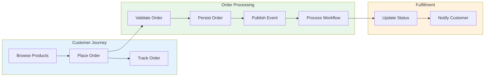
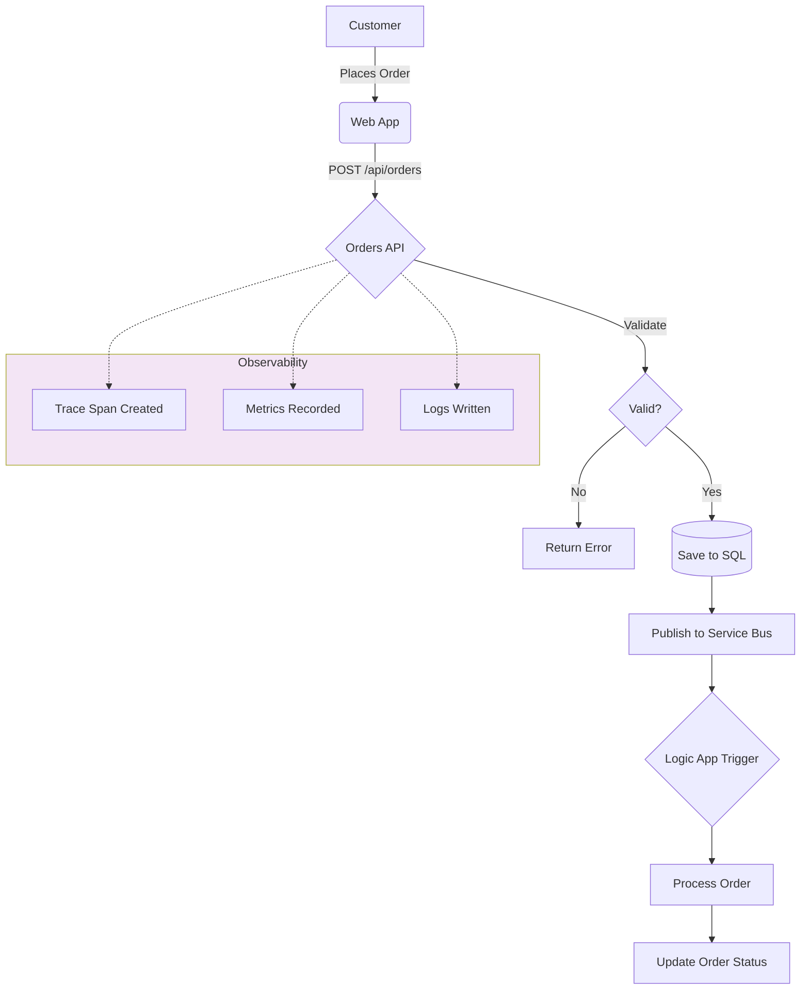

# Business Architecture

← [Architecture Overview](README.md) | [Index](README.md) | [Data Architecture →](02-data-architecture.md)

## Business Context

### Problem Statement

Organizations deploying Azure Logic Apps Standard workflows face significant challenges in achieving comprehensive observability:

1. **Fragmented Monitoring**: Logic Apps, APIs, and databases often use separate monitoring solutions, creating visibility gaps
2. **Trace Discontinuity**: Distributed traces break at service boundaries, making root cause analysis difficult
3. **Operational Complexity**: Without unified observability, mean time to detection (MTTD) and resolution (MTTR) increase
4. **Reference Gap**: Few production-ready examples demonstrate end-to-end observability patterns for Logic Apps

### Solution Value Proposition

The Azure Logic Apps Monitoring Solution provides:

- **Unified Observability**: Single Application Insights instance correlating traces across all components
- **Reference Implementation**: Production-ready patterns for distributed tracing, structured logging, and health monitoring
- **Developer Productivity**: .NET Aspire simplifies local development with emulators matching Azure services
- **Operational Excellence**: Health checks, alerting, and diagnostics enable proactive issue detection

### Target Users

| Persona | Goals | Solution Benefits |
|---------|-------|-------------------|
| **Developer** | Build observable services quickly | ServiceDefaults library, Aspire dashboard, structured logging patterns |
| **Platform Engineer** | Deploy reliable infrastructure | Bicep modules, managed identity, azd automation |
| **Operations/SRE** | Monitor and troubleshoot efficiently | End-to-end traces, health endpoints, Application Insights integration |
| **Architect** | Evaluate patterns for adoption | Reference architecture, ADRs, comprehensive documentation |

---

## Business Capabilities

### Capability Descriptions

| Capability | Description | Primary Components |
|------------|-------------|-------------------|
| **Order Management** | CRUD operations for customer orders with validation and persistence | eShop.Orders.API, eShop.Web.App |
| **Workflow Automation** | Event-driven processing of orders through Logic Apps workflows | OrdersManagement Logic App, Service Bus |
| **Observability** | End-to-end visibility into system behavior through traces, metrics, and logs | Application Insights, OpenTelemetry, Health Checks |
| **Infrastructure** | Cloud-native platform services for compute, messaging, and storage | Container Apps, Service Bus, SQL Database |

---

## Stakeholder Analysis

| Stakeholder | Key Concerns | How Architecture Addresses |
|-------------|--------------|---------------------------|
| **Development Team** | Fast feedback loops, debugging support | Aspire dashboard for local dev, structured logging with correlation IDs |
| **Operations Team** | System reliability, incident response | Health endpoints (`/health`, `/alive`), Application Insights alerts |
| **Security Team** | Credential management, access control | Managed identities, no secrets in code, RBAC role assignments |
| **Business Owners** | Feature delivery, system availability | CI/CD automation, 99.9% SLA-capable infrastructure |
| **Platform Team** | Infrastructure consistency, cost control | IaC with Bicep, resource tagging, environment isolation |

---

## Value Streams

### Order Management Value Stream

### Observability Value Stream

| Stage | Activity | Outcome |
|-------|----------|---------|
| **Instrumentation** | Add telemetry to services | Traces, metrics, logs generated |
| **Collection** | Send data to Application Insights | Centralized telemetry storage |
| **Correlation** | Link traces across services | End-to-end request visibility |
| **Analysis** | Query and visualize data | Performance insights, error patterns |
| **Action** | Alert on anomalies | Proactive incident response |

---

## Quality Attribute Requirements

| Attribute | Requirement | Priority | Implementation |
|-----------|-------------|----------|----------------|
| **Availability** | 99.9% uptime for order processing | High | Container Apps scaling, health checks, retry policies |
| **Observability** | End-to-end trace correlation | Critical | OpenTelemetry, Application Insights, W3C trace context |
| **Scalability** | Handle 1000 orders/minute | Medium | Container Apps autoscaling, Service Bus partitioning |
| **Performance** | API response < 500ms (p95) | High | SQL connection pooling, async operations |
| **Security** | No credentials in code | Critical | Managed identities, Azure Key Vault integration ready |
| **Maintainability** | Modular, testable code | High | Clean architecture, dependency injection, IaC |
| **Operability** | Rapid incident diagnosis | High | Structured logging, correlation IDs, health endpoints |

---

## Business Process: Order Lifecycle

---

## Related Documents

- [Application Architecture](03-application-architecture.md) - Service details and APIs
- [Observability Architecture](05-observability-architecture.md) - Monitoring implementation
- [ADR-003: Observability Strategy](adr/ADR-003-observability-strategy.md) - Decision rationale
