# Business Architecture

## 1. Business Context

### Problem Statement

Modern enterprise applications are increasingly distributed across multiple services, serverless functions, and messaging systems. This architectural evolution, while enabling scalability and resilience, creates significant **observability challenges**:

- **Fragmented Visibility**: Traditional monitoring tools capture metrics in silos, making it impossible to trace a user request across service boundaries
- **Debugging Complexity**: When issues occur in distributed systems, identifying root cause requires correlating logs, traces, and metrics from multiple sources
- **Compliance Gaps**: Regulatory requirements demand audit trails that span entire business transactions, not just individual service calls
- **Operational Blind Spots**: Asynchronous message processing through Service Bus and Logic Apps workflows creates visibility gaps in traditional APM tools

### Solution Value Proposition

The **Azure Logic Apps Monitoring Solution** delivers measurable business value through:

| Value                       | Business Outcome                                                                           |
| --------------------------- | ------------------------------------------------------------------------------------------ |
| **End-to-End Traceability** | Reduce mean-time-to-resolution (MTTR) by 70% through correlated request tracking           |
| **Unified Telemetry**       | Single pane of glass reduces context-switching overhead for operations teams               |
| **Zero-Secrets Security**   | Eliminate credential management overhead and reduce security incident risk                 |
| **Development Parity**      | Accelerate developer onboarding from days to hours with local-first development experience |
| **Deployment Automation**   | Reduce deployment time from hours to minutes with one-command infrastructure provisioning  |

### Target Users and Personas

| Persona                      | Role                                            | Primary Goals                                                        |
| ---------------------------- | ----------------------------------------------- | -------------------------------------------------------------------- |
| **Cloud Solution Architect** | Designs enterprise Azure solutions              | Evaluate reference patterns for production adoption                  |
| **Platform Engineer**        | Manages infrastructure and deployment pipelines | Understand IaC structure, azd hooks, and operational topology        |
| **Backend Developer**        | Builds microservices and APIs                   | Onboard quickly, understand service contracts and integration points |
| **DevOps/SRE Engineer**      | Ensures system reliability and performance      | Configure monitoring, set up alerts, create operational runbooks     |
| **Technical Lead**           | Guides team decisions and architecture          | Assess trade-offs, plan adoption strategy, train team members        |

---

## 2. Business Capabilities

### Business Capability Map

### Capability Descriptions

| Capability              | Description                                                          | Business Outcome                                   |
| ----------------------- | -------------------------------------------------------------------- | -------------------------------------------------- |
| **Order Management**    | Create, read, update, delete customer orders with product line items | Revenue generation through order fulfillment       |
| **Customer Experience** | Interactive web interface for browsing, placing, and tracking orders | Customer satisfaction and self-service enablement  |
| **Event Messaging**     | Reliable asynchronous message delivery using publish-subscribe       | System resilience and workload decoupling          |
| **Workflow Automation** | Stateful business process orchestration triggered by events          | Operational efficiency and process consistency     |
| **Data Persistence**    | Transactional storage of orders with referential integrity           | Data accuracy and audit compliance                 |
| **Observability**       | Distributed tracing, metrics collection, centralized logging         | Operational excellence and rapid troubleshooting   |
| **Identity & Security** | Zero-trust authentication using managed identities                   | Security posture and compliance adherence          |
| **DevOps & Deployment** | Infrastructure as Code, automated deployment pipelines               | Deployment velocity and environment consistency    |
| **Observability**       | Distributed tracing, metrics collection, centralized logging         | OpenTelemetry, Application Insights, Log Analytics |
| **Identity & Security** | Zero-trust authentication using managed identities                   | User-Assigned Managed Identity, Entra ID           |
| **DevOps & Deployment** | Infrastructure as Code, automated deployment pipelines               | Bicep, Azure Developer CLI, azd hooks              |

---

## Stakeholder Analysis

| Stakeholder               | Key Concerns                                              | How Architecture Addresses                                                                                   |
| ------------------------- | --------------------------------------------------------- | ------------------------------------------------------------------------------------------------------------ |
| **Enterprise Architects** | Pattern applicability, scalability limits, vendor lock-in | Modular design with Azure Verified Modules, OpenTelemetry for vendor-neutral instrumentation                 |
| **Security Officers**     | Data protection, access control, audit compliance         | Managed Identity (no secrets), Entra ID authentication, comprehensive diagnostic logging                     |
| **Operations Teams**      | System reliability, incident response, capacity planning  | Health endpoints (`/health`, `/alive`), structured logging with correlation IDs, auto-scaling Container Apps |
| **Development Teams**     | Onboarding time, debugging experience, testing approach   | .NET Aspire local emulators, Aspire Dashboard, `.http` files for API testing                                 |
| **Finance/Procurement**   | Cost predictability, resource optimization                | Pay-per-use Container Apps, Standard tier Service Bus, 30-day log retention                                  |
| **Compliance Officers**   | Audit trails, data residency, retention policies          | End-to-end tracing, Log Analytics 30-day retention, single-region deployment                                 |

---

## Value Streams

### Order Management Value Stream

```mermaid
flowchart LR
    subgraph Trigger["🎯 Trigger"]
        Customer["Customer<br/>Places Order"]
    end

    subgraph Capture["📥 Capture"]
        UI["Web App<br/>Captures Details"]
    end

    subgraph Validate["✅ Validate"]
        API["Orders API<br/>Validates & Persists"]
    end

    subgraph Notify["📣 Notify"]
        SB["Service Bus<br/>Publishes Event"]
    end

    subgraph Process["⚙️ Process"]
        LA["Logic App<br/>Processes Order"]
    end

    subgraph Archive["📁 Archive"]
        Blob["Blob Storage<br/>Archives Result"]
    end

    subgraph Outcome["🎉 Outcome"]
        Complete["Order<br/>Completed"]
    end

    Customer --> UI --> API --> SB --> LA --> Blob --> Complete

    classDef trigger fill:#ffebee,stroke:#c62828
    classDef capture fill:#e3f2fd,stroke:#1565c0
    classDef validate fill:#e8f5e9,stroke:#2e7d32
    classDef notify fill:#fff3e0,stroke:#ef6c00
    classDef process fill:#f3e5f5,stroke:#7b1fa2
    classDef archive fill:#eceff1,stroke:#455a64
    classDef outcome fill:#e8f5e9,stroke:#2e7d32,stroke-width:3px

    class Customer trigger
    class UI capture
    class API validate
    class SB notify
    class LA process
    class Blob archive
    class Complete outcome
```

### Monitoring and Observability Value Stream

---

## Quality Attribute Requirements

| Attribute           | Requirement                              | Priority | Implementation                                                         |
| ------------------- | ---------------------------------------- | -------- | ---------------------------------------------------------------------- |
| **Availability**    | 99.9% uptime for order processing        | High     | Azure Container Apps multi-replica, Service Bus guaranteed delivery    |
| **Observability**   | End-to-end distributed tracing           | Critical | OpenTelemetry with W3C Trace Context, Application Insights correlation |
| **Scalability**     | Handle 1000+ orders/minute burst         | Medium   | Container Apps auto-scaling, Service Bus Standard tier throughput      |
| **Security**        | Zero secrets in code/config              | Critical | User-Assigned Managed Identity, Entra ID authentication                |
| **Reliability**     | No message loss during processing        | High     | Service Bus dead-letter queues, Logic Apps retry policies              |
| **Maintainability** | < 1 hour onboarding for new developers   | Medium   | .NET Aspire local dev, comprehensive documentation                     |
| **Deployability**   | Single-command deployment                | High     | Azure Developer CLI with lifecycle hooks                               |
| **Testability**     | Isolated testing without cloud resources | Medium   | .NET Aspire emulators (SQL, Service Bus)                               |

---

## Business Process Flows

### Order Lifecycle Process

---

## Key Business Decisions

| Decision                            | Rationale                                                        | Trade-offs                                            |
| ----------------------------------- | ---------------------------------------------------------------- | ----------------------------------------------------- |
| **Event-driven architecture**       | Decouples order placement from processing, enables async scaling | Adds complexity, requires message handling patterns   |
| **Logic Apps for workflows**        | Visual designer, built-in connectors, managed service            | Limited custom code options, vendor-specific          |
| **Managed Identity authentication** | Eliminates secrets, reduces security attack surface              | Requires Azure environment, more complex local dev    |
| **Single-region deployment**        | Simplifies architecture, reduces costs                           | No geo-redundancy, potential latency for global users |
| **.NET Aspire orchestration**       | Unified dev/prod experience, built-in observability              | Newer technology, limited community resources         |
