# 01 - Business Architecture

[← Architecture Overview](README.md) | [Index](README.md) | [Data Architecture →](02-data-architecture.md)

---

## Business Context

### Problem Statement

Organizations deploying Azure Logic Apps Standard workflows face significant challenges in achieving end-to-end observability across their distributed systems. Traditional monitoring approaches fail to provide correlation between initiating events (API calls, user actions) and downstream workflow executions, leaving operations teams unable to trace transactions through the complete processing pipeline. This lack of visibility increases mean-time-to-resolution (MTTR), complicates compliance auditing, and hinders performance optimization efforts.

### Solution Value Proposition

The Azure Logic Apps Monitoring Solution delivers a **reference architecture** that demonstrates how to instrument event-driven workflows with enterprise-grade observability. By implementing W3C Trace Context propagation across HTTP, Service Bus, and Logic Apps boundaries, the solution enables complete transaction tracing from user interaction to workflow completion. The architecture provides:

- **Operational Excellence**: Sub-second root cause identification through correlated traces
- **Developer Productivity**: Local development parity eliminating Azure costs during inner loop
- **Security Posture**: Zero-secrets architecture using Managed Identity throughout
- **Cost Efficiency**: Pay-per-use consumption model with automatic scaling to zero

---

## Business Capabilities

### Capability Map

```mermaid
flowchart TB
    subgraph Core["🎯 Core Capabilities"]
        direction LR
        C1["📦 Order Management"]
        C2["🔄 Workflow Automation"]
    end

    subgraph Enabling["⚙️ Enabling Capabilities"]
        direction LR
        E1["📊 Observability"]
        E2["🔐 Identity Management"]
        E3["💬 Messaging"]
    end

    subgraph Foundation["🏗️ Foundation Capabilities"]
        direction LR
        F1["☁️ Cloud Infrastructure"]
        F2["🗄️ Data Persistence"]
        F3["📡 API Gateway"]
    end

    Core --> Enabling
    Enabling --> Foundation

    C1 -.->|"publishes events"| E3
    C2 -.->|"triggered by"| E3
    C1 -.->|"monitored by"| E1
    C2 -.->|"monitored by"| E1
    C1 -.->|"authenticated via"| E2
    C2 -.->|"authenticated via"| E2

    classDef core fill:#e3f2fd,stroke:#1565c0,stroke-width:2px
    classDef enabling fill:#e8f5e9,stroke:#2e7d32,stroke-width:2px
    classDef foundation fill:#f5f5f5,stroke:#616161,stroke-width:2px

    class C1,C2 core
    class E1,E2,E3 enabling
    class F1,F2,F3 foundation
```

### Capability Descriptions

| Capability               | Description                                                                                                         | Type       | Maturity  | Primary Components                                                                         |
| ------------------------ | ------------------------------------------------------------------------------------------------------------------- | ---------- | --------- | ------------------------------------------------------------------------------------------ |
| **Order Management**     | End-to-end handling of customer orders including validation, persistence, status tracking, and lifecycle management | Core       | Managed   | [eShop.Orders.API](../../src/eShop.Orders.API/), [eShop.Web.App](../../src/eShop.Web.App/) |
| **Workflow Automation**  | Event-driven orchestration of business processes triggered by domain events, with success/failure archival          | Core       | Defined   | [OrdersManagement Logic App](../../workflows/OrdersManagement/)                            |
| **Observability**        | Comprehensive visibility into system behavior through distributed traces, metrics, and structured logs              | Enabling   | Optimized | [app.ServiceDefaults](../../app.ServiceDefaults/), Application Insights                    |
| **Identity Management**  | Zero-secrets authentication and authorization for all services using Azure Entra ID                                 | Enabling   | Managed   | Managed Identity, Azure RBAC                                                               |
| **Messaging**            | Reliable asynchronous communication between services via topic-based pub/sub patterns                               | Enabling   | Managed   | Azure Service Bus                                                                          |
| **Cloud Infrastructure** | Automated provisioning and management of Azure resources via Infrastructure as Code                                 | Foundation | Optimized | [Bicep modules](../../infra/)                                                              |
| **Data Persistence**     | Transactional storage for orders and workflow state with high availability                                          | Foundation | Managed   | Azure SQL, Azure Storage                                                                   |
| **API Gateway**          | RESTful interface exposing order operations with OpenAPI documentation                                              | Foundation | Managed   | ASP.NET Core Web API                                                                       |

---

## Stakeholder Analysis

| Stakeholder                   | Concerns                                                          | How Architecture Addresses                                                 |
| ----------------------------- | ----------------------------------------------------------------- | -------------------------------------------------------------------------- |
| **Cloud Solution Architects** | Evaluate patterns for Azure observability reference architectures | Provides TOGAF-aligned documentation with ADRs explaining design rationale |
| **Platform Engineers**        | Understand infrastructure dependencies and deployment topology    | Modular Bicep templates with clear module boundaries and dependency graph  |
| **Backend Developers**        | Onboard quickly, understand service boundaries and APIs           | Clear bounded contexts, OpenAPI specs, typed HTTP clients                  |
| **DevOps/SRE Teams**          | Comprehend monitoring, alerting, and operational runbooks         | Three-pillar observability with alert catalog and KQL query examples       |
| **Security Teams**            | Validate zero-trust implementation and data protection            | Managed Identity flow diagrams, RBAC assignments, encryption documentation |
| **Business Stakeholders**     | Demonstrate ROI and operational efficiency improvements           | Value stream mapping, capability-to-outcome traceability                   |

---

## Value Streams

### Order Fulfillment Value Stream

```mermaid
flowchart LR
    subgraph Trigger["🎯 Trigger"]
        T1["Customer places<br/>order via UI"]
    end

    subgraph Stages["📊 Value Stream Stages"]
        S1["1️⃣ Capture<br/><i>Validate & persist</i>"]
        S2["2️⃣ Publish<br/><i>Emit event</i>"]
        S3["3️⃣ Process<br/><i>Workflow execution</i>"]
        S4["4️⃣ Archive<br/><i>Store outcome</i>"]
    end

    subgraph Outcome["✅ Outcome"]
        O1["Order processed<br/>& traceable"]
    end

    T1 --> S1 --> S2 --> S3 --> S4 --> O1

    classDef trigger fill:#e3f2fd,stroke:#1565c0,stroke-width:2px
    classDef stage fill:#fff3e0,stroke:#ef6c00,stroke-width:2px
    classDef outcome fill:#e8f5e9,stroke:#2e7d32,stroke-width:2px

    class T1 trigger
    class S1,S2,S3,S4 stage
    class O1 outcome
```

#### Value Stream Details

| Stage       | Description                                                            | Capabilities                             | Cycle Time | Value-Add % |
| ----------- | ---------------------------------------------------------------------- | ---------------------------------------- | ---------- | ----------- |
| **Capture** | Order submitted via Web UI, validated, and persisted to SQL Database   | Order Management, Data Persistence       | ~500ms     | 80%         |
| **Publish** | OrderPlaced event published to Service Bus topic with trace context    | Messaging, Observability                 | ~100ms     | 90%         |
| **Process** | Logic App triggered, calls Orders API, determines success/failure path | Workflow Automation, Identity Management | ~2s        | 70%         |
| **Archive** | Order data written to Blob Storage in success or error container       | Data Persistence, Workflow Automation    | ~300ms     | 60%         |

### Observability Value Stream

```mermaid
flowchart LR
    subgraph Trigger["🎯 Trigger"]
        T1["Telemetry<br/>emitted"]
    end

    subgraph Stages["📊 Value Stream Stages"]
        S1["1️⃣ Instrument<br/><i>Capture data</i>"]
        S2["2️⃣ Collect<br/><i>Aggregate</i>"]
        S3["3️⃣ Analyze<br/><i>Query & alert</i>"]
        S4["4️⃣ Act<br/><i>Respond</i>"]
    end

    subgraph Outcome["✅ Outcome"]
        O1["Issue<br/>resolved"]
    end

    T1 --> S1 --> S2 --> S3 --> S4 --> O1

    classDef trigger fill:#e3f2fd,stroke:#1565c0,stroke-width:2px
    classDef stage fill:#fce4ec,stroke:#c2185b,stroke-width:2px
    classDef outcome fill:#e8f5e9,stroke:#2e7d32,stroke-width:2px

    class T1 trigger
    class S1,S2,S3,S4 stage
    class O1 outcome
```

---

## Quality Attribute Requirements

| Attribute           | Requirement                                   | Priority | Implementation                                              |
| ------------------- | --------------------------------------------- | -------- | ----------------------------------------------------------- |
| **Availability**    | 99.9% uptime for order processing             | High     | Azure Container Apps multi-instance, SQL geo-redundancy     |
| **Observability**   | End-to-end trace correlation within 5 seconds | Critical | W3C Trace Context, OpenTelemetry, Application Insights      |
| **Scalability**     | Handle 1,000 orders/minute peak load          | Medium   | Consumption-based Container Apps, Service Bus partitioning  |
| **Security**        | Zero secrets in code or configuration         | Critical | User-Assigned Managed Identity, Azure Key Vault integration |
| **Recoverability**  | RPO < 1 hour, RTO < 15 minutes                | High     | Azure SQL backup, Service Bus dead-letter queue             |
| **Maintainability** | Deploy new version within 10 minutes          | Medium   | azd one-command deployment, Bicep modular IaC               |

---

## Business Process Flow

### Order Lifecycle Process

---

## Cross-Architecture Relationships

| Related Architecture           | Connection                                             | Reference                                                                          |
| ------------------------------ | ------------------------------------------------------ | ---------------------------------------------------------------------------------- |
| **Data Architecture**          | Business capabilities define data ownership boundaries | [Data Architecture](02-data-architecture.md#data-domain-catalog)                   |
| **Application Architecture**   | Capabilities realized by application services          | [Application Architecture](03-application-architecture.md#service-catalog)         |
| **Technology Architecture**    | Quality attributes drive technology selection          | [Technology Architecture](04-technology-architecture.md#technology-standards)      |
| **Observability Architecture** | Value streams require end-to-end tracing               | [Observability Architecture](05-observability-architecture.md#distributed-tracing) |

---

[← Architecture Overview](README.md) | [Index](README.md) | [Data Architecture →](02-data-architecture.md)
