# Business Architecture

[← Architecture Overview](README.md) | **Business Architecture** | [Data Architecture →](02-data-architecture.md)

---

## 1. Business Context

### Problem Statement

Organizations implementing Azure Logic Apps workflows face significant challenges in achieving end-to-end observability across distributed, event-driven systems. Traditional monitoring approaches fail to provide:

- Correlated traces spanning HTTP requests, message queues, and workflow executions
- Business-aligned metrics connecting technical performance to operational outcomes
- Unified visibility across heterogeneous Azure services

### Solution Value Proposition

The **Azure Logic Apps Monitoring Solution** delivers a reference architecture demonstrating:

- **Complete Observability:** W3C Trace Context propagation from UI to database to workflow
- **Business Metrics:** Custom telemetry tied to order processing KPIs
- **Operational Excellence:** Health checks, alerting, and diagnostic capabilities
- **Development Velocity:** Local-to-cloud parity via .NET Aspire emulators

### Target Users and Personas

| Persona                   | Role                     | Primary Goals                                                    |
| ------------------------- | ------------------------ | ---------------------------------------------------------------- |
| **Platform Engineer**     | Infrastructure ownership | Deploy, configure, and maintain monitoring infrastructure        |
| **Application Developer** | Feature development      | Build features with built-in observability, debug issues quickly |
| **SRE / Operations**      | System reliability       | Monitor health, respond to incidents, optimize performance       |
| **Business Analyst**      | Process optimization     | Track order fulfillment metrics, identify bottlenecks            |

---

## 2. Business Capabilities

### Capability Map

```mermaid
flowchart TB
    subgraph Core["🎯 Core Capabilities"]
        direction LR
        C1["📦 Order Management<br/><i>Revenue-enabling</i>"]
        C2["🔄 Workflow Automation<br/><i>Process efficiency</i>"]
    end

    subgraph Enabling["⚙️ Enabling Capabilities"]
        direction LR
        E1["📊 Observability<br/><i>Operational visibility</i>"]
        E2["🔐 Identity Management<br/><i>Access control</i>"]
        E3["📨 Event Distribution<br/><i>Async communication</i>"]
    end

    subgraph Foundation["🏗️ Foundation Capabilities"]
        direction LR
        F1["☁️ Cloud Infrastructure<br/><i>Compute & storage</i>"]
        F2["🔒 Security<br/><i>Data protection</i>"]
        F3["🚀 Deployment Automation<br/><i>CI/CD pipeline</i>"]
    end

    Core --> Enabling
    Enabling --> Foundation
    C1 -.->|"publishes events"| E3
    C2 -.->|"consumes events"| E3
    C1 -.->|"instrumented by"| E1
    C2 -.->|"instrumented by"| E1

    classDef core fill:#e3f2fd,stroke:#1565c0,stroke-width:2px
    classDef enabling fill:#e8f5e9,stroke:#2e7d32,stroke-width:2px
    classDef foundation fill:#f5f5f5,stroke:#616161,stroke-width:2px

    class C1,C2 core
    class E1,E2,E3 enabling
    class F1,F2,F3 foundation
```

### Capability Descriptions

| Capability                | Description                                                                                              | Type       | Primary Components                                                                                     |
| ------------------------- | -------------------------------------------------------------------------------------------------------- | ---------- | ------------------------------------------------------------------------------------------------------ |
| **Order Management**      | End-to-end handling of customer orders including placement, validation, persistence, and status tracking | Core       | [eShop.Orders.API](../../src/eShop.Orders.API), [eShop.Web.App](../../src/eShop.Web.App)               |
| **Workflow Automation**   | Event-driven orchestration of business processes triggered by order placement events                     | Core       | [OrdersManagement Logic App](../../workflows/OrdersManagement)                                         |
| **Observability**         | Comprehensive visibility into system behavior through distributed traces, metrics, and structured logs   | Enabling   | [app.ServiceDefaults](../../app.ServiceDefaults), Application Insights                                 |
| **Identity Management**   | Authentication and authorization for services using Azure Managed Identity                               | Enabling   | [infra/shared/identity](../../infra/shared/identity)                                                   |
| **Event Distribution**    | Reliable asynchronous message delivery between services via publish-subscribe patterns                   | Enabling   | Azure Service Bus, [OrdersMessageHandler](../../src/eShop.Orders.API/Handlers/OrdersMessageHandler.cs) |
| **Cloud Infrastructure**  | Managed compute, storage, and networking resources on Azure                                              | Foundation | [infra/](../../infra)                                                                                  |
| **Security**              | Data encryption, network isolation, and secret management                                                | Foundation | Key Vault, Azure Storage encryption                                                                    |
| **Deployment Automation** | Infrastructure as Code and lifecycle hooks for repeatable deployments                                    | Foundation | [hooks/](../../hooks), [azure.yaml](../../azure.yaml)                                                  |

---

## 3. Stakeholder Analysis

| Stakeholder               | Concerns                                                              | How Architecture Addresses                                                                      |
| ------------------------- | --------------------------------------------------------------------- | ----------------------------------------------------------------------------------------------- |
| **Development Teams**     | Fast onboarding, debugging efficiency, consistent patterns            | .NET Aspire local emulators, OpenTelemetry auto-instrumentation, shared ServiceDefaults library |
| **Operations Teams**      | System health visibility, incident response, capacity planning        | Health endpoints, Application Insights dashboards, Azure Monitor alerts                         |
| **Platform Teams**        | Infrastructure consistency, deployment reliability, cost optimization | Bicep IaC modules, azd lifecycle hooks, consumption-based SKUs                                  |
| **Security Teams**        | Identity governance, data protection, audit compliance                | Managed Identity (no secrets), TDE encryption, diagnostic logging                               |
| **Business Stakeholders** | Order processing reliability, fulfillment metrics                     | Custom business metrics, SLI/SLO tracking, workflow success rates                               |

---

## 4. Value Streams

### Order to Fulfillment Value Stream

```mermaid
flowchart LR
    subgraph Trigger["🎯 Trigger"]
        T1["Customer Order<br/>Request"]
    end

    subgraph Engage["📝 Engage"]
        S1["Place Order<br/><i>Web App</i>"]
    end

    subgraph Transact["💳 Transact"]
        S2["Validate & Persist<br/><i>Orders API</i>"]
    end

    subgraph Process["⚙️ Process"]
        S3["Publish Event<br/><i>Service Bus</i>"]
        S4["Execute Workflow<br/><i>Logic Apps</i>"]
    end

    subgraph Archive["📁 Archive"]
        S5["Store Result<br/><i>Blob Storage</i>"]
    end

    subgraph Outcome["✅ Outcome"]
        O1["Order Processed<br/>& Archived"]
    end

    T1 --> S1 --> S2 --> S3 --> S4 --> S5 --> O1

    classDef trigger fill:#e3f2fd,stroke:#1565c0
    classDef stage fill:#fff3e0,stroke:#ef6c00
    classDef outcome fill:#e8f5e9,stroke:#2e7d32

    class T1 trigger
    class S1,S2,S3,S4,S5 stage
    class O1 outcome
```

### Value Stream Metrics

| Stage        | Capability          | Cycle Time Target | Value-Add                     |
| ------------ | ------------------- | ----------------- | ----------------------------- |
| **Engage**   | Order Management    | < 500ms           | User interaction              |
| **Transact** | Order Management    | < 1s              | Data validation & persistence |
| **Process**  | Event Distribution  | < 100ms           | Message publishing            |
| **Execute**  | Workflow Automation | < 30s             | Business rule processing      |
| **Archive**  | Workflow Automation | < 5s              | Audit trail creation          |

### Observability Value Stream

```mermaid
flowchart LR
    subgraph Sources["📡 Telemetry Sources"]
        Src1["Application Services"]
        Src2["Azure Platform"]
    end

    subgraph Collect["📥 Collection"]
        Col1["OpenTelemetry SDK"]
        Col2["Azure Diagnostics"]
    end

    subgraph Store["💾 Storage"]
        Sto1["Application Insights"]
        Sto2["Log Analytics"]
    end

    subgraph Consume["👁️ Consumption"]
        Con1["Dashboards"]
        Con2["Alerts"]
        Con3["Investigation"]
    end

    Sources --> Collect --> Store --> Consume

    classDef source fill:#fff3e0,stroke:#ef6c00
    classDef collect fill:#e3f2fd,stroke:#1565c0
    classDef store fill:#e8f5e9,stroke:#2e7d32
    classDef consume fill:#f3e5f5,stroke:#7b1fa2

    class Src1,Src2 source
    class Col1,Col2 collect
    class Sto1,Sto2 store
    class Con1,Con2,Con3 consume
```

---

## 5. Quality Attribute Requirements

| Attribute           | Requirement                         | Priority | Measurement                        |
| ------------------- | ----------------------------------- | -------- | ---------------------------------- |
| **Availability**    | 99.9% uptime for order processing   | High     | Azure Monitor SLA tracking         |
| **Observability**   | End-to-end distributed tracing      | Critical | Trace completion rate > 99%        |
| **Scalability**     | Handle 1,000 orders/minute burst    | Medium   | Container Apps auto-scaling        |
| **Performance**     | API P95 latency < 500ms             | High     | Application Insights percentiles   |
| **Reliability**     | Zero message loss in event delivery | High     | Service Bus dead-letter monitoring |
| **Security**        | No hardcoded credentials            | Critical | Managed Identity authentication    |
| **Maintainability** | Deploy changes in < 15 minutes      | Medium   | azd deployment time                |

---

## 6. Business Process Flows

### Order Placement Process

---

## Related Documents

- [Data Architecture](02-data-architecture.md) - Data flows supporting order management
- [Application Architecture](03-application-architecture.md) - Service implementation details
- [Observability Architecture](05-observability-architecture.md) - Metrics aligned to business KPIs

---

**Next:** [Data Architecture →](02-data-architecture.md)
