# Business Architecture

← [Architecture Overview](README.md) | [Index](README.md) | [Data Architecture →](02-data-architecture.md)

---

## 1. Business Context

### Problem Statement

Organizations deploying Azure Logic Apps Standard face challenges in achieving comprehensive observability across distributed, event-driven workflows. Traditional monitoring approaches fail to provide:

- **End-to-end transaction visibility** across service boundaries
- **Correlated telemetry** linking workflow executions to originating business events
- **Proactive alerting** based on business-relevant SLIs/SLOs
- **Local development parity** for testing monitoring configurations

### Solution Value Proposition

The Azure Logic Apps Monitoring Solution provides a **production-ready reference architecture** demonstrating:

1. **Complete observability stack** using Azure-native services (Application Insights, Log Analytics)
2. **W3C Trace Context propagation** from API to Service Bus to Logic Apps
3. **Infrastructure as Code patterns** for reproducible monitoring deployment
4. **Developer-friendly local experience** with emulators and hot reload

### Target Users and Personas

| Persona | Goals | Pain Points Addressed |
|---------|-------|----------------------|
| **Platform Engineer** | Deploy consistent monitoring infrastructure | IaC templates eliminate manual configuration |
| **Application Developer** | Debug distributed transactions | End-to-end traces link all service interactions |
| **SRE/Operations** | Maintain service reliability | Health models and alerts enable proactive response |
| **Solution Architect** | Design observable systems | Reference patterns for Azure observability |

---

## 2. Business Capabilities

### Capability Map

```mermaid
%%{init: {'theme': 'base', 'themeVariables': { 'fontSize': '14px'}}}%%
flowchart TB
    subgraph Core["🎯 Core Capabilities"]
        direction LR
        subgraph Revenue["Revenue Generating"]
            C1["📦 Order Management<br/><i>Revenue-generating</i>"]
        end
        subgraph Efficiency["Process Efficiency"]
            C2["🔄 Workflow Automation<br/><i>Process efficiency</i>"]
        end
    end

    subgraph Enabling["⚙️ Enabling Capabilities"]
        direction LR
        subgraph Visibility["Operational Visibility"]
            E1["📊 Observability<br/><i>Operational visibility</i>"]
        end
        subgraph Integration["Integration Services"]
            E2["📨 Event Messaging<br/><i>Loose coupling</i>"]
            E3["🔐 Identity Management<br/><i>Secure access</i>"]
        end
    end

    subgraph Foundation["🏗️ Foundation Capabilities"]
        direction LR
        subgraph Infrastructure["Infrastructure"]
            F1["☁️ Cloud Infrastructure<br/><i>Azure platform</i>"]
        end
        subgraph Automation["Automation"]
            F2["🚀 Deployment Automation<br/><i>CI/CD pipelines</i>"]
        end
        subgraph DataServices["Data Services"]
            F3["💾 Data Persistence<br/><i>State management</i>"]
        end
    end

    %% Layer dependencies
    Core --> Enabling
    Enabling --> Foundation

    %% Capability relationships
    C1 -.->|"triggers"| C2
    C1 -.->|"publishes to"| E2
    E2 -.->|"triggers"| C2
    C1 -.->|"monitored by"| E1
    C2 -.->|"monitored by"| E1
    C1 -.->|"authenticated by"| E3
    C2 -.->|"authenticated by"| E3

    %% Accessible color palette with sufficient contrast
    classDef core fill:#e3f2fd,stroke:#1565c0,stroke-width:2px,color:#0d47a1
    classDef enabling fill:#e8f5e9,stroke:#2e7d32,stroke-width:2px,color:#1b5e20
    classDef foundation fill:#f5f5f5,stroke:#424242,stroke-width:2px,color:#212121

    class C1,C2 core
    class E1,E2,E3 enabling
    class F1,F2,F3 foundation

    %% Subgraph container styling for visual layer grouping
    style Core fill:#e3f2fd22,stroke:#1565c0,stroke-width:2px
    style Enabling fill:#e8f5e922,stroke:#2e7d32,stroke-width:2px
    style Foundation fill:#f5f5f522,stroke:#424242,stroke-width:2px
    style Revenue fill:#e3f2fd11,stroke:#1565c0,stroke-width:1px,stroke-dasharray:3
    style Efficiency fill:#e3f2fd11,stroke:#1565c0,stroke-width:1px,stroke-dasharray:3
    style Visibility fill:#e8f5e911,stroke:#2e7d32,stroke-width:1px,stroke-dasharray:3
    style Integration fill:#e8f5e911,stroke:#2e7d32,stroke-width:1px,stroke-dasharray:3
    style Infrastructure fill:#f5f5f511,stroke:#424242,stroke-width:1px,stroke-dasharray:3
    style Automation fill:#f5f5f511,stroke:#424242,stroke-width:1px,stroke-dasharray:3
    style DataServices fill:#f5f5f511,stroke:#424242,stroke-width:1px,stroke-dasharray:3
```

### Capability Descriptions

| Capability | Description | Type | Primary Components |
|------------|-------------|------|-------------------|
| **Order Management** | End-to-end handling of customer orders including placement, validation, persistence, and status tracking | Core | [eShop.Orders.API](../../src/eShop.Orders.API/), [eShop.Web.App](../../src/eShop.Web.App/) |
| **Workflow Automation** | Event-driven orchestration of business processes triggered by domain events | Core | [OrdersManagement Logic App](../../workflows/OrdersManagement/) |
| **Observability** | Comprehensive visibility into system behavior through distributed traces, metrics, and logs | Enabling | [app.ServiceDefaults](../../app.ServiceDefaults/), Application Insights |
| **Event Messaging** | Asynchronous communication between services via pub/sub message patterns | Enabling | Azure Service Bus, [OrdersMessageHandler](../../src/eShop.Orders.API/Handlers/OrdersMessageHandler.cs) |
| **Identity Management** | Secure, passwordless authentication for services and users via managed identity | Enabling | Azure Managed Identity, [infra/shared/identity](../../infra/shared/identity/) |
| **Cloud Infrastructure** | Azure platform services providing compute, storage, and networking | Foundation | [infra/](../../infra/) Bicep templates |
| **Deployment Automation** | Automated provisioning and deployment via Azure Developer CLI | Foundation | [azure.yaml](../../azure.yaml), [hooks/](../../hooks/) |
| **Data Persistence** | Reliable storage for orders, workflow state, and telemetry data | Foundation | Azure SQL, Azure Storage, Log Analytics |

---

## 3. Stakeholder Analysis

| Stakeholder | Concerns | How Architecture Addresses |
|-------------|----------|---------------------------|
| **Business Owner** | Solution demonstrates monitoring best practices for customer adoption | Complete reference implementation with documentation |
| **Platform Team** | Infrastructure must be repeatable, secure, and cost-effective | Modular Bicep IaC with managed identity; consumption-based pricing |
| **Development Team** | Easy local development; fast inner-loop iteration | .NET Aspire emulators; hot reload; user secrets |
| **Operations Team** | Clear health signals; actionable alerts; runbook integration | Health checks; diagnostic settings; Azure Monitor alerts |
| **Security Team** | No secrets in code; least-privilege access; audit trails | Managed identity everywhere; RBAC; diagnostic logs |
| **Compliance** | Data retention policies; encryption requirements | Configurable retention; TDE for SQL; TLS 1.2+ |

---

## 4. Value Streams

### Order Fulfillment Value Stream

```mermaid
%%{init: {'theme': 'base', 'themeVariables': { 'fontSize': '14px'}}}%%
flowchart LR
    subgraph Trigger["🎯 Trigger"]
        direction TB
        T1["Customer<br/>Order Request"]
    end

    subgraph CustomerJourney["Customer Journey"]
        direction LR
        subgraph Engage["📝 Engage"]
            S1["Browse Products<br/><i>Web App</i>"]
        end
        subgraph Transact["💳 Transact"]
            S2["Place Order<br/><i>Orders API</i>"]
        end
    end

    subgraph BackendProcessing["Backend Processing"]
        direction LR
        subgraph Process["⚙️ Process"]
            S3["Validate & Persist<br/><i>SQL Database</i>"]
            S4["Publish Event<br/><i>Service Bus</i>"]
        end
        subgraph Automate["🔄 Automate"]
            S5["Execute Workflow<br/><i>Logic Apps</i>"]
        end
    end

    subgraph Outcome["✅ Outcome"]
        direction TB
        O1["Order<br/>Processed"]
    end

    T1 --> S1 --> S2 --> S3 --> S4 --> S5 --> O1

    %% Accessible color palette with clear visual progression
    classDef trigger fill:#e3f2fd,stroke:#1565c0,stroke-width:2px,color:#0d47a1
    classDef stage fill:#fff3e0,stroke:#e65100,stroke-width:2px,color:#bf360c
    classDef outcome fill:#e8f5e9,stroke:#2e7d32,stroke-width:2px,color:#1b5e20

    class T1 trigger
    class S1,S2,S3,S4,S5 stage
    class O1 outcome

    %% Subgraph container styling for visual phase grouping
    style Trigger fill:#e3f2fd22,stroke:#1565c0,stroke-width:2px
    style CustomerJourney fill:#fff3e022,stroke:#e65100,stroke-width:2px
    style BackendProcessing fill:#fff3e022,stroke:#e65100,stroke-width:2px
    style Outcome fill:#e8f5e922,stroke:#2e7d32,stroke-width:2px
    style Engage fill:#fff3e011,stroke:#e65100,stroke-width:1px,stroke-dasharray:3
    style Transact fill:#fff3e011,stroke:#e65100,stroke-width:1px,stroke-dasharray:3
    style Process fill:#fff3e011,stroke:#e65100,stroke-width:1px,stroke-dasharray:3
    style Automate fill:#fff3e011,stroke:#e65100,stroke-width:1px,stroke-dasharray:3
```

#### Value Stream Stages

| Stage | Capabilities | Cycle Time | Value-Add |
|-------|--------------|------------|-----------|
| **Engage** | Order Management (UI) | ~30 seconds | Customer interaction |
| **Transact** | Order Management (API) | ~100ms | Order capture |
| **Process** | Data Persistence, Event Messaging | ~200ms | Data integrity, async handoff |
| **Automate** | Workflow Automation | ~2 seconds | Business process execution |

### Monitoring Value Stream

```mermaid
%%{init: {'theme': 'base', 'themeVariables': { 'fontSize': '14px'}}}%%
flowchart LR
    subgraph Trigger["🎯 Trigger"]
        direction TB
        T1["Telemetry<br/>Generated"]
    end

    subgraph DataPipeline["Data Pipeline"]
        direction LR
        subgraph Collect["📥 Collect"]
            S1["Instrument<br/><i>OpenTelemetry</i>"]
        end
        subgraph Aggregate["📊 Aggregate"]
            S2["Export<br/><i>OTLP/Azure</i>"]
        end
    end

    subgraph InsightsLayer["Insights Layer"]
        direction LR
        subgraph Analyze["🔍 Analyze"]
            S3["Store & Index<br/><i>App Insights</i>"]
        end
        subgraph Act["⚡ Act"]
            S4["Alert & Visualize<br/><i>Azure Monitor</i>"]
        end
    end

    subgraph Outcome["✅ Outcome"]
        direction TB
        O1["Issue<br/>Resolved"]
    end

    T1 --> S1 --> S2 --> S3 --> S4 --> O1

    %% Accessible color palette with clear visual progression
    classDef trigger fill:#fce4ec,stroke:#c2185b,stroke-width:2px,color:#880e4f
    classDef stage fill:#fff3e0,stroke:#e65100,stroke-width:2px,color:#bf360c
    classDef outcome fill:#e8f5e9,stroke:#2e7d32,stroke-width:2px,color:#1b5e20

    class T1 trigger
    class S1,S2,S3,S4 stage
    class O1 outcome

    %% Subgraph container styling for visual phase grouping
    style Trigger fill:#fce4ec22,stroke:#c2185b,stroke-width:2px
    style DataPipeline fill:#fff3e022,stroke:#e65100,stroke-width:2px
    style InsightsLayer fill:#fff3e022,stroke:#e65100,stroke-width:2px
    style Outcome fill:#e8f5e922,stroke:#2e7d32,stroke-width:2px
    style Collect fill:#fff3e011,stroke:#e65100,stroke-width:1px,stroke-dasharray:3
    style Aggregate fill:#fff3e011,stroke:#e65100,stroke-width:1px,stroke-dasharray:3
    style Analyze fill:#fff3e011,stroke:#e65100,stroke-width:1px,stroke-dasharray:3
    style Act fill:#fff3e011,stroke:#e65100,stroke-width:1px,stroke-dasharray:3
```

---

## 5. Quality Attribute Requirements

| Attribute | Requirement | Priority | Measurement |
|-----------|-------------|----------|-------------|
| **Availability** | 99.9% uptime for API and web app | High | Azure Monitor availability tests |
| **Observability** | End-to-end distributed tracing across all services | Critical | Trace completion rate > 99% |
| **Performance** | API P95 latency < 500ms | High | Application Insights metrics |
| **Scalability** | Handle 1000 orders/minute burst | Medium | Load testing with Container Apps scaling |
| **Security** | Zero secrets in source code | Critical | Managed identity for all Azure services |
| **Reliability** | Order processing exactly-once semantics | High | Service Bus deduplication + dead-letter handling |
| **Maintainability** | Single-command deployment | High | `azd up` deploys entire solution |

---

## 6. Business Process Flows

```mermaid
%%{init: {'theme': 'base', 'themeVariables': { 'fontSize': '14px'}}}%%
flowchart TD
    Start([Customer initiates order])
    
    subgraph WebApp["🌐 Web Application"]
        direction TB
        subgraph UserInput["User Input"]
            A1["Display order form"]
            A2["Validate input client-side"]
        end
        subgraph Submission["Submission"]
            A3["Submit order request"]
        end
    end
    
    subgraph API["📡 Orders API"]
        direction TB
        subgraph Validation["Validation"]
            B1["Receive order"]
            B2{"Validate order"}
        end
        subgraph Processing["Processing"]
            B3["Persist to SQL"]
            B4["Publish to Service Bus"]
            B5["Return confirmation"]
        end
    end
    
    subgraph Workflow["🔄 Logic Apps"]
        direction TB
        subgraph MessageHandling["Message Handling"]
            C1["Trigger on message"]
            C2{"Content type valid?"}
        end
        subgraph Execution["Execution"]
            C3["Process order"]
            C4{"Processing successful?"}
        end
        subgraph Storage["Storage"]
            C5["Store in success blob"]
            C6["Store in error blob"]
        end
    end
    
    %% Main flow
    Start --> A1 --> A2 --> A3
    A3 --> B1 --> B2
    B2 -->|"Invalid"| Error1["Return 400 Bad Request"]
    B2 -->|"Valid"| B3 --> B4 --> B5
    B5 --> Success1([Order Placed])
    
    %% Async workflow
    B4 -.->|"Async"| C1
    C1 --> C2
    C2 -->|"Invalid"| C6
    C2 -->|"Valid"| C3 --> C4
    C4 -->|"Success"| C5
    C4 -->|"Failure"| C6
    
    C5 --> End1([Workflow Complete])
    C6 --> End2([Error Logged])

    %% Accessible color palette with clear layer separation
    classDef webapp fill:#e3f2fd,stroke:#1565c0,stroke-width:2px,color:#0d47a1
    classDef api fill:#e8f5e9,stroke:#2e7d32,stroke-width:2px,color:#1b5e20
    classDef workflow fill:#fff3e0,stroke:#e65100,stroke-width:2px,color:#bf360c
    classDef errorState fill:#ffebee,stroke:#c62828,stroke-width:2px,color:#b71c1c
    classDef successState fill:#e8f5e9,stroke:#2e7d32,stroke-width:2px,color:#1b5e20
    classDef startEnd fill:#f3e5f5,stroke:#7b1fa2,stroke-width:2px,color:#4a148c

    class A1,A2,A3 webapp
    class B1,B2,B3,B4,B5 api
    class C1,C2,C3,C4,C5,C6 workflow
    class Error1,End2 errorState
    class Success1,End1 successState
    class Start startEnd

    %% Subgraph container styling for visual layer grouping
    style WebApp fill:#e3f2fd22,stroke:#1565c0,stroke-width:2px
    style API fill:#e8f5e922,stroke:#2e7d32,stroke-width:2px
    style Workflow fill:#fff3e022,stroke:#e65100,stroke-width:2px
    style UserInput fill:#e3f2fd11,stroke:#1565c0,stroke-width:1px,stroke-dasharray:3
    style Submission fill:#e3f2fd11,stroke:#1565c0,stroke-width:1px,stroke-dasharray:3
    style Validation fill:#e8f5e911,stroke:#2e7d32,stroke-width:1px,stroke-dasharray:3
    style Processing fill:#e8f5e911,stroke:#2e7d32,stroke-width:1px,stroke-dasharray:3
    style MessageHandling fill:#fff3e011,stroke:#e65100,stroke-width:1px,stroke-dasharray:3
    style Execution fill:#fff3e011,stroke:#e65100,stroke-width:1px,stroke-dasharray:3
    style Storage fill:#fff3e011,stroke:#e65100,stroke-width:1px,stroke-dasharray:3
```

---

## Cross-Architecture Relationships

| Related Architecture | Connection | Reference |
|---------------------|------------|-----------|
| **Data Architecture** | Business capabilities define data domain ownership | [Data Architecture](02-data-architecture.md#data-domain-catalog) |
| **Application Architecture** | Capabilities realized by application services | [Application Architecture](03-application-architecture.md#service-catalog) |
| **Observability Architecture** | Business metrics tied to capability KPIs | [Observability Architecture](05-observability-architecture.md#business-metrics) |

---

## Related Documents

- [Data Architecture](02-data-architecture.md) - Data domains supporting capabilities
- [Application Architecture](03-application-architecture.md) - Services implementing capabilities
- [ADR-001: Aspire Orchestration](adr/ADR-001-aspire-orchestration.md) - Orchestration decision rationale

---

**Made with ❤️ by Evilazaro | Principal Cloud Solution Architect | Microsoft**
