# Business Architecture

← [Architecture Overview](README.md) | [Index](README.md) | [Data Architecture →](02-data-architecture.md)

## Business Context

### Problem Statement

Organizations deploying Azure Logic Apps Standard workflows face significant challenges in achieving comprehensive observability:

1. **Fragmented Monitoring**: Logic Apps, APIs, and databases often use separate monitoring solutions, creating visibility gaps
2. **Trace Discontinuity**: Distributed traces break at service boundaries, making root cause analysis difficult
3. **Operational Complexity**: Without unified observability, mean time to detection (MTTD) and resolution (MTTR) increase
4. **Reference Gap**: Few production-ready examples demonstrate end-to-end observability patterns for Logic Apps

### Solution Value Proposition

The Azure Logic Apps Monitoring Solution provides:

- **Unified Observability**: Single Application Insights instance correlating traces across all components
- **Reference Implementation**: Production-ready patterns for distributed tracing, structured logging, and health monitoring
- **Developer Productivity**: .NET Aspire simplifies local development with emulators matching Azure services
- **Operational Excellence**: Health checks, alerting, and diagnostics enable proactive issue detection

### Target Users and Personas

| Persona | Goals | Solution Benefits |
|---------|-------|-------------------|
| **Developer** | Build observable services quickly | ServiceDefaults library, Aspire dashboard, structured logging patterns |
| **Platform Engineer** | Deploy reliable infrastructure | Bicep modules, managed identity, azd automation |
| **Operations/SRE** | Monitor and troubleshoot efficiently | End-to-end traces, health endpoints, Application Insights integration |
| **Architect** | Evaluate patterns for adoption | Reference architecture, ADRs, comprehensive documentation |

---

## Business Capabilities

### Capability Map

```mermaid
flowchart TB
    subgraph Core["🎯 Core Capabilities"]
        direction LR
        OM["Order Management"]
        WA["Workflow Automation"]
    end

    subgraph Supporting["⚙️ Supporting Capabilities"]
        direction LR
        OBS["Observability"]
        MSG["Messaging"]
    end

    subgraph Foundation["🏗️ Foundation Capabilities"]
        direction LR
        INF["Infrastructure"]
        SEC["Security"]
        DATA["Data Persistence"]
    end

    Core --> Supporting --> Foundation

    OM -.->|"triggers"| WA
    OM -.->|"publishes to"| MSG
    WA -.->|"consumes from"| MSG
    OM -.->|"monitored by"| OBS
    WA -.->|"monitored by"| OBS
    OM -.->|"persists to"| DATA
    OM -.->|"secured by"| SEC
    WA -.->|"secured by"| SEC

    classDef core fill:#e3f2fd,stroke:#1565c0,stroke-width:2px
    classDef support fill:#e8f5e9,stroke:#2e7d32,stroke-width:2px
    classDef foundation fill:#f5f5f5,stroke:#616161,stroke-width:2px

    class OM,WA core
    class OBS,MSG support
    class INF,SEC,DATA foundation
```

### Capability Descriptions

| Capability | Description | Type | Maturity | Primary Components |
|------------|-------------|------|----------|-------------------|
| **Order Management** | End-to-end handling of customer orders including validation, persistence, and status tracking enabling revenue generation | Core | Managed | eShop.Orders.API, eShop.Web.App |
| **Workflow Automation** | Event-driven orchestration of business processes triggered by domain events for automated order processing | Core | Defined | OrdersManagement Logic App |
| **Observability** | Comprehensive visibility into system behavior through distributed traces, metrics, and structured logs | Supporting | Optimized | Application Insights, OpenTelemetry |
| **Messaging** | Asynchronous communication between services enabling loose coupling and reliable event delivery | Supporting | Managed | Service Bus |
| **Infrastructure** | Container-based compute platform providing scalable, managed hosting for application workloads | Foundation | Managed | Container Apps |
| **Security** | Authentication and authorization for services using cloud-native identity management | Foundation | Managed | Managed Identity, Entra ID |
| **Data Persistence** | Reliable storage and retrieval of order data with transactional consistency | Foundation | Managed | SQL Database |

---

## Stakeholder Analysis

| Stakeholder | Concerns | How Architecture Addresses |
|-------------|----------|---------------------------|
| **Development Team** | Fast feedback loops, debugging support, code quality | Aspire dashboard for local dev, structured logging with correlation IDs, ServiceDefaults library |
| **Operations Team** | System reliability, incident response, monitoring | Health endpoints (`/health`, `/alive`), Application Insights alerts, end-to-end tracing |
| **Security Team** | Credential management, access control, compliance | Managed identities, no secrets in code, RBAC role assignments |
| **Business Owners** | Feature delivery, system availability, cost efficiency | CI/CD automation, 99.9% SLA-capable infrastructure, resource tagging |
| **Platform Team** | Infrastructure consistency, cost control, governance | IaC with Bicep, environment isolation, Azure Developer CLI automation |

---

## Value Streams

### Order Management Value Stream

```mermaid
flowchart LR
    subgraph Customer["👤 Customer Journey"]
        A["Browse Products"] --> B["Place Order"]
        B --> C["Track Order"]
    end
    
    subgraph Processing["⚙️ Order Processing"]
        D["Validate Order"] --> E["Persist Order"]
        E --> F["Publish Event"]
        F --> G["Process Workflow"]
    end
    
    subgraph Fulfillment["📦 Fulfillment"]
        H["Update Status"] --> I["Notify Customer"]
    end
    
    B --> D
    G --> H
    
    classDef customer fill:#e3f2fd,stroke:#1565c0,stroke-width:2px
    classDef process fill:#e8f5e9,stroke:#2e7d32,stroke-width:2px
    classDef fulfill fill:#fff3e0,stroke:#ef6c00,stroke-width:2px

    class A,B,C customer
    class D,E,F,G process
    class H,I fulfill
```

### Observability Value Stream

| Stage | Activity | Outcome |
|-------|----------|---------|
| **Instrumentation** | Add OpenTelemetry SDK to services | Traces, metrics, logs generated automatically |
| **Collection** | Export telemetry to Application Insights | Centralized telemetry storage with correlation |
| **Correlation** | Link traces using W3C trace context | End-to-end request visibility across services |
| **Analysis** | Query with KQL, visualize with dashboards | Performance insights, error patterns, SLI tracking |
| **Action** | Configure alerts and workbooks | Proactive incident response, reduced MTTR |

---

## Quality Attribute Requirements

| Attribute | Requirement | Priority | Implementation |
|-----------|-------------|----------|----------------|
| **Availability** | 99.9% uptime for order processing | High | Container Apps scaling, health checks, retry policies |
| **Observability** | End-to-end trace correlation across all services | Critical | OpenTelemetry, Application Insights, W3C trace context |
| **Scalability** | Handle 1000 orders/minute peak load | Medium | Container Apps autoscaling, Service Bus partitioning |
| **Performance** | API response < 500ms (p95) | High | SQL connection pooling, async operations, caching |
| **Security** | No credentials in code or config | Critical | Managed identities, Azure Key Vault integration ready |
| **Maintainability** | Modular, testable code with clear boundaries | High | Clean architecture, dependency injection, IaC |
| **Operability** | Rapid incident diagnosis < 5 min to root cause | High | Structured logging, correlation IDs, health endpoints |

---

## Business Process Flows

### Order Lifecycle Process

---

← [Architecture Overview](README.md) | [Data Architecture →](02-data-architecture.md)

## Related Documents

- [Application Architecture](03-application-architecture.md) - Service details and APIs
- [Observability Architecture](05-observability-architecture.md) - Monitoring implementation
- [ADR-003: Observability Strategy](adr/ADR-003-observability-strategy.md) - Decision rationale
