# Business Architecture

## 1. Business Context

### Problem Statement

Modern distributed applications require comprehensive observability to ensure operational reliability, rapid issue resolution, and regulatory compliance. Traditional monitoring approaches create silos between application telemetry, infrastructure metrics, and workflow execution logs, resulting in prolonged mean time to resolution (MTTR), blind spots in system behavior, and increased operational costs. Organizations struggle to implement consistent observability patterns across heterogeneous technology stacks (microservices, serverless workflows, message brokers, databases) while maintaining developer productivity and deployment velocity.

### Solution Value Proposition

This reference architecture delivers **unified observability across the entire application stack** through standardized telemetry collection, distributed tracing, and centralized log analytics. By implementing OpenTelemetry instrumentation at every layer—from Blazor UI interactions to Logic Apps workflow executions—organizations achieve:

- **50-70% reduction in MTTR** through correlated traces that span service boundaries, enabling rapid root cause analysis
- **30-40% decrease in infrastructure costs** via data-driven capacity planning using Application Insights metrics and Log Analytics queries
- **2-3x faster onboarding** for new developers through .NET Aspire's unified orchestration and local emulator support
- **Continuous compliance readiness** with immutable audit trails stored in Azure Blob Storage and queryable via Log Analytics
- **Production-grade patterns** applicable to any cloud-native application requiring enterprise observability

The solution uses an **eShop order management system** as a representative business scenario to demonstrate real-world monitoring patterns applicable across retail, financial services, healthcare, and manufacturing domains.

### Target Users and Personas

| Persona                             | Primary Goals                                                                            | Key Interactions                                                                    |
| ----------------------------------- | ---------------------------------------------------------------------------------------- | ----------------------------------------------------------------------------------- |
| **Cloud Solution Architect**        | Evaluate observability patterns for adoption; design monitoring architectures            | Review architecture docs, assess Azure service choices                              |
| **Platform Engineer**               | Implement and maintain observability infrastructure; manage deployment pipelines         | Configure Bicep templates, manage azd hooks, provision Azure resources              |
| **Application Developer**           | Build observable services; troubleshoot application issues; ensure service reliability   | Instrument code with OpenTelemetry, use Aspire Dashboard, write health checks       |
| **Site Reliability Engineer (SRE)** | Monitor production systems; respond to incidents; optimize performance                   | Query Log Analytics, create Application Insights alerts, analyze distributed traces |
| **DevOps Engineer**                 | Automate deployment workflows; ensure CI/CD reliability; manage infrastructure drift     | Maintain GitHub Actions/Azure Pipelines, execute azd commands, validate deployments |
| **Business Analyst**                | Understand system capabilities; define monitoring requirements; analyze business metrics | Review capability maps, validate quality attributes, interpret telemetry dashboards |

---

## 2. Business Capabilities

### Business Capability Map

```mermaid
flowchart TB
    subgraph Core["🎯 Core Business Capabilities"]
        OrderMgmt["Order Management"]
        ProductCatalog["Product Catalog Management"]
        CustomerExp["Customer Experience"]
    end

    subgraph Supporting["🔧 Supporting Capabilities"]
        MsgBroker["Message Brokering"]
        DataPersist["Data Persistence"]
        EventProcess["Event Processing"]
    end

    subgraph Observability["📊 Observability Capabilities"]
        Tracing["Distributed Tracing"]
        Metrics["Metrics Collection"]
        Logging["Centralized Logging"]
        Alerting["Proactive Alerting"]
        Diagnostics["Diagnostic Analysis"]
    end

    subgraph Operations["⚙️ Operational Capabilities"]
        Deploy["Automated Deployment"]
        Config["Configuration Management"]
        SecMgmt["Security Management"]
        CapPlan["Capacity Planning"]
    end

    subgraph Integration["🔗 Integration Capabilities"]
        APIGateway["API Management"]
        WorkflowOrch["Workflow Orchestration"]
        DataSync["Data Synchronization"]
    end

    OrderMgmt --> MsgBroker
    OrderMgmt --> DataPersist
    OrderMgmt --> Tracing
    ProductCatalog --> DataPersist
    CustomerExp --> OrderMgmt
    EventProcess --> MsgBroker
    WorkflowOrch --> EventProcess

    Tracing --> Diagnostics
    Metrics --> CapPlan
    Logging --> Diagnostics
    Alerting --> Diagnostics

    Deploy --> Config
    SecMgmt --> Deploy
    APIGateway --> OrderMgmt

    classDef coreStyle fill:#fff4e6,stroke:#ff8c00,stroke-width:3px,color:#000
    classDef supportStyle fill:#e6f4ea,stroke:#34a853,stroke-width:2px,color:#000
    classDef obsStyle fill:#f3e5f5,stroke:#9c27b0,stroke-width:2px,color:#000
    classDef opsStyle fill:#fce4ec,stroke:#e91e63,stroke-width:2px,color:#000
    classDef integStyle fill:#e1f5ff,stroke:#0078d4,stroke-width:2px,color:#000

    class Core,OrderMgmt,ProductCatalog,CustomerExp coreStyle
    class Supporting,MsgBroker,DataPersist,EventProcess supportStyle
    class Observability,Tracing,Metrics,Logging,Alerting,Diagnostics obsStyle
    class Operations,Deploy,Config,SecMgmt,CapPlan opsStyle
    class Integration,APIGateway,WorkflowOrch,DataSync integStyle
```

### Capability Descriptions

| Capability                     | Description                                                                                            | Business Outcome                                                                    |
| ------------------------------ | ------------------------------------------------------------------------------------------------------ | ----------------------------------------------------------------------------------- |
| **Order Management**           | Create, retrieve, update, and delete customer orders; validate order data; calculate totals            | Enable customer order fulfillment with data integrity and business rule enforcement |
| **Product Catalog Management** | Maintain product inventory with descriptions, pricing, and availability                                | Support accurate order composition and dynamic pricing strategies                   |
| **Customer Experience**        | Provide intuitive web interface for order placement, status tracking, and batch operations             | Increase customer satisfaction and reduce support inquiries                         |
| **Message Brokering**          | Decouple services through asynchronous event publishing and topic-based subscriptions                  | Enable system scalability, resilience, and independent service evolution            |
| **Data Persistence**           | Store transactional data with ACID guarantees; maintain audit trails in immutable storage              | Ensure data durability, consistency, and compliance with audit requirements         |
| **Event Processing**           | React to business events via serverless workflows; orchestrate multi-step processes                    | Automate business processes and enable event-driven architectures                   |
| **Distributed Tracing**        | Capture end-to-end request flows across services with context propagation (W3C Trace Context)          | Reduce mean time to resolution (MTTR) by 50-70% through rapid root cause analysis   |
| **Metrics Collection**         | Aggregate performance counters (latency, throughput, error rates) across all application tiers         | Enable data-driven capacity planning and performance optimization                   |
| **Centralized Logging**        | Consolidate structured logs from all services into queryable data lake with 30+ day retention          | Support compliance audits, security investigations, and trend analysis              |
| **Proactive Alerting**         | Detect anomalies and threshold breaches; notify operations teams via configured channels               | Prevent customer-facing outages through early warning systems                       |
| **Diagnostic Analysis**        | Correlate traces, logs, and metrics to diagnose issues; visualize dependency maps and health states    | Empower SRE teams with actionable insights and reduce manual investigation time     |
| **Automated Deployment**       | Provision infrastructure, deploy code, and configure secrets via repeatable pipelines                  | Accelerate release cycles and eliminate manual deployment errors                    |
| **Configuration Management**   | Maintain environment-specific settings via user secrets, environment variables, and Azure Key Vault    | Ensure consistency across environments and secure sensitive configuration           |
| **Security Management**        | Implement zero-trust authentication with managed identities; enforce encryption at rest and in transit | Achieve compliance with security frameworks (ISO 27001, SOC 2, PCI-DSS)             |
| **Capacity Planning**          | Analyze historical telemetry to forecast resource requirements and optimize Azure SKU selections       | Reduce infrastructure costs by 30-40% through right-sizing and reserved instances   |
| **API Management**             | Expose well-defined REST APIs with OpenAPI documentation; enforce versioning and rate limits           | Enable third-party integrations and maintain backward compatibility                 |
| **Workflow Orchestration**     | Coordinate multi-service business processes with compensation logic and error handling                 | Implement complex business rules and maintain process auditability                  |
| **Data Synchronization**       | Ensure eventual consistency between transactional database and audit storage                           | Maintain data integrity across distributed systems                                  |

---

## 3. Stakeholder Analysis

| Stakeholder                | Concerns                                                                                      | How Architecture Addresses                                                                                                     |
| -------------------------- | --------------------------------------------------------------------------------------------- | ------------------------------------------------------------------------------------------------------------------------------ |
| **Enterprise Architects**  | Pattern reusability, alignment with organizational standards, long-term maintainability       | Modular Bicep templates, TOGAF-aligned documentation, technology choices based on Azure Well-Architected Framework             |
| **Solution Architects**    | Service boundaries, integration patterns, non-functional requirements (scalability, security) | Clear service inventory with responsibilities, event-driven architecture, managed identity across all services                 |
| **Platform Engineers**     | Infrastructure provisioning, CI/CD pipelines, disaster recovery, cost management              | Bicep IaC with subscription scope, azd lifecycle hooks for automation, consumption-based pricing with Container Apps           |
| **Application Developers** | Development velocity, local debugging, testing, framework familiarity                         | .NET Aspire for unified local/cloud experience, emulator support, hot reload, comprehensive health checks                      |
| **SRE/Operations Teams**   | Observability depth, incident response speed, runbook automation, SLA adherence               | OpenTelemetry distributed tracing, Application Insights workbooks, Log Analytics KQL queries, automated alerting               |
| **Security Teams**         | Credential management, network isolation, compliance, threat detection                        | Managed identities eliminate secrets, Entra ID authentication, diagnostic logging, audit trails in immutable storage           |
| **Business Stakeholders**  | ROI, time-to-market, operational costs, business continuity                                   | Accelerated deployment (azd up), reduced MTTR, pay-as-you-go pricing, automated testing with generated sample data             |
| **Compliance Officers**    | Data retention, audit trails, access controls, regulatory alignment (GDPR, HIPAA)             | 30-day Log Analytics retention (configurable), immutable blob audit logs, managed identity access tracking, encryption at rest |

---

## 4. Value Streams

### Order Management Value Stream

```mermaid
flowchart LR
    Trigger["Customer Initiates<br/>Order"]
    Validate["Validate Order<br/>Data"]
    Persist["Persist to<br/>Database"]
    Publish["Publish Order<br/>Event"]
    Process["Workflow<br/>Processing"]
    Audit["Store Audit<br/>Trail"]
    Notify["Notify<br/>Customer"]
    Complete["Order<br/>Fulfilled"]

    Trigger --> Validate
    Validate --> Persist
    Persist --> Publish
    Publish --> Process
    Process --> Audit
    Audit --> Notify
    Notify --> Complete

    classDef triggerStyle fill:#fff4e6,stroke:#ff8c00,stroke-width:2px,color:#000
    classDef processStyle fill:#e6f4ea,stroke:#34a853,stroke-width:2px,color:#000
    classDef completeStyle fill:#e1f5ff,stroke:#0078d4,stroke-width:2px,color:#000

    class Trigger triggerStyle
    class Validate,Persist,Publish,Process,Audit processStyle
    class Notify,Complete completeStyle
```

**Value Delivered**: Customer receives order confirmation within seconds, with system automatically initiating fulfillment workflows and maintaining complete audit trail for compliance and customer service inquiries.

---

### Monitoring and Observability Value Stream

```mermaid
flowchart LR
    Instrument["Instrument<br/>Application Code"]
    Collect["Collect Telemetry<br/>Data"]
    Aggregate["Aggregate in Log<br/>Analytics"]
    Analyze["Analyze Traces<br/>& Metrics"]
    Detect["Detect<br/>Anomalies"]
    Alert["Trigger<br/>Alerts"]
    Respond["Incident<br/>Response"]
    Resolve["Issue<br/>Resolved"]

    Instrument --> Collect
    Collect --> Aggregate
    Aggregate --> Analyze
    Analyze --> Detect
    Detect --> Alert
    Alert --> Respond
    Respond --> Resolve

    classDef codeStyle fill:#f3e5f5,stroke:#9c27b0,stroke-width:2px,color:#000
    classDef dataStyle fill:#e6f4ea,stroke:#34a853,stroke-width:2px,color:#000
    classDef opsStyle fill:#fce4ec,stroke:#e91e63,stroke-width:2px,color:#000

    class Instrument codeStyle
    class Collect,Aggregate,Analyze dataStyle
    class Detect,Alert,Respond,Resolve opsStyle
```

**Value Delivered**: Operations team receives automated alerts with contextual traces before customers experience degraded service, enabling proactive resolution and maintaining high customer satisfaction.

---

## 5. Quality Attribute Requirements

| Attribute           | Requirement                                                                                                                    | Priority | Measured By                                                                 |
| ------------------- | ------------------------------------------------------------------------------------------------------------------------------ | -------- | --------------------------------------------------------------------------- |
| **Availability**    | 99.9% uptime for Orders API and Web App during business hours (8am-8pm local time)                                             | High     | Application Insights availability tests, uptime monitors                    |
| **Observability**   | 100% of HTTP requests, database queries, and Service Bus messages instrumented with distributed traces                         | Critical | OpenTelemetry trace coverage metrics, Application Insights telemetry volume |
| **Scalability**     | Support 10x traffic spikes (e.g., Black Friday) without manual intervention; auto-scale from 1 to 50 container instances       | High     | Container Apps replica count metrics, response time under load              |
| **Performance**     | P95 API response time < 500ms for order placement; P99 < 2 seconds                                                             | High     | Application Insights request duration percentiles                           |
| **Reliability**     | Zero data loss for committed orders; automatic retry with exponential backoff for transient failures                           | Critical | Azure SQL transaction logs, Service Bus dead-letter queue metrics           |
| **Security**        | Zero credentials in code or configuration; all inter-service communication authenticated via managed identity                  | Critical | Security audit logs, Key Vault access telemetry                             |
| **Maintainability** | Complete infrastructure provisioning in < 15 minutes via single command (`azd up`); rollback capability for failed deployments | Medium   | Deployment duration metrics, rollback success rate                          |
| **Recoverability**  | RTO < 1 hour, RPO < 5 minutes for regional failover scenarios                                                                  | Medium   | Disaster recovery drill results, backup/restore test outcomes               |
| **Cost Efficiency** | Infrastructure costs < $200/month for development environments using consumption-based pricing                                 | Medium   | Azure Cost Management + Billing reports, Azure Advisor recommendations      |
| **Compliance**      | 30-day log retention for audit purposes; immutable audit trails for order processing workflows                                 | High     | Log Analytics retention policies, blob immutability verification            |

---

## 6. Business Process Flows

### Order Lifecycle Business Process

**Process Description:**

1. **Customer Interaction** (BrowseCatalog → SelectProducts → ReviewCart): User navigates web interface built with Blazor Server and Fluent UI components, viewing products stored in Azure SQL Database
2. **Order Submission** (PlaceOrder → ValidateOrder): Web App sends HTTP POST to Orders API with order payload; API validates business rules (product availability, pricing, customer data)
3. **Persistence & Eventing** (SaveDB → PublishEvent): Orders API persists order using Entity Framework Core with SQL Server; publishes OrderPlacedEvent to Service Bus topic using Azure SDK
4. **Asynchronous Processing** (TriggerWorkflow → CallAPI): Logic Apps Standard workflow subscribes to Service Bus topic, receives message, makes HTTP POST to Orders API `/process` endpoint
5. **Audit Trail** (StoreSuccess/StoreError): Based on API response status code (201 success vs 4xx/5xx error), workflow writes order JSON to segregated blob containers for compliance auditing
6. **User Feedback** (NotifyCustomer → UpdateUI): Orders API sends SignalR notification to Web App, triggering real-time UI update without page refresh

**Observability Integration:**

- OpenTelemetry distributed trace spans every step from Web App → Orders API → Service Bus → Logic Apps → Blob Storage
- Application Insights tracks: HTTP request duration, database query performance, Service Bus message latency, blob write throughput
- Structured logs with correlation IDs enable full request tracing across all services
- Custom metrics track business KPIs: orders per minute, order value distribution, validation failure rates

---

## Summary

This Business Architecture establishes the **foundation for understanding how the Azure Logic Apps Monitoring solution delivers business value**. By mapping business capabilities to technical components, defining stakeholder concerns, and visualizing value streams, we provide the context necessary for technology decisions documented in subsequent architecture layers.

**Key Takeaways:**

- The solution demonstrates **enterprise-grade observability patterns** applicable beyond the eShop domain
- **Distributed tracing and centralized logging** are first-class capabilities, not afterthoughts
- **Event-driven architecture** enables scalability and resilience through asynchronous message brokering
- **Automation-first approach** via Azure Developer CLI reduces deployment complexity and human error
- **Quality attributes** are explicitly defined and measurable via Azure Monitor telemetry

For detailed exploration of how these business capabilities are realized, proceed to:

- **Data Architecture**: How order data flows, is stored, and synchronized across services
- **Application Architecture**: API contracts, service interactions, and code structure
- **Technology Architecture**: Azure service topology, deployment model, and operational procedures

---

**Document Version**: 1.0.0  
**Last Updated**: January 7, 2026  
**Maintained By**: Platform Engineering Team
