# 🏢 Business Architecture

> [!NOTE]
> **Target Audience:** Business Decision Makers, Solution Architects, Product Owners  
> **Reading Time:** ~15 minutes

📖 <strong>Navigation</strong>

| Previous                             |       Index        |                                           Next |
| :----------------------------------- | :----------------: | ---------------------------------------------: |
| [← Architecture Overview](README.md) | [Index](README.md) | [Data Architecture →](02-data-architecture.md) |

---

## 📑 Table of Contents

- [🎯 Business Context](#-1-business-context)
- [⚙️ Business Capabilities](#️-2-business-capabilities)
- [👥 Stakeholder Analysis](#-3-stakeholder-analysis)
- [📊 Value Streams](#-4-value-streams)
- [✅ Quality Attribute Requirements](#-5-quality-attribute-requirements)
- [🔄 Business Process Flows](#-6-business-process-flows)
- [🔗 Related Documents](#-related-documents)

---

## 🎯 1. Business Context

### Problem Statement

> [!IMPORTANT]
> Organizations deploying event-driven distributed applications on Azure face significant challenges in achieving end-to-end visibility across service boundaries.

Traditional monitoring approaches fail to capture the complete transaction flow when orders traverse multiple services, message queues, and automated workflows, resulting in blind spots during troubleshooting and capacity planning.

### Solution Value Proposition

The Azure Logic Apps Monitoring Solution provides a **reference architecture** for implementing comprehensive observability in cloud-native applications. By demonstrating proper instrumentation patterns with OpenTelemetry, W3C Trace Context propagation, and Logic Apps Standard integration, this solution enables organizations to:

- **Reduce mean time to resolution (MTTR)** through correlated distributed traces
- **Proactively identify bottlenecks** with end-to-end latency visibility
- **Automate business processes** with observable, auditable workflows
- **Scale confidently** with baseline metrics and alerting

### Target Users and Personas

| Persona                   | Role                     | Primary Goals                                 |
| ------------------------- | ------------------------ | --------------------------------------------- |
| **Platform Engineer**     | Infrastructure & tooling | Deploy and maintain monitoring infrastructure |
| **Application Developer** | Feature development      | Instrument code, troubleshoot issues          |
| **SRE / DevOps Engineer** | Reliability & operations | Monitor SLOs, respond to incidents            |
| **Solution Architect**    | Technical leadership     | Evaluate patterns, design solutions           |

---

<a href="#-table-of-contents">⬆️ Back to top</a>

## ⚙️ 2. Business Capabilities

### 🗺️ Capability Map

```mermaid
---
title: Business Capability Map
---
flowchart TB
    %% ===== CORE CAPABILITIES =====
    subgraph Core["🎯 Core Capabilities"]
        direction LR
        C1["📦 Order Management<br/><i>Revenue-generating</i>"]
        C2["🔄 Workflow Automation<br/><i>Process efficiency</i>"]
    end

    %% ===== ENABLING CAPABILITIES =====
    subgraph Enabling["⚙️ Enabling Capabilities"]
        direction LR
        E1["📊 Observability<br/><i>Operational visibility</i>"]
        E2["📨 Event Messaging<br/><i>Service integration</i>"]
        E3["🔗 API Management<br/><i>Service exposure</i>"]
    end

    %% ===== FOUNDATION CAPABILITIES =====
    subgraph Foundation["🏗️ Foundation Capabilities"]
        direction LR
        F1["🔐 Identity Management<br/><i>Authentication & authorization</i>"]
        F2["🗄️ Data Persistence<br/><i>State management</i>"]
        F3["☁️ Cloud Infrastructure<br/><i>Compute & networking</i>"]
    end

    %% ===== CONNECTIONS =====
    Core -->|"enables"| Enabling
    Enabling -->|"depends on"| Foundation

    C1 -.->|"publishes events"| E2
    C1 -.->|"monitored by"| E1
    C2 -.->|"subscribes to"| E2
    C2 -.->|"calls"| E3
    E1 -.->|"secured by"| F1
    E2 -.->|"runs on"| F3

    %% ===== CLASS DEFINITIONS =====
    classDef primary fill:#4F46E5,stroke:#3730A3,color:#FFFFFF,stroke-width:2px
    classDef secondary fill:#10B981,stroke:#059669,color:#FFFFFF,stroke-width:2px
    classDef external fill:#6B7280,stroke:#4B5563,color:#FFFFFF,stroke-width:2px,stroke-dasharray:5 5

    %% ===== CLASS ASSIGNMENTS =====
    class C1,C2 primary
    class E1,E2,E3 secondary
    class F1,F2,F3 external

    %% ===== SUBGRAPH STYLES =====
    style Core fill:#EEF2FF,stroke:#4F46E5,stroke-width:2px
    style Enabling fill:#ECFDF5,stroke:#10B981,stroke-width:2px
    style Foundation fill:#F3F4F6,stroke:#6B7280,stroke-width:2px
```

### 📋 Capability Descriptions

| Capability               | Description                                                                                              | Type       | Primary Components                                                                         |
| ------------------------ | -------------------------------------------------------------------------------------------------------- | ---------- | ------------------------------------------------------------------------------------------ |
| **Order Management**     | End-to-end handling of customer orders including placement, validation, persistence, and status tracking | Core       | [eShop.Orders.API](../../src/eShop.Orders.API/), [eShop.Web.App](../../src/eShop.Web.App/) |
| **Workflow Automation**  | Event-driven orchestration of business processes triggered by order placement events                     | Core       | [OrdersManagement Logic App](../../workflows/OrdersManagement/)                            |
| **Observability**        | Comprehensive visibility into system behavior through distributed traces, metrics, and structured logs   | Enabling   | [app.ServiceDefaults](../../app.ServiceDefaults/), Application Insights                    |
| **Event Messaging**      | Reliable asynchronous communication between services using publish-subscribe patterns                    | Enabling   | Azure Service Bus, [OrdersMessageHandler](../../src/eShop.Orders.API/Handlers/)            |
| **API Management**       | RESTful service interfaces for order operations with OpenAPI documentation                               | Enabling   | [OrdersController](../../src/eShop.Orders.API/Controllers/)                                |
| **Identity Management**  | Managed identity authentication for Azure service-to-service communication                               | Foundation | Azure Managed Identity, Entra ID                                                           |
| **Data Persistence**     | Transactional storage for order entities with Entity Framework Core                                      | Foundation | Azure SQL Database, [OrderDbContext](../../src/eShop.Orders.API/data/)                     |
| **Cloud Infrastructure** | Serverless compute, networking, and storage resources                                                    | Foundation | Azure Container Apps, Virtual Network                                                      |

---

<a href="#-table-of-contents">⬆️ Back to top</a>

## 👥 3. Stakeholder Analysis

| Stakeholder                | Concerns                              | How Architecture Addresses                       |
| -------------------------- | ------------------------------------- | ------------------------------------------------ |
| **Engineering Leadership** | Technical debt, maintainability       | Clean Architecture patterns, shared libraries    |
| **Operations Team**        | System reliability, incident response | Health checks, structured logging, alerting      |
| **Security Team**          | Data protection, access control       | Managed identity, network isolation, encryption  |
| **Development Team**       | Developer experience, debugging       | Local emulators, distributed tracing, hot reload |
| **Finance/Business**       | Cost optimization, ROI                | Consumption-based pricing, resource rightsizing  |

---

<a href="#-table-of-contents">⬆️ Back to top</a>

## 📊 4. Value Streams

### 📦 Order to Fulfillment Value Stream

```mermaid
---
title: Order to Fulfillment Value Stream
---
flowchart LR
    %% ===== TRIGGER =====
    subgraph Trigger["🎯 Trigger"]
        T1["Customer<br/>Places Order"]
    end

    %% ===== VALUE STREAM STAGES =====
    subgraph VS["📊 Value Stream Stages"]
        S1["1️⃣ Capture<br/><i>Order Submission</i>"]
        S2["2️⃣ Validate<br/><i>Order Verification</i>"]
        S3["3️⃣ Persist<br/><i>Data Storage</i>"]
        S4["4️⃣ Publish<br/><i>Event Emission</i>"]
        S5["5️⃣ Process<br/><i>Workflow Execution</i>"]
    end

    %% ===== OUTCOME =====
    subgraph Outcome["✅ Outcome"]
        O1["Order Processed<br/>& Tracked"]
    end

    %% ===== CONNECTIONS =====
    T1 -->|"initiates"| S1
    S1 -->|"validates"| S2
    S2 -->|"stores"| S3
    S3 -->|"emits"| S4
    S4 -->|"executes"| S5
    S5 -->|"completes"| O1

    %% ===== CLASS DEFINITIONS =====
    classDef trigger fill:#818CF8,stroke:#4F46E5,color:#FFFFFF,stroke-width:2px
    classDef primary fill:#4F46E5,stroke:#3730A3,color:#FFFFFF,stroke-width:2px
    classDef secondary fill:#10B981,stroke:#059669,color:#FFFFFF,stroke-width:2px

    %% ===== CLASS ASSIGNMENTS =====
    class T1 trigger
    class S1,S2,S3,S4,S5 primary
    class O1 secondary

    %% ===== SUBGRAPH STYLES =====
    style Trigger fill:#EEF2FF,stroke:#4F46E5,stroke-width:2px
    style VS fill:#E0E7FF,stroke:#4F46E5,stroke-width:2px
    style Outcome fill:#FEF3C7,stroke:#F59E0B,stroke-width:2px
```

#### 📍 Value Stream Stages

| Stage        | Description                                 | Capabilities                     | Cycle Time |
| ------------ | ------------------------------------------- | -------------------------------- | ---------- |
| **Capture**  | User submits order via web interface        | Order Management, API Management | ~500ms     |
| **Validate** | Order data validated against business rules | Order Management                 | ~100ms     |
| **Persist**  | Order saved to SQL database with products   | Data Persistence                 | ~200ms     |
| **Publish**  | OrderPlaced event sent to Service Bus       | Event Messaging                  | ~150ms     |
| **Process**  | Logic App executes automated workflow       | Workflow Automation              | ~2s        |

### 🔍 Observability Value Stream

```mermaid
---
title: Observability Value Stream
---
flowchart LR
    %% ===== TRIGGER =====
    subgraph Trigger["🎯 Trigger"]
        T1["System<br/>Activity"]
    end

    %% ===== OBSERVABILITY STAGES =====
    subgraph VS["📊 Observability Stages"]
        S1["1️⃣ Instrument<br/><i>Capture Telemetry</i>"]
        S2["2️⃣ Collect<br/><i>Aggregate Data</i>"]
        S3["3️⃣ Analyze<br/><i>Query & Correlate</i>"]
        S4["4️⃣ Alert<br/><i>Notify on Anomalies</i>"]
    end

    %% ===== OUTCOME =====
    subgraph Outcome["✅ Outcome"]
        O1["Operational<br/>Insight"]
    end

    %% ===== CONNECTIONS =====
    T1 -->|"generates"| S1
    S1 -->|"aggregates"| S2
    S2 -->|"correlates"| S3
    S3 -->|"notifies"| S4
    S4 -->|"provides"| O1

    %% ===== CLASS DEFINITIONS =====
    classDef trigger fill:#818CF8,stroke:#4F46E5,color:#FFFFFF,stroke-width:2px
    classDef primary fill:#4F46E5,stroke:#3730A3,color:#FFFFFF,stroke-width:2px
    classDef secondary fill:#10B981,stroke:#059669,color:#FFFFFF,stroke-width:2px

    %% ===== CLASS ASSIGNMENTS =====
    class T1 trigger
    class S1,S2,S3,S4 primary
    class O1 secondary

    %% ===== SUBGRAPH STYLES =====
    style Trigger fill:#EEF2FF,stroke:#4F46E5,stroke-width:2px
    style VS fill:#E0E7FF,stroke:#4F46E5,stroke-width:2px
    style Outcome fill:#FEF3C7,stroke:#F59E0B,stroke-width:2px
```

---

<a href="#-table-of-contents">⬆️ Back to top</a>

## ✅ 5. Quality Attribute Requirements

| Attribute           | Requirement                      | Priority | Measurement                           |
| ------------------- | -------------------------------- | -------- | ------------------------------------- |
| **Availability**    | 99.9% uptime for API endpoints   | High     | Azure Monitor uptime checks           |
| **Observability**   | End-to-end distributed tracing   | Critical | Trace correlation across all services |
| **Performance**     | P95 API latency < 500ms          | High     | Application Insights metrics          |
| **Scalability**     | Handle 1000 orders/minute burst  | Medium   | Load testing validation               |
| **Resilience**      | Graceful degradation on failures | High     | Circuit breaker activation            |
| **Security**        | Zero stored credentials          | Critical | Managed identity audit                |
| **Maintainability** | Clear service boundaries         | Medium   | Cyclomatic complexity metrics         |

---

<a href="#-table-of-contents">⬆️ Back to top</a>

## 🔄 6. Business Process Flows

### 📦 Order Lifecycle Process

```mermaid
---
title: Order Lifecycle Process
---
flowchart TD
    %% ===== START =====
    A[📝 Order Submitted] -->|"validate"| B{Validate Order}

    %% ===== VALIDATION =====
    B -->|"Valid"| C[💾 Save to Database]
    B -->|"Invalid"| D[❌ Return Error]

    %% ===== PROCESSING =====
    C -->|"publish"| E[📨 Publish to Service Bus]
    E -->|"trigger"| F[🔄 Logic App Triggered]

    F -->|"process"| G{Process Order}
    G -->|"Success"| H[✅ Store in Success Blob]
    G -->|"Failure"| I[⚠️ Store in Error Blob]

    %% ===== COMPLETION =====
    H -->|"cleanup"| J[🗑️ Cleanup Workflow]
    J -->|"complete"| K[Order Complete]

    %% ===== CLASS DEFINITIONS =====
    classDef trigger fill:#818CF8,stroke:#4F46E5,color:#FFFFFF,stroke-width:2px
    classDef primary fill:#4F46E5,stroke:#3730A3,color:#FFFFFF,stroke-width:2px
    classDef decision fill:#FFFBEB,stroke:#F59E0B,color:#000000,stroke-width:2px
    classDef secondary fill:#10B981,stroke:#059669,color:#FFFFFF,stroke-width:2px
    classDef failed fill:#F44336,stroke:#C62828,color:#FFFFFF,stroke-width:2px

    %% ===== CLASS ASSIGNMENTS =====
    class A trigger
    class C,E,F,J primary
    class B,G decision
    class H,K secondary
    class D,I failed
```

---

<a href="#-table-of-contents">⬆️ Back to top</a>

## 🔗 Related Documents

- [Data Architecture](02-data-architecture.md) - Data domains supporting business capabilities
- [Application Architecture](03-application-architecture.md) - Services implementing capabilities
- [Observability Architecture](05-observability-architecture.md) - SLI/SLO definitions

---

| Previous                             |       Index        |                                           Next |
| :----------------------------------- | :----------------: | ---------------------------------------------: |
| [← Architecture Overview](README.md) | [Index](README.md) | [Data Architecture →](02-data-architecture.md) |

---

_Last Updated: January 2026_
