# Business Architecture

← [Architecture Overview](README.md) | [Index](README.md) | [Data Architecture →](02-data-architecture.md)

---

## 1. Business Context

### Problem Statement

Modern distributed cloud applications require comprehensive observability to ensure operational excellence. Organizations struggle with:
- Correlating events across multiple services and asynchronous workflows
- Understanding the health and performance of event-driven architectures
- Achieving visibility into Logic Apps workflow executions within broader application context
- Maintaining operational awareness across hybrid local development and cloud environments

### Solution Value Proposition

The **Azure Logic Apps Monitoring Solution** provides a reference implementation demonstrating:
- **End-to-end distributed tracing** across REST APIs, messaging, and workflow automation
- **Unified observability** combining Application Insights, OpenTelemetry, and Azure Monitor
- **Production-ready patterns** for event-driven microservices with comprehensive instrumentation
- **Developer experience parity** between local development (emulators) and Azure deployment

### Target Users and Personas

| Persona | Role | Primary Needs |
|---------|------|---------------|
| **Platform Architect** | Designs cloud-native solutions | Reference patterns for observability, event-driven design |
| **Application Developer** | Builds and maintains services | Clear service boundaries, easy debugging, local dev tooling |
| **Site Reliability Engineer** | Ensures system reliability | Health monitoring, alerting, incident investigation |
| **DevOps Engineer** | Manages deployments | Infrastructure automation, CI/CD, environment management |

---

## 2. Business Capabilities

### Capability Map

### Capability Descriptions

| Capability | Description | Type | Primary Components |
|------------|-------------|------|-------------------|
| **Order Management** | End-to-end handling of customer orders including validation, persistence, and status tracking | Core | eShop.Orders.API, eShop.Web.App |
| **Workflow Automation** | Event-driven orchestration of business processes triggered by domain events | Core | OrdersManagement Logic App, Service Bus |
| **Observability** | Comprehensive visibility into system behavior through distributed traces, metrics, and structured logs | Enabling | Application Insights, OpenTelemetry, Log Analytics |
| **Resilience** | Fault tolerance through retry policies, circuit breakers, and timeout handling | Enabling | Polly, ServiceDefaults |
| **Identity Management** | Zero-secret authentication for services using Azure Managed Identity | Foundation | User Assigned Managed Identity, Entra ID |
| **Event Messaging** | Reliable asynchronous communication between services via publish-subscribe patterns | Foundation | Azure Service Bus, Topics, Subscriptions |
| **Data Persistence** | ACID-compliant transactional storage for order entities | Foundation | Azure SQL Database, Entity Framework Core |

---

## 3. Stakeholder Analysis

| Stakeholder | Concerns | How Architecture Addresses |
|-------------|----------|---------------------------|
| **Business Sponsors** | Solution demonstrates Azure best practices for customer adoption | Reference architecture with production-ready patterns |
| **Cloud Architects** | Reusable patterns for observability in event-driven systems | Modular design, comprehensive documentation, ADRs |
| **Development Teams** | Onboarding complexity, debugging difficulty | ServiceDefaults library, local emulators, distributed tracing |
| **Operations Teams** | Incident response time, root cause analysis | End-to-end correlation, health checks, structured logging |
| **Security Teams** | Secret management, authentication patterns | Managed identity, no hardcoded secrets, RBAC |
| **Platform Teams** | Infrastructure consistency, deployment automation | Bicep IaC, azd integration, environment parity |

---

## 4. Value Streams

Value Streams represent the end-to-end flow of value delivery to stakeholders. Each stream is composed of stages that transform inputs into outcomes, enabled by business capabilities.

### 4.1 Order-to-Fulfillment Value Stream

| Attribute | Value |
|-----------|-------|
| **Stakeholder** | Customer (external), Operations (internal) |
| **Trigger** | Customer submits order via Web App |
| **Outcome** | Order confirmed, inventory reserved, fulfillment initiated |
| **Owner** | eShop Business Unit |

```mermaid
flowchart LR
    subgraph Trigger["🎯 Trigger"]
        T1["Customer<br/>Submits Order"]
    end

    subgraph S1["Stage 1: Engage"]
        E1["Capture Order<br/>via Web UI"]
    end

    subgraph S2["Stage 2: Validate"]
        V1["Validate Data"]
        V2["Check Inventory"]
    end

    subgraph S3["Stage 3: Transact"]
        T2["Persist Order"]
        T3["Calculate Total"]
    end

    subgraph S4["Stage 4: Notify"]
        N1["Publish Event"]
        N2["Send Confirmation"]
    end

    subgraph S5["Stage 5: Process"]
        P1["Trigger Workflow"]
        P2["Execute Logic"]
    end

    subgraph Outcome["✅ Outcome"]
        O1["Order Fulfilled"]
    end

    T1 --> E1 --> V1 --> V2 --> T2 --> T3 --> N1 --> N2 --> P1 --> P2 --> O1

    classDef trigger fill:#e3f2fd,stroke:#1565c0
    classDef stage fill:#fff3e0,stroke:#ef6c00
    classDef outcome fill:#e8f5e9,stroke:#2e7d32

    class T1 trigger
    class E1,V1,V2,T2,T3,N1,N2,P1,P2 stage
    class O1 outcome
```

#### Stage Details

| # | Stage | Description | Capabilities | Cycle Time | Value-Add % |
|---|-------|-------------|--------------|------------|-------------|
| 1 | **Engage** | Customer interacts with Web App to browse and add items | Order Management | 5 min | 80% |
| 2 | **Validate** | System validates order data, checks business rules | Order Management, Data Persistence | 500 ms | 90% |
| 3 | **Transact** | Order persisted to database, total calculated | Data Persistence, Order Management | 200 ms | 95% |
| 4 | **Notify** | OrderPlaced event published to Service Bus | Event Messaging | 100 ms | 70% |
| 5 | **Process** | Logic App workflow executes downstream processing | Workflow Automation | 2 sec | 85% |

#### Value Stream Metrics

| Metric | Current | Target | Notes |
|--------|---------|--------|-------|
| **Total Cycle Time** | ~8 min | < 5 min | Customer interaction is primary factor |
| **System Processing Time** | 2.8 sec | < 2 sec | Stages 2-5 combined |
| **Value-Add Ratio** | 84% | > 90% | Reduce validation wait states |
| **Throughput** | 500/hr | 1000/hr | Scale with Container Apps |

#### Capability Mapping

```mermaid
flowchart TB
    subgraph VS["📊 Value Stream Stages"]
        S1["Engage"]
        S2["Validate"]
        S3["Transact"]
        S4["Notify"]
        S5["Process"]
    end

    subgraph Caps["🎯 Business Capabilities"]
        C1["Order Management"]
        C2["Data Persistence"]
        C3["Event Messaging"]
        C4["Workflow Automation"]
        C5["Observability"]
    end

    subgraph Apps["🔧 Applications"]
        A1["eShop.Web.App"]
        A2["eShop.Orders.API"]
        A3["Azure SQL"]
        A4["Service Bus"]
        A5["Logic App"]
        A6["App Insights"]
    end

    S1 --> C1 --> A1
    S2 --> C1 --> A2
    S3 --> C2 --> A3
    S4 --> C3 --> A4
    S5 --> C4 --> A5
    
    S1 -.-> C5 -.-> A6
    S2 -.-> C5
    S3 -.-> C5
    S4 -.-> C5
    S5 -.-> C5

    classDef vs fill:#e3f2fd,stroke:#1565c0
    classDef caps fill:#fff3e0,stroke:#ef6c00
    classDef apps fill:#e8f5e9,stroke:#2e7d32

    class S1,S2,S3,S4,S5 vs
    class C1,C2,C3,C4,C5 caps
    class A1,A2,A3,A4,A5,A6 apps
```

#### Pain Points & Improvement Opportunities

| Pain Point | Impact | Improvement Opportunity |
|------------|--------|------------------------|
| Web form validation delay | Customer wait time | Client-side validation |
| Sequential database writes | Latency under load | Batch inserts for bulk orders |
| Service Bus acknowledgment | End-to-end latency | Async fire-and-forget option |

---

### 4.2 Observability Value Stream

| Attribute | Value |
|-----------|-------|
| **Stakeholder** | SRE, DevOps, Developers (internal) |
| **Trigger** | System event occurs (request, error, metric threshold) |
| **Outcome** | Issue identified and resolved, system health maintained |
| **Owner** | Platform Engineering Team |

```mermaid
flowchart LR
    subgraph Trigger["🎯 Trigger"]
        T1["System Event"]
    end

    subgraph S1["Instrument"]
        I1["Capture Telemetry"]
    end

    subgraph S2["Collect"]
        C1["Export to Backend"]
    end

    subgraph S3["Correlate"]
        R1["Link Traces"]
    end

    subgraph S4["Visualize"]
        V1["Render Dashboards"]
    end

    subgraph S5["Alert"]
        A1["Evaluate Rules"]
    end

    subgraph S6["Investigate"]
        N1["Query & Analyze"]
    end

    subgraph Outcome["✅ Outcome"]
        O1["Issue Resolved"]
    end

    T1 --> I1 --> C1 --> R1 --> V1 --> A1 --> N1 --> O1

    classDef trigger fill:#f3e5f5,stroke:#7b1fa2
    classDef stage fill:#e8f5e9,stroke:#2e7d32
    classDef outcome fill:#e3f2fd,stroke:#1565c0

    class T1 trigger
    class I1,C1,R1,V1,A1,N1 stage
    class O1 outcome
```

#### Stage Details

| # | Stage | Description | Capabilities | Cycle Time | Value-Add % |
|---|-------|-------------|--------------|------------|-------------|
| 1 | **Instrument** | OpenTelemetry SDK captures traces, metrics, logs | Observability | Continuous | 100% |
| 2 | **Collect** | OTLP exporter sends to Application Insights | Observability | < 1 sec | 90% |
| 3 | **Correlate** | W3C Trace Context links distributed spans | Observability | Automatic | 100% |
| 4 | **Visualize** | Application Map, dashboards render insights | Observability | On-demand | 85% |
| 5 | **Alert** | Azure Monitor evaluates metric/log rules | Observability | 1-5 min | 95% |
| 6 | **Investigate** | KQL queries for root cause analysis | Observability | 5-30 min | 80% |

#### Value Stream Metrics

| Metric | Current | Target | Notes |
|--------|---------|--------|-------|
| **Mean Time to Detect (MTTD)** | 5 min | < 2 min | Alert rule optimization |
| **Mean Time to Resolve (MTTR)** | 30 min | < 15 min | Improved correlation |
| **Trace Coverage** | 95% | 100% | Instrument remaining gaps |
| **False Positive Rate** | 10% | < 5% | Tune alert thresholds |

---

## 5. Quality Attribute Requirements

| Attribute | Requirement | Priority | Implementation |
|-----------|-------------|----------|----------------|
| **Availability** | 99.9% uptime for API and Web services | High | Azure Container Apps with health probes |
| **Observability** | End-to-end trace correlation across all services | Critical | OpenTelemetry + Application Insights |
| **Scalability** | Handle 1000+ orders/minute during peak | Medium | Container Apps auto-scaling, Service Bus batching |
| **Resilience** | Graceful degradation on dependency failures | High | Polly retry/circuit breaker policies |
| **Security** | Zero hardcoded secrets in codebase | Critical | Azure Managed Identity throughout |
| **Maintainability** | New developers productive within 1 day | Medium | ServiceDefaults library, comprehensive docs |
| **Deployability** | Single-command deployment to Azure | High | azd workflow with Bicep IaC |

---

## 6. Business Process Flows

### Order Lifecycle Process

---

## Related Documents

- [Data Architecture](02-data-architecture.md) - Data domains supporting business capabilities
- [Application Architecture](03-application-architecture.md) - Services implementing capabilities
- [Observability Architecture](05-observability-architecture.md) - Monitoring the order value stream

---

> 💡 **Tip:** Use the capability map to understand which components implement each business function when onboarding to this solution.
