# 🎯 Business Architecture

← [Architecture Overview](README.md) | **Business Layer** | [Data Architecture →](02-data-architecture.md)

---

## 📑 Table of Contents

- [Business Context](#-business-context)
- [Business Capabilities](#-business-capabilities)
- [Stakeholder Analysis](#-stakeholder-analysis)
- [Value Streams](#-value-streams)
- [Quality Attribute Requirements](#-quality-attribute-requirements)
- [Business Process Flows](#-business-process-flows)
- [Related Documents](#-related-documents)

---

## 🌐 Business Context

### Problem Statement

Modern distributed applications generate vast amounts of telemetry across multiple services, databases, and messaging systems. Without comprehensive observability, organizations struggle to:

- Diagnose issues across service boundaries
- Understand end-to-end transaction flows
- Meet SLAs with proactive monitoring
- Correlate events across asynchronous workflows

### Solution Value Proposition

The **Azure Logic Apps Monitoring Solution** provides a **reference implementation** demonstrating how to instrument a distributed order management system with:

- **End-to-end distributed tracing** with W3C Trace Context propagation
- **Event-driven workflow automation** with full observability
- **Centralized telemetry** aggregating logs, metrics, and traces
- **Zero-trust security** through managed identity authentication

### Target Users and Personas

| Persona               | Role                   | Key Needs                                        |
| --------------------- | ---------------------- | ------------------------------------------------ |
| **Platform Engineer** | Designs infrastructure | Reusable IaC modules, standardized observability |
| **Developer**         | Builds features        | Fast local development, clear service contracts  |
| **SRE/Operations**    | Maintains production   | Actionable alerts, quick incident diagnosis      |
| **Architect**         | Evaluates patterns     | Reference architecture, documented decisions     |

---

[↑ Back to Top](#-business-architecture)

---

## 🛠️ Business Capabilities

### Capability Map

```mermaid
---
title: Business Capability Map
---
flowchart TB
    %% ===== CORE CAPABILITIES =====
    subgraph Core["🎯 Core Capabilities"]
        direction LR
        C1["📦 Order Management<br/><i>Revenue-enabling</i>"]
        C2["🔄 Workflow Automation<br/><i>Process orchestration</i>"]
    end

    %% ===== ENABLING CAPABILITIES =====
    subgraph Enabling["⚙️ Enabling Capabilities"]
        direction LR
        E1["📊 Observability<br/><i>Visibility & insights</i>"]
        E2["🔐 Identity Management<br/><i>Authentication & authorization</i>"]
        E3["📨 Event Messaging<br/><i>Asynchronous communication</i>"]
    end

    %% ===== FOUNDATION CAPABILITIES =====
    subgraph Foundation["🏗️ Foundation Capabilities"]
        direction LR
        F1["☁️ Cloud Infrastructure<br/><i>Compute & storage</i>"]
        F2["🚀 Deployment Automation<br/><i>CI/CD & IaC</i>"]
        F3["🛡️ Security & Compliance<br/><i>Data protection</i>"]
    end

    %% ===== CONNECTIONS =====
    Core -->|"depends on"| Enabling
    Enabling -->|"depends on"| Foundation
    C1 -.->|"triggers"| C2
    C1 -.->|"publishes to"| E3
    C2 -.->|"monitored by"| E1
    E3 -.->|"triggers"| C2

    %% ===== STYLES - NODE CLASSES =====
    classDef primary fill:#4F46E5,stroke:#3730A3,color:#FFFFFF
    classDef secondary fill:#10B981,stroke:#059669,color:#FFFFFF
    classDef external fill:#6B7280,stroke:#4B5563,color:#FFFFFF,stroke-dasharray:5 5

    %% ===== CLASS ASSIGNMENTS =====
    class C1,C2 primary
    class E1,E2,E3 secondary
    class F1,F2,F3 external

    %% ===== SUBGRAPH STYLES =====
    style Core fill:#EEF2FF,stroke:#4F46E5,stroke-width:2px
    style Enabling fill:#ECFDF5,stroke:#10B981,stroke-width:2px
    style Foundation fill:#F3F4F6,stroke:#6B7280,stroke-width:2px
```

### Capability Descriptions

| Capability                | Description                                                                                   | Type       | Primary Components                    |
| ------------------------- | --------------------------------------------------------------------------------------------- | ---------- | ------------------------------------- |
| **Order Management**      | End-to-end handling of customer orders including validation, persistence, and status tracking | Core       | eShop.Orders.API, eShop.Web.App       |
| **Workflow Automation**   | Event-driven orchestration of business processes triggered by domain events                   | Core       | Logic Apps, Service Bus               |
| **Observability**         | Comprehensive visibility into system behavior through distributed traces, metrics, and logs   | Enabling   | Application Insights, OpenTelemetry   |
| **Identity Management**   | Authentication and authorization for services using managed identities                        | Enabling   | Managed Identity, Entra ID            |
| **Event Messaging**       | Reliable asynchronous communication between services via publish-subscribe patterns           | Enabling   | Azure Service Bus                     |
| **Cloud Infrastructure**  | Scalable compute, storage, and networking resources in Azure                                  | Foundation | Container Apps, SQL Database, Storage |
| **Deployment Automation** | Automated provisioning and deployment through Infrastructure as Code and CI/CD                | Foundation | Bicep, azd, GitHub Actions            |
| **Security & Compliance** | Data protection, encryption, and access control enforcement                                   | Foundation | TDE, TLS, RBAC                        |

---

[↑ Back to Top](#-business-architecture)

---

## 👥 Stakeholder Analysis

| Stakeholder            | Concerns                              | How Architecture Addresses                                           |
| ---------------------- | ------------------------------------- | -------------------------------------------------------------------- |
| **Business Owner**     | Cost efficiency, time-to-market       | Serverless scaling (Container Apps), single-command deployment (azd) |
| **Development Team**   | Developer productivity, debugging     | Local emulators, distributed tracing, structured logging             |
| **Operations Team**    | System reliability, incident response | Health checks, Application Insights alerts, centralized logs         |
| **Security Team**      | Data protection, access control       | Managed Identity (no secrets), TLS everywhere, RBAC                  |
| **Compliance Officer** | Audit trail, data governance          | Immutable telemetry, diagnostic settings to storage                  |

---

[↑ Back to Top](#-business-architecture)

---

## 📊 Value Streams

### Order to Fulfillment Value Stream

```mermaid
---
title: Order to Fulfillment Value Stream
---
flowchart LR
    %% ===== TRIGGER =====
    subgraph Trigger["🎯 Trigger"]
        T1(["Customer<br/>Places Order"])
    end

    %% ===== ENGAGE =====
    subgraph Engage["📝 Engage"]
        S1["Order Entry<br/><i>Web App UI</i>"]
    end

    %% ===== PROCESS =====
    subgraph Process["⚙️ Process"]
        S2["Order Validation<br/><i>API validation</i>"]
        S3["Order Persistence<br/><i>SQL Database</i>"]
    end

    %% ===== NOTIFY =====
    subgraph Notify["📨 Notify"]
        S4["Event Publication<br/><i>Service Bus</i>"]
    end

    %% ===== AUTOMATE =====
    subgraph Automate["🔄 Automate"]
        S5["Workflow Execution<br/><i>Logic Apps</i>"]
    end

    %% ===== OUTCOME =====
    subgraph Outcome["✅ Outcome"]
        O1(["Order Processed<br/>& Tracked"])
    end

    %% ===== CONNECTIONS =====
    T1 -->|"submits"| S1
    S1 -->|"validates"| S2
    S2 -->|"persists"| S3
    S3 -->|"publishes"| S4
    S4 -->|"triggers"| S5
    S5 -->|"completes"| O1

    %% ===== STYLES - NODE CLASSES =====
    classDef trigger fill:#818CF8,stroke:#4F46E5,color:#FFFFFF
    classDef primary fill:#4F46E5,stroke:#3730A3,color:#FFFFFF
    classDef secondary fill:#10B981,stroke:#059669,color:#FFFFFF

    %% ===== CLASS ASSIGNMENTS =====
    class T1 trigger
    class S1,S2,S3,S4,S5 primary
    class O1 secondary

    %% ===== SUBGRAPH STYLES =====
    style Trigger fill:#EEF2FF,stroke:#4F46E5,stroke-width:2px
    style Engage fill:#E0E7FF,stroke:#4F46E5,stroke-width:2px
    style Process fill:#E0E7FF,stroke:#4F46E5,stroke-width:2px
    style Notify fill:#E0E7FF,stroke:#4F46E5,stroke-width:2px
    style Automate fill:#E0E7FF,stroke:#4F46E5,stroke-width:2px
    style Outcome fill:#ECFDF5,stroke:#10B981,stroke-width:2px
```

### Value Stream Metrics

| Stage        | Capabilities                    | Cycle Time | Value-Add % |
| ------------ | ------------------------------- | ---------- | ----------- |
| **Engage**   | Order Management                | < 100ms    | 90%         |
| **Process**  | Order Management, Observability | < 500ms    | 95%         |
| **Notify**   | Event Messaging                 | < 50ms     | 100%        |
| **Automate** | Workflow Automation             | < 2s       | 85%         |

---

[↑ Back to Top](#-business-architecture)

---

## ✅ Quality Attribute Requirements

| Attribute           | Requirement                                  | Priority | Architectural Approach                                     |
| ------------------- | -------------------------------------------- | -------- | ---------------------------------------------------------- |
| **Availability**    | 99.9% uptime for API endpoints               | Critical | Azure Container Apps with auto-scaling, health probes      |
| **Observability**   | End-to-end trace correlation < 5 min latency | Critical | OpenTelemetry SDK, W3C Trace Context, Application Insights |
| **Scalability**     | Handle 1,000 orders/minute burst             | High     | Serverless Container Apps, Service Bus buffering           |
| **Performance**     | P95 API latency < 500ms                      | High     | EF Core connection pooling, retry policies                 |
| **Security**        | Zero stored credentials                      | Critical | Managed Identity, DefaultAzureCredential                   |
| **Resilience**      | Graceful degradation on dependency failures  | High     | Circuit breaker, retry with exponential backoff            |
| **Maintainability** | < 30 min developer onboarding                | Medium   | Local emulators, comprehensive documentation               |

---

[↑ Back to Top](#-business-architecture)

---

## 🔄 Business Process Flows

### Order Lifecycle Process

---

[↑ Back to Top](#-business-architecture)

---

## 📚 Related Documents

| Document                                                       | Relationship                               |
| -------------------------------------------------------------- | ------------------------------------------ |
| [Data Architecture](02-data-architecture.md)                   | Data domains support business capabilities |
| [Application Architecture](03-application-architecture.md)     | Services implement capabilities            |
| [Observability Architecture](05-observability-architecture.md) | Metrics measure business KPIs              |

---

_← [Architecture Overview](README.md) | [Data Architecture →](02-data-architecture.md)_
