# Business Architecture

← [Architecture Overview](README.md) | [Index](README.md) | [Data Architecture →](02-data-architecture.md)

---

## Business Context

### Problem Statement

Organizations deploying distributed cloud applications face significant challenges in achieving comprehensive observability across heterogeneous services. Traditional monitoring approaches fail to provide:

- **End-to-end transaction visibility** across microservices, messaging systems, and workflow engines
- **Correlated telemetry** that traces requests from user interaction through asynchronous processing
- **Unified operational dashboards** combining application performance, infrastructure health, and business metrics

### Solution Value Proposition

The Azure Logic Apps Monitoring Solution addresses these challenges by providing:

1. **Reference Architecture**: A production-ready template demonstrating Azure observability best practices
2. **Integrated Telemetry**: OpenTelemetry-based instrumentation with W3C Trace Context propagation
3. **Developer Experience**: .NET Aspire orchestration enabling local development with cloud parity
4. **Operational Excellence**: Pre-configured dashboards, health checks, and alerting patterns

### Target Users and Personas

| Persona | Description | Primary Goals |
|---------|-------------|---------------|
| **Cloud Architect** | Designs Azure solutions for enterprise clients | Evaluate patterns, assess scalability, understand trade-offs |
| **Platform Engineer** | Builds and maintains internal developer platforms | Deploy infrastructure, configure monitoring, manage secrets |
| **Application Developer** | Implements business features | Onboard quickly, understand service boundaries, debug issues |
| **SRE/DevOps Engineer** | Ensures system reliability | Monitor health, respond to incidents, optimize performance |

---

## Business Capabilities

### Capability Map

### Capability Descriptions

| Capability | Description | Type | Primary Components |
|------------|-------------|------|-------------------|
| **Order Management** | End-to-end handling of customer orders including validation, persistence, and status tracking | Core | eShop.Orders.API, eShop.Web.App |
| **Workflow Automation** | Event-driven orchestration of business processes triggered by domain events | Core | Logic Apps, Service Bus |
| **Event-Driven Messaging** | Reliable, scalable message delivery between services using pub/sub patterns | Enabling | Azure Service Bus |
| **API Gateway** | RESTful API exposure with OpenAPI documentation and versioning | Enabling | eShop.Orders.API |
| **User Interface** | Interactive web application for order management operations | Enabling | eShop.Web.App (Blazor) |
| **Observability** | Comprehensive visibility into system behavior through traces, metrics, and logs | Foundation | Application Insights, OpenTelemetry |
| **Identity & Access** | Authentication and authorization for services and users | Foundation | Managed Identity, Entra ID |
| **Infrastructure Platform** | Cloud hosting, scaling, and resource management | Foundation | Container Apps, App Service |

---

## Stakeholder Analysis

| Stakeholder | Concerns | How Architecture Addresses |
|-------------|----------|---------------------------|
| **Business Owner** | Time-to-market, operational costs, reliability | azd automation reduces deployment time; consumption-based pricing optimizes costs |
| **Technical Lead** | Code quality, maintainability, team productivity | Clean Architecture patterns; ServiceDefaults library; comprehensive documentation |
| **Security Team** | Data protection, compliance, access control | Managed identity (passwordless); TDE encryption; RBAC enforcement |
| **Operations Team** | Incident response, capacity planning, cost visibility | Pre-configured alerts; health endpoints; resource tagging |
| **Development Team** | Local dev experience, debugging, onboarding | .NET Aspire emulators; distributed tracing; OpenAPI documentation |

---

## Value Streams

### Order Fulfillment Value Stream

```mermaid
flowchart LR
    subgraph Trigger["🎯 Triggering Event"]
        T1["Customer<br/>Places Order"]
    end

    subgraph Engage["📱 Engage"]
        S1["Present Order<br/>Interface"]
    end

    subgraph Transact["💳 Transact"]
        S2["Validate &<br/>Persist Order"]
    end

    subgraph Process["⚙️ Process"]
        S3["Publish<br/>Order Event"]
        S4["Execute<br/>Workflow"]
    end

    subgraph Deliver["📦 Deliver"]
        S5["Complete<br/>Processing"]
    end

    subgraph Outcome["✅ Value Outcome"]
        O1["Order<br/>Fulfilled"]
    end

    T1 --> S1 --> S2 --> S3 --> S4 --> S5 --> O1

    classDef trigger fill:#e3f2fd,stroke:#1565c0,stroke-width:2px
    classDef stage fill:#fff3e0,stroke:#ef6c00,stroke-width:2px
    classDef outcome fill:#e8f5e9,stroke:#2e7d32,stroke-width:2px

    class T1 trigger
    class S1,S2,S3,S4,S5 stage
    class O1 outcome
```

| Stage | Capabilities | Enabling Applications | Cycle Time |
|-------|--------------|----------------------|------------|
| **Engage** | User Interface | eShop.Web.App | ~2 seconds |
| **Transact** | Order Management, API Gateway | eShop.Orders.API | ~500ms |
| **Process** | Event-Driven Messaging | Service Bus | ~100ms |
| **Execute** | Workflow Automation | Logic Apps | ~5 seconds |
| **Deliver** | Order Management | eShop.Orders.API | ~200ms |

### Observability Value Stream

```mermaid
flowchart LR
    subgraph Sources["📡 Telemetry Sources"]
        Src["Services<br/>emit telemetry"]
    end

    subgraph Collect["📥 Collection"]
        Col["OpenTelemetry<br/>SDK captures"]
    end

    subgraph Analyze["🔍 Analysis"]
        Ana["Application<br/>Insights correlates"]
    end

    subgraph Act["🎬 Action"]
        Act1["Dashboards<br/>visualize"]
        Act2["Alerts<br/>notify"]
    end

    subgraph Outcome["✅ Outcome"]
        Out["Operational<br/>Insight"]
    end

    Src --> Col --> Ana --> Act1 & Act2 --> Out

    classDef stage fill:#f3e5f5,stroke:#7b1fa2,stroke-width:2px
    classDef outcome fill:#e8f5e9,stroke:#2e7d32,stroke-width:2px

    class Src,Col,Ana,Act1,Act2 stage
    class Out outcome
```

---

## Quality Attribute Requirements

| Attribute | Requirement | Priority | How Addressed |
|-----------|-------------|----------|---------------|
| **Availability** | 99.9% uptime for API and web services | High | Container Apps auto-scaling; health checks; retry policies |
| **Observability** | End-to-end distributed tracing across all services | Critical | OpenTelemetry; W3C Trace Context; Application Insights |
| **Scalability** | Handle 1000 orders/minute peak load | Medium | Service Bus message buffering; Container Apps elastic scale |
| **Security** | Passwordless authentication; data encryption | High | Managed Identity; TDE; HTTPS everywhere |
| **Maintainability** | Onboard new developers in < 1 day | Medium | .NET Aspire local dev; comprehensive documentation |
| **Performance** | API response time < 500ms (P95) | High | Connection pooling; async patterns; EF Core optimization |

---

## Business Process Flows

### Order Lifecycle Process

---

## Cross-Architecture Relationships

| Related Architecture | Connection | Reference |
|---------------------|------------|-----------|
| **Data Architecture** | Order data supports Order Management capability | [02-data-architecture.md](02-data-architecture.md) |
| **Application Architecture** | Services implement business capabilities | [03-application-architecture.md](03-application-architecture.md) |
| **Observability Architecture** | Observability capability enables monitoring | [05-observability-architecture.md](05-observability-architecture.md) |

---

← [Architecture Overview](README.md) | [Index](README.md) | [Data Architecture →](02-data-architecture.md)
