# Business Architecture

[← README](README.md) | [Index](README.md) | [Next →](02-data-architecture.md)

## Business Context

### Problem Statement

Organizations adopting Azure Logic Apps for business process automation face significant challenges in maintaining visibility into workflow execution, correlating events across distributed systems, and ensuring operational reliability. Traditional monitoring approaches fail to provide the end-to-end traceability required for effective incident response and capacity planning.

### Solution Value Proposition

The Azure Logic Apps Monitoring Solution demonstrates enterprise-grade observability patterns that:
- Enable **end-to-end distributed tracing** across HTTP, messaging, and workflow boundaries
- Provide **real-time visibility** into order processing pipelines using Application Insights
- Establish **correlation between business events and technical telemetry** for faster root cause analysis
- Showcase **best practices for .NET Aspire** orchestration with Azure-managed services

### Target Users and Personas

| Persona | Role | Key Concerns |
|---------|------|--------------|
| **Platform Engineer** | Infrastructure management | Deployment automation, resource optimization, cost control |
| **Application Developer** | Feature development | Service integration, API contracts, local development |
| **SRE/Operations** | System reliability | Monitoring, alerting, incident response |
| **Solution Architect** | Technical design | Architecture patterns, technology selection, scalability |

---

## Business Capabilities

### Capability Map

### Capability Descriptions

| Capability | Description | Type | Maturity | Primary Components |
|------------|-------------|------|----------|-------------------|
| **Order Management** | End-to-end handling of customer orders including validation, persistence, and status tracking | Core | Managed | eShop.Orders.API, eShop.Web.App |
| **Workflow Automation** | Event-driven orchestration of business processes triggered by domain events | Core | Defined | Logic Apps Standard, Service Bus |
| **Observability** | Comprehensive visibility into system behavior through traces, metrics, and logs | Supporting | Optimized | Application Insights, OpenTelemetry |
| **Integration** | Connectivity between services via HTTP and messaging protocols | Supporting | Managed | Service Bus connectors, REST APIs |
| **Messaging** | Asynchronous event propagation using pub/sub patterns | Supporting | Managed | Service Bus Topics/Subscriptions |
| **Identity Management** | Authentication and authorization for services and users | Foundation | Managed | Managed Identity, Entra ID |
| **Data Persistence** | Reliable storage for transactional and workflow state data | Foundation | Managed | Azure SQL, Azure Storage |
| **Cloud Infrastructure** | Compute, networking, and platform services | Foundation | Optimized | Container Apps, App Service Plan |

---

## Stakeholder Analysis

| Stakeholder | Concerns | How Architecture Addresses |
|-------------|----------|---------------------------|
| **Business Sponsor** | ROI, time-to-value, operational costs | Serverless pay-per-use model, automated provisioning |
| **Enterprise Architect** | Standards compliance, integration patterns | TOGAF alignment, Azure Well-Architected principles |
| **Development Team** | Developer experience, debugging capability | Local emulators, Aspire Dashboard, structured logging |
| **Operations Team** | System health, incident response | Application Map, distributed tracing, health endpoints |
| **Security Team** | Data protection, access control | Managed identity, TLS 1.2+, no shared secrets |
| **Compliance Officer** | Audit trails, data retention | Log Analytics retention policies, telemetry correlation |

---

## Value Streams

### Order Fulfillment Value Stream

```mermaid
flowchart LR
    subgraph Trigger["🎯 Triggering Event"]
        T1["Customer<br/>Places Order"]
    end

    subgraph VS["📊 Value Stream Stages"]
        S1["1️⃣ Engage<br/><i>Capture Order</i>"]
        S2["2️⃣ Validate<br/><i>Check Data</i>"]
        S3["3️⃣ Persist<br/><i>Save Order</i>"]
        S4["4️⃣ Publish<br/><i>Emit Event</i>"]
        S5["5️⃣ Process<br/><i>Execute Workflow</i>"]
    end

    subgraph Outcome["✅ Value Outcome"]
        O1["Order<br/>Processed"]
    end

    T1 --> S1 --> S2 --> S3 --> S4 --> S5 --> O1

    classDef trigger fill:#e3f2fd,stroke:#1565c0
    classDef stage fill:#fff3e0,stroke:#ef6c00
    classDef outcome fill:#e8f5e9,stroke:#2e7d32

    class T1 trigger
    class S1,S2,S3,S4,S5 stage
    class O1 outcome
```

#### Value Stream Details

| Stage | Description | Capabilities | Cycle Time | Value-Add % |
|-------|-------------|--------------|------------|-------------|
| **Engage** | Customer submits order via web interface | Order Management | < 100ms | 100% |
| **Validate** | Order data validated against business rules | Order Management | < 50ms | 100% |
| **Persist** | Order saved to SQL Database with EF Core | Data Persistence | < 200ms | 100% |
| **Publish** | OrderPlaced event published to Service Bus | Messaging | < 100ms | 100% |
| **Process** | Logic App workflow executes downstream actions | Workflow Automation | < 5s | 100% |

### Observability Value Stream

```mermaid
flowchart LR
    subgraph Trigger["🎯 Trigger"]
        T1["System<br/>Event"]
    end

    subgraph VS["📊 Observability Stages"]
        S1["📡 Emit<br/><i>Generate Telemetry</i>"]
        S2["📥 Collect<br/><i>Aggregate Data</i>"]
        S3["🔍 Analyze<br/><i>Query & Correlate</i>"]
        S4["📢 Alert<br/><i>Notify Teams</i>"]
    end

    subgraph Outcome["✅ Outcome"]
        O1["Operational<br/>Insight"]
    end

    T1 --> S1 --> S2 --> S3 --> S4 --> O1

    classDef trigger fill:#e3f2fd,stroke:#1565c0
    classDef stage fill:#fce4ec,stroke:#c2185b
    classDef outcome fill:#e8f5e9,stroke:#2e7d32

    class T1 trigger
    class S1,S2,S3,S4 stage
    class O1 outcome
```

---

## Quality Attribute Requirements

| Attribute | Requirement | Priority | Measurement |
|-----------|-------------|----------|-------------|
| **Availability** | 99.9% uptime for API services | High | Azure Monitor SLI |
| **Observability** | End-to-end distributed tracing | Critical | Trace completion rate |
| **Latency** | P95 API response < 500ms | High | Application Insights |
| **Scalability** | Handle 1000 orders/minute burst | Medium | Load testing metrics |
| **Security** | Zero shared secrets in production | Critical | Configuration audit |
| **Deployability** | Single-command provisioning | High | `azd up` success rate |
| **Testability** | Local development parity | High | Emulator coverage |

---

## Business Process Flows

### Order Lifecycle Process

---

## Cross-Architecture Relationships

| Related Architecture | Connection | Reference |
|---------------------|------------|-----------|
| **Data Architecture** | Order data entities support Order Management capability | [Data Architecture](02-data-architecture.md) |
| **Application Architecture** | Services implement Order Management and Workflow Automation | [Application Architecture](03-application-architecture.md) |
| **Technology Architecture** | Azure services provide Foundation capabilities | [Technology Architecture](04-technology-architecture.md) |
| **Observability Architecture** | Telemetry enables Observability capability | [Observability Architecture](05-observability-architecture.md) |

---

[← README](README.md) | [Index](README.md) | [Next →](02-data-architecture.md)
