# Business Architecture

← [Architecture Overview](README.md) | [Index](README.md) | [Data Architecture](02-data-architecture.md) →

## 1. Business Context

### Problem Statement

Modern distributed applications require comprehensive observability to maintain operational excellence. Organizations deploying event-driven architectures using Azure Logic Apps Standard face challenges in:

- **Visibility Gaps**: Difficulty tracing requests across HTTP, messaging, and workflow boundaries
- **Operational Complexity**: Manual configuration of monitoring for distributed components
- **Debugging Challenges**: Time-consuming root cause analysis without correlation context
- **Integration Friction**: Lack of standardized patterns for connecting Azure services with monitoring

### Solution Value Proposition

The Azure Logic Apps Monitoring Solution delivers:

1. **End-to-End Visibility**: W3C Trace Context propagation across all service boundaries (HTTP, Service Bus, Logic Apps) enabling correlation of requests from web UI through workflow completion
2. **Rapid Troubleshooting**: Distributed traces with <5-second query response times in Application Insights for root cause analysis
3. **Production-Ready Patterns**: Reference implementation of OpenTelemetry instrumentation, resilience policies, and health checks
4. **Developer Productivity**: Local development parity with Azure using emulators and .NET Aspire orchestration, reducing environment setup from days to minutes
5. **Operational Excellence**: Automated infrastructure provisioning with Bicep and Azure Developer CLI, enabling consistent deployments across environments

### Target Users and Personas

| Persona                      | Goals                                                             | Pain Points                                                      | How This Solution Helps                                                 |
| ---------------------------- | ----------------------------------------------------------------- | ---------------------------------------------------------------- | ----------------------------------------------------------------------- |
| **Cloud Solution Architect** | Evaluate reference architectures for Azure observability patterns | Lack of comprehensive examples showing trace propagation         | Provides complete working implementation with documented patterns       |
| **Platform Engineer**        | Deploy and maintain monitoring infrastructure                     | Complex manual configuration of Azure Monitor components         | Single-command deployment (`azd up`) with all monitoring pre-configured |
| **Application Developer**    | Implement distributed tracing in microservices                    | Uncertain how to propagate trace context across async boundaries | Working code samples showing Service Bus and Logic Apps correlation     |
| **SRE/Operations**           | Troubleshoot production incidents quickly                         | Disconnected telemetry across services                           | Application Map and Transaction Search with correlated traces           |
| **DevOps Engineer**          | Automate deployment pipelines                                     | Inconsistent environment configurations                          | Infrastructure as Code with parameterized environments                  |

---

## 2. Business Capabilities

### Capability Map

```mermaid
flowchart TB
    subgraph Core["🎯 Core Business Capabilities"]
        direction LR
        C1["Order<br/>Management"]
        C2["Workflow<br/>Automation"]
    end

    subgraph Supporting["⚙️ Supporting Capabilities"]
        direction LR
        S1["Customer<br/>Interaction"]
        S2["Data<br/>Persistence"]
        S3["Event<br/>Distribution"]
        S4["Process<br/>Orchestration"]
    end

    subgraph Enabling["🔧 Enabling Capabilities"]
        direction LR
        E1["Distributed<br/>Tracing"]
        E2["Metrics<br/>Collection"]
        E3["Log<br/>Aggregation"]
        E4["Health<br/>Monitoring"]
    end

    subgraph Foundation["🏗️ Foundation Capabilities"]
        direction LR
        F1["Identity &<br/>Access"]
        F2["Network<br/>Connectivity"]
        F3["Secrets<br/>Management"]
        F4["Infrastructure<br/>Provisioning"]
    end

    Core --> Supporting --> Enabling --> Foundation

    C1 -.->|"depends on"| S2
    C1 -.->|"depends on"| S3
    C2 -.->|"depends on"| S4
    C1 -.->|"monitored by"| E1
    C2 -.->|"monitored by"| E1
    S3 -.->|"monitored by"| E2
    S4 -.->|"authenticated via"| F1

    classDef core fill:#e3f2fd,stroke:#1565c0,stroke-width:2px
    classDef support fill:#e8f5e9,stroke:#2e7d32,stroke-width:2px
    classDef enabling fill:#fff3e0,stroke:#ef6c00,stroke-width:2px
    classDef foundation fill:#f5f5f5,stroke:#616161,stroke-width:2px

    class C1,C2 core
    class S1,S2,S3,S4 support
    class E1,E2,E3,E4 enabling
    class F1,F2,F3,F4 foundation
```

### Capability Descriptions

| Capability                      | Description                                                                                                                            | Type       | Maturity  | Primary Components                                 |
| ------------------------------- | -------------------------------------------------------------------------------------------------------------------------------------- | ---------- | --------- | -------------------------------------------------- |
| **Order Management**            | End-to-end handling of customer orders including placement, validation, persistence, status tracking, and retrieval                    | Core       | Managed   | eShop.Orders.API, eShop.Web.App                    |
| **Workflow Automation**         | Event-driven orchestration of business processes triggered by domain events, enabling asynchronous processing and integration patterns | Core       | Managed   | Logic Apps (OrdersPlacedProcess), Service Bus      |
| **Customer Interaction**        | Web-based user interface for order submission, viewing, and management with real-time updates                                          | Supporting | Managed   | eShop.Web.App (Blazor), SignalR                    |
| **Data Persistence**            | Reliable storage and retrieval of transactional order data with ACID guarantees                                                        | Supporting | Optimized | Azure SQL Database, EF Core                        |
| **Event Distribution**          | Reliable message delivery across services using publish/subscribe pattern for asynchronous communication                               | Supporting | Managed   | Azure Service Bus (Topic/Subscription)             |
| **Process Orchestration**       | Local development service coordination and Azure deployment orchestration                                                              | Supporting | Emerging  | .NET Aspire AppHost                                |
| **Distributed Tracing**         | Comprehensive visibility into request flow across all service boundaries with W3C Trace Context propagation                            | Enabling   | Optimized | Application Insights, OpenTelemetry                |
| **Metrics Collection**          | Quantitative measurement of system behavior including request rates, latencies, error rates, and business KPIs                         | Enabling   | Managed   | Azure Monitor Metrics, OpenTelemetry               |
| **Log Aggregation**             | Centralized collection and querying of structured logs from all application and platform components                                    | Enabling   | Managed   | Log Analytics, Application Insights                |
| **Health Monitoring**           | Continuous assessment of service and dependency health for container orchestration readiness probes                                    | Enabling   | Managed   | ASP.NET Core Health Checks                         |
| **Identity & Access**           | Passwordless authentication for service-to-service communication and Azure resource access                                             | Foundation | Optimized | Managed Identity, Azure RBAC                       |
| **Network Connectivity**        | Secure network isolation and connectivity between application tiers and Azure services                                                 | Foundation | Managed   | Virtual Network, Subnets                           |
| **Secrets Management**          | Secure storage and reference of sensitive configuration without hardcoded credentials                                                  | Foundation | Managed   | User Secrets (local), Key Vault references (Azure) |
| **Infrastructure Provisioning** | Automated, repeatable deployment of all Azure resources using declarative templates                                                    | Foundation | Optimized | Bicep IaC, Azure Developer CLI                     |

---

## 3. Stakeholder Analysis

| Stakeholder            | Primary Concerns                                                  | How Architecture Addresses                                                                          |
| ---------------------- | ----------------------------------------------------------------- | --------------------------------------------------------------------------------------------------- |
| **Product Manager**    | Time-to-market for new features, customer satisfaction            | Modular architecture enables parallel feature development; comprehensive monitoring ensures quality |
| **Cloud Architect**    | Architecture patterns, Azure best practices, cost optimization    | Follows Azure Well-Architected Framework; uses managed services to reduce operational overhead      |
| **Developer**          | Code maintainability, debugging efficiency, local dev experience  | Clean separation of concerns, extensive telemetry, .NET Aspire for local emulators                  |
| **SRE/Operations**     | System reliability, incident response time, alert noise reduction | Distributed tracing reduces MTTR; health checks enable automated recovery; structured logging       |
| **Security Team**      | Authentication, authorization, data protection, compliance        | Managed Identity eliminates secrets; encryption at rest and in transit; audit logging               |
| **Finance/FinOps**     | Cloud spend visibility and predictability                         | Tags on all resources for cost allocation; consumption-based pricing for Container Apps             |
| **Compliance Officer** | Audit trail, data retention, access controls                      | Centralized logging with retention policies; RBAC for resource access; diagnostic logs enabled      |

---

## 4. Value Streams

### Value Stream: Order to Fulfillment

```mermaid
flowchart LR
    subgraph Trigger["🎯 Triggering Event"]
        T1["Customer<br/>Submits Order"]
    end

    subgraph VS["📊 Value Stream Stages"]
        S1["Stage 1<br/><i>Capture</i>"]
        S2["Stage 2<br/><i>Validate</i>"]
        S3["Stage 3<br/><i>Persist</i>"]
        S4["Stage 4<br/><i>Publish</i>"]
        S5["Stage 5<br/><i>Process</i>"]
    end

    subgraph Outcome["✅ Value Outcome"]
        O1["Order Confirmed<br/>& Processing Initiated"]
    end

    T1 --> S1 --> S2 --> S3 --> S4 --> S5 --> O1

    classDef trigger fill:#e3f2fd,stroke:#1565c0,stroke-width:2px
    classDef stage fill:#fff3e0,stroke:#ef6c00,stroke-width:2px
    classDef outcome fill:#e8f5e9,stroke:#2e7d32,stroke-width:2px

    class T1 trigger
    class S1,S2,S3,S4,S5 stage
    class O1 outcome
```

#### Value Stream Details

| Attribute       | Value                                                               |
| --------------- | ------------------------------------------------------------------- |
| **Stakeholder** | Customer                                                            |
| **Trigger**     | Customer clicks "Place Order" in web UI                             |
| **Outcome**     | Order confirmed, stored in database, event published for processing |
| **Owner**       | Order Management Team                                               |

#### Stages

| #   | Stage        | Description                                         | Enabling Capabilities | Cycle Time  | Value-Add % |
| --- | ------------ | --------------------------------------------------- | --------------------- | ----------- | ----------- |
| 1   | **Capture**  | Web UI collects order details from customer form    | Customer Interaction  | 2-5 seconds | 10%         |
| 2   | **Validate** | API validates order schema, product IDs, quantities | Order Management      | 100-200ms   | 20%         |
| 3   | **Persist**  | EF Core transaction writes order to SQL database    | Data Persistence      | 50-100ms    | 30%         |
| 4   | **Publish**  | Service Bus message sent to ordersplaced topic      | Event Distribution    | 20-50ms     | 30%         |
| 5   | **Process**  | Logic App workflow triggered for order processing   | Workflow Automation   | 1-3 seconds | 10%         |

#### Metrics

- **Total Cycle Time**: 3.5-8.5 seconds (end-to-end)
- **Value-Add Ratio**: 100% (all stages necessary)
- **Throughput**: ~500 orders/hour (baseline)
- **Error Rate Target**: <0.1%

#### Pain Points

1. **Validation Latency**: Product ID validation requires database lookup; potential optimization with caching
2. **Async Boundary**: Order confirmation returned before workflow completion; customer must poll for status updates
3. **Manual Scaling**: Logic App consumption plan requires manual monitoring of queue depth

#### Improvement Opportunities

1. **Product Catalog Cache**: Implement distributed cache (Redis) for product validation to reduce database calls
2. **Real-Time Updates**: Add SignalR for server-push notifications of order status changes
3. **Auto-Scaling Logic**: Implement queue-depth-based triggers for dynamic workflow scaling

---

### Value Stream: Monitoring and Observability

```mermaid
flowchart LR
    subgraph Trigger["🎯 Triggering Event"]
        T1["Service<br/>Processes Request"]
    end

    subgraph VS["📊 Value Stream Stages"]
        S1["Stage 1<br/><i>Instrument</i>"]
        S2["Stage 2<br/><i>Collect</i>"]
        S3["Stage 3<br/><i>Store</i>"]
        S4["Stage 4<br/><i>Visualize</i>"]
        S5["Stage 5<br/><i>Alert</i>"]
    end

    subgraph Outcome["✅ Value Outcome"]
        O1["Incident Detected<br/>& Resolved"]
    end

    T1 --> S1 --> S2 --> S3 --> S4 --> S5 --> O1

    classDef trigger fill:#e3f2fd,stroke:#1565c0,stroke-width:2px
    classDef stage fill:#fff3e0,stroke:#ef6c00,stroke-width:2px
    classDef outcome fill:#e8f5e9,stroke:#2e7d32,stroke-width:2px

    class T1 trigger
    class S1,S2,S3,S4,S5 stage
    class O1 outcome
```

#### Value Stream Details

| Attribute       | Value                                                            |
| --------------- | ---------------------------------------------------------------- |
| **Stakeholder** | SRE Team, On-Call Engineers                                      |
| **Trigger**     | Any service processes a request (HTTP, message, workflow action) |
| **Outcome**     | Full observability into request flow; proactive issue detection  |
| **Owner**       | Platform Team                                                    |

#### Stages

| #   | Stage          | Description                                            | Enabling Capabilities | Cycle Time  | Value-Add % |
| --- | -------------- | ------------------------------------------------------ | --------------------- | ----------- | ----------- |
| 1   | **Instrument** | OpenTelemetry SDK captures traces, metrics, logs       | Distributed Tracing   | <5ms        | 15%         |
| 2   | **Collect**    | Telemetry exported via OTLP protocol                   | Metrics Collection    | <10ms       | 10%         |
| 3   | **Store**      | Application Insights ingests and indexes data          | Log Aggregation       | 1-2 seconds | 20%         |
| 4   | **Visualize**  | Application Map, dashboards render telemetry           | Distributed Tracing   | 500ms-2s    | 30%         |
| 5   | **Alert**      | Alert rules evaluate metrics and trigger notifications | Health Monitoring     | 1-5 minutes | 25%         |

#### Metrics

- **Total Cycle Time**: 2-8 seconds (telemetry ingestion); 1-5 minutes (alerting)
- **Mean Time to Detect (MTTD)**: <3 minutes
- **Mean Time to Resolve (MTTR)**: <15 minutes (target)
- **Telemetry Data Volume**: ~500 MB/day (dev), ~5 GB/day (prod estimate)

---

## 5. Quality Attribute Requirements

| Attribute           | Requirement                                                       | Priority | Verification Method                                |
| ------------------- | ----------------------------------------------------------------- | -------- | -------------------------------------------------- |
| **Availability**    | 99.9% uptime for API and Web App (43.2 min/month downtime budget) | High     | Health checks, multi-region deployment (future)    |
| **Observability**   | <5 seconds to query traces for any request in last 90 days        | Critical | Application Insights query performance benchmarks  |
| **Scalability**     | Handle 1000 orders/minute during peak load                        | Medium   | Load testing with batch order submission           |
| **Resilience**      | Graceful degradation if Service Bus unavailable                   | High     | Fallback to no-op message handler, circuit breaker |
| **Security**        | Zero stored secrets; all auth via Managed Identity                | Critical | Secret scanning, Azure Defender                    |
| **Maintainability** | New developer onboarding in <1 day                                | High     | Documentation completeness, local setup automation |
| **Deployability**   | Infrastructure provisioning in <10 minutes                        | High     | azd up execution time tracking                     |
| **Testability**     | >80% code coverage for business logic                             | Medium   | Unit test coverage reports                         |
| **Performance**     | P95 API latency <500ms (excluding batch operations)               | High     | Application Insights metrics                       |
| **Data Integrity**  | Zero data loss for committed orders                               | Critical | SQL transaction guarantees, backup/restore tests   |

---

## 6. Business Process Flows

### Process: Place Order

---

## Cross-Architecture Relationships

| Related Architecture           | Connection                                                                                     | Reference                                                                          |
| ------------------------------ | ---------------------------------------------------------------------------------------------- | ---------------------------------------------------------------------------------- |
| **Data Architecture**          | Business capabilities map to data domains (Order Management → OrderDb)                         | [Data Architecture](02-data-architecture.md#data-domain-catalog)                   |
| **Application Architecture**   | Business capabilities realized by application services (Order Management → eShop.Orders.API)   | [Application Architecture](03-application-architecture.md#service-catalog)         |
| **Technology Architecture**    | Quality attributes drive infrastructure decisions (Availability → Container Apps auto-scaling) | [Technology Architecture](04-technology-architecture.md#platform-services)         |
| **Observability Architecture** | Business SLOs mapped to technical SLIs (Order latency → API response time metrics)             | [Observability Architecture](05-observability-architecture.md#sli-slo-definitions) |

---

← [Architecture Overview](README.md) | [Index](README.md) | [Data Architecture](02-data-architecture.md) →
