# Business Architecture

[← Overview](README.md) | [Index](README.md) | [Data Architecture →](02-data-architecture.md)

## Business Context

### Problem Statement

Organizations deploying Azure Logic Apps Standard workflows face challenges in achieving comprehensive visibility into workflow execution, correlating business events across distributed systems, and proactively identifying issues before they impact business operations.

### Solution Value Proposition

The **Azure Logic Apps Monitoring Solution** demonstrates enterprise-grade observability patterns that enable:

- **End-to-end transaction visibility** across web UI, APIs, message queues, and workflows
- **Business KPI correlation** linking technical metrics to business outcomes
- **Proactive issue detection** through intelligent alerting on SLO violations
- **Rapid troubleshooting** via distributed tracing with W3C Trace Context

### Target Users and Personas

| Persona                | Role                 | Needs                                               |
| ---------------------- | -------------------- | --------------------------------------------------- |
| **Operations Manager** | Business stakeholder | Order throughput dashboards, SLA compliance reports |
| **DevOps Engineer**    | Platform operator    | Infrastructure health, deployment automation        |
| **Developer**          | Application builder  | Debug tools, trace analysis, API documentation      |
| **SRE**                | Reliability engineer | Alert management, incident response, runbooks       |

---

## Business Capabilities

### Capability Map

```mermaid
flowchart TB
    subgraph Core["🎯 Core Capabilities"]
        direction LR
        C1["📦 Order Management<br/><i>Revenue enablement</i>"]
        C2["🔄 Workflow Automation<br/><i>Process efficiency</i>"]
    end

    subgraph Enabling["⚙️ Enabling Capabilities"]
        direction LR
        E1["📊 Observability<br/><i>Operational visibility</i>"]
        E2["🔒 Identity Management<br/><i>Access control</i>"]
        E3["📨 Messaging<br/><i>Integration</i>"]
    end

    subgraph Foundation["🏗️ Foundation Capabilities"]
        direction LR
        F1["☁️ Cloud Infrastructure<br/><i>Compute & storage</i>"]
        F2["🛡️ Security<br/><i>Data protection</i>"]
        F3["🚀 DevOps<br/><i>Deployment automation</i>"]
    end

    Core --> Enabling --> Foundation
    C1 -.->|"triggers"| C2
    C1 -.->|"monitored by"| E1
    C2 -.->|"monitored by"| E1
    C1 -.->|"publishes to"| E3
    E3 -.->|"triggers"| C2

    classDef core fill:#e3f2fd,stroke:#1565c0,stroke-width:2px
    classDef enabling fill:#e8f5e9,stroke:#2e7d32,stroke-width:2px
    classDef foundation fill:#f5f5f5,stroke:#616161,stroke-width:2px

    class C1,C2 core
    class E1,E2,E3 enabling
    class F1,F2,F3 foundation
```

### Capability Descriptions

| Capability               | Description                                                                                   | Type       | Maturity  | Primary Components                                                                         |
| ------------------------ | --------------------------------------------------------------------------------------------- | ---------- | --------- | ------------------------------------------------------------------------------------------ |
| **Order Management**     | End-to-end handling of customer orders including validation, persistence, and status tracking | Core       | Managed   | [eShop.Orders.API](../../src/eShop.Orders.API/), [eShop.Web.App](../../src/eShop.Web.App/) |
| **Workflow Automation**  | Event-driven orchestration of business processes triggered by domain events                   | Core       | Defined   | [OrdersManagement](../../workflows/OrdersManagement/)                                      |
| **Observability**        | Comprehensive visibility into system behavior through traces, metrics, and logs               | Enabling   | Optimized | [app.ServiceDefaults](../../app.ServiceDefaults/), Application Insights                    |
| **Identity Management**  | Authentication and authorization for services and users                                       | Enabling   | Managed   | Managed Identity, Azure RBAC                                                               |
| **Messaging**            | Reliable asynchronous communication between services                                          | Enabling   | Managed   | Azure Service Bus                                                                          |
| **Cloud Infrastructure** | Compute, storage, and networking resources                                                    | Foundation | Managed   | Azure Container Apps, Azure SQL                                                            |
| **Security**             | Data protection, network security, compliance                                                 | Foundation | Managed   | Managed Identity, TLS, TDE                                                                 |
| **DevOps**               | Automated build, test, and deployment pipelines                                               | Foundation | Optimized | GitHub Actions, azd                                                                        |

---

## Stakeholder Analysis

| Stakeholder          | Concerns                                         | How Architecture Addresses                                      |
| -------------------- | ------------------------------------------------ | --------------------------------------------------------------- |
| **Business Owner**   | Order processing reliability, revenue protection | SLO dashboards, proactive alerting, 99.9% availability target   |
| **IT Operations**    | System stability, incident response time         | Centralized logging, Application Map, health endpoints          |
| **Development Team** | Debugging complexity, feature velocity           | Distributed tracing, local dev parity, comprehensive test suite |
| **Security Team**    | Data protection, access control                  | Zero-secret architecture, Managed Identity, encryption at rest  |
| **Finance**          | Infrastructure costs, budget predictability      | Consumption-based pricing, cost tags on all resources           |

---

## Value Streams

### Order-to-Fulfillment Value Stream

```mermaid
flowchart LR
    subgraph Trigger["🎯 Triggering Event"]
        T1["Customer places order"]
    end

    subgraph VS["📊 Value Stream Stages"]
        S1["1️⃣ Engage<br/><i>Order entry</i>"]
        S2["2️⃣ Validate<br/><i>Order verification</i>"]
        S3["3️⃣ Process<br/><i>Persistence & publish</i>"]
        S4["4️⃣ Automate<br/><i>Workflow execution</i>"]
    end

    subgraph Outcome["✅ Value Outcome"]
        O1["Order processed<br/>& monitored"]
    end

    T1 --> S1 --> S2 --> S3 --> S4 --> O1

    classDef trigger fill:#e3f2fd,stroke:#1565c0
    classDef stage fill:#fff3e0,stroke:#ef6c00
    classDef outcome fill:#e8f5e9,stroke:#2e7d32

    class T1 trigger
    class S1,S2,S3,S4 stage
    class O1 outcome
```

#### Value Stream Details

| Stage        | Description                              | Capabilities                | Cycle Time | Components                    |
| ------------ | ---------------------------------------- | --------------------------- | ---------- | ----------------------------- |
| **Engage**   | Customer submits order via web UI        | Order Management            | < 1s       | eShop.Web.App                 |
| **Validate** | Order data validation and business rules | Order Management            | < 100ms    | eShop.Orders.API              |
| **Process**  | Order persistence and event publishing   | Order Management, Messaging | < 500ms    | eShop.Orders.API, Service Bus |
| **Automate** | Async workflow processing and archival   | Workflow Automation         | < 5s       | Logic Apps                    |

### Observability Value Stream

```mermaid
flowchart LR
    subgraph Trigger["🎯 Triggering Event"]
        T1["Telemetry emitted"]
    end

    subgraph VS["📊 Value Stream Stages"]
        S1["1️⃣ Instrument<br/><i>Capture telemetry</i>"]
        S2["2️⃣ Collect<br/><i>Aggregate data</i>"]
        S3["3️⃣ Analyze<br/><i>Query & visualize</i>"]
        S4["4️⃣ Act<br/><i>Alert & respond</i>"]
    end

    subgraph Outcome["✅ Value Outcome"]
        O1["Operational<br/>excellence"]
    end

    T1 --> S1 --> S2 --> S3 --> S4 --> O1

    classDef trigger fill:#e3f2fd,stroke:#1565c0
    classDef stage fill:#fff3e0,stroke:#ef6c00
    classDef outcome fill:#e8f5e9,stroke:#2e7d32

    class T1 trigger
    class S1,S2,S3,S4 stage
    class O1 outcome
```

---

## Quality Attribute Requirements

| Attribute           | Requirement                        | Priority | Measurement          | Target   |
| ------------------- | ---------------------------------- | -------- | -------------------- | -------- |
| **Availability**    | System uptime for order processing | Critical | Azure Monitor uptime | 99.9%    |
| **Performance**     | API response time                  | High     | P95 latency          | < 500ms  |
| **Observability**   | End-to-end transaction tracing     | Critical | Trace completeness   | 100%     |
| **Scalability**     | Order processing throughput        | Medium   | Orders per minute    | 1,000    |
| **Security**        | Zero-secret authentication         | High     | Secret count in code | 0        |
| **Maintainability** | Code coverage                      | Medium   | Test coverage %      | > 80%    |
| **Deployability**   | Time to production                 | Medium   | Deployment duration  | < 30 min |

---

## Business Process Flows

### Order Placement Process

```mermaid
flowchart TD
    Start([Customer initiates order])

    subgraph WebApp["🌐 eShop.Web.App"]
        A1[Display order form]
        A2[Validate client-side]
        A3[Submit order]
    end

    subgraph API["📡 eShop.Orders.API"]
        B1[Receive order request]
        B2{Validate order data}
        B3[Persist to database]
        B4[Publish to Service Bus]
        B5[Return success]
    end

    subgraph Async["🔄 Async Processing"]
        C1[Service Bus receives message]
        C2[Logic App triggered]
        C3[Process order workflow]
        C4[Archive to blob storage]
    end

    Start --> A1 --> A2 --> A3
    A3 --> B1 --> B2
    B2 -->|Valid| B3 --> B4 --> B5
    B2 -->|Invalid| E1[Return validation error]
    B4 -.-> C1 --> C2 --> C3 --> C4

    classDef webapp fill:#e3f2fd,stroke:#1565c0
    classDef api fill:#e8f5e9,stroke:#2e7d32
    classDef async fill:#fff3e0,stroke:#ef6c00
    classDef error fill:#ffebee,stroke:#c62828

    class A1,A2,A3 webapp
    class B1,B2,B3,B4,B5 api
    class C1,C2,C3,C4 async
    class E1 error
```

---

## Cross-Architecture Relationships

| Related Architecture           | Connection                                | Reference                                                                         |
| ------------------------------ | ----------------------------------------- | --------------------------------------------------------------------------------- |
| **Data Architecture**          | Business capabilities map to data domains | [Data Architecture](02-data-architecture.md#data-domain-catalog)                  |
| **Application Architecture**   | Capabilities implemented by services      | [Application Architecture](03-application-architecture.md#service-catalog)        |
| **Observability Architecture** | SLOs drive alerting strategy              | [Observability Architecture](05-observability-architecture.md#slislo-definitions) |

---

_Last Updated: January 2026_
