# 🏢 Business Architecture

> [!NOTE]
> 🎯 **For Architects and Product Owners**: This document defines business capabilities, stakeholders, and value streams.  
> ⏱️ **Estimated reading time:** 15 minutes

📍 <strong>Quick Navigation</strong>

| Previous | Index | Next |
|:---------|:------:|--------:|
| [← Architecture Overview](README.md) | [📑 Index](README.md) | [Data Architecture →](02-data-architecture.md) |

---

## 📑 Table of Contents

- [📋 Business Context](#-1-business-context)
- [⚙️ Business Capabilities](#%EF%B8%8F-2-business-capabilities)
- [👥 Stakeholder Analysis](#-3-stakeholder-analysis)
- [🔄 Value Streams](#-4-value-streams)
- [✅ Quality Attribute Requirements](#-5-quality-attribute-requirements)
- [📊 Business Process Flows](#-6-business-process-flows)
  - [🔄 Logic Apps Workflow Inventory](#logic-apps-workflow-inventory)
- [🔗 Cross-Architecture Relationships](#-cross-architecture-relationships)

---

## 📋 1. Business Context

### Problem Statement

Organizations deploying Azure Logic Apps Standard workflows face significant challenges in gaining comprehensive visibility into workflow execution, correlating business events across distributed services, and proactively detecting issues before they impact customers. Traditional monitoring approaches often result in fragmented telemetry, making root cause analysis time-consuming and error-prone.

### Solution Value Proposition

The **Azure Logic Apps Monitoring Solution** provides a reference architecture demonstrating how to implement unified observability across Logic Apps workflows and supporting microservices. By leveraging OpenTelemetry, Azure Application Insights, and W3C Trace Context propagation, organizations can:

- **Reduce Mean Time to Detection (MTTD)** through proactive alerting on business-critical metrics
- **Accelerate Root Cause Analysis** with end-to-end distributed tracing across service boundaries
- **Improve Operational Efficiency** via centralized dashboards and automated workflow processing

### Target Users and Personas

| Persona               | Role                         | Goals                                                     |
| --------------------- | ---------------------------- | --------------------------------------------------------- |
| **Platform Engineer** | Infrastructure and DevOps    | Deploy and maintain monitoring infrastructure reliably    |
| **Developer**         | Application Development      | Quickly diagnose and fix issues in order processing flows |
| **SRE/Operations**    | Site Reliability Engineering | Maintain SLOs and respond to incidents effectively        |
| **Business Analyst**  | Order Management             | Track order throughput and identify bottlenecks           |

---

## ⚙️ 2. Business Capabilities

### Capability Map

```mermaid
---
title: Business Capability Map
---
flowchart TB
    %% ===== CLASS DEFINITIONS =====
    classDef primary fill:#4F46E5,stroke:#3730A3,color:#FFFFFF
    classDef secondary fill:#10B981,stroke:#059669,color:#FFFFFF
    classDef datastore fill:#F59E0B,stroke:#D97706,color:#000000
    classDef external fill:#6B7280,stroke:#4B5563,color:#FFFFFF,stroke-dasharray: 5 5
    classDef failed fill:#F44336,stroke:#C62828,color:#FFFFFF
    classDef trigger fill:#818CF8,stroke:#4F46E5,color:#FFFFFF
    classDef decision fill:#FFFBEB,stroke:#F59E0B,color:#000000
    classDef input fill:#F3F4F6,stroke:#6B7280,color:#000000

    %% ===== CORE CAPABILITIES =====
    subgraph Core["🎯 Core Capabilities"]
        direction LR
        C1["📦 Order Management<br/><i>Revenue enablement</i>"]
        C2["🔄 Workflow Automation<br/><i>Process efficiency</i>"]
    end

    %% ===== ENABLING CAPABILITIES =====
    subgraph Enabling["⚙️ Enabling Capabilities"]
        direction LR
        E1["📊 Observability<br/><i>Operational visibility</i>"]
        E2["📨 Messaging<br/><i>Event distribution</i>"]
        E3["🌐 API Management<br/><i>Service exposure</i>"]
    end

    %% ===== FOUNDATION CAPABILITIES =====
    subgraph Foundation["🏗️ Foundation Capabilities"]
        direction LR
        F1["🔐 Identity Management<br/><i>Authentication/Authorization</i>"]
        F2["🗄️ Data Persistence<br/><i>State management</i>"]
        F3["☁️ Cloud Infrastructure<br/><i>Compute and networking</i>"]
    end

    %% ===== CONNECTIONS =====
    Core -->|"depends on"| Enabling -->|"depends on"| Foundation

    C1 -.->|"triggers"| C2
    C1 -.->|"publishes to"| E2
    C2 -.->|"consumes from"| E2
    C1 -.->|"monitored by"| E1
    C2 -.->|"monitored by"| E1

    %% ===== SUBGRAPH STYLES =====
    style Core fill:#E0E7FF,stroke:#4F46E5,stroke-width:2px
    style Enabling fill:#ECFDF5,stroke:#10B981,stroke-width:2px
    style Foundation fill:#F3F4F6,stroke:#6B7280,stroke-width:2px

    %% ===== NODE CLASSES =====
    class C1,C2 primary
    class E1,E2,E3 secondary
    class F1,F2,F3 external
```

### Capability Descriptions

| Capability               | Description                                                                                   | Type       | Maturity  | Primary Components                                                                         |
| ------------------------ | --------------------------------------------------------------------------------------------- | ---------- | --------- | ------------------------------------------------------------------------------------------ |
| **Order Management**     | End-to-end handling of customer orders including validation, persistence, and status tracking | Core       | Managed   | [eShop.Orders.API](../../src/eShop.Orders.API/), [eShop.Web.App](../../src/eShop.Web.App/) |
| **Workflow Automation**  | Event-driven orchestration of business processes triggered by order events                    | Core       | Defined   | [OrdersManagement Logic App](../../workflows/OrdersManagement/)                            |
| **Observability**        | Comprehensive visibility into system behavior through distributed traces, metrics, and logs   | Enabling   | Optimized | Application Insights, OpenTelemetry                                                        |
| **Messaging**            | Reliable asynchronous communication between services via publish/subscribe patterns           | Enabling   | Managed   | Azure Service Bus                                                                          |
| **API Management**       | Exposure and management of order service capabilities through RESTful interfaces              | Enabling   | Managed   | [OrdersController](../../src/eShop.Orders.API/Controllers/OrdersController.cs)             |
| **Identity Management**  | Authentication and authorization for services using Azure Managed Identity                    | Foundation | Managed   | User-Assigned Managed Identity                                                             |
| **Data Persistence**     | Reliable storage of order data with ACID guarantees                                           | Foundation | Managed   | Azure SQL Database                                                                         |
| **Cloud Infrastructure** | Compute, networking, and platform services hosting all workloads                              | Foundation | Managed   | Azure Container Apps, Logic Apps Standard                                                  |

---

## 👥 3. Stakeholder Analysis

| Stakeholder                   | Concerns                                   | How Architecture Addresses                          |
| ----------------------------- | ------------------------------------------ | --------------------------------------------------- |
| **Cloud Solution Architects** | Reference patterns for Azure observability | Complete TOGAF BDAT documentation with diagrams     |
| **Platform Engineers**        | Infrastructure dependencies and deployment | Bicep IaC with azd lifecycle hooks                  |
| **Development Teams**         | Quick onboarding, clear service boundaries | Clean architecture, comprehensive API documentation |
| **DevOps/SRE Teams**          | Monitoring, alerting, operational runbooks | Application Insights integration, health checks     |
| **Security Teams**            | Authentication, secret management          | Managed Identity, no stored secrets                 |
| **Business Stakeholders**     | Order processing reliability               | SLO definitions, business metrics tracking          |

---

## 🔄 4. Value Streams

### Order to Fulfillment Value Stream

```mermaid
---
title: Order to Fulfillment Value Stream
---
flowchart LR
    %% ===== CLASS DEFINITIONS =====
    classDef primary fill:#4F46E5,stroke:#3730A3,color:#FFFFFF
    classDef secondary fill:#10B981,stroke:#059669,color:#FFFFFF
    classDef datastore fill:#F59E0B,stroke:#D97706,color:#000000
    classDef external fill:#6B7280,stroke:#4B5563,color:#FFFFFF,stroke-dasharray: 5 5
    classDef failed fill:#F44336,stroke:#C62828,color:#FFFFFF
    classDef trigger fill:#818CF8,stroke:#4F46E5,color:#FFFFFF
    classDef decision fill:#FFFBEB,stroke:#F59E0B,color:#000000
    classDef input fill:#F3F4F6,stroke:#6B7280,color:#000000

    %% ===== TRIGGER STAGE =====
    subgraph TriggerStage["🎯 Trigger"]
        T1["Customer submits<br/>order"]
    end

    %% ===== ENGAGE STAGE =====
    subgraph Engage["📥 Engage"]
        S1["Capture order<br/>via Web UI"]
    end

    %% ===== TRANSACT STAGE =====
    subgraph Transact["💳 Transact"]
        S2["Validate &<br/>persist order"]
    end

    %% ===== PROCESS STAGE =====
    subgraph Process["⚙️ Process"]
        S3["Publish event &<br/>trigger workflow"]
    end

    %% ===== FULFILL STAGE =====
    subgraph Fulfill["📦 Fulfill"]
        S4["Execute workflow<br/>automation"]
    end

    %% ===== OUTCOME STAGE =====
    subgraph Outcome["✅ Outcome"]
        O1["Order processed<br/>successfully"]
    end

    %% ===== CONNECTIONS =====
    T1 -->|"initiates"| S1 -->|"submits"| S2 -->|"triggers"| S3 -->|"executes"| S4 -->|"completes"| O1

    %% ===== SUBGRAPH STYLES =====
    style TriggerStage fill:#EEF2FF,stroke:#4F46E5,stroke-width:2px
    style Engage fill:#E0E7FF,stroke:#4F46E5,stroke-width:2px
    style Transact fill:#E0E7FF,stroke:#4F46E5,stroke-width:2px
    style Process fill:#E0E7FF,stroke:#4F46E5,stroke-width:2px
    style Fulfill fill:#E0E7FF,stroke:#4F46E5,stroke-width:2px
    style Outcome fill:#FEF3C7,stroke:#F59E0B,stroke-width:2px

    %% ===== NODE CLASSES =====
    class T1 trigger
    class S1,S2,S3,S4 primary
    class O1 datastore
```

#### Value Stream Details

| #   | Stage        | Description                                                      | Capabilities                       | Cycle Time | Value-Add % |
| --- | ------------ | ---------------------------------------------------------------- | ---------------------------------- | ---------- | ----------- |
| 1   | **Engage**   | Customer interacts with order form via Blazor UI                 | Order Management, API Management   | < 1s       | 80%         |
| 2   | **Transact** | Order validated against business rules and persisted to database | Order Management, Data Persistence | < 500ms    | 90%         |
| 3   | **Process**  | Order event published to Service Bus, triggering workflow        | Messaging, Workflow Automation     | < 100ms    | 70%         |
| 4   | **Fulfill**  | Logic App workflow executes order processing automation          | Workflow Automation, Observability | < 5s       | 85%         |

**Value Stream Metrics:**

- **Total Cycle Time**: < 7 seconds (P95)
- **Value-Add Ratio**: 81% average
- **Throughput Target**: 1000 orders/hour

### Observability Value Stream

```mermaid
---
title: Observability Value Stream
---
flowchart LR
    %% ===== CLASS DEFINITIONS =====
    classDef primary fill:#4F46E5,stroke:#3730A3,color:#FFFFFF
    classDef secondary fill:#10B981,stroke:#059669,color:#FFFFFF
    classDef datastore fill:#F59E0B,stroke:#D97706,color:#000000
    classDef external fill:#6B7280,stroke:#4B5563,color:#FFFFFF,stroke-dasharray: 5 5
    classDef failed fill:#F44336,stroke:#C62828,color:#FFFFFF
    classDef trigger fill:#818CF8,stroke:#4F46E5,color:#FFFFFF
    classDef decision fill:#FFFBEB,stroke:#F59E0B,color:#000000
    classDef input fill:#F3F4F6,stroke:#6B7280,color:#000000

    %% ===== SOURCES STAGE =====
    subgraph Sources["📡 Sources"]
        A1["Service emits<br/>telemetry"]
    end

    %% ===== COLLECT STAGE =====
    subgraph Collect["📥 Collect"]
        B1["OpenTelemetry<br/>captures data"]
    end

    %% ===== STORE STAGE =====
    subgraph Store["💾 Store"]
        C1["App Insights<br/>aggregates"]
    end

    %% ===== ANALYZE STAGE =====
    subgraph Analyze["🔍 Analyze"]
        D1["KQL queries<br/>& dashboards"]
    end

    %% ===== ACT STAGE =====
    subgraph Act["⚡ Act"]
        E1["Alert &<br/>respond"]
    end

    %% ===== CONNECTIONS =====
    A1 -->|"emits"| B1 -->|"captures"| C1 -->|"queries"| D1 -->|"triggers"| E1

    %% ===== SUBGRAPH STYLES =====
    style Sources fill:#EEF2FF,stroke:#4F46E5,stroke-width:2px
    style Collect fill:#E0E7FF,stroke:#4F46E5,stroke-width:2px
    style Store fill:#FEF3C7,stroke:#F59E0B,stroke-width:2px
    style Analyze fill:#E0E7FF,stroke:#4F46E5,stroke-width:2px
    style Act fill:#ECFDF5,stroke:#10B981,stroke-width:2px

    %% ===== NODE CLASSES =====
    class A1 trigger
    class B1,D1 primary
    class C1 datastore
    class E1 secondary
```

---

## ✅ 5. Quality Attribute Requirements

| Attribute           | Requirement                            | Priority | Measurement             | Implementation                                   |
| ------------------- | -------------------------------------- | -------- | ----------------------- | ------------------------------------------------ |
| **Availability**    | 99.9% uptime for order processing      | High     | Azure Monitor SLI       | Container Apps auto-scaling, health checks       |
| **Observability**   | End-to-end tracing across all services | Critical | Trace completion rate   | OpenTelemetry, W3C Trace Context                 |
| **Scalability**     | Handle 1000 orders/minute at peak      | Medium   | Throughput metrics      | Container Apps scaling, Service Bus partitioning |
| **Performance**     | API response time < 500ms P95          | High     | Application Insights    | Connection pooling, caching                      |
| **Reliability**     | Zero message loss for order events     | Critical | Dead letter queue depth | Service Bus with retry policies                  |
| **Security**        | No secrets in code or config           | Critical | Security scan results   | Managed Identity, Key Vault references           |
| **Maintainability** | Deploy changes with zero downtime      | Medium   | Deployment success rate | Blue-green deployments, revision-based           |

---

## 📊 6. Business Process Flows

### Order Lifecycle Process

### Logic Apps Workflow Inventory

The order processing automation is implemented through two Azure Logic Apps Standard workflows:

| Workflow                        | Business Purpose                                           | Trigger                   | Frequency  |
| ------------------------------- | ---------------------------------------------------------- | ------------------------- | ---------- |
| **OrdersPlacedProcess**         | Processes new orders from Service Bus and calls Orders API | Service Bus topic message | 1s polling |
| **OrdersPlacedCompleteProcess** | Cleans up successfully processed orders from blob storage  | Recurrence timer          | Every 3s   |

#### OrdersPlacedProcess

**Business Function:** This workflow implements the core order processing automation. When a new order event is published to the Service Bus `ordersplaced` topic, it:

1. Validates the message content type (JSON)
2. Calls the Orders API `/api/Orders/process` endpoint
3. Stores the result in either the success or error blob container

**Business Value:** Enables real-time, event-driven order processing with automatic error handling and result tracking.

> **Source**: [OrdersPlacedProcess/workflow.json](../../workflows/OrdersManagement/OrdersManagementLogicApp/OrdersPlacedProcess/workflow.json)

#### OrdersPlacedCompleteProcess

**Business Function:** This workflow handles post-processing cleanup. Every 3 seconds, it:

1. Scans the `/ordersprocessedsuccessfully` blob container
2. Deletes processed order blobs to free storage
3. Runs 20 parallel operations for high throughput

**Business Value:** Maintains storage hygiene and prevents accumulation of processed order records, reducing storage costs and improving system performance.

> **Source**: [OrdersPlacedCompleteProcess/workflow.json](../../workflows/OrdersManagement/OrdersManagementLogicApp/OrdersPlacedCompleteProcess/workflow.json)

---

### Key Process Metrics

| Process Step         | SLI                     | Target  | Alert Threshold |
| -------------------- | ----------------------- | ------- | --------------- |
| Order Validation     | Validation success rate | > 95%   | < 90%           |
| Database Persistence | Write latency P95       | < 100ms | > 500ms         |
| Event Publishing     | Publish success rate    | > 99.9% | < 99%           |
| Workflow Execution   | Workflow success rate   | > 99%   | < 95%           |

---

## 🔗 Cross-Architecture Relationships

| Related Architecture           | Connection                                      | Reference                                                      |
| ------------------------------ | ----------------------------------------------- | -------------------------------------------------------------- |
| **Data Architecture**          | Order data supports Order Management capability | [Data Architecture](02-data-architecture.md)                   |
| **Application Architecture**   | Services implement business capabilities        | [Application Architecture](03-application-architecture.md)     |
| **Observability Architecture** | Metrics track value stream performance          | [Observability Architecture](05-observability-architecture.md) |

---

[⬆️ Back to top](#-business-architecture) | [📑 Index](README.md) | [Data Architecture →](02-data-architecture.md)

