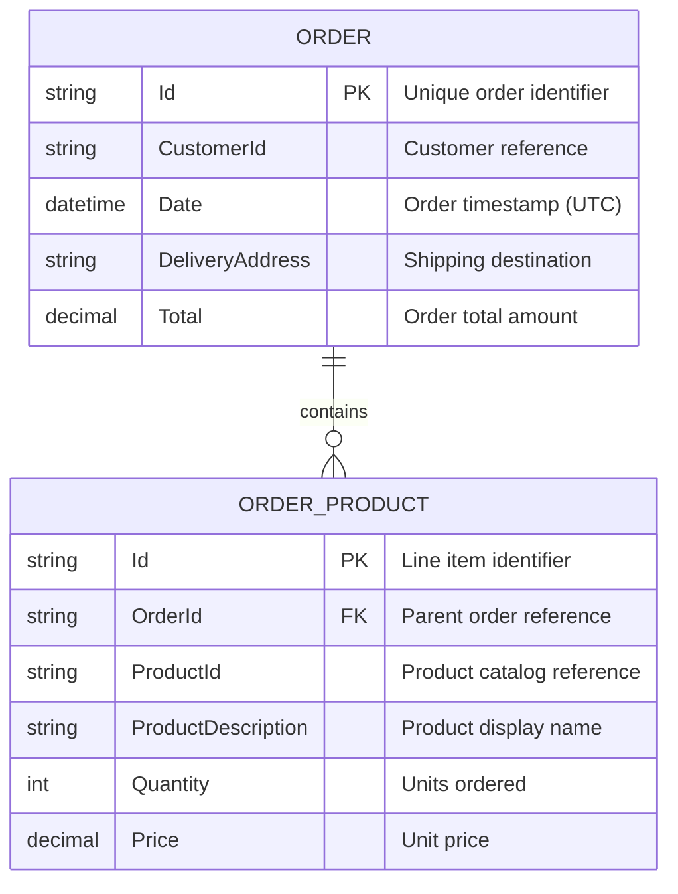
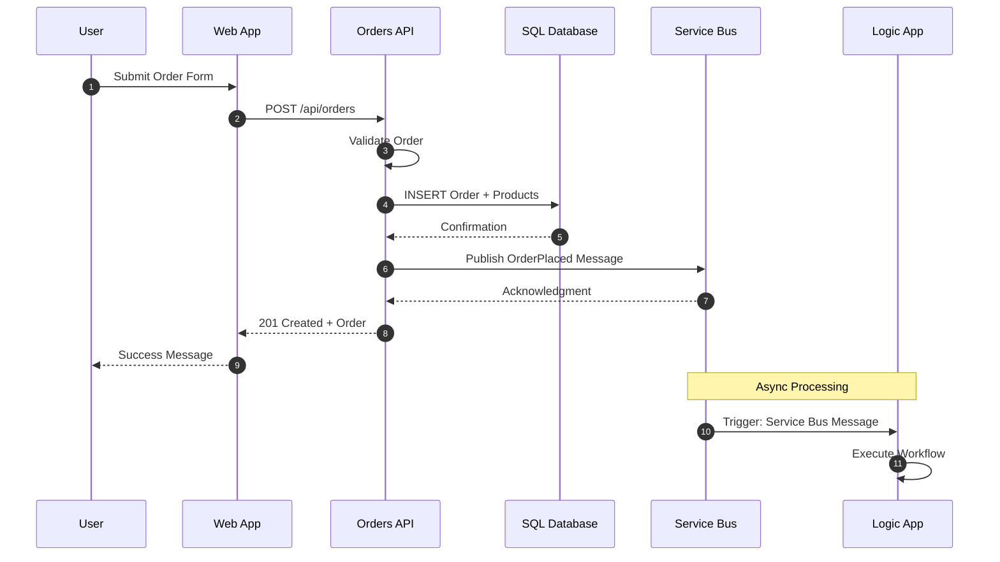

# Data Architecture

← [Business Architecture](01-business-architecture.md) | [Index](README.md) | [Application Architecture →](03-application-architecture.md)

## Data Architecture Overview

The solution implements a service-oriented data architecture where each service owns its data store. Data flows through the system via synchronous API calls (read/write operations) and asynchronous messaging (event propagation).

### Data Store Inventory

| Store | Technology | Purpose | Owner Service | Location |
|-------|------------|---------|---------------|----------|
| **OrderDb** | Azure SQL Database | Order and product persistence | eShop.Orders.API | Azure / Local SQL Container |
| **ordersplaced** | Service Bus Topic | Order event propagation | eShop.Orders.API (publisher) | Azure / Local Emulator |
| **orderprocessingsub** | Service Bus Subscription | Order event consumption | Logic Apps (subscriber) | Azure / Local Emulator |
| **Workflow State** | Azure Storage (File Share) | Logic App workflow state | OrdersManagement Logic App | Azure Storage Account |

---

## Entity Model



### Entity Descriptions

| Entity | Description | Validation Rules | Source |
|--------|-------------|------------------|--------|
| **Order** | Represents a customer purchase with delivery information | Id: required, 1-100 chars; CustomerId: required; DeliveryAddress: 5-500 chars; Total > 0 | [CommonTypes.cs](../../app.ServiceDefaults/CommonTypes.cs) |
| **OrderProduct** | Line item within an order | ProductId: required; ProductDescription: 1-500 chars; Quantity >= 1; Price > 0 | [CommonTypes.cs](../../app.ServiceDefaults/CommonTypes.cs) |

---

## Data Flow Architecture

### Write Path: Order Creation



### Read Path: Order Retrieval


---

## Messaging Patterns

### Service Bus Topology

| Resource | Type | Purpose | Configuration |
|----------|------|---------|---------------|
| **ordersplaced** | Topic | Fan-out order events to multiple subscribers | Standard tier |
| **orderprocessingsub** | Subscription | Logic App consumption | MaxDeliveryCount: 10, LockDuration: 5min, TTL: 14 days |

### Message Schema: OrderPlaced

```json
{
  "Id": "ORD-2025-001",
  "CustomerId": "CUST-100",
  "Date": "2025-12-30T10:30:00Z",
  "DeliveryAddress": "123 Main St, Seattle, WA 98101",
  "Total": 149.99,
  "Products": [
    {
      "Id": "ITEM-001",
      "OrderId": "ORD-2025-001",
      "ProductId": "PROD-1001",
      "ProductDescription": "Wireless Mouse",
      "Quantity": 2,
      "Price": 25.99
    }
  ]
}
```

### Message Properties

| Property | Value | Purpose |
|----------|-------|---------|
| `ContentType` | `application/json` | MIME type |
| `MessageId` | Order.Id | Deduplication key |
| `Subject` | `OrderPlaced` | Message type discriminator |
| `TraceId` | W3C trace ID | Distributed tracing correlation |
| `SpanId` | W3C span ID | Trace span linkage |
| `traceparent` | W3C traceparent | OpenTelemetry propagation |

---

## Data Integration Points

### Internal Service Communication

| Source | Target | Protocol | Data Format | Pattern |
|--------|--------|----------|-------------|---------|
| Web App | Orders API | HTTP/REST | JSON | Synchronous request/response |
| Orders API | SQL Database | TDS (EF Core) | Relational | CRUD operations |
| Orders API | Service Bus | AMQP | JSON | Async publish (fire-and-forget) |
| Service Bus | Logic App | Service Bus Connector | JSON | Event-driven trigger |

### Trace Context Propagation

The solution implements W3C Trace Context for cross-service correlation:

```csharp
// From OrdersMessageHandler.cs
message.ApplicationProperties["TraceId"] = activity.TraceId.ToString();
message.ApplicationProperties["SpanId"] = activity.SpanId.ToString();
message.ApplicationProperties["traceparent"] = activity.Id ?? string.Empty;
```

This ensures that Logic Apps workflows can be correlated with the originating API request in Application Insights.

---

## Data Governance

### Data Classification

| Data Element | Classification | Handling |
|--------------|----------------|----------|
| Order ID | Business Identifier | Logged, traced |
| Customer ID | PII Reference | Logged (ID only), not traced in tags |
| Delivery Address | PII | Not logged in full, masked in traces |
| Order Total | Financial | Logged, metrics recorded |
| Product Details | Business | Logged, traced |

### Retention Policies

| Data Store | Retention | Policy |
|------------|-----------|--------|
| SQL Database (Orders) | Indefinite | Business data, manual archival |
| Log Analytics Logs | 30 days | Default workspace retention |
| Application Insights Telemetry | 90 days | Standard Application Insights retention |
| Service Bus Messages | 14 days | TTL configured on subscription |

### Backup and Recovery

| Component | Backup Strategy | Recovery Point Objective (RPO) |
|-----------|-----------------|-------------------------------|
| Azure SQL Database | Automated geo-redundant backups | 5 minutes |
| Service Bus | No backup (transient data) | N/A - replay from source |
| Workflow State (Storage) | Azure Storage redundancy | Near-zero (LRS/GRS) |

---

## Database Schema Details

The solution uses EF Core Code-First migrations. Key schema characteristics:

- **OrderEntity**: Maps to `Orders` table with auto-generated primary key
- **OrderProductEntity**: Maps to `OrderProducts` table with foreign key to Orders
- **Indexes**: On CustomerId for query performance
- **Constraints**: CASCADE delete from Order to OrderProducts

For migration details, see: [MIGRATION_GUIDE.md](../../src/eShop.Orders.API/MIGRATION_GUIDE.md)

---

## Related Documents

- [Application Architecture](03-application-architecture.md) - Service implementation details
- [Technology Architecture](04-technology-architecture.md) - Azure SQL and Service Bus configuration
- [ADR-002: Service Bus Messaging](adr/ADR-002-service-bus-messaging.md) - Messaging pattern decision
