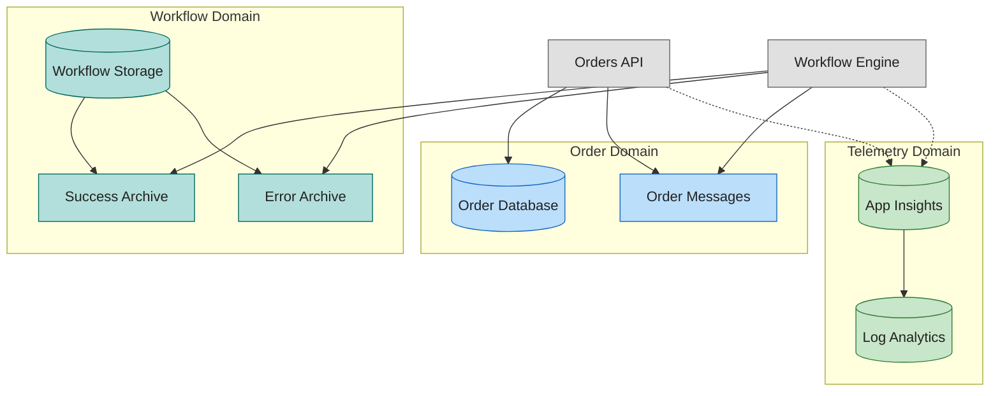
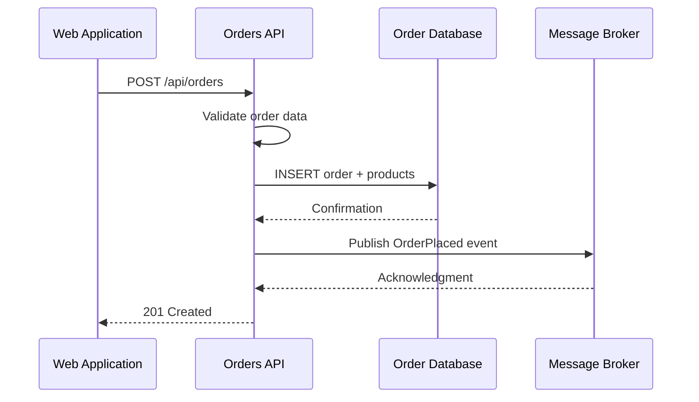
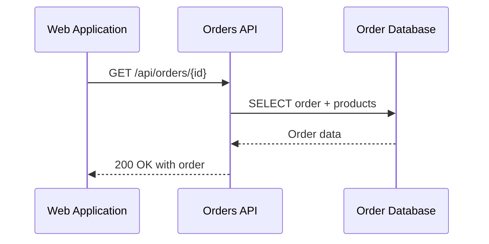
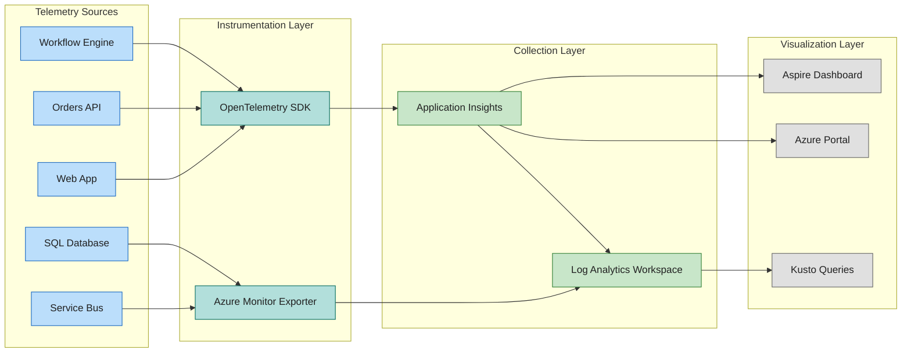
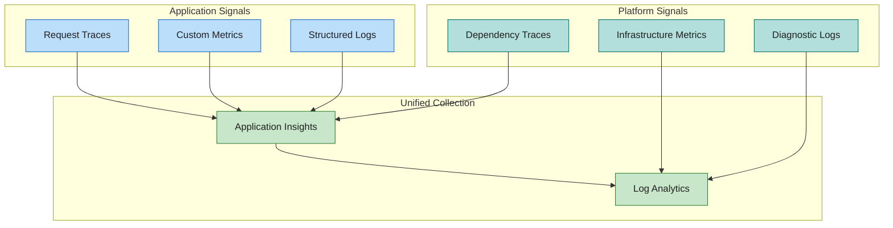

# Data Architecture

## 1. Data Architecture Overview

Data serves as the foundation for business capabilities in this solution, enabling order capture, processing, observability, and compliance. The architecture follows service-oriented data ownership principles where each service manages its own data store, communicating changes through events rather than shared databases.

### Data Stores Inventory

| Store                   | Type        | Purpose                                                 | Owning Service         |
| ----------------------- | ----------- | ------------------------------------------------------- | ---------------------- |
| Order Database          | Relational  | Order and product persistence, transactional operations | Orders API             |
| Workflow Storage        | Object      | Workflow state, processed order archival                | Workflow Engine        |
| Log Analytics Workspace | Time-series | Centralized log aggregation, query interface            | Observability Platform |
| Application Insights    | APM Store   | Traces, metrics, dependency maps                        | Observability Platform |
| Message Topics          | Event Store | Order events pending processing                         | Message Broker         |

### Data Ownership Model

- **System of Record:** Order Database is the authoritative source for order data
- **System of Reference:** Workflow Storage contains derived/processed order snapshots
- **Telemetry Stores:** Log Analytics and Application Insights contain operational data with defined retention

---

## 2. Data Architecture Principles

### Principle 1: Service Data Ownership

**Statement:** Each service owns and manages its data; no direct database sharing between services.

**Rationale:** Prevents tight coupling, enables independent scaling and deployment, supports polyglot persistence.

**Implications:** Services communicate state changes through events; APIs expose data contracts rather than schema.

### Principle 2: Event-Driven Data Propagation

**Statement:** State changes propagate through published events, not database replication or shared writes.

**Rationale:** Enables loose coupling, supports eventual consistency, provides natural audit trail.

**Implications:** Message broker becomes critical infrastructure; consumers must handle duplicate delivery.

### Principle 3: Observability by Design

**Statement:** All data flows emit telemetry signals; tracing context propagates across boundaries.

**Rationale:** Debugging distributed systems requires correlated visibility; compliance requires audit trails.

**Implications:** Every service instruments data operations; trace context flows through messages and HTTP calls.

### Principle 4: Security at Rest and Transit

**Statement:** Data encrypted at rest using platform-managed keys; transit protected via TLS 1.2+.

**Rationale:** Protects sensitive order data; meets compliance requirements for data protection.

**Implications:** Managed identity authentication; no credentials in application configuration.

---

## 3. Data Landscape Map

---

## 4. Data Domain Catalog

| Domain             | Description                                      | Owning Service         | Primary Stores              | Data Steward     |
| ------------------ | ------------------------------------------------ | ---------------------- | --------------------------- | ---------------- |
| **Order**          | Customer orders with products, addresses, totals | Orders API             | Order Database              | Application Team |
| **Workflow State** | Processing status, archived outcomes             | Workflow Engine        | Workflow Storage            | Platform Team    |
| **Telemetry**      | Traces, metrics, logs from all services          | Observability Platform | Log Analytics, App Insights | SRE Team         |
| **Events**         | Order lifecycle events awaiting processing       | Message Broker         | Service Bus Topics          | Platform Team    |

---

## 5. Data Store Details

| Store                | Technology          | Purpose                                         | Owner Service   | Location       |
| -------------------- | ------------------- | ----------------------------------------------- | --------------- | -------------- |
| Order Database       | Relational (SQL)    | Transactional order CRUD, product relationships | Orders API      | Primary Region |
| Workflow Storage     | Object (Blob)       | Workflow runtime state, processed order blobs   | Workflow Engine | Primary Region |
| Success Archive      | Object (Blob)       | Successfully processed order records            | Workflow Engine | Primary Region |
| Error Archive        | Object (Blob)       | Failed processing records for investigation     | Workflow Engine | Primary Region |
| Log Analytics        | Time-series (Kusto) | Log aggregation, query, alerting                | Platform        | Primary Region |
| Application Insights | APM                 | Distributed traces, metrics, dependencies       | Platform        | Primary Region |
| Order Topics         | Event (Service Bus) | Pending order events with subscriptions         | Platform        | Primary Region |

---

## 6. Data Flow Architecture

### Write Path: Order Submission

### Read Path: Order Retrieval

---

## 7. Monitoring Data Flow Architecture

---

## 8. Telemetry Data Mapping

### Observability Pillars

| Pillar      | Purpose                                                 | Retention | Query Interface             |
| ----------- | ------------------------------------------------------- | --------- | --------------------------- |
| **Traces**  | Request flow correlation across services                | 30 days   | Application Insights, Kusto |
| **Metrics** | Quantitative measurements (latency, throughput, errors) | 90 days   | Azure Monitor, Kusto        |
| **Logs**    | Structured event records with context                   | 30 days   | Log Analytics, Kusto        |

### Metrics Inventory by Source

| Source          | Metrics Emitted                                                                                                     |
| --------------- | ------------------------------------------------------------------------------------------------------------------- |
| Orders API      | `eShop.orders.placed`, `eShop.orders.processing.duration`, `eShop.orders.processing.errors`, `eShop.orders.deleted` |
| Web Application | HTTP client duration, request count, error rate                                                                     |
| Service Bus     | Message count, dead-letter count, server errors                                                                     |
| SQL Database    | Query duration, connection count, DTU usage                                                                         |

### Logs Inventory by Source

| Source          | Log Categories                                                                   |
| --------------- | -------------------------------------------------------------------------------- |
| Orders API      | Request/response, validation errors, database operations, Service Bus publishing |
| Web Application | Page views, API client calls, user sessions                                      |
| Workflow Engine | Workflow runs, action executions, connector operations                           |
| Infrastructure  | Container Apps scaling, Service Bus operations, SQL audit                        |

### Telemetry Signal Map

---

## 9. Cross-Architecture Relationships

### Business Architecture Alignment

Data domains directly support business capabilities:

- **Order Domain** enables Order Capture, Processing, and Fulfillment Tracking capabilities
- **Telemetry Domain** enables Operational Observability capability
- **Events Domain** enables Event Management capability

### Application Architecture Alignment

Services implement data access patterns:

- Orders API implements repository pattern over Order Database
- Workflow Engine implements event-driven processing over Message Topics
- All services emit telemetry through OpenTelemetry instrumentation

### Technology Architecture Alignment

Infrastructure provisions data stores:

- `shared/data` module provisions SQL Server, Storage Accounts
- `shared/monitoring` module provisions Log Analytics, Application Insights
- `workload/messaging` module provisions Service Bus namespace and topics

---

## Related Documents

- [Business Architecture](01-business-architecture.md) — Capabilities this data supports
- [Application Architecture](03-application-architecture.md) — Services accessing this data
- [Technology Architecture](04-technology-architecture.md) — Infrastructure hosting this data
