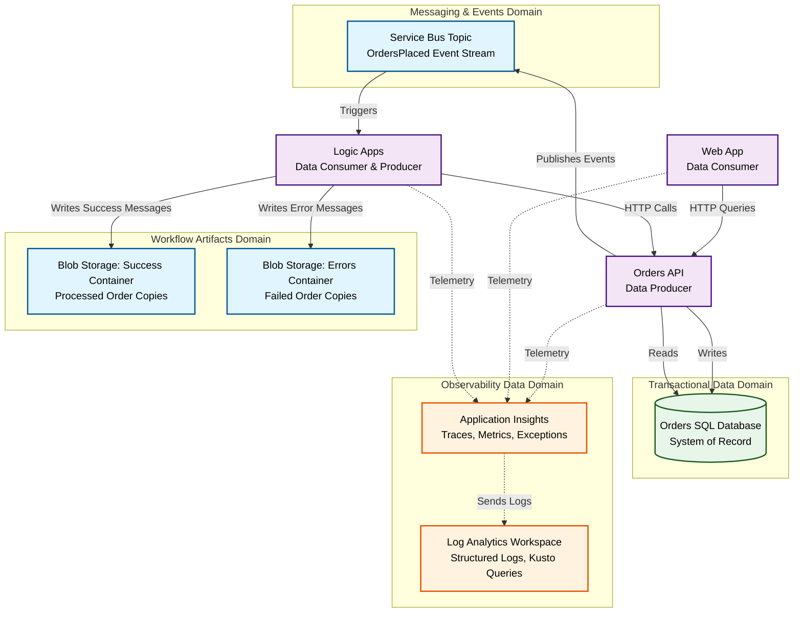
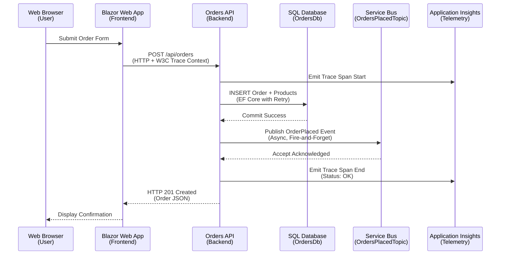
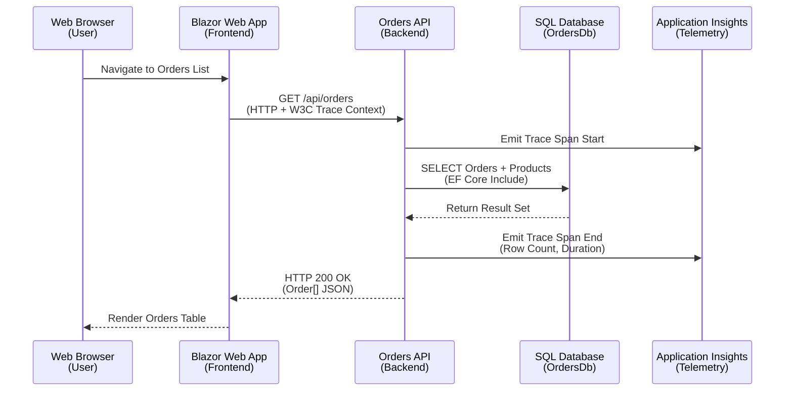
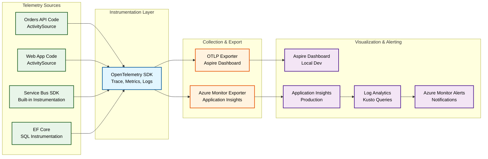
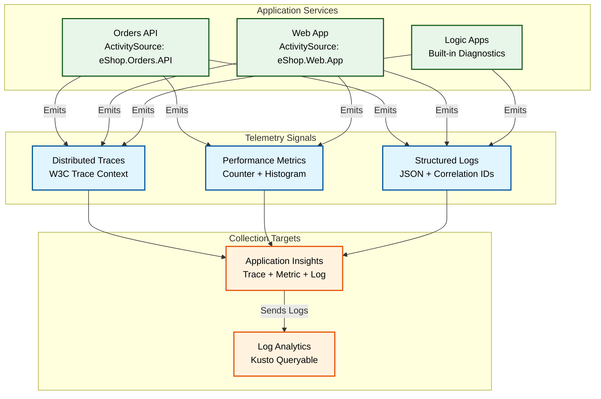

# Data Architecture - Azure Logic Apps Monitoring Solution

## 1. Data Architecture Overview

Data serves as the foundation enabling business capabilities and value streams in this distributed system. The architecture follows a service-oriented data ownership model where each service manages its own data store and exposes controlled access through well-defined APIs and event contracts. This approach ensures loose coupling while maintaining data consistency through event-driven eventual consistency patterns.

### Data Stores Inventory

| Store                 | Type                  | Purpose                                                    | Owner Service        | Persistence Tier                  |
| --------------------- | --------------------- | ---------------------------------------------------------- | -------------------- | --------------------------------- |
| **OrdersDb**          | Relational Database   | Transactional storage for order entities and products      | Orders API           | Azure SQL Database (serverless)   |
| **OrdersTopic**       | Message Queue         | Asynchronous event distribution for order lifecycle events | Service Bus          | Azure Service Bus (Standard tier) |
| **WorkflowArtifacts** | Object Storage        | Workflow execution artifacts and message copies for audit  | Logic Apps           | Azure Blob Storage                |
| **TelemetryStore**    | Time-Series Analytics | Distributed traces, metrics, and structured logs           | Application Insights | Azure Monitor (Hot/Cold tiers)    |
| **LogsRepository**    | Log Analytics         | Kusto-queryable centralized logs and metrics               | Log Analytics        | Azure Monitor workspace           |

### Data Ownership by Service

| Service                  | System of Record For                      | Data Access Pattern                                        | External Access Method              |
| ------------------------ | ----------------------------------------- | ---------------------------------------------------------- | ----------------------------------- |
| **Orders API**           | Order entities, Order products            | Direct SQL read/write via EF Core                          | REST API (HTTP/JSON)                |
| **Service Bus**          | Event messages, subscription state        | Publisher: Send operations; Subscriber: Receive operations | Topic publish, subscription consume |
| **Logic Apps**           | Workflow run history, workflow artifacts  | Blob append operations                                     | Azure Portal, REST API              |
| **Application Insights** | Application telemetry, distributed traces | Write-only via OpenTelemetry exporters                     | Azure Portal, Log Analytics queries |

### System of Record vs System of Reference

- **System of Record**: Orders API is the authoritative source for order data. All queries for current order state must use the Orders API.
- **System of Reference**: Workflow artifacts in Blob Storage provide historical audit trail but are not queryable for business logic decisions.
- **Eventual Consistency**: Service Bus acts as the event log enabling eventual consistency across bounded contexts.

## 2. Data Architecture Principles

### Principle 1: Service-Owned Data with API-Mediated Access

**Governing Statement:**  
Each service owns its data schema and storage, exposing controlled access through versioned APIs and event contracts.

**Rationale:**  
Direct database access across service boundaries creates tight coupling, making independent deployment impossible. API-mediated access enables service evolution, schema changes, and technology substitution without impacting consumers.

**Architectural Implications:**

- Orders API owns the OrdersDb schema; no other service queries SQL directly
- Web App accesses order data exclusively through Orders API HTTP endpoints
- Logic Apps receive order events via Service Bus, not database triggers
- Shared data models (Order, OrderProduct) are defined in ServiceDefaults library to prevent duplication

### Principle 2: Event-Driven Decoupling for Cross-Service Communication

**Governing Statement:**  
Services communicate asynchronously through domain events published to Service Bus topics, avoiding synchronous inter-service dependencies.

**Rationale:**  
Synchronous request-response patterns create cascading failures and increase latency. Event-driven architecture enables independent scalability, temporal decoupling, and resilience to downstream service failures.

**Architectural Implications:**

- Orders API publishes "OrderPlaced" events after successful database commit
- Service Bus retains messages for replay and ensures at-least-once delivery
- Logic Apps workflows are triggered by Service Bus subscriptions, not HTTP polling
- Event schema versioning is required for backward compatibility

### Principle 3: Observability Data as First-Class Citizen

**Governing Statement:**  
Telemetry data (traces, metrics, logs) is treated as critical business data with guaranteed collection, retention, and queryability.

**Rationale:**  
Troubleshooting distributed systems requires complete visibility into request flows. Missing telemetry creates blind spots that increase MTTR and prevent proactive issue detection.

**Architectural Implications:**

- OpenTelemetry instrumentation is mandatory for all application code
- W3C Trace Context headers are propagated across HTTP, Service Bus, and SQL boundaries
- Application Insights retention is configured for 90 days minimum
- Critical business metrics (orders placed, processing errors) are emitted alongside technical metrics

### Principle 4: Zero-Secrets Data Access via Managed Identity

**Governing Statement:**  
All data store authentication uses Azure Managed Identity with role-based access control, eliminating connection strings and API keys from code.

**Rationale:**  
Connection strings in configuration represent security risks through credential leakage, rotation overhead, and compliance audit complexity. Managed Identity provides seamless authentication with Azure RBAC enforcement.

**Architectural Implications:**

- SQL Database connections use Azure AD authentication with Managed Identity
- Service Bus clients authenticate via DefaultAzureCredential
- Blob Storage access uses Managed Identity with Storage Blob Data Contributor role
- Connection strings exist only for local development emulators

### Principle 5: Data Resilience Through Automated Backups and Retry Logic

**Governing Statement:**  
All persistent stores implement automated backup strategies, and all data access code includes retry logic for transient failures.

**Rationale:**  
Distributed systems experience transient network failures, database throttling, and service restarts. Resilient data access patterns prevent request failures and ensure eventual success.

**Architectural Implications:**

- SQL Database automated backups with 7-day point-in-time restore
- EF Core retry logic (max 5 attempts, exponential backoff) for SQL operations
- Service Bus messages have DeliveryCount and are moved to Dead Letter Queue after 10 retries
- Polly resilience policies on HTTP clients with circuit breaker and timeout

## 3. Data Landscape Map

## 4. Data Domain Catalog

### Domain: Order Management

**Description:**  
Encompasses all order-related transactional data including order headers, line items, customer information, and delivery addresses.

**Owning Service:** Orders API

**Primary Data Stores:**

- Azure SQL Database (OrdersDb)
- Service Bus Topic (OrdersPlaced events)

**Data Steward:** Backend Development Team

**Schema Entities:**

- **Order**: Order header with customer ID, date, delivery address, total amount
- **OrderProduct**: Line items linking orders to products with quantity and price

**Data Access Patterns:**

- Create: POST /api/orders (single), POST /api/orders/batch (bulk)
- Read: GET /api/orders/{id}, GET /api/orders (list all)
- Delete: DELETE /api/orders/{id}

### Domain: Event Streaming

**Description:**  
Event messages representing order lifecycle state changes, published to Service Bus for downstream consumers.

**Owning Service:** Service Bus (managed by Azure platform)

**Primary Data Stores:**

- Service Bus Topic: OrdersPlaced
- Service Bus Subscription: OrderProcessingSub

**Data Steward:** Platform Engineering Team

**Event Schemas:**

- **OrderPlacedEvent**: Contains full Order object as JSON payload

**Data Retention:**

- Service Bus message TTL: 14 days (default)
- Dead Letter Queue retention: 14 days

### Domain: Workflow Artifacts

**Description:**  
Immutable copies of order messages processed by Logic Apps workflows, stored for audit and troubleshooting.

**Owning Service:** Logic Apps Standard

**Primary Data Stores:**

- Blob Storage Container: ordersprocessedsuccessfully
- Blob Storage Container: ordersprocessedwitherrors

**Data Steward:** SRE Team

**Artifact Types:**

- Success messages: Base64-encoded JSON order payloads from successful processing
- Error messages: Base64-encoded JSON order payloads from failed processing

**Data Retention:**

- Storage account lifecycle policy: Move to Cool tier after 30 days, archive after 90 days

### Domain: Observability Telemetry

**Description:**  
Distributed traces, metrics, structured logs, and exceptions emitted by all application components.

**Owning Service:** Application Insights / Log Analytics

**Primary Data Stores:**

- Application Insights (hot path, last 90 days)
- Log Analytics Workspace (cold path, queryable via Kusto)

**Data Steward:** SRE Team

**Telemetry Types:**

- **Traces**: W3C Trace Context spans with operation names, tags, and timings
- **Metrics**: Counter (orders placed, errors), Histogram (processing duration)
- **Logs**: Structured JSON logs with correlation IDs
- **Exceptions**: Stack traces with contextual metadata

## 5. Data Store Details

| Store                  | Technology                            | Purpose                                                       | Owner Service        | Location                                              |
| ---------------------- | ------------------------------------- | ------------------------------------------------------------- | -------------------- | ----------------------------------------------------- |
| **OrdersDb**           | Relational Database (SQL Server 2022) | ACID-compliant transactional storage for order entities       | Orders API           | Azure SQL Database (logical boundary: resource group) |
| **OrdersPlacedTopic**  | Message Queue (AMQP 1.0)              | Durable event stream with pub/sub semantics                   | Service Bus          | Azure Service Bus namespace (logical boundary: topic) |
| **OrderProcessingSub** | Subscription                          | Filtered message consumer with dead-letter handling           | Logic Apps           | Service Bus topic subscription                        |
| **SuccessArtifacts**   | Object Storage (Blob)                 | Append-only audit log for successful workflow executions      | Logic Apps           | Blob Storage container (logical boundary: container)  |
| **ErrorArtifacts**     | Object Storage (Blob)                 | Append-only audit log for failed workflow executions          | Logic Apps           | Blob Storage container (logical boundary: container)  |
| **AppInsightsStore**   | Time-Series Analytics                 | Hot-tier telemetry storage optimized for low-latency queries  | Application Insights | Azure Monitor (logical boundary: workspace)           |
| **LogAnalyticsStore**  | Log Repository                        | Cold-tier Kusto-queryable log storage for long-term retention | Log Analytics        | Azure Monitor workspace (logical boundary: workspace) |

## 6. Data Flow Architecture

### Write Path: Order Placement Flow

**Flow Description:**

1. **User Interaction**: User submits order form in Blazor UI with products, delivery address, and customer ID
2. **HTTP Request**: Blazor app sends POST request with W3C Trace Context headers (traceparent, tracestate)
3. **Trace Instrumentation**: Orders API starts distributed trace span, capturing HTTP method, route, and headers
4. **Database Write**: Order and OrderProduct entities persisted via EF Core with connection retry logic (max 5 attempts)
5. **Transaction Commit**: SQL Database confirms ACID transaction commit with auto-generated order ID
6. **Event Publishing**: OrderPlaced event published to Service Bus topic with order payload as JSON
7. **Asynchronous Acknowledgment**: Service Bus accepts message and returns acknowledgment (does not block HTTP response)
8. **Telemetry Emission**: Trace span completed with success status, duration, and database query metrics
9. **HTTP Response**: API returns 201 Created with order details and Location header
10. **UI Update**: Blazor app displays confirmation message and redirects to order details page

**Data Consistency:**

- Database write is synchronous and transactional (ACID guarantees)
- Service Bus publish is asynchronous and best-effort (eventual consistency)
- If Service Bus publish fails, order remains in database but downstream systems are not notified (compensating transaction required)

### Read Path: Order Retrieval Flow

**Flow Description:**

1. **User Navigation**: User clicks "View All Orders" link in navigation menu
2. **HTTP GET Request**: Blazor app sends GET request with correlation headers
3. **Trace Span Start**: API creates child span under parent trace from incoming headers
4. **Database Query**: EF Core executes JOIN query to fetch orders with related products (eager loading)
5. **Result Set**: SQL Database returns orders with products in a single round-trip
6. **Telemetry Metadata**: Trace span records row count, query duration, and any SQL warnings
7. **HTTP Response**: API serializes Order objects to JSON and returns 200 OK
8. **UI Rendering**: Blazor component renders FluentUI DataGrid with order data

**Performance Optimizations:**

- EF Core `.Include()` prevents N+1 query problem
- Query result caching (not implemented in v1, planned for v2)
- Pagination support for large datasets (not implemented in v1, planned for v2)

## 7. Monitoring Data Flow Architecture

**Flow Description:**

The monitoring data flow follows a four-layer architecture ensuring complete observability:

1. **Sources Layer**: Application code and SDK instrumentation emit telemetry signals

   - Custom ActivitySource instances for business logic tracing
   - Service Bus SDK automatic span creation for send/receive operations
   - EF Core SQL command tracing with parameterized query details

2. **Instrumentation Layer**: OpenTelemetry SDK processes and batches telemetry

   - Trace context propagation using W3C standard
   - Metric aggregation with histogram bucketing
   - Structured logging with scope-based correlation

3. **Collection Layer**: Exporters transmit telemetry to backends

   - OTLP exporter sends to Aspire Dashboard for local development
   - Azure Monitor exporter sends to Application Insights for production
   - Sampling configuration: 100% in dev, 10% in production (configurable)

4. **Visualization Layer**: Observability platforms provide query and alert capabilities
   - Aspire Dashboard: Real-time trace waterfall, metrics charts, structured logs
   - Application Insights: Distributed tracing, live metrics, failure analysis
   - Log Analytics: Kusto queries for custom analytics and long-term retention
   - Azure Monitor Alerts: Threshold-based and anomaly detection with PagerDuty/Teams integration

## 8. Telemetry Data Mapping

### Three Pillars of Observability

| Pillar      | Purpose                                                         | Implementation                                             | Retention                       |
| ----------- | --------------------------------------------------------------- | ---------------------------------------------------------- | ------------------------------- |
| **Traces**  | Request flow visualization, latency analysis, error correlation | W3C Trace Context spans with parent-child relationships    | 90 days in Application Insights |
| **Metrics** | Quantitative measurements of system health and business KPIs    | Counters (orders placed), Histograms (processing duration) | 93 days in Application Insights |
| **Logs**    | Structured event records with contextual metadata               | ILogger with OpenTelemetry integration, JSON formatting    | 90 days in Log Analytics        |

### Metrics Inventory by Source

| Source           | Metric Name                              | Type      | Purpose                                     | Tags                                      |
| ---------------- | ---------------------------------------- | --------- | ------------------------------------------- | ----------------------------------------- |
| **Orders API**   | eShop.orders.placed                      | Counter   | Total orders successfully persisted         | None                                      |
| **Orders API**   | eShop.orders.processing.duration         | Histogram | Time to process order placement (ms)        | operation_name                            |
| **Orders API**   | eShop.orders.processing.errors           | Counter   | Total order processing failures             | error_type                                |
| **Orders API**   | eShop.orders.deleted                     | Counter   | Total orders deleted                        | None                                      |
| **ASP.NET Core** | http.server.request.duration             | Histogram | HTTP request processing time (ms)           | http.method, http.route, http.status_code |
| **Service Bus**  | Azure.Messaging.ServiceBus.send.duration | Histogram | Time to publish message to Service Bus (ms) | topic_name                                |
| **EF Core**      | db.client.connections.usage              | Histogram | SQL connection pool utilization             | connection_state                          |

### Logs Inventory by Source

| Source           | Log Category           | Structure           | Key Fields                                                    |
| ---------------- | ---------------------- | ------------------- | ------------------------------------------------------------- |
| **Orders API**   | Application Logs       | JSON (ILogger)      | Timestamp, Level, TraceId, SpanId, Message, OrderId           |
| **Web App**      | Application Logs       | JSON (ILogger)      | Timestamp, Level, TraceId, SpanId, Message, UserId, SessionId |
| **Service Bus**  | Diagnostic Logs        | Azure Resource Logs | OperationName, SubscriptionId, Status, MessageId              |
| **SQL Database** | Query Performance Logs | Azure Resource Logs | QueryText, Duration, RowCount, ExecutionCount                 |
| **Logic Apps**   | Workflow Run Logs      | Azure Resource Logs | WorkflowName, RunId, Status, TriggerName, ActionName          |

### Telemetry Signal Mapping

## 9. Cross-Architecture Relationships

### Alignment with Business Architecture

The data architecture directly supports business capabilities defined in the Business Architecture:

- **Order Capture Capability**: Enabled by OrdersDb providing ACID-compliant transactional storage
- **Event Publishing Capability**: Enabled by Service Bus topic providing durable message delivery
- **Trace Correlation Capability**: Enabled by Application Insights distributed tracing infrastructure

### Alignment with Application Architecture

Data access patterns align with application service boundaries:

- **Orders API** owns OrdersDb schema and enforces business rules at the data access layer
- **Web App** remains stateless, querying Orders API instead of direct database access
- **Logic Apps** consume events from Service Bus without requiring SQL database credentials

### Alignment with Technology Architecture

Data stores map to Azure platform services with specific SKUs and configurations:

- **OrdersDb**: Azure SQL Database Serverless (General Purpose, 2 vCores, auto-pause enabled)
- **Service Bus**: Standard tier with topics (Premium tier for production with geo-replication)
- **Blob Storage**: Standard tier with Hot access tier, lifecycle policies for Cool/Archive transition
- **Application Insights**: Workspace-based with adaptive sampling and 90-day retention

### Related Documents

- [Business Architecture](01-business-architecture.md) - Business capabilities and value streams
- [Application Architecture](03-application-architecture.md) - Service design and API contracts
- [Technology Architecture](04-technology-architecture.md) - Infrastructure components and deployment topology
- [Observability Architecture](05-observability-architecture.md) - Monitoring instrumentation and alerting strategies

---

**Document Version:** 1.0.0  
**Last Updated:** 2026-01-07  
**Reviewed By:** Data Architecture Team  
**Next Review Date:** 2026-04-07
