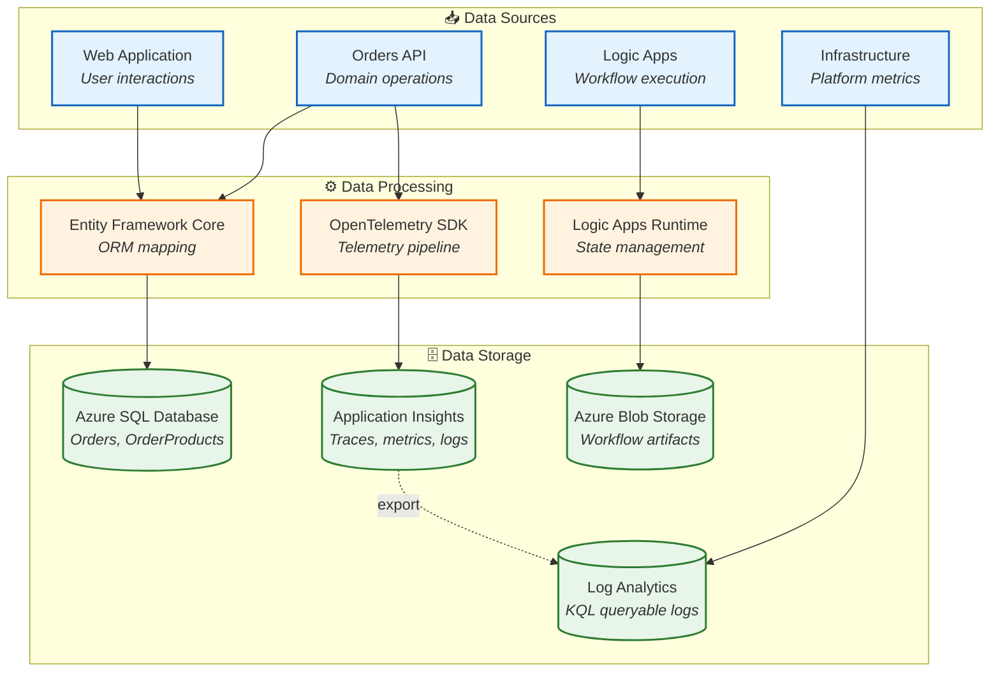
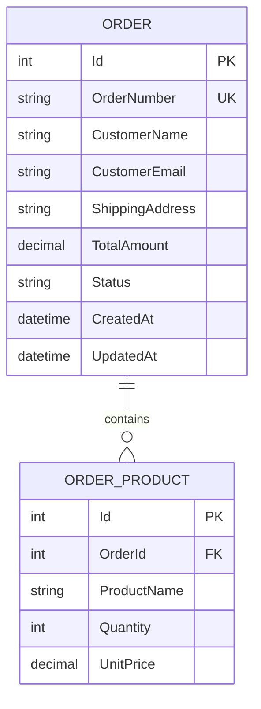
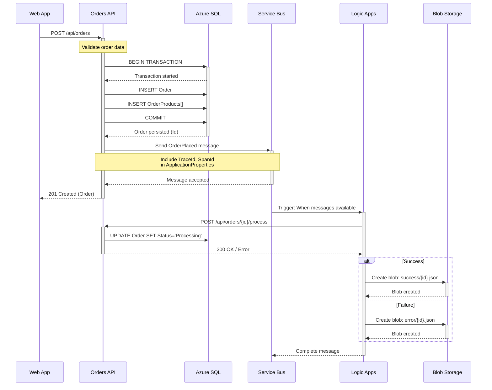
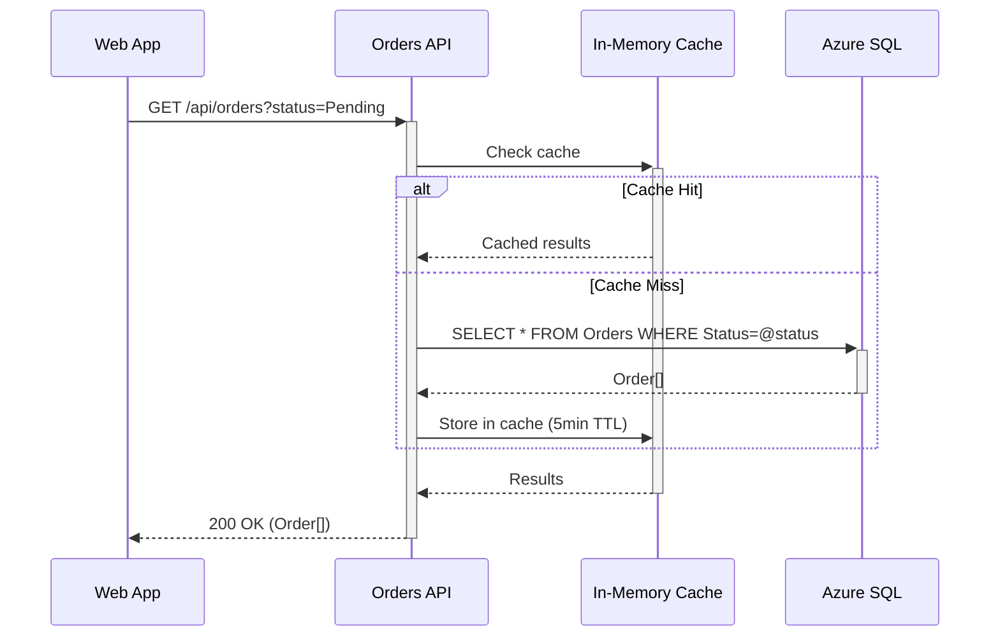
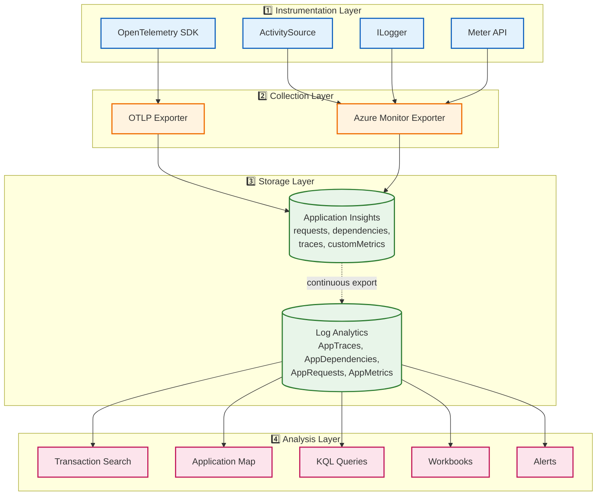

# 02 - Data Architecture

[← Business Architecture](01-business-architecture.md) | [Index](README.md) | [Application Architecture →](03-application-architecture.md)

---

## Data Landscape Overview

The Azure Logic Apps Monitoring Solution manages three distinct data categories: **transactional data** (orders), **telemetry data** (traces, metrics, logs), and **workflow state** (Logic Apps runtime). Each category has specific storage requirements, access patterns, and retention policies.



---

## Data Domain Catalog

| Domain                     | Description                                                       | Owner      | Storage              | Technology            |
| -------------------------- | ----------------------------------------------------------------- | ---------- | -------------------- | --------------------- |
| **Order Management**       | Customer orders with products, status, and lifecycle metadata     | Orders API | Azure SQL Database   | EF Core 9.x           |
| **Application Telemetry**  | Distributed traces, custom metrics, structured logs from services | Platform   | Application Insights | OpenTelemetry         |
| **Infrastructure Metrics** | Azure platform metrics, resource health, availability data        | Platform   | Azure Monitor        | Azure Monitor Agent   |
| **Workflow State**         | Logic Apps run history, trigger data, action inputs/outputs       | Logic Apps | Azure Storage        | Logic Apps Runtime    |
| **Archive Data**           | Processed order artifacts for audit and compliance                | Workflow   | Azure Blob Storage   | Logic Apps Connectors |

---

## Entity Model

### Orders Domain



### Entity Specifications

| Entity           | Table           | Primary Key           | Indexes                                                        | Constraints                                                                                          |
| ---------------- | --------------- | --------------------- | -------------------------------------------------------------- | ---------------------------------------------------------------------------------------------------- |
| **Order**        | `Orders`        | `Id` (auto-increment) | `IX_Orders_OrderNumber` (unique), `IX_Orders_Status_CreatedAt` | `CK_Orders_TotalAmount >= 0`, `CK_Orders_Status IN ('Pending', 'Processing', 'Completed', 'Failed')` |
| **OrderProduct** | `OrderProducts` | `Id` (auto-increment) | `IX_OrderProducts_OrderId`                                     | `FK_OrderProducts_Orders`, `CK_OrderProducts_Quantity > 0`                                           |

### Order Entity Attributes

| Attribute         | Type            | Constraints                            | Description                     |
| ----------------- | --------------- | -------------------------------------- | ------------------------------- |
| `Id`              | `int`           | NOT NULL, Identity                     | Auto-generated primary key      |
| `OrderNumber`     | `string(50)`    | NOT NULL, Unique                       | Human-readable order identifier |
| `CustomerName`    | `string(200)`   | NOT NULL, MinLength(2), MaxLength(200) | Customer full name              |
| `CustomerEmail`   | `string(254)`   | NOT NULL, EmailAddress                 | Customer contact email          |
| `ShippingAddress` | `string(500)`   | NOT NULL, MaxLength(500)               | Delivery address                |
| `TotalAmount`     | `decimal(18,2)` | NOT NULL, Range(0, max)                | Calculated order total          |
| `Status`          | `string(20)`    | NOT NULL, Default('Pending')           | Current order lifecycle status  |
| `CreatedAt`       | `datetime`      | NOT NULL, Default(UTC_NOW)             | Order creation timestamp        |
| `UpdatedAt`       | `datetime`      | Nullable                               | Last modification timestamp     |

### OrderProduct Entity Attributes

| Attribute     | Type            | Constraints                            | Description                |
| ------------- | --------------- | -------------------------------------- | -------------------------- |
| `Id`          | `int`           | NOT NULL, Identity                     | Auto-generated primary key |
| `OrderId`     | `int`           | NOT NULL, FK → Orders.Id               | Parent order reference     |
| `ProductName` | `string(200)`   | NOT NULL, MinLength(1), MaxLength(200) | Product display name       |
| `Quantity`    | `int`           | NOT NULL, Range(1, 1000)               | Order quantity             |
| `UnitPrice`   | `decimal(18,2)` | NOT NULL, Range(0, max)                | Per-unit price             |

---

## Data Flow Architecture

### Write Path (Command Flow)



### Read Path (Query Flow)



---

## Telemetry Data Model

### Distributed Trace Schema

| Field           | Source            | Description                                             |
| --------------- | ----------------- | ------------------------------------------------------- |
| `TraceId`       | W3C Trace Context | 32-character hex string, correlates entire request flow |
| `SpanId`        | W3C Trace Context | 16-character hex string, identifies single operation    |
| `ParentSpanId`  | W3C Trace Context | Parent operation for hierarchy                          |
| `OperationName` | ActivitySource    | Semantic name (e.g., `OrdersController.CreateOrder`)    |
| `Duration`      | OpenTelemetry     | Operation execution time (milliseconds)                 |
| `Status`        | OpenTelemetry     | `OK`, `Error`, or `Unset`                               |
| `Attributes`    | Custom tags       | Business context (OrderId, CustomerEmail, etc.)         |

### Custom Metrics Schema

| Metric                             | Type      | Unit         | Description              |
| ---------------------------------- | --------- | ------------ | ------------------------ |
| `eShop.orders.placed`              | Counter   | count        | Total orders created     |
| `eShop.orders.processing.duration` | Histogram | milliseconds | Order processing time    |
| `eShop.orders.processing.errors`   | Counter   | count        | Processing failures      |
| `eShop.orders.total_amount`        | Histogram | USD          | Order value distribution |

### Trace Context Propagation

```mermaid
flowchart LR
    subgraph HTTP["HTTP Layer"]
        H1["traceparent header"]
        H2["tracestate header"]
    end

    subgraph ServiceBus["Service Bus Layer"]
        SB1["Diagnostic-Id property"]
        SB2["traceparent property"]
        SB3["TraceId property"]
        SB4["SpanId property"]
    end

    subgraph LogicApps["Logic Apps Layer"]
        LA1["x-ms-workflow-run-id"]
        LA2["traceparent (propagated)"]
    end

    HTTP -->|"propagated via"| ServiceBus
    ServiceBus -->|"extracted by"| LogicApps

    classDef http fill:#e3f2fd,stroke:#1565c0,stroke-width:2px
    classDef sb fill:#e8f5e9,stroke:#2e7d32,stroke-width:2px
    classDef la fill:#fff3e0,stroke:#ef6c00,stroke-width:2px

    class H1,H2 http
    class SB1,SB2,SB3,SB4 sb
    class LA1,LA2 la
```



---

## Monitoring Data Architecture

### Four-Layer Telemetry Flow



---

## Data Governance

### Data Classification

| Data Type      | Classification        | Encryption                          | Retention | Access Control              |
| -------------- | --------------------- | ----------------------------------- | --------- | --------------------------- |
| Order Data     | Business Confidential | TDE (at-rest), TLS 1.2 (in-transit) | 7 years   | RBAC: Orders API only       |
| Customer PII   | Personal Data         | TDE, TLS, Column-level              | 7 years   | RBAC: Authorized principals |
| Telemetry      | Operational           | TLS 1.2 (in-transit)                | 90 days   | RBAC: Monitoring role       |
| Workflow State | System                | Storage encryption                  | 30 days   | Managed Identity only       |

### Data Residency

| Resource             | Region Strategy              | Failover                 | Compliance       |
| -------------------- | ---------------------------- | ------------------------ | ---------------- |
| Azure SQL            | Single region (configurable) | Geo-replication optional | SOC 2, ISO 27001 |
| Application Insights | Same as workload             | Multi-region workspace   | GDPR, HIPAA      |
| Azure Storage        | Same as Logic App            | RA-GRS optional          | SOC 2, ISO 27001 |
| Service Bus          | Same as workload             | Geo-DR optional          | SOC 2, HIPAA     |

---

## Data Access Patterns

### Repository Pattern Implementation

```
┌─────────────────────────────────────────────────────────────┐
│                    Orders API Layer                         │
├─────────────────────────────────────────────────────────────┤
│  OrdersController                                           │
│  ├── GetOrders() → IOrderRepository.GetAllAsync()          │
│  ├── GetOrder(id) → IOrderRepository.GetByIdAsync(id)      │
│  ├── CreateOrder(dto) → IOrderRepository.AddAsync(order)   │
│  └── ProcessOrder(id) → IOrderRepository.UpdateAsync(order)│
├─────────────────────────────────────────────────────────────┤
│  IOrderRepository (Interface)                               │
│  ├── Task<IEnumerable<Order>> GetAllAsync()                │
│  ├── Task<Order?> GetByIdAsync(int id)                     │
│  ├── Task<Order> AddAsync(Order order)                     │
│  └── Task UpdateAsync(Order order)                         │
├─────────────────────────────────────────────────────────────┤
│  OrderRepository : IOrderRepository                         │
│  └── Uses OrderDbContext (EF Core)                         │
│      ├── DbSet<Order> Orders                               │
│      └── DbSet<OrderProduct> OrderProducts                 │
└─────────────────────────────────────────────────────────────┘
```

### Query Optimization

| Query Pattern       | Implementation                                    | Optimization              |
| ------------------- | ------------------------------------------------- | ------------------------- |
| Get all orders      | `DbContext.Orders.Include(o => o.Products)`       | Eager loading, pagination |
| Get by ID           | `DbContext.Orders.FindAsync(id)`                  | Primary key lookup        |
| Filter by status    | `DbContext.Orders.Where(o => o.Status == status)` | Index on Status column    |
| Order with products | `Include(o => o.Products)`                        | Single query with JOIN    |

---

## Cross-Architecture References

| Related Architecture         | Connection                                      | Reference                                                                    |
| ---------------------------- | ----------------------------------------------- | ---------------------------------------------------------------------------- |
| **Business Architecture**    | Data domains aligned with business capabilities | [Business Capabilities](01-business-architecture.md#capability-descriptions) |
| **Application Architecture** | Data access through service layer               | [Service Catalog](03-application-architecture.md#service-catalog)            |
| **Technology Architecture**  | Storage technology selection                    | [Technology Standards](04-technology-architecture.md#technology-standards)   |
| **Security Architecture**    | Data protection and access control              | [Data Protection](06-security-architecture.md#data-protection)               |

---

[← Business Architecture](01-business-architecture.md) | [Index](README.md) | [Application Architecture →](03-application-architecture.md)
