# Data Architecture

← [Business Architecture](01-business-architecture.md) | [Index](README.md) | [Application Architecture →](03-application-architecture.md)

---

## Data Architecture Overview

The solution implements a **service-oriented data architecture** where each service owns its data store exclusively. This ensures loose coupling, independent deployability, and clear data ownership boundaries.

### Data Stores Inventory

| Store | Technology | Purpose | Owner Service |
|-------|------------|---------|---------------|
| **OrderDb** | Azure SQL Database | Order and product persistence | eShop.Orders.API |
| **ordersplaced** | Service Bus Topic | Order event distribution | eShop.Orders.API (publisher) |
| **orderprocessingsub** | Service Bus Subscription | Order event consumption | Logic Apps (subscriber) |
| **Workflow State** | Azure Storage | Logic App execution state | OrdersManagement Logic App |
| **Application Insights** | Log Analytics | Telemetry storage | All Services |

---

## Data Architecture Principles

| Principle | Statement | Rationale | Implications |
|-----------|-----------|-----------|--------------|
| **Data Ownership** | Each service owns its data store exclusively | Loose coupling, independent deployability | No shared databases; API-mediated access only |
| **Event Sourcing for Integration** | State changes propagated via immutable events | Audit trail, decoupling, replay capability | Service Bus for all cross-service communication |
| **Data at Rest Encryption** | All persistent data encrypted using platform encryption | Compliance, security posture | Azure SQL TDE enabled; Storage Service Encryption |
| **Schema Evolution** | All schemas support backward-compatible changes | Zero-downtime deployments | Additive changes only; versioned APIs for breaking changes |
| **Correlation by Default** | All data includes trace context for correlation | Debugging, observability | TraceId/SpanId in all messages and logs |

---

## Data Landscape Map

```mermaid
flowchart LR
    subgraph BusinessDomains["📊 Business Data Domains"]
        Orders["📦 Orders Domain"]
        Events["📨 Order Events"]
    end

    subgraph DataStores["🗄️ Data Stores"]
        OrderDb[("OrderDb<br/>Azure SQL")]
        EventTopic["ordersplaced<br/>Service Bus Topic"]
        WorkflowState["Workflow State<br/>Azure Storage"]
    end

    subgraph Consumers["👥 Data Consumers"]
        API["Orders API"]
        LogicApp["Logic Apps"]
        Analytics["App Insights"]
    end

    Orders --> OrderDb
    Orders --> EventTopic
    Events --> EventTopic
    OrderDb --> API
    EventTopic --> LogicApp
    API -.->|"telemetry"| Analytics
    LogicApp -.->|"telemetry"| Analytics
    LogicApp --> WorkflowState

    classDef domain fill:#e3f2fd,stroke:#1565c0,stroke-width:2px
    classDef store fill:#fff3e0,stroke:#ef6c00,stroke-width:2px
    classDef consumer fill:#e8f5e9,stroke:#2e7d32,stroke-width:2px

    class Orders,Events domain
    class OrderDb,EventTopic,WorkflowState store
    class API,LogicApp,Analytics consumer
```



---

## Data Domain Catalog

| Data Domain | Description | Bounded Context | Primary Store | Owner Service | Steward |
|-------------|-------------|-----------------|---------------|---------------|---------|
| **Order Management** | Customer orders, line items, totals | eShop.Orders | Azure SQL | eShop.Orders.API | Orders Team |
| **Order Events** | Immutable order lifecycle events | Messaging | Service Bus | Platform | Platform Team |
| **Operational Telemetry** | Traces, metrics, logs | Observability | Application Insights | All Services | SRE Team |
| **Workflow State** | Logic App execution state | Automation | Azure Storage | Logic Apps | Platform Team |

---

## Data Store Details

| Store | Technology | Purpose | Owner Service | Location | Tier/SKU |
|-------|------------|---------|---------------|----------|----------|
| **OrderDb** | Azure SQL Database | Order and product persistence | eShop.Orders.API | Azure / Local SQL Container | General Purpose |
| **ordersplaced** | Service Bus Topic | Order event publication | eShop.Orders.API | Azure / Local Emulator | Standard |
| **orderprocessingsub** | Service Bus Subscription | Order event subscription | Logic Apps | Azure / Local Emulator | Standard |
| **Workflow Storage** | Azure Storage Account | Logic App state and artifacts | OrdersManagement | Azure Storage Account | Standard LRS |
| **Application Insights** | Application Insights | APM and telemetry | All Services | Azure / Aspire Dashboard | Workspace-based |

---

## Data Flow Architecture

### Write Path (Order Creation)

```mermaid
sequenceDiagram
    autonumber
    participant User as 👤 User
    participant Web as 🌐 Web App
    participant API as ⚙️ Orders API
    participant DB as 🗄️ SQL Database
    participant SB as 📨 Service Bus
    participant LA as 🔄 Logic App

    User->>Web: Submit Order Form
    Web->>API: POST /api/orders
    API->>API: Validate Order
    API->>DB: INSERT Order + Products
    DB-->>API: Confirmation
    API->>SB: Publish OrderPlaced Message
    Note over API,SB: Includes TraceId, SpanId, traceparent
    SB-->>API: Acknowledgment
    API-->>Web: 201 Created + Order
    Web-->>User: Success Message
    
    Note over SB,LA: Async Processing
    SB->>LA: Trigger: Service Bus Message
    LA->>LA: Execute Workflow
```



### Read Path (Order Retrieval)

```mermaid
sequenceDiagram
    autonumber
    participant User as 👤 User
    participant Web as 🌐 Web App
    participant API as ⚙️ Orders API
    participant DB as 🗄️ SQL Database

    User->>Web: View Orders Page
    Web->>API: GET /api/orders
    API->>DB: SELECT Orders WITH Products
    Note over API,DB: AsNoTracking() for read performance
    DB-->>API: Order Data
    API-->>Web: JSON Order Collection
    Web-->>User: Render Orders Grid
```



---

## Data Flow Matrix

| Source | Target | Data Type | Protocol | Pattern | Frequency |
|--------|--------|-----------|----------|---------|-----------|
| Web App | Orders API | Order JSON | HTTPS/REST | Sync Request/Response | On-demand |
| Orders API | SQL Database | Order Entity | TDS/EF Core | CRUD Operations | Per request |
| Orders API | Service Bus | OrderPlaced Event | AMQP | Async Pub/Sub | Per order |
| Service Bus | Logic Apps | OrderPlaced Event | Connector | Event-driven | Per event |
| All Services | App Insights | Telemetry | HTTPS/OTLP | Continuous Push | Batched |

---

## Monitoring Data Flow Architecture

```mermaid
flowchart LR
    subgraph Sources["📡 Layer 1: Telemetry Sources"]
        direction TB
        WebApp["🌐 Web App"]
        API["⚙️ Orders API"]
        LogicApp["🔄 Logic Apps"]
        SQL["🗄️ SQL Database"]
        SB["📨 Service Bus"]
    end

    subgraph Instrumentation["🔧 Layer 2: Instrumentation"]
        direction TB
        OTEL["OpenTelemetry<br/>SDK (.NET)"]
        AzureDiag["Azure<br/>Diagnostics"]
    end

    subgraph Collection["📥 Layer 3: Collection"]
        direction TB
        AppInsights["Application<br/>Insights"]
        LogAnalytics["Log Analytics<br/>Workspace"]
    end

    subgraph Visualization["📈 Layer 4: Visualization"]
        direction TB
        AppMap["Application<br/>Map"]
        TxSearch["Transaction<br/>Search"]
        Dashboards["Azure<br/>Dashboards"]
        Alerts["Alert<br/>Rules"]
    end

    WebApp & API -->|"OTLP/HTTP"| OTEL
    LogicApp & SQL & SB -->|"Built-in"| AzureDiag
    OTEL -->|"Export"| AppInsights
    AzureDiag -->|"Diagnostic Settings"| LogAnalytics
    AppInsights -->|"Data flows"| LogAnalytics
    AppInsights --> AppMap & TxSearch
    LogAnalytics --> Dashboards & Alerts

    classDef source fill:#fff3e0,stroke:#ef6c00,stroke-width:2px
    classDef instrument fill:#e3f2fd,stroke:#1565c0,stroke-width:2px
    classDef collect fill:#e8f5e9,stroke:#2e7d32,stroke-width:2px
    classDef visual fill:#f3e5f5,stroke:#7b1fa2,stroke-width:2px

    class WebApp,API,LogicApp,SQL,SB source
    class OTEL,AzureDiag instrument
    class AppInsights,LogAnalytics collect
    class AppMap,TxSearch,Dashboards,Alerts visual
```



### Monitoring Layers

| Layer | Purpose | Components |
|-------|---------|------------|
| **1. Sources** | Origin of telemetry | Web App, API, Logic Apps, SQL, Service Bus |
| **2. Instrumentation** | Capture mechanisms | OpenTelemetry SDK, Azure Diagnostics |
| **3. Collection** | Aggregation & storage | Application Insights, Log Analytics |
| **4. Visualization** | Consumption & action | Application Map, Dashboards, Alerts |

---

## Telemetry Data Mapping

### Three Pillars of Observability

| Pillar | Description | Data Type | Use Case | Storage |
|--------|-------------|-----------|----------|---------|
| **Traces** | Distributed request flow across services | Spans with TraceId, SpanId, ParentSpanId | End-to-end transaction analysis | Application Insights |
| **Metrics** | Numeric measurements aggregated over time | Counters, Gauges, Histograms | Dashboards, alerts, capacity planning | Azure Monitor Metrics |
| **Logs** | Discrete events with contextual information | Structured JSON with properties | Debugging, auditing, investigation | Log Analytics |

### Telemetry Mapping Diagram

```mermaid
flowchart TB
    subgraph Sources["📡 Telemetry Sources"]
        API["⚙️ Orders API"]
        Web["🌐 Web App"]
        LA["🔄 Logic Apps"]
    end

    subgraph Pillars["📊 Three Pillars"]
        subgraph Traces["📍 Traces"]
            T1["HTTP Request spans"]
            T2["Database spans"]
            T3["Service Bus spans"]
        end
        
        subgraph Metrics["📈 Metrics"]
            M1["Request metrics"]
            M2["Custom business metrics"]
            M3["Platform metrics"]
        end
        
        subgraph Logs["📝 Logs"]
            L1["Application logs"]
            L2["Request logs"]
            L3["Diagnostic logs"]
        end
    end

    API --> T1 & T2 & T3 & M1 & M2 & L1 & L2
    Web --> T1 & M1 & L1 & L2
    LA --> M3 & L3

    classDef trace fill:#e3f2fd,stroke:#1565c0
    classDef metric fill:#e8f5e9,stroke:#2e7d32
    classDef log fill:#fff3e0,stroke:#ef6c00

    class T1,T2,T3 trace
    class M1,M2,M3 metric
    class L1,L2,L3 log
```



---

## Metrics Inventory

### Orders API Metrics

| Metric Name | Type | Unit | Description | Source |
|-------------|------|------|-------------|--------|
| `http.server.request.duration` | Histogram | seconds | Request latency | ASP.NET Core auto-instrumentation |
| `eShop.orders.placed` | Counter | count | Orders successfully placed | [OrderService.cs](../../src/eShop.Orders.API/Services/OrderService.cs) |
| `eShop.orders.processing.duration` | Histogram | ms | Order processing time | [OrderService.cs](../../src/eShop.Orders.API/Services/OrderService.cs) |
| `eShop.orders.processing.errors` | Counter | count | Order processing failures | [OrderService.cs](../../src/eShop.Orders.API/Services/OrderService.cs) |
| `eShop.orders.deleted` | Counter | count | Orders deleted | [OrderService.cs](../../src/eShop.Orders.API/Services/OrderService.cs) |

### Platform Metrics

| Metric | Source | Description |
|--------|--------|-------------|
| `ActiveMessages` | Service Bus | Messages awaiting delivery |
| `DeadLetteredMessages` | Service Bus | Failed message count |
| `cpu_percent` | SQL Database | CPU utilization |
| `dtu_consumption_percent` | SQL Database | DTU usage percentage |
| `RunsSucceeded/RunsFailed` | Logic Apps | Workflow execution counts |

---

## Logs Inventory

### Application Logs

| Log Event | Level | Source | Properties |
|-----------|-------|--------|------------|
| `OrderCreated` | Information | OrderService | OrderId, CustomerId, Total |
| `OrderValidationFailed` | Warning | OrderService | OrderId, Errors |
| `OrderPlaced published` | Information | OrdersMessageHandler | OrderId, TopicName |
| `ServiceBusMessagePublished` | Information | OrdersMessageHandler | MessageId, TraceId |
| `DatabaseQueryExecuted` | Debug | EF Core | Query, Duration |

### Structured Log Format

```json
{
  "Timestamp": "2025-12-30T10:30:00.000Z",
  "Level": "Information",
  "MessageTemplate": "Order {OrderId} placed successfully in {Duration}ms",
  "Properties": {
    "OrderId": "ORD-2025-001",
    "Duration": 245,
    "TraceId": "abc123...",
    "SpanId": "def456...",
    "SourceContext": "eShop.Orders.API.Services.OrderService"
  }
}
```

---

## Trace Context Propagation

The solution implements W3C Trace Context for cross-service correlation:

| Component | Propagation Method | Properties |
|-----------|-------------------|------------|
| HTTP Requests | Headers | `traceparent`, `tracestate` |
| Service Bus Messages | Application Properties | `TraceId`, `SpanId`, `traceparent` |
| Logic Apps | Built-in correlation | Azure-managed (Run ID, Action ID) |

### Implementation

From [OrdersMessageHandler.cs](../../src/eShop.Orders.API/Handlers/OrdersMessageHandler.cs):

```csharp
// Add trace context to message for distributed tracing
if (activity != null)
{
    message.ApplicationProperties["TraceId"] = activity.TraceId.ToString();
    message.ApplicationProperties["SpanId"] = activity.SpanId.ToString();
    message.ApplicationProperties["traceparent"] = activity.Id ?? string.Empty;
}
```

---

## Data Dependencies

```mermaid
flowchart TD
    subgraph Upstream["⬆️ Upstream (Data Producers)"]
        WebApp["🌐 Web App<br/>(Order Input)"]
    end

    subgraph Core["🎯 Core Data Assets"]
        OrderDb[("OrderDb<br/>Azure SQL")]
        EventBus["📨 Service Bus<br/>ordersplaced"]
    end

    subgraph Downstream["⬇️ Downstream (Data Consumers)"]
        LogicApp["🔄 Logic Apps<br/>(Workflow)"]
        AppInsights["📊 App Insights<br/>(Analytics)"]
    end

    WebApp -->|"Creates orders"| OrderDb
    OrderDb -.->|"Publishes events"| EventBus
    EventBus -->|"Triggers"| LogicApp
    OrderDb -.->|"Emits telemetry"| AppInsights
    LogicApp -.->|"Emits telemetry"| AppInsights

    classDef upstream fill:#fff3e0,stroke:#ef6c00
    classDef core fill:#e3f2fd,stroke:#1565c0
    classDef downstream fill:#e8f5e9,stroke:#2e7d32

    class WebApp upstream
    class OrderDb,EventBus core
    class LogicApp,AppInsights downstream
```



---

## Cross-Architecture Relationships

| Related Architecture | Connection | Reference |
|---------------------|------------|-----------|
| **Business Architecture** | Orders data supports Order Management capability | [01-business-architecture.md](01-business-architecture.md#business-capabilities) |
| **Application Architecture** | Orders API service manages Order data entities | [03-application-architecture.md](03-application-architecture.md#eshopordersapi) |
| **Technology Architecture** | Azure SQL hosts OrderDb; Service Bus transports events | [04-technology-architecture.md](04-technology-architecture.md) |
| **Observability Architecture** | Telemetry data flows to App Insights for monitoring | [05-observability-architecture.md](05-observability-architecture.md) |

---

← [Business Architecture](01-business-architecture.md) | [Index](README.md) | [Application Architecture →](03-application-architecture.md)
