# Data Architecture

[← Business Architecture](01-business-architecture.md) | **Data Architecture** | [Application Architecture →](03-application-architecture.md)

---

## 1. Data Architecture Overview

The data architecture follows **service-oriented data ownership**, where each service owns and manages its data store independently. Cross-service data access occurs exclusively through published APIs or events, ensuring loose coupling and independent deployability.

### Data Stores Inventory

| Store              | Technology                 | Owner Service                | Purpose                           |
| ------------------ | -------------------------- | ---------------------------- | --------------------------------- |
| OrderDb            | Azure SQL Database         | eShop.Orders.API             | Order and product persistence     |
| ordersplaced       | Service Bus Topic          | eShop.Orders.API (publisher) | Order event propagation           |
| orderprocessingsub | Service Bus Subscription   | Logic Apps (subscriber)      | Event consumption                 |
| Workflow State     | Azure Storage (File Share) | OrdersManagement Logic App   | Workflow execution state          |
| Telemetry Store    | Application Insights       | All Services                 | Distributed traces, metrics, logs |
| Log Repository     | Log Analytics Workspace    | Platform                     | Centralized log aggregation       |

---

## 2. Data Architecture Principles

| Principle                     | Statement                                     | Rationale                                        | Implications                                    |
| ----------------------------- | --------------------------------------------- | ------------------------------------------------ | ----------------------------------------------- |
| **Data Ownership**            | Each service owns its data store exclusively  | Loose coupling, independent deployability        | No shared databases; API-mediated access only   |
| **Event Sourcing**            | State changes propagated via immutable events | Audit trail, temporal queries, replay capability | Service Bus for all cross-service communication |
| **Data at Rest Encryption**   | All persistent data encrypted                 | Compliance, security posture                     | Azure SQL TDE, Storage Service Encryption       |
| **Schema Evolution**          | Schemas support backward-compatible changes   | Zero-downtime deployments                        | Additive changes only, versioned APIs           |
| **Trace Context Propagation** | All data flows include correlation IDs        | End-to-end observability                         | W3C Trace Context in all messages               |

---

## 3. Data Landscape Map

```mermaid
flowchart LR
    subgraph BusinessDomains["📊 Business Data Domains"]
        Orders["📦 Orders Domain"]
        Events["📨 Order Events Domain"]
    end

    subgraph DataStores["🗄️ Data Stores"]
        OrderDb[("OrderDb<br/>Azure SQL")]
        EventStore["ordersplaced<br/>Service Bus Topic"]
        WorkflowState["Workflow State<br/>Azure Storage"]
    end

    subgraph Consumers["👥 Data Consumers"]
        API["Orders API"]
        LogicApp["Logic Apps"]
        Analytics["App Insights"]
    end

    Orders --> OrderDb
    Orders --> EventStore
    OrderDb --> API
    EventStore --> LogicApp
    API --> Analytics
    LogicApp --> Analytics
    LogicApp --> WorkflowState

    classDef domain fill:#e3f2fd,stroke:#1565c0,stroke-width:2px
    classDef store fill:#fff3e0,stroke:#ef6c00,stroke-width:2px
    classDef consumer fill:#e8f5e9,stroke:#2e7d32,stroke-width:2px

    class Orders,Events domain
    class OrderDb,EventStore,WorkflowState store
    class API,LogicApp,Analytics consumer
```



---

## 4. Data Domain Catalog

| Data Domain               | Description                                                        | Bounded Context | Primary Store        | Owner Service    | Steward               |
| ------------------------- | ------------------------------------------------------------------ | --------------- | -------------------- | ---------------- | --------------------- |
| **Order Management**      | Customer orders including products, totals, and delivery addresses | eShop.Orders    | Azure SQL            | eShop.Orders.API | Order Management Team |
| **Order Events**          | Immutable order lifecycle events (OrderPlaced)                     | Messaging       | Service Bus          | Platform         | Platform Team         |
| **Workflow State**        | Logic App execution state and processed order archives             | Automation      | Azure Storage        | Logic Apps       | Workflow Team         |
| **Operational Telemetry** | Traces, metrics, and logs from all services                        | Observability   | Application Insights | All Services     | SRE Team              |

---

## 5. Data Store Details

| Store                           | Technology               | Purpose                       | Owner Service                | Location                    | Tier/SKU     | Encryption     |
| ------------------------------- | ------------------------ | ----------------------------- | ---------------------------- | --------------------------- | ------------ | -------------- |
| **OrderDb**                     | Azure SQL Database       | Order and product persistence | eShop.Orders.API             | Azure / Local SQL Container | Standard S1  | TDE            |
| **ordersplaced**                | Service Bus Topic        | Order event propagation       | eShop.Orders.API (publisher) | Azure / Local Emulator      | Standard     | In-transit TLS |
| **orderprocessingsub**          | Service Bus Subscription | Order event consumption       | Logic Apps (subscriber)      | Azure / Local Emulator      | Standard     | In-transit TLS |
| **Workflow State**              | Azure Storage File Share | Logic App workflow state      | OrdersManagement Logic App   | Azure Storage Account       | Standard LRS | SSE            |
| **ordersprocessedsuccessfully** | Blob Container           | Successfully processed orders | Logic Apps                   | Azure Storage               | Standard LRS | SSE            |
| **ordersprocessedwitherrors**   | Blob Container           | Failed order processing       | Logic Apps                   | Azure Storage               | Standard LRS | SSE            |

---

## 6. Data Flow Architecture

### Write Path (Order Placement)

```mermaid
%%{init: {'theme': 'base', 'themeVariables': { 'primaryColor': '#e3f2fd', 'primaryTextColor': '#0d47a1', 'primaryBorderColor': '#1565c0', 'lineColor': '#1976d2', 'secondaryColor': '#e8f5e9', 'tertiaryColor': '#fff3e0', 'actorBkg': '#e3f2fd', 'actorBorder': '#1565c0', 'actorTextColor': '#0d47a1', 'noteBkgColor': '#fff3e0', 'noteBorderColor': '#ef6c00'}}}%%
sequenceDiagram
    autonumber
    participant User as 👤 User
    participant Web as 🌐 Web App
    participant API as 📡 Orders API
    participant DB as 🗄️ SQL Database
    participant SB as 📨 Service Bus
    participant LA as 🔄 Logic App

    User->>Web: Submit Order Form
    Web->>API: POST /api/orders
    Note over API: Validate Order Data
    API->>DB: BEGIN TRANSACTION
    API->>DB: INSERT Order + Products
    DB-->>API: Rows Affected
    API->>DB: COMMIT

    API->>SB: Publish OrderPlaced Message
    Note over SB: Message includes TraceId, SpanId
    SB-->>API: Acknowledgment

    API-->>Web: 201 Created + Order
    Web-->>User: Success Message

    Note over SB,LA: Asynchronous Processing
    SB->>LA: Trigger: Service Bus Message
    LA->>LA: Execute OrdersPlacedProcess
    alt Success
        LA->>LA: Archive to success folder
    else Failure
        LA->>LA: Archive to error folder
    end
```



### Read Path (Order Retrieval)

```mermaid
%%{init: {'theme': 'base', 'themeVariables': { 'primaryColor': '#e3f2fd', 'primaryTextColor': '#0d47a1', 'primaryBorderColor': '#1565c0', 'lineColor': '#1976d2', 'actorBkg': '#e3f2fd', 'actorBorder': '#1565c0', 'actorTextColor': '#0d47a1'}}}%%
sequenceDiagram
    autonumber
    participant User as 👤 User
    participant Web as 🌐 Web App
    participant API as 📡 Orders API
    participant DB as 🗄️ SQL Database

    User->>Web: View Orders Page
    Web->>API: GET /api/orders
    API->>DB: SELECT Orders WITH Products
    Note over DB: Include navigation property
    DB-->>API: Order Collection
    API-->>Web: JSON Order Array
    Web-->>User: Render Orders Grid
```



### Data Flow Matrix

| Source       | Target       | Data Type         | Protocol    | Pattern               | Frequency    |
| ------------ | ------------ | ----------------- | ----------- | --------------------- | ------------ |
| Web App      | Orders API   | Order JSON        | HTTPS/REST  | Sync Request/Response | On-demand    |
| Orders API   | SQL Database | Order Entity      | TDS/EF Core | CRUD Operations       | Per request  |
| Orders API   | Service Bus  | OrderPlaced Event | AMQP        | Async Pub/Sub         | Per order    |
| Service Bus  | Logic Apps   | OrderPlaced Event | Connector   | Event-driven          | Per event    |
| Logic Apps   | Blob Storage | Order Archive     | REST API    | Write                 | Per workflow |
| All Services | App Insights | Telemetry         | HTTPS/OTLP  | Continuous Push       | Batched      |

---

## 7. Monitoring Data Flow Architecture

```mermaid
flowchart LR
    subgraph Sources["📡 Layer 1: Telemetry Sources"]
        direction TB
        API["⚙️ Orders API"]
        Web["🌐 Web App"]
        LA["🔄 Logic Apps"]
        SB["📨 Service Bus"]
        SQL["🗄️ SQL Database"]
    end

    subgraph Instrumentation["🔧 Layer 2: Instrumentation"]
        direction TB
        OTEL["OpenTelemetry SDK"]
        AzDiag["Azure Diagnostics"]
    end

    subgraph Collection["📥 Layer 3: Collection"]
        direction TB
        AI["Application Insights"]
        LAW["Log Analytics Workspace"]
    end

    subgraph Visualization["📈 Layer 4: Visualization"]
        direction TB
        Dash["Dashboards"]
        Alerts["Alert Rules"]
        KQL["KQL Queries"]
    end

    API -->|"OTLP/HTTP"| OTEL
    Web -->|"OTLP/HTTP"| OTEL
    LA -->|"Built-in"| AzDiag
    SB -->|"Metrics API"| AzDiag
    SQL -->|"Metrics API"| AzDiag

    OTEL -->|"Export"| AI
    AzDiag -->|"Diagnostic Settings"| LAW
    AzDiag -->|"Diagnostic Settings"| AI

    AI --> Dash
    AI --> Alerts
    LAW --> KQL
    AI --> KQL

    classDef source fill:#fff3e0,stroke:#ef6c00,stroke-width:2px
    classDef instrument fill:#e3f2fd,stroke:#1565c0,stroke-width:2px
    classDef collect fill:#e8f5e9,stroke:#2e7d32,stroke-width:2px
    classDef visual fill:#f3e5f5,stroke:#7b1fa2,stroke-width:2px

    class API,Web,LA,SB,SQL source
    class OTEL,AzDiag instrument
    class AI,LAW collect
    class Dash,Alerts,KQL visual
```



---

## 8. Telemetry Data Mapping

### Three Pillars of Observability

| Pillar      | Description                                 | Data Type                                | Use Case                              | Storage               |
| ----------- | ------------------------------------------- | ---------------------------------------- | ------------------------------------- | --------------------- |
| **Traces**  | Distributed request flow across services    | Spans with TraceId, SpanId, ParentSpanId | End-to-end transaction analysis       | Application Insights  |
| **Metrics** | Numeric measurements aggregated over time   | Counters, Gauges, Histograms             | Dashboards, alerts, capacity planning | Azure Monitor Metrics |
| **Logs**    | Discrete events with contextual information | Structured JSON with properties          | Debugging, auditing, investigation    | Log Analytics         |

### Telemetry Mapping Diagram

```mermaid
flowchart TB
    subgraph Sources["📡 Telemetry Sources"]
        API["⚙️ Orders API"]
        Web["🌐 Web App"]
        LA["🔄 Logic Apps"]
        SB["📨 Service Bus"]
        SQL["🗄️ SQL Database"]
    end

    subgraph Pillars["📊 Three Pillars"]
        subgraph Traces["📍 Traces"]
            T1["HTTP Request Spans"]
            T2["Database Spans"]
            T3["Messaging Spans"]
        end

        subgraph Metrics["📈 Metrics"]
            M1["Request Metrics"]
            M2["Business Metrics"]
            M3["Platform Metrics"]
        end

        subgraph Logs["📝 Logs"]
            L1["Application Logs"]
            L2["Request Logs"]
            L3["Diagnostic Logs"]
        end
    end

    subgraph Storage["📥 Storage"]
        AI["Application Insights"]
        LAW["Log Analytics"]
    end

    API --> T1 & T2 & M1 & M2 & L1 & L2
    Web --> T1 & M1 & L1 & L2
    LA --> T3 & M3 & L3
    SB --> M3 & L3
    SQL --> M3 & L3

    Traces --> AI
    Metrics --> AI
    Logs --> AI
    Logs --> LAW

    classDef trace fill:#e3f2fd,stroke:#1565c0
    classDef metric fill:#e8f5e9,stroke:#2e7d32
    classDef log fill:#fff3e0,stroke:#ef6c00

    class T1,T2,T3 trace
    class M1,M2,M3 metric
    class L1,L2,L3 log
```



### Metrics Inventory

| Metric Name                    | Type          | Source       | Unit    | Dimensions            | Purpose                  |
| ------------------------------ | ------------- | ------------ | ------- | --------------------- | ------------------------ |
| `http.server.request.duration` | Histogram     | Orders API   | seconds | method, route, status | Request latency tracking |
| `http.server.active_requests`  | UpDownCounter | Orders API   | count   | method                | Concurrent request count |
| `db.client.operation.duration` | Histogram     | Orders API   | seconds | operation, db.name    | Database query time      |
| `servicebus.messages.active`   | Gauge         | Service Bus  | count   | queue_name            | Queue depth monitoring   |
| `sql.cpu_percent`              | Gauge         | SQL Database | percent | database              | Database CPU utilization |
| `logicapp.runs.succeeded`      | Counter       | Logic Apps   | count   | workflow              | Workflow success count   |
| `logicapp.runs.failed`         | Counter       | Logic Apps   | count   | workflow              | Workflow failure count   |

### Logs Inventory

| Log Type             | Source              | Level       | Format            | Destination   | Retention | Purpose               |
| -------------------- | ------------------- | ----------- | ----------------- | ------------- | --------- | --------------------- |
| Request Logs         | Orders API          | Information | JSON              | App Insights  | 90 days   | Traffic analysis      |
| Error Logs           | All Services        | Error       | JSON              | App Insights  | 90 days   | Issue diagnosis       |
| Order Events         | Orders API          | Information | JSON              | App Insights  | 90 days   | Business audit        |
| Workflow Runs        | Logic Apps          | Information | Azure Diagnostics | Log Analytics | 30 days   | Automation audit      |
| Platform Diagnostics | All Azure Resources | Varies      | Azure Diagnostics | Log Analytics | 30 days   | Infrastructure health |

### Structured Logging Format

```json
{
  "Timestamp": "2026-01-08T10:30:00.000Z",
  "Level": "Information",
  "MessageTemplate": "Order {OrderId} created with total {Total}",
  "Properties": {
    "OrderId": "ORD-2026-001",
    "Total": 149.99,
    "CustomerId": "CUST-100",
    "TraceId": "abc123def456...",
    "SpanId": "ghi789...",
    "RequestPath": "/api/orders",
    "SourceContext": "eShop.Orders.API.Controllers.OrdersController"
  }
}
```

---

## 9. Trace Context Propagation

The solution implements **W3C Trace Context** for cross-service data correlation:

| Component            | Propagation Method       | Properties                               |
| -------------------- | ------------------------ | ---------------------------------------- |
| HTTP Requests        | Headers                  | `traceparent`, `tracestate`              |
| Service Bus Messages | Application Properties   | `TraceId`, `SpanId`, `traceparent`       |
| Logic Apps           | Built-in correlation     | Azure-managed via `x-ms-workflow-run-id` |
| Application Insights | SDK auto-instrumentation | Operation ID correlation                 |

### Implementation Reference

```csharp
// From OrdersMessageHandler.cs - Trace context propagation to Service Bus
message.ApplicationProperties["TraceId"] = activity.TraceId.ToString();
message.ApplicationProperties["SpanId"] = activity.SpanId.ToString();
message.ApplicationProperties["traceparent"] = activity.Id ?? string.Empty;
```

> **Reference:** [OrdersMessageHandler.cs](../../src/eShop.Orders.API/Handlers/OrdersMessageHandler.cs#L89-L94)

---

## 10. Data Dependencies Map

```mermaid
flowchart TD
    subgraph Upstream["⬆️ Upstream (Data Producers)"]
        WebApp["🌐 Web App<br/>(Order Input)"]
    end

    subgraph Core["🎯 Core Data Assets"]
        OrderDb[("🗄️ OrderDb<br/>Azure SQL")]
        EventBus["📨 Service Bus<br/>ordersplaced"]
    end

    subgraph Downstream["⬇️ Downstream (Data Consumers)"]
        LogicApp["🔄 Logic Apps<br/>(Workflow Automation)"]
        AppInsights["📊 App Insights<br/>(Analytics & Monitoring)"]
        BlobStorage["📁 Blob Storage<br/>(Order Archives)"]
    end

    WebApp -->|"Creates orders"| OrderDb
    OrderDb -->|"Publishes events"| EventBus
    EventBus -->|"Triggers workflows"| LogicApp
    LogicApp -->|"Archives results"| BlobStorage
    OrderDb -.->|"Emits telemetry"| AppInsights
    LogicApp -.->|"Emits telemetry"| AppInsights

    classDef upstream fill:#fff3e0,stroke:#ef6c00,stroke-width:2px
    classDef core fill:#e3f2fd,stroke:#1565c0,stroke-width:2px
    classDef downstream fill:#e8f5e9,stroke:#2e7d32,stroke-width:2px

    class WebApp upstream
    class OrderDb,EventBus core
    class LogicApp,AppInsights,BlobStorage downstream
```



---

## 11. Cross-Architecture Relationships

| Related Architecture           | Connection                                             | Reference                                                                    |
| ------------------------------ | ------------------------------------------------------ | ---------------------------------------------------------------------------- |
| **Business Architecture**      | Orders data supports Order Management capability       | [Business Capabilities](01-business-architecture.md#2-business-capabilities) |
| **Application Architecture**   | Orders API service manages Order data entities         | [Application Architecture](03-application-architecture.md)                   |
| **Technology Architecture**    | Azure SQL hosts OrderDb; Service Bus transports events | [Technology Architecture](04-technology-architecture.md)                     |
| **Observability Architecture** | Telemetry data flows to App Insights for monitoring    | [Observability Architecture](05-observability-architecture.md)               |
| **Security Architecture**      | Data classification drives access control policies     | [Security Architecture](06-security-architecture.md)                         |

---

**Next:** [Application Architecture →](03-application-architecture.md)
