# Data Architecture

← [Business Architecture](01-business-architecture.md) | [Index](README.md) | [Application Architecture →](03-application-architecture.md)

---

## 1. Data Architecture Overview

The Azure Logic Apps Monitoring Solution follows a **service-oriented data architecture** where each service owns its data store exclusively. Cross-service data access is mediated through APIs and events, ensuring loose coupling and independent deployability.

### Data Stores Inventory

| Store | Technology | Purpose | Owner Service |
|-------|------------|---------|---------------|
| OrderDb | Azure SQL Database | Order and product persistence | eShop.Orders.API |
| ordersplaced | Service Bus Topic | Order event propagation | eShop.Orders.API (publisher) |
| orderprocessingsub | Service Bus Subscription | Order event consumption | Logic Apps (subscriber) |
| Workflow State | Azure Storage (File Share) | Logic App workflow state | OrdersManagement Logic App |
| Application Insights | Azure Monitor | Telemetry storage (traces, metrics, logs) | All Services |
| Log Analytics | Azure Monitor | Centralized log aggregation | All Services |

---

## 2. Data Architecture Principles

| Principle | Statement | Rationale | Implications |
|-----------|-----------|-----------|--------------|
| **Data Ownership** | Each service owns its data store exclusively | Loose coupling, independent deployability | No shared databases, API-mediated access only |
| **Event Sourcing** | State changes propagated via immutable events | Audit trail, async decoupling, workflow triggers | Service Bus for all cross-service communication |
| **Data at Rest Encryption** | All persistent data encrypted | Security compliance, data protection | Azure SQL TDE, Storage Service Encryption enabled |
| **Schema Evolution** | Schemas support backward-compatible changes | Zero-downtime deployments | Additive changes only, versioned APIs |
| **Correlation by Design** | All data includes trace context | End-to-end observability | TraceId/SpanId in messages and logs |

---

## 3. Data Landscape Map

```mermaid
flowchart LR
    subgraph BusinessDomains["📊 Business Data Domains"]
        Orders["📦 Orders Domain<br/><i>Customer orders, products</i>"]
        Events["📨 Order Events Domain<br/><i>Immutable state changes</i>"]
    end

    subgraph DataStores["🗄️ Data Stores"]
        OrderDb[("OrderDb<br/>Azure SQL")]
        EventStore["ordersplaced<br/>Service Bus Topic"]
        WorkflowState["Workflow State<br/>Azure Storage"]
    end

    subgraph Consumers["👥 Data Consumers"]
        API["Orders API"]
        WebApp["Web App"]
        LogicApp["Logic Apps"]
        Analytics["App Insights"]
    end

    Orders --> OrderDb
    Orders --> EventStore
    OrderDb --> API
    API --> WebApp
    EventStore --> LogicApp
    LogicApp --> WorkflowState
    API -.->|"Telemetry"| Analytics
    LogicApp -.->|"Telemetry"| Analytics
    WebApp -.->|"Telemetry"| Analytics

    classDef domain fill:#e3f2fd,stroke:#1565c0,stroke-width:2px
    classDef store fill:#fff3e0,stroke:#ef6c00,stroke-width:2px
    classDef consumer fill:#e8f5e9,stroke:#2e7d32,stroke-width:2px

    class Orders,Events domain
    class OrderDb,EventStore,WorkflowState store
    class API,WebApp,LogicApp,Analytics consumer
```



---

## 4. Data Domain Catalog

| Data Domain | Description | Bounded Context | Primary Store | Owner Service | Steward |
|-------------|-------------|-----------------|---------------|---------------|---------|
| **Order Management** | Customer orders with line items, totals, delivery addresses | eShop.Orders | Azure SQL (OrderDb) | Orders API | Order Management Team |
| **Order Events** | Immutable order lifecycle events (OrderPlaced) | Messaging | Service Bus Topic | Platform | Platform Team |
| **Operational Telemetry** | Traces, metrics, structured logs from all services | Observability | Application Insights | All Services | SRE Team |
| **Workflow State** | Logic App execution state, checkpoints | Automation | Azure Storage | Logic Apps | Workflow Team |

---

## 5. Data Store Details

| Store | Technology | Purpose | Owner Service | Location | Tier/SKU | Retention |
|-------|------------|---------|---------------|----------|----------|-----------|
| **OrderDb** | Azure SQL Database | Order entity persistence with ACID transactions | eShop.Orders.API | Azure / Local SQL Container | General Purpose | Indefinite |
| **ordersplaced** | Service Bus Topic | Pub/sub for OrderPlaced events | eShop.Orders.API (publisher) | Azure / Local Emulator | Standard | 14 days TTL |
| **orderprocessingsub** | Service Bus Subscription | Event delivery to Logic Apps | Logic Apps (subscriber) | Azure / Local Emulator | Standard | 14 days TTL |
| **workflowstate** | Azure Storage File Share | Logic App workflow state and checkpoints | OrdersManagement Logic App | Azure Storage Account | Standard LRS | Per workflow |
| **Application Insights** | Azure Monitor Component | APM, distributed traces, custom metrics | All Services | Azure | Standard | 90 days |
| **Log Analytics Workspace** | Azure Monitor Workspace | Centralized logs, KQL queries | All Services | Azure | PerGB2018 | 30 days |

---

## 6. Data Flow Architecture

### Write Path (Order Placement)

```mermaid
sequenceDiagram
    autonumber
    participant User as 👤 User
    participant Web as 🌐 Web App
    participant API as ⚙️ Orders API
    participant DB as 🗄️ SQL Database
    participant SB as 📨 Service Bus
    participant LA as 🔄 Logic App

    User->>Web: Submit Order Form
    Web->>API: POST /api/orders
    API->>API: Validate Order Data
    
    alt Validation Failed
        API-->>Web: 400 Bad Request
        Web-->>User: Error Message
    else Validation Passed
        API->>DB: BEGIN TRANSACTION
        API->>DB: INSERT Order + Products
        DB-->>API: Commit Success
        API->>SB: Publish OrderPlaced Message
        Note over API,SB: Includes TraceId, SpanId
        SB-->>API: Acknowledged
        API-->>Web: 201 Created + Order
        Web-->>User: Success Notification
        
        Note over SB,LA: Async Processing
        SB->>LA: Trigger: Service Bus Message
        LA->>LA: Execute Workflow
    end
```



### Read Path (Order Retrieval)

```mermaid
sequenceDiagram
    autonumber
    participant User as 👤 User
    participant Web as 🌐 Web App
    participant API as ⚙️ Orders API
    participant DB as 🗄️ SQL Database

    User->>Web: Navigate to Orders Page
    Web->>API: GET /api/orders
    API->>DB: SELECT Orders WITH Products
    Note over API,DB: Includes eager loading
    DB-->>API: Order Collection
    API-->>Web: JSON Response
    Web-->>User: Render Orders Grid
```



### Data Flow Matrix

| Source | Target | Data Type | Protocol | Pattern | Frequency |
|--------|--------|-----------|----------|---------|-----------|
| Web App | Orders API | Order JSON | HTTPS/REST | Sync Request/Response | On-demand |
| Orders API | SQL Database | Order Entity | TDS/EF Core | CRUD Operations | Per request |
| Orders API | Service Bus | OrderPlaced Event | AMQP | Async Pub/Sub | Per order created |
| Service Bus | Logic Apps | OrderPlaced Event | Service Bus Connector | Event-driven Trigger | Per event |
| All Services | App Insights | Telemetry (OTLP) | HTTPS | Continuous Push | Batched (~10s) |

---

## 7. Monitoring Data Flow Architecture

```mermaid
flowchart LR
    subgraph Sources["📡 Layer 1: Telemetry Sources"]
        direction TB
        S1["🌐 Web App<br/>Blazor Server"]
        S2["⚙️ Orders API<br/>ASP.NET Core"]
        S3["🔄 Logic Apps<br/>Workflow Engine"]
        S4["🗄️ SQL Database"]
        S5["📨 Service Bus"]
    end

    subgraph Instrumentation["🔧 Layer 2: Instrumentation"]
        direction TB
        I1["OpenTelemetry SDK<br/><i>Traces, Metrics, Logs</i>"]
        I2["Azure Monitor Exporter<br/><i>App Insights SDK</i>"]
        I3["Azure Diagnostics<br/><i>Platform Telemetry</i>"]
    end

    subgraph Collection["📥 Layer 3: Collection"]
        direction TB
        C1["Application Insights<br/><i>APM Store</i>"]
        C2["Log Analytics<br/><i>Log Aggregation</i>"]
    end

    subgraph Visualization["📈 Layer 4: Visualization"]
        direction TB
        V1["Application Map"]
        V2["Transaction Search"]
        V3["Azure Dashboards"]
        V4["KQL Queries"]
        V5["Alert Rules"]
    end

    S1 & S2 -->|"OTLP/HTTP"| I1
    I1 -->|"Export"| I2
    I2 -->|"Push"| C1
    S3 & S4 & S5 -->|"Built-in"| I3
    I3 -->|"Diagnostics"| C2
    C1 --> C2
    C1 --> V1 & V2
    C2 --> V3 & V4 & V5

    classDef source fill:#fff3e0,stroke:#ef6c00
    classDef instrument fill:#e3f2fd,stroke:#1565c0
    classDef collect fill:#e8f5e9,stroke:#2e7d32
    classDef visual fill:#f3e5f5,stroke:#7b1fa2

    class S1,S2,S3,S4,S5 source
    class I1,I2,I3 instrument
    class C1,C2 collect
    class V1,V2,V3,V4,V5 visual
```



### Monitoring Layers Detail

| Layer | Purpose | Components | Protocols |
|-------|---------|------------|-----------|
| **1. Sources** | Where telemetry originates | Web App, API, Logic Apps, SQL, Service Bus | N/A |
| **2. Instrumentation** | How telemetry is captured | OpenTelemetry SDK, Azure Monitor Exporter, Azure Diagnostics | OTLP, HTTP |
| **3. Collection** | Where telemetry is stored | Application Insights, Log Analytics Workspace | Ingestion API |
| **4. Visualization** | How telemetry is consumed | Application Map, Dashboards, KQL, Alerts | KQL, REST |

---

## 8. Telemetry Data Mapping

### Three Pillars of Observability

| Pillar | Description | Data Type | Primary Use Case | Storage |
|--------|-------------|-----------|------------------|---------|
| **Traces** | Distributed request flow across services | Spans with TraceId, SpanId, ParentSpanId | End-to-end transaction analysis | Application Insights |
| **Metrics** | Numeric measurements aggregated over time | Counters, Gauges, Histograms | Dashboards, alerts, capacity planning | Azure Monitor Metrics |
| **Logs** | Discrete events with contextual information | Structured JSON with properties | Debugging, auditing, investigation | Log Analytics |

### Telemetry Mapping Diagram

```mermaid
flowchart TB
    subgraph Sources["📡 Telemetry Sources"]
        API["⚙️ Orders API"]
        Web["🌐 Web App"]
        LA["🔄 Logic Apps"]
        SB["📨 Service Bus"]
        SQL["🗄️ SQL Database"]
    end

    subgraph Traces["📍 Traces"]
        T1["HTTP Request Spans"]
        T2["Database Query Spans"]
        T3["Service Bus Producer Spans"]
        T4["Workflow Execution Spans"]
    end
    
    subgraph Metrics["📈 Metrics"]
        M1["Request Duration/Count"]
        M2["Orders Placed Counter"]
        M3["Queue Depth Gauge"]
        M4["Workflow Run Latency"]
    end
    
    subgraph Logs["📝 Logs"]
        L1["Application Logs"]
        L2["Request/Response Logs"]
        L3["Diagnostic Logs"]
        L4["Audit Logs"]
    end

    API --> T1 & T2 & T3 & M1 & M2 & L1 & L2
    Web --> T1 & M1 & L1 & L2
    LA --> T4 & M4 & L3
    SB --> M3 & L3
    SQL --> T2 & L3

    classDef trace fill:#e3f2fd,stroke:#1565c0
    classDef metric fill:#e8f5e9,stroke:#2e7d32
    classDef log fill:#fff3e0,stroke:#ef6c00

    class T1,T2,T3,T4 trace
    class M1,M2,M3,M4 metric
    class L1,L2,L3,L4 log
```



### Metrics Inventory by Source

**Orders API Metrics:**

| Metric | Type | Description | Dimensions | Threshold |
|--------|------|-------------|------------|-----------|
| `http.server.request.duration` | Histogram | Request latency | method, route, status_code | P95 < 2s |
| `http.server.active_requests` | UpDownCounter | Concurrent requests | method | < 100 |
| `eShop.orders.placed` | Counter | Orders created | - | N/A |
| `eShop.orders.processing.duration` | Histogram | Order processing time | - | P95 < 5s |
| `eShop.orders.processing.errors` | Counter | Processing errors | error_type | Alert > 0 |
| `db.client.operation.duration` | Histogram | Database query time | operation, db.name | P95 < 500ms |

**Platform Metrics (Azure Monitor):**

| Metric | Source | Type | Description |
|--------|--------|------|-------------|
| `ActiveMessages` | Service Bus | Gauge | Messages awaiting delivery |
| `DeadLetteredMessages` | Service Bus | Gauge | Failed message count |
| `cpu_percent` | SQL Database | Gauge | CPU utilization |
| `RunsSucceeded` | Logic Apps | Counter | Successful workflow runs |
| `RunsFailed` | Logic Apps | Counter | Failed workflow runs |
| `RunLatency` | Logic Apps | Gauge | Workflow execution time |

### Logs Inventory by Source

**Orders API Logs:**

| Log Event | Level | Properties | Example |
|-----------|-------|------------|---------|
| `OrderCreated` | Information | OrderId, CustomerId, Total | "Order ORD-2025-001 created for customer CUST-100" |
| `OrderValidationFailed` | Warning | OrderId, Errors[] | "Validation failed: Address required" |
| `ServiceBusMessagePublished` | Information | MessageId, Topic, TraceId | "OrderPlaced published to ordersplaced" |
| `DatabaseQueryExecuted` | Debug | Query, Duration, RowCount | "SELECT executed in 45ms" |
| `UnhandledException` | Error | Exception, StackTrace, TraceId | Full exception details |

**Logic Apps Diagnostic Logs:**

| Log Event | Level | Table | Properties |
|-----------|-------|-------|------------|
| `WorkflowRunStarted` | Information | AzureDiagnostics | workflowName, runId, triggerId |
| `WorkflowRunCompleted` | Information | AzureDiagnostics | runId, status, duration |
| `WorkflowRunFailed` | Error | AzureDiagnostics | runId, errorCode, errorMessage |

### Structured Logging Format

```json
{
  "Timestamp": "2025-12-30T10:30:00.000Z",
  "Level": "Information",
  "MessageTemplate": "Order {OrderId} created with total {Total}",
  "Properties": {
    "OrderId": "ORD-2025-001",
    "Total": 149.99,
    "CustomerId": "CUST-100",
    "TraceId": "abc123def456...",
    "SpanId": "789xyz...",
    "RequestPath": "/api/orders",
    "SourceContext": "eShop.Orders.API.Controllers.OrdersController"
  }
}
```

---

## 9. Trace Context Propagation

The solution implements **W3C Trace Context** for cross-service correlation:


### Propagation Implementation

From [OrdersMessageHandler.cs](../../src/eShop.Orders.API/Handlers/OrdersMessageHandler.cs):

```csharp
// Add trace context to Service Bus message
if (activity != null)
{
    message.ApplicationProperties["TraceId"] = activity.TraceId.ToString();
    message.ApplicationProperties["SpanId"] = activity.SpanId.ToString();
    message.ApplicationProperties["traceparent"] = activity.Id ?? string.Empty;
}
```

---

## 10. Data Dependencies Map

```mermaid
flowchart TD
    subgraph Upstream["⬆️ Upstream (Data Producers)"]
        WebApp["🌐 Web App<br/><i>Order Input</i>"]
    end

    subgraph Core["🎯 Core Data Assets"]
        OrderDb[("🗄️ OrderDb<br/>Azure SQL")]
        EventBus["📨 Service Bus<br/>ordersplaced topic"]
    end

    subgraph Downstream["⬇️ Downstream (Data Consumers)"]
        LogicApp["🔄 Logic Apps<br/><i>Workflow Automation</i>"]
        AppInsights["📊 App Insights<br/><i>Analytics</i>"]
    end

    WebApp -->|"Creates orders via API"| OrderDb
    OrderDb -->|"Publishes events"| EventBus
    EventBus -->|"Triggers workflows"| LogicApp
    OrderDb -.->|"Emits telemetry"| AppInsights
    EventBus -.->|"Emits telemetry"| AppInsights
    LogicApp -.->|"Emits telemetry"| AppInsights

    classDef upstream fill:#fff3e0,stroke:#ef6c00
    classDef core fill:#e3f2fd,stroke:#1565c0
    classDef downstream fill:#e8f5e9,stroke:#2e7d32

    class WebApp upstream
    class OrderDb,EventBus core
    class LogicApp,AppInsights downstream
```



---

## 11. Cross-Architecture Relationships

| Related Architecture | Connection | Reference |
|---------------------|------------|-----------|
| **Business Architecture** | Orders data supports Order Management capability | [Business Capabilities](01-business-architecture.md#2-business-capabilities) |
| **Application Architecture** | Orders API service manages Order data entities | [Application Architecture](03-application-architecture.md) |
| **Technology Architecture** | Azure SQL hosts OrderDb; Service Bus transports events | [Technology Architecture](04-technology-architecture.md) |
| **Observability Architecture** | Telemetry data flows to App Insights | [Observability Architecture](05-observability-architecture.md) |
| **Security Architecture** | Data classification drives access control | [Security Architecture](06-security-architecture.md) |

---

> ⚠️ **Warning:** Never share database connections between services. Always use APIs or events for cross-service data access to maintain loose coupling.
