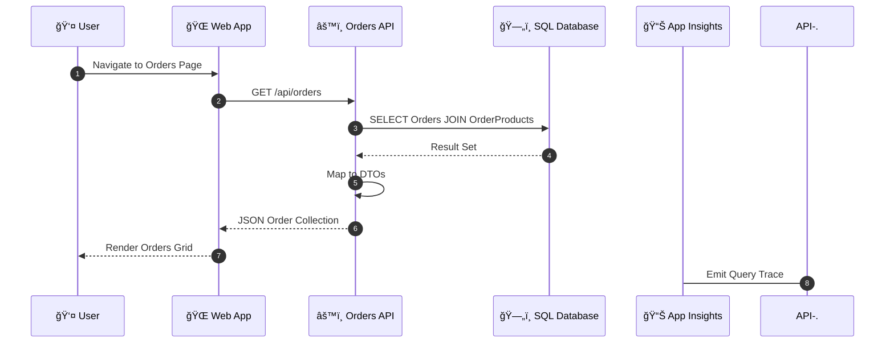

# Data Architecture

← [Business Architecture](01-business-architecture.md) | [Index](README.md) | [Application Architecture →](03-application-architecture.md)

## Data Architecture Overview

The Azure Logic Apps Monitoring Solution implements a **service-oriented data architecture** where each service owns its data store exclusively. This design ensures loose coupling, independent deployability, and clear data ownership boundaries. Data flows through the system via synchronous API calls (read/write operations) and asynchronous messaging (event propagation), with comprehensive telemetry captured for end-to-end observability.

The architecture supports two deployment models with environment parity:
- **Local Development**: SQL Server container, Service Bus emulator, local storage
- **Azure Deployment**: Azure SQL Database, Azure Service Bus, Azure Storage

---

## Data Architecture Principles

| Principle | Statement | Rationale | Implications |
|-----------|-----------|-----------|--------------|
| **Data Ownership** | Each service owns its data store exclusively | Loose coupling, independent deployability | No shared databases; API-mediated access only |
| **Event-Driven Propagation** | State changes propagated via immutable events | Audit trail, replay capability, loose coupling | Service Bus for all cross-service communication |
| **Data at Rest Encryption** | All persistent data encrypted | Compliance, security posture | Azure SQL TDE, Storage Service Encryption enabled |
| **Observability First** | All data flows instrumented for tracing | End-to-end visibility, debugging capability | W3C Trace Context propagation across all boundaries |
| **Environment Parity** | Same data patterns in dev and production | Reduced deployment risk, consistent behavior | Emulators mirror Azure service behavior |

---

## Data Landscape Map



---

## Data Domain Catalog

| Data Domain | Description | Bounded Context | Primary Store | Owner Service | Steward |
|-------------|-------------|-----------------|---------------|---------------|---------|
| **Order Management** | Customer orders and line items with validation | eShop.Orders | Azure SQL Database | eShop.Orders.API | Order Management Team |
| **Order Events** | Immutable order lifecycle events for downstream processing | Messaging | Service Bus Topic | eShop.Orders.API (publisher) | Platform Team |
| **Workflow State** | Logic App execution state and run history | Automation | Azure Storage | OrdersManagement Logic App | Workflow Team |
| **Operational Telemetry** | Distributed traces, logs, and metrics | Observability | Application Insights | All Services | SRE Team |

---

## Data Store Details

| Store | Technology | Purpose | Owner Service | Location | Tier/SKU |
|-------|------------|---------|---------------|----------|----------|
| **OrderDb** | Azure SQL Database | Order and product persistence with ACID transactions | eShop.Orders.API | Azure / Local SQL Container | General Purpose |
| **ordersplaced** | Service Bus Topic | Order event fan-out to multiple subscribers | eShop.Orders.API (publisher) | Azure / Local Emulator | Standard |
| **orderprocessingsub** | Service Bus Subscription | Logic App event consumption with dead-letter support | Logic Apps (subscriber) | Azure / Local Emulator | Standard |
| **Workflow State** | Azure Storage (File Share) | Logic App definition and run state persistence | OrdersManagement Logic App | Azure Storage Account | Standard LRS |
| **Application Insights** | Log Analytics Workspace | Telemetry storage for traces, logs, and metrics | All Services | Azure | Standard |

---

## Data Flow Architecture

### Write Path: Order Creation


### Read Path: Order Retrieval



---

## Monitoring Data Flow Architecture

```mermaid
flowchart LR
    subgraph Sources["📡 Layer 1: Telemetry Sources"]
        direction TB
        WebApp["🌠Web App<br/>(Blazor Server)"]
        API["âš™ï¸ Orders API<br/>(ASP.NET Core)"]
        LA["🔄 Logic Apps<br/>(Standard)"]
        SB["📨 Service Bus"]
        SQL["ğŸ—„ï¸ SQL Database"]
    end

    subgraph Instrumentation["🔧 Layer 2: Instrumentation"]
        direction TB
        OTEL["OpenTelemetry SDK<br/>───────────<br/>📠Traces<br/>📊 Metrics<br/>📠Logs"]
        AzureDiag["Azure Diagnostics<br/>───────────<br/>📋 Workflow Runs<br/>⚡ Actions"]
        AzureMon["Azure Monitor<br/>───────────<br/>📈 Platform Metrics"]
    end

    subgraph Collection["📥 Layer 3: Collection & Storage"]
        direction TB
        AI["📊 Application Insights<br/>───────────<br/>APM • Distributed Traces<br/>90 days retention"]
        LAW["📋 Log Analytics Workspace<br/>───────────<br/>Centralized Logs • KQL<br/>30 days retention"]
    end

    subgraph Visualization["📈 Layer 4: Visualization & Alerting"]
        direction TB
        AppMap["ğŸ—ºï¸ Application Map"]
        TransactionSearch["🔠Transaction Search"]
        KQL["📠KQL Queries"]
        Dashboards["📊 Azure Dashboards"]
        Alerts["🚨 Alert Rules"]
    end

    WebApp -->|"OTLP/HTTP"| OTEL
    API -->|"OTLP/HTTP"| OTEL
    LA -->|"Built-in"| AzureDiag
    SB -->|"Metrics"| AzureMon
    SQL -->|"Metrics"| AzureMon

    OTEL -->|"Export"| AI
    AzureDiag -->|"Diagnostics"| LAW
    AzureMon -->|"Platform"| LAW
    AI <-->|"Workspace Link"| LAW

    AI --> AppMap
    AI --> TransactionSearch
    LAW --> KQL
    AI --> Dashboards
    LAW --> Dashboards
    AI --> Alerts
    LAW --> Alerts

    classDef source fill:#fff3e0,stroke:#ef6c00,stroke-width:2px
    classDef instrument fill:#e3f2fd,stroke:#1565c0,stroke-width:2px
    classDef collect fill:#e8f5e9,stroke:#2e7d32,stroke-width:2px
    classDef visual fill:#f3e5f5,stroke:#7b1fa2,stroke-width:2px

    class WebApp,API,LA,SB,SQL source
    class OTEL,AzureDiag,AzureMon instrument
    class AI,LAW collect
    class AppMap,TransactionSearch,KQL,Dashboards,Alerts visual
```



### Telemetry Sources Detail

| Source | Technology | Telemetry Emitted | Instrumentation |
|--------|------------|-------------------|-----------------|
| **Web App** | Blazor Server | User interactions, page loads, HTTP client calls | OpenTelemetry SDK (auto) |
| **Orders API** | ASP.NET Core | Request traces, business metrics, structured logs | OpenTelemetry SDK (auto + manual) |
| **Logic Apps** | Standard | Workflow runs, action executions, trigger events | Azure Diagnostics (built-in) |
| **Service Bus** | Standard Tier | Message counts, queue depth, dead-letter metrics | Azure Monitor (platform) |
| **SQL Database** | Azure SQL | Query performance, DTU usage, connections | Azure Monitor (platform) |

### Telemetry Data Flow Matrix

| Source | Telemetry Type | Destination | Protocol | Correlation Key |
|--------|---------------|-------------|----------|-----------------|
| Web App | Traces, Logs | Application Insights | OTLP/HTTP | TraceId, SpanId |
| Orders API | Traces, Logs, Metrics | Application Insights | OTLP/HTTP | TraceId, SpanId |
| Service Bus Message | Trace Context | Message Properties | AMQP | traceparent header |
| Logic Apps | Workflow Runs, Actions | Log Analytics | Azure Diagnostics | Operation ID |
| All Services | Health Checks | App Insights Availability | HTTP | Endpoint URL |

### Trace Context Propagation

```mermaid
flowchart LR
    subgraph TraceFlow["🔗 W3C Trace Context Propagation"]
        HTTP["🌠HTTP Request<br/>───────────<br/>traceparent header<br/>tracestate header"]
        SBMsg["📨 Service Bus<br/>───────────<br/>TraceId property<br/>SpanId property<br/>traceparent property"]
        LACorr["🔄 Logic Apps<br/>───────────<br/>x-ms-workflow-run-id<br/>x-ms-client-tracking-id"]
        AICorr["📊 App Insights<br/>───────────<br/>Operation ID<br/>Parent ID"]
    end

    HTTP -->|"Inject"| SBMsg
    SBMsg -->|"Extract & Link"| LACorr
    HTTP -->|"Auto-capture"| AICorr
    LACorr -->|"Correlate"| AICorr

    classDef trace fill:#e8f5e9,stroke:#2e7d32,stroke-width:2px
    class HTTP,SBMsg,LACorr,AICorr trace
```



The solution implements **W3C Trace Context** for end-to-end distributed tracing across all service boundaries:

| Component | Propagation Method | Properties |
|-----------|-------------------|------------|
| HTTP Requests | Headers | `traceparent`, `tracestate` |
| Service Bus Messages | Application Properties | `TraceId`, `SpanId`, `traceparent` |
| Logic Apps | Built-in Correlation | Azure-managed Operation ID |
| Application Insights | SDK Auto-instrumentation | Operation ID correlation |

```csharp
// Trace context injection into Service Bus messages
// From: src/eShop.Orders.API/Handlers/OrdersMessageHandler.cs
message.ApplicationProperties["TraceId"] = activity.TraceId.ToString();
message.ApplicationProperties["SpanId"] = activity.SpanId.ToString();
message.ApplicationProperties["traceparent"] = activity.Id ?? string.Empty;
```

> 💡 **Tip:** This propagation ensures Logic Apps workflow runs can be correlated with the originating API request in Application Insights, enabling end-to-end transaction visibility.

---

## Data Integration Points

### Internal Service Communication

| Source | Target | Protocol | Data Format | Pattern | Frequency |
|--------|--------|----------|-------------|---------|-----------|
| Web App | Orders API | HTTPS/REST | JSON | Synchronous Request/Response | On-demand |
| Orders API | SQL Database | TDS (EF Core) | Relational | CRUD Operations | Per request |
| Orders API | Service Bus | AMQP | JSON | Async Pub/Sub | Per order |
| Service Bus | Logic App | Service Bus Connector | JSON | Event-driven Trigger | Per message |
| All Services | App Insights | HTTPS/OTLP | Telemetry | Continuous Push | Batched |

### Service Bus Topology

| Resource | Type | Purpose | Configuration |
|----------|------|---------|---------------|
| **ordersplaced** | Topic | Fan-out order events to multiple subscribers | Standard tier, 1GB |
| **orderprocessingsub** | Subscription | Logic App consumption | MaxDeliveryCount: 10, LockDuration: 5min, TTL: 14 days |

### Message Schema: OrderPlaced Event

```json
{
  "Id": "ORD-2025-001",
  "CustomerId": "CUST-100",
  "Date": "2025-12-30T10:30:00Z",
  "DeliveryAddress": "123 Main St, Seattle, WA 98101",
  "Total": 149.99,
  "Products": [
    {
      "Id": "ITEM-001",
      "OrderId": "ORD-2025-001",
      "ProductId": "PROD-1001",
      "ProductDescription": "Wireless Mouse",
      "Quantity": 2,
      "Price": 25.99
    }
  ]
}
```

| Message Property | Value | Purpose |
|-----------------|-------|---------|
| `ContentType` | `application/json` | MIME type declaration |
| `MessageId` | Order.Id | Deduplication key |
| `Subject` | `OrderPlaced` | Message type discriminator |
| `traceparent` | W3C traceparent | Distributed tracing correlation |

---

## Data Governance

### Data Classification

| Data Element | Classification | Logging | Tracing | Handling |
|--------------|----------------|---------|---------|----------|
| Order ID | Business Identifier | Full | Tagged | Standard |
| Customer ID | PII Reference | ID only | Not tagged | Restricted |
| Delivery Address | PII | Masked | Not included | Confidential |
| Order Total | Financial | Full | Metrics only | Internal |
| Product Details | Business | Full | Tagged | Standard |

### Retention Policies

| Data Store | Retention | Policy Type | Archive Strategy |
|------------|-----------|-------------|------------------|
| SQL Database (Orders) | Indefinite | Business data | Manual archival |
| Log Analytics Logs | 30 days | Operational | Auto-delete |
| Application Insights | 90 days | Telemetry | Export to Storage |
| Service Bus Messages | 14 days | Transient | TTL on subscription |

### Backup and Recovery

| Component | Backup Strategy | RPO | RTO |
|-----------|-----------------|-----|-----|
| Azure SQL Database | Automated geo-redundant | 5 min | 1 hour |
| Service Bus | No backup (transient) | N/A | Replay from source |
| Workflow State | Azure Storage redundancy | Near-zero | Minutes |
| App Insights | Platform managed | N/A | N/A |

---

## Cross-Architecture Relationships

| Related Architecture | Connection | Reference |
|---------------------|------------|-----------|
| **Business Architecture** | Orders data supports Order Fulfillment capability | [Business Architecture](01-business-architecture.md#business-capabilities) |
| **Application Architecture** | Orders API service manages Order data entities | [Application Architecture](03-application-architecture.md#service-catalog) |
| **Technology Architecture** | Azure SQL hosts OrderDb; Service Bus transports events | [Technology Architecture](04-technology-architecture.md#infrastructure-components) |
| **Observability Architecture** | Telemetry data flows to App Insights for monitoring | [Observability Architecture](05-observability-architecture.md#distributed-tracing) |
| **Security Architecture** | Data classification drives access control policies | [Security Architecture](06-security-architecture.md#data-protection) |

---

## Related Documents

- [Application Architecture](03-application-architecture.md) - Service implementation details
- [Technology Architecture](04-technology-architecture.md) - Azure SQL and Service Bus configuration
- [Observability Architecture](05-observability-architecture.md) - Telemetry and tracing details
- [ADR-002: Service Bus Messaging](adr/ADR-002-service-bus-messaging.md) - Messaging pattern decision
- [Database Migration Guide](../../src/eShop.Orders.API/MIGRATION_GUIDE.md) - EF Core schema management
