```mermaid
flowchart LR
    subgraph BusinessDomains["📊 Business Data Domains"]
        Orders["📦 Orders Domain"]
        Events["📨 Order Events Domain"]
    end

    subgraph DataStores["🗄️ Data Stores"]
        OrderDb[("OrderDb<br/>Azure SQL")]
        EventStore["ordersplaced<br/>Service Bus Topic"]
        WorkflowState["Workflow State<br/>Azure Storage"]
    end

    subgraph Consumers["👥 Data Consumers"]
        API["Orders API"]
        LogicApp["Logic Apps"]
        Analytics["App Insights"]
    end

    Orders --> OrderDb
    Orders --> EventStore
    OrderDb --> API
    EventStore --> LogicApp
    API --> Analytics
    LogicApp --> Analytics
    LogicApp --> WorkflowState

    classDef domain fill:#e3f2fd,stroke:#1565c0,stroke-width:2px
    classDef store fill:#fff3e0,stroke:#ef6c00,stroke-width:2px
    classDef consumer fill:#e8f5e9,stroke:#2e7d32,stroke-width:2px

    class Orders,Events domain
    class OrderDb,EventStore,WorkflowState store
    class API,LogicApp,Analytics consumer
```

# Data Architecture

[← Business Architecture](01-business-architecture.md) | [Index](README.md) | [Application Architecture →](03-application-architecture.md)

## Data Architecture Overview

The Azure Logic Apps Monitoring Solution implements a **service-oriented data architecture** where each service owns its data store exclusively. Data flows through the system via well-defined APIs and event-driven messaging, ensuring loose coupling and independent deployability.

### Data Stores Inventory

| Store                    | Technology               | Owner Service              | Purpose                       |
| ------------------------ | ------------------------ | -------------------------- | ----------------------------- |
| **OrderDb**              | Azure SQL Database       | eShop.Orders.API           | Order and product persistence |
| **ordersplaced**         | Service Bus Topic        | eShop.Orders.API           | Order event propagation       |
| **orderprocessingsub**   | Service Bus Subscription | Logic Apps                 | Order event consumption       |
| **Workflow State**       | Azure Storage            | OrdersManagement Logic App | Workflow execution state      |
| **Application Insights** | Azure Monitor            | All Services               | Operational telemetry         |

---

## Data Architecture Principles

| Principle                     | Statement                                       | Rationale                                        | Implications                                               |
| ----------------------------- | ----------------------------------------------- | ------------------------------------------------ | ---------------------------------------------------------- |
| **Data Ownership**            | Each service owns its data store exclusively    | Loose coupling, independent deployability        | No shared databases, API-mediated access only              |
| **Event Sourcing**            | State changes propagated via immutable events   | Audit trail, temporal queries, replay capability | Service Bus for all cross-service communication            |
| **Data at Rest Encryption**   | All persistent data encrypted                   | Compliance, security posture                     | Azure SQL TDE, Storage Service Encryption enabled          |
| **Schema Evolution**          | All schemas support backward-compatible changes | Zero-downtime deployments                        | Additive changes only, versioned APIs for breaking changes |
| **Trace Context Propagation** | All data flows include correlation IDs          | End-to-end observability                         | W3C Trace Context in HTTP headers and message properties   |

---

## Data Landscape Map



---

## Data Domain Catalog

| Data Domain               | Description                                                    | Bounded Context | Primary Store        | Owner Service    | Steward               |
| ------------------------- | -------------------------------------------------------------- | --------------- | -------------------- | ---------------- | --------------------- |
| **Order Management**      | Customer orders including line items, delivery info, totals    | eShop.Orders    | Azure SQL            | eShop.Orders.API | Order Management Team |
| **Order Events**          | Immutable order lifecycle events (OrderPlaced, OrderProcessed) | Messaging       | Service Bus          | Platform         | Platform Team         |
| **Operational Telemetry** | Traces, metrics, logs from all services                        | Observability   | Application Insights | All Services     | SRE Team              |
| **Workflow State**        | Logic App execution state and run history                      | Automation      | Azure Storage        | Logic Apps       | Workflow Team         |

---

## Data Store Details

| Store                    | Technology                 | Purpose                       | Owner Service                | Location                    | Tier/SKU        | Retention   |
| ------------------------ | -------------------------- | ----------------------------- | ---------------------------- | --------------------------- | --------------- | ----------- |
| **OrderDb**              | Azure SQL Database         | Order and product persistence | eShop.Orders.API             | Azure / Local SQL Container | General Purpose | Indefinite  |
| **ordersplaced**         | Service Bus Topic          | Order event propagation       | eShop.Orders.API (publisher) | Azure / Local Emulator      | Standard        | 14 days TTL |
| **orderprocessingsub**   | Service Bus Subscription   | Order event consumption       | Logic Apps (subscriber)      | Azure / Local Emulator      | Standard        | 14 days TTL |
| **Workflow State**       | Azure Storage (File Share) | Logic App workflow state      | OrdersManagement Logic App   | Azure Storage Account       | Standard LRS    | 30 days     |
| **Application Insights** | Azure Monitor              | APM and distributed traces    | All Services                 | Azure                       | Standard        | 90 days     |
| **Log Analytics**        | Azure Monitor              | Centralized logging           | All Services                 | Azure                       | Pay-as-you-go   | 30 days     |

---

## Data Flow Architecture

### Write Path: Order Creation

```mermaid
sequenceDiagram
    autonumber
    participant User as 👤 User
    participant Web as 🌐 Web App
    participant API as 📡 Orders API
    participant DB as 🗄️ SQL Database
    participant SB as 📨 Service Bus
    participant LA as 🔄 Logic App

    User->>Web: Submit Order Form
    Web->>API: POST /api/orders
    API->>API: Validate Order
    API->>DB: INSERT Order + Products
    DB-->>API: Confirmation
    API->>SB: Publish OrderPlaced Message
    SB-->>API: Acknowledgment
    API-->>Web: 201 Created + Order
    Web-->>User: Success Message

    Note over SB,LA: Async Processing (Event-Driven)
    SB->>LA: Trigger: Service Bus Message
    LA->>LA: Execute Workflow
    LA->>LA: Archive to Blob Storage
```



### Read Path: Order Retrieval

```mermaid
sequenceDiagram
    autonumber
    participant User as 👤 User
    participant Web as 🌐 Web App
    participant API as 📡 Orders API
    participant DB as 🗄️ SQL Database

    User->>Web: View Orders Page
    Web->>API: GET /api/orders
    API->>DB: SELECT Orders with Products
    DB-->>API: Order Data
    API-->>Web: JSON Order Collection
    Web-->>User: Render Orders Grid
```



---

## Data Flow Matrix

| Source       | Target       | Data Type         | Protocol    | Pattern               | Frequency   | Volume    |
| ------------ | ------------ | ----------------- | ----------- | --------------------- | ----------- | --------- |
| Web App      | Orders API   | Order JSON        | HTTPS/REST  | Sync Request/Response | On-demand   | ~100/hour |
| Orders API   | SQL Database | Order Entity      | TDS/EF Core | CRUD                  | Per request | ~100/hour |
| Orders API   | Service Bus  | OrderPlaced Event | AMQP        | Async Pub/Sub         | Per order   | ~100/hour |
| Service Bus  | Logic Apps   | OrderPlaced Event | Connector   | Event-driven          | Per event   | ~100/hour |
| All Services | App Insights | Telemetry         | HTTPS/OTLP  | Continuous Push       | Batched     | ~10K/hour |

---

## Monitoring Data Flow Architecture

### 4-Layer Telemetry Flow

```mermaid
flowchart LR
    subgraph Sources["📡 Layer 1: Telemetry Sources"]
        direction TB
        S1["🌐 Web App"]
        S2["📡 Orders API"]
        S3["🔄 Logic Apps"]
        S4["🗄️ SQL Database"]
        S5["📨 Service Bus"]
    end

    subgraph Instrumentation["🔧 Layer 2: Instrumentation"]
        direction TB
        I1["OpenTelemetry SDK"]
        I2["Azure Diagnostics"]
        I3["Built-in Metrics"]
    end

    subgraph Collection["📥 Layer 3: Collection & Storage"]
        direction TB
        C1["📈 Application Insights"]
        C2["📋 Log Analytics"]
    end

    subgraph Visualization["📊 Layer 4: Visualization & Alerting"]
        direction TB
        V1["🗺️ Application Map"]
        V2["🔍 Transaction Search"]
        V3["📊 Dashboards"]
        V4["🚨 Alerts"]
    end

    S1 & S2 -->|"OTLP"| I1
    S3 & S4 & S5 -->|"Built-in"| I2
    S4 & S5 -->|"Platform"| I3

    I1 -->|"Export"| C1
    I2 -->|"Diagnostics"| C2
    I3 -->|"Metrics"| C1

    C1 --> V1 & V2 & V3
    C2 --> V3
    C1 & C2 --> V4

    classDef source fill:#fff3e0,stroke:#ef6c00,stroke-width:2px
    classDef instrument fill:#e3f2fd,stroke:#1565c0,stroke-width:2px
    classDef collect fill:#e8f5e9,stroke:#2e7d32,stroke-width:2px
    classDef visual fill:#f3e5f5,stroke:#7b1fa2,stroke-width:2px

    class S1,S2,S3,S4,S5 source
    class I1,I2,I3 instrument
    class C1,C2 collect
    class V1,V2,V3,V4 visual
```



### Layer Definitions

| Layer               | Purpose                       | Components                                 | Protocols       |
| ------------------- | ----------------------------- | ------------------------------------------ | --------------- |
| **Sources**         | Origin of telemetry data      | Web App, API, Logic Apps, SQL, Service Bus | N/A             |
| **Instrumentation** | Capture and format telemetry  | OpenTelemetry SDK, Azure Diagnostics       | OTLP, Azure ARM |
| **Collection**      | Aggregate and store telemetry | Application Insights, Log Analytics        | HTTPS           |
| **Visualization**   | Consume and act on telemetry  | Dashboards, Alerts, KQL Queries            | N/A             |

---

## Telemetry Data Mapping

### Three Pillars of Observability

| Pillar      | Description                                 | Data Type                                | Use Case                              | Storage               |
| ----------- | ------------------------------------------- | ---------------------------------------- | ------------------------------------- | --------------------- |
| **Traces**  | Distributed request flow across services    | Spans with TraceId, SpanId, ParentSpanId | End-to-end transaction analysis       | Application Insights  |
| **Metrics** | Numeric measurements aggregated over time   | Counters, Gauges, Histograms             | Dashboards, alerts, capacity planning | Azure Monitor Metrics |
| **Logs**    | Discrete events with contextual information | Structured JSON with properties          | Debugging, auditing, investigation    | Log Analytics         |

### Telemetry-to-Source Mapping

```mermaid
flowchart TB
    subgraph Sources["📡 Telemetry Sources"]
        API["⚙️ Orders API"]
        Web["🌐 Web App"]
        LA["🔄 Logic Apps"]
        SB["📨 Service Bus"]
        SQL["🗄️ SQL Database"]
    end

    subgraph Pillars["📊 Three Pillars"]
        subgraph Traces["📍 Traces"]
            T1["HTTP Request spans"]
            T2["Database query spans"]
            T3["Service Bus spans"]
        end

        subgraph Metrics["📈 Metrics"]
            M1["Request metrics"]
            M2["Business metrics"]
            M3["Platform metrics"]
        end

        subgraph Logs["📝 Logs"]
            L1["Application logs"]
            L2["Diagnostic logs"]
            L3["Audit logs"]
        end
    end

    API --> T1 & T2 & T3
    API --> M1 & M2
    API --> L1
    Web --> T1 & M1 & L1
    LA --> M3 & L2
    SB --> M3 & L2
    SQL --> M3 & L2

    classDef trace fill:#e3f2fd,stroke:#1565c0
    classDef metric fill:#e8f5e9,stroke:#2e7d32
    classDef log fill:#fff3e0,stroke:#ef6c00

    class T1,T2,T3 trace
    class M1,M2,M3 metric
    class L1,L2,L3 log
```



---

## Metrics Inventory

### Orders API Metrics

| Metric Name                        | Type      | Unit    | Dimensions            | Purpose                  | Source                                                                     |
| ---------------------------------- | --------- | ------- | --------------------- | ------------------------ | -------------------------------------------------------------------------- |
| `http.server.request.duration`     | Histogram | seconds | method, route, status | Request latency tracking | OpenTelemetry                                                              |
| `eShop.orders.placed`              | Counter   | count   | -                     | Business volume          | [OrderService.cs](../../src/eShop.Orders.API/Services/OrderService.cs#L28) |
| `eShop.orders.processing.duration` | Histogram | ms      | -                     | Processing efficiency    | [OrderService.cs](../../src/eShop.Orders.API/Services/OrderService.cs#L30) |
| `eShop.orders.processing.errors`   | Counter   | error   | error_type            | Error tracking           | [OrderService.cs](../../src/eShop.Orders.API/Services/OrderService.cs#L34) |
| `eShop.orders.deleted`             | Counter   | count   | -                     | Deletion tracking        | [OrderService.cs](../../src/eShop.Orders.API/Services/OrderService.cs#L38) |

### Platform Metrics (Azure Monitor)

| Metric                 | Type    | Source       | Threshold | Purpose                   |
| ---------------------- | ------- | ------------ | --------- | ------------------------- |
| `ActiveMessages`       | Gauge   | Service Bus  | > 1000    | Queue depth monitoring    |
| `DeadLetteredMessages` | Gauge   | Service Bus  | > 0       | Failed message detection  |
| `cpu_percent`          | Gauge   | SQL Database | > 80%     | Database load             |
| `RunsSucceeded`        | Counter | Logic Apps   | N/A       | Workflow success rate     |
| `RunsFailed`           | Counter | Logic Apps   | > 3/5min  | Workflow failure alerting |

---

## Logs Inventory

### Application Log Events

| Log Event                    | Level       | Source               | Properties                 | Purpose              |
| ---------------------------- | ----------- | -------------------- | -------------------------- | -------------------- |
| `OrderCreated`               | Information | OrderService         | OrderId, CustomerId, Total | Business audit       |
| `OrderValidationFailed`      | Warning     | OrderService         | OrderId, Errors[]          | Validation tracking  |
| `ServiceBusMessagePublished` | Information | OrdersMessageHandler | MessageId, Topic, TraceId  | Message tracing      |
| `DatabaseQueryExecuted`      | Debug       | EF Core              | Query, Duration            | Performance analysis |
| `UnhandledException`         | Error       | All                  | Exception, StackTrace      | Error investigation  |

### Structured Logging Format

```json
{
  "Timestamp": "2026-01-14T10:30:00.000Z",
  "Level": "Information",
  "MessageTemplate": "Order {OrderId} created with total {Total}",
  "Properties": {
    "OrderId": "ORD-2026-001",
    "Total": 149.99,
    "CustomerId": "CUST-100",
    "TraceId": "abc123def456...",
    "SpanId": "789xyz...",
    "RequestPath": "/api/orders",
    "SourceContext": "eShop.Orders.API.Services.OrderService"
  }
}
```

---

## Trace Context Propagation

The solution implements **W3C Trace Context** for cross-service correlation:

| Component            | Propagation Method       | Properties                         |
| -------------------- | ------------------------ | ---------------------------------- |
| HTTP Requests        | Headers                  | `traceparent`, `tracestate`        |
| Service Bus Messages | Application Properties   | `TraceId`, `SpanId`, `traceparent` |
| Logic Apps           | Built-in correlation     | Azure-managed                      |
| Application Insights | SDK auto-instrumentation | Operation ID                       |

### Implementation Reference

```csharp
// From OrdersMessageHandler.cs - Trace context propagation to Service Bus
message.ApplicationProperties["TraceId"] = activity.TraceId.ToString();
message.ApplicationProperties["SpanId"] = activity.SpanId.ToString();
message.ApplicationProperties["traceparent"] = activity.Id ?? string.Empty;
```

> 💡 **Tip:** This ensures Logic Apps workflows correlate with originating API requests in Application Insights Transaction Search.

---

## Data Dependencies

```mermaid
flowchart TD
    subgraph Upstream["⬆️ Upstream (Data Producers)"]
        WebApp["🌐 Web App<br/>(Order Input)"]
    end

    subgraph Core["🎯 Core Data Assets"]
        OrderDb[("OrderDb<br/>Azure SQL")]
        EventBus["Service Bus<br/>ordersplaced"]
    end

    subgraph Downstream["⬇️ Downstream (Data Consumers)"]
        LogicApp["Logic Apps<br/>(Workflow Automation)"]
        AppInsights["App Insights<br/>(Analytics & Monitoring)"]
    end

    WebApp -->|"Creates orders"| OrderDb
    OrderDb -->|"Publishes events"| EventBus
    EventBus -->|"Triggers workflows"| LogicApp
    OrderDb -.->|"Emits telemetry"| AppInsights
    LogicApp -.->|"Emits telemetry"| AppInsights

    classDef upstream fill:#fff3e0,stroke:#ef6c00
    classDef core fill:#e3f2fd,stroke:#1565c0
    classDef downstream fill:#e8f5e9,stroke:#2e7d32

    class WebApp upstream
    class OrderDb,EventBus core
    class LogicApp,AppInsights downstream
```



---

## Data Lifecycle States

| Stage           | Description                 | Location          | Duration     | Transition Trigger    |
| --------------- | --------------------------- | ----------------- | ------------ | --------------------- |
| **Creation**    | Order submitted via API     | Orders API memory | Milliseconds | Validation passes     |
| **Persistence** | Order saved to database     | Azure SQL         | Indefinite   | Transaction commit    |
| **Publication** | Order event published       | Service Bus topic | 14 days TTL  | Post-commit hook      |
| **Consumption** | Event processed by workflow | Logic App         | Minutes      | Subscription delivery |
| **Telemetry**   | Operational data captured   | App Insights      | 90 days      | Continuous            |

---

## Cross-Architecture Relationships

| Related Architecture           | Connection                                             | Reference                                                                          |
| ------------------------------ | ------------------------------------------------------ | ---------------------------------------------------------------------------------- |
| **Business Architecture**      | Orders data supports Order Fulfillment capability      | [Business Architecture](01-business-architecture.md#business-capabilities)         |
| **Application Architecture**   | Orders API service manages Order data entities         | [Application Architecture](03-application-architecture.md#eshop-orders-api)        |
| **Technology Architecture**    | Azure SQL hosts OrderDb; Service Bus transports events | [Technology Architecture](04-technology-architecture.md#data-platform)             |
| **Observability Architecture** | Telemetry data flows to App Insights for monitoring    | [Observability Architecture](05-observability-architecture.md#distributed-tracing) |
| **Security Architecture**      | Data classification drives access control policies     | [Security Architecture](06-security-architecture.md#data-protection)               |

---

_Last Updated: January 2026_
