# 🗃️ Data Architecture

← [Business Architecture](01-business-architecture.md) | [Index](README.md) | [Application Architecture →](03-application-architecture.md)

---

## 📑 Table of Contents

- [📊 Overview](#-1-data-architecture-overview)
- [📋 Principles](#-2-data-architecture-principles)
- [🗺️ Data Landscape](#️-3-data-landscape-map)
- [📦 Domain Catalog](#-4-data-domain-catalog)
- [🗄️ Store Details](#️-5-data-store-details)
- [🔄 Data Flow](#-6-data-flow-architecture)
- [📊 Monitoring Data Flow](#-7-monitoring-data-flow-architecture)
- [📍 Telemetry Mapping](#-8-telemetry-data-mapping)
- [🔗 Trace Context](#-9-trace-context-propagation)
- [↔️ Cross-Architecture](#️-10-cross-architecture-relationships)

---

## 📊 1. Data Architecture Overview

The Azure Logic Apps Monitoring Solution implements a **service-oriented data architecture** where each service owns its data store exclusively. This ensures loose coupling, independent deployability, and clear data ownership boundaries.

### Data Stores Inventory

| Store                | Technology               | Purpose                       | Owner Service                |
| -------------------- | ------------------------ | ----------------------------- | ---------------------------- |
| OrderDb              | Azure SQL Database       | Order and product persistence | eShop.Orders.API             |
| ordersplaced         | Service Bus Topic        | Order event propagation       | eShop.Orders.API (publisher) |
| orderprocessingsub   | Service Bus Subscription | Order event consumption       | Logic Apps (subscriber)      |
| Workflow State       | Azure Storage            | Logic App execution state     | OrdersManagement             |
| Application Insights | Log Analytics            | Telemetry storage             | All Services                 |

---

<div align="right"><a href="#-table-of-contents">⬆️ Back to top</a></div>

## 📋 2. Data Architecture Principles

| Principle                   | Statement                                     | Rationale                                 | Implications                                  |
| --------------------------- | --------------------------------------------- | ----------------------------------------- | --------------------------------------------- |
| **Data Ownership**          | Each service owns its data store exclusively  | Loose coupling, independent deployability | No shared databases, API-mediated access only |
| **Event Sourcing**          | State changes propagated via immutable events | Audit trail, replay capability            | Service Bus for cross-service communication   |
| **Data at Rest Encryption** | All persistent data encrypted                 | Compliance, security posture              | Azure SQL TDE, Storage Service Encryption     |
| **Schema Evolution**        | Schemas support backward-compatible changes   | Zero-downtime deployments                 | Additive changes only, versioned APIs         |
| **Trace Correlation**       | All data includes correlation identifiers     | End-to-end visibility                     | W3C Trace Context in all messages             |

---

<div align="right"><a href="#-table-of-contents">⬆️ Back to top</a></div>

## 🗺️ 3. Data Landscape Map

```mermaid
flowchart LR
    subgraph BusinessDomains["📊 Business Data Domains"]
        Orders["📦 Orders Domain<br/><i>Order entities, products</i>"]
        Events["📨 Order Events Domain<br/><i>OrderPlaced messages</i>"]
    end

    subgraph DataStores["🗄️ Data Stores"]
        OrderDb[("OrderDb<br/>Azure SQL")]
        EventStore["ordersplaced<br/>Service Bus Topic"]
        WorkflowState["Workflow State<br/>Azure Storage"]
    end

    subgraph Consumers["👥 Data Consumers"]
        API["Orders API"]
        WebApp["Web App"]
        LogicApp["Logic Apps"]
        Analytics["App Insights"]
    end

    Orders --> OrderDb
    Orders --> EventStore
    Events --> EventStore

    OrderDb --> API
    API --> WebApp
    EventStore --> LogicApp
    LogicApp --> WorkflowState

    API -.-> Analytics
    WebApp -.-> Analytics
    LogicApp -.-> Analytics

    classDef domain fill:#e3f2fd,stroke:#1565c0,stroke-width:2px
    classDef store fill:#fff3e0,stroke:#ef6c00,stroke-width:2px
    classDef consumer fill:#e8f5e9,stroke:#2e7d32,stroke-width:2px

    class Orders,Events domain
    class OrderDb,EventStore,WorkflowState store
    class API,WebApp,LogicApp,Analytics consumer
```



---

<div align="right"><a href="#-table-of-contents">⬆️ Back to top</a></div>

## 📦 4. Data Domain Catalog

| Data Domain               | Description                                | Bounded Context | Primary Store | Owner Service | Steward               |
| ------------------------- | ------------------------------------------ | --------------- | ------------- | ------------- | --------------------- |
| **Order Management**      | Customer orders with line items and totals | eShop.Orders    | Azure SQL     | Orders API    | Order Management Team |
| **Order Events**          | Immutable order lifecycle events           | Messaging       | Service Bus   | Platform      | Platform Team         |
| **Operational Telemetry** | Traces, metrics, logs                      | Observability   | App Insights  | All Services  | SRE Team              |
| **Workflow State**        | Logic App execution history and state      | Automation      | Azure Storage | Logic Apps    | Workflow Team         |

---

<div align="right"><a href="#-table-of-contents">⬆️ Back to top</a></div>

## 🗄️ 5. Data Store Details

| Store                           | Technology               | Purpose                       | Owner Service                | Location                    | Tier/SKU     |
| ------------------------------- | ------------------------ | ----------------------------- | ---------------------------- | --------------------------- | ------------ |
| **OrderDb**                     | Azure SQL Database       | Order and product persistence | eShop.Orders.API             | Azure / Local SQL Container | Standard S1  |
| **ordersplaced**                | Service Bus Topic        | Order event propagation       | eShop.Orders.API (publisher) | Azure / Local Emulator      | Standard     |
| **orderprocessingsub**          | Service Bus Subscription | Order event consumption       | Logic Apps (subscriber)      | Azure / Local Emulator      | Standard     |
| **ordersprocessedsuccessfully** | Azure Blob Container     | Successfully processed orders | OrdersManagement             | Azure Storage               | Standard LRS |
| **ordersprocessedwitherrors**   | Azure Blob Container     | Failed order processing       | OrdersManagement             | Azure Storage               | Standard LRS |

---

<div align="right"><a href="#-table-of-contents">⬆️ Back to top</a></div>

## 🔄 6. Data Flow Architecture

### ✏️ Write Path: Order Placement

```mermaid
sequenceDiagram
    autonumber
    participant User as 👤 User
    participant Web as 🌐 Web App
    participant API as 📡 Orders API
    participant DB as 🗄️ SQL Database
    participant SB as 📨 Service Bus
    participant LA as 🔄 Logic App
    participant Blob as 📁 Blob Storage

    User->>Web: Submit Order Form
    Web->>API: POST /api/orders
    API->>API: Validate Order
    API->>DB: INSERT Order + Products
    DB-->>API: Confirmation
    API->>SB: Publish OrderPlaced Message
    Note over API,SB: Message includes TraceId, SpanId
    SB-->>API: Acknowledgment
    API-->>Web: 201 Created + Order
    Web-->>User: Success Message

    Note over SB,LA: Async Processing
    SB->>LA: Trigger: Service Bus Message
    LA->>API: POST /api/orders/process
    API-->>LA: 201 Created

    alt Success
        LA->>Blob: Store in /ordersprocessedsuccessfully
    else Failure
        LA->>Blob: Store in /ordersprocessedwitherrors
    end
```



### 📖 Read Path: Order Retrieval

```mermaid
sequenceDiagram
    autonumber
    participant User as 👤 User
    participant Web as 🌐 Web App
    participant API as 📡 Orders API
    participant DB as 🗄️ SQL Database

    User->>Web: View Orders Page
    Web->>API: GET /api/orders
    API->>DB: SELECT Orders with Products
    DB-->>API: Order Data
    API-->>Web: JSON Order Collection
    Web-->>User: Render Orders Grid

    Note over User,Web: Real-time updates via SignalR
```



---

<div align="right"><a href="#-table-of-contents">⬆️ Back to top</a></div>

## 📊 7. Monitoring Data Flow Architecture

```mermaid
flowchart LR
    subgraph Sources["📡 Layer 1: Telemetry Sources"]
        direction TB
        WebApp["🌐 Web App<br/>Blazor Server"]
        API["📡 Orders API<br/>ASP.NET Core"]
        LA["🔄 Logic Apps<br/>Standard"]
        SQL["🗄️ SQL Database"]
        SB["📨 Service Bus"]
    end

    subgraph Instrumentation["🔧 Layer 2: Instrumentation"]
        direction TB
        OTEL["OpenTelemetry SDK<br/><i>.NET Auto-instrumentation</i>"]
        AzDiag["Azure Diagnostics<br/><i>Platform telemetry</i>"]
    end

    subgraph Collection["📥 Layer 3: Collection"]
        direction TB
        AI["Application Insights<br/><i>APM & Tracing</i>"]
        LAW["Log Analytics<br/><i>Centralized Logs</i>"]
    end

    subgraph Visualization["📈 Layer 4: Visualization"]
        direction TB
        AppMap["Application Map"]
        TxSearch["Transaction Search"]
        Dashboards["Azure Dashboards"]
        Alerts["Alert Rules"]
    end

    WebApp & API -->|"OTLP/HTTP"| OTEL
    LA & SQL & SB -->|"Built-in"| AzDiag

    OTEL -->|"Export"| AI
    AzDiag -->|"Diagnostic Settings"| LAW
    AI --> LAW

    AI --> AppMap & TxSearch
    LAW --> Dashboards & Alerts

    classDef source fill:#fff3e0,stroke:#ef6c00,stroke-width:2px
    classDef instrument fill:#e3f2fd,stroke:#1565c0,stroke-width:2px
    classDef collect fill:#e8f5e9,stroke:#2e7d32,stroke-width:2px
    classDef visual fill:#f3e5f5,stroke:#7b1fa2,stroke-width:2px

    class WebApp,API,LA,SQL,SB source
    class OTEL,AzDiag instrument
    class AI,LAW collect
    class AppMap,TxSearch,Dashboards,Alerts visual
```



### Telemetry Layer Requirements

| Layer               | Purpose               | Components                                 | Protocol  |
| ------------------- | --------------------- | ------------------------------------------ | --------- |
| **Sources**         | Origin of telemetry   | Web App, API, Logic Apps, SQL, Service Bus | N/A       |
| **Instrumentation** | Capture mechanisms    | OpenTelemetry SDK, Azure Diagnostics       | OTLP, ARM |
| **Collection**      | Aggregation & storage | Application Insights, Log Analytics        | HTTPS     |
| **Visualization**   | Consumption & action  | Application Map, Dashboards, Alerts        | KQL       |

---

<div align="right"><a href="#-table-of-contents">⬆️ Back to top</a></div>

## 📍 8. Telemetry Data Mapping

### 📊 Three Pillars of Observability

| Pillar      | Description                                 | Data Type                                | Use Case                              | Storage               |
| ----------- | ------------------------------------------- | ---------------------------------------- | ------------------------------------- | --------------------- |
| **Traces**  | Distributed request flow across services    | Spans with TraceId, SpanId, ParentSpanId | End-to-end transaction analysis       | Application Insights  |
| **Metrics** | Numeric measurements aggregated over time   | Counters, Gauges, Histograms             | Dashboards, alerts, capacity planning | Azure Monitor Metrics |
| **Logs**    | Discrete events with contextual information | Structured JSON with properties          | Debugging, auditing, investigation    | Log Analytics         |

### 🗺️ Telemetry Mapping Diagram

```mermaid
flowchart TB
    subgraph Sources["📡 Telemetry Sources"]
        API["⚙️ Orders API"]
        Web["🌐 Web App"]
        LA["🔄 Logic Apps"]
        SB["📨 Service Bus"]
        SQL["🗄️ SQL Database"]
    end

    subgraph Pillars["📊 Three Pillars"]
        subgraph Traces["📍 Traces"]
            T1["HTTP Request spans"]
            T2["Database spans"]
            T3["Service Bus spans"]
        end

        subgraph Metrics["📈 Metrics"]
            M1["Request metrics"]
            M2["Business metrics"]
            M3["Platform metrics"]
        end

        subgraph Logs["📝 Logs"]
            L1["Application logs"]
            L2["Diagnostic logs"]
            L3["Audit logs"]
        end
    end

    subgraph Storage["📥 Storage"]
        AI["Application Insights"]
        LAW["Log Analytics"]
    end

    API --> T1 & T2 & M1 & M2 & L1
    Web --> T1 & M1 & L1
    LA --> T3 & M3 & L2
    SB --> M3 & L2
    SQL --> M3 & L2

    Traces --> AI
    Metrics --> AI
    Logs --> AI & LAW

    classDef trace fill:#e3f2fd,stroke:#1565c0
    classDef metric fill:#e8f5e9,stroke:#2e7d32
    classDef log fill:#fff3e0,stroke:#ef6c00

    class T1,T2,T3 trace
    class M1,M2,M3 metric
    class L1,L2,L3 log
```



### 📊 Metrics Inventory by Source

#### 📡 Orders API Metrics

| Metric                         | Type          | Unit    | Dimensions            | Alert Threshold | Purpose                       |
| ------------------------------ | ------------- | ------- | --------------------- | --------------- | ----------------------------- |
| `http.server.request.duration` | Histogram     | seconds | method, route, status | P95 > 2s        | Request latency tracking      |
| `http.server.active_requests`  | UpDownCounter | count   | method                | > 100           | Concurrent request monitoring |
| `db.client.operation.duration` | Histogram     | seconds | operation, db.name    | P95 > 1s        | Database query performance    |
| `orders.created`               | Counter       | count   | -                     | N/A             | Business volume tracking      |

#### 📨 Service Bus Metrics (Platform)

| Metric                 | Type    | Description                | Alert Threshold |
| ---------------------- | ------- | -------------------------- | --------------- |
| `ActiveMessages`       | Gauge   | Messages awaiting delivery | > 1000          |
| `DeadLetteredMessages` | Gauge   | Failed message count       | > 10            |
| `IncomingMessages`     | Counter | Messages received          | N/A             |
| `OutgoingMessages`     | Counter | Messages delivered         | N/A             |

#### 🗄️ SQL Database Metrics (Platform)

| Metric                    | Type    | Description            | Alert Threshold |
| ------------------------- | ------- | ---------------------- | --------------- |
| `cpu_percent`             | Gauge   | CPU utilization        | > 80%           |
| `dtu_consumption_percent` | Gauge   | DTU usage              | > 80%           |
| `connection_successful`   | Counter | Successful connections | N/A             |
| `deadlock`                | Counter | Deadlock occurrences   | > 0             |

#### 🔄 Logic Apps Metrics (Platform)

| Metric          | Type    | Description              | Alert Threshold |
| --------------- | ------- | ------------------------ | --------------- |
| `RunsSucceeded` | Counter | Successful workflow runs | N/A             |
| `RunsFailed`    | Counter | Failed workflow runs     | > 5/5min        |
| `RunLatency`    | Gauge   | Workflow execution time  | > 10s           |

### 📝 Logs Inventory by Source

#### 📝 Orders API Logs

| Log Event                    | Level       | Properties                 | Example                               |
| ---------------------------- | ----------- | -------------------------- | ------------------------------------- |
| `OrderCreated`               | Information | OrderId, CustomerId, Total | "Order ORD-001 created"               |
| `OrderValidationFailed`      | Warning     | OrderId, Errors[]          | "Validation failed: Address required" |
| `ServiceBusMessagePublished` | Information | MessageId, Topic, TraceId  | "OrderPlaced published"               |
| `UnhandledException`         | Error       | Exception, StackTrace      | Full exception details                |

#### ⚙️ Logic Apps Logs (Diagnostic)

| Log Event              | Level       | Table            | Properties                     |
| ---------------------- | ----------- | ---------------- | ------------------------------ |
| `WorkflowRunStarted`   | Information | AzureDiagnostics | workflowName, runId            |
| `WorkflowRunCompleted` | Information | AzureDiagnostics | runId, status, duration        |
| `WorkflowRunFailed`    | Error       | AzureDiagnostics | runId, errorCode, errorMessage |

### 📜 Structured Logging Format

```json
{
  "Timestamp": "2026-01-21T10:30:00.000Z",
  "Level": "Information",
  "MessageTemplate": "Order {OrderId} created with total {Total}",
  "Properties": {
    "OrderId": "ORD-2026-001",
    "Total": 149.99,
    "CustomerId": "CUST-100",
    "TraceId": "abc123def456...",
    "SpanId": "789ghi...",
    "RequestPath": "/api/orders",
    "SourceContext": "eShop.Orders.API.Controllers.OrdersController"
  }
}
```

---

<div align="right"><a href="#-table-of-contents">⬆️ Back to top</a></div>

## 🔗 9. Trace Context Propagation

The solution implements **W3C Trace Context** for cross-service correlation:

| Component            | Propagation Method       | Properties                         |
| -------------------- | ------------------------ | ---------------------------------- |
| HTTP Requests        | Headers                  | `traceparent`, `tracestate`        |
| Service Bus Messages | Application Properties   | `TraceId`, `SpanId`, `traceparent` |
| Logic Apps           | Built-in correlation     | Azure-managed                      |
| Application Insights | SDK auto-instrumentation | Operation ID correlation           |

### 💻 Implementation Reference

From [OrdersMessageHandler.cs](../../src/eShop.Orders.API/Handlers/OrdersMessageHandler.cs):

```csharp
// Add trace context to message for distributed tracing
if (activity != null)
{
    message.ApplicationProperties["TraceId"] = activity.TraceId.ToString();
    message.ApplicationProperties["SpanId"] = activity.SpanId.ToString();
    message.ApplicationProperties["traceparent"] = activity.Id ?? string.Empty;
}
```

### 🔗 Correlation Flow

```mermaid
flowchart LR
    subgraph TraceContext["🔗 W3C Trace Context Flow"]
        direction LR
        HTTP["HTTP Request<br/><code>traceparent</code> header"]
        SB["Service Bus<br/><code>ApplicationProperties</code>"]
        LA["Logic Apps<br/><code>x-ms-workflow-run-id</code>"]
        AI["App Insights<br/><code>Operation ID</code>"]
    end

    HTTP -->|"Propagate"| SB
    SB -->|"Extract"| LA
    HTTP -->|"Auto-capture"| AI
    LA -->|"Correlate"| AI
```



---

<div align="right"><a href="#-table-of-contents">⬆️ Back to top</a></div>

## ↔️ 10. Cross-Architecture Relationships

| Related Architecture           | Connection                                             | Reference                                                                    |
| ------------------------------ | ------------------------------------------------------ | ---------------------------------------------------------------------------- |
| **Business Architecture**      | Orders data supports Order Management capability       | [Business Capabilities](01-business-architecture.md#2-business-capabilities) |
| **Application Architecture**   | Orders API manages Order data entities                 | [Service Details](03-application-architecture.md#5-service-details)          |
| **Technology Architecture**    | Azure SQL hosts OrderDb; Service Bus transports events | [Platform Services](04-technology-architecture.md#3-platform-services)       |
| **Observability Architecture** | Telemetry data flows to App Insights                   | [Distributed Tracing](05-observability-architecture.md#4-traces)             |
| **Security Architecture**      | Data classification drives access control              | [Data Protection](06-security-architecture.md#5-data-protection)             |

---

_Last Updated: January 2026_
