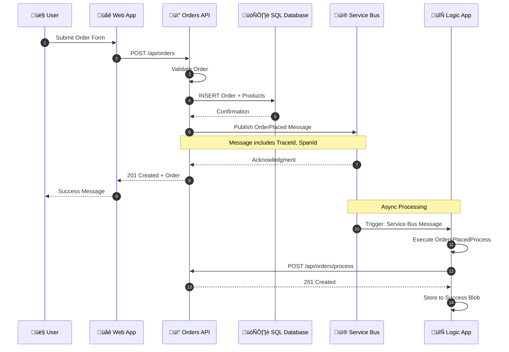
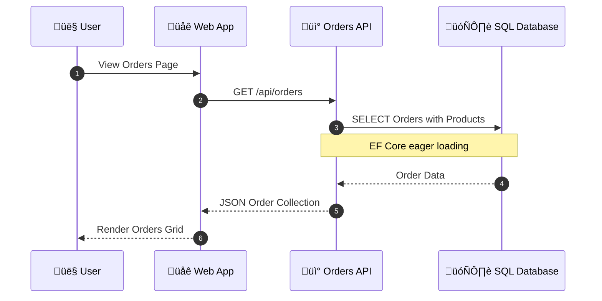

# Data Architecture

← [Business Architecture](01-business-architecture.md) | **Data Layer** | [Application Architecture →](03-application-architecture.md)

---

## Data Architecture Overview

The solution implements a **service-oriented data architecture** where each service owns its data stores. This ensures loose coupling, independent deployability, and clear data ownership boundaries.

### Data Stores Inventory

| Store                    | Technology                 | Owner Service              | Purpose                       |
| ------------------------ | -------------------------- | -------------------------- | ----------------------------- |
| **OrderDb**              | Azure SQL Database         | eShop.Orders.API           | Order and product persistence |
| **ordersplaced**         | Service Bus Topic          | eShop.Orders.API           | Order event propagation       |
| **orderprocessingsub**   | Service Bus Subscription   | Logic Apps                 | Order event consumption       |
| **Workflow State**       | Azure Storage (File Share) | OrdersManagement Logic App | Workflow execution state      |
| **Application Insights** | Application Insights       | All Services               | Telemetry storage             |
| **Log Analytics**        | Log Analytics Workspace    | Platform                   | Centralized log aggregation   |

---

## Data Architecture Principles

| Principle                     | Statement                                       | Rationale                                        | Implications                                               |
| ----------------------------- | ----------------------------------------------- | ------------------------------------------------ | ---------------------------------------------------------- |
| **Data Ownership**            | Each service owns its data store exclusively    | Loose coupling, independent deployability        | No shared databases, API-mediated access only              |
| **Event Sourcing**            | State changes propagated via immutable events   | Audit trail, temporal queries, replay capability | Service Bus for all cross-service communication            |
| **Data at Rest Encryption**   | All persistent data encrypted                   | Compliance, security posture                     | Azure SQL TDE, Storage Service Encryption enabled          |
| **Schema Evolution**          | All schemas support backward-compatible changes | Zero-downtime deployments                        | Additive changes only, versioned APIs for breaking changes |
| **Trace Context Propagation** | All messages include W3C Trace Context          | End-to-end correlation                           | TraceId, SpanId in Service Bus ApplicationProperties       |

---

## Data Landscape Map

```mermaid
flowchart LR
    subgraph BusinessDomains["📊 Business Data Domains"]
        Orders["📦 Orders Domain"]
        Events["📨 Order Events Domain"]
    end

    subgraph TransactionalStores["🗄️ Transactional Stores"]
        OrderDb[("OrderDb<br/>Azure SQL")]
    end

    subgraph MessagingStores["📨 Messaging Stores"]
        Topic["ordersplaced<br/>Service Bus Topic"]
        Sub["orderprocessingsub<br/>Subscription"]
    end

    subgraph WorkflowStores["📁 Workflow Stores"]
        BlobSuccess["Success Blobs<br/>/ordersprocessedsuccessfully"]
        BlobError["Error Blobs<br/>/ordersprocessedwitherrors"]
    end

    subgraph TelemetryStores["📊 Telemetry Stores"]
        AppInsights["Application Insights"]
        LogAnalytics["Log Analytics"]
    end

    Orders --> OrderDb
    Orders --> Topic
    Events --> Topic
    Topic --> Sub
    Sub --> BlobSuccess
    Sub --> BlobError
    OrderDb -.->|"telemetry"| AppInsights
    Topic -.->|"diagnostics"| LogAnalytics

    classDef domain fill:#e3f2fd,stroke:#1565c0,stroke-width:2px
    classDef transactional fill:#e8f5e9,stroke:#2e7d32,stroke-width:2px
    classDef messaging fill:#fff3e0,stroke:#ef6c00,stroke-width:2px
    classDef workflow fill:#f3e5f5,stroke:#7b1fa2,stroke-width:2px
    classDef telemetry fill:#fce4ec,stroke:#c2185b,stroke-width:2px

    class Orders,Events domain
    class OrderDb transactional
    class Topic,Sub messaging
    class BlobSuccess,BlobError workflow
    class AppInsights,LogAnalytics telemetry
```



---

## Data Domain Catalog

| Data Domain               | Description                      | Bounded Context | Primary Store | Owner Service | Steward               |
| ------------------------- | -------------------------------- | --------------- | ------------- | ------------- | --------------------- |
| **Order Management**      | Customer orders and line items   | eShop.Orders    | Azure SQL     | Orders API    | Order Management Team |
| **Order Events**          | Immutable order lifecycle events | Messaging       | Service Bus   | Platform      | Platform Team         |
| **Workflow State**        | Logic App execution artifacts    | Automation      | Azure Storage | Logic Apps    | Workflow Team         |
| **Operational Telemetry** | Traces, metrics, logs            | Observability   | App Insights  | All Services  | SRE Team              |

---

## Data Store Details

| Store                  | Technology                 | Purpose                       | Owner Service                | Location                    | Tier/SKU        |
| ---------------------- | -------------------------- | ----------------------------- | ---------------------------- | --------------------------- | --------------- |
| **OrderDb**            | Azure SQL Database         | Order and product persistence | eShop.Orders.API             | Azure / Local SQL Container | General Purpose |
| **ordersplaced**       | Service Bus Topic          | Order event propagation       | eShop.Orders.API (publisher) | Azure / Local Emulator      | Standard        |
| **orderprocessingsub** | Service Bus Subscription   | Order event consumption       | Logic Apps (subscriber)      | Azure / Local Emulator      | Standard        |
| **Workflow State**     | Azure Storage (File Share) | Logic App workflow state      | OrdersManagement Logic App   | Azure Storage Account       | Standard LRS    |
| **Success Blobs**      | Azure Blob Storage         | Processed order artifacts     | Logic Apps                   | Azure Storage Account       | Standard LRS    |
| **Error Blobs**        | Azure Blob Storage         | Failed order artifacts        | Logic Apps                   | Azure Storage Account       | Standard LRS    |

---

## Data Flow Architecture

### Write Path (Order Placement)



### Read Path (Order Retrieval)



---

## Monitoring Data Flow Architecture

```mermaid
flowchart LR
    subgraph Sources["📡 Layer 1: Telemetry Sources"]
        API["⚙️ Orders API"]
        Web["🌐 Web App"]
        LA["🔄 Logic Apps"]
        SB["📨 Service Bus"]
        SQL["🗄️ SQL Database"]
    end

    subgraph Instrumentation["🔧 Layer 2: Instrumentation"]
        OTEL["OpenTelemetry SDK<br/><i>Traces, Metrics, Logs</i>"]
        AzDiag["Azure Diagnostics<br/><i>Platform telemetry</i>"]
    end

    subgraph Collection["📥 Layer 3: Collection"]
        AI["Application Insights<br/><i>APM & Traces</i>"]
        LAW["Log Analytics<br/><i>Logs & Diagnostics</i>"]
    end

    subgraph Visualization["📈 Layer 4: Visualization"]
        AppMap["Application Map"]
        TxSearch["Transaction Search"]
        Dashboards["Azure Dashboards"]
        Alerts["Alert Rules"]
    end

    API & Web -->|"OTLP/HTTP"| OTEL
    LA & SB & SQL -->|"ARM Diagnostics"| AzDiag
    OTEL -->|"Export"| AI
    AzDiag -->|"Export"| LAW
    AI --> LAW
    AI --> AppMap & TxSearch
    LAW --> Dashboards & Alerts

    classDef source fill:#fff3e0,stroke:#ef6c00,stroke-width:2px
    classDef instrument fill:#e3f2fd,stroke:#1565c0,stroke-width:2px
    classDef collect fill:#e8f5e9,stroke:#2e7d32,stroke-width:2px
    classDef visual fill:#f3e5f5,stroke:#7b1fa2,stroke-width:2px

    class API,Web,LA,SB,SQL source
    class OTEL,AzDiag instrument
    class AI,LAW collect
    class AppMap,TxSearch,Dashboards,Alerts visual
```



---

## Telemetry Data Mapping

### Three Pillars of Observability

| Pillar      | Description                                 | Data Type                                | Use Case                              | Storage               |
| ----------- | ------------------------------------------- | ---------------------------------------- | ------------------------------------- | --------------------- |
| **Traces**  | Distributed request flow across services    | Spans with TraceId, SpanId, ParentSpanId | End-to-end transaction analysis       | Application Insights  |
| **Metrics** | Numeric measurements aggregated over time   | Counters, Gauges, Histograms             | Dashboards, alerts, capacity planning | Azure Monitor Metrics |
| **Logs**    | Discrete events with contextual information | Structured JSON with properties          | Debugging, auditing, investigation    | Log Analytics         |

### Metrics Inventory by Source

#### Orders API Metrics

| Metric                             | Type      | Unit    | Dimensions            | Alert Threshold |
| ---------------------------------- | --------- | ------- | --------------------- | --------------- |
| `http.server.request.duration`     | Histogram | seconds | method, route, status | P95 > 2s        |
| `eShop.orders.placed`              | Counter   | count   | order.status          | N/A             |
| `eShop.orders.processing.duration` | Histogram | ms      | order.status          | P95 > 5s        |
| `eShop.orders.processing.errors`   | Counter   | error   | error.type            | > 10/min        |
| `eShop.orders.deleted`             | Counter   | count   | -                     | N/A             |

#### Platform Metrics (Azure Monitor)

| Source           | Metric                    | Type    | Purpose                 |
| ---------------- | ------------------------- | ------- | ----------------------- |
| **Service Bus**  | `ActiveMessages`          | Gauge   | Queue depth monitoring  |
| **Service Bus**  | `DeadLetteredMessages`    | Gauge   | Failed message tracking |
| **SQL Database** | `cpu_percent`             | Gauge   | Database load           |
| **SQL Database** | `dtu_consumption_percent` | Gauge   | DTU utilization         |
| **Logic Apps**   | `RunsSucceeded`           | Counter | Workflow success rate   |
| **Logic Apps**   | `RunsFailed`              | Counter | Workflow failure rate   |

### Logs Inventory by Source

| Log Type         | Source       | Level       | Format            | Retention |
| ---------------- | ------------ | ----------- | ----------------- | --------- |
| Request Logs     | Orders API   | Information | Structured JSON   | 90 days   |
| Error Logs       | All Services | Error       | Structured JSON   | 90 days   |
| Workflow Runs    | Logic Apps   | Information | Azure Diagnostics | 30 days   |
| Database Logs    | SQL Database | Warning+    | Azure Diagnostics | 30 days   |
| Service Bus Logs | Service Bus  | Warning+    | Azure Diagnostics | 30 days   |

### Structured Logging Format

```json
{
  "Timestamp": "2026-01-20T10:30:00.000Z",
  "Level": "Information",
  "MessageTemplate": "Order {OrderId} placed successfully",
  "Properties": {
    "OrderId": "ORD-2026-001",
    "CustomerId": "CUST-100",
    "Total": 149.99,
    "TraceId": "abc123def456...",
    "SpanId": "789ghi012...",
    "RequestPath": "/api/orders",
    "SourceContext": "eShop.Orders.API.Services.OrderService"
  }
}
```

---

## Trace Context Propagation

The solution implements **W3C Trace Context** for cross-service correlation:


### Implementation in OrdersMessageHandler

```csharp
// From src/eShop.Orders.API/Handlers/OrdersMessageHandler.cs
message.ApplicationProperties["TraceId"] = activity.TraceId.ToString();
message.ApplicationProperties["SpanId"] = activity.SpanId.ToString();
message.ApplicationProperties["traceparent"] = activity.Id ?? string.Empty;
```

---

## Data Dependencies Map

```mermaid
flowchart TD
    subgraph Upstream["⬆️ Upstream (Data Producers)"]
        WebApp["🌐 Web App<br/>(Order Input)"]
    end

    subgraph Core["🎯 Core Data Assets"]
        OrderDb[("🗄️ OrderDb<br/>Azure SQL")]
        EventBus["📨 Service Bus<br/>ordersplaced"]
    end

    subgraph Downstream["⬇️ Downstream (Data Consumers)"]
        LogicApp["🔄 Logic Apps<br/>(Workflow Automation)"]
        AppInsights["📊 App Insights<br/>(Analytics & Monitoring)"]
    end

    WebApp -->|"Creates orders"| OrderDb
    OrderDb -->|"Publishes events"| EventBus
    EventBus -->|"Triggers workflows"| LogicApp
    OrderDb -.->|"Emits telemetry"| AppInsights
    LogicApp -.->|"Emits telemetry"| AppInsights

    classDef upstream fill:#fff3e0,stroke:#ef6c00,stroke-width:2px
    classDef core fill:#e3f2fd,stroke:#1565c0,stroke-width:2px
    classDef downstream fill:#e8f5e9,stroke:#2e7d32,stroke-width:2px

    class WebApp upstream
    class OrderDb,EventBus core
    class LogicApp,AppInsights downstream
```



---

## Data Lifecycle States

| Stage           | Description                 | Location          | Duration     | Transition Trigger    |
| --------------- | --------------------------- | ----------------- | ------------ | --------------------- |
| **Creation**    | Order submitted via API     | Orders API memory | Milliseconds | Validation passes     |
| **Persistence** | Order saved to database     | Azure SQL         | Indefinite   | Transaction commit    |
| **Publication** | Order event published       | Service Bus topic | 14 days TTL  | Post-commit hook      |
| **Consumption** | Event processed by workflow | Logic App         | Minutes      | Subscription delivery |
| **Telemetry**   | Operational data captured   | App Insights      | 90 days      | Continuous            |

---

## Cross-Architecture Relationships

| Related Architecture           | Connection                                             | Reference                                                                  |
| ------------------------------ | ------------------------------------------------------ | -------------------------------------------------------------------------- |
| **Business Architecture**      | Orders data supports Order Management capability       | [Business Capabilities](01-business-architecture.md#business-capabilities) |
| **Application Architecture**   | Orders API service manages Order data entities         | [Application Architecture](03-application-architecture.md)                 |
| **Technology Architecture**    | Azure SQL hosts OrderDb; Service Bus transports events | [Technology Architecture](04-technology-architecture.md)                   |
| **Observability Architecture** | Telemetry data flows to App Insights for monitoring    | [Observability Architecture](05-observability-architecture.md)             |

---

_← [Business Architecture](01-business-architecture.md) | [Application Architecture →](03-application-architecture.md)_
