# Data Architecture

← [Business Architecture](01-business-architecture.md) | [Index](README.md) | [Application Architecture](03-application-architecture.md) →

## 1. Data Architecture Overview

The solution implements a **service-oriented data architecture** where each service owns its data store exclusively. Data sharing occurs via events (Service Bus) and APIs, ensuring loose coupling and independent deployability. Operational telemetry (traces, metrics, logs) flows to centralized observability backends.

**Key Data Stores:**

- **OrderDb** (Azure SQL): Transactional order and product data
- **Service Bus Topic** (ordersplaced): Order event distribution
- **Azure Storage**: Logic App workflow state
- **Application Insights**: Distributed traces, metrics, custom events
- **Log Analytics**: Centralized structured logs

---

## 2. Data Architecture Principles

| Principle                     | Statement                                       | Rationale                                        | Implications                                               |
| ----------------------------- | ----------------------------------------------- | ------------------------------------------------ | ---------------------------------------------------------- |
| **Data Ownership**            | Each service owns its data store exclusively    | Loose coupling, independent deployability        | No shared databases; API-mediated access only              |
| **Event Sourcing**            | State changes propagated via immutable events   | Audit trail, temporal queries, replay capability | Service Bus for all cross-service communication            |
| **Data at Rest Encryption**   | All persistent data encrypted                   | Compliance, security posture                     | Azure SQL TDE, Storage Service Encryption enabled          |
| **Schema Evolution**          | All schemas support backward-compatible changes | Zero-downtime deployments                        | Additive changes only; versioned APIs for breaking changes |
| **Data Minimization**         | Collect and retain only necessary data          | Privacy compliance, storage efficiency           | Regular review of data retention policies                  |
| **Trace Context Propagation** | W3C Trace Context in all data flows             | End-to-end request correlation                   | TraceId/SpanId in all messages and logs                    |

---

## 3. Data Landscape Map

```mermaid
flowchart LR
    subgraph BusinessDomains["📊 Business Data Domains"]
        direction TB
        Orders["📦 Orders Domain<br/><i>Order entities</i>"]
        Events["📨 Order Events Domain<br/><i>Domain events</i>"]
        Telemetry["📊 Telemetry Domain<br/><i>Observability data</i>"]
    end

    subgraph DataStores["🗄️ Data Stores"]
        direction TB
        OrderDb[("OrderDb<br/>Azure SQL<br/>ACID transactions")]
        EventStore["ordersplaced<br/>Service Bus Topic<br/><i>14-day TTL</i>"]
        WorkflowState["Workflow State<br/>Azure Storage<br/><i>File shares</i>")]
        AppInsights["App Insights<br/><i>90-day retention</i>"]
        LogAnalytics["Log Analytics<br/><i>30-day retention</i>"]
    end

    subgraph Consumers["👥 Data Consumers"]
        direction TB
        API["Orders API<br/><i>CRUD operations</i>"]
        LogicApp["Logic Apps<br/><i>Event processing</i>"]
        WebApp["Web App<br/><i>Display layer</i>"]
        Dashboards["Dashboards<br/><i>Operations</i>"]
    end

    Orders --> OrderDb
    Orders --> EventStore
    Events --> EventStore
    OrderDb --> API
    EventStore --> LogicApp
    API --> WebApp
    LogicApp --> WorkflowState

    Telemetry --> AppInsights
    Telemetry --> LogAnalytics
    AppInsights --> Dashboards
    LogAnalytics --> Dashboards

    classDef domain fill:#e3f2fd,stroke:#1565c0,stroke-width:2px
    classDef store fill:#fff3e0,stroke:#ef6c00,stroke-width:2px
    classDef consumer fill:#e8f5e9,stroke:#2e7d32,stroke-width:2px

    class Orders,Events,Telemetry domain
    class OrderDb,EventStore,WorkflowState,AppInsights,LogAnalytics store
    class API,LogicApp,WebApp,Dashboards consumer
```

---

## 4. Data Domain Catalog

| Data Domain               | Description                           | Bounded Context | Primary Store                    | Owner Service      | Steward               |
| ------------------------- | ------------------------------------- | --------------- | -------------------------------- | ------------------ | --------------------- |
| **Order Management**      | Customer orders and line items        | eShop.Orders    | Azure SQL (OrderDb)              | Orders API         | Order Management Team |
| **Order Events**          | Immutable order lifecycle events      | Messaging       | Service Bus Topic (ordersplaced) | Platform           | Platform Team         |
| **Operational Telemetry** | Logs, traces, metrics                 | Observability   | App Insights, Log Analytics      | All Services       | SRE Team              |
| **Workflow State**        | Logic App execution state and history | Automation      | Azure Storage (File Share)       | Logic Apps Runtime | Workflow Team         |

---

## 5. Data Store Inventory

| Store                    | Technology                 | Purpose                               | Owner Service                | Location                    | Tier/SKU        | Retention   |
| ------------------------ | -------------------------- | ------------------------------------- | ---------------------------- | --------------------------- | --------------- | ----------- |
| **OrderDb**              | Azure SQL Database         | Order and product persistence         | eShop.Orders.API             | Azure / Local SQL Container | General Purpose | Indefinite  |
| **ordersplaced**         | Service Bus Topic          | Order event propagation               | eShop.Orders.API (publisher) | Azure / Local Emulator      | Standard        | 14 days TTL |
| **orderprocessingsub**   | Service Bus Subscription   | Order event consumption               | Logic Apps (subscriber)      | Azure / Local Emulator      | Standard        | 14 days TTL |
| **Workflow State**       | Azure Storage (File Share) | Logic App workflow state              | OrdersManagement Logic App   | Azure Storage Account       | Standard LRS    | 90 days     |
| **Application Insights** | Azure Monitor              | Traces, metrics, custom events        | All Services                 | Azure / Local Dev           | Standard        | 90 days     |
| **Log Analytics**        | Azure Monitor Logs         | Structured logs, platform diagnostics | All Services                 | Azure                       | Standard        | 30 days     |

---

## 6. Data Flow Architecture

### Write Path: Order Creation


### Read Path: Order Retrieval


---

## 7. Monitoring Data Flow Architecture

```mermaid
flowchart LR
    subgraph Sources["📡 Layer 1: Telemetry Sources"]
        direction TB
        S1["Orders API<br/><i>ASP.NET Core</i>"]
        S2["Web App<br/><i>Blazor Server</i>"]
        S3["Logic Apps<br/><i>Workflows</i>"]
        S4["Service Bus<br/><i>Messaging</i>"]
        S5["SQL Database<br/><i>Data Store</i>"]
    end

    subgraph Instrumentation["🔧 Layer 2: Instrumentation"]
        direction TB
        I1["OpenTelemetry SDK<br/><i>.NET</i>"]
        I2["Azure Diagnostics<br/><i>Built-in</i>"]
        I3["Platform Metrics<br/><i>ARM</i>"]
    end

    subgraph Collection["📥 Layer 3: Collection & Storage"]
        direction TB
        C1["Application Insights<br/><i>Traces + Metrics + Logs</i>"]
        C2["Log Analytics<br/><i>Centralized Logs</i>"]
    end

    subgraph Visualization["📈 Layer 4: Visualization & Alerting"]
        direction TB
        V1["Application Map<br/><i>Dependency View</i>"]
        V2["Transaction Search<br/><i>Trace Analysis</i>"]
        V3["KQL Queries<br/><i>Ad-hoc Investigation</i>"]
        V4["Alert Rules<br/><i>Proactive Detection</i>"]
        V5["Azure Dashboards<br/><i>Operations View</i>"]
    end

    S1 & S2 -->|"OTLP/HTTP"| I1
    S3 & S4 & S5 -->|"Resource Logs"| I2
    S4 & S5 -->|"Platform Metrics"| I3

    I1 -->|"Export"| C1
    I2 -->|"Diagnostic Settings"| C1 & C2
    I3 -->|"Azure Monitor"| C1

    C1 --> V1 & V2 & V3 & V4 & V5
    C2 --> V3 & V5

    classDef source fill:#fff3e0,stroke:#ef6c00,stroke-width:2px
    classDef instrument fill:#e3f2fd,stroke:#1565c0,stroke-width:2px
    classDef collect fill:#e8f5e9,stroke:#2e7d32,stroke-width:2px
    classDef visual fill:#f3e5f5,stroke:#7b1fa2,stroke-width:2px

    class S1,S2,S3,S4,S5 source
    class I1,I2,I3 instrument
    class C1,C2 collect
    class V1,V2,V3,V4,V5 visual
```



---

## 8. Telemetry Data Mapping

### Three Pillars Overview

| Pillar      | Description                                 | Data Type                                | Use Case                              | Storage               |
| ----------- | ------------------------------------------- | ---------------------------------------- | ------------------------------------- | --------------------- |
| **Traces**  | Distributed request flow across services    | Spans with TraceId, SpanId, ParentSpanId | End-to-end transaction analysis       | Application Insights  |
| **Metrics** | Numeric measurements aggregated over time   | Counters, Gauges, Histograms             | Dashboards, alerts, capacity planning | Azure Monitor Metrics |
| **Logs**    | Discrete events with contextual information | Structured JSON with properties          | Debugging, auditing, investigation    | Log Analytics         |

### Metrics Inventory

#### Orders API Metrics

| Metric Name                    | Type          | Description            | Dimensions                                | Alert Threshold |
| ------------------------------ | ------------- | ---------------------- | ----------------------------------------- | --------------- |
| `http.server.request.duration` | Histogram     | Request latency        | http.method, http.route, http.status_code | P95 > 2s        |
| `http.server.active_requests`  | UpDownCounter | Concurrent requests    | http.method                               | > 100           |
| `eShop.orders.placed`          | Counter       | Orders created count   | -                                         | N/A             |
| `eShop.orders.total_value`     | Counter       | Cumulative order value | currency                                  | N/A             |
| `db.client.operation.duration` | Histogram     | Database query time    | db.operation, db.name                     | P95 > 500ms     |

#### Service Bus Metrics (Platform)

| Metric                 | Type    | Description                | Source        |
| ---------------------- | ------- | -------------------------- | ------------- |
| `ActiveMessages`       | Gauge   | Messages awaiting delivery | Azure Monitor |
| `DeadLetteredMessages` | Gauge   | Failed message count       | Azure Monitor |
| `IncomingMessages`     | Counter | Messages received          | Azure Monitor |
| `OutgoingMessages`     | Counter | Messages delivered         | Azure Monitor |

#### SQL Database Metrics (Platform)

| Metric                    | Type    | Description            | Source        |
| ------------------------- | ------- | ---------------------- | ------------- |
| `cpu_percent`             | Gauge   | CPU utilization        | Azure Monitor |
| `dtu_consumption_percent` | Gauge   | DTU usage              | Azure Monitor |
| `connection_successful`   | Counter | Successful connections | Azure Monitor |
| `deadlock`                | Counter | Deadlock occurrences   | Azure Monitor |

#### Logic Apps Metrics (Platform)

| Metric          | Type    | Description              | Source        |
| --------------- | ------- | ------------------------ | ------------- |
| `RunsSucceeded` | Counter | Successful workflow runs | Azure Monitor |
| `RunsFailed`    | Counter | Failed workflow runs     | Azure Monitor |
| `RunLatency`    | Gauge   | Workflow execution time  | Azure Monitor |
| `ActionLatency` | Gauge   | Individual action time   | Azure Monitor |

### Logs Inventory

#### Orders API Logs

| Log Event                    | Level       | Properties                                  | Example                                               |
| ---------------------------- | ----------- | ------------------------------------------- | ----------------------------------------------------- |
| `OrderCreated`               | Information | OrderId, CustomerId, Total, TraceId, SpanId | "Order ORD-2025-001 created with total $149.99"       |
| `OrderValidationFailed`      | Warning     | OrderId, Errors[], TraceId, SpanId          | "Validation failed: Address required"                 |
| `DatabaseQueryExecuted`      | Debug       | Query, Duration, RowCount, TraceId          | "SELECT executed in 45ms, returned 10 rows"           |
| `ServiceBusMessagePublished` | Information | MessageId, Topic, TraceId, SpanId           | "OrderPlaced message published to ordersplaced topic" |
| `UnhandledException`         | Error       | Exception, StackTrace, TraceId, SpanId      | Full exception details with trace context             |

#### Web App Logs

| Log Event       | Level       | Properties                    | Example                            |
| --------------- | ----------- | ----------------------------- | ---------------------------------- |
| `PageLoaded`    | Information | PageName, LoadTime, TraceId   | "Orders page loaded in 1.2s"       |
| `ApiCallFailed` | Warning     | Endpoint, StatusCode, TraceId | "GET /api/orders returned 500"     |
| `UserAction`    | Information | Action, Component, TraceId    | "User clicked Submit Order button" |

#### Logic Apps Logs (Diagnostic)

| Log Event              | Level       | Table            | Properties                                    |
| ---------------------- | ----------- | ---------------- | --------------------------------------------- |
| `WorkflowRunStarted`   | Information | AzureDiagnostics | workflowName, runId, correlationId            |
| `WorkflowRunCompleted` | Information | AzureDiagnostics | runId, status, duration, correlationId        |
| `WorkflowRunFailed`    | Error       | AzureDiagnostics | runId, errorCode, errorMessage, correlationId |

### Structured Logging Format

```json
{
  "Timestamp": "2025-12-30T10:30:00.000Z",
  "Level": "Information",
  "MessageTemplate": "Order {OrderId} created with total {Total}",
  "Properties": {
    "OrderId": "ORD-2025-001",
    "Total": 149.99,
    "CustomerId": "CUST-100",
    "TraceId": "abc123...",
    "SpanId": "def456...",
    "RequestPath": "/api/orders",
    "SourceContext": "eShop.Orders.API.Controllers.OrdersController"
  },
  "Exception": null
}
```

---

## 9. Trace Context Propagation

The solution implements **W3C Trace Context** for cross-service data correlation:

| Component                | Propagation Method       | Properties                           |
| ------------------------ | ------------------------ | ------------------------------------ |
| **HTTP Requests**        | Headers                  | `traceparent`, `tracestate`          |
| **Service Bus Messages** | Application Properties   | `TraceId`, `SpanId`, `traceparent`   |
| **Logic Apps**           | Built-in correlation     | Azure-managed `x-ms-workflow-run-id` |
| **Application Insights** | SDK auto-instrumentation | `Operation_Id` correlation           |

### Implementation Example

```csharp
// From OrdersMessageHandler.cs
var message = new ServiceBusMessage(messageBody);
if (activity != null)
{
    message.ApplicationProperties["TraceId"] = activity.TraceId.ToString();
    message.ApplicationProperties["SpanId"] = activity.SpanId.ToString();
    message.ApplicationProperties["traceparent"] = activity.Id ?? string.Empty;
}
```

This ensures Logic Apps workflows correlate with originating API requests in Application Insights.

---

## 10. Data Flow Matrix

| Source       | Target       | Data Type         | Protocol    | Pattern               | Frequency   | Volume           |
| ------------ | ------------ | ----------------- | ----------- | --------------------- | ----------- | ---------------- |
| Web App      | Orders API   | Order JSON        | HTTPS/REST  | Sync Request/Response | On-demand   | ~100/hour        |
| Orders API   | SQL Database | Order Entity      | TDS/EF Core | CRUD                  | Per request | ~100/hour        |
| Orders API   | Service Bus  | OrderPlaced Event | AMQP        | Async Pub/Sub         | Per order   | ~100/hour        |
| Service Bus  | Logic Apps   | OrderPlaced Event | Connector   | Event-driven          | Per event   | ~100/hour        |
| All Services | App Insights | Telemetry         | HTTPS/OTLP  | Continuous Push       | Batched     | ~10K events/hour |

---

## Cross-Architecture Relationships

| Related Architecture           | Connection                                             | Reference                                                                          |
| ------------------------------ | ------------------------------------------------------ | ---------------------------------------------------------------------------------- |
| **Business Architecture**      | Orders data supports Order Management capability       | [Business Architecture](01-business-architecture.md#business-capabilities)         |
| **Application Architecture**   | Orders API service manages Order data entities         | [Application Architecture](03-application-architecture.md#eshop-orders-api)        |
| **Technology Architecture**    | Azure SQL hosts OrderDb; Service Bus transports events | [Technology Architecture](04-technology-architecture.md#data-platform)             |
| **Observability Architecture** | Telemetry data flows to App Insights for monitoring    | [Observability Architecture](05-observability-architecture.md#distributed-tracing) |
| **Security Architecture**      | Data classification drives access control policies     | [Security Architecture](06-security-architecture.md#data-protection)               |

---

← [Business Architecture](01-business-architecture.md) | [Index](README.md) | [Application Architecture](03-application-architecture.md) →
