# Data Architecture

[← Business Architecture](01-business-architecture.md) | [Index](README.md) | [Next →](03-application-architecture.md)

## Data Architecture Overview

The solution implements a **service-oriented data architecture** where each service owns its data store exclusively. This ensures loose coupling, independent deployability, and clear data ownership boundaries.

### Data Stores Inventory

| Store | Technology | Purpose | Owner Service | Tier |
|-------|------------|---------|---------------|------|
| **OrderDb** | Azure SQL Database | Order and product persistence | eShop.Orders.API | General Purpose |
| **ordersplaced** | Service Bus Topic | Order event propagation | eShop.Orders.API (publisher) | Standard |
| **orderprocessingsub** | Service Bus Subscription | Order event consumption | Logic Apps (subscriber) | Standard |
| **workflowstate** | Azure File Share | Logic App workflow state | OrdersManagement | Standard LRS |
| **ordersprocessedsuccessfully** | Blob Container | Successful order processing output | Logic Apps | Standard LRS |
| **ordersprocessedwitherrors** | Blob Container | Failed order processing output | Logic Apps | Standard LRS |
| **Application Insights** | APM Platform | Telemetry storage | All Services | Standard |
| **Log Analytics** | Log Aggregation | Centralized logs and metrics | All Resources | PerGB2018 |

---

## Data Architecture Principles

| Principle | Statement | Rationale | Implications |
|-----------|-----------|-----------|--------------|
| **Data Ownership** | Each service owns its data store exclusively | Loose coupling, independent deployability | No shared databases, API-mediated access only |
| **Event Sourcing** | State changes propagated via immutable events | Audit trail, temporal queries, replay capability | Service Bus for all cross-service communication |
| **Data at Rest Encryption** | All persistent data encrypted | Compliance, security posture | Azure SQL TDE, Storage Service Encryption |
| **Schema Evolution** | All schemas support backward-compatible changes | Zero-downtime deployments | Additive changes only, EF Core migrations |
| **Correlation by Default** | All telemetry includes trace context | End-to-end observability | TraceId/SpanId in all log entries |

---

## Data Landscape Map

```mermaid
flowchart LR
    subgraph BusinessDomains["📊 Business Data Domains"]
        Orders["📦 Orders Domain<br/><i>Order, OrderProduct</i>"]
        Events["📨 Order Events Domain<br/><i>OrderPlaced messages</i>"]
    end

    subgraph DataStores["🗄️ Data Stores"]
        OrderDb[("OrderDb<br/>Azure SQL")]
        EventStore["ordersplaced<br/>Service Bus Topic"]
        WorkflowState["workflowstate<br/>Azure Files"]
        SuccessBlob["ordersprocessedsuccessfully<br/>Blob Container"]
        ErrorBlob["ordersprocessedwitherrors<br/>Blob Container"]
    end

    subgraph Consumers["👥 Data Consumers"]
        API["eShop.Orders.API"]
        WebApp["eShop.Web.App"]
        LogicApp["OrdersManagement<br/>Logic Apps"]
        Analytics["Application Insights"]
    end

    Orders --> OrderDb
    Orders --> EventStore
    Events --> EventStore

    OrderDb --> API
    API --> WebApp
    EventStore --> LogicApp
    LogicApp --> WorkflowState
    LogicApp --> SuccessBlob
    LogicApp --> ErrorBlob

    API -.->|"Telemetry"| Analytics
    WebApp -.->|"Telemetry"| Analytics
    LogicApp -.->|"Diagnostics"| Analytics

    classDef domain fill:#e3f2fd,stroke:#1565c0,stroke-width:2px
    classDef store fill:#fff3e0,stroke:#ef6c00,stroke-width:2px
    classDef consumer fill:#e8f5e9,stroke:#2e7d32,stroke-width:2px

    class Orders,Events domain
    class OrderDb,EventStore,WorkflowState,SuccessBlob,ErrorBlob store
    class API,WebApp,LogicApp,Analytics consumer
```



---

## Data Domain Catalog

| Data Domain | Description | Bounded Context | Primary Store | Owner Service | Steward |
|-------------|-------------|-----------------|---------------|---------------|---------|
| **Order Management** | Customer orders with line items and delivery information | eShop.Orders | Azure SQL Database | Orders API | Platform Team |
| **Order Events** | Immutable order lifecycle events for async processing | Messaging | Service Bus Topic | Orders API | Platform Team |
| **Workflow State** | Logic App execution state and checkpoints | Automation | Azure File Share | Logic Apps | Platform Team |
| **Processing Output** | Results of workflow processing (success/error) | Automation | Blob Containers | Logic Apps | Platform Team |
| **Operational Telemetry** | Logs, traces, metrics for observability | Observability | App Insights / Log Analytics | All Services | SRE Team |

---

## Data Store Details

| Store | Technology | Purpose | Owner | Consumers | Retention | Encryption |
|-------|------------|---------|-------|-----------|-----------|------------|
| **OrderDb** | Azure SQL Database | Transactional order storage | Orders API | Orders API, Analytics | Indefinite | TDE |
| **ordersplaced** | Service Bus Topic | Event propagation | Orders API | Logic Apps | 14 days TTL | Service-managed |
| **orderprocessingsub** | Service Bus Subscription | Event consumption | Logic Apps | Logic Apps | 14 days TTL | Service-managed |
| **workflowstate** | Azure Files (SMB) | Logic App runtime state | Logic Apps | Logic Apps | Active | SSE |
| **Blob Containers** | Azure Blob Storage | Processing output | Logic Apps | Analytics, Audit | Policy-based | SSE |
| **App Insights** | APM Platform | Telemetry | All | Developers, SRE | 90 days | Service-managed |
| **Log Analytics** | Log Aggregation | Centralized logs | All | Operations | 30 days | Service-managed |

---

## Data Flow Architecture

### Write Path - Order Placement

```mermaid
sequenceDiagram
    autonumber
    participant User as 👤 User
    participant Web as 🌐 Web App
    participant API as 📡 Orders API
    participant DB as 🗄️ SQL Database
    participant SB as 📨 Service Bus
    participant LA as 🔄 Logic App
    participant Blob as 📁 Blob Storage

    User->>Web: Submit Order Form
    Web->>API: POST /api/orders
    API->>API: Validate Order Data
    API->>DB: Check Existing Order
    DB-->>API: Not Found
    API->>DB: INSERT Order + Products
    DB-->>API: Commit Success
    API->>SB: Publish OrderPlaced Message
    Note over API,SB: W3C Trace Context propagated
    SB-->>API: Acknowledgment
    API-->>Web: 201 Created + Order
    Web-->>User: Success Confirmation
    
    Note over SB,LA: Async Processing
    SB->>LA: Trigger via Subscription
    LA->>API: POST /api/orders/process
    API-->>LA: 201 Created
    alt Success
        LA->>Blob: Store in ordersprocessedsuccessfully
    else Error
        LA->>Blob: Store in ordersprocessedwitherrors
    end
```



### Read Path - Order Retrieval

```mermaid
sequenceDiagram
    autonumber
    participant User as 👤 User
    participant Web as 🌐 Web App
    participant API as 📡 Orders API
    participant DB as 🗄️ SQL Database

    User->>Web: View Orders Page
    Web->>API: GET /api/orders
    API->>DB: SELECT Orders with Products
    DB-->>API: Order Collection
    API-->>Web: JSON Order Array
    Web-->>User: Render Orders Grid
```



---

## Data Flow Matrix

| Source | Target | Data Type | Protocol | Pattern | Frequency | Volume |
|--------|--------|-----------|----------|---------|-----------|--------|
| Web App | Orders API | Order JSON | HTTPS/REST | Sync Request/Response | On-demand | Variable |
| Orders API | SQL Database | Order Entity | TDS/EF Core | CRUD | Per request | ~100/hour |
| Orders API | Service Bus | OrderPlaced Event | AMQP | Async Pub/Sub | Per order | ~100/hour |
| Service Bus | Logic Apps | OrderPlaced Event | Managed Connector | Event-driven Trigger | Per event | ~100/hour |
| Logic Apps | Orders API | Process Request | HTTPS/REST | Callback | Per workflow | ~100/hour |
| Logic Apps | Blob Storage | Processing Result | HTTPS/REST | Write | Per workflow | ~100/hour |
| All Services | App Insights | Telemetry | HTTPS/OTLP | Continuous Push | Batched | ~10K/hour |

---

## Monitoring Data Flow Architecture

```mermaid
flowchart LR
    subgraph Sources["📡 Layer 1: Telemetry Sources"]
        direction TB
        WebApp["🌐 Web App"]
        API["📡 Orders API"]
        LogicApp["🔄 Logic Apps"]
        SQL["🗄️ SQL Database"]
        SB["📨 Service Bus"]
    end

    subgraph Instrumentation["🔧 Layer 2: Instrumentation"]
        direction TB
        OTEL["OpenTelemetry SDK<br/><i>.NET Auto + Manual</i>"]
        AzureDiag["Azure Diagnostics<br/><i>Platform Metrics</i>"]
    end

    subgraph Collection["📥 Layer 3: Collection"]
        direction TB
        AI["Application Insights<br/><i>APM, Traces</i>"]
        LAW["Log Analytics<br/><i>Logs, Metrics</i>"]
    end

    subgraph Visualization["📈 Layer 4: Visualization"]
        direction TB
        AppMap["Application Map"]
        TxSearch["Transaction Search"]
        Dashboards["Azure Dashboards"]
        Alerts["Alert Rules"]
        KQL["KQL Queries"]
    end

    WebApp & API -->|"OTLP/HTTP"| OTEL
    LogicApp -->|"Built-in"| AzureDiag
    SQL & SB -->|"Platform"| AzureDiag

    OTEL -->|"Export"| AI
    AzureDiag -->|"Diagnostic Settings"| LAW
    AI -->|"Workspace Integration"| LAW

    AI --> AppMap & TxSearch
    LAW --> Dashboards & Alerts & KQL

    classDef source fill:#fff3e0,stroke:#ef6c00,stroke-width:2px
    classDef instrument fill:#e3f2fd,stroke:#1565c0,stroke-width:2px
    classDef collect fill:#e8f5e9,stroke:#2e7d32,stroke-width:2px
    classDef visual fill:#f3e5f5,stroke:#7b1fa2,stroke-width:2px

    class WebApp,API,LogicApp,SQL,SB source
    class OTEL,AzureDiag instrument
    class AI,LAW collect
    class AppMap,TxSearch,Dashboards,Alerts,KQL visual
```



---

## Telemetry Data Mapping

### Three Pillars of Observability

| Pillar | Description | Data Type | Use Case | Storage |
|--------|-------------|-----------|----------|---------|
| **Traces** | Distributed request flow across services | Spans with TraceId, SpanId, ParentSpanId | End-to-end transaction analysis | Application Insights |
| **Metrics** | Numeric measurements aggregated over time | Counters, Gauges, Histograms | Dashboards, alerts, capacity planning | Azure Monitor Metrics |
| **Logs** | Discrete events with contextual information | Structured JSON with properties | Debugging, auditing, investigation | Log Analytics |

### Telemetry Mapping Diagram

```mermaid
flowchart TB
    subgraph Sources["📡 Telemetry Sources"]
        API["⚙️ Orders API"]
        Web["🌐 Web App"]
        LA["🔄 Logic Apps"]
        SB["📨 Service Bus"]
        SQL["🗄️ SQL Database"]
    end

    subgraph Pillars["📊 Three Pillars"]
        subgraph Traces["📍 Traces"]
            T1["HTTP Request Spans"]
            T2["Database Spans"]
            T3["Service Bus Spans"]
            T4["Custom Activity Spans"]
        end
        
        subgraph Metrics["📈 Metrics"]
            M1["Request Metrics"]
            M2["Business Metrics"]
            M3["Platform Metrics"]
        end
        
        subgraph Logs["📝 Logs"]
            L1["Application Logs"]
            L2["Request Logs"]
            L3["Diagnostic Logs"]
        end
    end

    subgraph Storage["📥 Storage"]
        AI["Application Insights"]
        LAW["Log Analytics"]
    end

    API --> T1 & T2 & T3 & T4
    API --> M1 & M2
    API --> L1 & L2
    
    Web --> T1 & M1 & L1 & L2
    LA --> M3 & L3
    SB --> M3 & L3
    SQL --> M3 & L3

    Traces --> AI
    Metrics --> AI
    Logs --> AI
    L3 --> LAW

    classDef trace fill:#e3f2fd,stroke:#1565c0
    classDef metric fill:#e8f5e9,stroke:#2e7d32
    classDef log fill:#fff3e0,stroke:#ef6c00

    class T1,T2,T3,T4 trace
    class M1,M2,M3 metric
    class L1,L2,L3 log
```



### Metrics Inventory by Source

#### Orders API Metrics

| Metric Name | Type | Description | Dimensions | Alert Threshold |
|-------------|------|-------------|------------|-----------------|
| `http.server.request.duration` | Histogram | Request latency | method, route, status_code | P95 > 2s |
| `http.server.active_requests` | UpDownCounter | Concurrent requests | method | > 100 |
| `eShop.orders.placed` | Counter | Orders created count | status | N/A |
| `eShop.orders.processing.duration` | Histogram | Order processing time | status | P95 > 5s |
| `eShop.orders.processing.errors` | Counter | Processing errors | error.type | > 10/min |
| `eShop.orders.deleted` | Counter | Orders deleted count | - | N/A |
| `db.client.operation.duration` | Histogram | Database query time | db.operation | P95 > 1s |

#### Platform Metrics (Azure Monitor)

| Resource | Metric | Type | Description |
|----------|--------|------|-------------|
| Service Bus | `ActiveMessages` | Gauge | Messages awaiting delivery |
| Service Bus | `DeadLetteredMessages` | Gauge | Failed message count |
| Service Bus | `IncomingMessages` | Counter | Messages received |
| SQL Database | `cpu_percent` | Gauge | CPU utilization |
| SQL Database | `dtu_consumption_percent` | Gauge | DTU usage |
| Logic Apps | `RunsSucceeded` | Counter | Successful workflow runs |
| Logic Apps | `RunsFailed` | Counter | Failed workflow runs |
| Logic Apps | `RunLatency` | Gauge | Workflow execution time |

### Logs Inventory by Source

#### Orders API Logs

| Log Event | Level | Properties | Example |
|-----------|-------|------------|---------|
| `OrderCreated` | Information | OrderId, CustomerId, Total | "Order ORD-2025-001 created" |
| `OrderValidationFailed` | Warning | OrderId, Errors[] | "Validation failed: Address required" |
| `DatabaseQueryExecuted` | Debug | Query, Duration, RowCount | "SELECT executed in 45ms" |
| `ServiceBusMessagePublished` | Information | MessageId, Topic, TraceId | "OrderPlaced published to ordersplaced" |
| `UnhandledException` | Error | Exception, StackTrace | Full exception details |

#### Structured Logging Format

```json
{
  "Timestamp": "2025-12-30T10:30:00.000Z",
  "Level": "Information",
  "MessageTemplate": "Order {OrderId} placed successfully in {Duration}ms",
  "Properties": {
    "OrderId": "ORD-2025-001",
    "Duration": 145.5,
    "CustomerId": "CUST-100",
    "TraceId": "abc123def456...",
    "SpanId": "789xyz...",
    "RequestPath": "/api/orders",
    "SourceContext": "eShop.Orders.API.Services.OrderService"
  }
}
```

---

## Trace Context Propagation

```mermaid
flowchart LR
    subgraph TraceContext["🔗 W3C Trace Context Flow"]
        direction LR
        HTTP["HTTP Request<br/>traceparent header"]
        SB["Service Bus Message<br/>ApplicationProperties"]
        LA["Logic Apps<br/>x-ms-workflow-run-id"]
        AI["App Insights<br/>Operation ID"]
    end

    HTTP -->|"Auto-propagate"| SB
    SB -->|"Extract & Continue"| LA
    HTTP -->|"Auto-capture"| AI
    LA -.->|"Correlate via Run ID"| AI
```



### Implementation Details

The solution propagates W3C Trace Context across all service boundaries:

```csharp
// From OrdersMessageHandler.cs - Message publishing with trace context
if (activity != null)
{
    message.ApplicationProperties["TraceId"] = activity.TraceId.ToString();
    message.ApplicationProperties["SpanId"] = activity.SpanId.ToString();
    message.ApplicationProperties["traceparent"] = activity.Id ?? string.Empty;
}
```

| Component | Propagation Method | Properties |
|-----------|-------------------|------------|
| HTTP Requests | Headers | `traceparent`, `tracestate` |
| Service Bus Messages | ApplicationProperties | `TraceId`, `SpanId`, `traceparent` |
| Logic Apps | Built-in correlation | `x-ms-workflow-run-id`, Action tracking |
| Application Insights | SDK auto-instrumentation | Operation ID, Parent ID |

---

## Data Dependencies Map

```mermaid
flowchart TD
    subgraph Upstream["⬆️ Upstream (Data Producers)"]
        WebApp["🌐 Web App<br/>(Order Input)"]
    end

    subgraph Core["🎯 Core Data Assets"]
        OrderDb[("OrderDb<br/>Azure SQL")]
        EventBus["Service Bus<br/>ordersplaced"]
    end

    subgraph Downstream["⬇️ Downstream (Data Consumers)"]
        LogicApp["🔄 Logic Apps<br/>(Workflow Automation)"]
        AppInsights["📊 App Insights<br/>(Analytics & Monitoring)"]
        BlobStorage["📁 Blob Storage<br/>(Processing Output)"]
    end

    WebApp -->|"Creates orders"| OrderDb
    OrderDb -->|"Publishes events"| EventBus
    EventBus -->|"Triggers workflows"| LogicApp
    LogicApp -->|"Stores results"| BlobStorage
    OrderDb -.->|"Emits telemetry"| AppInsights
    LogicApp -.->|"Emits diagnostics"| AppInsights

    classDef upstream fill:#fff3e0,stroke:#ef6c00
    classDef core fill:#e3f2fd,stroke:#1565c0
    classDef downstream fill:#e8f5e9,stroke:#2e7d32

    class WebApp upstream
    class OrderDb,EventBus core
    class LogicApp,AppInsights,BlobStorage downstream
```



---

## Data Lifecycle States

| Stage | Description | Location | Duration | Transition Trigger |
|-------|-------------|----------|----------|-------------------|
| **Creation** | Order submitted via API | Orders API memory | Milliseconds | Validation passes |
| **Persistence** | Order saved to database | Azure SQL | Indefinite | Transaction commit |
| **Publication** | Order event published | Service Bus topic | 14 days TTL | Post-commit hook |
| **Consumption** | Event processed by workflow | Logic App | Minutes | Subscription delivery |
| **Processing Output** | Results stored in blob | Azure Storage | Policy-based | Workflow completion |
| **Telemetry** | Operational data captured | App Insights | 90 days | Continuous |

---

## Cross-Architecture Relationships

| Related Architecture | Connection | Reference |
|---------------------|------------|-----------|
| **Business Architecture** | Orders data supports Order Management capability | [Business Architecture](01-business-architecture.md#business-capabilities) |
| **Application Architecture** | Orders API service manages Order data entities | [Application Architecture](03-application-architecture.md#eshop-orders-api) |
| **Technology Architecture** | Azure SQL hosts OrderDb; Service Bus transports events | [Technology Architecture](04-technology-architecture.md#infrastructure-components) |
| **Observability Architecture** | Telemetry data flows to App Insights for monitoring | [Observability Architecture](05-observability-architecture.md#distributed-tracing) |
| **Security Architecture** | Data classification drives access control policies | [Security Architecture](06-security-architecture.md#data-protection) |

---

[← Business Architecture](01-business-architecture.md) | [Index](README.md) | [Next →](03-application-architecture.md)
