# Data Architecture

## Data Architecture Overview

The Azure Logic Apps Monitoring Solution implements a **service-oriented data architecture** where each service owns its data and exposes it through well-defined APIs. This approach ensures loose coupling, independent scalability, and clear data ownership boundaries.

### Data Stores Inventory

| Store                    | Technology         | Purpose                                           | Deployment               |
| ------------------------ | ------------------ | ------------------------------------------------- | ------------------------ |
| **OrderDb**              | Azure SQL Database | Transactional order and product data              | Azure (Entra ID auth)    |
| **Service Bus**          | Azure Service Bus  | Event message queue for order events              | Azure (Managed Identity) |
| **Workflow Storage**     | Azure Blob Storage | Processed order archives (success/error/complete) | Azure (Managed Identity) |
| **Log Analytics**        | Azure Monitor Logs | Centralized telemetry and diagnostic data         | Azure (30-day retention) |
| **Application Insights** | Azure Monitor APM  | Distributed traces, metrics, dependencies         | Azure (workspace-based)  |

### Data Ownership by Service

| Service                         | Owned Data                                                        | Access Pattern                    |
| ------------------------------- | ----------------------------------------------------------------- | --------------------------------- |
| **eShop.Orders.API**            | Orders, OrderProducts tables                                      | Read/Write via EF Core            |
| **OrdersPlacedProcess**         | ordersprocessedsuccessfully, ordersprocessedwitherrors containers | Write-only (archive)              |
| **OrdersPlacedCompleteProcess** | ordersprocessedcompleted container                                | Write (archive), Delete (cleanup) |
| **All Services**                | Application Insights telemetry                                    | Write-only (emit), Read via KQL   |

---

## Data Architecture Principles

| Principle                         | Statement                                                  | Rationale                                                    | Implications                                               |
| --------------------------------- | ---------------------------------------------------------- | ------------------------------------------------------------ | ---------------------------------------------------------- |
| **Single Source of Truth**        | Each data entity has exactly one authoritative source      | Eliminates data inconsistency and synchronization complexity | Orders API owns order data; other services read via API    |
| **Service Data Isolation**        | Services cannot directly access another service's database | Enables independent evolution and deployment                 | Logic Apps call Orders API HTTP endpoint, not SQL directly |
| **Event-Driven Synchronization**  | Cross-service data sharing via published events            | Decouples producers from consumers, improves resilience      | Service Bus topic for order placed events                  |
| **Schema Evolution**              | Data schemas support backward-compatible changes           | Prevents breaking changes during deployments                 | EF Core migrations with additive changes                   |
| **Telemetry as First-Class Data** | Observability data follows same rigor as business data     | Enables debugging, compliance, and operational excellence    | OpenTelemetry instrumentation at every service boundary    |
| **Zero-Trust Data Access**        | All data access authenticated via Managed Identity         | Eliminates secrets, reduces attack surface                   | No connection strings in code; Entra ID everywhere         |

---

## Data Landscape Map

---

## Data Domain Catalog

| Domain                | Bounded Context  | Primary Store                | Data Steward          | Description                                           |
| --------------------- | ---------------- | ---------------------------- | --------------------- | ----------------------------------------------------- |
| **Order Management**  | eShop Orders     | Azure SQL Database           | Orders API            | Customer orders with products, addresses, totals      |
| **Event Messaging**   | Order Events     | Azure Service Bus            | Orders API (producer) | Order placed events for async processing              |
| **Workflow Archives** | Processed Orders | Azure Blob Storage           | Logic Apps            | Historical record of processed orders (success/error) |
| **Observability**     | Telemetry        | Log Analytics / App Insights | Platform              | Traces, metrics, logs across all services             |

---

## Data Store Details

| Store                           | Technology               | Purpose                                                | Owner Service               | Location                |
| ------------------------------- | ------------------------ | ------------------------------------------------------ | --------------------------- | ----------------------- |
| **Orders**                      | Azure SQL Table          | Order header data (id, customer, date, address, total) | eShop.Orders.API            | `[dbo].[Orders]`        |
| **OrderProducts**               | Azure SQL Table          | Order line items (id, orderId, productId, qty, price)  | eShop.Orders.API            | `[dbo].[OrderProducts]` |
| **ordersplaced**                | Service Bus Topic        | Order placed event messages (JSON payload)             | eShop.Orders.API            | Namespace/Topics        |
| **orderprocessingsub**          | Service Bus Subscription | Subscription for Logic App trigger                     | OrdersPlacedProcess         | Namespace/Subscriptions |
| **ordersprocessedsuccessfully** | Blob Container           | Successfully processed order JSON files                | OrdersPlacedProcess         | Storage/Containers      |
| **ordersprocessedwitherrors**   | Blob Container           | Failed order processing JSON files                     | OrdersPlacedProcess         | Storage/Containers      |
| **ordersprocessedcompleted**    | Blob Container           | Archived completed orders                              | OrdersPlacedCompleteProcess | Storage/Containers      |
| **workflowstate**               | Azure Files Share        | Logic App workflow state and artifacts                 | Logic App Runtime           | Storage/FileShares      |

### Entity Relationship Model

---

## Data Flow Architecture

### End-to-End Data Flow

```mermaid
sequenceDiagram
    autonumber
    participant User as 👤 User
    participant Web as 🌐 Web App
    participant API as ⚙️ Orders API
    participant DB as 💾 SQL Database
    participant SB as 📨 Service Bus
    participant LA as 🔄 Logic App
    participant Blob as 📁 Blob Storage

    rect rgb(232, 245, 233)
        Note over User,API: Write Path - Order Placement
        User->>Web: Submit Order Form
        Web->>API: POST /api/orders
        API->>DB: INSERT Orders + OrderProducts
        DB-->>API: Success
        API->>SB: Publish OrderPlaced message
        SB-->>API: Acknowledged
        API-->>Web: 201 Created + Order
        Web-->>User: Order Confirmed UI
    end

    rect rgb(227, 242, 253)
        Note over SB,Blob: Async Processing Path
        SB->>LA: Trigger (message received)
        LA->>API: POST /api/orders/process
        API-->>LA: 201 Success / Error
        alt Success
            LA->>Blob: Create blob (success container)
        else Error
            LA->>Blob: Create blob (error container)
        end
    end

    rect rgb(255, 243, 224)
        Note over User,DB: Read Path - View Orders
        User->>Web: Navigate to Orders List
        Web->>API: GET /api/orders
        API->>DB: SELECT Orders JOIN OrderProducts
        DB-->>API: Result Set
        API-->>Web: Order[] JSON
        Web-->>User: Render Orders Table
    end
```

### Write Path Details

1. **User Input** → Blazor form captures order with products
2. **HTTP POST** → `OrdersAPIService.PlaceOrderAsync()` sends JSON to API
3. **Validation** → `OrderService.PlaceOrderAsync()` validates business rules
4. **Persistence** → `OrderRepository.SaveOrderAsync()` uses EF Core transaction
5. **Event Publishing** → `OrdersMessageHandler.SendOrderMessageAsync()` publishes to Service Bus
6. **Response** → 201 Created returned with order entity

### Read Path Details

1. **User Navigation** → Blazor page triggers data fetch
2. **HTTP GET** → `OrdersAPIService.GetOrdersAsync()` calls API
3. **Query Execution** → `OrderRepository.GetAllOrdersAsync()` uses split query for performance
4. **Response** → JSON array with orders and nested products

---

## Monitoring Data Flow Architecture

### Four-Layer Observability Model

---

## Telemetry Data Mapping

### Three Pillars Overview

| Pillar      | Purpose                      | Collection Method                             | Storage                              |
| ----------- | ---------------------------- | --------------------------------------------- | ------------------------------------ |
| **Traces**  | Request flow across services | OpenTelemetry spans with W3C Trace Context    | Application Insights → Log Analytics |
| **Metrics** | Quantitative measurements    | OpenTelemetry meters + Azure platform metrics | Application Insights → Log Analytics |
| **Logs**    | Discrete events and errors   | Structured logging + diagnostic settings      | Application Insights + Log Analytics |

### Metrics Inventory by Source

| Source           | Metric Name                        | Type      | Description                       |
| ---------------- | ---------------------------------- | --------- | --------------------------------- |
| **Orders API**   | `eShop.orders.placed`              | Counter   | Total orders successfully placed  |
| **Orders API**   | `eShop.orders.processing.duration` | Histogram | Order processing time (ms)        |
| **Orders API**   | `eShop.orders.processing.errors`   | Counter   | Order processing failures by type |
| **Orders API**   | `eShop.orders.deleted`             | Counter   | Orders deleted from system        |
| **ASP.NET Core** | `http.server.request.duration`     | Histogram | HTTP request latency              |
| **EF Core**      | `db.client.operation.duration`     | Histogram | Database query duration           |
| **Service Bus**  | `Messages`                         | Gauge     | Messages in topic/subscription    |
| **Service Bus**  | `DeadLetteredMessages`             | Gauge     | Dead-lettered message count       |
| **Logic Apps**   | `RunsSucceeded`                    | Counter   | Successful workflow runs          |
| **Logic Apps**   | `RunsFailed`                       | Counter   | Failed workflow runs              |
| **SQL Database** | `cpu_percent`                      | Gauge     | CPU utilization                   |
| **SQL Database** | `storage_percent`                  | Gauge     | Storage utilization               |

### Logs Inventory by Source

| Source          | Log Category      | Content                                                    | Severity Levels                    |
| --------------- | ----------------- | ---------------------------------------------------------- | ---------------------------------- |
| **Web App**     | Application       | User actions, HTTP client calls, SignalR events            | Information, Warning, Error        |
| **Orders API**  | Application       | Order operations, repository calls, Service Bus publishing | Debug, Information, Warning, Error |
| **Orders API**  | EF Core           | SQL queries, connection events, migrations                 | Debug, Information                 |
| **Service Bus** | OperationalLogs   | Message delivery, throttling, errors                       | Information, Warning, Error        |
| **Logic Apps**  | WorkflowRuntime   | Trigger events, action executions, failures                | Information, Warning, Error        |
| **SQL Server**  | SQLInsights       | Query performance, deadlocks, errors                       | Information, Warning, Error        |
| **Storage**     | StorageRead/Write | Blob operations, access patterns                           | Information                        |

### Telemetry-to-Source Mapping

---

## Cross-Architecture Relationships

### Data ↔ Business Architecture

| Business Capability | Data Domain      | Primary Store | Data Operations   |
| ------------------- | ---------------- | ------------- | ----------------- |
| Order Management    | Order Management | Azure SQL     | CRUD operations   |
| Event Messaging     | Order Events     | Service Bus   | Publish/Subscribe |
| Workflow Automation | Processed Orders | Blob Storage  | Archive/Move      |
| Observability       | Telemetry        | Log Analytics | Query/Alert       |

### Data ↔ Application Architecture

| Application Component  | Data Interactions     | Access Pattern          |
| ---------------------- | --------------------- | ----------------------- |
| `OrdersController`     | Orders, OrderProducts | REST API → Repository   |
| `OrderRepository`      | Azure SQL             | EF Core DbContext       |
| `OrdersMessageHandler` | Service Bus           | ServiceBusClient        |
| `OrdersPlacedProcess`  | Service Bus, Blob     | Managed API Connections |

### Data ↔ Technology Architecture

| Data Store           | Infrastructure Resource                    | Bicep Module                                      |
| -------------------- | ------------------------------------------ | ------------------------------------------------- |
| Azure SQL            | `Microsoft.Sql/servers`                    | `shared/data/main.bicep`                          |
| Service Bus          | `Microsoft.ServiceBus/namespaces`          | `workload/messaging/main.bicep`                   |
| Blob Storage         | `Microsoft.Storage/storageAccounts`        | `shared/data/main.bicep`                          |
| Log Analytics        | `Microsoft.OperationalInsights/workspaces` | `shared/monitoring/log-analytics-workspace.bicep` |
| Application Insights | `Microsoft.Insights/components`            | `shared/monitoring/app-insights.bicep`            |

---

## Data Security Controls

| Control                   | Implementation                                | Configuration                         |
| ------------------------- | --------------------------------------------- | ------------------------------------- |
| **Encryption at Rest**    | Azure Storage Service Encryption, TDE for SQL | Platform-managed keys                 |
| **Encryption in Transit** | TLS 1.2 minimum                               | `minimumTlsVersion: 'TLS1_2'`         |
| **Access Control**        | Managed Identity + RBAC                       | No shared keys in code                |
| **Network Security**      | Public access with Azure service bypass       | `networkAcls.bypass: 'AzureServices'` |
| **Audit Logging**         | Diagnostic settings to Log Analytics          | All categories enabled                |
| **Data Retention**        | 30-day Log Analytics, 14-day Service Bus TTL  | Configured in Bicep                   |
