# Data Architecture

[← Business Architecture](01-business-architecture.md) | [Index](README.md) | [Application Architecture →](03-application-architecture.md)

---

## 📑 Table of Contents

- [📋 Data Architecture Overview](#-1-data-architecture-overview)
- [📜 Data Architecture Principles](#-2-data-architecture-principles)
- [🗺️ Data Landscape Map](#%EF%B8%8F-3-data-landscape-map)
- [📚 Data Domain Catalog](#-4-data-domain-catalog)
- [🗄️ Data Store Details](#%EF%B8%8F-5-data-store-details)
- [🔄 Data Flow Architecture](#-6-data-flow-architecture)
- [📊 Monitoring Data Flow Architecture](#-7-monitoring-data-flow-architecture)
- [📡 Telemetry Data Mapping](#-8-telemetry-data-mapping)
- [🔗 Trace Context Propagation](#-9-trace-context-propagation)
- [🛠️ Data Dependencies](#%EF%B8%8F-10-data-dependencies)

---

## 📋 1. Data Architecture Overview

The data architecture follows a **service-oriented data ownership model** where each service owns and manages its data store exclusively. Cross-service data access is mediated through APIs and asynchronous events, ensuring loose coupling and independent deployability.

### Data Stores Inventory

| Store                  | Technology                 | Purpose                       | Owner Service                | Access Pattern   |
| ---------------------- | -------------------------- | ----------------------------- | ---------------------------- | ---------------- |
| **OrderDb**            | Azure SQL Database         | Order and product persistence | eShop.Orders.API             | CRUD via EF Core |
| **ordersplaced**       | Service Bus Topic          | Order event propagation       | eShop.Orders.API (publisher) | Pub/Sub          |
| **orderprocessingsub** | Service Bus Subscription   | Order event consumption       | Logic Apps (subscriber)      | Event-driven     |
| **Workflow State**     | Azure Storage (File Share) | Logic App execution state     | OrdersManagement Logic App   | Platform-managed |
| **App Insights**       | Application Insights       | Telemetry storage             | All Services                 | Push via OTLP    |
| **Log Analytics**      | Log Analytics Workspace    | Centralized logging           | All Services                 | Push/Query       |

---

## 📜 2. Data Architecture Principles

| Principle                   | Statement                                       | Rationale                                        | Implications                                      |
| --------------------------- | ----------------------------------------------- | ------------------------------------------------ | ------------------------------------------------- |
| **Data Ownership**          | Each service owns its data store exclusively    | Loose coupling, independent deployability        | No shared databases, API-mediated access only     |
| **Event Sourcing**          | State changes propagated via immutable events   | Audit trail, temporal queries, replay capability | Service Bus for all cross-service communication   |
| **Data at Rest Encryption** | All persistent data encrypted                   | Compliance, security posture                     | Azure SQL TDE, Storage Service Encryption enabled |
| **Schema Evolution**        | All schemas support backward-compatible changes | Zero-downtime deployments                        | Additive changes only, versioned APIs             |
| **Data Minimization**       | Collect and retain only necessary data          | Privacy compliance, storage efficiency           | Regular review of data retention policies         |

---

## 🗺️ 3. Data Landscape Map


---

## 📚 4. Data Domain Catalog

| Data Domain               | Description                                          | Bounded Context | Primary Store        | Owner Service | Steward               |
| ------------------------- | ---------------------------------------------------- | --------------- | -------------------- | ------------- | --------------------- |
| **Order Management**      | Customer orders, line items, delivery information    | eShop.Orders    | Azure SQL (OrderDb)  | Orders API    | Order Management Team |
| **Order Events**          | Immutable order lifecycle events (OrderPlaced, etc.) | Messaging       | Service Bus Topic    | Platform      | Platform Team         |
| **Workflow State**        | Logic App execution state and run history            | Automation      | Azure Storage        | Logic Apps    | Workflow Team         |
| **Operational Telemetry** | Traces, metrics, logs from all services              | Observability   | Application Insights | All Services  | SRE Team              |

---

## 🗄️ 5. Data Store Details

| Store                  | Technology                 | Purpose                       | Owner Service                | Location                    | Tier/SKU        | Retention   |
| ---------------------- | -------------------------- | ----------------------------- | ---------------------------- | --------------------------- | --------------- | ----------- |
| **OrderDb**            | Azure SQL Database         | Order and product persistence | eShop.Orders.API             | Azure / Local SQL Container | General Purpose | Indefinite  |
| **ordersplaced**       | Service Bus Topic          | Order event propagation       | eShop.Orders.API (publisher) | Azure / Local Emulator      | Standard        | 14 days TTL |
| **orderprocessingsub** | Service Bus Subscription   | Order event consumption       | Logic Apps (subscriber)      | Azure                       | Standard        | 14 days TTL |
| **Workflow State**     | Azure Storage (File Share) | Logic App workflow state      | OrdersManagement Logic App   | Azure Storage Account       | Standard LRS    | 30 days     |
| **App Insights**       | Application Insights       | APM and distributed traces    | All Services                 | Azure                       | Standard        | 90 days     |
| **Log Analytics**      | Log Analytics Workspace    | Centralized logging           | All Services                 | Azure                       | Pay-per-GB      | 30 days     |

---

## 🔄 6. Data Flow Architecture

### Write Path (Order Creation)


### Read Path (Order Retrieval)


---

## 📊 7. Monitoring Data Flow Architecture


---

## 📡 8. Telemetry Data Mapping

### Three Pillars of Observability

| Pillar      | Description                                 | Data Type                                | Use Case                              | Storage               |
| ----------- | ------------------------------------------- | ---------------------------------------- | ------------------------------------- | --------------------- |
| **Traces**  | Distributed request flow across services    | Spans with TraceId, SpanId, ParentSpanId | End-to-end transaction analysis       | Application Insights  |
| **Metrics** | Numeric measurements aggregated over time   | Counters, Gauges, Histograms             | Dashboards, alerts, capacity planning | Azure Monitor Metrics |
| **Logs**    | Discrete events with contextual information | Structured JSON with properties          | Debugging, auditing, investigation    | Log Analytics         |

### Telemetry-to-Source Mapping

```mermaid
flowchart TB
    subgraph Sources["📡 Telemetry Sources"]
        API["⚙️ Orders API"]
        Web["🌐 Web App"]
        LA["🔄 Logic Apps"]
        SB["📨 Service Bus"]
        SQL["🗄️ SQL Database"]
    end

    subgraph Pillars["📊 Three Pillars"]
        subgraph Traces["📍 Traces"]
            T1["HTTP request spans"]
            T2["Database spans"]
            T3["Messaging spans"]
        end

        subgraph Metrics["📈 Metrics"]
            M1["Request metrics"]
            M2["Business metrics"]
            M3["Platform metrics"]
        end

        subgraph Logs["📝 Logs"]
            L1["Application logs"]
            L2["Diagnostic logs"]
            L3["Audit logs"]
        end
    end

    API --> T1 & T2 & T3 & M1 & M2 & L1
    Web --> T1 & M1 & L1
    LA --> M3 & L2
    SB --> M3 & L2
    SQL --> M3 & L2

    classDef trace fill:#e3f2fd,stroke:#1565c0
    classDef metric fill:#e8f5e9,stroke:#2e7d32
    classDef log fill:#fff3e0,stroke:#ef6c00

    class T1,T2,T3 trace
    class M1,M2,M3 metric
    class L1,L2,L3 log
```



### Metrics Inventory

| Metric Name                        | Type      | Source       | Unit  | Dimensions            | Alert Threshold | Purpose                  |
| ---------------------------------- | --------- | ------------ | ----- | --------------------- | --------------- | ------------------------ |
| `http.server.request.duration`     | Histogram | Orders API   | ms    | method, route, status | P95 > 2000ms    | Request latency tracking |
| `eShop.orders.placed`              | Counter   | Orders API   | count | -                     | N/A             | Business volume          |
| `eShop.orders.processing.duration` | Histogram | Orders API   | ms    | -                     | P95 > 5000ms    | Processing efficiency    |
| `eShop.orders.processing.errors`   | Counter   | Orders API   | count | error_type            | > 10/min        | Error detection          |
| `eShop.orders.deleted`             | Counter   | Orders API   | count | -                     | N/A             | Order cleanup tracking   |
| `ActiveMessages`                   | Gauge     | Service Bus  | count | topic                 | > 1000          | Queue depth              |
| `DeadLetteredMessages`             | Gauge     | Service Bus  | count | topic                 | > 0             | Failed messages          |
| `RunsSucceeded`                    | Counter   | Logic Apps   | count | workflow              | N/A             | Workflow success         |
| `RunsFailed`                       | Counter   | Logic Apps   | count | workflow              | > 3/5min        | Workflow failures        |
| `cpu_percent`                      | Gauge     | SQL Database | %     | database              | > 80%           | Database load            |

> **Source**: Custom metrics defined in [OrderService.cs](../../src/eShop.Orders.API/Services/OrderService.cs#L28-L42)

### Logs Inventory

| Log Type             | Source              | Level       | Format            | Destination   | Retention | Purpose                  |
| -------------------- | ------------------- | ----------- | ----------------- | ------------- | --------- | ------------------------ |
| Request Logs         | Orders API          | Information | JSON (structured) | App Insights  | 90 days   | Traffic analysis         |
| Business Events      | Orders API          | Information | JSON (structured) | App Insights  | 90 days   | Order lifecycle tracking |
| Error Logs           | All Services        | Error       | JSON (structured) | App Insights  | 90 days   | Issue diagnosis          |
| Workflow Runs        | Logic Apps          | Information | Azure Diagnostics | Log Analytics | 30 days   | Automation audit         |
| Platform Diagnostics | All Azure Resources | Varies      | Azure Diagnostics | Log Analytics | 30 days   | Infrastructure health    |

### Structured Logging Format

```json
{
  "Timestamp": "2025-01-14T10:30:00.000Z",
  "Level": "Information",
  "MessageTemplate": "Order {OrderId} placed successfully in {Duration:F2}ms",
  "Properties": {
    "OrderId": "ORD-2025-001",
    "Duration": 145.23,
    "CustomerId": "CUST-100",
    "TraceId": "abc123def456...",
    "SpanId": "def456...",
    "RequestPath": "/api/orders",
    "SourceContext": "eShop.Orders.API.Services.OrderService"
  }
}
```

---

## 🔗 9. Trace Context Propagation

The solution implements **W3C Trace Context** for cross-service correlation:

| Component            | Propagation Method       | Properties                           |
| -------------------- | ------------------------ | ------------------------------------ |
| HTTP Requests        | Headers                  | `traceparent`, `tracestate`          |
| Service Bus Messages | Application Properties   | `TraceId`, `SpanId`, `traceparent`   |
| Logic Apps           | Built-in correlation     | Azure-managed (x-ms-workflow-run-id) |
| Application Insights | SDK auto-instrumentation | Operation ID correlation             |

### Correlation Flow


### Implementation Example

```csharp
// From OrdersMessageHandler.cs - Trace context propagation to Service Bus
if (activity != null)
{
    message.ApplicationProperties["TraceId"] = activity.TraceId.ToString();
    message.ApplicationProperties["SpanId"] = activity.SpanId.ToString();
    message.ApplicationProperties["traceparent"] = activity.Id ?? string.Empty;
}
```

> **Source**: [OrdersMessageHandler.cs](../../src/eShop.Orders.API/Handlers/OrdersMessageHandler.cs#L87-L96)

---

## 🛠️ 10. Data Dependencies


---

## Cross-Architecture Relationships

| Related Architecture           | Connection                                             | Reference                                                                  |
| ------------------------------ | ------------------------------------------------------ | -------------------------------------------------------------------------- |
| **Business Architecture**      | Orders data supports Order Management capability       | [Business Architecture](01-business-architecture.md#business-capabilities) |
| **Application Architecture**   | Orders API service manages Order data entities         | [Application Architecture](03-application-architecture.md)                 |
| **Technology Architecture**    | Azure SQL hosts OrderDb; Service Bus transports events | [Technology Architecture](04-technology-architecture.md)                   |
| **Observability Architecture** | Telemetry data flows to App Insights for monitoring    | [Observability Architecture](05-observability-architecture.md)             |
| **Security Architecture**      | Data classification drives access control policies     | [Security Architecture](06-security-architecture.md)                       |

---

[← Business Architecture](01-business-architecture.md) | [Index](README.md) | [Application Architecture →](03-application-architecture.md)
