# Data Architecture

← [Business Architecture](01-business-architecture.md) | [Index](README.md) | [Application Architecture →](03-application-architecture.md)

---

## Table of Contents

- [📊 1. Data Architecture Overview](#1-data-architecture-overview)
  - [🗄️ Data Stores Inventory](#data-stores-inventory)
- [📐 2. Data Architecture Principles](#2-data-architecture-principles)
- [🗺️ 3. Data Landscape Map](#3-data-landscape-map)
- [📁 4. Data Domain Catalog](#4-data-domain-catalog)
- [💾 5. Data Store Details](#5-data-store-details)
- [🔄 6. Data Flow Architecture](#6-data-flow-architecture)
  - [✏️ Write Path (Order Creation)](#write-path-order-creation)
  - [📖 Read Path (Order Retrieval)](#read-path-order-retrieval)
- [📈 7. Monitoring Data Flow Architecture](#7-monitoring-data-flow-architecture)
- [📡 8. Telemetry Data Mapping](#8-telemetry-data-mapping)
  - [🏛️ Three Pillars Overview](#three-pillars-overview)
  - [🔗 Telemetry-to-Source Mapping](#telemetry-to-source-mapping)
  - [📏 Metrics Inventory by Source](#metrics-inventory-by-source)
  - [📝 Logs Inventory by Source](#logs-inventory-by-source)
- [🔍 9. Trace Context Propagation](#9-trace-context-propagation)
  - [⚙️ Implementation Reference](#implementation-reference)
- [🕸️ 10. Data Dependencies Map](#10-data-dependencies-map)
- [🔗 Cross-Architecture Relationships](#cross-architecture-relationships)
- [📚 Related Documents](#related-documents)

---

## 1. Data Architecture Overview

The data architecture follows **service-oriented data ownership** principles where each service owns its data store exclusively. Cross-service data access occurs only through well-defined APIs or event-driven messaging.

### Data Stores Inventory

| Store | Technology | Purpose | Owner Service |
|-------|------------|---------|---------------|
| **OrderDb** | Azure SQL Database | Order and product entity persistence | eShop.Orders.API |
| **ordersplaced** | Service Bus Topic | Order event propagation | eShop.Orders.API (publisher) |
| **orderprocessingsub** | Service Bus Subscription | Order event consumption | Logic Apps (subscriber) |
| **Workflow State** | Azure Storage (File Share) | Logic App workflow execution state | OrdersManagement Logic App |
| **Application Insights** | Log Analytics-backed | APM telemetry (traces, metrics, logs) | All services |
| **Log Analytics** | Azure Monitor | Centralized diagnostic logs | Platform |

---

## 2. Data Architecture Principles

| Principle | Statement | Rationale | Implications |
|-----------|-----------|-----------|--------------|
| **Data Ownership** | Each service owns its data store exclusively | Loose coupling, independent deployability | No shared databases; API-mediated access only |
| **Event-Driven Integration** | State changes propagated via immutable events | Audit trail, replay capability, loose coupling | Service Bus for all cross-service communication |
| **Data at Rest Encryption** | All persistent data encrypted | Compliance, security posture | Azure SQL TDE; Storage Service Encryption enabled |
| **Schema Evolution** | Schemas support backward-compatible changes | Zero-downtime deployments | Additive changes only; EF Core migrations |
| **Trace Context Propagation** | All data flows include correlation identifiers | End-to-end observability | W3C Trace Context in messages and HTTP headers |

---

## 3. Data Landscape Map

```mermaid
%%{init: {'theme': 'base', 'themeVariables': { 'fontSize': '14px'}}}%%
flowchart LR
    subgraph BusinessDomains["📊 Business Data Domains"]
        direction TB
        subgraph CoreDomain["Core Business"]
            Orders["📦 Orders Domain<br/><i>Order lifecycle data</i>"]
        end
        subgraph IntegrationDomain["Integration"]
            Events["📨 Order Events Domain<br/><i>Immutable event stream</i>"]
        end
        subgraph OperationalDomain["Operational"]
            Telemetry["📈 Telemetry Domain<br/><i>Operational data</i>"]
        end
    end

    subgraph DataStores["🗄️ Data Stores"]
        direction TB
        subgraph TransactionalStores["Transactional"]
            OrderDb[("OrderDb<br/>Azure SQL")]
        end
        subgraph MessagingStores["Messaging"]
            EventStore["ordersplaced<br/>Service Bus Topic"]
        end
        subgraph StateStores["State & Analytics"]
            WorkflowState["Workflow State<br/>Azure Storage"]
            AppInsights["App Insights<br/>Log Analytics"]
        end
    end

    subgraph Consumers["👥 Data Consumers"]
        direction TB
        subgraph ApplicationConsumers["Applications"]
            API["📡 Orders API"]
            WebApp["🌐 Web App"]
            LogicApp["🔄 Logic Apps"]
        end
        subgraph AnalyticsConsumers["Analytics"]
            Dashboard["📊 Azure Portal"]
        end
    end

    %% Domain to Store mappings
    Orders --> OrderDb
    Events --> EventStore
    Telemetry --> AppInsights

    %% Store to Consumer flows
    OrderDb --> API
    API --> WebApp
    EventStore --> LogicApp
    LogicApp --> WorkflowState
    
    %% Telemetry flows (dotted for observability)
    API -.->|"Telemetry"| AppInsights
    WebApp -.->|"Telemetry"| AppInsights
    LogicApp -.->|"Diagnostics"| AppInsights
    AppInsights --> Dashboard

    %% Accessible color palette with clear domain separation
    classDef domain fill:#e3f2fd,stroke:#1565c0,stroke-width:2px,color:#0d47a1
    classDef store fill:#fff3e0,stroke:#e65100,stroke-width:2px,color:#bf360c
    classDef consumer fill:#e8f5e9,stroke:#2e7d32,stroke-width:2px,color:#1b5e20

    class Orders,Events,Telemetry domain
    class OrderDb,EventStore,WorkflowState,AppInsights store
    class API,WebApp,LogicApp,Dashboard consumer

    %% Subgraph container styling for visual layer grouping
    style BusinessDomains fill:#e3f2fd22,stroke:#1565c0,stroke-width:2px
    style DataStores fill:#fff3e022,stroke:#e65100,stroke-width:2px
    style Consumers fill:#e8f5e922,stroke:#2e7d32,stroke-width:2px
    style CoreDomain fill:#e3f2fd11,stroke:#1565c0,stroke-width:1px,stroke-dasharray:3
    style IntegrationDomain fill:#e3f2fd11,stroke:#1565c0,stroke-width:1px,stroke-dasharray:3
    style OperationalDomain fill:#e3f2fd11,stroke:#1565c0,stroke-width:1px,stroke-dasharray:3
    style TransactionalStores fill:#fff3e011,stroke:#e65100,stroke-width:1px,stroke-dasharray:3
    style MessagingStores fill:#fff3e011,stroke:#e65100,stroke-width:1px,stroke-dasharray:3
    style StateStores fill:#fff3e011,stroke:#e65100,stroke-width:1px,stroke-dasharray:3
    style ApplicationConsumers fill:#e8f5e911,stroke:#2e7d32,stroke-width:1px,stroke-dasharray:3
    style AnalyticsConsumers fill:#e8f5e911,stroke:#2e7d32,stroke-width:1px,stroke-dasharray:3
```



---

## 4. Data Domain Catalog

| Data Domain | Description | Bounded Context | Primary Store | Owner Service | Steward |
|-------------|-------------|-----------------|---------------|---------------|---------|
| **Order Management** | Customer orders, line items, delivery addresses | eShop.Orders | Azure SQL Database | Orders API | Orders Team |
| **Order Events** | Immutable order lifecycle events (OrderPlaced) | Messaging | Service Bus Topic | Orders API (Publisher) | Platform Team |
| **Workflow State** | Logic App execution history and state | Automation | Azure Storage | Logic Apps Runtime | Platform Team |
| **Operational Telemetry** | Traces, metrics, logs from all services | Observability | Application Insights | All Services | SRE Team |

---

## 5. Data Store Details

| Store | Technology | Purpose | Owner Service | Location | Tier/SKU | Retention |
|-------|------------|---------|---------------|----------|----------|-----------|
| **OrderDb** | Azure SQL Database | Order and product persistence | eShop.Orders.API | Azure / Local Container | General Purpose | Indefinite |
| **ordersplaced** | Service Bus Topic | Order event propagation | eShop.Orders.API | Azure / Emulator | Basic | 14 days TTL |
| **orderprocessingsub** | Service Bus Subscription | Order event consumption | Logic Apps | Azure / Emulator | Basic | 14 days TTL |
| **workflowstate** | Azure File Share | Logic App state persistence | Logic Apps Runtime | Azure Storage | Standard LRS | Indefinite |
| **Application Insights** | Log Analytics | APM telemetry storage | Platform | Azure | Standard | 90 days |
| **Log Analytics Workspace** | Azure Monitor | Centralized logs | Platform | Azure | Pay-per-GB | 30 days |

---

## 6. Data Flow Architecture

### Write Path (Order Creation)

```mermaid
%%{init: {'theme': 'base', 'themeVariables': { 'fontSize': '14px', 'actorBkg': '#e3f2fd', 'actorBorder': '#1565c0', 'actorTextColor': '#0d47a1', 'noteBkgColor': '#fff3e0', 'noteBorderColor': '#e65100'}}}%%
sequenceDiagram
    autonumber
    participant User as 👤 User
    participant Web as 🌐 Web App
    participant API as 📡 Orders API
    participant DB as 🗄️ SQL Database
    participant SB as 📨 Service Bus
    participant LA as 🔄 Logic App

    User->>Web: Submit Order Form
    Web->>API: POST /api/orders
    
    Note over API: Validate Order Model
    API->>API: ValidateOrder()
    
    API->>DB: INSERT Order + Products
    DB-->>API: Confirmation (RowsAffected)
    
    Note over API: Publish with Trace Context
    API->>SB: SendMessageAsync(OrderPlaced)
    Note right of SB: Message Properties:<br/>TraceId, SpanId, traceparent
    SB-->>API: Acknowledgment
    
    API-->>Web: 201 Created + Order JSON
    Web-->>User: Success Notification
    
    rect rgba(232, 245, 233, 0.5)
        Note over SB,LA: Async Processing (1s polling)
        SB->>LA: Trigger: Message Received
        LA->>LA: Execute Workflow Actions
        LA-->>SB: Complete Message
    end
```



### Read Path (Order Retrieval)

```mermaid
%%{init: {'theme': 'base', 'themeVariables': { 'fontSize': '14px', 'actorBkg': '#e3f2fd', 'actorBorder': '#1565c0', 'actorTextColor': '#0d47a1', 'noteBkgColor': '#fff3e0', 'noteBorderColor': '#e65100'}}}%%
sequenceDiagram
    autonumber
    participant User as 👤 User
    participant Web as 🌐 Web App
    participant API as 📡 Orders API
    participant DB as 🗄️ SQL Database

    User->>Web: Navigate to Orders Page
    Web->>API: GET /api/orders
    
    rect rgba(227, 242, 253, 0.5)
        Note over API: Query with Include
        API->>DB: SELECT Orders JOIN Products
        DB-->>API: Order Collection
    end
    
    API-->>Web: JSON Array
    Web-->>User: Render Orders Grid
```



---

## 7. Monitoring Data Flow Architecture

```mermaid
%%{init: {'theme': 'base', 'themeVariables': { 'fontSize': '14px'}}}%%
flowchart LR
    subgraph Sources["📡 Layer 1: Telemetry Sources"]
        direction TB
        subgraph AppSources["Application Services"]
            direction LR
            WebApp["🌐 Web App<br/>Blazor Server"]
            API["📡 Orders API<br/>ASP.NET Core"]
            LA["🔄 Logic Apps<br/>Standard"]
        end
        subgraph PlatformSources["Platform Services"]
            direction LR
            SQL["🗄️ SQL Database"]
            SB["📨 Service Bus"]
        end
    end

    subgraph Instrumentation["🔧 Layer 2: Instrumentation"]
        direction TB
        subgraph SDKInstrumentation["SDK-based"]
            OTEL["OpenTelemetry SDK<br/>.NET Auto-instrumentation"]
        end
        subgraph PlatformInstrumentation["Platform-native"]
            AzureDiag["Azure Diagnostics<br/>Platform Telemetry"]
            LADiag["Logic Apps Diagnostics<br/>Run History"]
        end
    end

    subgraph Collection["📥 Layer 3: Collection"]
        direction TB
        AI["Application Insights<br/>APM Backend"]
        LAW["Log Analytics<br/>Workspace"]
    end

    subgraph Visualization["📈 Layer 4: Visualization"]
        direction TB
        subgraph RealTime["Real-time Analysis"]
            direction LR
            AppMap["Application Map"]
            TxSearch["Transaction Search"]
        end
        subgraph Reporting["Reporting & Alerting"]
            direction LR
            Dashboards["Azure Dashboards"]
            Alerts["Alert Rules"]
            KQL["KQL Queries"]
        end
    end

    %% Source to Instrumentation flows
    WebApp -->|"OTLP/HTTP"| OTEL
    API -->|"OTLP/HTTP"| OTEL
    SQL -->|"Built-in"| AzureDiag
    SB -->|"Built-in"| AzureDiag
    LA -->|"Diagnostics"| LADiag

    %% Instrumentation to Collection flows
    OTEL -->|"Export"| AI
    AzureDiag -->|"Push"| LAW
    LADiag -->|"Push"| LAW
    AI -->|"Linked"| LAW

    %% Collection to Visualization flows
    AI --> AppMap
    AI --> TxSearch
    LAW --> Dashboards
    LAW --> Alerts
    LAW --> KQL

    %% Accessible color palette with clear layer separation
    classDef source fill:#fff3e0,stroke:#e65100,stroke-width:2px,color:#bf360c
    classDef instrument fill:#e3f2fd,stroke:#1565c0,stroke-width:2px,color:#0d47a1
    classDef collect fill:#e8f5e9,stroke:#2e7d32,stroke-width:2px,color:#1b5e20
    classDef visual fill:#f3e5f5,stroke:#7b1fa2,stroke-width:2px,color:#4a148c

    class WebApp,API,LA,SQL,SB source
    class OTEL,AzureDiag,LADiag instrument
    class AI,LAW collect
    class AppMap,TxSearch,Dashboards,Alerts,KQL visual

    %% Subgraph container styling for visual layer grouping
    style Sources fill:#fff3e022,stroke:#e65100,stroke-width:2px
    style Instrumentation fill:#e3f2fd22,stroke:#1565c0,stroke-width:2px
    style Collection fill:#e8f5e922,stroke:#2e7d32,stroke-width:2px
    style Visualization fill:#f3e5f522,stroke:#7b1fa2,stroke-width:2px
    style AppSources fill:#fff3e011,stroke:#e65100,stroke-width:1px,stroke-dasharray:3
    style PlatformSources fill:#fff3e011,stroke:#e65100,stroke-width:1px,stroke-dasharray:3
    style SDKInstrumentation fill:#e3f2fd11,stroke:#1565c0,stroke-width:1px,stroke-dasharray:3
    style PlatformInstrumentation fill:#e3f2fd11,stroke:#1565c0,stroke-width:1px,stroke-dasharray:3
    style RealTime fill:#f3e5f511,stroke:#7b1fa2,stroke-width:1px,stroke-dasharray:3
    style Reporting fill:#f3e5f511,stroke:#7b1fa2,stroke-width:1px,stroke-dasharray:3
```



---

## 8. Telemetry Data Mapping

### Three Pillars Overview

| Pillar | Description | Data Type | Use Case | Primary Storage |
|--------|-------------|-----------|----------|-----------------|
| **Traces** | Distributed request flow across services | Spans with TraceId, SpanId, ParentSpanId | End-to-end transaction analysis | Application Insights |
| **Metrics** | Numeric measurements aggregated over time | Counters, Gauges, Histograms | Dashboards, alerts, capacity planning | Azure Monitor Metrics |
| **Logs** | Discrete events with contextual information | Structured JSON with properties | Debugging, auditing, investigation | Log Analytics |

### Telemetry-to-Source Mapping

```mermaid
%%{init: {'theme': 'base', 'themeVariables': { 'fontSize': '14px'}}}%%
flowchart TB
    subgraph Sources["📡 Telemetry Sources"]
        direction LR
        subgraph AppServices["Application Services"]
            API["⚙️ Orders API"]
            Web["🌐 Web App"]
        end
        subgraph PlatformServices["Platform Services"]
            LA["🔄 Logic Apps"]
            SB["📨 Service Bus"]
            SQL["🗄️ SQL Database"]
        end
    end

    subgraph Pillars["📊 Three Pillars"]
        direction TB
        subgraph Traces["📍 Traces"]
            direction LR
            T1["HTTP Request Spans"]
            T2["Database Query Spans"]
            T3["Service Bus Spans"]
            T4["HTTP Client Spans"]
        end
        
        subgraph Metrics["📈 Metrics"]
            direction LR
            M1["Request Metrics"]
            M2["Business Metrics"]
            M3["Platform Metrics"]
        end
        
        subgraph Logs["📝 Logs"]
            direction LR
            L1["Application Logs"]
            L2["Request Logs"]
            L3["Diagnostic Logs"]
        end
    end

    %% Source to Pillar mappings
    API --> T1 & T2 & T3 & M1 & M2 & L1 & L2
    Web --> T4 & M1 & L1 & L2
    LA --> M3 & L3
    SB --> M3 & L3
    SQL --> M3 & L3

    %% Accessible color palette for three pillars
    classDef trace fill:#e3f2fd,stroke:#1565c0,stroke-width:2px,color:#0d47a1
    classDef metric fill:#e8f5e9,stroke:#2e7d32,stroke-width:2px,color:#1b5e20
    classDef log fill:#fff3e0,stroke:#e65100,stroke-width:2px,color:#bf360c
    classDef source fill:#f5f5f5,stroke:#424242,stroke-width:2px,color:#212121

    class T1,T2,T3,T4 trace
    class M1,M2,M3 metric
    class L1,L2,L3 log
    class API,Web,LA,SB,SQL source

    %% Subgraph container styling for visual layer grouping
    style Sources fill:#f5f5f522,stroke:#424242,stroke-width:2px
    style Pillars fill:#fafafa22,stroke:#9e9e9e,stroke-width:2px
    style Traces fill:#e3f2fd22,stroke:#1565c0,stroke-width:2px
    style Metrics fill:#e8f5e922,stroke:#2e7d32,stroke-width:2px
    style Logs fill:#fff3e022,stroke:#e65100,stroke-width:2px
    style AppServices fill:#f5f5f511,stroke:#424242,stroke-width:1px,stroke-dasharray:3
    style PlatformServices fill:#f5f5f511,stroke:#424242,stroke-width:1px,stroke-dasharray:3
```



### Metrics Inventory by Source

#### Orders API Metrics

| Metric Name | Type | Unit | Dimensions | Alert Threshold | Source |
|-------------|------|------|------------|-----------------|--------|
| `http.server.request.duration` | Histogram | ms | method, route, status_code | P95 > 500ms | OpenTelemetry |
| `eShop.orders.placed` | Counter | count | - | N/A | [OrderService.cs](../../src/eShop.Orders.API/Services/OrderService.cs#L28) |
| `eShop.orders.processing.duration` | Histogram | ms | order.status | P95 > 2000ms | [OrderService.cs](../../src/eShop.Orders.API/Services/OrderService.cs#L30) |
| `eShop.orders.processing.errors` | Counter | count | error.type | > 10/min | [OrderService.cs](../../src/eShop.Orders.API/Services/OrderService.cs#L33) |
| `eShop.orders.deleted` | Counter | count | - | N/A | [OrderService.cs](../../src/eShop.Orders.API/Services/OrderService.cs#L36) |
| `db.client.operation.duration` | Histogram | ms | db.operation | P95 > 100ms | SQL Client Instrumentation |

#### Platform Metrics (Azure Monitor)

| Metric Name | Type | Source | Alert Threshold |
|-------------|------|--------|-----------------|
| `ActiveMessages` | Gauge | Service Bus | > 1000 |
| `DeadLetteredMessages` | Gauge | Service Bus | > 0 |
| `cpu_percent` | Gauge | SQL Database | > 80% |
| `RunsSucceeded` | Counter | Logic Apps | N/A |
| `RunsFailed` | Counter | Logic Apps | > 3 in 5 min |

### Logs Inventory by Source

#### Orders API Logs

| Log Event | Level | Properties | Example |
|-----------|-------|------------|---------|
| `OrderCreated` | Information | OrderId, CustomerId, Total, TraceId | "Order ORD-001 created" |
| `OrderValidationFailed` | Warning | OrderId, Errors[], TraceId | "Validation failed: Address required" |
| `ServiceBusMessagePublished` | Information | MessageId, Topic, TraceId | "OrderPlaced published" |
| `DatabaseQueryExecuted` | Debug | Query, Duration, RowCount, TraceId | "SELECT executed in 45ms" |
| `UnhandledException` | Error | Exception, StackTrace, TraceId | Full exception details |

#### Structured Logging Format

```json
{
  "Timestamp": "2025-12-30T10:30:00.000Z",
  "Level": "Information",
  "MessageTemplate": "Order {OrderId} created with total {Total}",
  "Properties": {
    "OrderId": "ORD-2025-001",
    "Total": 149.99,
    "CustomerId": "CUST-100",
    "TraceId": "abc123def456...",
    "SpanId": "789ghi...",
    "RequestPath": "/api/orders",
    "SourceContext": "eShop.Orders.API.Services.OrderService"
  }
}
```

---

## 9. Trace Context Propagation

The solution implements **W3C Trace Context** for cross-service correlation:

| Component | Propagation Method | Properties |
|-----------|-------------------|------------|
| HTTP Requests | Headers | `traceparent`, `tracestate` |
| Service Bus Messages | Application Properties | `TraceId`, `SpanId`, `traceparent` |
| Logic Apps | Built-in correlation | Azure-managed Run ID |
| Application Insights | SDK auto-instrumentation | Operation ID correlation |

### Implementation Reference

From [OrdersMessageHandler.cs](../../src/eShop.Orders.API/Handlers/OrdersMessageHandler.cs#L86-L95):

```csharp
// Add trace context to message for distributed tracing
if (activity != null)
{
    message.ApplicationProperties["TraceId"] = activity.TraceId.ToString();
    message.ApplicationProperties["SpanId"] = activity.SpanId.ToString();
    message.ApplicationProperties["traceparent"] = activity.Id ?? string.Empty;
}
```

---

## 10. Data Dependencies Map

```mermaid
%%{init: {'theme': 'base', 'themeVariables': { 'fontSize': '14px'}}}%%
flowchart TD
    subgraph Upstream["⬆️ Upstream (Data Producers)"]
        direction LR
        subgraph UserInput["User Generated"]
            WebApp["🌐 Web App<br/>(User Input)"]
        end
        subgraph SystemInput["System Generated"]
            TestData["📄 ordersBatch.json<br/>(Test Data)"]
        end
    end

    subgraph Core["🎯 Core Data Assets"]
        direction LR
        subgraph Transactional["Transactional Store"]
            OrderDb[("📦 OrderDb<br/>Azure SQL")]
        end
        subgraph EventStream["Event Stream"]
            EventBus["📨 Service Bus<br/>ordersplaced"]
        end
    end

    subgraph Downstream["⬇️ Downstream (Data Consumers)"]
        direction LR
        subgraph Processing["Processing"]
            LogicApp["🔄 Logic Apps<br/>(Workflow)"]
        end
        subgraph Analytics["Analytics & Storage"]
            AppInsights["📊 App Insights<br/>(Analytics)"]
            Blob["📁 Azure Blob<br/>(Processed Orders)"]
        end
    end

    %% Data flow connections
    WebApp -->|"Creates orders"| OrderDb
    TestData -->|"Batch import"| OrderDb
    OrderDb -->|"Triggers publish"| EventBus
    EventBus -->|"Triggers"| LogicApp
    LogicApp -->|"Stores results"| Blob
    
    %% Telemetry flows (dotted)
    OrderDb -.->|"Emits telemetry"| AppInsights
    EventBus -.->|"Emits telemetry"| AppInsights
    LogicApp -.->|"Emits telemetry"| AppInsights

    %% Accessible color palette with clear data flow direction
    classDef upstream fill:#fff3e0,stroke:#e65100,stroke-width:2px,color:#bf360c
    classDef core fill:#e3f2fd,stroke:#1565c0,stroke-width:2px,color:#0d47a1
    classDef downstream fill:#e8f5e9,stroke:#2e7d32,stroke-width:2px,color:#1b5e20

    class WebApp,TestData upstream
    class OrderDb,EventBus core
    class LogicApp,AppInsights,Blob downstream

    %% Subgraph container styling for visual layer grouping
    style Upstream fill:#fff3e022,stroke:#e65100,stroke-width:2px
    style Core fill:#e3f2fd22,stroke:#1565c0,stroke-width:2px
    style Downstream fill:#e8f5e922,stroke:#2e7d32,stroke-width:2px
    style UserInput fill:#fff3e011,stroke:#e65100,stroke-width:1px,stroke-dasharray:3
    style SystemInput fill:#fff3e011,stroke:#e65100,stroke-width:1px,stroke-dasharray:3
    style Transactional fill:#e3f2fd11,stroke:#1565c0,stroke-width:1px,stroke-dasharray:3
    style EventStream fill:#e3f2fd11,stroke:#1565c0,stroke-width:1px,stroke-dasharray:3
    style Processing fill:#e8f5e911,stroke:#2e7d32,stroke-width:1px,stroke-dasharray:3
    style Analytics fill:#e8f5e911,stroke:#2e7d32,stroke-width:1px,stroke-dasharray:3
```



---

## Cross-Architecture Relationships

| Related Architecture | Connection | Reference |
|---------------------|------------|-----------|
| **Business Architecture** | Orders data supports Order Management capability | [Business Architecture](01-business-architecture.md#business-capabilities) |
| **Application Architecture** | Orders API service manages Order data entities | [Application Architecture](03-application-architecture.md#eshopordersapi) |
| **Technology Architecture** | Azure SQL hosts OrderDb; Service Bus transports events | [Technology Architecture](04-technology-architecture.md#azure-resources) |
| **Observability Architecture** | Telemetry data flows to App Insights for monitoring | [Observability Architecture](05-observability-architecture.md) |
| **Security Architecture** | Data classification drives access control policies | [Security Architecture](06-security-architecture.md#data-protection) |

---

## Related Documents

- [Application Architecture](03-application-architecture.md) - Services that manage this data
- [Observability Architecture](05-observability-architecture.md) - Telemetry data details
- [ADR-002: Service Bus Messaging](adr/ADR-002-service-bus-messaging.md) - Messaging design decisions

---

<div align="center">

**Made with ❤️ by Evilazaro | Principal Cloud Solution Architect | Microsoft**

[⬆ Back to Top](#-azure-logic-apps-monitoring-solution)

</div>
