# Application Architecture

[← Data Architecture](02-data-architecture.md) | [Index](README.md) | [Technology Architecture →](04-technology-architecture.md)

## Application Architecture Overview

The solution follows an **event-driven microservices architecture** with clear bounded contexts. Services communicate synchronously via HTTP/REST for queries and asynchronously via Service Bus for commands and events, enabling loose coupling and independent deployability.

### Architectural Style

- **Frontend**: Blazor Server with SignalR for real-time updates
- **Backend**: RESTful APIs with Clean Architecture layers
- **Integration**: Event-driven via Azure Service Bus
- **Orchestration**: .NET Aspire for local development, Azure Container Apps for production

---

## Application Architecture Principles

| Principle                   | Statement                                         | Rationale                     | Implications            |
| --------------------------- | ------------------------------------------------- | ----------------------------- | ----------------------- |
| **Single Responsibility**   | Each service has one reason to change             | Maintainability, testability  | Clear bounded contexts  |
| **API-First Design**        | All capabilities exposed via REST APIs            | Interoperability, reusability | OpenAPI specifications  |
| **Loose Coupling**          | Services communicate via events for state changes | Independent deployability     | Service Bus for async   |
| **High Cohesion**           | Related functionality grouped together            | Understandability             | Domain-aligned services |
| **Observability by Design** | All services instrumented from inception          | Operational excellence        | OpenTelemetry built-in  |

---

## Application Landscape Map

---

## Service Catalog

| Service                 | Type          | Port | Dependencies         | Health Endpoint     | Source                                                          |
| ----------------------- | ------------- | ---- | -------------------- | ------------------- | --------------------------------------------------------------- |
| **eShop.Web.App**       | Blazor Server | 5002 | Orders API           | `/health`, `/alive` | [src/eShop.Web.App](../../src/eShop.Web.App/)                   |
| **eShop.Orders.API**    | REST API      | 5001 | SQL, Service Bus     | `/health`, `/alive` | [src/eShop.Orders.API](../../src/eShop.Orders.API/)             |
| **OrdersManagement**    | Logic App     | N/A  | Service Bus, Storage | Azure-managed       | [workflows/OrdersManagement](../../workflows/OrdersManagement/) |
| **app.AppHost**         | Orchestrator  | N/A  | All services         | N/A                 | [app.AppHost](../../app.AppHost/)                               |
| **app.ServiceDefaults** | Library       | N/A  | N/A                  | N/A                 | [app.ServiceDefaults](../../app.ServiceDefaults/)               |

---

## Service Details

### eShop.Orders.API

**Responsibilities:**

- Order CRUD operations (Create, Read, Update, Delete)
- Batch order processing
- Order validation and business rules
- Event publishing to Service Bus
- Database persistence via EF Core

#### API Endpoints

| Method   | Route               | Description           | Request        | Response                |
| -------- | ------------------- | --------------------- | -------------- | ----------------------- |
| `POST`   | `/api/orders`       | Place a new order     | `Order` JSON   | `201 Created` + Order   |
| `GET`    | `/api/orders`       | Retrieve all orders   | -              | `200 OK` + Order[]      |
| `GET`    | `/api/orders/{id}`  | Retrieve order by ID  | -              | `200 OK` + Order        |
| `DELETE` | `/api/orders/{id}`  | Delete an order       | -              | `204 No Content`        |
| `POST`   | `/api/orders/batch` | Place multiple orders | `Order[]` JSON | `201 Created` + Order[] |
| `DELETE` | `/api/orders/batch` | Delete all orders     | -              | `204 No Content`        |

#### Component Diagram

```mermaid
flowchart TB
    subgraph OrdersAPI["📡 eShop.Orders.API"]
        Controller["🎮 OrdersController"]
        Service["⚙️ OrderService"]
        Repository["🗃️ OrderRepository"]
        Handler["📨 OrdersMessageHandler"]

        subgraph HealthChecks["❤️ Health Checks"]
            DbHealth["DbContextHealthCheck"]
            SbHealth["ServiceBusHealthCheck"]
        end
    end

    subgraph External["☁️ External"]
        DB[("🗄️ SQL Database")]
        SB["📨 Service Bus"]
    end

    Controller --> Service
    Service --> Repository
    Service --> Handler
    Repository --> DB
    Handler --> SB

    classDef internal fill:#e8f5e9,stroke:#2e7d32
    classDef external fill:#f3e5f5,stroke:#7b1fa2

    class Controller,Service,Repository,Handler,DbHealth,SbHealth internal
    class DB,SB external
```

#### Key Patterns Implemented

| Pattern             | Implementation                         | Source                                                                                 |
| ------------------- | -------------------------------------- | -------------------------------------------------------------------------------------- |
| Repository Pattern  | `IOrderRepository` → `OrderRepository` | [OrderRepository.cs](../../src/eShop.Orders.API/Repositories/OrderRepository.cs)       |
| Service Layer       | `IOrderService` → `OrderService`       | [OrderService.cs](../../src/eShop.Orders.API/Services/OrderService.cs)                 |
| Distributed Tracing | `ActivitySource` with custom spans     | [OrdersMessageHandler.cs](../../src/eShop.Orders.API/Handlers/OrdersMessageHandler.cs) |
| Health Checks       | Custom `IHealthCheck` implementations  | [HealthChecks/](../../src/eShop.Orders.API/HealthChecks/)                              |

---

### eShop.Web.App

**Responsibilities:**

- User interface for order management
- Real-time updates via SignalR
- HTTP client communication with Orders API
- Session management

#### Component Diagram

```mermaid
flowchart TB
    subgraph WebApp["🌐 eShop.Web.App"]
        subgraph Pages["📄 Pages"]
            OrdersPage["Orders.razor"]
            HomePage["Home.razor"]
        end

        subgraph Services["⚙️ Services"]
            APIService["OrdersAPIService"]
        end

        subgraph Layout["🎨 Layout"]
            MainLayout["MainLayout"]
            NavMenu["NavMenu"]
        end
    end

    subgraph External["☁️ External"]
        API["📡 Orders API"]
    end

    Pages --> Services
    Services -->|"HTTP"| API

    classDef internal fill:#e3f2fd,stroke:#1565c0
    classDef external fill:#e8f5e9,stroke:#2e7d32

    class OrdersPage,HomePage,APIService,MainLayout,NavMenu internal
    class API external
```

#### State Management

- **Session State**: ASP.NET Core distributed session with 30-minute timeout
- **SignalR Circuits**: Retained disconnected circuits for 10 minutes, max 100 retained
- **HTTP Client**: Typed `HttpClient` with service discovery and resilience policies

---

### Logic Apps Workflows

#### Workflow Inventory

| Workflow                        | Trigger                   | Purpose                                  | Source                                                                                                               |
| ------------------------------- | ------------------------- | ---------------------------------------- | -------------------------------------------------------------------------------------------------------------------- |
| **OrdersPlacedProcess**         | Service Bus Topic Message | Process incoming orders, archive to blob | [workflow.json](../../workflows/OrdersManagement/OrdersManagementLogicApp/OrdersPlacedProcess/workflow.json)         |
| **OrdersPlacedCompleteProcess** | Service Bus Topic Message | Complete order processing flow           | [workflow.json](../../workflows/OrdersManagement/OrdersManagementLogicApp/OrdersPlacedCompleteProcess/workflow.json) |

#### OrdersPlacedProcess Flow

---

## Inter-Service Communication

### Communication Patterns

```mermaid
flowchart LR
    subgraph Sync["🔄 Synchronous (HTTP/REST)"]
        Web["Web App"]
        API["Orders API"]
        DB[("SQL Database")]
    end

    subgraph Async["⚡ Asynchronous (Service Bus)"]
        Publisher["Orders API<br/>(Publisher)"]
        Topic["ordersplaced<br/>(Topic)"]
        Subscriber["Logic Apps<br/>(Subscriber)"]
    end

    Web -->|"HTTP/REST"| API
    API -->|"EF Core"| DB

    Publisher -->|"AMQP"| Topic
    Topic -->|"Push"| Subscriber

    classDef sync fill:#e3f2fd,stroke:#1565c0
    classDef async fill:#e8f5e9,stroke:#2e7d32

    class Web,API,DB sync
    class Publisher,Topic,Subscriber async
```

### Communication Summary

| Pattern               | Usage                    | Implementation                                  | Example                       |
| --------------------- | ------------------------ | ----------------------------------------------- | ----------------------------- |
| **Request/Response**  | Queries, CRUD operations | HTTP/REST                                       | Web App → Orders API          |
| **Publish/Subscribe** | Event notification       | Service Bus Topics                              | Orders API → Logic Apps       |
| **Service Discovery** | Endpoint resolution      | .NET Aspire (local), Container Apps DNS (Azure) | `services:orders-api:https:0` |

---

## Application Integration Points

| Source           | Target           | Protocol   | Contract            | Pattern |
| ---------------- | ---------------- | ---------- | ------------------- | ------- |
| eShop.Web.App    | eShop.Orders.API | HTTPS/REST | OpenAPI 3.0         | Sync    |
| eShop.Orders.API | Azure SQL        | TDS        | EF Core DbContext   | Sync    |
| eShop.Orders.API | Service Bus      | AMQP       | JSON Message        | Async   |
| Service Bus      | Logic Apps       | Connector  | Service Bus Trigger | Async   |

---

## Resilience Patterns

| Pattern               | Implementation                           | Configuration                   | Source                                                        |
| --------------------- | ---------------------------------------- | ------------------------------- | ------------------------------------------------------------- |
| **Retry**             | Polly via `AddStandardResilienceHandler` | 3 attempts, exponential backoff | [Extensions.cs](../../app.ServiceDefaults/Extensions.cs#L53)  |
| **Circuit Breaker**   | Polly via `AddStandardResilienceHandler` | 120s sampling duration          | [Extensions.cs](../../app.ServiceDefaults/Extensions.cs#L60)  |
| **Timeout**           | HttpClient + Resilience Handler          | 60s per attempt, 600s total     | [Extensions.cs](../../app.ServiceDefaults/Extensions.cs#L55)  |
| **EF Core Retry**     | `EnableRetryOnFailure`                   | 5 retries, 30s max delay        | [Program.cs](../../src/eShop.Orders.API/Program.cs#L42)       |
| **Service Bus Retry** | `ServiceBusRetryOptions`                 | 3 retries, exponential          | [Extensions.cs](../../app.ServiceDefaults/Extensions.cs#L268) |

---

## Cross-Cutting Concerns

The **app.ServiceDefaults** library provides shared cross-cutting concerns:

| Concern               | Implementation                  | Method                           |
| --------------------- | ------------------------------- | -------------------------------- |
| **OpenTelemetry**     | Traces, metrics, logs           | `AddServiceDefaults()`           |
| **Health Checks**     | Liveness and readiness          | `AddDefaultHealthChecks()`       |
| **Service Discovery** | HTTP client configuration       | `AddServiceDiscovery()`          |
| **Resilience**        | Retry, circuit breaker, timeout | `AddStandardResilienceHandler()` |
| **Azure Service Bus** | Client configuration            | `AddAzureServiceBusClient()`     |

### Shared Types

| Type              | Purpose                 | Source                                                         |
| ----------------- | ----------------------- | -------------------------------------------------------------- |
| `Order`           | Order domain model      | [CommonTypes.cs](../../app.ServiceDefaults/CommonTypes.cs#L43) |
| `OrderProduct`    | Product line item       | [CommonTypes.cs](../../app.ServiceDefaults/CommonTypes.cs#L83) |
| `WeatherForecast` | Demo/health check model | [CommonTypes.cs](../../app.ServiceDefaults/CommonTypes.cs#L13) |

---

## Technology Stack Summary

| Layer             | Technology                 | Version | Purpose             |
| ----------------- | -------------------------- | ------- | ------------------- |
| **Runtime**       | .NET                       | 10.0    | Application runtime |
| **Web Framework** | ASP.NET Core               | 10.0    | API and web hosting |
| **Frontend**      | Blazor Server              | 10.0    | Interactive UI      |
| **UI Components** | Fluent UI Blazor           | Latest  | Design system       |
| **ORM**           | Entity Framework Core      | 10.0    | Data access         |
| **Messaging**     | Azure.Messaging.ServiceBus | Latest  | Event publishing    |
| **Telemetry**     | OpenTelemetry              | Latest  | Distributed tracing |
| **Orchestration** | .NET Aspire                | 13.1.0  | Local development   |

---

## Cross-Architecture Relationships

| Related Architecture           | Connection                                   | Reference                                                                          |
| ------------------------------ | -------------------------------------------- | ---------------------------------------------------------------------------------- |
| **Business Architecture**      | Services implement business capabilities     | [Business Architecture](01-business-architecture.md#business-capabilities)         |
| **Data Architecture**          | Services own data stores per bounded context | [Data Architecture](02-data-architecture.md#data-domain-catalog)                   |
| **Technology Architecture**    | Services deployed to Azure Container Apps    | [Technology Architecture](04-technology-architecture.md#compute-platform)          |
| **Observability Architecture** | Services emit telemetry via ServiceDefaults  | [Observability Architecture](05-observability-architecture.md#telemetry-inventory) |

---

_Last Updated: January 2026_
