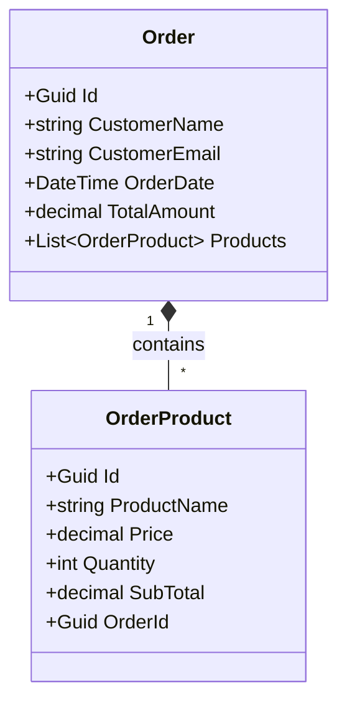

# Application Architecture

← [Data Architecture](02-data-architecture.md) | [Index](README.md) | [Technology Architecture →](04-technology-architecture.md)

---

## Application Architecture Overview

The solution follows a **cloud-native microservices architecture** orchestrated by .NET Aspire. Services are independently deployable, communicate through well-defined APIs and messaging contracts, and implement observability patterns for distributed tracing.

---

## Architecture Principles

| Principle | Statement | Implications |
|-----------|-----------|--------------|
| **Single Responsibility** | Each service handles one bounded context | Clear ownership, independent scaling |
| **API-First Design** | Services communicate via documented HTTP APIs or messages | Loose coupling, contract-driven development |
| **Defense in Depth** | Multiple security layers at network, identity, and data levels | Managed Identity, no secrets in code |
| **Observable by Default** | All services emit traces, metrics, and logs | OpenTelemetry instrumentation built-in |
| **Resilient Design** | Assume failures; implement retry, circuit breaker, timeout | Polly policies in ServiceDefaults |

---

## Application Landscape Map

```mermaid
flowchart TB
    subgraph PresentationLayer["🖥️ Presentation Layer"]
        WebApp["🌐 eShop.Web.App<br/>(Blazor Server)"]
    end

    subgraph ApplicationLayer["⚙️ Application Layer"]
        OrdersAPI["📦 eShop.Orders.API<br/>(ASP.NET Core API)"]
    end

    subgraph IntegrationLayer["🔄 Integration Layer"]
        ServiceBus["📨 Azure Service Bus<br/>(ordersplaced topic)"]
        LogicApp["🔁 OrdersManagement<br/>(Logic App Standard)"]
    end

    subgraph DataLayer["🗄️ Data Layer"]
        OrderDb[("OrderDb<br/>Azure SQL")]
        WorkflowState["📁 Workflow State<br/>(Azure Storage)"]
    end

    WebApp -->|"HTTP/REST"| OrdersAPI
    OrdersAPI -->|"EF Core"| OrderDb
    OrdersAPI -->|"AMQP"| ServiceBus
    ServiceBus -->|"Trigger"| LogicApp
    LogicApp -->|"Persist"| WorkflowState

    classDef presentation fill:#e3f2fd,stroke:#1565c0,stroke-width:2px
    classDef application fill:#e8f5e9,stroke:#2e7d32,stroke-width:2px
    classDef integration fill:#fff3e0,stroke:#ef6c00,stroke-width:2px
    classDef data fill:#f3e5f5,stroke:#7b1fa2,stroke-width:2px

    class WebApp presentation
    class OrdersAPI application
    class ServiceBus,LogicApp integration
    class OrderDb,WorkflowState data
```



---

## Service Catalog

| Service | Type | Technology Stack | Purpose | Port (Local) |
|---------|------|------------------|---------|--------------|
| **eShop.Web.App** | Frontend | Blazor Server, Fluent UI | User interface for order management | 5000 |
| **eShop.Orders.API** | Backend API | ASP.NET Core 10 | Order CRUD, business logic, event publishing | 5001 |
| **OrdersManagement** | Workflow | Azure Logic Apps Standard | Automated order processing workflows | N/A |
| **App Host** | Orchestrator | .NET Aspire 9.x | Local development orchestration | Dashboard: 15000 |

---

## Component Architecture

### eShop.Web.App (Frontend)

| Component | Responsibility | Location |
|-----------|---------------|----------|
| `OrdersAPIService` | Typed HTTP client for API communication | [Services/OrdersAPIService.cs](../../src/eShop.Web.App/Components/Services/OrdersAPIService.cs) |
| `MainLayout.razor` | Application shell with navigation | [Shared/MainLayout.razor](../../src/eShop.Web.App/Components/Shared/MainLayout.razor) |
| `PlaceOrder.razor` | Single order creation form | [Pages/Orders/PlaceOrder.razor](../../src/eShop.Web.App/Components/Pages/Orders/PlaceOrder.razor) |
| `PlaceOrdersBatch.razor` | Batch order import | [Pages/Orders/PlaceOrdersBatch.razor](../../src/eShop.Web.App/Components/Pages/Orders/PlaceOrdersBatch.razor) |
| `ListAllOrders.razor` | Orders grid view | [Pages/Orders/ListAllOrders.razor](../../src/eShop.Web.App/Components/Pages/Orders/ListAllOrders.razor) |
| `ViewOrder.razor` | Order detail view | [Pages/Orders/ViewOrder.razor](../../src/eShop.Web.App/Components/Pages/Orders/ViewOrder.razor) |

#### Web App Architecture Diagram

```mermaid
flowchart LR
    subgraph WebApp["eShop.Web.App"]
        direction TB
        subgraph Pages["📄 Pages"]
            PO["PlaceOrder"]
            POB["PlaceOrdersBatch"]
            LA["ListAllOrders"]
            VO["ViewOrder"]
        end
        
        subgraph Services["🔧 Services"]
            OAS["OrdersAPIService"]
        end
        
        subgraph Shared["🎨 Layout"]
            ML["MainLayout"]
        end
    end

    subgraph External["External"]
        API["⚙️ Orders API"]
    end

    Pages --> OAS
    OAS -->|"HTTP"| API

    classDef page fill:#e3f2fd,stroke:#1565c0
    classDef service fill:#e8f5e9,stroke:#2e7d32
    classDef external fill:#fff3e0,stroke:#ef6c00

    class PO,POB,LA,VO page
    class OAS service
    class API external
```



---

### eShop.Orders.API (Backend)

#### Layer Architecture

```mermaid
flowchart TB
    subgraph API["eShop.Orders.API"]
        direction TB
        subgraph Controllers["🎮 Controllers"]
            OC["OrdersController"]
        end
        
        subgraph Services["⚙️ Services"]
            OS["OrderService"]
            OMH["OrdersMessageHandler"]
        end
        
        subgraph Repositories["🗄️ Repositories"]
            OR["OrderRepository"]
        end
        
        subgraph Data["📊 Data"]
            DBC["OrderDbContext"]
        end
    end

    subgraph External["External Dependencies"]
        DB[("SQL Database")]
        SB["📨 Service Bus"]
    end

    Controllers --> Services
    Services --> Repositories
    Services --> OMH
    Repositories --> Data
    Data --> DB
    OMH --> SB

    classDef controller fill:#e3f2fd,stroke:#1565c0
    classDef service fill:#e8f5e9,stroke:#2e7d32
    classDef repo fill:#fff3e0,stroke:#ef6c00
    classDef data fill:#f3e5f5,stroke:#7b1fa2

    class OC controller
    class OS,OMH service
    class OR repo
    class DBC data
```



#### Component Details

| Layer | Component | Responsibility | Source |
|-------|-----------|---------------|--------|
| **Controllers** | `OrdersController` | HTTP endpoint routing, validation, response formatting | [Controllers/OrdersController.cs](../../src/eShop.Orders.API/Controllers/OrdersController.cs) |
| **Services** | `OrderService` | Business logic, metrics emission, orchestration | [Services/OrderService.cs](../../src/eShop.Orders.API/Services/OrderService.cs) |
| **Services** | `OrdersMessageHandler` | Service Bus message publishing with trace context | [Handlers/OrdersMessageHandler.cs](../../src/eShop.Orders.API/Handlers/OrdersMessageHandler.cs) |
| **Repositories** | `OrderRepository` | Data access, EF Core operations | [Repositories/OrderRepository.cs](../../src/eShop.Orders.API/Repositories/OrderRepository.cs) |
| **Data** | `OrderDbContext` | Entity configuration, migrations | [Data/OrderDbContext.cs](../../src/eShop.Orders.API/Data/OrderDbContext.cs) |
| **Health** | `DbContextHealthCheck` | Database connectivity probe | [HealthChecks/DbContextHealthCheck.cs](../../src/eShop.Orders.API/HealthChecks/DbContextHealthCheck.cs) |
| **Health** | `ServiceBusHealthCheck` | Service Bus connectivity probe | [HealthChecks/ServiceBusHealthCheck.cs](../../src/eShop.Orders.API/HealthChecks/ServiceBusHealthCheck.cs) |

---

### OrdersManagement Logic App

| Component | Description | Source |
|-----------|-------------|--------|
| **ProcessingOrdersPlaced** | Workflow triggered by Service Bus messages | [workflow.json](../../workflows/OrdersManagement/OrdersManagementLogicApp/ProcessingOrdersPlaced/workflow.json) |
| **Service Bus Connection** | Connection to ordersplaced topic subscription | Connection parameters |
| **Workflow State** | Azure Storage for execution state | Platform-managed |

#### Logic App Workflow

```mermaid
flowchart LR
    subgraph Trigger["⚡ Trigger"]
        SBTrigger["Service Bus<br/>Message Received"]
    end

    subgraph Actions["🔄 Actions"]
        Parse["Parse Message"]
        Process["Process Order"]
        Complete["Complete Message"]
    end

    subgraph Outputs["📤 Outputs"]
        Success["✅ Success"]
        Failure["❌ Failure<br/>(Dead Letter)"]
    end

    SBTrigger --> Parse --> Process
    Process -->|"Success"| Complete --> Success
    Process -->|"Error"| Failure

    classDef trigger fill:#fff3e0,stroke:#ef6c00
    classDef action fill:#e3f2fd,stroke:#1565c0
    classDef output fill:#e8f5e9,stroke:#2e7d32

    class SBTrigger trigger
    class Parse,Process,Complete action
    class Success,Failure output
```



---

## API Specification

### Orders API Endpoints

| Method | Endpoint | Description | Request Body | Response |
|--------|----------|-------------|--------------|----------|
| `POST` | `/api/orders` | Create single order | `Order` | `201 Created` + Order |
| `POST` | `/api/orders/batch` | Create multiple orders | `Order[]` | `200 OK` + Results |
| `GET` | `/api/orders` | List all orders | - | `200 OK` + Order[] |
| `GET` | `/api/orders/{id}` | Get order by ID | - | `200 OK` + Order |
| `DELETE` | `/api/orders/{id}` | Delete order | - | `204 No Content` |

### Health Endpoints

| Endpoint | Purpose | Checks |
|----------|---------|--------|
| `/health` | Readiness probe | Database, Service Bus |
| `/alive` | Liveness probe | Basic availability |

### API Flow Diagram

```mermaid
sequenceDiagram
    autonumber
    participant Client as 🌐 Client
    participant API as ⚙️ Orders API
    participant Service as 📦 OrderService
    participant Repo as 🗄️ Repository
    participant DB as 💾 Database
    participant Handler as 📨 MessageHandler
    participant SB as 📬 Service Bus

    Client->>API: POST /api/orders
    API->>Service: PlaceOrderAsync(order)
    Service->>Service: Validate Order
    Service->>Repo: AddAsync(order)
    Repo->>DB: INSERT Order
    DB-->>Repo: Saved
    Repo-->>Service: Order with ID
    Service->>Handler: SendAsync(order)
    Handler->>SB: Send Message
    Note over Handler,SB: TraceId, SpanId propagated
    SB-->>Handler: Ack
    Handler-->>Service: Published
    Service->>Service: Record Metrics
    Service-->>API: Order
    API-->>Client: 201 Created
```



---

## Inter-Service Communication

### Communication Patterns

| Pattern | Usage | Technology | Example |
|---------|-------|------------|---------|
| **Synchronous Request/Response** | Web to API calls | HTTP/REST | PlaceOrder form submission |
| **Asynchronous Pub/Sub** | Event distribution | Azure Service Bus | OrderPlaced event |
| **Service Discovery** | Runtime endpoint resolution | .NET Aspire | `http://orders-api` |

### Communication Matrix

| Source | Target | Protocol | Pattern | Security |
|--------|--------|----------|---------|----------|
| eShop.Web.App | eShop.Orders.API | HTTPS | Request/Response | Managed Identity (Azure) |
| eShop.Orders.API | Azure SQL | TDS | CRUD | Managed Identity |
| eShop.Orders.API | Service Bus | AMQP | Pub/Sub | Managed Identity |
| Service Bus | Logic Apps | AMQP | Event-driven | Managed Identity |

### Service Discovery

```mermaid
flowchart LR
    subgraph Aspire["🎯 .NET Aspire"]
        AppHost["AppHost"]
    end

    subgraph Services["🔧 Services"]
        Web["eShop.Web.App"]
        API["eShop.Orders.API"]
    end

    subgraph Resources["📦 Resources"]
        SQL["SQL Server"]
        SB["Service Bus"]
        AI["App Insights"]
    end

    AppHost -->|"Registers"| Web & API
    AppHost -->|"Provisions"| SQL & SB & AI
    Web -->|"Discovers"| API
    API -->|"Discovers"| SQL & SB & AI

    classDef aspire fill:#f3e5f5,stroke:#7b1fa2
    classDef service fill:#e8f5e9,stroke:#2e7d32
    classDef resource fill:#fff3e0,stroke:#ef6c00

    class AppHost aspire
    class Web,API service
    class SQL,SB,AI resource
```



---

## Application Integration

### Integration Architecture

```mermaid
flowchart TB
    subgraph Frontend["🖥️ Frontend"]
        WebApp["eShop.Web.App"]
    end

    subgraph Backend["⚙️ Backend"]
        API["eShop.Orders.API"]
    end

    subgraph Messaging["📨 Messaging"]
        Topic["ordersplaced<br/>(Topic)"]
        Sub["orderprocessingsub<br/>(Subscription)"]
    end

    subgraph Automation["🔄 Automation"]
        LogicApp["OrdersManagement<br/>Logic App"]
    end

    WebApp -->|"REST API"| API
    API -->|"Publish"| Topic
    Topic -->|"Route"| Sub
    Sub -->|"Trigger"| LogicApp

    classDef frontend fill:#e3f2fd,stroke:#1565c0
    classDef backend fill:#e8f5e9,stroke:#2e7d32
    classDef messaging fill:#fff3e0,stroke:#ef6c00
    classDef automation fill:#f3e5f5,stroke:#7b1fa2

    class WebApp frontend
    class API backend
    class Topic,Sub messaging
    class LogicApp automation
```



---

## Cross-Cutting Concerns

### ServiceDefaults Library

The `app.ServiceDefaults` project provides shared functionality across all services:

| Concern | Implementation | Source |
|---------|---------------|--------|
| **OpenTelemetry** | Traces, metrics, logs with OTLP export | [Extensions.cs](../../app.ServiceDefaults/Extensions.cs) |
| **Health Checks** | /health and /alive endpoints | [Extensions.cs](../../app.ServiceDefaults/Extensions.cs) |
| **Service Discovery** | HTTP client with service names | [Extensions.cs](../../app.ServiceDefaults/Extensions.cs) |
| **Resilience** | Retry (3x exponential), circuit breaker, 600s timeout | [Extensions.cs](../../app.ServiceDefaults/Extensions.cs) |
| **Service Bus Client** | Singleton ServiceBusClient with retries | [Extensions.cs](../../app.ServiceDefaults/Extensions.cs) |

### Resilience Configuration

```csharp
// From Extensions.cs - Polly resilience policies
.AddStandardResilienceHandler(options =>
{
    options.AttemptTimeout = new HttpTimeoutStrategyOptions
    {
        Timeout = TimeSpan.FromSeconds(600)
    };
    options.CircuitBreaker = new HttpCircuitBreakerStrategyOptions
    {
        SamplingDuration = TimeSpan.FromSeconds(10)
    };
    options.Retry = new HttpRetryStrategyOptions
    {
        MaxRetryAttempts = 3,
        BackoffType = DelayBackoffType.Exponential
    };
});
```

---

## Domain Model

### Order Aggregate



### Entity Details

| Entity | Properties | Validation Rules |
|--------|------------|-----------------|
| **Order** | Id, CustomerName, CustomerEmail, OrderDate, TotalAmount, Products | Name required, Email valid format, At least 1 product |
| **OrderProduct** | Id, ProductName, Price, Quantity, SubTotal, OrderId | Name required, Price > 0, Quantity > 0 |

---

## Cross-Architecture Relationships

| Related Architecture | Connection | Reference |
|---------------------|------------|-----------|
| **Business Architecture** | Applications enable Order Management capability | [01-business-architecture.md](01-business-architecture.md) |
| **Data Architecture** | Applications own and access data stores | [02-data-architecture.md](02-data-architecture.md) |
| **Technology Architecture** | Applications deployed on Azure Container Apps | [04-technology-architecture.md](04-technology-architecture.md) |
| **Observability Architecture** | Applications emit telemetry via OpenTelemetry | [05-observability-architecture.md](05-observability-architecture.md) |

---

← [Data Architecture](02-data-architecture.md) | [Index](README.md) | [Technology Architecture →](04-technology-architecture.md)
