# Application Architecture

← [Data Architecture](02-data-architecture.md) | [Index](README.md) | [Technology Architecture](04-technology-architecture.md) →

## 1. Application Architecture Overview

The solution implements a **microservices architecture** with clear service boundaries following Domain-Driven Design principles. Services communicate via synchronous HTTP/REST (Web → API) and asynchronous messaging (API → Logic Apps via Service Bus). .NET Aspire orchestrates local development while Azure Container Apps hosts production workloads.

**Architectural Style**: Event-driven, modular, layered

**Key Design Decisions**:
- Clean Architecture pattern within each service (Controllers → Services → Repositories)
- Shared library (ServiceDefaults) for cross-cutting concerns
- Local/Azure environment parity via .NET Aspire abstractions
- W3C Trace Context propagation across all boundaries

---

## 2. Application Architecture Principles

| Principle | Statement | Rationale | Implications |
|-----------|-----------|-----------|--------------|
| **Single Responsibility** | Each service has one reason to change | Maintainability, testability | Clear bounded contexts (Orders, UI, Workflows) |
| **API-First Design** | All capabilities exposed via APIs | Interoperability, reusability | OpenAPI specifications for all endpoints |
| **Loose Coupling** | Services communicate via events | Independent deployability | Service Bus for async workflows |
| **High Cohesion** | Related functionality grouped | Understandability | Domain-aligned services |
| **Observability by Design** | All services instrumented | Operational excellence | OpenTelemetry built-in from start |

---

## 3. Application Landscape Map

```mermaid
flowchart TB
    subgraph Presentation["🖥️ Presentation Layer"]
        direction LR
        WebApp["🌐 Web App<br/>Blazor Server<br/>Port: 5010"]
    end

    subgraph Application["⚙️ Application Layer"]
        direction LR
        API["📡 Orders API<br/>ASP.NET Core<br/>Port: 5001"]
        Workflow["🔄 Logic App<br/>OrdersPlacedProcess"]
    end

    subgraph Platform["🏗️ Platform Layer"]
        direction LR
        Orchestrator["🎯 Orchestrator<br/>.NET Aspire<br/>AppHost"]
        SharedLib["📦 Shared Library<br/>ServiceDefaults"]
    end

    subgraph External["☁️ External Services"]
        direction LR
        DB[("🗄️ Database<br/>Azure SQL<br/>OrderDb")]
        Queue["📨 Messaging<br/>Service Bus<br/>ordersplaced"]
        Monitor["📊 Monitoring<br/>App Insights"]
    end

    %% Synchronous flows
    WebApp -->|"HTTP/REST<br/>JSON"| API
    API -->|"EF Core<br/>TDS"| DB

    %% Async/Event flows
    API -->|"AMQP<br/>JSON"| Queue
    Queue -->|"Trigger<br/>HTTP Connector"| Workflow

    %% Platform relationships
    Orchestrator -.->|"Orchestrates"| WebApp
    Orchestrator -.->|"Orchestrates"| API
    SharedLib -.->|"Configures"| WebApp
    SharedLib -.->|"Configures"| API

    %% Telemetry flows
    WebApp -.->|"OTLP"| Monitor
    API -.->|"OTLP"| Monitor
    Workflow -.->|"Diagnostics"| Monitor

    classDef presentation fill:#e3f2fd,stroke:#1565c0,stroke-width:2px
    classDef application fill:#e8f5e9,stroke:#2e7d32,stroke-width:2px
    classDef platform fill:#fff3e0,stroke:#ef6c00,stroke-width:2px
    classDef external fill:#f3e5f5,stroke:#7b1fa2,stroke-width:2px

    class WebApp presentation
    class API,Workflow application
    class Orchestrator,SharedLib platform
    class DB,Queue,Monitor external
```

---

## 4. Service Catalog

| Service | Type | Port | Dependencies | Health Endpoint |
|---------|------|------|--------------|-----------------|
| **eShop.Web.App** | Blazor Server UI | 5010 | Orders API, App Insights | `/health` |
| **eShop.Orders.API** | REST API | 5001 | SQL DB, Service Bus, App Insights | `/health` |
| **OrdersPlacedProcess** | Logic App Workflow | N/A | Service Bus, Storage Account | Azure-managed |
| **app.AppHost** | Orchestrator | N/A | All services | N/A (dev-only) |
| **app.ServiceDefaults** | Class Library | N/A | None (consumed by services) | N/A |

---

## 5. Service Details

### eShop.Orders.API

**Responsibilities:**
- RESTful CRUD operations for orders
- Order validation and business logic
- Service Bus message publishing
- Database transaction management
- Health check reporting

**API Endpoints:**

| Method | Route | Description | Request | Response | Status Codes |
|--------|-------|-------------|---------|----------|--------------|
| POST | `/api/orders` | Place new order | `Order` JSON | `Order` JSON | 201, 400, 409, 500 |
| POST | `/api/orders/batch` | Place multiple orders | `Order[]` JSON | `BatchResult` JSON | 201, 400, 500 |
| GET | `/api/orders` | List all orders | Query params | `Order[]` JSON | 200, 500 |
| GET | `/api/orders/{id}` | Get order by ID | Path param | `Order` JSON | 200, 404, 500 |
| DELETE | `/api/orders/{id}` | Delete order | Path param | No content | 204, 404, 500 |
| GET | `/health` | Health check | None | JSON status | 200, 503 |

**Component Diagram:**

**Key Patterns:**
- **Repository Pattern**: Abstracts data access (`IOrderRepository`)
- **Dependency Injection**: Constructor injection for all dependencies
- **Circuit Breaker**: Polly policies via `ServiceDefaults`
- **Structured Logging**: TraceId/SpanId in all log entries

**Dependencies:**

| Dependency | Purpose | Configuration |
|------------|---------|---------------|
| SQL Database | Order persistence | Connection string via Aspire |
| Service Bus | Event publishing | Managed Identity or connection string |
| App Insights | Telemetry | Connection string via Aspire |
| ServiceDefaults | Cross-cutting concerns | Project reference |

### eShop.Web.App

**Responsibilities:**
- Customer-facing UI for order management
- Real-time updates via SignalR
- Typed HTTP client to Orders API
- Client-side validation

**UI Components:**

| Component | Purpose |
|-----------|---------|
| `Home.razor` | Landing page |
| `PlaceOrder.razor` | Single order form |
| `PlaceOrdersBatch.razor` | Batch order submission |
| `ListAllOrders.razor` | Orders DataGrid |
| `ViewOrder.razor` | Order details |
| `OrdersAPIService.cs` | Typed HTTP client |

**Component Diagram:**

**State Management**: Component-scoped state (no global state management due to Blazor Server architecture)

### OrdersManagement Logic App

**Workflow Inventory:**

| Workflow | Trigger | Purpose | Actions |
|----------|---------|---------|---------|
| `OrdersPlacedProcess` | Service Bus Topic Subscription | Process order events | HTTP POST, Create Blob (success/error) |
| `OrdersPlacedCompleteProcess` | Timer (future) | Batch completion notification | Send email, update database |

**Trigger Pattern**: Service Bus Topic Subscription (`orderprocessingsub`)

**Actions:**
1. **Check_Order_Placed**: Validate message content type
2. **HTTP**: POST to Orders API for processing
3. **Check_Process_Worked**: Evaluate HTTP status code
4. **Create_Blob_Successfully**: Write to success folder if 201
5. **Create_Blob_Errors**: Write to error folder otherwise

**Integration Points:**

| Integration | Type | Configuration |
|-------------|------|---------------|
| Service Bus | Trigger | Managed Identity |
| Orders API | HTTP Action | Managed Identity (future) |
| Azure Storage | Action | Managed Identity |

---

## 6. Inter-Service Communication

```mermaid
flowchart LR
    User["👤 User"] -->|"HTTPS<br/>Browser"| WebApp["Web App"]
    WebApp -->|"HTTP/REST<br/>Sync"| API["Orders API"]
    API -->|"AMQP<br/>Async"| ServiceBus["Service Bus<br/>ordersplaced"]
    ServiceBus -->|"HTTP Trigger<br/>Async"| LogicApp["Logic App"]
    API -->|"TDS<br/>Sync"| SQL[("SQL Database")]
    LogicApp -->|"SMB<br/>Async"| Storage["Azure Storage"]
    
    WebApp -.->|"OTLP"| AppInsights["App Insights"]
    API -.->|"OTLP"| AppInsights
    LogicApp -.->|"Diagnostics"| AppInsights
    
    classDef sync fill:#e3f2fd,stroke:#1565c0
    classDef async fill:#e8f5e9,stroke:#2e7d32
    classDef data fill:#fff3e0,stroke:#ef6c00
    classDef monitor fill:#f3e5f5,stroke:#7b1fa2
    
    class WebApp,API sync
    class ServiceBus,LogicApp async
    class SQL,Storage data
    class AppInsights monitor
```

| Pattern | Usage | Implementation | Example |
|---------|-------|----------------|---------|
| **Synchronous (HTTP/REST)** | Web → API | Typed HttpClient with service discovery | `OrdersAPIService.PlaceOrderAsync()` |
| **Asynchronous (Pub/Sub)** | API → Logic App | Service Bus Topic/Subscription | `ordersplaced` topic |
| **Service Discovery** | Local dev | .NET Aspire named references | `services:orders-api:https:0` |
| **Service Discovery** | Azure | Container Apps built-in DNS | Internal FQDN resolution |

---

## 7. Application Integration Points

| Source | Target | Protocol | Contract | Pattern |
|--------|--------|----------|----------|---------|
| Web App | Orders API | HTTP/REST | JSON (Order DTO) | Request/Response |
| Orders API | SQL Database | TDS | EF Core Entities | CRUD |
| Orders API | Service Bus | AMQP | JSON (Order Event) | Pub/Sub |
| Service Bus | Logic App | HTTP Connector | JSON Trigger | Event-driven |
| Logic App | Azure Storage | Blob API | Binary | File Write |
| All Services | App Insights | OTLP | OpenTelemetry Protocol | Push |

---

## 8. Resilience Patterns

| Pattern | Implementation | Configuration | Source |
|---------|----------------|---------------|--------|
| **Retry** | Polly | 3 attempts, exponential backoff (2s, 4s, 8s) | [Extensions.cs](../../app.ServiceDefaults/Extensions.cs#L60) |
| **Circuit Breaker** | Polly | 5 failures, 30s break, 10s half-open | [Extensions.cs](../../app.ServiceDefaults/Extensions.cs#L63) |
| **Timeout** | Polly | 60s per attempt, 600s total | [Extensions.cs](../../app.ServiceDefaults/Extensions.cs#L58) |
| **Health Checks** | ASP.NET Core | Database + Service Bus checks | [Program.cs](../../src/eShop.Orders.API/Program.cs#L100) |

---

## 9. Cross-Cutting Concerns

Implemented via **ServiceDefaults** library (`app.ServiceDefaults`):

| Concern | Implementation | Configuration |
|---------|----------------|---------------|
| **Telemetry** | OpenTelemetry SDK | Traces, metrics, logs to App Insights |
| **Health Checks** | ASP.NET Core | `/health` and `/alive` endpoints |
| **Resilience** | Polly | Retry, circuit breaker, timeout policies |
| **Service Discovery** | Aspire + Container Apps | Named service references |
| **Azure Clients** | Azure SDK | Managed Identity for Service Bus, SQL |

Consumption: `builder.AddServiceDefaults()` in `Program.cs`

---

## 10. Technology Stack Summary

| Layer | Technology | Version | Purpose |
|-------|------------|---------|---------|
| **Runtime** | .NET | 10.0 | Application runtime |
| **Web Framework** | ASP.NET Core | 10.0 | API and web hosting |
| **Frontend** | Blazor Server | 10.0 | Interactive UI |
| **UI Library** | Fluent UI | Latest | Microsoft design system |
| **ORM** | Entity Framework Core | 10.0 | Data access |
| **Messaging** | Azure.Messaging.ServiceBus | Latest | Event publishing |
| **Telemetry** | OpenTelemetry | Latest | Observability |
| **Orchestration** | .NET Aspire | 9.x | Local development |
| **Workflow** | Logic Apps Standard | Latest | Event-driven automation |

---

## Cross-Architecture Relationships

| Related Architecture | Connection | Reference |
|---------------------|------------|-----------|
| **Business Architecture** | Services implement business capabilities (Order Management → Orders API) | [Business Architecture](01-business-architecture.md#business-capabilities) |
| **Data Architecture** | Services own data stores per bounded context (Orders API → OrderDb) | [Data Architecture](02-data-architecture.md#data-domain-catalog) |
| **Technology Architecture** | Services deployed to Container Apps infrastructure | [Technology Architecture](04-technology-architecture.md#compute-platform) |
| **Observability Architecture** | Services emit telemetry via OpenTelemetry SDK | [Observability Architecture](05-observability-architecture.md#telemetry-architecture) |

---

← [Data Architecture](02-data-architecture.md) | [Index](README.md) | [Technology Architecture](04-technology-architecture.md) →
