# ⚙️ Application Architecture

> [!NOTE]
> 🎯 **For Developers and Tech Leads**: This document covers services, APIs, and integration patterns.  
> ⏱️ **Estimated reading time:** 25 minutes

<details>
<summary>📍 <strong>Quick Navigation</strong></summary>

| Previous | Index | Next |
|:---------|:------:|--------:|
| [← Data Architecture](02-data-architecture.md) | [📑 Index](README.md) | [Technology Architecture →](04-technology-architecture.md) |

</details>

---

## 📑 Table of Contents

- [📋 Application Architecture Overview](#-1-application-architecture-overview)
- [📜 Application Architecture Principles](#-2-application-architecture-principles)
- [🗺️ Application Landscape Map](#%EF%B8%8F-3-application-landscape-map)
- [📦 Service Catalog](#-4-service-catalog)
- [⚙️ Service Details](#%EF%B8%8F-5-service-details)

---

## 📋 1. Application Architecture Overview

The solution follows a **modular, event-driven architecture** with clear service boundaries aligned to business capabilities. Each service is independently deployable, owns its data, and communicates through well-defined contracts.

### Architectural Style

- **Microservices**: Independently deployable services with bounded contexts
- **Event-Driven**: Asynchronous communication via Azure Service Bus
- **Clean Architecture**: Separation of concerns within each service (Controllers → Services → Repositories)
- **API-First**: All capabilities exposed through RESTful endpoints

### Key Design Decisions

1. **.NET Aspire Orchestration**: Unified configuration and service discovery
2. **Service Bus for Events**: Decoupled, reliable message delivery
3. **Managed Identity**: Zero-secret service-to-service authentication
4. **OpenTelemetry**: Vendor-neutral observability instrumentation

---

## 📜 2. Application Architecture Principles

| Principle                   | Statement                             | Rationale                     | Implications                        |
| --------------------------- | ------------------------------------- | ----------------------------- | ----------------------------------- |
| **Single Responsibility**   | Each service has one reason to change | Maintainability, testability  | Clear bounded contexts              |
| **API-First Design**        | All capabilities exposed via APIs     | Interoperability, reusability | OpenAPI specifications required     |
| **Loose Coupling**          | Services communicate via events       | Independent deployability     | Service Bus for async communication |
| **High Cohesion**           | Related functionality grouped         | Understandability             | Domain-aligned services             |
| **Observability by Design** | All services instrumented             | Operational excellence        | OpenTelemetry built-in              |

---

## 🗺️ 3. Application Landscape Map

```mermaid
---
title: Application Landscape Map
---
flowchart TB
    %% ===== CLASS DEFINITIONS =====
    classDef primary fill:#4F46E5,stroke:#3730A3,color:#FFFFFF
    classDef secondary fill:#10B981,stroke:#059669,color:#FFFFFF
    classDef datastore fill:#F59E0B,stroke:#D97706,color:#000000
    classDef external fill:#6B7280,stroke:#4B5563,color:#FFFFFF,stroke-dasharray: 5 5
    classDef failed fill:#F44336,stroke:#C62828,color:#FFFFFF
    classDef trigger fill:#818CF8,stroke:#4F46E5,color:#FFFFFF
    classDef decision fill:#FFFBEB,stroke:#F59E0B,color:#000000
    classDef input fill:#F3F4F6,stroke:#6B7280,color:#000000

    %% ===== PRESENTATION LAYER =====
    subgraph Presentation["🖥️ Presentation Layer"]
        direction LR
        WebApp["🌐 eShop.Web.App<br/>Blazor Server<br/>:5000"]
    end
    style Presentation fill:#EEF2FF,stroke:#4F46E5,stroke-width:2px

    %% ===== APPLICATION LAYER =====
    subgraph Application["⚙️ Application Layer"]
        direction LR
        API["📡 eShop.Orders.API<br/>ASP.NET Core<br/>:5001"]
        LogicApp["🔄 OrdersManagement<br/>Logic Apps Standard"]
    end
    style Application fill:#D1FAE5,stroke:#10B981,stroke-width:2px

    %% ===== PLATFORM LAYER =====
    subgraph Platform["🏗️ Platform Layer"]
        direction LR
        Orchestrator["🎯 app.AppHost<br/>.NET Aspire"]
        SharedLib["📦 app.ServiceDefaults<br/>Cross-cutting Library"]
    end
    style Platform fill:#FEF3C7,stroke:#F59E0B,stroke-width:2px

    %% ===== EXTERNAL SERVICES =====
    subgraph External["☁️ External Services"]
        direction LR
        DB[("🗄️ Azure SQL<br/>OrderDb")]
        Queue["📨 Service Bus<br/>ordersplaced"]
        Storage["📁 Azure Storage<br/>Workflow State"]
        Monitor["📊 App Insights"]
    end
    style External fill:#F3E8FF,stroke:#A855F7,stroke-width:2px

    %% ===== SYNCHRONOUS FLOWS =====
    WebApp -->|"HTTP/REST"| API
    API -->|"EF Core"| DB
    API -->|"AMQP"| Queue
    LogicApp -->|"HTTP"| API

    %% ===== ASYNC/EVENT FLOWS =====
    Queue -->|"Trigger"| LogicApp
    LogicApp -->|"Store State"| Storage

    %% ===== PLATFORM RELATIONSHIPS =====
    Orchestrator -.->|"Orchestrates"| WebApp
    Orchestrator -.->|"Orchestrates"| API
    SharedLib -.->|"Configures"| WebApp
    SharedLib -.->|"Configures"| API

    %% ===== TELEMETRY FLOWS =====
    WebApp -.->|"OTLP"| Monitor
    API -.->|"OTLP"| Monitor
    LogicApp -.->|"Diagnostics"| Monitor

    %% ===== NODE CLASSES =====
    class WebApp primary
    class API,LogicApp secondary
    class Orchestrator,SharedLib trigger
    class DB,Queue,Storage datastore
    class Monitor external
```



### Application Inventory

| Application             | Layer        | Type         | Technology               | Owner         | Status |
| ----------------------- | ------------ | ------------ | ------------------------ | ------------- | ------ |
| **eShop.Web.App**       | Presentation | Web UI       | Blazor Server, Fluent UI | Frontend Team | Active |
| **eShop.Orders.API**    | Application  | REST API     | ASP.NET Core 10          | Orders Team   | Active |
| **OrdersManagement**    | Application  | Workflow     | Logic Apps Standard      | Platform Team | Active |
| **app.AppHost**         | Platform     | Orchestrator | .NET Aspire              | Platform Team | Active |
| **app.ServiceDefaults** | Platform     | Library      | .NET Class Library       | Platform Team | Active |

### Application Relationship Matrix

| From         | To           | Relationship | Protocol    | Pattern               |
| ------------ | ------------ | ------------ | ----------- | --------------------- |
| Web App      | Orders API   | Consumes     | HTTP/REST   | Sync Request/Response |
| Orders API   | SQL Database | Persists     | TDS/EF Core | CRUD                  |
| Orders API   | Service Bus  | Publishes    | AMQP        | Async Pub/Sub         |
| Service Bus  | Logic Apps   | Triggers     | Connector   | Event-driven          |
| Logic Apps   | Orders API   | Calls        | HTTP/REST   | Sync Request/Response |
| All Services | App Insights | Reports      | OTLP        | Push Telemetry        |

---

## 📦 4. Service Catalog

| Service              | Type          | Port | Dependencies         | Health Endpoint | Source                                              |
| -------------------- | ------------- | ---- | -------------------- | --------------- | --------------------------------------------------- |
| **eShop.Web.App**    | Blazor Server | 5000 | Orders API           | /health, /alive | [Program.cs](../../src/eShop.Web.App/Program.cs)    |
| **eShop.Orders.API** | REST API      | 5001 | SQL, Service Bus     | /health, /alive | [Program.cs](../../src/eShop.Orders.API/Program.cs) |
| **OrdersManagement** | Logic App     | N/A  | Service Bus, Storage | Built-in        | [workflows/](../../workflows/OrdersManagement/)     |

---

## ⚙️ 5. Service Details

### eShop.Orders.API

**Responsibilities:**

- Order CRUD operations (create, read, update, delete)
- Order validation and business rules
- Service Bus event publishing
- Distributed tracing context propagation

**Component Diagram:**


**API Endpoints:**

| Method | Route             | Description         | Request    | Response      |
| ------ | ----------------- | ------------------- | ---------- | ------------- |
| POST   | /api/orders       | Place new order     | Order JSON | 201 + Order   |
| GET    | /api/orders       | List all orders     | -          | Order[]       |
| GET    | /api/orders/{id}  | Get order by ID     | -          | Order         |
| DELETE | /api/orders/{id}  | Delete order        | -          | 204           |
| POST   | /api/orders/batch | Create batch orders | Order[]    | OrderResult[] |
| DELETE | /api/orders/batch | Delete batch orders | string[]   | 204           |

> **Source**: [OrdersController.cs](../../src/eShop.Orders.API/Controllers/OrdersController.cs)

**Key Patterns Implemented:**

- Repository Pattern for data access abstraction
- Activity-based distributed tracing
- Custom metrics via OpenTelemetry Meter API
- Health checks for database and Service Bus connectivity

---

### eShop.Web.App

**Responsibilities:**

- Order management user interface
- Real-time updates via SignalR
- HTTP client communication with Orders API

**Component Diagram:**


**State Management:**

- Server-side Blazor with SignalR circuit
- Distributed memory cache for session state
- Typed HTTP clients with resilience policies

> **Source**: [Program.cs](../../src/eShop.Web.App/Program.cs)

---

### Logic Apps Workflows

The **OrdersManagementLogicApp** is an Azure Logic Apps Standard application containing two stateful workflows that handle order processing and cleanup operations.

**Logic App Configuration:**

| Setting                  | Value                                                             | Purpose                     |
| ------------------------ | ----------------------------------------------------------------- | --------------------------- |
| **Runtime**              | Logic Apps Standard                                               | Stateful workflow execution |
| **Extension Bundle**     | Microsoft.Azure.Functions.ExtensionBundle.Workflows [1.\*, 2.0.0) | Workflow runtime            |
| **Telemetry Mode**       | OpenTelemetry                                                     | Distributed tracing support |
| **App Insights Version** | v2                                                                | Enhanced telemetry          |

> **Source**: [host.json](../../workflows/OrdersManagement/OrdersManagementLogicApp/host.json)

**Managed Connections:**

| Connection      | Type               | Authentication                 | Purpose            |
| --------------- | ------------------ | ------------------------------ | ------------------ |
| **servicebus**  | Azure Service Bus  | User-Assigned Managed Identity | Topic subscription |
| **azureblob**   | Azure Blob Storage | User-Assigned Managed Identity | Result storage     |
| **azureblob-1** | Azure Blob Storage | User-Assigned Managed Identity | Cleanup operations |

> **Source**: [connections.json](../../workflows/OrdersManagement/OrdersManagementLogicApp/connections.json)

**Workflow Parameters:**

| Parameter                             | Type   | Purpose                            |
| ------------------------------------- | ------ | ---------------------------------- |
| `servicebus-ConnectionRuntimeUrl`     | String | Service Bus connection endpoint    |
| `servicebus-Authentication`           | Object | MSI authentication config          |
| `azureblob-ConnectionRuntimeUrl`      | String | Blob storage connection endpoint   |
| `azureblob-Authentication`            | Object | MSI authentication config          |
| `AZURE_STORAGE_ACCOUNT_NAME_WORKFLOW` | String | Storage account for workflow state |
| `ORDERS_API_URL`                      | String | Orders API base URL                |

> **Source**: [parameters.json](../../workflows/OrdersManagement/OrdersManagementLogicApp/parameters.json)

---

**Workflow Inventory:**

| Workflow                        | Trigger                                       | Type     | Purpose                  | Actions                                  |
| ------------------------------- | --------------------------------------------- | -------- | ------------------------ | ---------------------------------------- |
| **OrdersPlacedProcess**         | Service Bus (ordersplaced topic, 1s interval) | Stateful | Process new orders       | Validate → Call API → Store result       |
| **OrdersPlacedCompleteProcess** | Recurrence (3 seconds)                        | Stateful | Cleanup processed orders | List blobs → Get metadata → Delete blobs |

---

#### OrdersPlacedProcess Workflow

**Purpose:** Processes incoming order messages from Service Bus, validates content, calls the Orders API, and stores results in appropriate blob containers.

**Trigger Configuration:**

- **Type:** Service Bus topic subscription (auto-complete)
- **Topic:** `ordersplaced`
- **Subscription:** `orderprocessingsub`
- **Interval:** 1 second polling

**OrdersPlacedProcess Flow:**


**Blob Storage Paths:**

| Outcome             | Container Path                 | File Name     |
| ------------------- | ------------------------------ | ------------- |
| **Success**         | `/ordersprocessedsuccessfully` | `{MessageId}` |
| **API Error**       | `/ordersprocessedwitherrors`   | `{MessageId}` |
| **Invalid Content** | `/ordersprocessedwitherrors`   | `{MessageId}` |

> **Source**: [OrdersPlacedProcess/workflow.json](../../workflows/OrdersManagement/OrdersManagementLogicApp/OrdersPlacedProcess/workflow.json)

---

#### OrdersPlacedCompleteProcess Workflow

**Purpose:** Periodically scans the successfully processed orders container and deletes blobs to clean up storage after order processing is complete.

**Trigger Configuration:**

- **Type:** Recurrence trigger
- **Interval:** 3 seconds
- **Time Zone:** Central Standard Time

**Concurrency:** 20 parallel repetitions for high throughput

**OrdersPlacedCompleteProcess Flow:**

```mermaid
---
title: OrdersPlacedCompleteProcess Workflow
---
flowchart TD
    %% ===== CLASS DEFINITIONS =====
    classDef primary fill:#4F46E5,stroke:#3730A3,color:#FFFFFF
    classDef secondary fill:#10B981,stroke:#059669,color:#FFFFFF
    classDef datastore fill:#F59E0B,stroke:#D97706,color:#000000
    classDef external fill:#6B7280,stroke:#4B5563,color:#FFFFFF,stroke-dasharray: 5 5
    classDef failed fill:#F44336,stroke:#C62828,color:#FFFFFF
    classDef trigger fill:#818CF8,stroke:#4F46E5,color:#FFFFFF
    classDef decision fill:#FFFBEB,stroke:#F59E0B,color:#000000
    classDef input fill:#F3F4F6,stroke:#6B7280,color:#000000

    %% ===== TRIGGER =====
    Trigger["⏰ Recurrence Trigger<br/>Every 3 seconds"]

    %% ===== ACTION NODES =====
    ListBlobs["📋 List Blobs (V2)<br/>/ordersprocessedsuccessfully"]
    ForEach["🔄 For Each Blob<br/>(20 parallel)"]
    GetMetadata["📄 Get Blob Metadata (V2)<br/>Get file path"]
    DeleteBlob["🗑️ Delete Blob (V2)<br/>Remove processed order"]
    Complete["✅ Complete Iteration"]
    NoAction["⏭️ Skip (No blobs)"]

    %% ===== DECISION NODES =====
    CheckBlobs{"Any Blobs<br/>Found?"}

    %% ===== FLOW CONNECTIONS =====
    Trigger -->|"start"| ListBlobs
    ListBlobs -->|"evaluate"| CheckBlobs
    CheckBlobs -->|"Yes"| ForEach
    CheckBlobs -->|"No"| NoAction
    ForEach -->|"process"| GetMetadata
    GetMetadata -->|"retrieve path"| DeleteBlob
    DeleteBlob -->|"confirm"| Complete
    Complete -->|"Next blob"| ForEach

    %% ===== NODE CLASSES =====
    class Trigger trigger
    class CheckBlobs decision
    class ListBlobs,GetMetadata,Complete primary
    class ForEach secondary
    class DeleteBlob failed
    class NoAction input
```



**Actions Detail:**

| Action                     | Type          | Description                                       |
| -------------------------- | ------------- | ------------------------------------------------- |
| **Lists*blobs*(V2)**       | ApiConnection | Lists all blobs in `/ordersprocessedsuccessfully` |
| **For_each**               | Foreach       | Iterates over blob list (20 concurrent)           |
| **Get*Blob_Metadata*(V2)** | ApiConnection | Retrieves blob path for deletion                  |
| **Delete*blob*(V2)**       | ApiConnection | Removes blob from storage                         |

> **Source**: [OrdersPlacedCompleteProcess/workflow.json](../../workflows/OrdersManagement/OrdersManagementLogicApp/OrdersPlacedCompleteProcess/workflow.json)

---

#### Logic Apps Folder Structure

```
workflows/OrdersManagement/
├── OrdersManagement.code-workspace     # VS Code workspace
└── OrdersManagementLogicApp/
    ├── host.json                       # Runtime configuration
    ├── connections.json                # Managed API connections
    ├── parameters.json                 # Workflow parameters
    ├── local.settings.json             # Local development settings
    ├── .vscode/                         # VS Code configuration
    │   ├── extensions.json
    │   ├── launch.json
    │   ├── settings.json
    │   └── tasks.json
    ├── OrdersPlacedProcess/            # Order processing workflow
    │   └── workflow.json
    └── OrdersPlacedCompleteProcess/    # Cleanup workflow
        └── workflow.json
```

---

## 6. Inter-Service Communication

### Communication Patterns


| Pattern               | Usage             | Implementation               | Example                  |
| --------------------- | ----------------- | ---------------------------- | ------------------------ |
| **Request/Response**  | UI to API calls   | HTTP/REST with typed clients | Web App → Orders API     |
| **Publish/Subscribe** | Order events      | Service Bus topics           | API → ordersplaced topic |
| **Event-Driven**      | Workflow triggers | Logic Apps connectors        | Service Bus → Logic App  |

### Service Discovery

| Environment           | Mechanism                     | Configuration           |
| --------------------- | ----------------------------- | ----------------------- |
| **Local Development** | .NET Aspire service discovery | AppHost WithReference() |
| **Azure Deployment**  | Container Apps internal DNS   | Managed by platform     |

---

## 7. Application Integration Points

| Source     | Target       | Protocol  | Contract          | Pattern | Source Code                                                                                                  |
| ---------- | ------------ | --------- | ----------------- | ------- | ------------------------------------------------------------------------------------------------------------ |
| Web App    | Orders API   | HTTP/REST | OpenAPI 3.0       | Sync    | [OrdersAPIService.cs](../../src/eShop.Web.App/Components/Services/OrdersAPIService.cs)                       |
| Orders API | SQL Database | TDS       | EF Core Model     | Sync    | [OrderDbContext.cs](../../src/eShop.Orders.API/data/OrderDbContext.cs)                                       |
| Orders API | Service Bus  | AMQP      | Order JSON        | Async   | [OrdersMessageHandler.cs](../../src/eShop.Orders.API/Handlers/OrdersMessageHandler.cs)                       |
| Logic Apps | Service Bus  | Connector | ServiceBusMessage | Event   | [workflow.json](../../workflows/OrdersManagement/OrdersManagementLogicApp/OrdersPlacedProcess/workflow.json) |
| Logic Apps | Blob Storage | Connector | Blob API          | Sync    | [workflow.json](../../workflows/OrdersManagement/OrdersManagementLogicApp/OrdersPlacedProcess/workflow.json) |

---

## 8. Resilience Patterns

| Pattern             | Implementation              | Configuration                   | Source                                                           |
| ------------------- | --------------------------- | ------------------------------- | ---------------------------------------------------------------- |
| **Retry**           | Polly (Standard Resilience) | 3 attempts, exponential backoff | [Extensions.cs](../../app.ServiceDefaults/Extensions.cs#L53-L61) |
| **Circuit Breaker** | Polly                       | 120s sampling duration          | [Extensions.cs](../../app.ServiceDefaults/Extensions.cs#L60)     |
| **Timeout**         | HttpClient                  | 60s per attempt, 600s total     | [Extensions.cs](../../app.ServiceDefaults/Extensions.cs#L55-L56) |
| **Database Retry**  | EF Core                     | 5 attempts, 30s max delay       | [Program.cs](../../src/eShop.Orders.API/Program.cs#L38-L41)      |

### Resilience Configuration

```csharp
// From Extensions.cs - Standard resilience handler configuration
http.AddStandardResilienceHandler(options =>
{
    options.TotalRequestTimeout.Timeout = TimeSpan.FromSeconds(600);
    options.AttemptTimeout.Timeout = TimeSpan.FromSeconds(60);
    options.Retry.MaxRetryAttempts = 3;
    options.Retry.BackoffType = Polly.DelayBackoffType.Exponential;
    options.CircuitBreaker.SamplingDuration = TimeSpan.FromSeconds(120);
});
```

---

## 9. Cross-Cutting Concerns

The **app.ServiceDefaults** library provides shared cross-cutting concerns consumed by all services:

| Concern               | Implementation             | Description                                     |
| --------------------- | -------------------------- | ----------------------------------------------- |
| **Telemetry**         | OpenTelemetry SDK          | Traces, metrics, logs with Azure Monitor export |
| **Health Checks**     | ASP.NET Core Health Checks | /health and /alive endpoints                    |
| **Resilience**        | Polly                      | Retry, circuit breaker, timeout policies        |
| **Service Discovery** | .NET Aspire                | Automatic endpoint resolution                   |
| **Azure Clients**     | Azure.Identity             | Managed Identity authentication                 |

> **Source**: [Extensions.cs](../../app.ServiceDefaults/Extensions.cs)

---

## 10. Technology Stack Summary

| Layer             | Technology                 | Version | Purpose             |
| ----------------- | -------------------------- | ------- | ------------------- |
| **Runtime**       | .NET                       | 10.0    | Application runtime |
| **Web Framework** | ASP.NET Core               | 10.0    | API and web hosting |
| **Frontend**      | Blazor Server              | 10.0    | Interactive UI      |
| **UI Components** | Fluent UI Blazor           | Latest  | Design system       |
| **ORM**           | Entity Framework Core      | 10.0    | Data access         |
| **Messaging**     | Azure.Messaging.ServiceBus | Latest  | Event publishing    |
| **Telemetry**     | OpenTelemetry              | Latest  | Observability       |
| **Orchestration** | .NET Aspire                | 13.1.0  | Local development   |
| **Workflows**     | Logic Apps Standard        | Latest  | Process automation  |

---

## 11. Cross-Architecture Relationships

| Related Architecture           | Connection                                   | Reference                                                                  |
| ------------------------------ | -------------------------------------------- | -------------------------------------------------------------------------- |
| **Business Architecture**      | Services implement business capabilities     | [Business Architecture](01-business-architecture.md#business-capabilities) |
| **Data Architecture**          | Services own data stores per bounded context | [Data Architecture](02-data-architecture.md)                               |
| **Technology Architecture**    | Services deployed to infrastructure          | [Technology Architecture](04-technology-architecture.md)                   |
| **Observability Architecture** | Services emit telemetry                      | [Observability Architecture](05-observability-architecture.md)             |

---

[← Data Architecture](02-data-architecture.md) | [Index](README.md) | [Technology Architecture →](04-technology-architecture.md)
