# Application Architecture

[← Data Architecture](02-data-architecture.md) | [Index](README.md) | [Next →](04-technology-architecture.md)

## Application Architecture Overview

The solution implements a **layered, event-driven architecture** with clear separation of concerns across presentation, API, workflow automation, and supporting services. Each layer communicates through well-defined interfaces using REST APIs and asynchronous messaging.

### Application Landscape Map


---

## Service Catalog

| Service | Type | Technology | Purpose | Dependencies | SLA Target |
|---------|------|------------|---------|--------------|------------|
| **eShop.Web.App** | Web UI | Blazor Server, Fluent UI | Customer order management interface | Orders API | 99.5% |
| **eShop.Orders.API** | REST API | .NET 10, ASP.NET Core | Order CRUD operations, event publishing | SQL, Service Bus | 99.9% |
| **OrdersManagement** | Workflow | Logic Apps Standard | Async order processing automation | Orders API, Storage | 99.5% |
| **app.AppHost** | Orchestrator | .NET Aspire | Local dev and deployment orchestration | All services | N/A |
| **app.ServiceDefaults** | Library | .NET Class Library | Shared telemetry, resilience, health checks | N/A | N/A |

---

## Component Architecture

### eShop.Orders.API


### Key Components

| Component | Responsibility | Implementation Details |
|-----------|---------------|----------------------|
| **OrdersController** | HTTP request handling, routing | 486 lines, OpenTelemetry Activity spans per endpoint |
| **OrderService** | Business logic, validation, metrics | 526 lines, custom counters for orders placed/deleted |
| **OrderRepository** | EF Core persistence | 303 lines, async LINQ queries |
| **OrdersMessageHandler** | Service Bus publishing | 374 lines, W3C trace context propagation |
| **DatabaseHealthCheck** | SQL connectivity probe | EF Core connection test |
| **ServiceBusHealthCheck** | Service Bus connectivity probe | Client health verification |

---

### eShop.Web.App

```mermaid
flowchart TB
    subgraph WebApp["🌐 eShop.Web.App"]
        subgraph Components["Blazor Components"]
            Home["Home.razor"]
            Orders["Orders.razor"]
            OrderForm["OrderForm.razor"]
            Layout["MainLayout.razor"]
        end

        subgraph Services["Client Services"]
            OAS["OrdersAPIService<br/><i>Typed HTTP Client</i>"]
        end

        subgraph Shared["Shared"]
            NavMenu["NavMenu.razor"]
            FluentUI["Fluent UI Components"]
        end
    end

    subgraph External["External"]
        API["Orders API"]
    end

    Home --> Orders --> OrderForm
    Orders --> OAS
    OrderForm --> OAS
    OAS -->|"HTTP/REST"| API
    Layout --> NavMenu
    Orders & OrderForm --> FluentUI

    classDef component fill:#e3f2fd,stroke:#1565c0
    classDef service fill:#fff3e0,stroke:#ef6c00
    classDef shared fill:#e8f5e9,stroke:#2e7d32

    class Home,Orders,OrderForm,Layout component
    class OAS service
    class NavMenu,FluentUI shared
```



### Key Components

| Component | Responsibility | Implementation Details |
|-----------|---------------|----------------------|
| **OrdersAPIService** | HTTP client for Orders API | 468 lines, typed client with resilience handler |
| **Orders.razor** | Order list display | DataGrid with Fluent UI styling |
| **OrderForm.razor** | Order creation form | Validation, product selection |
| **MainLayout.razor** | Application shell | FluentDesignTheme, navigation |

---

### OrdersManagement Logic App


### Workflow Configuration

| Setting | Value | Description |
|---------|-------|-------------|
| **Trigger Type** | ServiceBusTopicSubscriptionTrigger | Polls topic subscription |
| **Polling Interval** | PT1S (1 second) | Near real-time processing |
| **Concurrency** | Default (sequential) | One message at a time |
| **Retry Policy** | Exponential | Built-in error handling |
| **Managed Connections** | Service Bus, Blob Storage | API connections via managed identity |

---

## API Endpoints

### Orders API Endpoint Catalog

| Endpoint | Method | Purpose | Request Body | Response | Auth |
|----------|--------|---------|--------------|----------|------|
| `/api/orders` | GET | List all orders | - | `Order[]` | None |
| `/api/orders/{id}` | GET | Get order by ID | - | `Order` | None |
| `/api/orders` | POST | Create new order | `Order` | `Order` | None |
| `/api/orders/{id}` | PUT | Update order | `Order` | `Order` | None |
| `/api/orders/{id}` | DELETE | Delete order | - | 204 | None |
| `/api/orders/process` | POST | Process order (callback) | `Order` | `Order` | None |
| `/health` | GET | Health check probe | - | 200/503 | None |
| `/alive` | GET | Liveness probe | - | 200 | None |

### API Contract Examples

**Create Order Request:**
```json
POST /api/orders
{
  "customerName": "John Smith",
  "addressLine": "123 Main Street",
  "postalCode": "12345",
  "city": "Seattle",
  "country": "USA",
  "products": [
    { "productName": "Widget", "quantity": 2, "price": 29.99 }
  ]
}
```

**Create Order Response:**
```json
HTTP/1.1 201 Created
{
  "id": 1,
  "customerName": "John Smith",
  "addressLine": "123 Main Street",
  "postalCode": "12345",
  "city": "Seattle",
  "country": "USA",
  "orderDate": "2025-01-15T10:30:00Z",
  "status": "Placed",
  "totalAmount": 59.98,
  "products": [
    { "id": 1, "productName": "Widget", "quantity": 2, "price": 29.99 }
  ]
}
```

---

## Communication Patterns

### Synchronous (Request/Response)


### Asynchronous (Event-Driven)


### Communication Pattern Matrix

| Source | Target | Pattern | Protocol | Use Case |
|--------|--------|---------|----------|----------|
| Web App → Orders API | Request/Response | HTTP REST | User-initiated operations |
| Orders API → SQL | Request/Response | TDS/EF Core | Data persistence |
| Orders API → Service Bus | Publish/Subscribe | AMQP | Event propagation |
| Service Bus → Logic Apps | Event-Driven | Managed Connector | Workflow triggering |
| Logic Apps → Orders API | Request/Response | HTTP REST | Callback processing |
| Logic Apps → Blob Storage | Fire-and-Forget | REST | Result storage |

---

## Resilience Patterns

### Implemented Patterns

```mermaid
flowchart LR
    subgraph Resilience["🛡️ Resilience Stack (Polly)"]
        Retry["♻️ Retry<br/><i>3 attempts</i><br/><i>Exponential backoff</i>"]
        CB["⚡ Circuit Breaker<br/><i>5 failures threshold</i><br/><i>30s break duration</i>"]
        Timeout["⏱️ Timeout<br/><i>30s total</i><br/><i>5s per attempt</i>"]
        RateLimiter["📊 Rate Limiter<br/><i>100 concurrent</i><br/><i>1000 queued</i>"]
    end

    Request["📨 Request"] --> Retry --> CB --> Timeout --> RateLimiter --> Service["🎯 Service"]

    classDef pattern fill:#e3f2fd,stroke:#1565c0,stroke-width:2px
    class Retry,CB,Timeout,RateLimiter pattern
```



### Resilience Configuration

| Pattern | Configuration | Trigger | Recovery Action |
|---------|--------------|---------|-----------------|
| **Retry** | 3 attempts, exponential backoff (2^n seconds) | Transient failures | Automatic retry with delay |
| **Circuit Breaker** | 5 failures in 30s window | Persistent failures | Block requests for 30s |
| **Timeout** | 30s total, 5s per attempt | Slow responses | Abort and retry/fail |
| **Rate Limiter** | 100 concurrent, 1000 queue | Overload | Queue or reject excess |

### Implementation Reference

From [Extensions.cs](../app.ServiceDefaults/Extensions.cs):
```csharp
public static IHttpClientBuilder AddStandardResilienceHandler(this IHttpClientBuilder builder)
{
    return builder.AddResilienceHandler("standard", static pipeline =>
    {
        pipeline.AddRetry(new HttpRetryStrategyOptions
        {
            BackoffType = DelayBackoffType.Exponential,
            MaxRetryAttempts = 3,
            UseJitter = true
        });
        pipeline.AddCircuitBreaker(new HttpCircuitBreakerStrategyOptions
        {
            FailureRatio = 0.5,
            MinimumThroughput = 5,
            BreakDuration = TimeSpan.FromSeconds(30)
        });
        // ...
    });
}
```

---

## Cross-Cutting Concerns

### Shared Capabilities (app.ServiceDefaults)

| Concern | Implementation | Consumers |
|---------|---------------|-----------|
| **OpenTelemetry** | `ConfigureOpenTelemetry()` - ASP.NET Core, HTTP, SQL instrumentation | All .NET services |
| **Health Checks** | `AddDefaultHealthChecks()` - `/health`, `/alive` endpoints | All .NET services |
| **Service Discovery** | `AddServiceDiscovery()` - .NET Aspire integration | All .NET services |
| **Resilience** | `AddStandardResilienceHandler()` - Polly pipeline | HTTP clients |
| **Azure Service Bus** | `AddAzureServiceBusClient()` - DefaultAzureCredential | Orders API |
| **Application Insights** | `AddServiceDefaultsCore()` - Connection string injection | All .NET services |

### Dependency Injection Graph


---

## Error Handling Strategy

| Layer | Strategy | Implementation |
|-------|----------|---------------|
| **Controller** | Return appropriate HTTP status codes | `try/catch` → `IActionResult` |
| **Service** | Log and rethrow with context | `ILogger` + `Activity.SetStatus(Error)` |
| **Repository** | Handle EF Core exceptions | Map `DbException` to domain errors |
| **Messaging** | Dead-letter queue for poison messages | Service Bus DLQ |
| **Workflow** | Retry + error output container | Logic Apps retry policy + blob storage |

### Error Response Format

```json
{
  "type": "https://tools.ietf.org/html/rfc7231#section-6.5.1",
  "title": "Bad Request",
  "status": 400,
  "traceId": "00-abc123def456...-789xyz...-01",
  "errors": {
    "CustomerName": ["The CustomerName field is required."],
    "Products": ["At least one product is required."]
  }
}
```

---

## Integration Points

| Integration | Protocol | Format | Direction | Error Handling |
|-------------|----------|--------|-----------|----------------|
| Web App ↔ Orders API | HTTPS/REST | JSON | Bidirectional | Retry with circuit breaker |
| Orders API ↔ SQL | TDS (TCP 1433) | Binary | Bidirectional | Connection pooling, retry |
| Orders API → Service Bus | AMQP (TCP 5671) | JSON in message body | Outbound | Retry with exponential backoff |
| Service Bus → Logic Apps | Managed Connector | JSON | Inbound (trigger) | Auto-retry, DLQ |
| Logic Apps → Orders API | HTTPS/REST | JSON | Outbound (callback) | Workflow retry policy |
| Logic Apps → Blob Storage | REST | Binary | Outbound | Workflow retry policy |
| All Services → App Insights | HTTPS/OTLP | Telemetry Protocol | Outbound | Batched, async |

---

## Scalability Considerations

| Service | Scaling Model | Trigger | Limits |
|---------|--------------|---------|--------|
| **eShop.Orders.API** | Horizontal (Container Apps) | CPU/Memory/HTTP requests | 0-10 replicas |
| **eShop.Web.App** | Horizontal (Container Apps) | CPU/Memory/HTTP requests | 0-10 replicas |
| **OrdersManagement** | Workflow concurrency | Message backlog | Plan-based (WS1) |
| **SQL Database** | Vertical (DTU/vCore) | Query performance | Plan-based |
| **Service Bus** | Message unit partitioning | Throughput | Standard tier limits |

---

## Cross-Architecture Relationships

| Related Architecture | Connection | Reference |
|---------------------|------------|-----------|
| **Business Architecture** | Application components implement business capabilities | [Business Architecture](01-business-architecture.md#business-capabilities) |
| **Data Architecture** | Applications own and consume data stores | [Data Architecture](02-data-architecture.md#data-ownership) |
| **Technology Architecture** | Applications deploy to Azure platform services | [Technology Architecture](04-technology-architecture.md#compute-platform) |
| **Observability Architecture** | Applications emit telemetry via OpenTelemetry | [Observability Architecture](05-observability-architecture.md#instrumentation) |
| **Security Architecture** | Applications authenticate via managed identity | [Security Architecture](06-security-architecture.md#authentication) |

---

[← Data Architecture](02-data-architecture.md) | [Index](README.md) | [Next →](04-technology-architecture.md)
