# Application Architecture

← [Data Architecture](02-data-architecture.md) | [Index](README.md) | [Technology Architecture →](04-technology-architecture.md)

---

## 1. Application Architecture Overview

The solution follows a **modular, event-driven architecture** with clear service boundaries. Services communicate synchronously via REST APIs for queries and asynchronously via Service Bus for commands/events.

### Architectural Style

- **Backend Services:** Layered architecture (Controllers → Services → Repositories)
- **Frontend:** Component-based Blazor Server with SignalR real-time updates
- **Integration:** Event-driven with publish-subscribe messaging
- **Orchestration:** .NET Aspire for local development, Azure Container Apps for production

### Key Design Decisions

1. **Service Boundaries:** Each service owns its data and exposes capabilities via APIs
2. **Event-First:** State changes published as events for loose coupling
3. **Observability Built-in:** OpenTelemetry instrumentation in shared library
4. **Environment Parity:** Emulators for local development match Azure services

---

## 2. Application Architecture Principles

| Principle | Statement | Rationale | Implications |
|-----------|-----------|-----------|--------------|
| **Single Responsibility** | Each service has one reason to change | Maintainability, testability | Clear bounded contexts per service |
| **API-First Design** | All capabilities exposed via REST APIs | Interoperability, documentation | OpenAPI specifications, typed clients |
| **Loose Coupling** | Services communicate via events for commands | Independent deployability | Service Bus for async, no direct DB access |
| **High Cohesion** | Related functionality grouped in services | Understandability | Domain-aligned service boundaries |
| **Observability by Design** | All services instrumented automatically | Operational excellence | ServiceDefaults library with OpenTelemetry |
| **Resilience by Default** | All HTTP clients have retry/circuit breaker | Fault tolerance | Polly policies in ServiceDefaults |

---

## 3. Application Landscape Map

```mermaid
flowchart TB
    subgraph Presentation["🖥️ Presentation Layer"]
        direction LR
        WebApp["🌐 eShop.Web.App<br/>Blazor Server<br/><i>Port: 5002</i>"]
    end

    subgraph Application["⚙️ Application Layer"]
        direction LR
        API["📡 eShop.Orders.API<br/>ASP.NET Core<br/><i>Port: 5001</i>"]
        LogicApp["🔄 OrdersManagement<br/>Logic Apps Standard"]
    end

    subgraph Platform["🏗️ Platform Layer"]
        direction LR
        Aspire["🎯 app.AppHost<br/>.NET Aspire 9.x"]
        Defaults["📦 app.ServiceDefaults<br/>Cross-cutting Library"]
    end

    subgraph External["☁️ External Services"]
        direction LR
        SQL[("🗄️ Azure SQL<br/>OrderDb")]
        ServiceBus["📨 Service Bus<br/>ordersplaced topic"]
        AppInsights["📊 App Insights"]
    end

    %% Synchronous flows
    WebApp -->|"HTTP/REST"| API
    API -->|"EF Core/TDS"| SQL
    API -->|"AMQP"| ServiceBus

    %% Async/Event flows
    ServiceBus -->|"Trigger"| LogicApp

    %% Platform relationships
    Aspire -.->|"Orchestrates"| WebApp
    Aspire -.->|"Orchestrates"| API
    Defaults -.->|"Configures"| WebApp
    Defaults -.->|"Configures"| API

    %% Telemetry flows
    WebApp -.->|"OTLP"| AppInsights
    API -.->|"OTLP"| AppInsights
    LogicApp -.->|"Diagnostics"| AppInsights

    classDef presentation fill:#e3f2fd,stroke:#1565c0,stroke-width:2px
    classDef application fill:#e8f5e9,stroke:#2e7d32,stroke-width:2px
    classDef platform fill:#fff3e0,stroke:#ef6c00,stroke-width:2px
    classDef external fill:#f3e5f5,stroke:#7b1fa2,stroke-width:2px

    class WebApp presentation
    class API,LogicApp application
    class Aspire,Defaults platform
    class SQL,ServiceBus,AppInsights external
```



### Application Inventory

| Application | Layer | Type | Technology | Owner | Status |
|-------------|-------|------|------------|-------|--------|
| **eShop.Web.App** | Presentation | Web UI | Blazor Server, Fluent UI, SignalR | Frontend Team | Active |
| **eShop.Orders.API** | Application | REST API | ASP.NET Core 10, EF Core | Orders Team | Active |
| **OrdersManagement** | Application | Workflow | Logic Apps Standard | Platform Team | Active |
| **app.AppHost** | Platform | Orchestrator | .NET Aspire 9.x | Platform Team | Active |
| **app.ServiceDefaults** | Platform | Library | .NET Class Library | Platform Team | Active |

### Application Relationship Matrix

| From | To | Relationship | Protocol | Direction |
|------|-----|--------------|----------|-----------|
| Web App | Orders API | Consumes | HTTP/REST | Sync |
| Orders API | SQL Database | Persists | TDS/EF Core | Sync |
| Orders API | Service Bus | Publishes | AMQP | Async |
| Service Bus | Logic Apps | Triggers | Connector | Async |
| All Services | App Insights | Reports | OTLP/HTTP | Push |

---

## 4. Service Catalog

| Service | Type | Port | Dependencies | Health Endpoint |
|---------|------|------|--------------|-----------------|
| **eShop.Web.App** | Web UI | 5002 | Orders API | `/health`, `/alive` |
| **eShop.Orders.API** | REST API | 5001 | SQL Database, Service Bus | `/health`, `/alive` |
| **OrdersManagement** | Logic App | N/A | Service Bus | N/A (Platform managed) |

---

## 5. Service Details

### eShop.Orders.API

**Responsibilities:**
- Order CRUD operations with validation
- Order entity persistence to SQL Database
- Publishing OrderPlaced events to Service Bus
- Health check endpoints for orchestration

**API Endpoints:**

| Method | Route | Description | Request | Response |
|--------|-------|-------------|---------|----------|
| `POST` | `/api/orders` | Place a new order | `Order` JSON | `201 Created` + Order |
| `POST` | `/api/orders/batch` | Place multiple orders | `Order[]` JSON | `200 OK` + Orders |
| `GET` | `/api/orders` | Get all orders | - | `200 OK` + Orders |
| `GET` | `/api/orders/{id}` | Get order by ID | - | `200 OK` + Order |
| `DELETE` | `/api/orders/{id}` | Delete order | - | `204 No Content` |
| `DELETE` | `/api/orders` | Delete all orders | - | `204 No Content` |

**Component Diagram:**


**Key Patterns:**
- **Repository Pattern:** `IOrderRepository` abstracts data access
- **Service Layer:** `IOrderService` encapsulates business logic
- **Structured Logging:** Correlation IDs in all log entries
- **Custom Metrics:** Order counters, processing duration histograms

**Dependencies:**

| Dependency | Package | Purpose |
|------------|---------|---------|
| Entity Framework Core | `Microsoft.EntityFrameworkCore.SqlServer` | SQL data access |
| Service Bus Client | `Azure.Messaging.ServiceBus` | Event publishing |
| OpenTelemetry | `OpenTelemetry.*` | Instrumentation |
| Polly | `Microsoft.Extensions.Http.Resilience` | Resilience policies |

---

### eShop.Web.App

**Responsibilities:**
- Interactive order management UI
- Real-time updates via SignalR
- Typed HTTP client to Orders API
- User-friendly error handling

**UI Components:**

| Component | Purpose | Location |
|-----------|---------|----------|
| `OrdersPage` | Order list and management | `Components/Pages/` |
| `OrderForm` | Order creation form | `Components/Shared/` |
| `OrdersGrid` | Data grid with Fluent UI | `Components/Shared/` |

**Component Diagram:**


**State Management:**
- Server-side Blazor with SignalR circuits
- Scoped services for request-level state
- No client-side state persistence

---

### OrdersManagement Logic App

**Responsibilities:**
- Automated order processing workflows
- Service Bus message consumption
- Business process orchestration

**Workflow Inventory:**

| Workflow | Trigger | Actions | Purpose |
|----------|---------|---------|---------|
| `ProcessingOrdersPlaced` | Service Bus Subscription | Workflow actions | Process new orders |

**Configuration:**

| Setting | Value | Purpose |
|---------|-------|---------|
| `FUNCTIONS_EXTENSION_VERSION` | `~4` | Runtime version |
| `FUNCTIONS_WORKER_RUNTIME` | `dotnet` | Worker runtime |
| Extension Bundle | `Microsoft.Azure.Functions.ExtensionBundle.Workflows` | Logic Apps actions |

---

## 6. Inter-Service Communication

```mermaid
flowchart LR
    subgraph Sync["⚡ Synchronous (HTTP/REST)"]
        direction TB
        WebToAPI["Web App → Orders API<br/><i>Order operations</i>"]
        APIToSQL["Orders API → SQL<br/><i>Data persistence</i>"]
    end

    subgraph Async["📨 Asynchronous (Service Bus)"]
        direction TB
        APIToSB["Orders API → Service Bus<br/><i>Publish OrderPlaced</i>"]
        SBToLA["Service Bus → Logic App<br/><i>Trigger workflow</i>"]
    end

    classDef sync fill:#e3f2fd,stroke:#1565c0
    classDef async fill:#fff3e0,stroke:#ef6c00

    class WebToAPI,APIToSQL sync
    class APIToSB,SBToLA async
```



### Communication Patterns

| Pattern | Usage | Implementation | Example |
|---------|-------|----------------|---------|
| **Request/Response** | Queries, UI interactions | HTTP/REST with typed clients | `GET /api/orders` |
| **Publish/Subscribe** | Domain events | Service Bus Topics | OrderPlaced event |
| **Fire-and-Forget** | Background processing | Service Bus + Logic Apps | Workflow trigger |

### Service Discovery

| Environment | Mechanism | Configuration |
|-------------|-----------|---------------|
| **Local Development** | .NET Aspire service discovery | `WithReference()` in AppHost |
| **Azure** | Container Apps DNS | `{service-name}.internal.{env-id}.{region}.azurecontainerapps.io` |

---

## 7. Application Integration Points

| Source | Target | Protocol | Contract | Pattern |
|--------|--------|----------|----------|---------|
| Web App | Orders API | HTTPS | OpenAPI 3.0 | Sync REST |
| Orders API | SQL Database | TDS | EF Core Entities | Sync CRUD |
| Orders API | Service Bus | AMQP | JSON Message | Async Pub |
| Service Bus | Logic Apps | Connector | Service Bus Binding | Event Trigger |
| All | App Insights | OTLP | OpenTelemetry | Telemetry Push |

---

## 8. Resilience Patterns

Configured in [Extensions.cs](../../app.ServiceDefaults/Extensions.cs):

| Pattern | Implementation | Configuration | Purpose |
|---------|----------------|---------------|---------|
| **Retry** | Polly via `AddStandardResilienceHandler` | 3 attempts, exponential backoff | Transient failure recovery |
| **Circuit Breaker** | Polly | 120s sampling, break on failures | Cascade failure prevention |
| **Timeout** | HttpClient | 60s attempt, 600s total | Request time limits |
| **Health Checks** | ASP.NET Core Health Checks | `/health`, `/alive` endpoints | Readiness/liveness probes |

```csharp
// From Extensions.cs
http.AddStandardResilienceHandler(options =>
{
    options.TotalRequestTimeout.Timeout = TimeSpan.FromSeconds(600);
    options.AttemptTimeout.Timeout = TimeSpan.FromSeconds(60);
    options.Retry.MaxRetryAttempts = 3;
    options.Retry.BackoffType = Polly.DelayBackoffType.Exponential;
    options.CircuitBreaker.SamplingDuration = TimeSpan.FromSeconds(120);
});
```

---

## 9. Cross-Cutting Concerns

The `app.ServiceDefaults` library provides shared cross-cutting functionality:

| Concern | Implementation | Method | Source |
|---------|----------------|--------|--------|
| **Telemetry** | OpenTelemetry SDK + Azure Monitor Exporter | `ConfigureOpenTelemetry()` | [Extensions.cs](../../app.ServiceDefaults/Extensions.cs) |
| **Health Checks** | ASP.NET Core Health Checks | `AddDefaultHealthChecks()` | [Extensions.cs](../../app.ServiceDefaults/Extensions.cs) |
| **Resilience** | Polly policies | `AddStandardResilienceHandler()` | [Extensions.cs](../../app.ServiceDefaults/Extensions.cs) |
| **Service Discovery** | .NET Aspire SD | `AddServiceDiscovery()` | [Extensions.cs](../../app.ServiceDefaults/Extensions.cs) |
| **Service Bus Client** | Azure SDK with Managed Identity | `AddAzureServiceBusClient()` | [Extensions.cs](../../app.ServiceDefaults/Extensions.cs) |

### Usage Pattern

```csharp
// In Program.cs of any service
var builder = WebApplication.CreateBuilder(args);
builder.AddServiceDefaults(); // Adds all cross-cutting concerns

var app = builder.Build();
app.MapDefaultEndpoints(); // Maps /health and /alive
```

---

## 10. Technology Stack Summary

| Layer | Technology | Version | Purpose |
|-------|------------|---------|---------|
| **Runtime** | .NET | 10.0 | Application runtime |
| **Web Framework** | ASP.NET Core | 10.0 | API and web hosting |
| **Frontend** | Blazor Server | 10.0 | Interactive server-side UI |
| **UI Components** | Microsoft Fluent UI | Latest | Design system components |
| **ORM** | Entity Framework Core | 10.0 | SQL data access |
| **Messaging** | Azure.Messaging.ServiceBus | Latest | Service Bus client |
| **Telemetry** | OpenTelemetry | Latest | Distributed tracing |
| **Resilience** | Polly | Latest | Retry/circuit breaker |
| **Orchestration** | .NET Aspire | 9.x | Local development |

---

## 11. Cross-Architecture Relationships

| Related Architecture | Connection | Reference |
|---------------------|------------|-----------|
| **Business Architecture** | Services implement Order Management capability | [Business Capabilities](01-business-architecture.md#2-business-capabilities) |
| **Data Architecture** | Services own data stores per bounded context | [Data Architecture](02-data-architecture.md) |
| **Technology Architecture** | Services deployed to Azure Container Apps | [Technology Architecture](04-technology-architecture.md) |
| **Observability Architecture** | Services emit telemetry via OpenTelemetry | [Observability Architecture](05-observability-architecture.md) |

---

> 💡 **Tip:** When adding a new service, always reference `app.ServiceDefaults` to automatically inherit telemetry, resilience, and health check configurations.
