```mermaid
flowchart TB
    subgraph WebApp["eShop.Web.App"]
        Pages["📄 Pages<br/><i>Blazor components</i>"]
        Layout["🎨 Layout<br/><i>MainLayout, NavMenu</i>"]
        Services["🔌 Services<br/><i>OrdersAPIService</i>"]
        Shared["🧩 Shared<br/><i>Reusable components</i>"]
    end

    Pages --> Layout
    Pages --> Services
    Pages --> Shared
    Services --> HTTP["HttpClient<br/>with Resilience"]

    classDef layer fill:#e3f2fd,stroke:#1565c0
    class Pages,Layout,Services,Shared layer
```

# Application Architecture

← [Data Architecture](02-data-architecture.md) | **Application Layer** | [Technology Architecture →](04-technology-architecture.md)

---

## Application Architecture Overview

The solution implements a **modular monolith** architecture with clear service boundaries, evolving toward microservices. Services communicate via:

- **Synchronous HTTP/REST** for request/response operations
- **Asynchronous Service Bus** for event-driven workflows

### Architectural Style

| Aspect               | Approach                | Rationale                            |
| -------------------- | ----------------------- | ------------------------------------ |
| **Decomposition**    | Domain-aligned services | Clear bounded contexts               |
| **Communication**    | Hybrid sync/async       | Balance simplicity and decoupling    |
| **State Management** | Service-owned databases | Independent deployability            |
| **Orchestration**    | .NET Aspire AppHost     | Unified local development experience |

---

## Application Architecture Principles

| Principle                   | Statement                                     | Rationale                     | Implications                    |
| --------------------------- | --------------------------------------------- | ----------------------------- | ------------------------------- |
| **Single Responsibility**   | Each service has one reason to change         | Maintainability, testability  | Clear bounded contexts          |
| **API-First Design**        | All capabilities exposed via REST APIs        | Interoperability, reusability | OpenAPI specifications required |
| **Loose Coupling**          | Services communicate via events for workflows | Independent deployability     | Service Bus for async patterns  |
| **High Cohesion**           | Related functionality grouped together        | Understandability             | Domain-aligned services         |
| **Observability by Design** | All services instrumented with OpenTelemetry  | Operational excellence        | Built-in tracing and metrics    |

---

## Application Landscape Map

```mermaid
flowchart TB
    subgraph Presentation["🖥️ Presentation Layer"]
        direction LR
        WebApp["🌐 eShop.Web.App<br/>Blazor Server<br/><i>:5000</i>"]
    end

    subgraph Application["⚙️ Application Layer"]
        direction LR
        API["📡 eShop.Orders.API<br/>ASP.NET Core<br/><i>:5001</i>"]
        Workflow["🔄 OrdersManagement<br/>Logic Apps Standard"]
    end

    subgraph Platform["🏗️ Platform Layer"]
        direction LR
        Orchestrator["🎯 app.AppHost<br/>.NET Aspire"]
        SharedLib["📦 app.ServiceDefaults<br/>Cross-Cutting Concerns"]
    end

    subgraph External["☁️ External Services"]
        direction LR
        DB[("🗄️ OrderDb<br/>Azure SQL")]
        Queue["📨 ordersplaced<br/>Service Bus"]
        Monitor["📊 App Insights"]
    end

    WebApp -->|"HTTP/REST"| API
    API -->|"EF Core"| DB
    API -->|"AMQP"| Queue
    Queue -->|"Trigger"| Workflow
    Workflow -->|"HTTP Callback"| API

    Orchestrator -.->|"Orchestrates"| WebApp
    Orchestrator -.->|"Orchestrates"| API
    SharedLib -.->|"Configures"| WebApp
    SharedLib -.->|"Configures"| API

    WebApp -.->|"OTLP"| Monitor
    API -.->|"OTLP"| Monitor
    Workflow -.->|"Diagnostics"| Monitor

    classDef presentation fill:#e3f2fd,stroke:#1565c0,stroke-width:2px
    classDef application fill:#e8f5e9,stroke:#2e7d32,stroke-width:2px
    classDef platform fill:#fff3e0,stroke:#ef6c00,stroke-width:2px
    classDef external fill:#f3e5f5,stroke:#7b1fa2,stroke-width:2px

    class WebApp presentation
    class API,Workflow application
    class Orchestrator,SharedLib platform
    class DB,Queue,Monitor external
```

---

## Service Catalog

| Service              | Type          | Port | Dependencies                     | Health Endpoint     |
| -------------------- | ------------- | ---- | -------------------------------- | ------------------- |
| **eShop.Web.App**    | Blazor Server | 5000 | Orders API                       | `/health`, `/alive` |
| **eShop.Orders.API** | REST API      | 5001 | SQL Database, Service Bus        | `/health`, `/alive` |
| **OrdersManagement** | Logic App     | N/A  | Service Bus, Storage, Orders API | Azure-managed       |
| **app.AppHost**      | Orchestrator  | N/A  | All services                     | N/A                 |

---

## Service Details

### eShop.Orders.API

**Responsibilities:**

- Order CRUD operations (Create, Read, Update, Delete)
- Order validation and business rules
- Service Bus message publishing with distributed tracing
- EF Core persistence to Azure SQL

**Source:** [src/eShop.Orders.API](../../src/eShop.Orders.API/)

#### API Endpoints

| Method   | Route                 | Description                        | Request        | Response              |
| -------- | --------------------- | ---------------------------------- | -------------- | --------------------- |
| `POST`   | `/api/orders`         | Place new order                    | `Order` JSON   | `201 Created` + Order |
| `POST`   | `/api/orders/batch`   | Place multiple orders              | `Order[]` JSON | `200 OK` + Order[]    |
| `POST`   | `/api/orders/process` | Process order (Logic App callback) | `Order` JSON   | `201 Created`         |
| `GET`    | `/api/orders`         | List all orders                    | -              | `200 OK` + Order[]    |
| `GET`    | `/api/orders/{id}`    | Get order by ID                    | -              | `200 OK` + Order      |
| `DELETE` | `/api/orders/{id}`    | Delete order                       | -              | `204 No Content`      |

#### Component Structure

```mermaid
flowchart TB
    subgraph API["eShop.Orders.API"]
        Controllers["📋 Controllers<br/><i>OrdersController</i>"]
        Services["⚙️ Services<br/><i>OrderService</i>"]
        Handlers["📨 Handlers<br/><i>OrdersMessageHandler</i>"]
        Repositories["🗄️ Repositories<br/><i>OrderRepository</i>"]
        HealthChecks["❤️ HealthChecks<br/><i>DB, ServiceBus</i>"]
    end

    Controllers --> Services
    Services --> Repositories
    Services --> Handlers
    Repositories --> EF["EF Core<br/>OrderDbContext"]
    Handlers --> SB["ServiceBusClient"]

    classDef layer fill:#e8f5e9,stroke:#2e7d32
    class Controllers,Services,Handlers,Repositories,HealthChecks layer
```

#### Key Patterns

| Pattern             | Implementation                                         | Location                                                                                        |
| ------------------- | ------------------------------------------------------ | ----------------------------------------------------------------------------------------------- |
| Repository          | `OrderRepository` with async operations                | [Repositories/OrderRepository.cs](../../src/eShop.Orders.API/Repositories/OrderRepository.cs)   |
| Service Layer       | `OrderService` business logic                          | [Services/OrderService.cs](../../src/eShop.Orders.API/Services/OrderService.cs)                 |
| Distributed Tracing | `ActivitySource` spans with tags                       | [Handlers/OrdersMessageHandler.cs](../../src/eShop.Orders.API/Handlers/OrdersMessageHandler.cs) |
| Health Checks       | Custom `DbContextHealthCheck`, `ServiceBusHealthCheck` | [HealthChecks/](../../src/eShop.Orders.API/HealthChecks/)                                       |

---

### eShop.Web.App

**Responsibilities:**

- Interactive order management UI
- Real-time updates via SignalR
- Typed HTTP client for API communication

**Source:** [src/eShop.Web.App](../../src/eShop.Web.App/)

#### UI Components

| Component                | Purpose           | Location                                                                                                   |
| ------------------------ | ----------------- | ---------------------------------------------------------------------------------------------------------- |
| `Home.razor`             | Landing page      | [Components/Pages/Home.razor](../../src/eShop.Web.App/Components/Pages/Home.razor)                         |
| `PlaceOrder.razor`       | Single order form | [Components/Pages/PlaceOrder.razor](../../src/eShop.Web.App/Components/Pages/PlaceOrder.razor)             |
| `PlaceOrdersBatch.razor` | Batch order form  | [Components/Pages/PlaceOrdersBatch.razor](../../src/eShop.Web.App/Components/Pages/PlaceOrdersBatch.razor) |
| `ListAllOrders.razor`    | Orders grid       | [Components/Pages/ListAllOrders.razor](../../src/eShop.Web.App/Components/Pages/ListAllOrders.razor)       |
| `ViewOrder.razor`        | Order details     | [Components/Pages/ViewOrder.razor](../../src/eShop.Web.App/Components/Pages/ViewOrder.razor)               |

#### Component Structure

---

### Logic Apps Workflows

**Source:** [workflows/OrdersManagement/OrdersManagementLogicApp](../../workflows/OrdersManagement/OrdersManagementLogicApp/)

#### Workflow Inventory

| Workflow                        | Trigger             | Purpose                  | Actions                           |
| ------------------------------- | ------------------- | ------------------------ | --------------------------------- |
| **OrdersPlacedProcess**         | Service Bus Message | Process new orders       | Validate → HTTP POST → Store Blob |
| **OrdersPlacedCompleteProcess** | Recurrence (3 sec)  | Cleanup processed orders | List Blobs → Delete Blobs         |

#### OrdersPlacedProcess Flow

```mermaid
flowchart TD
    Trigger["📨 Service Bus Trigger<br/><i>ordersplaced topic</i>"]
    Check["❓ Check ContentType<br/><i>application/json</i>"]
    HTTP["🌐 HTTP POST<br/><i>/api/orders/process</i>"]
    CheckResult["❓ Check HTTP Status<br/><i>201 Created?</i>"]
    Success["✅ Create Success Blob<br/><i>/ordersprocessedsuccessfully</i>"]
    Error["❌ Create Error Blob<br/><i>/ordersprocessedwitherrors</i>"]

    Trigger --> Check
    Check -->|"Valid"| HTTP
    HTTP --> CheckResult
    CheckResult -->|"Success"| Success
    CheckResult -->|"Failure"| Error

    classDef trigger fill:#e3f2fd,stroke:#1565c0
    classDef action fill:#e8f5e9,stroke:#2e7d32
    classDef decision fill:#fff3e0,stroke:#ef6c00

    class Trigger trigger
    class HTTP,Success,Error action
    class Check,CheckResult decision
```

---

## Inter-Service Communication

### Communication Patterns

```mermaid
flowchart LR
    subgraph Sync["🔄 Synchronous (HTTP/REST)"]
        Web["Web App"]
        API["Orders API"]
        Web -->|"GET/POST"| API
    end

    subgraph Async["📨 Asynchronous (Service Bus)"]
        API2["Orders API"]
        SB["Service Bus"]
        LA["Logic Apps"]
        API2 -->|"Publish"| SB
        SB -->|"Subscribe"| LA
    end

    classDef sync fill:#e3f2fd,stroke:#1565c0
    classDef async fill:#fff3e0,stroke:#ef6c00

    class Web,API sync
    class API2,SB,LA async
```

| Pattern               | Usage                            | Implementation                      |
| --------------------- | -------------------------------- | ----------------------------------- |
| **Request/Response**  | API calls from Web to Orders API | `HttpClient` with service discovery |
| **Publish/Subscribe** | Order events to Logic Apps       | Service Bus Topic/Subscription      |
| **Callback**          | Logic App → Orders API process   | HTTP POST with original payload     |

### Service Discovery

| Environment | Mechanism                     | Configuration                              |
| ----------- | ----------------------------- | ------------------------------------------ |
| **Local**   | .NET Aspire `WithReference()` | [AppHost.cs](../../app.AppHost/AppHost.cs) |
| **Azure**   | Container Apps internal DNS   | Automatic via azd                          |

---

## Application Integration Points

| Source      | Target       | Protocol    | Contract            | Pattern               |
| ----------- | ------------ | ----------- | ------------------- | --------------------- |
| Web App     | Orders API   | HTTP/REST   | OpenAPI             | Sync Request/Response |
| Orders API  | SQL Database | TDS/EF Core | Entity Framework    | Sync CRUD             |
| Orders API  | Service Bus  | AMQP        | JSON message        | Async Pub/Sub         |
| Service Bus | Logic Apps   | Connector   | Service Bus trigger | Event-driven          |
| Logic Apps  | Orders API   | HTTP        | REST JSON           | Async Callback        |

---

## Resilience Patterns

| Pattern             | Implementation | Configuration                   | Source                                                   |
| ------------------- | -------------- | ------------------------------- | -------------------------------------------------------- |
| **Retry**           | Polly          | 3 attempts, exponential backoff | [Extensions.cs](../../app.ServiceDefaults/Extensions.cs) |
| **Circuit Breaker** | Polly          | 5 failures, 120s sampling       | [Extensions.cs](../../app.ServiceDefaults/Extensions.cs) |
| **Timeout**         | HttpClient     | 60s per attempt, 600s total     | [Extensions.cs](../../app.ServiceDefaults/Extensions.cs) |
| **DB Retry**        | EF Core        | 5 retries, 30s max delay        | [Program.cs](../../src/eShop.Orders.API/Program.cs)      |

---

## Cross-Cutting Concerns (ServiceDefaults)

The `app.ServiceDefaults` library provides shared configuration:

| Concern                | Implementation                   | Usage                                            |
| ---------------------- | -------------------------------- | ------------------------------------------------ |
| **OpenTelemetry**      | Traces, Metrics, Logs            | Auto-instrumentation for ASP.NET Core, HTTP, SQL |
| **Health Checks**      | `/health`, `/alive` endpoints    | Liveness and readiness probes                    |
| **Service Discovery**  | `AddServiceDiscovery()`          | Automatic endpoint resolution                    |
| **Resilience**         | `AddStandardResilienceHandler()` | Retry, timeout, circuit breaker                  |
| **Service Bus Client** | `AddAzureServiceBusClient()`     | Local emulator or Azure with managed identity    |

**Source:** [app.ServiceDefaults/Extensions.cs](../../app.ServiceDefaults/Extensions.cs)

---

## Technology Stack Summary

| Layer             | Technology                 | Version | Purpose             |
| ----------------- | -------------------------- | ------- | ------------------- |
| **Runtime**       | .NET                       | 10.0    | Application runtime |
| **Web Framework** | ASP.NET Core               | 10.0    | API and web hosting |
| **Frontend**      | Blazor Server              | 10.0    | Interactive UI      |
| **UI Components** | Fluent UI Blazor           | Latest  | Design system       |
| **ORM**           | Entity Framework Core      | 10.0    | Data access         |
| **Messaging**     | Azure.Messaging.ServiceBus | Latest  | Event publishing    |
| **Telemetry**     | OpenTelemetry              | Latest  | Observability       |
| **Orchestration** | .NET Aspire                | 13.1.0  | Local development   |

---

## Cross-Architecture Relationships

| Related Architecture           | Connection                                   | Reference                                                                  |
| ------------------------------ | -------------------------------------------- | -------------------------------------------------------------------------- |
| **Business Architecture**      | Services implement business capabilities     | [Business Capabilities](01-business-architecture.md#business-capabilities) |
| **Data Architecture**          | Services own data stores per bounded context | [Data Architecture](02-data-architecture.md)                               |
| **Technology Architecture**    | Services deployed to Azure infrastructure    | [Technology Architecture](04-technology-architecture.md)                   |
| **Observability Architecture** | Services emit telemetry via OpenTelemetry    | [Observability Architecture](05-observability-architecture.md)             |

---

_← [Data Architecture](02-data-architecture.md) | [Technology Architecture →](04-technology-architecture.md)_
