# Application Architecture

← [Data Architecture](02-data-architecture.md) | [Index](README.md) | [Technology Architecture →](04-technology-architecture.md)

## Application Overview

The solution follows a layered architecture with clear separation of concerns:

- **Presentation Layer**: Blazor Server web application
- **API Layer**: ASP.NET Core Web API
- **Service Layer**: Business logic with message publishing
- **Data Access Layer**: Entity Framework Core repositories
- **Workflow Layer**: Logic Apps Standard for process automation
- **Cross-Cutting**: Shared library for telemetry, resilience, and health

### Service Decomposition Rationale

| Service | Bounded Context | Rationale |
|---------|-----------------|-----------|
| **eShop.Web.App** | User Interaction | Separates UI concerns; enables independent frontend evolution |
| **eShop.Orders.API** | Order Management | Encapsulates order business logic; owns order data |
| **OrdersManagement** | Workflow Automation | Decouples long-running processes; enables visual workflow design |

---

## Application Architecture Principles

| Principle | Statement | Rationale | Implications |
|-----------|-----------|-----------|--------------|
| **Single Responsibility** | Each service has one reason to change | Maintainability, testability | Clear bounded contexts per service |
| **API-First Design** | All capabilities exposed via REST APIs | Interoperability, reusability | OpenAPI specifications for all endpoints |
| **Loose Coupling** | Services communicate via events for async operations | Independent deployability | Service Bus for cross-service communication |
| **High Cohesion** | Related functionality grouped within service boundaries | Understandability, maintainability | Domain-aligned services |
| **Observability by Design** | All services instrumented from inception | Operational excellence | OpenTelemetry built-in via ServiceDefaults |
| **Resilience First** | All external calls protected with retry/circuit breaker | Fault tolerance | Polly patterns in shared library |

---

## Application Landscape Map

```mermaid
flowchart TB
    subgraph Presentation["🖥️ Presentation Layer"]
        WebApp["🌐 eShop.Web.App<br/>Blazor Server"]
    end

    subgraph Application["⚙️ Application Layer"]
        API["📡 eShop.Orders.API<br/>ASP.NET Core"]
        LogicApp["🔄 OrdersManagement<br/>Logic Apps Standard"]
    end

    subgraph Platform["🏗️ Platform Layer"]
        AppHost["🎯 app.AppHost<br/>.NET Aspire"]
        ServiceDefaults["📦 app.ServiceDefaults<br/>Shared Configuration"]
    end

    subgraph External["☁️ External Services"]
        SQL[("🗄️ Azure SQL")]
        SB["📨 Service Bus"]
        AI["📊 App Insights"]
    end

    WebApp -->|"HTTP/REST"| API
    API -->|"EF Core"| SQL
    API -->|"AMQP"| SB
    SB -->|"Trigger"| LogicApp
    
    AppHost -.->|"Orchestrates"| WebApp
    AppHost -.->|"Orchestrates"| API
    ServiceDefaults -.->|"Configures"| WebApp
    ServiceDefaults -.->|"Configures"| API
    
    WebApp -.->|"OTLP"| AI
    API -.->|"OTLP"| AI
    LogicApp -.->|"Diagnostics"| AI

    classDef presentation fill:#e3f2fd,stroke:#1565c0,stroke-width:2px
    classDef application fill:#e8f5e9,stroke:#2e7d32,stroke-width:2px
    classDef platform fill:#fff3e0,stroke:#ef6c00,stroke-width:2px
    classDef external fill:#f3e5f5,stroke:#7b1fa2,stroke-width:2px

    class WebApp presentation
    class API,LogicApp application
    class AppHost,ServiceDefaults platform
    class SQL,SB,AI external
```



---

## Service Catalog

| Service | Type | Port (Local) | Dependencies | Health Endpoint |
|---------|------|--------------|--------------|-----------------|
| **eShop.Web.App** | Blazor Server | 5001 (HTTPS) | Orders API | `/health`, `/alive` |
| **eShop.Orders.API** | ASP.NET Core API | 5002 (HTTPS) | SQL Database, Service Bus | `/health`, `/alive` |
| **OrdersManagement** | Logic App Standard | 7071 (Local) | Service Bus | Built-in Azure monitoring |

---

## Service Details

### eShop.Orders.API

**Source**: [src/eShop.Orders.API/](../../src/eShop.Orders.API/)

**Responsibilities**:
- Order CRUD operations (create, read, delete)
- Order validation and business rules
- Event publishing to Service Bus
- Database persistence via EF Core

#### Component Diagram


#### API Endpoints

| Method | Endpoint | Description | Response |
|--------|----------|-------------|----------|
| `POST` | `/api/orders` | Create single order | 201 + Order |
| `POST` | `/api/orders/batch` | Create multiple orders | 200 + Order[] |
| `GET` | `/api/orders` | List all orders | 200 + Order[] |
| `GET` | `/api/orders/{id}` | Get order by ID | 200 + Order |
| `DELETE` | `/api/orders/{id}` | Delete order | 204 No Content |
| `DELETE` | `/api/orders` | Delete all orders | 204 No Content |

#### Key Patterns

1. **Repository Pattern**: `IOrderRepository` abstracts data access
2. **Dependency Injection**: All services registered in DI container
3. **Async/Await**: All I/O operations are asynchronous
4. **Activity Tracing**: Custom spans for business operations

```csharp
// Example: Distributed tracing in OrderService.cs
using var activity = _activitySource.StartActivity("PlaceOrder", ActivityKind.Internal);
activity?.SetTag("order.id", order.Id);
activity?.SetTag("order.total", order.Total);
```

---

### eShop.Web.App

**Source**: [src/eShop.Web.App/](../../src/eShop.Web.App/)

**Responsibilities**:
- Order management UI (place, view, batch create)
- Real-time updates via SignalR
- API communication with resilience

#### Component Diagram


#### UI Components

| Page | Route | Description |
|------|-------|-------------|
| Home | `/` | Dashboard landing page |
| Place Order | `/placeorder` | Single order creation form |
| Place Orders Batch | `/placeordersbatch` | Bulk order upload |
| List All Orders | `/listallorders` | Order grid with filtering |
| View Order | `/vieworder/{id}` | Order detail view |

#### State Management

- **Component State**: Local `@code` blocks for form data
- **Service State**: Stateless `OrdersAPIService` with typed HttpClient
- **SignalR**: Server-side Blazor circuit for real-time UI updates

---

### OrdersManagement Logic App

**Source**: [workflows/OrdersManagement/](../../workflows/OrdersManagement/)

**Responsibilities**:
- Subscribe to `ordersplaced` Service Bus topic
- Execute order processing workflow
- Integrate with downstream systems (extensible)

#### Workflow Configuration

```json
// From workflow.json
{
  "definition": {
    "$schema": "https://schema.management.azure.com/providers/Microsoft.Logic/schemas/2016-06-01/workflowdefinition.json#",
    "contentVersion": "1.0.0.0",
    "triggers": { /* Service Bus trigger */ },
    "actions": { /* Processing steps */ }
  },
  "kind": "Stateful"
}
```

| Property | Value | Description |
|----------|-------|-------------|
| **Kind** | Stateful | Maintains workflow state for reliability |
| **Trigger** | Service Bus | Event-driven activation |
| **Runtime** | Functions v4 | Serverless execution |
| **Bundle** | Workflows 1.x-2.x | Logic Apps extension bundle |

---

## Inter-Service Communication


### Communication Patterns

| Pattern | Usage | Justification |
|---------|-------|---------------|
| **Request/Response** | Web App → API | UI requires immediate feedback |
| **Publish/Subscribe** | API → Service Bus → Logic App | Decouples order processing; enables multiple subscribers |
| **Repository** | API → SQL | Abstracts data access; enables testing |

### Service Discovery

In local development, .NET Aspire provides automatic service discovery:

```csharp
// From AppHost.cs
var ordersApi = builder.AddProject<Projects.eShop_Orders_API>("orders-api");
var webApp = builder.AddProject<Projects.eShop_Web_App>("web-app")
    .WithReference(ordersApi);
```

In Azure, service discovery uses:
- Container Apps internal DNS for API calls
- Connection strings for Service Bus and SQL

---

## Application Integration Points

| Source | Target | Protocol | Contract | Pattern |
|--------|--------|----------|----------|--------|
| Web App | Orders API | HTTPS/REST | OpenAPI 3.0 | Sync Request/Response |
| Orders API | SQL Database | TDS | EF Core DbContext | Sync CRUD |
| Orders API | Service Bus | AMQP | JSON Schema | Async Pub/Sub |
| Service Bus | Logic Apps | Connector | JSON | Event-driven Trigger |
| All Services | App Insights | OTLP/HTTP | OpenTelemetry | Continuous Push |
| Web App | Orders API | HTTP | Health Check | Liveness/Readiness |

---

## Resilience Patterns

| Pattern | Implementation | Configuration | Source |
|---------|----------------|---------------|--------|
| **Retry** | Polly via `AddStandardResilienceHandler` | 3 attempts, exponential backoff | [Extensions.cs](../../app.ServiceDefaults/Extensions.cs#L46) |
| **Circuit Breaker** | Polly | 120s sampling duration | [Extensions.cs](../../app.ServiceDefaults/Extensions.cs#L50) |
| **Timeout** | HttpClient + Polly | 60s attempt, 600s total | [Extensions.cs](../../app.ServiceDefaults/Extensions.cs#L47-L48) |
| **Connection Retry** | EF Core SQL | 5 retries, 30s max delay | [Program.cs](../../src/eShop.Orders.API/Program.cs#L33-L36) |
| **Service Bus Retry** | Azure SDK | 3 retries, exponential | [Extensions.cs](../../app.ServiceDefaults/Extensions.cs#L257-L262) |

```csharp
// From Extensions.cs - HTTP resilience configuration
http.AddStandardResilienceHandler(options =>
{
    options.TotalRequestTimeout.Timeout = TimeSpan.FromSeconds(600);
    options.AttemptTimeout.Timeout = TimeSpan.FromSeconds(60);
    options.Retry.MaxRetryAttempts = 3;
    options.Retry.BackoffType = Polly.DelayBackoffType.Exponential;
    options.CircuitBreaker.SamplingDuration = TimeSpan.FromSeconds(120);
});
```

---

## Cross-Cutting Concerns

The `app.ServiceDefaults` library provides shared functionality consumed by all services:

| Concern | Method | Functionality |
|---------|--------|---------------|
| **Telemetry** | `ConfigureOpenTelemetry()` | Traces, metrics, logs with Azure Monitor export |
| **Health Checks** | `AddDefaultHealthChecks()` | Self-check for liveness probes |
| **Service Discovery** | `AddServiceDiscovery()` | Aspire-based endpoint resolution |
| **Resilience** | `AddStandardResilienceHandler()` | Retry, timeout, circuit breaker |
| **Service Bus** | `AddAzureServiceBusClient()` | Managed identity or connection string auth |
| **Endpoints** | `MapDefaultEndpoints()` | `/health` and `/alive` route mapping |

### Usage Pattern

```csharp
// In each service's Program.cs
builder.AddServiceDefaults();
// ... service-specific configuration
app.MapDefaultEndpoints();
```

---

## Shared Types

The `app.ServiceDefaults.CommonTypes` namespace defines DTOs shared between services:

- `Order` - Order aggregate root
- `OrderProduct` - Order line item
- `WeatherForecast` - Sample type (can be removed)

These types ensure consistent serialization and validation across service boundaries.

---

## Technology Stack Summary

| Layer | Technology | Version | Purpose |
|-------|------------|---------|--------|
| **Runtime** | .NET | 10.0 | Application runtime |
| **Web Framework** | ASP.NET Core | 10.0 | API and web hosting |
| **Frontend** | Blazor Server | 10.0 | Interactive UI with SignalR |
| **ORM** | Entity Framework Core | 10.0 | Data access and migrations |
| **Validation** | FluentValidation | Latest | Request validation |
| **Messaging** | Azure.Messaging.ServiceBus | Latest | Event publishing |
| **Telemetry** | OpenTelemetry | Latest | Traces, metrics, logs |
| **Resilience** | Polly | Latest | Retry, circuit breaker, timeout |
| **Orchestration** | .NET Aspire | 9.x | Local development orchestration |
| **Workflow** | Logic Apps Standard | Latest | Serverless workflow automation |

---

## Cross-Architecture Relationships

| Related Architecture | Connection | Reference |
|---------------------|------------|----------|
| **Business Architecture** | Services implement Order Fulfillment and Monitoring capabilities | [Business Architecture](01-business-architecture.md#business-capabilities) |
| **Data Architecture** | Services own data stores per bounded context (Orders API → SQL) | [Data Architecture](02-data-architecture.md#data-domain-catalog) |
| **Technology Architecture** | Services deployed to Azure Container Apps and Logic Apps | [Technology Architecture](04-technology-architecture.md#infrastructure-components) |
| **Observability Architecture** | Services emit telemetry via OpenTelemetry to App Insights | [Observability Architecture](05-observability-architecture.md#distributed-tracing) |
| **Security Architecture** | Services authenticate via Managed Identity | [Security Architecture](06-security-architecture.md#identity-management) |

---

## Application Architecture Quality Checklist

- [x] All services documented in Service Catalog
- [x] API endpoints documented with HTTP methods and routes
- [x] Communication patterns identified (sync HTTP vs async Service Bus)
- [x] Integration points mapped with protocols and contracts
- [x] Technology stack specified per layer
- [x] Dependencies documented per service
- [x] Health check endpoints defined (/health, /alive)
- [x] Resilience patterns configured (retry, circuit breaker, timeout)
- [x] Cross-cutting concerns via ServiceDefaults shared library
- [x] Cross-architecture relationships linked
- [x] Component diagrams for each service
- [x] Service discovery mechanism documented

---

## Related Documents

- [Technology Architecture](04-technology-architecture.md) - Infrastructure details
- [Observability Architecture](05-observability-architecture.md) - Tracing implementation
- [ADR-001: Aspire Orchestration](adr/ADR-001-aspire-orchestration.md) - Service orchestration decision
