# Application Architecture

[← Data Architecture](02-data-architecture.md) | **Application Architecture** | [Technology Architecture →](04-technology-architecture.md)

---

## 1. Application Architecture Overview

The solution follows a **modular monolith** approach with clear bounded contexts, evolving toward microservices through event-driven patterns. Services communicate synchronously via HTTP/REST for queries and commands, while using Azure Service Bus for asynchronous event propagation.

### Service Decomposition Rationale

- **eShop.Orders.API:** Owns the Order bounded context—validation, persistence, and event publishing
- **eShop.Web.App:** Presentation layer with typed HTTP clients for API consumption
- **OrdersManagement Logic App:** Workflow automation triggered by domain events
- **app.ServiceDefaults:** Shared library for cross-cutting concerns (not a service)

### Architectural Style

| Pattern          | Implementation                    | Benefit                                  |
| ---------------- | --------------------------------- | ---------------------------------------- |
| **Event-Driven** | Service Bus pub/sub               | Decoupled services, temporal flexibility |
| **Layered**      | Controller → Service → Repository | Separation of concerns, testability      |
| **API-First**    | OpenAPI/Swagger documentation     | Interoperability, contract-first design  |

---

## 2. Application Architecture Principles

| Principle                   | Statement                                | Rationale                     | Implications                              |
| --------------------------- | ---------------------------------------- | ----------------------------- | ----------------------------------------- |
| **Single Responsibility**   | Each service has one reason to change    | Maintainability, testability  | Clear bounded contexts                    |
| **API-First Design**        | All capabilities exposed via REST APIs   | Interoperability, reusability | OpenAPI specifications for all endpoints  |
| **Loose Coupling**          | Services communicate via events          | Independent deployability     | Service Bus for async cross-service flows |
| **High Cohesion**           | Related functionality grouped together   | Understandability             | Domain-aligned service boundaries         |
| **Observability by Design** | All services instrumented from inception | Operational excellence        | OpenTelemetry built into ServiceDefaults  |

---

## 3. Application Landscape Map

```mermaid
flowchart TB
 subgraph Presentation["🖥️ Presentation Layer"]
    direction LR
        WebApp["🌐 eShop.Web.App<br>Blazor Server + Fluent UI<br><i>Port 5002</i>"]
  end
 subgraph Application["⚙️ Application Layer"]
    direction LR
        API["📡 eShop.Orders.API<br>ASP.NET Core 10<br><i>Port 5001</i>"]
        Workflow["🔄 OrdersManagement<br>Logic Apps Standard"]
  end
 subgraph Platform["🏗️ Platform Layer"]
    direction LR
        Orchestrator["🎯 app.AppHost<br>.NET Aspire"]
        SharedLib["📦 app.ServiceDefaults<br>Cross-cutting Library"]
  end
 subgraph External["☁️ External Services"]
    direction LR
        DB[("🗄️ Azure SQL<br>OrderDb")]
        Queue["📨 Service Bus<br>ordersplaced Topic"]
        Storage["📁 Azure Storage<br>Workflow State"]
        Monitor["📊 Application Insights"]
  end
    WebApp -- HTTP/REST --> API
    API -- EF Core --> DB
    API -- AMQP --> Queue
    Queue -- Trigger --> Workflow
    Workflow -- HTTP --> API
    Workflow -- Blob API --> Storage
    Orchestrator -. Orchestrates .-> WebApp & API
    SharedLib -. Configures .-> WebApp & API
    WebApp -. OTLP .-> Monitor
    API -. OTLP .-> Monitor
    Workflow -. Diagnostics .-> Monitor

     WebApp:::presentation
     API:::application
     Workflow:::application
     Orchestrator:::platform
     SharedLib:::platform
     DB:::external
     Queue:::external
     Storage:::external
     Monitor:::external
    classDef presentation fill:#e3f2fd,stroke:#1565c0,stroke-width:2px
    classDef application fill:#e8f5e9,stroke:#2e7d32,stroke-width:2px
    classDef platform fill:#fff3e0,stroke:#ef6c00,stroke-width:2px
    classDef external fill:#f3e5f5,stroke:#7b1fa2,stroke-width:2px
    style Platform stroke:#000000,fill:#FFFFFF
    style Presentation stroke:#000000,fill:#FFFFFF
    style Application stroke:#000000,fill:#FFFFFF
    style External stroke:#000000,fill:#FFFFFF
```



---

## 4. Service Catalog

| Service              | Type         | Port | Dependencies                     | Health Endpoint     | Technology          |
| -------------------- | ------------ | ---- | -------------------------------- | ------------------- | ------------------- |
| **eShop.Orders.API** | REST API     | 5001 | SQL Database, Service Bus        | `/health`, `/alive` | ASP.NET Core 10     |
| **eShop.Web.App**    | Web UI       | 5002 | eShop.Orders.API                 | `/health`, `/alive` | Blazor Server       |
| **OrdersManagement** | Workflow     | N/A  | Service Bus, Storage, Orders API | Azure-managed       | Logic Apps Standard |
| **app.AppHost**      | Orchestrator | N/A  | All services                     | N/A                 | .NET Aspire         |

---

## 5. Service Details

### eShop.Orders.API

**Responsibilities:**

- Order validation and business rule enforcement
- Order persistence to SQL Database via Entity Framework Core
- OrderPlaced event publishing to Service Bus
- RESTful API endpoints for order CRUD operations

**Component Diagram:**


**API Endpoints:**

| Method   | Route                 | Description                           | Request        | Response                |
| -------- | --------------------- | ------------------------------------- | -------------- | ----------------------- |
| `POST`   | `/api/orders`         | Place a new order                     | `Order` JSON   | `201 Created` + Order   |
| `GET`    | `/api/orders`         | List all orders                       | Query params   | `200 OK` + Order[]      |
| `GET`    | `/api/orders/{id}`    | Get order by ID                       | Path param     | `200 OK` + Order        |
| `DELETE` | `/api/orders/{id}`    | Delete an order                       | Path param     | `204 No Content`        |
| `POST`   | `/api/orders/batch`   | Place multiple orders                 | `Order[]` JSON | `201 Created` + Order[] |
| `POST`   | `/api/orders/process` | Process an order (Logic App callback) | Order JSON     | `201 Created`           |

**Key Patterns:**

- Repository pattern for data access abstraction
- Dependency injection for testability
- Activity-based distributed tracing
- Retry policies for database operations

> **Reference:** [Program.cs](../../src/eShop.Orders.API/Program.cs), [OrdersController.cs](../../src/eShop.Orders.API/Controllers/OrdersController.cs)

---

### eShop.Web.App

**Responsibilities:**

- Interactive order management UI
- Real-time updates via SignalR (Blazor Server)
- Typed HTTP client for Orders API communication

**Component Diagram:**


**UI Pages:**

| Page             | Route                 | Purpose                      |
| ---------------- | --------------------- | ---------------------------- |
| Home             | `/`                   | Dashboard overview           |
| PlaceOrder       | `/place-order`        | Single order submission form |
| PlaceOrdersBatch | `/place-orders-batch` | Bulk order submission        |
| ListAllOrders    | `/orders`             | Order listing grid           |
| ViewOrder        | `/orders/{id}`        | Order detail view            |

> **Reference:** [Program.cs](../../src/eShop.Web.App/Program.cs), [OrdersAPIService.cs](../../src/eShop.Web.App/Components/Services/OrdersAPIService.cs)

---

### Logic Apps Workflows

**Workflow Inventory:**

| Workflow                        | Trigger             | Purpose                             |
| ------------------------------- | ------------------- | ----------------------------------- |
| **OrdersPlacedProcess**         | Service Bus message | Process new orders, archive results |
| **OrdersPlacedCompleteProcess** | Service Bus message | Complete order processing workflow  |

**OrdersPlacedProcess Flow:**

```mermaid
flowchart TD
    Trigger["📨 Service Bus Trigger<br/><i>ordersplaced topic</i>"]
    Check["🔍 Check Content Type<br/><i>application/json?</i>"]
    CallAPI["📡 HTTP POST<br/><i>/api/orders/process</i>"]
    CheckResult["✅ Check Status Code<br/><i>201?</i>"]
    ArchiveSuccess["📁 Create Blob<br/><i>/ordersprocessedsuccessfully</i>"]
    ArchiveError["⚠️ Create Blob<br/><i>/ordersprocessedwitherrors</i>"]

    Trigger --> Check
    Check -->|Yes| CallAPI
    CallAPI --> CheckResult
    CheckResult -->|Success| ArchiveSuccess
    CheckResult -->|Failure| ArchiveError

    classDef trigger fill:#e3f2fd,stroke:#1565c0
    classDef action fill:#e8f5e9,stroke:#2e7d32
    classDef decision fill:#fff3e0,stroke:#ef6c00

    class Trigger trigger
    class CallAPI,ArchiveSuccess,ArchiveError action
    class Check,CheckResult decision
```



**Integration Points:**

| Connector   | Connection   | Purpose                  |
| ----------- | ------------ | ------------------------ |
| Service Bus | `servicebus` | Receive order messages   |
| Azure Blob  | `azureblob`  | Archive processed orders |
| HTTP        | Native       | Call Orders API          |

> **Reference:** [workflow.json](../../workflows/OrdersManagement/OrdersManagementLogicApp/OrdersPlacedProcess/workflow.json)

---

## 6. Inter-Service Communication

### Communication Patterns


### Pattern Summary

| Pattern               | Usage             | Implementation               | Example                 |
| --------------------- | ----------------- | ---------------------------- | ----------------------- |
| **Request/Response**  | Queries, commands | HTTP/REST with typed clients | Web App → Orders API    |
| **Publish/Subscribe** | Domain events     | Service Bus topics           | Orders API → Logic Apps |
| **Callback**          | Workflow results  | HTTP POST                    | Logic Apps → Orders API |

### Service Discovery

| Environment           | Mechanism          | Configuration                                   |
| --------------------- | ------------------ | ----------------------------------------------- |
| **Local Development** | .NET Aspire        | `WithReference()` in AppHost                    |
| **Azure**             | Container Apps DNS | Service discovery via `services:{name}:https:0` |

---

## 7. Application Integration Points

| Source      | Target       | Protocol  | Contract          | Pattern          |
| ----------- | ------------ | --------- | ----------------- | ---------------- |
| Web App     | Orders API   | HTTPS     | OpenAPI v1        | Request/Response |
| Orders API  | SQL Database | TDS       | EF Core DbContext | CRUD             |
| Orders API  | Service Bus  | AMQP      | OrderPlaced JSON  | Pub/Sub          |
| Service Bus | Logic Apps   | Connector | ServiceBusMessage | Event-driven     |
| Logic Apps  | Orders API   | HTTPS     | OpenAPI v1        | Callback         |
| Logic Apps  | Blob Storage | REST      | Azure Blob API    | Write            |

---

## 8. Resilience Patterns

| Pattern             | Implementation                           | Configuration                   | Source                                                           |
| ------------------- | ---------------------------------------- | ------------------------------- | ---------------------------------------------------------------- |
| **Retry**           | Polly via `AddStandardResilienceHandler` | 3 attempts, exponential backoff | [Extensions.cs](../../app.ServiceDefaults/Extensions.cs#L52-L60) |
| **Circuit Breaker** | Polly                                    | 120s sampling duration          | [Extensions.cs](../../app.ServiceDefaults/Extensions.cs#L58)     |
| **Timeout**         | HttpClient + Polly                       | 60s per attempt, 600s total     | [Extensions.cs](../../app.ServiceDefaults/Extensions.cs#L53-L54) |
| **Database Retry**  | EF Core `EnableRetryOnFailure`           | 5 attempts, 30s max delay       | [Program.cs](../../src/eShop.Orders.API/Program.cs#L38-L41)      |

**Configuration Example:**

```csharp
// From Extensions.cs
http.AddStandardResilienceHandler(options =>
{
    options.TotalRequestTimeout.Timeout = TimeSpan.FromSeconds(600);
    options.AttemptTimeout.Timeout = TimeSpan.FromSeconds(60);
    options.Retry.MaxRetryAttempts = 3;
    options.Retry.BackoffType = Polly.DelayBackoffType.Exponential;
    options.CircuitBreaker.SamplingDuration = TimeSpan.FromSeconds(120);
});
```

---

## 9. Cross-Cutting Concerns

The `app.ServiceDefaults` library provides shared functionality consumed by all services:

| Concern               | Implementation                          | Benefit                             |
| --------------------- | --------------------------------------- | ----------------------------------- |
| **Telemetry**         | OpenTelemetry with Azure Monitor export | Unified observability               |
| **Health Checks**     | ASP.NET Core Health Checks              | Kubernetes/Container Apps readiness |
| **Resilience**        | Polly policies                          | Fault tolerance                     |
| **Service Discovery** | .NET Aspire integration                 | Environment-agnostic endpoints      |

**Usage Pattern:**

```csharp
// From any service's Program.cs
builder.AddServiceDefaults();  // Single line enables all cross-cutting concerns
```

> **Reference:** [Extensions.cs](../../app.ServiceDefaults/Extensions.cs)

---

## 10. Technology Stack Summary

| Layer             | Technology                 | Version | Purpose             |
| ----------------- | -------------------------- | ------- | ------------------- |
| **Runtime**       | .NET                       | 10.0    | Application runtime |
| **Web Framework** | ASP.NET Core               | 10.0    | API and web hosting |
| **Frontend**      | Blazor Server              | 10.0    | Interactive UI      |
| **UI Components** | Fluent UI Blazor           | Latest  | Design system       |
| **ORM**           | Entity Framework Core      | 10.0    | Data access         |
| **Messaging**     | Azure.Messaging.ServiceBus | Latest  | Event publishing    |
| **Telemetry**     | OpenTelemetry              | Latest  | Instrumentation     |
| **Orchestration** | .NET Aspire                | 9.x     | Local development   |

---

## 11. Test Architecture

The solution includes a comprehensive unit test suite ensuring reliability and maintainability of the Orders API through automated testing.

### Test Project Structure

| Folder                            | Purpose                                                                               |
| --------------------------------- | ------------------------------------------------------------------------------------- |
| `src/tests/eShop.Oders.API.Tests` | MSTest unit tests for eShop.Orders.API with Moq mocking and EF Core InMemory provider |

### Testing Frameworks & Dependencies

| Package                                    | Version | Purpose                                    |
| ------------------------------------------ | ------- | ------------------------------------------ |
| **MSTest.Sdk**                             | 3.6.4   | Test framework and runner                  |
| **Moq**                                    | 4.20.72 | Mocking framework for dependency isolation |
| **Microsoft.EntityFrameworkCore.InMemory** | 9.0.0   | In-memory database provider for testing    |

### Test Class Coverage

| Component        | Test Class                      | Test Count | Coverage Focus                                                              |
| ---------------- | ------------------------------- | ---------- | --------------------------------------------------------------------------- |
| **Handlers**     | `OrdersMessageHandlerTests`     | ~25        | Azure Service Bus message publishing, batch operations, distributed tracing |
|                  | `NoOpOrdersMessageHandlerTests` | ~15        | No-op handler for local development without Service Bus                     |
| **Services**     | `OrderServiceTests`             | ~25        | Order CRUD operations, repository interactions, message handler integration |
|                  | `OrdersWrapperTests`            | ~15        | Order collection wrapper initialization and manipulation                    |
| **Repositories** | `OrderRepositoryTests`          | ~30        | EF Core persistence operations, CRUD, entity mapping, database interactions |
| **HealthChecks** | `DbContextHealthCheckTests`     | ~10        | Database connectivity health check, degraded/healthy/unhealthy states       |
|                  | `ServiceBusHealthCheckTests`    | ~20        | Azure Service Bus connectivity health check, topic availability             |

### Test Architecture Diagram

```mermaid
flowchart TB
 subgraph TestProject["🧪 eShop.Oders.API.Tests"]
    direction TB
        subgraph Handlers["Handlers Tests"]
            OMHT["OrdersMessageHandlerTests<br/><i>Service Bus Publishing</i>"]
            NOMHT["NoOpOrdersMessageHandlerTests<br/><i>Local Dev Handler</i>"]
        end
        subgraph Services["Services Tests"]
            OST["OrderServiceTests<br/><i>Business Logic</i>"]
            OWT["OrdersWrapperTests<br/><i>Collection Wrapper</i>"]
        end
        subgraph Repositories["Repositories Tests"]
            ORT["OrderRepositoryTests<br/><i>Data Persistence</i>"]
        end
        subgraph HealthChecks["HealthChecks Tests"]
            DCHT["DbContextHealthCheckTests<br/><i>Database Health</i>"]
            SBHT["ServiceBusHealthCheckTests<br/><i>Service Bus Health</i>"]
        end
  end
 subgraph Mocking["🎭 Test Doubles"]
        MockLogger["Mock&lt;ILogger&gt;"]
        MockRepo["Mock&lt;IOrderRepository&gt;"]
        MockHandler["Mock&lt;IOrdersMessageHandler&gt;"]
        MockSBClient["Mock&lt;ServiceBusClient&gt;"]
        InMemoryDb["InMemory DbContext"]
  end
    OMHT --> MockLogger & MockSBClient
    NOMHT --> MockLogger
    OST --> MockLogger & MockRepo & MockHandler
    OWT -.-> None["No Dependencies"]
    ORT --> MockLogger & InMemoryDb
    DCHT --> MockLogger & InMemoryDb
    SBHT --> MockLogger & MockSBClient

     OMHT:::test
     NOMHT:::test
     OST:::test
     OWT:::test
     ORT:::test
     DCHT:::test
     SBHT:::test
     MockLogger:::mock
     MockRepo:::mock
     MockHandler:::mock
     MockSBClient:::mock
     InMemoryDb:::mock
    classDef test fill:#e8f5e9,stroke:#2e7d32,stroke-width:2px
    classDef mock fill:#e3f2fd,stroke:#1565c0,stroke-width:2px
    style TestProject stroke:#000000,fill:#FFFFFF
    style Mocking stroke:#000000,fill:#FFFFFF
    style Handlers stroke:#000000,fill:#FFFFFF
    style Services stroke:#000000,fill:#FFFFFF
    style Repositories stroke:#000000,fill:#FFFFFF
    style HealthChecks stroke:#000000,fill:#FFFFFF
```



### Testing Patterns Used

| Pattern                      | Description                                           | Example Usage                                       |
| ---------------------------- | ----------------------------------------------------- | --------------------------------------------------- |
| **Arrange-Act-Assert (AAA)** | Standard test structure for clarity                   | All test methods follow AAA pattern                 |
| **Mock-based Isolation**     | Dependencies mocked to isolate unit under test        | `Mock<IOrderRepository>`, `Mock<ServiceBusClient>`  |
| **In-memory Database**       | EF Core InMemory provider for repository tests        | `UseInMemoryDatabase(Guid.NewGuid().ToString())`    |
| **Constructor Validation**   | Tests verify null argument handling in constructors   | `Assert.ThrowsException<ArgumentNullException>()`   |
| **Async Testing**            | Full async/await support for asynchronous operations  | `async Task TestMethod()` with `await`              |
| **Test Lifecycle**           | `TestInitialize`/`TestCleanup` for setup and teardown | Fresh mock instances per test, resource disposal    |
| **Region Organization**      | Tests grouped by functionality using `#region` blocks | Constructor Tests, CRUD Tests, Error Handling Tests |

### Test Execution

```powershell
# Run all tests from solution root
dotnet test

# Run with detailed output
dotnet test --logger "console;verbosity=detailed"

# Run specific test class
dotnet test --filter "FullyQualifiedName~OrderServiceTests"

# Generate code coverage report
dotnet test --collect:"XPlat Code Coverage"
```

### Test Coverage Focus Areas

| Area                    | Coverage Scope                                      |
| ----------------------- | --------------------------------------------------- |
| **Constructor Guards**  | Null parameter validation for all constructors      |
| **Happy Path**          | Successful execution of all operations              |
| **Error Handling**      | Exception scenarios and graceful degradation        |
| **Edge Cases**          | Empty collections, null values, boundary conditions |
| **Distributed Tracing** | ActivitySource span creation and propagation        |
| **Health States**       | Healthy, Degraded, and Unhealthy status returns     |

> **Reference:** [eShop.Oders.API.Tests](../../src/tests/eShop.Oders.API.Tests/)

---

## 12. Cross-Architecture Relationships

| Related Architecture           | Connection                                   | Reference                                                                    |
| ------------------------------ | -------------------------------------------- | ---------------------------------------------------------------------------- |
| **Business Architecture**      | Services implement business capabilities     | [Business Capabilities](01-business-architecture.md#2-business-capabilities) |
| **Data Architecture**          | Services own data stores per bounded context | [Data Stores](02-data-architecture.md#5-data-store-details)                  |
| **Technology Architecture**    | Services deployed to Container Apps          | [Technology Architecture](04-technology-architecture.md)                     |
| **Observability Architecture** | Services emit telemetry via ServiceDefaults  | [Observability Architecture](05-observability-architecture.md)               |

---

**Next:** [Technology Architecture →](04-technology-architecture.md)
