```mermaid
%%{init: {'theme': 'base', 'themeVariables': { 'fontSize': '14px'}}}%%
flowchart TB
    subgraph WebApp["eShop.Web.App"]
        direction TB
        subgraph UIComponents["UI Components"]
            Pages["Razor Pages<br/><i>UI Components</i>"]
            Layout["MainLayout<br/><i>Shell</i>"]
        end
        subgraph ClientServices["Client Services"]
            APIService["OrdersAPIService<br/><i>HTTP Client</i>"]
        end
    end

    subgraph External["External"]
        direction LR
        subgraph BackendServices["Backend Services"]
            API["📡 Orders API"]
        end
    end

    Pages --> Layout
    Pages --> APIService
    APIService -->|"HTTP/REST"| API

    %% Accessible color palette
    classDef internal fill:#e3f2fd,stroke:#1565c0,stroke-width:2px,color:#0d47a1
    classDef external fill:#e8f5e9,stroke:#2e7d32,stroke-width:2px,color:#1b5e20

    class Pages,Layout,APIService internal
    class API external

    %% Subgraph container styling for visual layer grouping
    style WebApp fill:#e3f2fd22,stroke:#1565c0,stroke-width:2px
    style External fill:#e8f5e922,stroke:#2e7d32,stroke-width:2px
    style UIComponents fill:#e3f2fd11,stroke:#1565c0,stroke-width:1px,stroke-dasharray:3
    style ClientServices fill:#e3f2fd11,stroke:#1565c0,stroke-width:1px,stroke-dasharray:3
    style BackendServices fill:#e8f5e911,stroke:#2e7d32,stroke-width:1px,stroke-dasharray:3
```

# Application Architecture

← [Data Architecture](02-data-architecture.md) | [Index](README.md) | [Technology Architecture →](04-technology-architecture.md)

---

The Application Architecture describes the software components, their responsibilities, and how they interact to deliver the Azure Logic Apps Monitoring Solution's functionality. This document catalogs three primary services—eShop.Orders.API (ASP.NET Core REST backend), eShop.Web.App (Blazor Server frontend), and OrdersManagement Logic App (workflow automation)—detailing their internal structures, API contracts, and integration patterns. The architecture follows an event-driven microservices approach with clear service boundaries aligned to business capabilities.

Each service is designed for independent deployment and scalability while maintaining loose coupling through well-defined interfaces. Synchronous HTTP/REST handles queries and immediate responses, while Azure Service Bus pub/sub enables asynchronous command and event processing. This document also covers critical cross-cutting concerns including resilience patterns (retry policies, circuit breakers), service discovery via .NET Aspire, and the OpenTelemetry instrumentation that enables distributed tracing across all service boundaries—ensuring that the application layer fully supports the observability goals defined in the business architecture.

## Table of Contents

- [🏗️ 1. Application Architecture Overview](#1-application-architecture-overview)
  - [🎨 Architectural Style](#architectural-style)
  - [🎯 Key Design Decisions](#key-design-decisions)
- [📐 2. Application Architecture Principles](#2-application-architecture-principles)
- [🗺️ 3. Application Landscape Map](#3-application-landscape-map)
- [📋 4. Service Catalog](#4-service-catalog)
- [🔧 5. Service Details](#5-service-details)
  - [📦 eShop.Orders.API](#eshopordersapi)
  - [🌐 eShop.Web.App](#eshopwebapp)
  - [⚡ OrdersManagement Logic App](#ordersmanagement-logic-app)
- [🔄 6. Inter-Service Communication](#6-inter-service-communication)
  - [📡 Communication Patterns](#communication-patterns)
  - [🔍 Service Discovery](#service-discovery)
- [🔌 7. Application Integration Points](#7-application-integration-points)
- [🛡️ 8. Resilience Patterns](#8-resilience-patterns)
- [✂️ 9. Cross-Cutting Concerns](#9-cross-cutting-concerns)
- [🛠️ 10. Technology Stack Summary](#10-technology-stack-summary)
- [🔗 Cross-Architecture Relationships](#cross-architecture-relationships)
- [📚 Related Documents](#related-documents)

---

## 1. Application Architecture Overview

The application follows an **event-driven microservices** pattern with clear service boundaries aligned to business capabilities. Services communicate through synchronous HTTP/REST for queries and asynchronous Service Bus messaging for commands/events.

### Architectural Style

- **Frontend:** Blazor Server with interactive server-side rendering
- **Backend:** ASP.NET Core Web API with Clean Architecture layers
- **Workflows:** Azure Logic Apps Standard with stateful workflows
- **Integration:** Event-driven via Azure Service Bus pub/sub

### Key Design Decisions

| Decision              | Choice                               | Rationale                             |
| --------------------- | ------------------------------------ | ------------------------------------- |
| Service Communication | HTTP for sync, Service Bus for async | Loose coupling for event-driven flows |
| Data Access           | Entity Framework Core                | Productivity, migration support       |
| Resilience            | Polly via ServiceDefaults            | Retry, circuit breaker, timeout       |
| Observability         | OpenTelemetry + Azure Monitor        | Vendor-neutral instrumentation        |

---

## 2. Application Architecture Principles

| Principle                   | Statement                             | Rationale                     | Implications                |
| --------------------------- | ------------------------------------- | ----------------------------- | --------------------------- |
| **Single Responsibility**   | Each service has one reason to change | Maintainability, testability  | Clear bounded contexts      |
| **API-First Design**        | All capabilities exposed via APIs     | Interoperability, reusability | OpenAPI specifications      |
| **Loose Coupling**          | Services communicate via events       | Independent deployability     | Service Bus for async flows |
| **High Cohesion**           | Related functionality grouped         | Understandability             | Domain-aligned services     |
| **Observability by Design** | All services instrumented             | Operational excellence        | OpenTelemetry built-in      |

---

## 3. Application Landscape Map

```mermaid
%%{init: {'theme': 'base', 'themeVariables': { 'fontSize': '14px'}}}%%
flowchart TB
    subgraph Presentation["🖥️ Presentation Layer"]
        direction LR
        subgraph UserInterface["User Interface"]
            WebApp["🌐 eShop.Web.App<br/>Blazor Server + Fluent UI<br/>Port: 5002"]
        end
    end

    subgraph Application["⚙️ Application Layer"]
        direction LR
        subgraph CoreServices["Core Services"]
            API["📡 eShop.Orders.API<br/>ASP.NET Core Web API<br/>Port: 5001"]
        end
        subgraph WorkflowServices["Workflow Services"]
            Workflow["🔄 OrdersManagement<br/>Logic Apps Standard"]
        end
    end

    subgraph Platform["🏗️ Platform Layer"]
        direction LR
        subgraph Orchestration["Orchestration"]
            Orchestrator["🎯 app.AppHost<br/>.NET Aspire 9.x"]
        end
        subgraph SharedLibraries["Shared Libraries"]
            SharedLib["📦 app.ServiceDefaults<br/>Cross-cutting Concerns"]
        end
    end

    subgraph External["☁️ External Services"]
        direction LR
        subgraph DataServices["Data Services"]
            DB[("🗄️ OrderDb<br/>Azure SQL")]
            Queue["📨 Service Bus<br/>ordersplaced topic"]
        end
        subgraph Monitoring["Monitoring"]
            Monitor["📊 App Insights<br/>Telemetry Backend"]
        end
    end

    %% Synchronous flows
    WebApp -->|"HTTP/REST"| API
    API -->|"EF Core/TDS"| DB
    API -->|"AMQP"| Queue

    %% Async/Event flows
    Queue -->|"Trigger"| Workflow

    %% Platform relationships
    Orchestrator -.->|"Orchestrates"| WebApp
    Orchestrator -.->|"Orchestrates"| API
    SharedLib -.->|"Configures"| WebApp
    SharedLib -.->|"Configures"| API

    %% Telemetry flows
    WebApp -.->|"OTLP"| Monitor
    API -.->|"OTLP"| Monitor
    Workflow -.->|"Diagnostics"| Monitor

    %% Accessible color palette with clear layer separation
    classDef presentation fill:#e3f2fd,stroke:#1565c0,stroke-width:2px,color:#0d47a1
    classDef application fill:#e8f5e9,stroke:#2e7d32,stroke-width:2px,color:#1b5e20
    classDef platform fill:#fff3e0,stroke:#e65100,stroke-width:2px,color:#bf360c
    classDef external fill:#f3e5f5,stroke:#7b1fa2,stroke-width:2px,color:#4a148c

    class WebApp presentation
    class API,Workflow application
    class Orchestrator,SharedLib platform
    class DB,Queue,Monitor external

    %% Subgraph container styling for visual layer grouping
    style Presentation fill:#e3f2fd22,stroke:#1565c0,stroke-width:2px
    style Application fill:#e8f5e922,stroke:#2e7d32,stroke-width:2px
    style Platform fill:#fff3e022,stroke:#e65100,stroke-width:2px
    style External fill:#f3e5f522,stroke:#7b1fa2,stroke-width:2px
    style UserInterface fill:#e3f2fd11,stroke:#1565c0,stroke-width:1px,stroke-dasharray:3
    style CoreServices fill:#e8f5e911,stroke:#2e7d32,stroke-width:1px,stroke-dasharray:3
    style WorkflowServices fill:#e8f5e911,stroke:#2e7d32,stroke-width:1px,stroke-dasharray:3
    style Orchestration fill:#fff3e011,stroke:#e65100,stroke-width:1px,stroke-dasharray:3
    style SharedLibraries fill:#fff3e011,stroke:#e65100,stroke-width:1px,stroke-dasharray:3
    style DataServices fill:#f3e5f511,stroke:#7b1fa2,stroke-width:1px,stroke-dasharray:3
    style Monitoring fill:#f3e5f511,stroke:#7b1fa2,stroke-width:1px,stroke-dasharray:3
```



---

## 4. Service Catalog

| Service                 | Type                | Port | Dependencies         | Health Endpoint     | Status |
| ----------------------- | ------------------- | ---- | -------------------- | ------------------- | ------ |
| **eShop.Web.App**       | Blazor Server       | 5002 | Orders API           | `/health`, `/alive` | Active |
| **eShop.Orders.API**    | REST API            | 5001 | SQL, Service Bus     | `/health`, `/alive` | Active |
| **OrdersManagement**    | Logic Apps Workflow | N/A  | Service Bus, Storage | Azure Portal        | Active |
| **app.AppHost**         | Orchestrator        | N/A  | All services         | N/A                 | Active |
| **app.ServiceDefaults** | Class Library       | N/A  | None                 | N/A                 | Active |

---

## 5. Service Details

### eShop.Orders.API

**Location:** [src/eShop.Orders.API/](../../src/eShop.Orders.API/)

**Responsibilities:**

- Order CRUD operations (Create, Read, Update, Delete)
- Order validation and business rules
- Service Bus message publishing for order events
- Database persistence via Entity Framework Core

#### API Endpoints

| Method   | Route               | Description           | Request        | Response          |
| -------- | ------------------- | --------------------- | -------------- | ----------------- |
| `POST`   | `/api/orders`       | Place a new order     | `Order` JSON   | `201` + `Order`   |
| `POST`   | `/api/orders/batch` | Place multiple orders | `Order[]` JSON | `200` + `Order[]` |
| `GET`    | `/api/orders`       | Get all orders        | -              | `200` + `Order[]` |
| `GET`    | `/api/orders/{id}`  | Get order by ID       | -              | `200` + `Order`   |
| `DELETE` | `/api/orders/{id}`  | Delete order          | -              | `204`             |
| `DELETE` | `/api/orders`       | Delete all orders     | -              | `204`             |
| `GET`    | `/health`           | Health check          | -              | `200`             |
| `GET`    | `/alive`            | Liveness check        | -              | `200`             |

#### Component Diagram



```mermaid
%%{init: {'theme': 'base', 'themeVariables': { 'fontSize': '14px'}}}%%
flowchart TB
    subgraph API["eShop.Orders.API"]
        direction TB
        subgraph APILayer["API Layer"]
            Controller["OrdersController<br/><i>API Layer</i>"]
        end
        subgraph BusinessLogic["Business Logic"]
            Service["OrderService<br/><i>Business Logic</i>"]
        end
        subgraph DataAccess["Data Access"]
            Repository["OrderRepository<br/><i>Data Access</i>"]
        end
        subgraph Integration["Integration"]
            Handler["OrdersMessageHandler<br/><i>Messaging</i>"]
            HealthChecks["Health Checks<br/><i>DB + ServiceBus</i>"]
        end
    end

    subgraph External["External Dependencies"]
        direction LR
        subgraph DataStores["Data Stores"]
            DB[("🗄️ SQL Database")]
        end
        subgraph Messaging["Messaging"]
            SB["📨 Service Bus"]
        end
    end

    Controller --> Service
    Service --> Repository
    Service --> Handler
    Repository --> DB
    Handler --> SB

    %% Accessible color palette
    classDef internal fill:#e8f5e9,stroke:#2e7d32,stroke-width:2px,color:#1b5e20
    classDef external fill:#f3e5f5,stroke:#7b1fa2,stroke-width:2px,color:#4a148c

    class Controller,Service,Repository,Handler,HealthChecks internal
    class DB,SB external

    %% Subgraph container styling for visual layer grouping
    style API fill:#e8f5e922,stroke:#2e7d32,stroke-width:2px
    style External fill:#f3e5f522,stroke:#7b1fa2,stroke-width:2px
    style APILayer fill:#e8f5e911,stroke:#2e7d32,stroke-width:1px,stroke-dasharray:3
    style BusinessLogic fill:#e8f5e911,stroke:#2e7d32,stroke-width:1px,stroke-dasharray:3
    style DataAccess fill:#e8f5e911,stroke:#2e7d32,stroke-width:1px,stroke-dasharray:3
    style Integration fill:#e8f5e911,stroke:#2e7d32,stroke-width:1px,stroke-dasharray:3
    style DataStores fill:#f3e5f511,stroke:#7b1fa2,stroke-width:1px,stroke-dasharray:3
    style Messaging fill:#f3e5f511,stroke:#7b1fa2,stroke-width:1px,stroke-dasharray:3
```

#### Key Patterns Implemented

| Pattern              | Implementation                         | Location                                                  |
| -------------------- | -------------------------------------- | --------------------------------------------------------- |
| Repository           | `IOrderRepository` / `OrderRepository` | [Repositories/](../../src/eShop.Orders.API/Repositories/) |
| Service Layer        | `IOrderService` / `OrderService`       | [Services/](../../src/eShop.Orders.API/Services/)         |
| Dependency Injection | Constructor injection                  | [Program.cs](../../src/eShop.Orders.API/Program.cs)       |
| Health Checks        | `IHealthCheck` implementations         | [HealthChecks/](../../src/eShop.Orders.API/HealthChecks/) |
| Distributed Tracing  | `ActivitySource` spans                 | Throughout all classes                                    |

---

### eShop.Web.App

**Location:** [src/eShop.Web.App/](../../src/eShop.Web.App/)

**Responsibilities:**

- Interactive order management dashboard
- Order placement and viewing
- Real-time UI updates via SignalR (Blazor Server)

#### UI Components Overview

| Component          | Purpose                    | Location                                                             |
| ------------------ | -------------------------- | -------------------------------------------------------------------- |
| `App.razor`        | Root application component | [Components/App.razor](../../src/eShop.Web.App/Components/App.razor) |
| `MainLayout.razor` | Application shell layout   | [Components/Layout/](../../src/eShop.Web.App/Components/Layout/)     |
| `OrdersAPIService` | Typed HTTP client          | [Components/Services/](../../src/eShop.Web.App/Components/Services/) |

#### Component Diagram



---

### OrdersManagement Logic App

**Location:** [workflows/OrdersManagement/](../../workflows/OrdersManagement/)

**Responsibilities:**

- Process order events from Service Bus
- Validate message content type
- Forward orders to API for processing
- Store results in Azure Blob Storage

#### Workflow Inventory

| Workflow                   | Trigger                          | Purpose                         |
| -------------------------- | -------------------------------- | ------------------------------- |
| **ProcessingOrdersPlaced** | Service Bus Topic (ordersplaced) | Process incoming order messages |

#### Workflow Definition

From [workflow.json](../../workflows/OrdersManagement/OrdersManagementLogicApp/ProcessingOrdersPlaced/workflow.json):


---

## 6. Inter-Service Communication

```mermaid
%%{init: {'theme': 'base', 'themeVariables': { 'fontSize': '14px'}}}%%
flowchart LR
    subgraph Sync["🔗 Synchronous (HTTP/REST)"]
        direction TB
        subgraph RequestResponse["Request/Response"]
            Web["🌐 Web App"] -->|"GET/POST"| API["📡 Orders API"]
        end
        subgraph DataAccess["Data Access"]
            API -->|"SELECT/INSERT"| DB[("🗄️ SQL Database")]
        end
    end

    subgraph Async["📨 Asynchronous (Service Bus)"]
        direction TB
        subgraph Publishing["Publishing"]
            API2["📡 Orders API"] -->|"Publish"| Topic["📨 ordersplaced topic"]
        end
        subgraph Consumption["Consumption"]
            Topic -->|"Subscribe"| Sub["📬 orderprocessingsub"]
            Sub -->|"Trigger"| LA["🔄 Logic Apps"]
        end
    end

    %% Accessible color palette for communication patterns
    classDef sync fill:#e3f2fd,stroke:#1565c0,stroke-width:2px,color:#0d47a1
    classDef async fill:#e8f5e9,stroke:#2e7d32,stroke-width:2px,color:#1b5e20

    class Web,API,DB sync
    class API2,Topic,Sub,LA async

    %% Subgraph container styling for visual layer grouping
    style Sync fill:#e3f2fd22,stroke:#1565c0,stroke-width:2px
    style Async fill:#e8f5e922,stroke:#2e7d32,stroke-width:2px
    style RequestResponse fill:#e3f2fd11,stroke:#1565c0,stroke-width:1px,stroke-dasharray:3
    style DataAccess fill:#e3f2fd11,stroke:#1565c0,stroke-width:1px,stroke-dasharray:3
    style Publishing fill:#e8f5e911,stroke:#2e7d32,stroke-width:1px,stroke-dasharray:3
    style Consumption fill:#e8f5e911,stroke:#2e7d32,stroke-width:1px,stroke-dasharray:3
```



### Communication Patterns

| Pattern               | Usage             | Implementation           | Example               |
| --------------------- | ----------------- | ------------------------ | --------------------- |
| **Request/Response**  | UI to API queries | HTTP REST                | `GET /api/orders`     |
| **Publish/Subscribe** | Order events      | Service Bus Topic        | `OrderPlaced` message |
| **Event-Driven**      | Workflow triggers | Service Bus Subscription | Logic App activation  |

### Service Discovery

| Environment              | Mechanism                     | Configuration                                         |
| ------------------------ | ----------------------------- | ----------------------------------------------------- |
| **Local Development**    | .NET Aspire service discovery | `WithReference()` in AppHost                          |
| **Azure Container Apps** | Internal DNS                  | `{service-name}.internal.{env}.azurecontainerapps.io` |

---

## 7. Application Integration Points

| Source       | Target       | Protocol   | Contract            | Pattern               |
| ------------ | ------------ | ---------- | ------------------- | --------------------- |
| Web App      | Orders API   | HTTPS/REST | OpenAPI 3.0         | Sync Request/Response |
| Orders API   | SQL Database | TDS        | EF Core Model       | Sync CRUD             |
| Orders API   | Service Bus  | AMQP       | JSON Message        | Async Pub/Sub         |
| Service Bus  | Logic Apps   | Connector  | Service Bus Message | Event-Driven          |
| All Services | App Insights | HTTPS/OTLP | OpenTelemetry       | Continuous Push       |

### Batch Order Processing Flow

The batch order endpoint (`POST /api/orders/batch`) processes multiple orders with optimized database operations and parallel message publishing:

```mermaid
%%{init: {'theme': 'base', 'themeVariables': { 'fontSize': '14px', 'actorBkg': '#e3f2fd', 'actorBorder': '#1565c0', 'actorTextColor': '#0d47a1', 'noteBkgColor': '#fff3e0', 'noteBorderColor': '#e65100'}}}%%
sequenceDiagram
    autonumber
    participant Client as 👤 Client
    participant API as 📡 Orders API
    participant Service as ⚙️ OrderService
    participant DB as 🗄️ SQL Database
    participant Handler as 📨 MessageHandler
    participant SB as 📬 Service Bus

    Client->>API: POST /api/orders/batch<br/>[Order1, Order2, ..., OrderN]

    Note over API: Start Activity: PlaceOrdersBatch
    API->>API: Validate batch (max 100 orders)

    API->>Service: PlaceOrdersBatchAsync(orders)

    Note over Service: Start batch processing
    Service->>Service: CreateCounter(eShop.orders.batch.size)

    loop For each order in batch
        Service->>Service: ValidateOrder()
        Service->>Service: GenerateOrderId()
    end

    Note over Service,DB: Single transaction for all orders
    Service->>DB: BEGIN TRANSACTION
    Service->>DB: INSERT Orders (bulk)
    Service->>DB: INSERT OrderProducts (bulk)
    Service->>DB: COMMIT
    DB-->>Service: Success (N rows affected)

    Note over Service,SB: Parallel message publishing
    Service->>Handler: PublishOrderPlacedBatchAsync(orders)

    par Parallel Publishing
        Handler->>SB: SendMessage(Order1) + TraceContext
        Handler->>SB: SendMessage(Order2) + TraceContext
        Handler->>SB: SendMessage(OrderN) + TraceContext
    end

    SB-->>Handler: All messages confirmed
    Handler-->>Service: Batch published

    Service->>Service: RecordMetric(orders.placed, N)
    Service->>Service: RecordHistogram(processing.duration)

    Service-->>API: BatchResult { Success: N, Failed: 0 }
    API-->>Client: 200 OK + Order[]

    Note over Client,SB: All orders persisted and events published
```



### Error Handling and Retry Flow

The solution implements comprehensive error handling with automatic retries and circuit breaker patterns:

```mermaid
%%{init: {'theme': 'base', 'themeVariables': { 'fontSize': '14px', 'actorBkg': '#e3f2fd', 'actorBorder': '#1565c0', 'actorTextColor': '#0d47a1', 'noteBkgColor': '#ffebee', 'noteBorderColor': '#c62828'}}}%%
sequenceDiagram
    autonumber
    participant Client as 👤 Client
    participant Web as 🌐 Web App
    participant Polly as 🛡️ Polly Handler
    participant API as 📡 Orders API
    participant DB as 🗄️ SQL Database
    participant AI as 📊 App Insights

    Client->>Web: Submit Order
    Web->>Polly: POST /api/orders

    Note over Polly: Attempt 1
    Polly->>API: HTTP POST
    API->>DB: INSERT Order
    DB--xAPI: ❌ Connection timeout
    API--xPolly: 500 Internal Server Error

    Note over Polly: Log exception, wait 2s
    Polly->>AI: Track Exception (attempt 1)

    Note over Polly: Attempt 2 (exponential backoff)
    Polly->>API: HTTP POST (retry)
    API->>DB: INSERT Order
    DB--xAPI: ❌ Connection timeout
    API--xPolly: 500 Internal Server Error

    Note over Polly: Log exception, wait 4s
    Polly->>AI: Track Exception (attempt 2)

    Note over Polly: Attempt 3
    Polly->>API: HTTP POST (retry)
    API->>DB: INSERT Order
    DB-->>API: ✅ Success
    API-->>Polly: 201 Created

    Polly-->>Web: 201 Created + Order
    Web-->>Client: Order Confirmed

    Note over Polly: Circuit breaker monitors failure rate<br/>Opens after sustained failures (120s window)
```



### Circuit Breaker State Diagram


### Service Bus Message Processing with Dead-Letter Handling

```mermaid
%%{init: {'theme': 'base', 'themeVariables': { 'fontSize': '14px', 'actorBkg': '#e8f5e9', 'actorBorder': '#2e7d32', 'actorTextColor': '#1b5e20', 'noteBkgColor': '#fff3e0', 'noteBorderColor': '#e65100'}}}%%
sequenceDiagram
    autonumber
    participant SB as 📬 Service Bus
    participant LA as 🔄 Logic App
    participant API as 📡 Orders API
    participant Blob as 💾 Blob Storage
    participant DLQ as ☠️ Dead-Letter Queue

    SB->>LA: Message Available (peek-lock)
    LA->>LA: Parse message body

    alt Content-Type = application/json
        LA->>API: HTTP POST /api/Orders/process

        alt HTTP 201 (Success)
            API-->>LA: Order processed
            LA->>Blob: Create blob (success folder)
            LA->>SB: Complete message
            Note over LA,SB: Message removed from queue
        else HTTP 4xx/5xx (Error)
            API-->>LA: Error response
            LA->>Blob: Create blob (error folder)
            LA->>SB: Complete message
            Note over LA: Error logged, message completed<br/>to prevent infinite retry
        end
    else Invalid Content-Type
        LA->>Blob: Create blob (error folder)
        LA->>SB: Complete message
        Note over LA: Malformed message handled
    end

    Note over SB,DLQ: If message abandoned 10 times<br/>→ Moved to Dead-Letter Queue
    SB-->>DLQ: MaxDeliveryCount exceeded
```



---

## 8. Resilience Patterns

Configured in [app.ServiceDefaults/Extensions.cs](../../app.ServiceDefaults/Extensions.cs):

| Pattern             | Implementation | Configuration                   | Purpose                        |
| ------------------- | -------------- | ------------------------------- | ------------------------------ |
| **Retry**           | Polly          | 3 attempts, exponential backoff | Transient failure recovery     |
| **Circuit Breaker** | Polly          | 120s sampling duration          | Prevent cascading failures     |
| **Timeout**         | HttpClient     | 60s per attempt, 600s total     | Prevent hung requests          |
| **Health Checks**   | ASP.NET Core   | `/health`, `/alive`             | Container orchestration probes |

```csharp
// From Extensions.cs
http.AddStandardResilienceHandler(options =>
{
    options.TotalRequestTimeout.Timeout = TimeSpan.FromSeconds(600);
    options.AttemptTimeout.Timeout = TimeSpan.FromSeconds(60);
    options.Retry.MaxRetryAttempts = 3;
    options.Retry.BackoffType = Polly.DelayBackoffType.Exponential;
    options.CircuitBreaker.SamplingDuration = TimeSpan.FromSeconds(120);
});
```

---

## 9. Cross-Cutting Concerns

Provided by [app.ServiceDefaults](../../app.ServiceDefaults/):

| Concern                      | Implementation                           | Consumer Services |
| ---------------------------- | ---------------------------------------- | ----------------- |
| **Telemetry**                | OpenTelemetry + Azure Monitor Exporter   | All services      |
| **Health Checks**            | ASP.NET Core Health Checks               | API, Web App      |
| **Service Discovery**        | .NET Aspire Service Discovery            | All services      |
| **HTTP Resilience**          | Polly via `AddStandardResilienceHandler` | Web App (to API)  |
| **Azure Service Bus Client** | `ServiceBusClient` with Managed Identity | Orders API        |

---

## 10. Technology Stack Summary

| Layer             | Technology                 | Version | Purpose             |
| ----------------- | -------------------------- | ------- | ------------------- |
| **Runtime**       | .NET                       | 10.0    | Application runtime |
| **Web Framework** | ASP.NET Core               | 10.0    | API and web hosting |
| **Frontend**      | Blazor Server              | 10.0    | Interactive UI      |
| **UI Components** | Fluent UI Blazor           | Latest  | Design system       |
| **ORM**           | Entity Framework Core      | 10.0    | Data access         |
| **Messaging**     | Azure.Messaging.ServiceBus | 7.20.1  | Event publishing    |
| **Telemetry**     | OpenTelemetry              | 1.14.0  | Distributed tracing |
| **Orchestration** | .NET Aspire                | 9.x     | Local development   |
| **Workflows**     | Logic Apps Standard        | Latest  | Process automation  |

---

## Cross-Architecture Relationships

| Related Architecture           | Connection                                   | Reference                                                                  |
| ------------------------------ | -------------------------------------------- | -------------------------------------------------------------------------- |
| **Business Architecture**      | Services implement business capabilities     | [Business Architecture](01-business-architecture.md#business-capabilities) |
| **Data Architecture**          | Services own data stores per bounded context | [Data Architecture](02-data-architecture.md#data-domain-catalog)           |
| **Technology Architecture**    | Services deployed to infrastructure          | [Technology Architecture](04-technology-architecture.md)                   |
| **Observability Architecture** | Services emit telemetry                      | [Observability Architecture](05-observability-architecture.md)             |

---

## Related Documents

- [Data Architecture](02-data-architecture.md) - Data flow details
- [Technology Architecture](04-technology-architecture.md) - Infrastructure for services
- [ADR-001: Aspire Orchestration](adr/ADR-001-aspire-orchestration.md) - Why .NET Aspire

---

<div align="center">

**Made with ❤️ by Evilazaro | Principal Cloud Solution Architect | Microsoft**

[⬆ Back to Top](#application-architecture)

</div>
