# ⚙️ Application Architecture

> [!NOTE]
> **Target Audience:** Developers, Tech Leads, Solution Architects  
> **Reading Time:** ~25 minutes

<details>
<summary>📖 <strong>Navigation</strong></summary>

| Previous                                       |       Index        |                                                       Next |
| :--------------------------------------------- | :----------------: | ---------------------------------------------------------: |
| [← Data Architecture](02-data-architecture.md) | [Index](README.md) | [Technology Architecture →](04-technology-architecture.md) |

</details>

---

## 📑 Table of Contents

- [📊 Overview](#-1-application-architecture-overview)
- [📋 Principles](#-2-application-architecture-principles)
- [🗺️ Landscape Map](#️-3-application-landscape-map)
- [📦 Service Catalog](#-4-service-catalog)
- [🔍 Service Details](#-5-service-details)
- [🔄 Inter-Service Communication](#-6-inter-service-communication)
- [🔗 Integration Points](#-7-application-integration-points)
- [🛡️ Resilience Patterns](#️-8-resilience-patterns)
- [🏛️ Cross-Cutting Concerns](#️-9-cross-cutting-concerns)
- [💻 Technology Stack](#-10-technology-stack-summary)
- [↔️ Cross-Architecture](#️-11-cross-architecture-relationships)

---

## 📊 1. Application Architecture Overview

> [!IMPORTANT]
> The solution follows an **event-driven, modular architecture** with clear service boundaries. Each service has a single responsibility, communicates via well-defined APIs or events, and can be deployed independently.

### Architectural Style

- **Event-Driven**: Asynchronous communication via Azure Service Bus
- **Modular Monolith** (per service): Clean Architecture layers within each service
- **API-First**: RESTful endpoints with OpenAPI documentation
- **Platform-Orchestrated**: .NET Aspire for local development and Azure deployment

### Key Design Decisions

| Decision                 | Rationale                                  | Trade-off             |
| ------------------------ | ------------------------------------------ | --------------------- |
| Blazor Server (not WASM) | Server-side rendering, SignalR real-time   | Server resource usage |
| Service Bus Topics       | Fan-out capability, subscription filtering | Additional complexity |
| Logic Apps Standard      | Azure-native, low-code automation          | Vendor lock-in        |
| EF Core with SQL         | Strong typing, migrations, LINQ            | ORM overhead          |

---

<div align="right"><a href="#-table-of-contents">⬆️ Back to top</a></div>

## 📋 2. Application Architecture Principles

| Principle                   | Statement                             | Rationale                     | Implications                    |
| --------------------------- | ------------------------------------- | ----------------------------- | ------------------------------- |
| **Single Responsibility**   | Each service has one reason to change | Maintainability, testability  | Clear bounded contexts          |
| **API-First Design**        | All capabilities exposed via APIs     | Interoperability, reusability | OpenAPI specifications required |
| **Loose Coupling**          | Services communicate via events       | Independent deployability     | Service Bus for async           |
| **High Cohesion**           | Related functionality grouped         | Understandability             | Domain-aligned services         |
| **Observability by Design** | All services instrumented             | Operational excellence        | OpenTelemetry built-in          |

---

<div align="right"><a href="#-table-of-contents">⬆️ Back to top</a></div>

## 🗺️ 3. Application Landscape Map

```mermaid
---
title: Application Landscape Map
---
flowchart TB
    %% ===== PRESENTATION LAYER =====
    subgraph Presentation["🖥️ Presentation Layer"]
        direction LR
        WebApp["🌐 eShop.Web.App<br/>Blazor Server<br/>:5002"]
    end

    %% ===== APPLICATION LAYER =====
    subgraph Application["⚙️ Application Layer"]
        direction LR
        API["📡 eShop.Orders.API<br/>ASP.NET Core<br/>:5001"]
        Workflow["🔄 OrdersManagement<br/>Logic Apps Standard"]
    end

    %% ===== PLATFORM LAYER =====
    subgraph Platform["🏗️ Platform Layer"]
        direction LR
        Orchestrator["🎯 app.AppHost<br/>.NET Aspire"]
        SharedLib["📦 app.ServiceDefaults<br/>Cross-cutting Concerns"]
    end

    %% ===== EXTERNAL SERVICES =====
    subgraph External["☁️ External Services"]
        direction LR
        DB[("🗄️ Azure SQL<br/>OrderDb")]
        Queue["📨 Service Bus<br/>ordersplaced"]
        Monitor["📊 App Insights"]
        Storage["📁 Azure Storage"]
    end

    %% ===== SYNCHRONOUS FLOWS =====
    WebApp -->|"HTTP/REST"| API
    API -->|"EF Core/TDS"| DB
    API -->|"AMQP"| Queue
    Workflow -->|"HTTP"| API

    %% ===== ASYNC/EVENT FLOWS =====
    Queue -->|"Trigger"| Workflow
    Workflow -->|"Write"| Storage

    %% ===== PLATFORM RELATIONSHIPS =====
    Orchestrator -.->|"Orchestrates"| WebApp
    Orchestrator -.->|"Orchestrates"| API
    SharedLib -.->|"Configures"| WebApp
    SharedLib -.->|"Configures"| API

    %% ===== TELEMETRY FLOWS =====
    WebApp -.->|"OTLP"| Monitor
    API -.->|"OTLP"| Monitor
    Workflow -.->|"Diagnostics"| Monitor

    %% ===== CLASS DEFINITIONS =====
    classDef primary fill:#4F46E5,stroke:#3730A3,color:#FFFFFF,stroke-width:2px
    classDef secondary fill:#10B981,stroke:#059669,color:#FFFFFF,stroke-width:2px
    classDef trigger fill:#818CF8,stroke:#4F46E5,color:#FFFFFF,stroke-width:2px
    classDef external fill:#6B7280,stroke:#4B5563,color:#FFFFFF,stroke-width:2px,stroke-dasharray:5 5
    classDef datastore fill:#F59E0B,stroke:#D97706,color:#000000,stroke-width:2px

    %% ===== CLASS ASSIGNMENTS =====
    class WebApp primary
    class API,Workflow secondary
    class Orchestrator,SharedLib trigger
    class DB,Queue,Monitor,Storage datastore

    %% ===== SUBGRAPH STYLES =====
    style Presentation fill:#EEF2FF,stroke:#4F46E5,stroke-width:2px
    style Application fill:#ECFDF5,stroke:#10B981,stroke-width:2px
    style Platform fill:#E0E7FF,stroke:#4F46E5,stroke-width:2px
    style External fill:#F3F4F6,stroke:#6B7280,stroke-width:2px
```



### 📦 Application Inventory

| Application         | Layer        | Type         | Technology               | Owner         | Status |
| ------------------- | ------------ | ------------ | ------------------------ | ------------- | ------ |
| eShop.Web.App       | Presentation | Web UI       | Blazor Server, Fluent UI | Frontend Team | Active |
| eShop.Orders.API    | Application  | REST API     | ASP.NET Core 10, EF Core | Orders Team   | Active |
| OrdersManagement    | Application  | Workflow     | Logic Apps Standard      | Platform Team | Active |
| app.AppHost         | Platform     | Orchestrator | .NET Aspire 13.1         | Platform Team | Active |
| app.ServiceDefaults | Platform     | Library      | .NET Class Library       | Platform Team | Active |

### 🔄 Application Relationship Matrix

| From         | To           | Relationship | Protocol    | Direction |
| ------------ | ------------ | ------------ | ----------- | --------- |
| Web App      | Orders API   | Consumes     | HTTP/REST   | Sync      |
| Orders API   | SQL Database | Persists     | TDS/EF Core | Sync      |
| Orders API   | Service Bus  | Publishes    | AMQP        | Async     |
| Service Bus  | Logic Apps   | Triggers     | Connector   | Async     |
| Logic Apps   | Orders API   | Calls        | HTTP/REST   | Sync      |
| Logic Apps   | Blob Storage | Writes       | REST        | Sync      |
| All Services | App Insights | Reports      | OTLP        | Push      |

---

<div align="right"><a href="#-table-of-contents">⬆️ Back to top</a></div>

## 📦 4. Service Catalog

| Service              | Type          | Port | Dependencies              | Health Endpoint     |
| -------------------- | ------------- | ---- | ------------------------- | ------------------- |
| **eShop.Web.App**    | Blazor Server | 5002 | Orders API                | `/health`, `/alive` |
| **eShop.Orders.API** | REST API      | 5001 | SQL, Service Bus          | `/health`, `/alive` |
| **OrdersManagement** | Logic App     | N/A  | Service Bus, Storage, API | Azure Portal        |

---

<div align="right"><a href="#-table-of-contents">⬆️ Back to top</a></div>

## 🔍 5. Service Details

### 📡 eShop.Orders.API

**Responsibilities:**

- Order CRUD operations (create, read, update, delete)
- Order validation and business rules
- Batch order processing
- Event publishing to Service Bus
- Database persistence via EF Core

**Source:** [src/eShop.Orders.API/](../../src/eShop.Orders.API/)

#### 🌐 API Endpoints

| Method | Route                 | Description               | Request      | Response      |
| ------ | --------------------- | ------------------------- | ------------ | ------------- |
| POST   | `/api/orders`         | Create single order       | Order JSON   | 201 + Order   |
| POST   | `/api/orders/batch`   | Create multiple orders    | Order[] JSON | 200 + Order[] |
| POST   | `/api/orders/process` | Process order (Logic App) | Order JSON   | 201 + Order   |
| GET    | `/api/orders`         | List all orders           | -            | 200 + Order[] |
| GET    | `/api/orders/{id}`    | Get order by ID           | -            | 200 + Order   |
| DELETE | `/api/orders/{id}`    | Delete order              | -            | 204           |

#### Component Diagram



```mermaid
---
title: eShop.Orders.API Component Diagram
---
flowchart TB
    %% ===== API SERVICE =====
    subgraph API["eShop.Orders.API"]
        subgraph Controllers["Controllers"]
            OC["OrdersController"]
        end

        subgraph Services["Services"]
            OS["OrderService"]
        end

        subgraph Repositories["Repositories"]
            OR["OrderRepository"]
        end

        subgraph Handlers["Handlers"]
            MH["OrdersMessageHandler"]
            NoOp["NoOpOrdersMessageHandler"]
        end

        subgraph Data["Data"]
            DbCtx["OrderDbContext"]
        end

        subgraph HealthChecks["Health Checks"]
            DbHC["DbContextHealthCheck"]
            SbHC["ServiceBusHealthCheck"]
        end
    end

    %% ===== CONNECTIONS =====
    OC -->|"calls"| OS
    OS -->|"queries"| OR
    OS -->|"publishes"| MH
    OR -->|"persists"| DbCtx
    MH -->|"Service Bus"| External["📨 Service Bus"]
    DbCtx -->|"EF Core"| DB[("🗄️ SQL")]

    %% ===== CLASS DEFINITIONS =====
    classDef primary fill:#4F46E5,stroke:#3730A3,color:#FFFFFF,stroke-width:2px
    classDef secondary fill:#10B981,stroke:#059669,color:#FFFFFF,stroke-width:2px
    classDef datastore fill:#F59E0B,stroke:#D97706,color:#000000,stroke-width:2px

    %% ===== CLASS ASSIGNMENTS =====
    class OC primary
    class OS,MH,NoOp secondary
    class OR,DbCtx datastore

    %% ===== SUBGRAPH STYLES =====
    style API fill:#F3F4F6,stroke:#6B7280,stroke-width:2px
    style Controllers fill:#EEF2FF,stroke:#4F46E5,stroke-width:2px
    style Services fill:#ECFDF5,stroke:#10B981,stroke-width:2px
    style Repositories fill:#FEF3C7,stroke:#F59E0B,stroke-width:2px
    style Handlers fill:#ECFDF5,stroke:#10B981,stroke-width:2px
    style Data fill:#FEF3C7,stroke:#F59E0B,stroke-width:2px
    style HealthChecks fill:#E0E7FF,stroke:#4F46E5,stroke-width:2px
```

#### 🛠️ Key Patterns Implemented

| Pattern              | Implementation        | Purpose              |
| -------------------- | --------------------- | -------------------- |
| Repository           | `OrderRepository`     | Abstract data access |
| Dependency Injection | Constructor injection | Loose coupling       |
| Distributed Tracing  | `ActivitySource`      | Observability        |
| Health Checks        | Custom `IHealthCheck` | Readiness probes     |

---

### 🌐 eShop.Web.App

**Responsibilities:**

- Order management user interface
- Real-time updates via SignalR
- Typed HTTP client for API communication
- Session management

**Source:** [src/eShop.Web.App/](../../src/eShop.Web.App/)

#### Component Diagram


#### 🖼️ UI Components Overview

| Component    | Purpose                   | Location           |
| ------------ | ------------------------- | ------------------ |
| App.razor    | Application root          | Components/        |
| Routes.razor | Routing configuration     | Components/        |
| Layout/      | Page structure components | Components/Layout/ |
| Pages/       | Routable page components  | Components/Pages/  |

---

### 🔄 Logic Apps Workflows

**Source:** [workflows/OrdersManagement/](../../workflows/OrdersManagement/)

#### 📝 Workflow Inventory

| Workflow                        | Trigger             | Purpose                       | Output               |
| ------------------------------- | ------------------- | ----------------------------- | -------------------- |
| **OrdersPlacedProcess**         | Service Bus message | Validate and process orders   | Blob (success/error) |
| **OrdersPlacedCompleteProcess** | Recurrence (3s)     | Cleanup processed order blobs | Deleted blobs        |

#### 📈 OrdersPlacedProcess Flow

```mermaid
---
title: OrdersPlacedProcess Workflow
---
flowchart TD
    %% ===== WORKFLOW FLOW =====
    A[📨 Service Bus Trigger] -->|"receive"| B{Content Type = JSON?}
    B -->|"Yes"| C[🌐 HTTP POST to API]
    B -->|"No"| D[⏭️ Skip Processing]

    C -->|"response"| E{Status = 201?}
    E -->|"Yes"| F[✅ Store in Success Blob]
    E -->|"No"| G[⚠️ Store in Error Blob]

    F -->|"complete"| H[✔️ Complete]
    G -->|"complete"| H
    D -->|"complete"| H

    %% ===== CLASS DEFINITIONS =====
    classDef trigger fill:#818CF8,stroke:#4F46E5,color:#FFFFFF,stroke-width:2px
    classDef decision fill:#FFFBEB,stroke:#F59E0B,color:#000000,stroke-width:2px
    classDef primary fill:#4F46E5,stroke:#3730A3,color:#FFFFFF,stroke-width:2px
    classDef secondary fill:#10B981,stroke:#059669,color:#FFFFFF,stroke-width:2px
    classDef failed fill:#F44336,stroke:#C62828,color:#FFFFFF,stroke-width:2px

    %% ===== CLASS ASSIGNMENTS =====
    class A trigger
    class B,E decision
    class C,D primary
    class F,H secondary
    class G failed
```



#### 🔗 Integration Points

| Integration  | Connector  | Authentication   |
| ------------ | ---------- | ---------------- |
| Service Bus  | Built-in   | Managed Identity |
| HTTP (API)   | Built-in   | None (internal)  |
| Blob Storage | Azure Blob | Managed Identity |

---

<div align="right"><a href="#-table-of-contents">⬆️ Back to top</a></div>

## 🔄 6. Inter-Service Communication

### 📡 Communication Patterns


| Pattern               | Usage                 | Implementation    | Example           |
| --------------------- | --------------------- | ----------------- | ----------------- |
| **Request/Response**  | UI to API calls       | HTTP REST         | GET /api/orders   |
| **Publish/Subscribe** | Event notification    | Service Bus Topic | OrderPlaced event |
| **Fire-and-Forget**   | Background processing | Service Bus Queue | Order processing  |

### 🔍 Service Discovery

| Environment | Mechanism          | Configuration                |
| ----------- | ------------------ | ---------------------------- |
| **Local**   | .NET Aspire        | `WithReference()` in AppHost |
| **Azure**   | Container Apps DNS | Automatic service discovery  |

---

<div align="right"><a href="#-table-of-contents">⬆️ Back to top</a></div>

## 🔗 7. Application Integration Points

| Source      | Target       | Protocol  | Contract            | Pattern               |
| ----------- | ------------ | --------- | ------------------- | --------------------- |
| Web App     | Orders API   | HTTP/REST | OpenAPI 3.0         | Sync Request/Response |
| Orders API  | Service Bus  | AMQP      | JSON (Order schema) | Async Pub/Sub         |
| Service Bus | Logic Apps   | Connector | Service Bus Message | Event-driven          |
| Logic Apps  | Orders API   | HTTP/REST | OpenAPI 3.0         | Sync Request/Response |
| Logic Apps  | Blob Storage | REST      | Azure Blob API      | Fire-and-Forget       |

---

<div align="right"><a href="#-table-of-contents">⬆️ Back to top</a></div>

## 🛡️ 8. Resilience Patterns

From [app.ServiceDefaults/Extensions.cs](../../app.ServiceDefaults/Extensions.cs):

| Pattern             | Implementation | Configuration                   | Purpose                    |
| ------------------- | -------------- | ------------------------------- | -------------------------- |
| **Retry**           | Polly          | 3 attempts, exponential backoff | Transient failure recovery |
| **Circuit Breaker** | Polly          | 120s sampling duration          | Prevent cascading failures |
| **Timeout**         | HttpClient     | 60s per attempt, 600s total     | Prevent hung requests      |
| **Bulkhead**        | Service Bus    | Independent send timeout (30s)  | Isolate message delivery   |

### ⚙️ Resilience Configuration

```csharp
// From Extensions.cs
http.AddStandardResilienceHandler(options =>
{
    options.TotalRequestTimeout.Timeout = TimeSpan.FromSeconds(600);
    options.AttemptTimeout.Timeout = TimeSpan.FromSeconds(60);
    options.Retry.MaxRetryAttempts = 3;
    options.Retry.BackoffType = Polly.DelayBackoffType.Exponential;
    options.CircuitBreaker.SamplingDuration = TimeSpan.FromSeconds(120);
});
```

---

<div align="right"><a href="#-table-of-contents">⬆️ Back to top</a></div>

## 🏛️ 9. Cross-Cutting Concerns

The `app.ServiceDefaults` library provides shared functionality consumed by all services:

| Concern                | Implementation                       | Source                                                                            |
| ---------------------- | ------------------------------------ | --------------------------------------------------------------------------------- |
| **Telemetry**          | OpenTelemetry with Azure Monitor     | [Extensions.cs#ConfigureOpenTelemetry](../../app.ServiceDefaults/Extensions.cs)   |
| **Health Checks**      | ASP.NET Core Health Checks           | [Extensions.cs#AddDefaultHealthChecks](../../app.ServiceDefaults/Extensions.cs)   |
| **Resilience**         | Polly policies via HttpClientFactory | [Extensions.cs#AddServiceDefaults](../../app.ServiceDefaults/Extensions.cs)       |
| **Service Discovery**  | .NET Aspire service discovery        | [Extensions.cs#AddServiceDefaults](../../app.ServiceDefaults/Extensions.cs)       |
| **Service Bus Client** | Azure.Messaging.ServiceBus           | [Extensions.cs#AddAzureServiceBusClient](../../app.ServiceDefaults/Extensions.cs) |

---

<div align="right"><a href="#-table-of-contents">⬆️ Back to top</a></div>

## 💻 10. Technology Stack Summary

| Layer         | Technology                 | Version | Purpose             |
| ------------- | -------------------------- | ------- | ------------------- |
| Runtime       | .NET                       | 10.0    | Application runtime |
| Web Framework | ASP.NET Core               | 10.0    | API and web hosting |
| Frontend      | Blazor Server              | 10.0    | Interactive UI      |
| UI Components | Fluent UI Blazor           | Latest  | Design system       |
| ORM           | Entity Framework Core      | 10.0    | Data access         |
| Messaging     | Azure.Messaging.ServiceBus | Latest  | Event publishing    |
| Telemetry     | OpenTelemetry              | Latest  | Observability       |
| Orchestration | .NET Aspire                | 13.1.0  | Local development   |
| Resilience    | Polly                      | Latest  | Fault tolerance     |

---

<div align="right"><a href="#-table-of-contents">⬆️ Back to top</a></div>

## ↔️ 11. Cross-Architecture Relationships

| Related Architecture           | Connection                                   | Reference                                                                           |
| ------------------------------ | -------------------------------------------- | ----------------------------------------------------------------------------------- |
| **Business Architecture**      | Services implement business capabilities     | [Business Capabilities](01-business-architecture.md#2-business-capabilities)        |
| **Data Architecture**          | Services own data stores per bounded context | [Data Domain Catalog](02-data-architecture.md#4-data-domain-catalog)                |
| **Technology Architecture**    | Services deployed to Azure infrastructure    | [Platform Services](04-technology-architecture.md#3-platform-services)              |
| **Observability Architecture** | Services emit telemetry via OpenTelemetry    | [Telemetry Architecture](05-observability-architecture.md#3-telemetry-architecture) |

---

<div align="center">

| Previous                                       |       Index        |                                                       Next |
| :--------------------------------------------- | :----------------: | ---------------------------------------------------------: |
| [← Data Architecture](02-data-architecture.md) | [Index](README.md) | [Technology Architecture →](04-technology-architecture.md) |

</div>

---

_Last Updated: January 2026_
